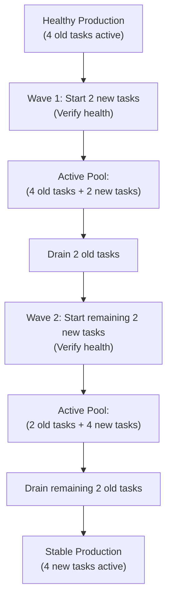

## Table of Contents

1. [The Problem](#the-problem)
2. [The Wave-Based Replacement Model](#the-wave-based-replacement-model)
3. [Resource Allocation Buffers: Minimum and Maximum healthy Percents](#resource-allocation-buffers-minimum-and-maximum-healthy-percents)
4. [Readiness Probes and Target Health Verification](#readiness-probes-and-target-health-verification)
5. [Pipeline Automation and the Circuit Breaker](#pipeline-automation-and-the-circuit-breaker)
6. [Putting It All Together](#putting-it-all-together)
7. [What's Next](#whats-next)

## The Problem

Executing software releases in production requires balancing speed with system stability. When organizations do not use structured, progressive deployment patterns, they face recurring outage vectors:

* **The Monolithic Capacity Crash**: A development team hosts an e-commerce API across ten server instances. During a midnight release, their deployment pipeline stops all ten active instances simultaneously to boot the new version. For two full minutes, the application is completely offline. Thousands of customer checkout requests fail instantly, and the system logs are flooded with gateway connection timeout errors.
* **The Boot-Stage Traffic Inundation**: A platform team updates a containerized backend. The container orchestrator reports that the new container process has started, and immediately redirects live production traffic to it. However, the application requires thirty seconds to load configuration files and establish database connections. The incoming user requests hit the uninitialized container and fail immediately, causing a massive spike in error rates before the application is ready.
* **The Silent Startup Failure**: An operator triggers a release containing a typo in a database environment variable. The orchestrator boots the new containers, stops the old ones, and finishes the deployment. Minutes later, the operator realizes that all the new containers are caught in an endless crash loop because they cannot connect to the database, leaving the entire production system down.

These failures show that production upgrades must occur gradually, verifying the health of new instances before old ones are retired.

## The Wave-Based Replacement Model

A **Rolling Deployment** solves the monolithic capacity crash by replacing old application instances with new ones gradually in controlled, sequential waves.

Rather than stopping all running servers at once, the orchestrator divides the release process into small, manageable steps. It boots a small fraction of the new version (the target revision), waits for those new instances to pass system health checks, routes traffic to them, and only then shuts down an equivalent number of old instances. This wave-based cycle repeats until 100% of the active workload is running the new code.



The fundamental benefit of this model is **Blast Radius Limitation**. If the new version carries a catastrophic startup bug, the failure is restricted to the first wave of containers. The orchestrator stops the rollout immediately, leaving the remaining old, healthy containers fully active and capable of serving the vast majority of user requests.

## Resource Allocation Buffers: Minimum and Maximum healthy Percents

To execute rolling updates safely, container orchestrators (such as Amazon ECS or Kubernetes) require administrators to define explicit **Resource Allocation Buffers**. These buffers govern how many containers can be added or terminated during the rollout.

These parameters are defined using two percentage metrics:

* **Minimum Healthy Percent**: The lower limit of active, healthy capacity that must remain running and serving traffic at any second during the deployment.
* **Maximum Percent**: The upper limit of resources that the orchestrator is allowed to provision during the upgrade window.

### Common Buffer Topologies

#### 1. The 100 / 200 Configuration (Standard Blue-Green-like Buffer)

Setting the `minimumHealthyPercent` to 100% and `maximumPercent` to 200% provides the highest level of safety. For a service with four desired tasks, the orchestrator boots four new tasks *before* terminating a single old one.

The active task pool temporarily swells to eight running tasks. Once the four new tasks pass health checks, the orchestrator drains and terminates the four old tasks, returning the service to its desired count of four. This configuration guarantees that production capacity never dips below 100% of the desired level, but it requires that your cluster has enough spare host memory and CPU capacity to double the workload temporarily.

#### 2. The 50 / 150 Configuration (Resource-Constrained Buffer)

Setting the `minimumHealthyPercent` to 50% and `maximumPercent` to 150% is used when cluster resources are constrained. For a service with four desired tasks, the orchestrator first terminates two old tasks (reducing active capacity to 50%), then boots two new tasks.

Once those two new tasks are healthy, it terminates the remaining two old tasks and boots the final two new tasks. While this configuration fits within tighter memory budgets, it temporarily reduces active production capacity by half during the replacement window, exposing the service to potential overload if traffic spikes.

### Capacity Allocation Comparison

| Topology | Min Healthy % | Max % | Spare Capacity Needed | Traffic Capacity During Rollout |
| :--- | :--- | :--- | :--- | :--- |
| **Conservative (100/200)** | 100% | 200% | Double desired resources | Guaranteed 100% |
| **Balanced (75/100)** | 75% | 100% | No extra resources | Dips to 75% (sequential replace) |
| **Resource-Constrained (50/150)** | 50% | 150% | 50% extra resources | Dips to 50% (risky for high load) |

## Readiness Probes and Target Health Verification

To prevent booting uninitialized containers into production (the boot-stage traffic inundation problem), the orchestrator must use explicit **Readiness Probes**.

A readiness probe is an automated check that queries a specific endpoint within the container filesystem or network path to confirm that the application is fully ready to accept user requests. It differs fundamentally from a liveness probe, which merely checks if the process is running.

### Structuring a Readiness Endpoint

A robust Node.js backend exposes a dedicated, lightweight `/readyz` route. Rather than simply returning an HTTP status code 200 immediately, the endpoint executes vital connection checks under the hood:

```javascript
app.get('/readyz', async (req, res) => {
    try {
        await database.ping();
        await redisCache.ping();
        await messageQueue.checkConnection();
        res.status(200).json({ status: 'READY' });
    } catch (err) {
        res.status(503).json({ status: 'UNHEALTHY', error: err.message });
    }
});
```

For JVM-based Spring Boot services, the equivalent path is managed by the Actuator framework: `/actuator/health/readiness`.

### The Load Balancer Target Group State Loop

When a new container starts, it is registered with the Application Load Balancer (ALB) target group. The load balancer walks through a strict lifecycle before routing user requests to the target:

1. **Initial**: The container has been registered but is not yet checked. No traffic is routed.
2. **Checking**: The load balancer sends HTTP requests to the configured `/readyz` endpoint at a defined interval (e.g. every 5 seconds).
3. **Healthy**: The target successfully returns HTTP 200 for a consecutive number of checks (e.g. 3 times). The load balancer begins routing production traffic to it.
4. **Draining**: The orchestrator is replacing this target. The load balancer stops sending new requests, allowing active in-flight requests to finish processing (connection draining) before terminating the container.

This loop guarantees that an application that boots but fails to initialize its database connection stays quarantined in the `initial` state, protecting users from encountering silent API failures.

## Pipeline Automation and the Circuit Breaker

Automating rolling rollouts inside a CI/CD pipeline ensures that deployments are repeatable and governed by strict feedback loops. 

A production deployment pipeline must not simply trigger the upgrade and exit. It must actively watch the rollout progress and respond to failures.

### The Deployment Circuit Breaker

Amazon ECS and Kubernetes support **Deployment Circuit Breakers**. A circuit breaker monitors the active tasks during the rollout. If the new tasks repeatedly fail their readiness probes and crash (e.g., due to a missing environment variable or bad database configuration), the circuit breaker automatically halts the deployment and reverts the service to the previous working task definition.

Let's look at a complete, clean GitHub Actions deployment workflow YAML that automates an ECS rolling update, watches its progress, and relies on the native circuit breaker for safety:

```yaml
name: Production Deployment

on:
  push:
    branches:
      - main

jobs:
  deploy:
    runs-on: ubuntu-latest
    steps:
      - name: Checkout Code
        uses: actions/checkout@v4

      - name: Configure AWS Credentials
        uses: aws-actions/configure-aws-credentials@v4
        with:
          aws-access-key-id: ${{ secrets.AWS_ACCESS_KEY_ID }}
          aws-secret-access-key: ${{ secrets.AWS_SECRET_ACCESS_KEY }}
          aws-region: us-east-1

      - name: Register New Task Definition
        id: task-def
        uses: aws-actions/amazon-ecs-render-task-definition@v1
        with:
          task-definition: task-definition.json
          container-name: orders-api
          image: 123.dkr.ecr.us-east-1.amazonaws.com/orders-api:${{ github.sha }}

      - name: Deploy Amazon ECS Task
        uses: aws-actions/amazon-ecs-deploy-task-definition@v2
        with:
          task-definition: ${{ steps.task-def.outputs.task-definition }}
          service: orders-api-prod
          cluster: production-cluster
          wait-for-service-stability: true
```

Setting `wait-for-service-stability: true` is the critical safety valve. It forces the GitHub Actions runner to block, polling the ECS API and monitoring task health. If the circuit breaker fires because the new tasks are caught in a crash loop, the step fails, alerting the engineering team instantly while the active production pool continues running the old, stable code.

## Putting It All Together

Applying the wave-based rolling replacement model, strict healthy percent configurations, and automated readiness probes solves our initial deployment vulnerabilities:

* **Monolithic Capacity Crashes**: Setting a 100/200 buffer ensures that the orchestrator boots new containers first before stopping old ones, maintaining 100% active capacity throughout the release window and eliminating downtime.
* **Boot-Stage Traffic Inundations**: Exposing a detailed `/readyz` endpoint and gating targets in `initial` state prevents the load balancer from routing traffic to containers that are not fully initialized.
* **Silent Startup Failures**: Configuring the deployment circuit breaker and setting `wait-for-service-stability: true` ensures that bad releases are caught, halted, and automatically reverted to the previous healthy task definition, keeping production stable without manual intervention.

## What's Next

While rolling deployments are highly efficient and require minimal resource overhead, they run old and new code concurrently under the same load balancer. For database-heavy architectures, this version mixing can corrupt database state if the two versions cannot share the same schema. To eliminate version mixing entirely, we must decouple environments. Let's move to **Blue-Green Deployments** to learn how to clone identical production environments and switch 100% of user traffic instantly at the router level.

---

**References**

* [Amazon ECS Service Deployment Configurations](https://docs.aws.amazon.com/AmazonECS/latest/developerguide/deployment-types.html) - Official specification on setting minimum and maximum healthy percents for rolling updates.
* [Kubernetes Documentation: Rolling Update Strategy](https://kubernetes.io/docs/concepts/workloads/controllers/deployment/#rolling-update-deployment) - Technical reference for configuring maxSurge and maxUnavailable parameters.
* [Amazon ECS Deployment Circuit Breaker](https://docs.aws.amazon.com/AmazonECS/latest/developerguide/deployment-circuit-breaker.html) - Architectural guide on automated rollbacks, threshold limits, and stability checks.
* [Elastic Load Balancing Target Health States](https://docs.aws.amazon.com/elasticloadbalancing/latest/application/target-group-health-checks.html) - Documentation on target lifecycles, initial states, and readiness checking.
