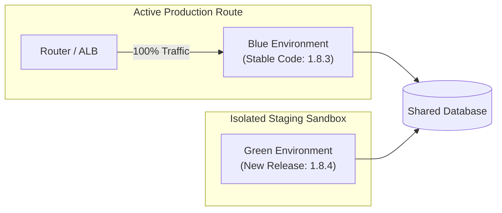
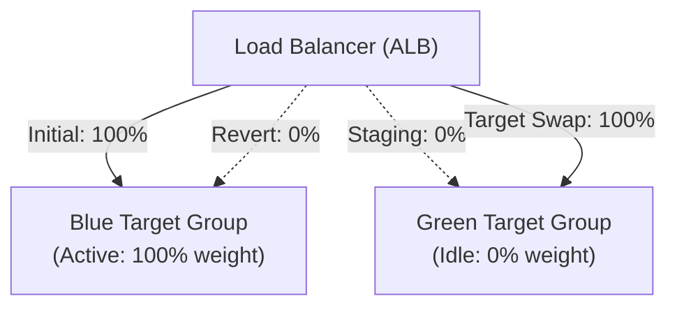
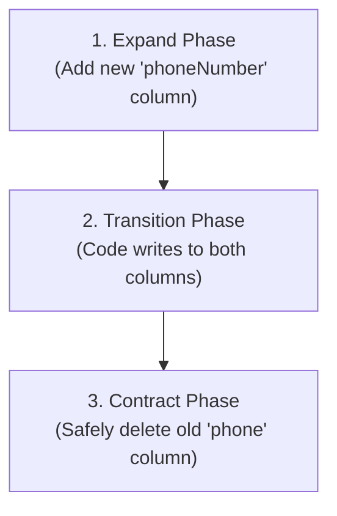

## Table of Contents

1. [The Problem](#the-problem)
2. [The Isolated Twin Environment Model](#the-isolated-twin-environment-model)
3. [Instant Router-Level Traffic Swapping](#instant-router-level-traffic-swapping)
4. [The Database Synchronization Dilemma](#the-database-synchronization-dilemma)
5. [Resource and Cost Tradeoffs](#resource-and-cost-tradeoffs)
6. [Putting It All Together](#putting-it-all-together)
7. [What's Next](#whats-next)

## The Problem

Executing rolling deployments on database-heavy applications exposes production systems to severe version conflicts. When software teams attempt to update applications running on shared state without complete environment separation, they face critical release roadblocks:

* **The Concurrent Schema Crash**: An engineering team deploys a major database-heavy update. Because rolling deployments run old and new versions side-by-side, old application tasks process incoming requests at the same time new tasks run database migrations. The old code reads a table modified by the new version's startup script, encounters an unexpected column format, throws raw runtime errors, and corrupts checkout records.
* **The Slow DNS Propagation Delay**: A platform team attempts to switch traffic to a new server cluster by updating the public DNS record pointer (`orders.example.com` $\rightarrow$ `new-ip`). Because client web browsers, mobile apps, and internet service providers aggressively cache DNS records locally, more than 30% of the active user base continues to route requests to the old, deprecated server for hours after the release.
* **The Idle Server Cost Trap**: To prevent version mixing, administrators manually maintain a second, permanently running production environment clone in their cloud account. Because this replica environment sits idle 98% of the time, the organization's monthly infrastructure bill doubles, incurring massive financial waste that is hard to justify to business stakeholders.

These failures show that production deployments require absolute version isolation, instant traffic switches, and automated, ephemeral infrastructure lifecycles.

## The Isolated Twin Environment Model

A **Blue-Green Deployment** eliminates release-window version mixing by maintaining two identical, fully isolated environment pools: **Blue** and **Green**.

Under this topology, one environment acts as the live production host, while the other serves as the isolated staging sandbox for the new release. The roles flip with every deployment.

* **Blue Environment**: The active, live production environment currently serving 100% of user traffic. In our example, it runs version `1.8.3` of the application.
* **Green Environment**: The inactive, isolated replica environment. It runs the new release candidate, version `1.8.4`.

The defining advantage of the twin-environment model is **Complete Version Isolation**. Because the Green environment has its own independent servers, caches, and system dependencies, developers can deploy, configure, and thoroughly test version `1.8.4` in Green without affecting a single live user in Blue. 

If the Green installation encounters a compilation crash, memory leak, or permission block, the live Blue environment continues to handle production traffic smoothly and with zero user impact.

## Instant Router-Level Traffic Swapping

To prevent the slow propagation delays associated with DNS record caches, Blue-Green deployments execute traffic switches instantly at the **Router or Load Balancer level**.

Rather than modifying public DNS records, the DNS entry for `orders.example.com` remains pinned permanently to a single, stable Application Load Balancer (ALB). The load balancer acts as a reverse proxy, coordinating two backend target groups (Blue and Green).

The transition occurs by executing a single target-swap command at the load balancer:

1. The platform team deploys version `1.8.4` to the Green target group.
2. Automated smoke tests validate that Green is healthy and ready.
3. The pipeline sends a command to the ALB to swap target group ports or weights, immediately routing 100% of new incoming TCP connections to the Green targets.
4. If a critical regression is discovered minutes later, the pipeline sends a reverse swap command, instantly shifting all traffic back to the stable Blue targets in milliseconds.

This instant target swap eliminates client-cached DNS propagation delays. The moment the ALB registers the route change, the next incoming HTTP request hits the new version, ensuring a clean and immediate transition.

## The Database Synchronization Dilemma

While Blue-Green deployments isolate application compute workloads, both environments must connect to the same **Shared Database** to preserve production data state. This shared state presents a severe challenge: if the new application version requires a database schema change, how do we write database updates without breaking the active old code?

If version `1.8.4` deletes a database column immediately upon deployment, the active `1.8.3` code in Blue will instantly throw raw exceptions when it tries to read that table, causing a major outage.

### The Expand-and-Contract Pattern

To safely execute migrations across isolated environments, database schemas must follow a strict, backwards-compatible lifecycle known as the **Expand-and-Contract Pattern**. This pattern splits a single schema change into three safe, progressive phases executed across separate deployments.

Let's look at how a team renames a database field from `phone` to `phoneNumber` without causing service downtime:

#### Phase 1: Expand

The database migration script *only* adds the new column (`phoneNumber`). It does not delete, alter, or rename the old column (`phone`). Both columns exist side-by-side in the database.

#### Phase 2: Transition

The application version `1.8.4` is deployed to the Green environment. The new code is written to read from `phoneNumber` if present, but default back to `phone`. Crucially, all database writes from the new code write identical data to *both* columns.

During the switch window, if the new code writes an order, both fields are populated, ensuring that if an instant rollback to Blue (`1.8.3`) is forced, the old code can read the `phone` field successfully.

#### Phase 3: Contract

Once the new version has run stably in production for several days, the platform team executes a background cleanup script to copy any missing historical data to the new column. Finally, a subsequent deployment executes the Contract phase, dropping the old `phone` column from the database.

### Expand-and-Contract Steps

| Phase | Database Schema State | Application Code Behavior | Rollback Safety |
| :--- | :--- | :--- | :--- |
| **1. Expand** | Both columns exist (`phone` & `phoneNumber`) | Old code reads/writes `phone` | 100% Safe (old code untouched) |
| **2. Transition** | Both columns exist | New code writes to both, reads new | 100% Safe (old code can read `phone`) |
| **3. Contract** | Old column (`phone`) dropped | New code reads/writes `phoneNumber` | Reverting requires database restore |

## Resource and Cost Tradeoffs

While Blue-Green deployments provide absolute safety and instant rollbacks, they require a major infrastructure tradeoff: **Resource Redundancy**.

During the deployment window, you must run double the compute resources (servers, virtual machines, container tasks) to host both environments simultaneously. If your production cluster costs $5,000 a month, maintaining a permanently running idle replica duplicates that expense to $10,000.

### The Ephemeral Infrastructure Pattern

To minimize financial waste, modern cloud architectures use **Ephemeral Infrastructure**. Rather than keeping the Green environment running permanently, the CI/CD pipeline provisions the Green environment on-demand dynamically when a release is triggered:

1. The pipeline calls cloud APIs (such as AWS CloudFormation or Terraform) to provision the Green infrastructure resources dynamically.
2. The pipeline deploys the new release candidate, executes automated checks, and performs the router target swap.
3. The old Blue environment remains active as a standby pool for a short "soak window" (e.g. 2 hours).
4. Once the soak window completes with zero alerts, the pipeline automatically de-provisions and destroys the old Blue infrastructure, returning cloud resource consumption back to a single active pool.

## Putting It All Together

By separating the production environment into Twin Blue-Green pools and executing instant router target swaps, we solve our database, DNS caching, and infrastructure cost vulnerabilities:

* **Concurrent Schema Crashes**: Adhering to the Expand-and-Contract database migration pattern guarantees that database changes remain fully backwards-compatible, allowing old and new application instances to access the shared database concurrently without crash side-effects.
* **DNS Propagation Delays**: Swapping target groups at the load balancer level ensures that all new incoming HTTP connections are routed to the Green environment in milliseconds, eliminating client-side DNS caching issues.
* **Idle Server Costs**: Utilizing on-demand ephemeral infrastructure provisioning ensures that duplicate compute resources are only billed during the active release and verification window, minimizing cloud spend.

## What's Next

While Blue-Green deployments isolate active production and ensure instant, single-click rollbacks, they operate as a binary switch: 100% of user traffic is moved to the new version at once. If the new code contains a subtle memory leak or database deadlock that only triggers under production-scale load, the entire user base encounters the failure simultaneously. To minimize this risk, we must explore progressive traffic splits. Let's move to **Canary Deployments** to learn how to route a tiny, 2% slice of real user traffic to the new version while monitoring live telemetry before promoting the release globally.

*Use this as the blue-green checklist: run full twin environments, switch traffic deliberately, avoid mixed versions, plan for database compatibility, use expand-and-contract changes, and budget for double capacity.*

---

**References**

* [AWS Whitepaper: Blue/Green Deployments on AWS](https://docs.aws.amazon.com/whitepapers/latest/blue-green-deployments/introduction.html) - Architectural patterns, DNS routing, and load balancer target group swaps on cloud environments.
* [Martin Fowler: BlueGreenDeployment Specification](https://martinfowler.com/bliki/BlueGreenDeployment.html) - Core mental models, environment cloning principles, and database handling rules.
* [Refactoring Databases: Evolutionary Database Design](https://www.agiledata.org/essays/databaseRefactoring.html) - Technical details on evolutionary schemas, Expand-and-Contract patterns, and safe migrations.
* [Application Load Balancer Target Group Swaps](https://docs.aws.amazon.com/elasticloadbalancing/latest/application/load-balancer-target-groups.html) - AWS documentation on managing port and routing weight transitions.
