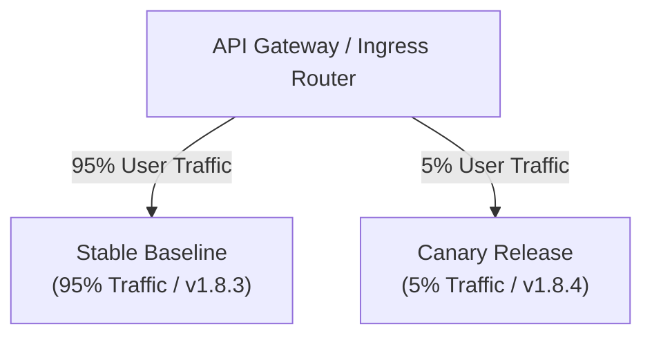

## Table of Contents

1. [The Problem](#the-problem)
2. [The Progressive Traffic Split Model](#the-progressive-traffic-split-model)
3. [Executing Weight-Based Traffic Routing](#executing-weight-based-traffic-routing)
4. [Comparing Canary Telemetry Side-by-Side](#comparing-canary-telemetry-side-by-side)
5. [Configuring Automated Metric-Based Rollbacks](#configuring-automated-metric-based-rollbacks)
6. [Putting It All Together](#putting-it-all-together)
7. [What's Next](#whats-next)

## The Problem

Deploying application updates at production scale presents engineering teams with severe latency and memory risks. When organizations attempt to roll out releases using only binary, full-traffic switches (such as standard Blue-Green swaps), they hit major delivery failure walls:

* **The Unforeseen Scale Leak**: An engineering team deploys a major search algorithm update. The build passes all local integration test suites and compiles perfectly. However, when the new code encounters real-world production search patterns, it triggers a slow, hidden memory leak. Within ten minutes, the entire application server memory exhausts, freezing the cluster and taking the site offline for all active users.
* **The Round-Robin Traffic Shock**: A platform team attempts to test a release candidate by splitting traffic. Because their legacy DNS load balancer only supports standard round-robin routing, they must split traffic 50/50. The massive rush of production traffic instantly overwhelms the new, un-warmed database cache, triggering database lock errors that affect half the user transactions.
* **The Blind Midnight Outage**: A team deploys an update at midnight, verifies a few manual browser clicks, and goes to sleep. At 2 AM, traffic volume increases, and the new version begins throwing HTTP 500 errors under specific api loads. Because the team has no automated system to monitor and respond to telemetry errors in real-time, the outage continues unnoticed until users contact support in the morning.

These operational disasters demonstrate that software releases must be tested progressively inside production using small slices of real traffic gated by automated telemetry safeguards.

## The Progressive Traffic Split Model

A **Canary Deployment** eliminates high-risk releases by routing a tiny, controlled fraction of real-world production traffic (typically 2% to 5%) to the new application version first. The name is derived from the historical practice of coal miners carrying a canary bird into tunnels; if toxic gases accumulated, the canary would succumb first, alerting the miners to evacuate immediately.

In modern software architecture, the canary version acts as the early warning signal:

* **Stable Production (Baseline)**: The verified, active application version currently serving 95% to 98% of all users.
* **Canary Release**: The new application version currently undergoing validation, serving only 2% to 5% of incoming user requests.



By isolating the exposure to a tiny traffic slice, you limit the **Blast Radius** of hidden bugs. If the new release candidate contains a memory leak or database deadlock, the failure only affects the 5% of users routed to the canary. The remaining 95% of users continue to browse, add to cart, and checkout on the stable baseline with zero disruption.

## Executing Weight-Based Traffic Routing

Splitting production traffic by precise, single-digit percentages requires advanced **Router-Level Ingress Controls**. Traditional DNS-based routing is too coarse-grained and does not support precise weight-based splits.

Platform teams use weight-based API gateways, ingress controllers, or service meshes (such as Envoy, Istio, or NGINX) to coordinate splits. The gateway reads the incoming network packets and distributes them dynamically based on configured weights.

Let's look at a Kubernetes Ingress configuration manifest that splits traffic between a stable production service (`orders-api-stable`) and a canary service (`orders-api-canary`), routing exactly 5% of traffic to the new release:

```yaml
apiVersion: networking.k8s.io/v1
kind: Ingress
metadata:
  name: orders-api-ingress
  annotations:
    nginx.ingress.kubernetes.io/canary: "true"
    nginx.ingress.kubernetes.io/canary-weight: "5"
spec:
  rules:
    - host: orders.example.com
      http:
        paths:
          - path: /
            pathType: Prefix
            backend:
              service:
                name: orders-api-canary
                port:
                  number: 80
```

Under this configuration, the Ingress controller reads the `canary-weight: "5"` annotation, automatically intercepting 5% of requests matching `orders.example.com` and proxying them to the canary container pods, while routing the remaining 95% of traffic to the stable production pool.

To ensure consistent user journeys (preventing a user from hitting version `1.8.3` on their first click and `1.8.4` on their second), gateways can configure **Sticky Sessions**. The router writes a temporary cookie to the user's browser on their first request, ensuring that they remain pinned to either the stable baseline or the canary for the duration of their session.

## Comparing Canary Telemetry Side-by-Side

Exposing the canary to real-world traffic is useless unless you actively inspect its behavior. The critical operational task is comparing the canary's live telemetry directly against the stable baseline running side-by-side in production.

Platform teams monitor four **Golden Signals** of telemetry:

1. **Latency**: The time it takes to service a request. We focus on p95 or p99 latencies to identify outlier slowness.
2. **Traffic**: The volume of requests hitting the target.
3. **Errors**: The rate of HTTP 5xx server errors or unhandled application exceptions.
4. **Saturation**: The resource consumption of the container (such as CPU, memory, and database connection pool exhaustion).

During the canary soak window (a pre-defined monitoring period, such as 30 minutes), administrators compare these metrics in a side-by-side dashboard matrix:

| Telemetry Metric | Stable Baseline (v1.8.3) | Canary Release (v1.8.4) | Verdict / Status |
| :--- | :--- | :--- | :--- |
| **HTTP 5xx Error Rate** | 0.02% | 0.03% | **Healthy** (Within baseline tolerance) |
| **p95 Request Latency** | 185ms | 580ms | **FAILED** (Canary is severely slower) |
| **Container Memory** | 210MB (Stable) | 680MB (Growing) | **FAILED** (Memory leak detected) |
| **Active Connections** | 120 | 115 | **Healthy** |

In this matrix, although the canary's error rate is perfectly healthy, its p95 latency is three times slower than the baseline, and memory usage is growing continuously. Comparing these metrics side-by-side immediately alerts the team that the release has a scale regression, allowing them to stop the rollout before users encounter general slowness.

## Configuring Automated Metric-Based Rollbacks

During a rolling or blue-green deployment, a failure requires manual operator intervention to execute a rollback. During a canary deployment, rollbacks must be completely **Automated**.

Relying on a human operator to watch dashboards and manually click buttons is too slow. If a canary begins throwing database lock errors at 3 AM, the metrics engine must detect the anomaly and automatically revert traffic in milliseconds.

Platform teams use automated metric analysis engines (such as Prometheus, Datadog, or Argo Rollouts) to enforce these gates. The engine continuously queries the metrics database, evaluating the canary's health against strict, pre-defined rules.

Let's look at an automated canary rollback rule declared in a YAML configuration. If the HTTP 5xx error rate on the canary exceeds 1% for two consecutive minutes, the engine aborts the release instantly:

```yaml
apiVersion: argoproj.io/v1alpha1
kind: AnalysisTemplate
metadata:
  name: success-rate-check
spec:
  metrics:
  - name: success-rate
    interval: 30s
    successCondition: result[0] >= 0.99
    failureLimit: 3
    provider:
      prometheus:
        address: http://prometheus.monitoring.svc:9090
        query: |
          sum(rate(http_requests_total{status!~"5.*",job="orders-api-canary"}[2m]))
          /
          sum(rate(http_requests_total{job="orders-api-canary"}[2m]))
```

The analysis template runs continuously in the background. If the Prometheus query returns a success rate below 99% three times (`failureLimit: 3`), the controller automatically halts traffic scaling, sets the canary weight to 0%, and sends an alert. The release is fully aborted with zero operator intervention.

## Putting It All Together

Applying progressive traffic splits, weight-based ingress controls, side-by-side telemetry comparisons, and automated rollback templates solves our initial production release risks:

* **Unforeseen Scale Leaks**: Isolating initial traffic exposure to 5% limits the blast radius of hidden memory leaks. The error is isolated to the canary pool, while 95% of active production continues running stably.
* **Round-Robin Traffic Shocks**: Implementing weight-based API gateways allows routing precise, low-percentage traffic slices (e.g. 2%) to the new containers, protecting un-warmed database caches from being overwhelmed.
* **Blind Outages**: Configuring automated Prometheus analysis templates ensures that anomalies are caught instantly in real-time, triggering automated, sub-second traffic rollbacks even during off-hours.

## What's Next

Canary deployments represent the pinnacle of automated, telemetry-driven release safety inside production. However, regardless of whether you choose Rolling, Blue-Green, or Canary deployments, releases will eventually encounter failures that require immediate decision-making under pressure. When an outage occurs, how do we decide whether to execute an instant rollback or attempt to compile a hotfix patch on the fly? Let's move to **Rollback vs. Roll-Forward** to study the operational frameworks, MTTR rules, and backwards-compatible database schema gates needed to manage failures safely.

---

**References**

* [Istio Service Mesh: Traffic Management and Canary Releases](https://istio.io/latest/docs/tasks/traffic-management/dev-routing/) - Developer guide on configuring virtual services, weight-based destination rules, and header splits.
* [NGINX Ingress Controller: Canary Annotations](https://kubernetes.github.io/ingress-nginx/user-guide/nginx-configuration/annotations/#canary) - Structural documentation on using weight-based and cookie-sticky canary routing.
* [Argo Rollouts: Progressive Delivery on Kubernetes](https://argoproj.github.io/argo-rollouts/) - Architectural reference for declarative canary steps, Prometheus metrics polling, and automated analysis runs.
* [Site Reliability Engineering: Monitoring Distributed Systems](https://sre.google/sre-book/monitoring-distributed-systems/) - The "Four Golden Signals" telemetry framework, p95/p99 latency calculations, and baseline comparison rules.
