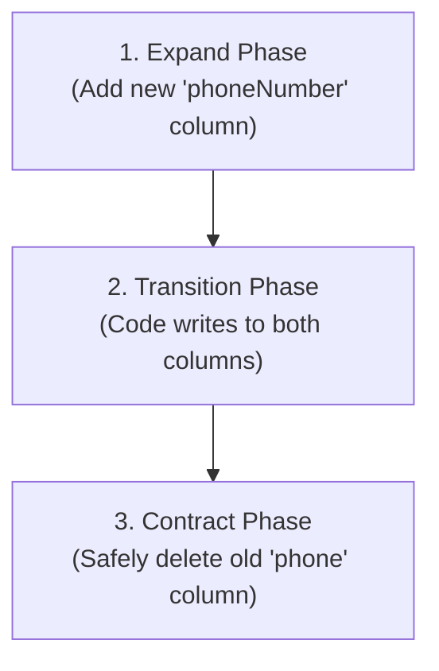

## Table of Contents

1. [The Problem](#the-problem)
2. [The Revert vs. Patch Response Conflict](#the-revert-vs-patch-response-conflict)
3. [Mean Time to Recovery (MTTR) as the Primary Metric](#mean-time-to-recovery-mttr-as-the-primary-metric)
4. [The Database Schema Rollback Trap](#the-database-schema-rollback-trap)
5. [Writing Backwards-Compatible Migrations](#writing-backwards-compatible-migrations)
6. [Putting It All Together](#putting-it-all-together)
7. [What's Next](#whats-next)

## The Problem

Managing software failures in a live production environment forces engineering teams to make high-pressure technical decisions under strict time limits. When teams do not have established, metric-governed response playbooks, they hit critical operational failures:

* **The Frantic Hotfix Outage Extension**: A new backend release causes payment transactions to fail with raw database errors. Rather than immediately reverting the deployment, the development team spends three hours debugging the code, writing a local patch, waiting for the CI pipeline to compile it, and deploying a hotfix. The hasty hotfix compiles successfully but introduces a second, worse memory crash, extending a 10-minute outage into a 4-hour catastrophe.
* **The Destructive Database Rollback**: A platform team rolls back a buggy server deployment to the last stable release. However, the new deployment's startup routine had already deleted a crucial database column. The stable, reverted code boots, attempts to read the dropped column, crashes instantly, and leaves the database in a partially corrupted state with no simple way to recover.
* **The Analysis Paralysis Deadlock**: During a morning traffic surge, API response latencies triple. Rather than taking action to protect user capacity, the operations team spends forty minutes debating the root cause in a chat room, while thousands of customer transactions time out, severely damaging the brand's reliability.

These operational crises demonstrate that incident response must prioritize instant service restoration over immediate bug diagnosis.

## The Revert vs. Patch Response Conflict

When an application fails in production, the response team must choose between two mutually exclusive recovery pathways: **Rollback (Revert)** and **Roll-Forward (Patch)**.

### Rollback (Revert)

A Rollback instantly reverts the system state to the last known healthy release. This is accomplished by redirecting traffic at the load balancer level back to the old, active standby containers, or by redeploying the previous, verified container image.

The core advantage of a rollback is **Immediacy and Predictability**. Because the old version was already thoroughly tested and ran stably in production, reverting to it is guaranteed to restore service health instantly without introducing new, unreviewed code variables.

### Roll-Forward (Patch)

A Roll-Forward leaves the buggy release active in production while the development team frantically debugs the error, writes a code fix, compiles a new container image (`1.8.5`), and deploys it to overwrite the failing version (`1.8.4`).

Rolling forward is highly risky. Writing code under intense pressure during an active outage frequently leads to syntax errors, missed edge cases, and incomplete testing, which often introduces secondary failures.

### Outage Recovery Strategy Comparison

| Strategy | Restoration Speed | Risk Level | Code Stability | Database Dependency |
| :--- | :--- | :--- | :--- | :--- |
| **Rollback (Default)** | Seconds to Minutes | Extremely Low | Guaranteed Stable | Requires backwards-compatible schema |
| **Roll-Forward (Exceptions)** | Hours | High | Unpredictable (hasty code) | Compatible with forward-only schema |

## Mean Time to Recovery (MTTR) as the Primary Metric

In modern site reliability engineering (SRE), the ultimate metric governing incident response is **Mean Time to Recovery (MTTR)**. MTTR is the average time required to repair a failed system and restore full service capacity to users.

During an active production outage, the SRE team's single priority is to minimize MTTR. Restoration of service takes absolute priority over finding the root cause of the bug. Debugging is a post-incident exercise.

To enforce this SRE discipline, platform teams establish a strict **Ten-Minute Revert Rule**:

1. An outage is detected.
2. The team has exactly ten minutes to identify and fix the issue (e.g. correcting a simple environment variable or restarting a stalled service).
3. If the service is not restored within ten minutes, the team is strictly prohibited from further debugging. A rollback to the last known stable release is immediately forced.

 re-routing traffic first stabilizes production, returning users to a healthy experience. The development team can then debug the buggy container image inside the safety of the staging sandbox with zero active customer impact.

## The Database Schema Rollback Trap

While compute workloads (application servers) can be reverted instantly in milliseconds, **Data State (Databases) Cannot**. This asymmetry creates the dangerous "Database Schema Rollback Trap."

When a new application version (`1.8.4`) is deployed, its startup routine often executes database migrations—adding tables, deleting old columns, or changing data types. If version `1.8.4` deletes a database column immediately upon deployment, the active database schema is modified irreversibly. 

If a rollback is subsequent forced, the old code (`1.8.3`) is redeployed. The old code boots, attempts to execute an SQL query referencing the dropped column, and immediately crashes with a database exception:

```text
ERROR: Column "phone" does not exist in table "customers"
FATAL: Application failed to initialize database connection.
```

The database mismatch makes a standard code rollback useless. The team is caught in a deadlock: the new code is buggy, but the old code cannot run on the modified database. Reversing the database change requires a slow, high-risk restore from backup, extending the outage for hours.

## Writing Backwards-Compatible Migrations

To escape the database rollback trap, platform teams must strictly prohibit destructive migrations. Database schema changes must be designed to be completely **Backwards-Compatible**, ensuring that the old code (`1.8.3`) and new code (`1.8.4`) can read and write to the database concurrently.

This is accomplished using the **Expand-and-Contract Pattern**, which decomposes a single logical database change into multiple safe, progressive steps spread across separate releases.

### Renaming a Column: Step-by-Step

Let's look at the safe, backwards-compatible way to rename a database field from `phone` to `phoneNumber` without causing service downtime or blocking rollbacks:



#### Step 1: The Expand Release (Release A)

1. The migration script *only* adds the new column (`phoneNumber`). It does not delete, alter, or rename the old column (`phone`). Both columns exist side-by-side in the database.
2. The SQL migration is safe and non-blocking:
   ```sql
   ALTER TABLE customers ADD COLUMN phone_number VARCHAR(20);
   ```

#### Step 2: The Transition Release (Release B)

1. The new application version (`1.8.4`) is deployed to production.
2. The new code is written to read from `phoneNumber` if present, but default back to `phone`. Crucially, all database writes from the new code write identical data to *both* columns.
3. If a rollback to `1.8.3` is forced, the old code can read the `phone` field successfully because it was never deleted and contains the latest data written by the new code.

#### Step 3: The Contract Release (Release C)

1. Once version `1.8.4` has run stably in production for several days, a background script is executed to backfill any historical database records, copying old `phone` values to `phoneNumber`.
2. A subsequent, separate deployment executes the Contract phase, dropping the old `phone` column from the database:
   ```sql
   ALTER TABLE customers DROP COLUMN phone;
   ```

At this point, the migration is complete. If a rollback is forced during the crucial Release B window, the old code runs perfectly, eliminating the schema rollback trap completely.

## Putting It All Together

By prioritizing MTTR, enforcing the 10-minute revert rule, and designing backwards-compatible database migrations, we build a highly resilient incident response framework:

* **Frantic Hotfixes**: Enforcing the strict 10-minute revert rule ensures that failing deployments are reverted instantly to a known stable version, preventing teams from writing hasty, untested code patches under pressure.
* **Destructive Database Rollbacks**: Adhering to the Expand-and-Contract database migration pattern guarantees that database changes remain fully backwards-compatible, allowing old and new application instances to access the database concurrently without database mismatch exceptions.
* **Analysis Paralysis**: Prioritizing MTTR over root cause analysis ensures that operators focus entirely on restoring user capacity first, deferring debugging to a safe post-incident post-mortem window.

## What's Next

Executing safe rollbacks and migrations requires a highly reliable, standardized pipeline promotion flow. If the compiled code binary or container image is not identical across staging and production, environment drift will introduce new, unexpected variables that make rollbacks unpredictable. Let's move to **Environment Promotion** to learn how to enforce the "Build Once, Run Everywhere" golden rule and design progressive quality gates across staging and production.

---

**References**

* [Google Site Reliability Engineering: Accelerating Recovery](https://sre.google/sre-book/accelerating-recovery/) - SRE principles on MTTR optimization, rollback triggers, and mitigating blast radius.
* [Refactoring Databases: Evolutionary Database Design](https://www.agiledata.org/essays/databaseRefactoring.html) - Structural guidelines on expand-contract database migrations and backwards-compatible schemas.
* [Twelve-Factor App: Dev/Prod Parity](https://12factor.net/dev-prod-parity) - Principles on maintaining identical runtimes and environments to enable predictable rollbacks.
* [AWS DevOps Blog: Safe Database Migrations](https://aws.amazon.com/blogs/devops/safe-database-migrations-with-aws-code-deploy/) - Technical implementations of blue-green database transitions and safe schema rollbacks.
