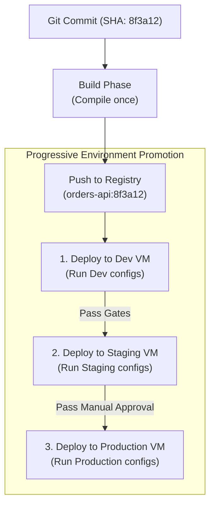

## Table of Contents

1. [The Problem](#the-problem)
2. [The Build Once, Run Everywhere Golden Rule](#the-build-once-run-everywhere-golden-rule)
3. [Managing Stateless Artifacts with Runtime Injection](#managing-stateless-artifacts-with-runtime-injection)
4. [Designing Progressive Promotion Pipelines](#designing-progressive-promotion-pipelines)
5. [Artifact Registry Promotion Paths](#artifact-registry-promotion-paths)
6. [Putting It All Together](#putting-it-all-together)
7. [What's Next](#whats-next)

## The Problem

Managing software configurations and deployments across multiple staging environments exposes platform teams to severe environmental drifts. When organizations do not enforce strict progressive promotion constraints, they hit critical operational failures:

* **The Separate-Compilation Drift Crash**: A developer compiles their application from source code on their local laptop and deploys it to a staging server, where all tests pass. To deploy to production, they execute the compilation command a second time on the production build machine. However, the production compiler uses a slightly different version of a helper library dependency. The resulting binary contains an incompatible dependency drift, crashing the production site at startup.
* **The Hardcoded Staging Credentials Trap**: A team builds a compiled Java application. To simplify local tests, they hardcode the staging database connection strings and passwords directly inside the compiled binary payload. When the release is promoted to production, the application attempts to write to the staging database, leaking production user checkout records to staging tables.
* **The Unrestricted Automatic Release**: A developer merges a experimental bugfix into the default repository branch on Friday afternoon. The CI/CD pipeline instantly builds and automatically deploys the unreviewed code directly to production. The experimental patch breaks the application's login system, triggering an emergency weekend outage that could have been blocked by progressive quality gates.

These failures show that binaries must be compiled exactly once, kept completely stateless, and promoted through strict, gated environments.

## The Build Once, Run Everywhere Golden Rule

The fundamental rule of modern release engineering is: **Build Once, Run Everywhere**. 

Under this rule, compiling code is strictly restricted to the very first phase of the CI/CD pipeline (the Continuous Integration stage). The compiler packages the source code, libraries, and assets into a single, immutable artifact (such as a compiled binary or Docker container image). This specific artifact is assigned a unique, immutable identifier (typically the Git commit SHA or a cryptographically secure image digest).

Once this immutable artifact is built, it is pushed to a central **Artifact Registry** (such as AWS ECR, Docker Hub, or JFrog Artifactory). 



The golden rule dictates that **we never compile the code a second time** when promoting the release from dev to staging, or from staging to production. We pull the *exact same binary payload* that was validated in staging and deploy it to production. This guarantees absolute binary parity: the code running in production is 100% identical to the code that passed integration and QA test suites in staging.

## Managing Stateless Artifacts with Runtime Injection

If a compiled artifact is completely immutable and identical across all environments, how does it connect to different staging databases, external APIs, and cloud services? 

To achieve environment parity, applications must remain completely **Stateless** and generic. This aligns with the Twelve-Factor App methodology: **Store config in the environment**.

The compiled binary or container must not contain hardcoded configurations, connection hosts, or passwords. Instead, the application is written to read all external settings from standard **Environment Variables** injected dynamically by the host operating system or container orchestrator at the exact second the runtime process starts.

```text
Host Environment (e.g. AWS ECS / K8s) ──(Injects Environment Vars)──> App Container (Stateless Binary)
  Inject: DB_HOST = "db-prod.internal.net"
  Inject: API_KEY = "prod-key-123"
```

Let's look at the correct Twelve-Factor configuration pattern in a Node.js server setup. Rather than hardcoding database ports or environments, the server initialization reads variables dynamically:

```javascript
const databaseConfig = {
    host: process.env.DB_HOST,
    port: parseInt(process.env.DB_PORT || '5432'),
    username: process.env.DB_USER,
    password: process.env.DB_PASSWORD,
    environment: process.env.NODE_ENV
};
```

Using this pattern, the exact same container image can be booted in the Dev subnet (where the orchestrator injects `DB_HOST=dev-db`), the Staging subnet (injecting `DB_HOST=staging-db`), and the Production subnet (injecting `DB_HOST=prod-db`), completely separating configuration state from application code.

## Designing Progressive Promotion Pipelines

Promoting a single, stateless artifact requires a structured **Progressive Promotion Pipeline** that moves the binary through increasingly strict quality environments.

A production-grade pipeline enforces progressive delivery using three distinct gates:

1. **Dev/QA Soak Gate**: The artifact is automatically deployed to the Dev environment immediately upon building. It must run successfully and pass automated API integration suites.
2. **Staging Verification Gate**: The artifact is automatically promoted to Staging. It is subjected to load testing, performance profiling, and vulnerability security scans.
3. **Production Manual Approval Gate**: Promotion from Staging to Production must be blocked by an explicit manual approval gate. A release manager or senior developer must manually sign off on the release in the pipeline interface before the orchestrator initiates the production rollout.

Let's look at a complete, production-ready GitHub Actions workflow YAML. This pipeline implements the Build Once, Run Everywhere rule, configures progressive environment promotion, scopes specific environment secrets, and blocks production deployment with an explicit manual approval gate:

```yaml
name: Progressive Promotion Pipeline

on:
  push:
    branches:
      - main

jobs:
  build:
    name: Build & Package
    runs-on: ubuntu-latest
    outputs:
      image_tag: ${{ steps.vars.outputs.sha_short }}
    steps:
      - name: Checkout Code
        uses: actions/checkout@v4

      - name: Set Image Tag Output
        id: vars
        run: echo "sha_short=$(git rev-parse --short HEAD)" >> $GITHUB_OUTPUT

      - name: Build and Push Docker Image
        run: |
          docker build -t registry.internal.net/orders-api:${{ steps.vars.outputs.sha_short }} .
          docker push registry.internal.net/orders-api:${{ steps.vars.outputs.sha_short }}

  deploy-staging:
    name: Staging Promotion
    needs: build
    runs-on: ubuntu-latest
    environment: staging
    steps:
      - name: Deploy Staging Workload
        run: |
          echo "Deploying image orders-api:${{ needs.build.outputs.image_tag }} to Staging"
          # Injects STAGING environment secrets (e.g. staging DB_HOST)
          # Execute Helm or Kustomize rollout commands here

  deploy-production:
    name: Production Promotion
    needs: [build, deploy-staging]
    runs-on: ubuntu-latest
    environment: production # Triggers manual approval and environment protection rules
    steps:
      - name: Deploy Production Workload
        run: |
          echo "Deploying verified image orders-api:${{ needs.build.outputs.image_tag }} to Production"
          # Injects PRODUCTION environment secrets (e.g. production DB_HOST)
          # Execute production rolling target update commands here
```

### The Environment Safety Valve

Notice the `environment: production` parameter inside the final deployment job. In GitHub, GitLab, and other modern CI/CD systems, linking a job to a protected `environment` automatically triggers platform-level safety rules:

* **Manual Reviewers**: The pipeline halts execution at the end of the `Staging Promotion` phase, sending an email and Slack alert to the release team. The `Production Promotion` job remains paused until an authorized reviewer clicks the `Approve` button.
* **Wait Timers**: Configures a minimum soak delay (e.g. 30 minutes) during which the artifact must run stably in staging before the production gate can be unlocked.

## Artifact Registry Promotion Paths

When managing container images, platform teams often use **Artifact Registry Tag Promotion** to represent the maturity of a release.

Rather than copying heavy image files across separate registries, the image is stored in a single, secure private registry. The maturity of the image is declared by updating its logical tags:

```text
1. Image Pushed  ──>  orders-api:sha-8f3a12
2. Staging Pass  ──>  orders-api:sha-8f3a12  ──(Add Tag)──>  orders-api:staging-latest
3. Reviewer OK   ──>  orders-api:sha-8f3a12  ──(Add Tag)──>  orders-api:prod-ready
```

Tag promotion provides three key operational benefits:

1. **Immutable Audit Trail**: The primary tag (`sha-8f3a12`) remains unchanged, guaranteeing that we can always track the compiled image back to the exact Git commit that produced it.
2. **Simplified Pull Policies**: Edge clusters can be configured to pull the `prod-ready` tag dynamically during emergency rollouts, ensuring they always fetch the latest approved release without needing manual image ID updates.
3. **Secure Namespace Segregation**: Separate registries or namespaces can be locked down with IAM rules, ensuring that production servers can only pull images carrying the cryptographically signed `prod-ready` signature.

## Putting It All Together

Enforcing the Build Once, Run Everywhere rule, progressive promotion gates, and stateless runtime configurations solves our environmental drift and release risk:

* **Separate-Compilation Drifts**: Compiling the binary exactly once during the initial CI stage guarantees that the code running in production is physically identical to the code that passed QA verification in staging, eliminating compiler environment drift.
* **Hardcoded Staging Credentials**: Separating configurations from the application using the Twelve-Factor App methodology ensures that database connection hosts and passwords are fully generic, injected dynamically by the orchestrator at runtime.
* **Unrestricted Releases**: Utilizing progressive promotion pipelines blocked by explicit manual approvals and staging soak timers prevents experimental or unreviewed code from bypassing release gates.

## What's Next

Now that we have automated the progressive promotion of stateless, immutable artifacts across gated environments, we face the final operational hurdle: **Human Execution Coordination**. While our CI/CD pipelines automate code packaging and environment gates, complex release windows often involve manual database checks, external API coordination, and post-deployment manual verification loops. Let's move to **Deployment Runbooks** to learn how to capture, version-control, and automate release procedures using executable, idempotent runbooks.


*Use this as the promotion checklist: move one artifact through environments, inject runtime config, gate dev and staging, require production approval, and promote through registries without rebuilding.*

---

**References**

* [The Twelve-Factor App: III. Config](https://12factor.net/config) - Standard specifications on storing configurations and credentials within environment variables.
* [GitHub Actions Documentation: Protecting Environments](https://docs.github.io/en/actions/deployment/targeting-different-environments/using-environments-for-deployment) - Official guide on manual approval gates, deployment reviewers, and wait timers.
* [Continuous Delivery: Reliable Software Releases](https://refactoring.com/books/continuousDelivery.html) - SRE reference book on progressive promotion paths, binary parity, and artifact registries.
* [Twelve-Factor App: X. Dev/prod parity](https://12factor.net/dev-prod-parity) - Keeping development, staging, and production as similar as possible to enable predictable rollbacks.
