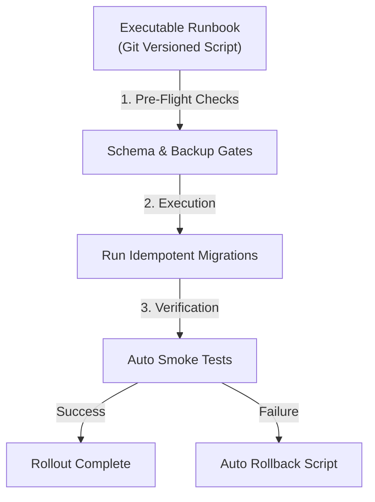

## Table of Contents

1. [The Problem](#the-problem)
2. [The Failure of Informal Text Checklists](#the-failure-of-informal-text-checklists)
3. [The Concept of the Executable Runbook](#the-concept-of-the-executable-runbook)
4. [Designing Idempotent Deployment Scripts](#designing-idempotent-deployment-scripts)
5. [Automating Post-Deployment Verification (Smoke Tests)](#automating-post-deployment-verification-smoke-tests)
6. [Pre-Flight and Post-Flight Checklists in Version Control](#pre-flight-and-post-flight-checklists-in-version-control)
7. [Putting It All Together](#putting-it-all-together)

## The Problem

Coordinating complex software releases across distributed staging and production infrastructures introduces severe human and scheduling variables. When engineering organizations rely on informal, undocumented, and manual release procedures, they encounter critical operational failures:

* **The Out-of-Order Migration Outage**: A development group coordinates a complex database migration at midnight. The release instructions are written in an informal shared document. Under pressure, the operator accidentally skips step four (disabling database table write-locks) and executes step five (running the column transition script) out of order. The table locks immediately, database connections exhaust, and the active production service crashes, corrupting checkout records.
* **The Blind Pipeline Green-Light**: A CI/CD deployment pipeline executes successfully, and the dashboard marks the deployment green. However, because the system has no automated verification checks, no one realizes that a minor network routing typo has blocked the backend API container port. Users are greeted with connection gateway timeout errors, while the operations team remains unaware of the outage for thirty minutes because the core container process itself is technically running.
* **The Missing Backup Disasters**: A platform team triggers a major schema update. Halfway through the migration, the database host crashes. The team attempts to roll back but discovers that the pre-deployment backup script was never executed because the manual release checklist forgot to declare a backup confirmation gate.

These crises demonstrate that release procedures must be codified as version-controlled, repeatable, and executable code.

## The Failure of Informal Text Checklists

In the early years of system administration, deployments were guided by text-based checklists stored in shared wikis, emails, or text files. The release process involved an operator SSHing into a server, copy-pasting commands from the document, and manually checking off items.

This practice introduces three severe operational failures:

1. **Human Misinterpretation**: A command written as `rm -rf cache/*` is easily mistyped by a tired operator at 2 AM as `rm -rf cache *`, which deletes the entire root application directory. Loose text instructions depend heavily on the operator's experience and stress levels.
2. **Configuration Parity Drift**: The shared text document is rarely tested in staging. Over time, the commands listed in the wiki drift from the actual code base dependencies and server variables, leading to unexpected command failures during live releases.
3. **No Rollback Validation**: Text checklists focus almost entirely on the "happy path" of forward progress. They rarely document the exact command sequences needed to revert changes if a specific step fails, leaving operators to improvise under high-stress outage conditions.

To eliminate human error, release steps must be taken out of human hands. We must transition from descriptive documents to **Executable Runbooks**.

## The Concept of the Executable Runbook

An **Executable Runbook** is a version-controlled, automated script or configuration manifest committed directly to the application repository. It defines every operational step—pre-flight checks, database migrations, configuration changes, and rollback paths—in code.

Under this model, the human operator does not copy-paste commands manually. The operator triggers a single execution command or runs a CI/CD job that executes the runbook script.



### The Rule of Idempotency

The absolute requirement of any executable runbook script is **Idempotency**. An operation is idempotent if running it multiple times yields the exact same system state without causing side-effects, errors, or data corruption.

If a runbook script is interrupted halfway through due to a network blip, the operator must be able to re-run the exact same script from the beginning. The script must inspect the active system state and safely skip already-completed steps without attempting to recreate existing databases or duplicate records.

Let's look at the difference between a fragile, non-idempotent script and a robust, idempotent script in shell execution:

#### Non-Idempotent (Fragile)

```bash
# Will crash if folder already exists, halting the entire pipeline
mkdir production_cache
tar -xf assets.tar.gz -C production_cache/
```

#### Idempotent (Safe & Re-runnable)

```bash
# Safe to run repeatedly; checks state before taking action
if [ ! -d "production_cache" ]; then
    mkdir -p production_cache
fi
tar --skip-old-files -xf assets.tar.gz -C production_cache/
```

Writing runbooks using idempotent tools (such as Ansible, Terraform, or robust shell checks) ensures that deployments can recover gracefully from transient infrastructure interruptions.

## Automating Post-Deployment Verification (Smoke Tests)

A pipeline is not complete when the container orchestrator reports that the task is running. To guarantee delivery safety, the runbook must execute automated **Smoke Tests** immediately post-rollout before releasing the pipeline.

A smoke test is a fast, automated test suite that queries the live production endpoints to verify that all vital application components are fully functional:

* **Internal Port Check**: Confirms the container is listening on the expected port.
* **Database Write Check**: Executes a temporary database write and read to verify database connection pool viability.
* **External API Handshake**: Validates that external payment or messaging API gateways are reachable.

Let's look at a clean, idempotent shell script that executes an automated post-deployment smoke test immediately after a release:

```bash
#!/bin/bash
set -euo pipefail

TARGET_URL="https://orders-api.example.com/health"
MAX_ATTEMPTS=5
TIMEOUT_SEC=5

echo "Starting post-deployment smoke tests against ${TARGET_URL}..."

for ((attempt=1; attempt<=MAX_ATTEMPTS; attempt++)); do
    # Queries the live health API check
    RESPONSE=$(curl --silent --show-error --write-out "%{http_code}" --max-time "$TIMEOUT_SEC" "$TARGET_URL" -o /dev/null || true)
    
    if [ "$RESPONSE" -eq 200 ]; then
        echo "SUCCESS: Smoke test passed on attempt ${attempt}."
        exit 0
    else
        echo "WARNING: Attempt ${attempt}/${MAX_ATTEMPTS} returned HTTP ${RESPONSE}. Retrying..."
        sleep 5
    fi
done

echo "ERROR: Smoke tests FAILED after ${MAX_ATTEMPTS} attempts."
exit 1
```

Integrating this script into the deployment pipeline ensures that if the new containers are running but cannot reach the database, the smoke test fails, halting the pipeline and triggering an automated rollback before real users ever encounter the issue.

## Pre-Flight and Post-Flight Checklists in Version Control

While scripts automate execution, certain manual coordination tasks (such as business sign-offs, marketing alerts, or third-party provider calls) cannot be fully coded. 

To bridge this gap, platform teams commit structured, version-controlled **Pre-Flight and Post-Flight Checklists** inside the application repository as markdown files (`docs/releases/release-playbook.md`).

An operational release checklist must be highly specific, structured, and auditable:

### Pre-Deployment Checklist (Pre-Flight)

* `[ ]` **Backup Verification**: Verify that the automated pre-migration database snapshot was created successfully and is healthy.
* `[ ]` **Schema Compatibility**: Confirm that the database expand schema script has been pre-run and verified on the staging environment.
* `[ ]` **Secrets Audit**: Confirm that all new environment variables required by the new release are registered in the production secrets vault.

### Post-Deployment Checklist (Post-Flight)

* `[ ]` **Smoke Test Validation**: Confirm that the automated smoke test suite executed successfully with zero error exits.
* `[ ]` **Telemetry Soak**: Monitor the stable p95 latency and 5xx error rate comparison dashboards for exactly 15 minutes post-swap.
* `[ ]` **Idle Tear-down**: De-provision and destroy the inactive staging/Blue environment to prevent resource waste.

Committing this playbook alongside the code ensures that the release checklists are subjected to code review, remain perfectly in sync with the codebase state, and are tested thoroughly in staging replica environments before ever being executed in production.

## Putting It All Together

Centralizing release operations inside Git-versioned executable runbooks and automated smoke-test verification suites resolves our manual release risks:

* **Out-of-Order Migration Outages**: Abstracting database migrations and configuration changes into Git-managed, idempotent scripts ensures that commands execute in the exact correct order every time, eliminating manual human typing mistakes.
* **Blind Pipeline Green-Lights**: Integrating automated curl-based smoke tests immediately post-deployment ensures that network blocks or startup connection failures are caught instantly, halting the pipeline and triggering rollbacks before user traffic is exposed.
* **Missing Database Backups**: Enforcing structured pre-flight check gates inside version-controlled markdown playbooks guarantees that database snapshots are confirmed healthy before any migration commands execute.

---

**References**

* [Google Site Reliability Engineering: Automation](https://sre.google/sre-book/automation/) - SRE principles on eliminating manual toil, writing idempotent scripts, and building executable runbooks.
* [Ansible Documentation: Idempotency](https://docs.ansible.com/ansible/latest/reference_appendices/glossary.html) - Technical definitions and practices for building idempotent, repeatable server playbooks.
* [Continuous Delivery: Deployment Pipelines](https://refactoring.com/books/continuousDelivery.html) - Standard guides on automating post-deployment smoke tests and release gate orchestrations.
* [OWASP: Pre-Deployment Security Checklist](https://owasp.org/www-project-web-security-testing-guide/) - Guidelines on pre-flight security validations, backup audits, and permission gates during releases.
