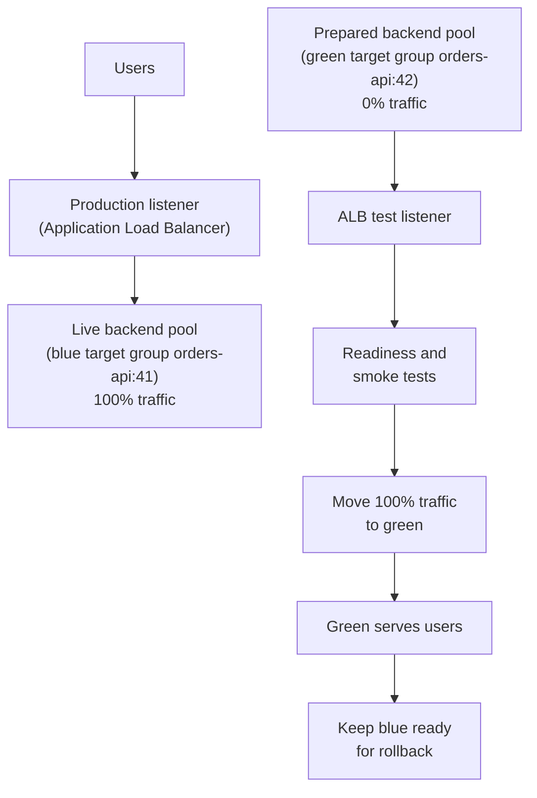

## Table of Contents

1. [What Blue-Green Solves](#what-blue-green-solves)
2. [The Example: Blue and Green Task Sets](#the-example-blue-and-green-task-sets)
3. [Testing Green Before Users Reach It](#testing-green-before-users-reach-it)
4. [Switching Traffic](#switching-traffic)
5. [Rollback Is a Traffic Decision](#rollback-is-a-traffic-decision)
6. [Failure Modes to Watch](#failure-modes-to-watch)
7. [Blue-Green vs. Rolling](#blue-green-vs-rolling)
8. [Speed vs. Cost](#speed-vs-cost)

## What Blue-Green Solves

Rolling deployments are careful, but they still change the live path while users are using it.
For a while, production is mixed.
Some traffic reaches the old version.
Some traffic reaches the new version.

That mixed state is often fine.
Many backend APIs can run old and new versions side by side.
But some releases need a cleaner switch.
Maybe the new version needs a full warmup before traffic.
Maybe the team wants to test the whole replacement before any user reaches it.
Maybe rollback needs to be a simple traffic decision.

A **blue-green deployment** solves that by keeping two production-ready targets.
Blue is the current live target.
Green is the replacement target.
You deploy the new release to green while blue keeps serving users.
You test green.
When green looks good, you switch traffic from blue to green.

The key idea is simple:

> Build the next production beside the current production, then switch which one receives users.

In this article, the target is a Node.js backend called `devpolaris-orders-api`.
We use Amazon ECS on Fargate with AWS CodeDeploy as the concrete deployment surface.
CodeDeploy can create a replacement ECS task set, connect it to a second Application Load Balancer target group, test it through a test listener, and then move production traffic.
The same pattern also works on many app platforms:
one task set, service, or environment is live while another one is prepared.

Some runtimes need more time before the replacement is trustworthy.
For example, a Spring Boot app may need the JVM, application context, and database pool to finish warming up before the green side should receive public traffic.

## The Example: Blue and Green Task Sets

`devpolaris-orders-api` handles checkout requests.
The current production version is `1.8.3`.
The new release, `1.8.4`, changes discount validation and adds a new response field for order totals.

The service starts in a blue state:

```text
service:
  orders-api-prod

public URL:
  https://orders-api.devpolaris.example

blue task set:
  task definition: orders-api:41
  target group: orders-api-blue-tg
  version: 1.8.3
  image digest: sha256:2b91fe0a7a61
  traffic: 100%

green task set:
  name: not deployed yet
  task definition: orders-api:42
  target group: orders-api-green-tg
  version: 1.8.4
  image digest: sha256:9c1cfbb322f6f2b8f8cc4d2b9f9e6b77c92c8da7ad9226110f0cf0c30a2a7f54
  traffic: 0%
```

Blue and green are labels.
They are not special product features by themselves.
The important part is that one target is live while the other target is prepared.

The traffic switch looks like this:



Everything before the switch is about making green trustworthy.
Everything after the switch is about proving users are healthy and keeping blue ready long enough for rollback.

## Testing Green Before Users Reach It

Before green receives public traffic, it should be reachable through a test listener or private test URL.
That is what makes blue-green useful.
You are not testing green by sending customers there first.
You are testing green directly while blue continues to serve the public URL.

With ECS blue-green, CodeDeploy reads an AppSpec file.
That file tells CodeDeploy which task definition should become the replacement task set and which container port the load balancer should send traffic to.
You do not need to memorize this file yet.
Read it as a short message to CodeDeploy:
"make `orders-api:42` the replacement, and send load balancer traffic to port `8080` inside the container."

```yaml
version: 1
Resources:
  - TargetService:
      Type: AWS::ECS::Service
      Properties:
        TaskDefinition: arn:aws:ecs:us-east-1:123456789012:task-definition/orders-api:42
        LoadBalancerInfo:
          ContainerName: orders-api
          ContainerPort: 8080
```

The runbook creates a CodeDeploy deployment from that release record.
The deployment gets an ID such as `d-WK8P9V4FX`.
That ID matters because it becomes the handle for checking progress or asking CodeDeploy to roll back.
The command itself can live in the runbook article.
Here, the important part is what exists after the deployment starts.

Now green exists beside blue:

```text
blue:
  task definition: orders-api:41
  target group: orders-api-blue-tg
  version: 1.8.3
  traffic: 100%
  public URL: https://orders-api.devpolaris.example

green:
  task definition: orders-api:42
  target group: orders-api-green-tg
  version: 1.8.4
  traffic: 0%
  test URL: https://orders-api-test.devpolaris.example
```

The green smoke test checks the same small workflow you care about in production.
It should ask three plain questions.
Is green ready?
Does `/version` show `orders-api:42`?
Can `/smoke/checkout` create a fake order?

This check is not busy work.
It prevents a very specific mistake:
switching users to a target that nobody actually tested.
It also proves you are testing green, not accidentally testing the public blue URL.

For a Spring Boot service, the readiness endpoint may be `/actuator/health/readiness`.
That changes the first check, not the release decision.

The business smoke test should still exist.
Readiness says the app can receive traffic.
It does not prove checkout works.

## Switching Traffic

The switch is the most important moment in blue-green.
Before the switch, users reach blue.
After the switch, users reach green.

Because green was already deployed and tested, the production change is small:
move traffic.

The proof after the switch is simple.
CodeDeploy should say traffic routing completed.
The public `/version` endpoint should now report `orders-api:42`.
The public smoke checkout should succeed.

Those are three different signals.
CodeDeploy tells you the platform moved traffic.
`/version` tells you the new task set answered the public URL.
The smoke checkout tells you the business path still works after the public switch.

That can be faster than a rolling rollout.
It also means the whole public path changed at once.
That is why the pre-switch green test matters so much.

## Rollback Is a Traffic Decision

Blue is your rollback path.
Do not delete it immediately after the switch.

The rollback promise of blue-green is attractive:
if green is bad, send traffic back to blue.
But that only works if blue is still available and still compatible with the data.

Suppose the public smoke test finds a serious problem on green:

```text
public smoke checkout:
  status: failed
  HTTP status: 500
  task definition: orders-api:42
```

The green logs show the failure shape:

```text
2026-04-30T17:53:09Z checkout failed request_id=91ac reason="discount service timeout"
2026-04-30T17:53:14Z checkout failed request_id=0ef2 reason="discount service timeout"
```

The first action is not to debug deeply.
The first action is to protect users by sending traffic back to blue:

```bash
$ aws deploy stop-deployment --deployment-id d-WK8P9V4FX --auto-rollback-enabled
```

Then confirm the public URL reports `orders-api:41` again.
That is the calm version of rollback.
Traffic is back on the previous task set.
The team can debug green without every user hitting the broken path.

Notice what rollback did not do.
It did not undo database writes.
It did not undo messages published to queues.
It did not remove bad emails that were already sent.

Blue-green makes traffic rollback easier.
It does not remove the need for data compatibility.

## Failure Modes to Watch

Blue-green has different failure modes from rolling deployments.
The mistakes usually happen around testing the wrong thing, switching the wrong thing, or assuming rollback is safer than it really is.

| Failure | What It Looks Like | First Action |
|---------|--------------------|--------------|
| Green was not actually tested | Public switch fails right away | Switch back to blue |
| Test URL points to blue | Green is broken after a "passing" test | Fix the test URL and retest green |
| Traffic points to wrong task set | Public URL still shows old version | Inspect deployment and target groups |
| Green config differs | Green fails only in production | Compare environment values |
| Blue was deleted too soon | Rollback is slow or impossible | Recreate blue, then fix policy |
| Data is not compatible | Blue fails after rollback | Use migration rollback plan |

### Failure 1: Testing Blue by Accident

The most embarrassing blue-green mistake is testing the old task set while believing you tested the new one.

The test output may look fine:

```text
URL tested: https://orders-api.devpolaris.example/version
release: 2026-04-27-2b91fe0a
task definition: orders-api:41
```

But that is the public URL.
Before the switch, the public URL points to blue.
This did not test green.

The fix is to test the ALB test listener and check the task definition.
The test listener should answer with `orders-api:42`.

The task definition value matters.
It proves which side answered.

### Failure 2: Switching the Wrong Target Group

Deployment commands should print the final state.
Without that, a typo can leave production on the wrong target group or old task definition.

After the switch, inspect the deployment and target health.
You are looking for one simple fact:
production traffic points to the green target group, and that target group is healthy.

If production still shows blue, the switch did not happen.
If traffic is split by accident, the release is no longer a clean blue-green switch.
Fix the target group state before continuing.

### Failure 3: Data Is Not Compatible

The hardest blue-green failures involve data.

Suppose green writes a new field called `discountRulesV2`.
Blue only knows the old field, `discountRules`.
If green writes data for ten minutes, then you switch back to blue, blue may fail when it reads those records.

The traffic rollback worked.
The data rollback did not exist.

The fix is to plan compatibility before the release:

1. Deploy code that can read both shapes.
2. Write both shapes for one release.
3. Backfill or migrate old data.
4. Remove old support later.

This is the same expand-and-contract idea you will use for migrations.
Blue-green makes traffic movement safer.
It does not make incompatible data safe.

## Blue-Green vs. Rolling

Rolling and blue-green are both safe deployment patterns, but they protect you in different ways.

Rolling changes production gradually.
It is a good default when old and new versions can run together.

Blue-green prepares a complete replacement and then switches traffic.
It is useful when you want a full rehearsal before users reach the new version.

Here is the comparison:

| Question | Rolling Deployment | Blue-Green Deployment |
|----------|--------------------|-----------------------|
| What changes first? | Some tasks are replaced | A full replacement task set |
| Production mixed state? | Yes, during rollout | Usually no after switch |
| Pre-switch testing? | Limited | Stronger, through the test listener |
| Rollback style | Update service back to previous task definition | Switch traffic back to blue |
| Main risk | Mixed old and new behavior | Bad switch or incompatible data |
| Best fit | Normal API releases | High-risk switches, fast rollback needs |

Neither strategy is always better.
Rolling is often simpler.
Blue-green is often clearer when you need a full replacement test before traffic moves.

The useful question is not "which strategy is more advanced?"
The useful question is "which failure shape do we want to manage?"

## Speed vs. Cost

Blue-green buys speed at the switching moment.
It also buys a fast traffic rollback path.
The cost is that you need two production-ready targets for a while.

For `devpolaris-orders-api`, that means:

Blue is not just an old copy.
It is a living rollback path.
Green is not just a new copy.
It is a production-shaped rehearsal space.

That extra target costs money and attention.
Green needs production config, secrets, logs, health checks, and enough capacity to handle traffic after the switch.
If the team does not trust green, the switch will feel risky.

So a practical policy might look like this:

```text
use rolling when:
  normal API release
  old and new versions are compatible
  gradual traffic movement gives enough safety

use blue-green when:
  rollback needs to be very fast
  full replacement testing matters
  the release changes startup behavior or runtime config
  the team can keep blue available after the switch

do not use blue-green as an excuse to skip:
  image digest checks
  smoke tests
  data compatibility review
  post-switch monitoring
```

The calm version of blue-green is a simple contract:
blue serves users, green proves it is ready, traffic moves, blue stays ready until rollback is no longer needed.

---

**References**

- [Amazon ECS Docs: CodeDeploy blue/green deployments](https://docs.aws.amazon.com/AmazonECS/latest/developerguide/deployment-type-bluegreen.html) - Explains how ECS blue-green deployments use CodeDeploy, task sets, and traffic shifting.
- [AWS CodeDeploy Docs: Deployments on an Amazon ECS compute platform](https://docs.aws.amazon.com/codedeploy/latest/userguide/deployment-steps-ecs.html) - Describes how CodeDeploy maps the original and replacement ECS task sets to load balancer target groups.
- [AWS CodeDeploy Docs: Stop a deployment](https://docs.aws.amazon.com/codedeploy/latest/userguide/deployments-stop.html) - Shows how to stop a deployment and request rollback.
- [Elastic Load Balancing Docs: Target group health checks](https://docs.aws.amazon.com/elasticloadbalancing/latest/application/target-group-health-checks.html) - Explains how the load balancer decides whether targets are healthy.
- [GitHub Docs: Deploying with GitHub Actions](https://docs.github.com/en/actions/concepts/use-cases/deploying-with-github-actions) - Shows how deployment workflows fit into GitHub Actions.
- [Spring Boot Docs: Actuator Endpoints](https://docs.spring.io/spring-boot/reference/actuator/endpoints.html) - Documents the readiness endpoint used in the Spring Boot warmup example.
