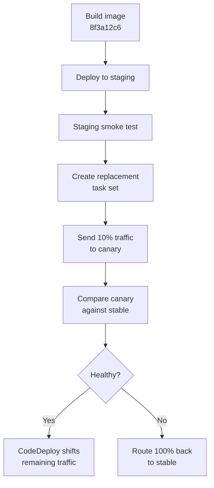

## Table of Contents

1. [What a Canary Deployment Proves](#what-a-canary-deployment-proves)
2. [The Example: A New Task Set With Ten Percent Traffic](#the-example-a-new-task-set-with-ten-percent-traffic)
3. [Choosing the First Slice](#choosing-the-first-slice)
4. [Creating the Canary Task Set](#creating-the-canary-task-set)
5. [Watching the Canary](#watching-the-canary)
6. [Promoting the Canary](#promoting-the-canary)
7. [Rolling Back the Canary](#rolling-back-the-canary)
8. [What Java Changes in the Same Pattern](#what-java-changes-in-the-same-pattern)
9. [Failure Modes to Watch](#failure-modes-to-watch)
10. [Canary vs. Rolling vs. Blue-Green](#canary-vs-rolling-vs-blue-green)
11. [Speed vs. Signal](#speed-vs-signal)

## What a Canary Deployment Proves

Staging can tell you that a release starts.
Smoke tests can tell you that the main path works once.
Blue-green can tell you that a complete replacement task set is ready before the switch.

Those checks are useful.
But none of them are the same as real production traffic.
Real users arrive from different browsers, networks, regions, mobile apps, and old clients.
They carry old cookies.
They retry requests at strange times.
They use discount codes and checkout paths that tests did not imagine.

A **canary deployment** exists for that gap.
It sends a small slice of production traffic to the new release while most users stay on the stable release.
If the small slice looks healthy, the team increases the slice.
If the small slice looks bad, the team sends traffic back to stable and stops the release.

The name comes from the old idea of using a canary as an early warning.
In software, the canary is not a special runtime.
It is a release pattern:

> Let the new version meet a small amount of real traffic before you trust it with all traffic.

In this article, the service is `polaris-orders-api`, a Node.js backend deployed to Amazon ECS.
The current task definition runs version `1.8.3`.
The new task definition runs version `1.8.4`.
AWS CodeDeploy can shift traffic between ECS task sets through an Application Load Balancer, which lets us send ten percent of requests to the new release and keep the other ninety percent on the old release.

Java maps to the same pattern.
A Spring Boot service may warm up more slowly and expose `/actuator/health/readiness`, but the canary question is the same:
does the new task set behave well when a small amount of real traffic reaches it?

## The Example: A New Task Set With Ten Percent Traffic

`polaris-orders-api` handles checkout requests.
The new release changes discount validation.
The code passed CI.
The image passed staging.
The smoke test created a fake order.

That still leaves a real production question:
will the discount change behave correctly for real checkout traffic?

The production service starts like this:

```text
service:
  orders-api-prod

public URL:
  https://orders-api.polaris.example

stable task set:
  task definition: orders-api:41
  target group: orders-api-blue-tg
  version: 1.8.3
  traffic: 100%

canary task set:
  name: not deployed yet
  task definition: orders-api:42
  target group: orders-api-green-tg
  version: 1.8.4
  traffic: 0%

new release image:
  digest: sha256:9c1cfbb322f6f2b8f8cc4d2b9f9e6b77c92c8da7ad9226110f0cf0c30a2a7f54
```

The canary rollout will create the replacement task set, check it through the test listener, then send a small traffic slice to it.



The important part is not the number ten.
The important part is that the first production move is small and observable.

## Choosing the First Slice

Before you change traffic, decide what "small" means.
Small is not always ten percent.
Small means "small enough that we can stop quickly if this is bad."

For a checkout API, ten percent can still be a lot.
If the site receives 10,000 checkout requests per minute, ten percent is 1,000 requests per minute.
That is enough signal, but also enough possible user impact.

For a low-traffic internal tool, ten percent may be useless.
If the tool receives 20 requests per hour, ten percent may send only two requests to the canary in an hour.
That will not teach you much.

The first slice should match traffic volume, user impact, and the kind of change.

| Release Type | First Slice | Why |
|--------------|-------------|-----|
| Small response formatting change | 10% | Low risk and easy to inspect |
| Normal API change | 10% | Matches a common CodeDeploy ECS canary shape |
| Checkout or payment change | 1% | High user impact |
| Risky data behavior | Named internal accounts first | Random traffic may be too dangerous |
| Very low traffic service | Synthetic requests plus one test account | Percentages may not produce signal |

For `polaris-orders-api`, the team chooses this plan:

```text
stage 1:
  canary traffic: 10%
  watch window: 5 minutes
  continue only if errors and latency stay close to stable

stage 2:
  canary traffic: 100%
  keep previous task set ready for rollback
```

That plan matters because "looks fine" is not a stop rule.
A canary needs specific conditions for continuing and stopping.

Good canary work starts with clear stop rules:

- Stop if canary `5xx` responses are higher than stable.
- Stop if checkout success drops.
- Stop if p95 latency is much worse than stable.
- Stop if logs show a new error pattern.
- Stop if the team cannot explain what the canary is doing.

`5xx` means HTTP server errors such as `500`, `502`, or `503`.
`p95 latency` means the response time that 95 percent of requests were faster than.
If p95 jumps, many users may feel the service getting slower even if the average still looks fine.

## Creating the Canary Task Set

Before the canary receives public traffic, create a CodeDeploy deployment for the new ECS task definition.
The deployment group uses two target groups behind the Application Load Balancer:
one for stable, one for the replacement task set.

The runbook command creates a deployment ID such as `d-7A4Q9B2KD`.
That ID is useful later when the pipeline asks CodeDeploy whether the canary is still running, succeeded, or needs to stop.
For this article, focus on the state the command creates:
there is now a replacement task set that can be tested before the public slice moves.

Before production traffic shifts, check the canary through the ALB test listener.
The test listener should prove two things.
First, the replacement task set is ready.
Second, the response comes from `orders-api:42`, not the stable `orders-api:41`.

Only after those checks pass should the canary receive public traffic.
CodeDeploy then handles the first traffic shift.
The status should say the deployment is in progress and using a canary configuration such as `CodeDeployDefault.ECSCanary10Percent5Minutes`.

That status proves the intended blast radius.
The canary is live, but most users still hit the stable task set.

## Watching the Canary

A canary is only useful if you can compare the new task set against the stable task set.
Looking at the whole service average can hide the problem.
If canary is only ten percent of traffic, a serious canary failure can look like a small bump in the total graph.

The release needs separate signals by task definition or release.
At minimum, logs and metrics should include the task definition, release version, or image digest.

During the canary, the team watches canary requests directly.
A small log sample should show that the canary is receiving real requests and returning normal responses:

```text
2026-04-30T19:10:03Z request_id=26fa status=200 latency_ms=83 path=/readyz release=1.8.4
2026-04-30T19:10:12Z request_id=9b11 status=200 latency_ms=142 path=/checkout release=1.8.4
2026-04-30T19:10:41Z request_id=7c90 status=200 latency_ms=138 path=/discounts/validate release=1.8.4
2026-04-30T19:11:02Z request_id=aa3d status=200 latency_ms=151 path=/checkout release=1.8.4
2026-04-30T19:11:19Z request_id=34ed status=200 latency_ms=145 path=/discounts/validate release=1.8.4
2026-04-30T19:11:44Z request_id=be02 status=200 latency_ms=129 path=/checkout release=1.8.4
```

That sample tells you the canary is alive and returning `200`.
It does not prove the canary is healthy.
For health, compare stable and canary over the same time window.

```text
window: 15 minutes

stable task definition orders-api:41 version 1.8.3:
  requests: 18342
  5xx rate: 0.08%
  checkout success: 99.43%
  p95 latency: 181ms

canary task definition orders-api:42 version 1.8.4:
  requests: 1870
  5xx rate: 0.10%
  checkout success: 99.38%
  p95 latency: 188ms
```

This is the moment where a canary becomes useful.
The canary is not just "up."
It is behaving close to stable for the same kind of traffic.

For a real team, those numbers usually come from an observability system.
The beginner lesson is the same even if the tool changes:
split the signal by release, compare it to stable, and use a time window with enough traffic to mean something.

## Promoting the Canary

Promotion means increasing trust gradually.
It does not have to mean "jump from the first canary slice to everyone without watching."

For `polaris-orders-api`, the promotion plan is:

```text
10% canary:
  watch 5 minutes
  continue only if canary matches stable

100% release:
  CodeDeploy shifts the remaining traffic
  keep the previous task set ready for rollback
```

If the signal stays healthy through the canary window, CodeDeploy continues the deployment and shifts the rest of traffic.
The final state should be simple:
CodeDeploy says `Succeeded`, the public `/version` endpoint reports `orders-api:42`, and the post-release smoke test passes.

The workflow can keep that order visible:

```yaml
concurrency: orders-api-canary

jobs:
  canary:
    environment:
      name: production
      url: https://orders-api.polaris.example
    steps:
      - run: ./scripts/create-codedeploy-canary.sh "$IMAGE_DIGEST"
      - run: ./scripts/watch-canary.sh "$DEPLOYMENT_ID" --minutes 5
      - run: ./scripts/check-codedeploy-success.sh "$DEPLOYMENT_ID"
```

The `concurrency` line matters.
Two production canaries at the same time would make the signals hard to trust.
If version `1.8.4` and version `1.8.5` both receive traffic, which release caused the error?

## Rolling Back the Canary

Canary rollback should be boring.
If the canary is bad, send traffic back to stable first.
Debug after users are protected.

Suppose the watch step prints this:

```text
window: 15 minutes

stable task definition orders-api:41 version 1.8.3:
  requests: 18401
  5xx rate: 0.07%
  checkout success: 99.45%
  p95 latency: 179ms

canary task definition orders-api:42 version 1.8.4:
  requests: 1880
  5xx rate: 3.91%
  checkout success: 94.10%
  p95 latency: 422ms

decision:
  stop canary
  reason: checkout success dropped and latency doubled
```

The first action is to send all traffic back to stable:

```bash
$ aws deploy stop-deployment --deployment-id d-7A4Q9B2KD --auto-rollback-enabled
```

Now inspect the canary logs.
The rollback protected users.
The logs explain what the team needs to fix before trying again.

```text
2026-04-30T19:27:07Z checkout failed request_id=aa88 reason="coupon table timeout"
2026-04-30T19:27:12Z checkout failed request_id=ee41 reason="discount service returned empty response"
2026-04-30T19:27:18Z discount validation failed request_id=f109 reason="coupon table timeout"
```

Now the shape is clear.
The new discount validation path is slow and sometimes fails.
The stable task set did not have that behavior.

The release record should be short and useful:

```text
release: 2026-04-30-8f3a12c6
version: 1.8.4
canary task definition: orders-api:42
traffic slice: 10%
status: rolled back before promotion
reason: checkout success dropped from 99.45% to 94.10%
first signal: coupon table timeout in canary logs
user impact: limited to canary slice
next action: fix discount timeout and add pre-release load check
```

That record helps the next person.
They do not need to search logs from scratch.
They can see what happened, what was protected, and where to look next.

## What Java Changes in the Same Pattern

The canary pattern is the same for Java, but the runtime signals need a little more care.

A Spring Boot service may pass readiness only after the application context, database pool, and background startup tasks are ready.
That is good.
Do not route traffic to a Java canary only because the JVM process exists.

Here is the rough translation:

| Concern | Node.js API | Spring Boot API |
|---------|-------------|-----------------|
| Build command | `npm ci`, `npm test`, `npm run build` | `./gradlew test bootJar` |
| Readiness endpoint | `/readyz` | `/actuator/health/readiness` |
| Common canary signal | route errors, latency, checkout success | same, plus warmup behavior |
| Common failure | missing `process.env` value | wrong Spring profile or heap setting |
| Watch window | can often be shorter | may need warmup time before judging latency |

The last row matters.
If a Java canary looks slow for the first minute because the JVM is warming up, that is different from a Java canary that stays slow for twenty minutes.
Your watch window should match the runtime.

## Failure Modes to Watch

Canary deployments sound safe because the slice is small.
They are safer than changing everything at once, but they can still mislead you.
The common mistakes are about weak signal, bad routing, or bad compatibility.

### Failure 1: The Canary Gets No Meaningful Traffic

If the canary receives too little traffic, it can look healthy because almost nothing happened.
This is common for low-traffic services or endpoints that only a few customers use.

The output looks calm:

```text
window: 15 minutes

stable task definition orders-api:41:
  requests: 2420
  checkout requests: 381
  5xx rate: 0.08%

canary task definition orders-api:42:
  requests: 31
  checkout requests: 0
  5xx rate: 0.00%
```

The canary did not prove checkout.
It received zero checkout requests.

The fix is not to promote blindly.
Use a longer window, route a named internal account, run a synthetic checkout against canary, or choose a higher slice if the risk allows it.
A synthetic checkout is an automated test that places a fake order through the real service path.

### Failure 2: Aggregated Metrics Hide the Problem

If the dashboard only shows total production errors, a ten percent canary can be broken while the total graph looks almost normal.

The total service view may show this:

```text
all production:
  requests: 19353
  5xx rate: 0.27%
  checkout success: 99.18%
```

That looks acceptable until you split by task definition:

```text
stable task definition orders-api:41:
  requests: 18401
  5xx rate: 0.07%
  checkout success: 99.45%

canary task definition orders-api:42:
  requests: 952
  5xx rate: 3.91%
  checkout success: 94.10%
```

The canary is clearly bad.
The total view diluted the problem.

The fix is to tag metrics and logs by release, task definition, or image digest.
A canary without separate signals is not a canary.
It is a partial rollout with weak visibility.

### Failure 3: Users Bounce Between Versions

Traffic splitting is often request based.
One user's first request can hit stable, and the next request can hit canary.

For a stateless health endpoint, that is fine.
For a checkout flow, it may be confusing.

Imagine this sequence:

```text
request 1:
  POST /cart/apply-discount
  task definition: orders-api:42
  version: 1.8.4
  result: stores new discount_session format

request 2:
  POST /checkout
  task definition: orders-api:41
  version: 1.8.3
  result: cannot read discount_session format
```

This can make the stable task set look broken even though the canary created the incompatible state.

The fix depends on the app.
You may need sticky routing, a feature flag, a canary cookie, or an account-based allowlist.
Sticky routing means keeping the same user on the same release for the flow.

### Failure 4: Canary Writes Data Stable Cannot Read

The most dangerous canary failure is not a `500`.
It is a data shape that old code cannot understand.

Suppose `1.8.4` starts writing `discountRulesV2`.
Stable `1.8.3` only understands `discountRules`.
Even if only ten percent of requests hit canary, those requests may write records that stable later reads.

The symptom may appear on stable:

```text
2026-04-30T19:34:03Z checkout failed order_id=ord_7812 reason="unknown discountRulesV2"
2026-04-30T19:34:11Z checkout failed order_id=ord_7818 reason="unknown discountRulesV2"
```

This is why traffic rollback is not the same as data rollback.
Removing canary traffic stops new writes from `1.8.4`.
It does not automatically fix data already written.

The safe fix is the same expand-and-contract habit:

1. Teach old and new code to read both shapes.
2. Start writing the new shape only after all readers are ready.
3. Backfill old data if needed.
4. Remove old support later.

Canary makes runtime behavior safer to discover.
It does not make incompatible data changes safe by itself.

## Canary vs. Rolling vs. Blue-Green

The deployment patterns are easy to mix up because they can use the same service, task definitions, scripts, and health checks.
The difference is the question each pattern answers.

Rolling asks:
"Can we replace production tasks gradually?"

Blue-green asks:
"Can we prepare a full replacement before users reach it?"

Canary asks:
"Can the new task set handle a small amount of real traffic before everyone gets it?"

Here is the comparison:

| Strategy | What Changes First | Best Signal | Main Risk |
|----------|--------------------|-------------|-----------|
| Rolling | Tasks are replaced gradually | Target health plus rollout windows | Less exact traffic control |
| Blue-green | A full replacement is prepared | Direct test before switch | Bad switch or incompatible data |
| Canary | A small traffic slice | Real production behavior by task definition | Bad or misleading metrics |

None of these strategies replaces the others.
They can combine.
A team may canary a new task set at ten percent, then let CodeDeploy shift the rest of traffic.
Another team may test a green task set directly, then canary it before the full blue-green switch.

The practical choice is about the failure shape you prefer.

If your biggest fear is replacing everything at once, use rolling.
If your biggest fear is not having a clean replacement ready, use blue-green.
If your biggest fear is that staging cannot predict real user behavior, use canary.

## Speed vs. Signal

Canary deployments are slower than pushing straight to everyone.
That is the cost.
You wait for the first slice, read the signals, maybe wait again at a wider slice, then promote.

The benefit is better signal.
You learn from real traffic while the blast radius is still small.

That tradeoff only pays off when the team can answer three questions:

1. What signal are we watching?
2. How much traffic is enough to trust that signal?
3. What exact condition makes us stop?

For `polaris-orders-api`, a healthy canary policy can stay plain:

```text
canary default:
  deploy the exact image digest that passed staging
  start at 10% public traffic
  compare canary against stable for 5 minutes
  stop if checkout success drops or 5xx rises
  let CodeDeploy shift the remaining traffic only after the first window passes
  keep task definition orders-api:41 ready until 1.8.4 is stable
```

That policy is not fancy.
It is specific.

The real value of canary is not the percentage.
It is the discipline of making one small promise, watching whether production agrees, and stopping when the answer is no.

---

**References**

- [Amazon ECS Docs: CodeDeploy blue/green deployments](https://docs.aws.amazon.com/AmazonECS/latest/developerguide/deployment-type-bluegreen.html) - Explains how ECS uses CodeDeploy, task sets, and load balancer traffic shifting.
- [AWS CodeDeploy Docs: Deployment configurations](https://docs.aws.amazon.com/codedeploy/latest/userguide/deployment-configurations.html) - Documents canary and linear deployment configurations, including ECS canary options.
- [AWS CodeDeploy Docs: Stop a deployment](https://docs.aws.amazon.com/codedeploy/latest/userguide/deployments-stop.html) - Shows how to stop a deployment and request rollback.
- [Elastic Load Balancing Docs: Target group health checks](https://docs.aws.amazon.com/elasticloadbalancing/latest/application/target-group-health-checks.html) - Explains target health for load-balanced ECS services.
- [GitHub Docs: Deploying with GitHub Actions](https://docs.github.com/en/actions/concepts/use-cases/deploying-with-github-actions) - Shows how deployment workflows fit into GitHub Actions.
- [Spring Boot Docs: Actuator Endpoints](https://docs.spring.io/spring-boot/reference/actuator/endpoints.html) - Documents health and readiness endpoints for Java services.
