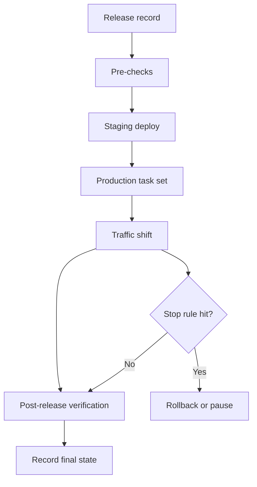

## Table of Contents

1. [What a Deployment Runbook Does](#what-a-deployment-runbook-does)
2. [The Example: One Release Record Drives the Run](#the-example-one-release-record-drives-the-run)
3. [Pre-Checks: Do Not Start Blind](#pre-checks-do-not-start-blind)
4. [Deploy Steps: Make the Boring Parts Repeatable](#deploy-steps-make-the-boring-parts-repeatable)
5. [Stop Rules: Decide Before the Graph Is Red](#stop-rules-decide-before-the-graph-is-red)
6. [Owner Handoff: Know Who Can Decide](#owner-handoff-know-who-can-decide)
7. [Rollback Target: Name the Safe Place](#rollback-target-name-the-safe-place)
8. [Post-Release Verification](#post-release-verification)
9. [Automating the Runbook in GitHub Actions](#automating-the-runbook-in-github-actions)
10. [Failure Modes in Runbooks](#failure-modes-in-runbooks)
11. [Runtime-Specific Notes](#runtime-specific-notes)
12. [Speed vs. Discipline](#speed-vs-discipline)

## What a Deployment Runbook Does

A deployment runbook is a short operating guide for one release path.
It tells the team what to check before deploying, how to deploy, when to stop, who owns the decision, what to roll back to, and how to prove the release is healthy afterward.

It exists because memory is a bad deployment tool.
People forget steps when they are tired.
People skip checks when the release feels small.
People remember different versions of "how we usually do it."

Automation helps, but automation alone is not enough.
A workflow can run commands.
It cannot decide whether a strange checkout graph means "rollback now" or "watch for five more minutes" unless you taught it a clear rule.

That is why runbooks and automation belong together.
The runbook explains the human judgment.
The automation performs the repeatable work.

In this article, the service is still `devpolaris-orders-api`, a Node.js backend deployed to Amazon ECS.
The runbook will take one tested image digest and move it through production using the ideas from the earlier articles:

- environment promotion
- release gates
- rolling or canary traffic shifts
- rollback targets
- release records
- post-release checks

The goal is not to create a giant document.
The goal is to make the safe path easy to follow.

> A good runbook lets a careful junior engineer run a normal release without guessing.

## The Example: One Release Record Drives the Run

The runbook starts with a release record.
Without a release record, the workflow has to ask humans for too many details.
That is how mistakes enter the process.

For `devpolaris-orders-api`, the release record is a small text file committed or attached to the deployment run.

```text
release:
  id: rel-2026-04-30-184
  service: devpolaris-orders-api
  repository: github.com/devpolaris/orders-api
  commit: 8f3a12c6
  version: 1.8.4
  image_digest: sha256:9c1cfbb322f6f2b8f8cc4d2b9f9e6b77c92c8da7ad9226110f0cf0c30a2a7f54

environments:
  staging_service: orders-api-staging
  production_service: orders-api-prod
  production_url: https://orders-api.devpolaris.example

rollback:
  previous_release: rel-2026-04-28-183
  previous_task_definition: orders-api:41
  previous_image_digest: sha256:6447f5a96a80a87f19f6a6549e6dc03f63a2b8124c9d1c2f4a71f5b95ab9a621

owners:
  release_lead: Maya
  app_engineer: Theo
  platform_engineer: Iris
```

This record is not paperwork for its own sake.
It answers the questions that become scary during a bad release:

- What exact image are we deploying?
- What service are we changing?
- What task definition can we return to?
- Who is allowed to decide?
- Which URL proves production is healthy?

The runbook then uses that record as input.



This flow is intentionally boring.
Boring is good in a deployment.
You want the same questions in the same order every time.

## Pre-Checks: Do Not Start Blind

Pre-checks happen before production changes.
They prevent the most frustrating kind of incident: the release that was doomed before it started.

For a Node backend, the first pre-check is that the image digest exists.
If your runbook deploys a digest that no longer exists, the release fails before it reaches the interesting part.

The runbook can ask ECR whether the digest exists.
The evidence should say the digest was found, which tag points to it, and when it was pushed.
You do not need a screen full of registry metadata.
You need enough proof that the artifact is real and matches the release record.

The next pre-check is that staging is already running the same image.
This protects the "build once, promote once" rule from the earlier article.

The staging `/version` response should show `version: 1.8.4`, `commit: 8f3a12c6`, and the same image digest from the release record.
If staging shows a different digest, stop.
That means production would not be receiving the exact release staging tested.

The third pre-check is that production has a rollback target.
A runbook that says "rollback if needed" but does not name the target is not finished.

The production service should show `orders-api:41` as the current healthy task definition before the release starts.
That gives the runbook a named place to return to.

Now the runbook can say:

```text
pre-checks:
  artifact exists: yes
  staging runs same digest: yes
  production rollback target exists: orders-api:41
  production currently healthy: yes
```

This section should stay small.
If the pre-checks become a long ceremony, people will skip them.
Choose checks that catch real release mistakes.

For `devpolaris-orders-api`, the important ones are:

| Pre-Check | Why It Exists |
|-----------|---------------|
| Artifact digest exists | Prevents deploying a missing or moved artifact |
| Staging digest matches | Prevents testing one thing and deploying another |
| Production is healthy | Prevents blaming a new release for an old incident |
| Rollback target exists | Prevents discovering rollback is impossible too late |
| Required env vars exist | Prevents startup failures from missing config |

The last check came from the previous article's failure.
That is how runbooks improve.
Every painful release should make one future mistake harder.

## Deploy Steps: Make the Boring Parts Repeatable

Deploy steps should be boring enough that automation can do them exactly.
Humans should not type long commands from memory during a normal release.

The runbook can describe the steps in plain English first:

1. Create a CodeDeploy deployment for the new ECS task definition.
2. Send test-listener traffic to the replacement task set.
3. Call `/readyz` on the test listener URL.
4. Run the checkout smoke test on the test listener URL.
5. Let CodeDeploy shift ten percent of production traffic.
6. Watch stop rules for five minutes.
7. Let CodeDeploy promote to one hundred percent only if signals stay healthy.

Then the automation turns those steps into commands.
The first production change creates a replacement task set without sending public users to it.

The first command creates a CodeDeploy deployment and returns an ID such as `d-7A4Q9B2KD`.
That ID becomes the release handle for the rest of the run.
The person reading the runbook should understand why the ID matters, not just copy it.

The test listener URL is useful because it lets you test the new task set directly.
You do not need to send public traffic to find a broken startup.

The test listener checks should prove `ready: true`, `taskDefinition: orders-api:42`, and a successful smoke checkout.
Those three facts are more useful than the exact `curl` command in the article body.

Only after direct checks pass should the runbook move public traffic.

At that point, CodeDeploy should report an in-progress deployment using `CodeDeployDefault.ECSCanary10Percent5Minutes`.
That tells the release lead the first public move is a small canary slice, not a full production switch.

A good runbook tells you what to inspect after the command.
The deploy command is not the proof.
The observed service state is the proof.

The observed state should say the service is healthy and the new task set is receiving the intended traffic slice.
If the state does not match the plan, the runbook should pause before moving forward.

That is the moment the release becomes live.
The runbook should now switch from "deploy" mode to "watch" mode.

## Stop Rules: Decide Before the Graph Is Red

Stop rules are the conditions that pause, roll back, or fail a release.
They exist because humans are very good at explaining away bad news during a release.

If the rule is not written before the release starts, the team may negotiate with the graph:

```text
"Maybe the error rate is only high because traffic is small."
"Maybe p95 latency is noisy."
"Maybe checkout success will recover after cache warmup."
"Maybe one more traffic step will make the sample size better."
```

Sometimes those sentences are true.
Sometimes they are how a small canary becomes a full outage.

For `devpolaris-orders-api`, the runbook writes stop rules like this:

```text
stop rules:
  stop and revert traffic if canary 5xx rate is 1% higher than stable for 5 minutes
  stop and revert traffic if checkout success drops below 98.5%
  stop and pause if p95 latency is 2x stable for 10 minutes
  stop and pause if logs show a new unclassified error pattern
  stop immediately if payment provider errors increase with canary traffic
```

These rules are not universal.
They are service-specific.
A checkout API deserves stricter rules than an internal admin page.

The runbook should also say what action each rule triggers.

| Stop Rule | First Action | Owner |
|-----------|--------------|-------|
| Canary 5xx rate high | Revert traffic to stable | Platform engineer |
| Checkout success low | Revert traffic and page app owner | Release lead |
| p95 latency high | Hold traffic and inspect logs | App engineer |
| New unknown error | Pause rollout | Release lead |
| Payment provider impact | Stop release and open incident | Release lead |

This table removes confusion.
The release lead does not need to invent the first move while people are waiting.

## Owner Handoff: Know Who Can Decide

Runbooks fail when everyone watches and nobody owns the decision.
A good runbook names owners before the release starts.

For a normal release, you need three roles:

The release lead owns the go, pause, rollback, or roll-forward decision.
The app engineer reads application logs, errors, and business metrics.
The platform engineer owns traffic state, ECS task set state, and deployment commands.

One person can hold more than one role on a small team.
The important part is that each responsibility has a name.

The handoff should also say when ownership changes.
During a normal release, the release lead owns the decision.
During an incident, the incident lead may take over.

The handoff rule can stay plain:
if user-visible errors last more than ten minutes, or payment flow is affected, the release lead opens an incident and the incident lead owns production recovery decisions.

This sounds formal, but it prevents a real problem.
During a bad release, the person running the workflow may focus on commands.
The person reading logs may focus on root cause.
The product owner may ask about customers.
The platform engineer may think only about traffic.

The owner handoff gives the room one decision point.

> The person who owns the next decision should be obvious before the release starts.

That is not bureaucracy.
That is kindness to the team when the release gets tense.

## Rollback Target: Name the Safe Place

A rollback target is the exact state you plan to return to if the release fails.
It should be named before production changes.

A bad rollback target says only "rollback to previous version."
That sounds clear until someone asks which previous version, which task definition, and which image digest.

A good rollback target names the real state:

```text
rollback target:
  task_definition: orders-api:41
  version: 1.8.3
  commit: 4b6e91aa
  image_digest: sha256:6447f5a96a80a87f19f6a6549e6dc03f63a2b8124c9d1c2f4a71f5b95ab9a621
  current_traffic: 100%
  data_compatibility: 1.8.3 can read rows written by 1.8.4
```

That last line matters.
A rollback target is only safe if the old code can handle the current data.

The runbook should include the rollback command, but it should not pretend the command is the whole story.

```bash
$ aws deploy stop-deployment --deployment-id d-7A4Q9B2KD --auto-rollback-enabled
```

After rollback, the runbook should verify the public URL.
The public `/version` endpoint should report `orders-api:41`.
The public smoke checkout should pass.

This is the difference between "we ran rollback" and "production is back on the safe target."
The second sentence is what users need.

## Post-Release Verification

Post-release verification proves the release is healthy after traffic moves.
It is not the same as a smoke test.

A smoke test asks, "Can one important path work once?"
Post-release verification asks, "Does the live service still behave normally under real traffic?"

For `devpolaris-orders-api`, the runbook watches:

- HTTP `5xx` error rate
- checkout success rate
- p95 latency
- payment provider failures
- new application error messages
- version endpoint response

The version endpoint proves which task definition users are hitting.
For this release, it should report `version: 1.8.4`, `commit: 8f3a12c6`, and `taskDefinition: orders-api:42`.

The final verification snapshot can be a simple table.

```text
verification window:
  start: 2026-04-30T21:00:00Z
  end: 2026-04-30T21:15:00Z

metric                    target             observed
5xx rate                  below 0.2%         0.03%
checkout success          above 99.0%        99.5%
p95 latency               below 250 ms       190 ms
payment provider errors   no increase        no increase
new error pattern         none               none
```

The runbook should record the final state.

```text
final state:
  release: rel-2026-04-30-184
  production_task_definition: orders-api:42
  traffic: 100%
  verified_by: Maya
  verified_at: 2026-04-30T21:15:00Z
```

This gives the next release a clean starting point.
Tomorrow, when someone asks "what is production running?", the answer is not hidden in a chat thread.

## Automating the Runbook in GitHub Actions

Automation should remove typing, not remove thinking.
The workflow should make it easy to run the same release path every time, while keeping approvals and stop rules visible.

GitHub Actions can use a manual trigger, called `workflow_dispatch`, so a release lead can start a production release with explicit inputs.
It can also use environments so production deployments require the right protection rules.
And it can use concurrency so two production releases do not run at the same time.

Here is a simplified production deployment workflow:

```yaml
name: Deploy Orders API

on:
  workflow_dispatch:
    inputs:
      release_id:
        description: "Release record id"
        required: true
        type: string
      image_digest:
        description: "Container image digest"
        required: true
        type: string
      rollback_task_definition:
        description: "Known-good production task definition"
        required: true
        type: string

concurrency:
  group: production-orders-api
  cancel-in-progress: false

jobs:
  deploy:
    environment: production
    permissions:
      contents: read
      id-token: write

    steps:
      - name: Pre-check release inputs
        run: ./scripts/precheck-release.sh

      - name: Create CodeDeploy canary deployment
        run: ./scripts/deploy-orders-api.sh

      - name: Run direct task-set smoke test
        run: ./scripts/smoke-orders-api.sh

      - name: Watch first traffic slice
        run: ./scripts/watch-canary.sh
```

This workflow does not show every production detail.
It shows the important runbook ideas:

- the release is started intentionally
- production uses an environment gate
- concurrent production releases are blocked
- the image digest is an input
- the rollback target is an input
- scripts hold repeatable command details

The scripts should print evidence, not just run silently.
A release log should show what changed.

```text
release_id=rel-2026-04-30-184
image_digest=sha256:9c1cfbb322f6f2b8f8cc4d2b9f9e6b77c92c8da7ad9226110f0cf0c30a2a7f54
rollback_task_definition=orders-api:41

codedeploy_deployment=d-7A4Q9B2KD
test_listener=https://orders-api-test.devpolaris.example
readyz=pass
smoke_checkout=pass
traffic=orders-api:42:10,orders-api:41:90
```

That output is release evidence.
If the release fails, the team can read the workflow log and know how far it got.

## Failure Modes in Runbooks

Runbooks can fail too.
The failure is usually not that the document is missing.
The failure is that the document is vague, stale, or impossible to follow during pressure.

Here are common failure shapes.

| Failure | What It Looks Like | Fix |
|---------|--------------------|-----|
| Missing rollback target | "Rollback to previous" but nobody knows the task definition | Record exact task definition and digest |
| Stale command | Script uses an old service name | Run the runbook in staging regularly |
| No stop rule | Team debates bad metrics during release | Write stop thresholds before deploy |
| Hidden owner | Three people think someone else paused traffic | Name the release lead |
| Manual drift | Engineer types a different command than the runbook | Move repeatable commands into scripts |

The most dangerous failure is a runbook that looks complete but never proves production state.

```text
bad runbook:
  step 1: deploy release
  step 2: run smoke test
  step 3: monitor
  step 4: done
```

This does not tell you what "monitor" means.
It does not say which metric fails the release.
It does not say who decides.
It does not say what task definition to roll back to.

A better runbook is more specific without becoming huge.

```text
better runbook:
  create replacement task set from the image digest
  run /readyz and /smoke/checkout on the test listener URL
  let CodeDeploy move 10% traffic to the new task set
  watch 5xx rate, checkout success, and p95 latency for 5 minutes
  stop if checkout success drops below 98.5%
  rollback target is orders-api:41
  Maya owns the go or rollback decision
```

That is the level of detail you want.
Specific enough to guide action.
Short enough that people will actually read it.

## Runtime-Specific Notes

Most runtimes do not need their own paragraph in every deployment article.
Build, test, deploy, smoke test, and rollback are the same release ideas.
Mention a runtime only when it changes the runbook decision.

For example, a Spring Boot service may be packaged as a jar before it is copied into an image.
If the service is containerized, the runbook should still record the image digest.
If a team deploys the jar directly, the runbook should record the jar checksum too.

```text
runtime-specific artifact record:
  service: devpolaris-orders-api
  version: 1.8.4
  commit: 8f3a12c6
  artifact:
    jar: build/libs/orders-api-1.8.4.jar
    jar_checksum: sha256:74ad3b8f7ad39f2a2c6c...
    image_digest: sha256:9c1cfbb322f6f2b8f8cc...

readiness note:
  Spring Boot endpoint: /actuator/health/readiness
  expected result: UP
```

The smoke test may use the same checkout endpoint.
The readiness check may change to a framework-specific path.

Some runtimes also need a warmup note.
If normal p95 latency is high for the first two minutes after startup, write that down.
Do not let every release rediscover it.

```text
runtime warmup note:
  first 2 minutes after new task set starts:
    p95 latency can reach 600 ms
  after 5 minutes:
    p95 should return below 220 ms
  stop rule:
    rollback if p95 stays above 450 ms for 10 minutes
```

That note keeps the runbook practical.
It does not excuse bad performance.
It tells the release lead what normal looks like for this service.

## Speed vs. Discipline

A runbook adds discipline.
It can also add friction.

The goal is not to slow every release.
The goal is to remove avoidable thinking from the parts that should be repeatable, so the team has more attention for the parts that require judgment.

| Runbook Choice | What You Gain | What You Give Up |
|----------------|---------------|------------------|
| Manual checklist only | Easy to change | Easy to skip or misread |
| Full automation only | Fast and repeatable | Can hide judgment calls |
| Runbook plus scripts | Clear and practical | Requires maintenance |
| Strict approval gates | Safer production changes | Slower urgent releases |
| Loose process | Faster small changes | More room for memory mistakes |

For most teams, the sweet spot is a short runbook plus small scripts.
The runbook says why and when.
The scripts do the exact commands.
The workflow records evidence.

Before you call a runbook done, ask:

Can a careful engineer answer these without guessing?

1. What exact artifact are we deploying?
2. What pre-checks must pass before production changes?
3. What is the first production traffic move?
4. What stop rules pause or roll back the release?
5. Who owns the next decision?
6. What exact task definition or artifact is the rollback target?
7. What proves the release is healthy after traffic reaches 100%?

If the answer is yes, the team is in a much better place.
The release may still fail.
Software does that sometimes.
But the team will fail in a controlled way, with evidence, owners, and a clear path back.

---

**References**

- [Deploying with GitHub Actions](https://docs.github.com/actions/deployment/deploying-with-github-actions) - Shows how GitHub Actions supports deployment workflows, environments, and deployment controls.
- [GitHub Actions concurrency](https://docs.github.com/en/actions/concepts/workflows-and-actions/concurrency) - Explains how to prevent multiple deployment workflows from running at the same time.
- [GitHub Actions workflow syntax](https://docs.github.com/actions/learn-github-actions/workflow-syntax-for-github-actions) - Documents `workflow_dispatch` inputs and workflow structure.
- [Amazon ECS Docs: CodeDeploy blue/green deployments](https://docs.aws.amazon.com/AmazonECS/latest/developerguide/deployment-type-bluegreen.html) - Explains ECS task sets and load balancer traffic shifting used by the runbook.
- [AWS CodeDeploy Docs: Deployment configurations](https://docs.aws.amazon.com/codedeploy/latest/userguide/deployment-configurations.html) - Documents canary and linear deployment configurations.
- [Elastic Load Balancing Docs: Target group health checks](https://docs.aws.amazon.com/elasticloadbalancing/latest/application/target-group-health-checks.html) - Explains how load balancer health checks protect the traffic path.
- [Spring Boot Actuator endpoints](https://docs.spring.io/spring-boot/reference/actuator/endpoints.html) - Documents the readiness endpoint used in the runtime-specific runbook note.
