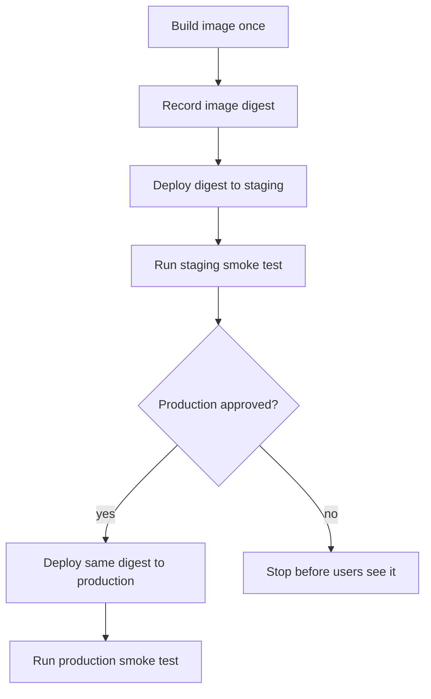

## Table of Contents

1. [What Promotion Means](#what-promotion-means)
2. [The Example: A Node Orders API](#the-example-a-node-orders-api)
3. [Build Once, Promote One Image Digest](#build-once-promote-one-image-digest)
4. [Why Staging and Production Stay Separate](#why-staging-and-production-stay-separate)
5. [The GitHub Actions Promotion Workflow](#the-github-actions-promotion-workflow)
6. [What Each Gate Should Prove](#what-each-gate-should-prove)
7. [Smoke Tests for a Backend API](#smoke-tests-for-a-backend-api)
8. [Failure: A Moving Image Tag](#failure-a-moving-image-tag)
9. [Manual Approval Without Manual Deploys](#manual-approval-without-manual-deploys)
10. [Speed vs. Control](#speed-vs-control)

## What Promotion Means

After CI passes, the release is not automatically ready for production.
CI tells you the code built and the tests passed in a clean runner.
Production has a different question:
can this exact release run safely in the real environment?

**Environment promotion** means moving the same tested release through a sequence of environments.
For a backend API, that usually means staging first, then production.
The important word is **same**.
Staging should not build one thing while production builds another thing later.

A **release gate** is a check that must pass before the release moves forward.
Some gates are automatic.
For example, the staging service must return `200` from `/readyz`.
Some gates are human.
For example, a release manager may approve production after checking timing, evidence, and rollback.

Promotion exists because a green build is not enough context.
A test runner does not know whether production secrets are present.
It does not know whether the payment sandbox changed.
It does not know whether the team is in the middle of a customer event.
Promotion gives the team a clean place to ask those questions before users are affected.

In this module, we will follow one service: a Node.js backend called `polaris-orders-api`.
It is deployed to a managed container service, using Amazon ECS as the concrete example.
Amazon ECS runs the service as tasks on Fargate, stores each container setup as a task definition revision, and lets the service replace old tasks with new tasks during a deployment.
That makes the release mechanics easy to see without asking you to manage servers by hand.

> Promotion means the release that passed the earlier environment is the release the next environment receives.

## The Example: A Node Orders API

Imagine `polaris-orders-api` handles checkout requests.
It validates carts, applies discount codes, writes order records, and publishes order events.
If this API is down, users can browse products but cannot finish checkout.

The service is a normal Node.js backend.
It has the shape you probably recognize:
install packages with `npm ci`, run tests with `npm test`, compile TypeScript, then start `node dist/server.js`.
Nothing about environment promotion requires an unusual application.
The careful part is what happens after the build is green.

The API exposes four small endpoints that make release checks easier:

| Endpoint | Plain-English question |
|----------|------------------------|
| `/livez` | Is the process alive? |
| `/readyz` | Can this task receive traffic now? |
| `/version` | Which commit and image digest is running? |
| `/smoke/checkout` | Can the smallest checkout flow complete? |

Those endpoints are not decoration.
They give the deployment pipeline a way to ask the service simple questions.
Without them, the pipeline can only say "AWS accepted the deploy request."
That is not the same as "the checkout API is healthy."

The setup has four named pieces.
The code lives in `github.com/polaris/orders-api`.
The container image lives in Amazon ECR (Elastic Container Registry, AWS's image registry).
Staging runs an ECS (Elastic Container Service) service named `orders-api-staging`.
Production runs a separate ECS service named `orders-api-prod`.

Staging uses fake checkout events.
Production uses real customer orders.
That difference matters more than the tool names.
The same image can move through both environments, but the blast radius is different.
If staging is broken, the release waits.
If production is broken, customers feel it.

The Node detail matters because the examples should feel familiar.
The build starts with `npm ci`, runs tests, compiles TypeScript, builds a container image, and deploys that image.

The Java version of the same story is close, but the build and health endpoints have different names.
A Spring Boot service might run `./gradlew test bootJar`, build an image that contains the `.jar`, and expose readiness through `/actuator/health/readiness`.
The release idea is the same:
build one artifact, deploy it to staging, prove it, then promote the same artifact to production.

## Build Once, Promote One Image Digest

The safest promotion rule is simple:
build once, promote one immutable artifact.

For an Amazon ECS service, that artifact is usually a container image.
The human-friendly tag might be `8f3a12c6`, but the machine-trusted identity is the image digest.
A digest is a content fingerprint.
If the image bytes change, the digest changes.

You can think of the tag as a label on a box and the digest as the actual fingerprint of the box contents.
Labels can move.
Fingerprints do not.
That is why production should trust the digest.

The build job still runs normal commands.
The important part is not memorizing the whole script.
The important part is the final line of evidence: the digest that came back from ECR.

```bash
$ aws ecr describe-images \
  --repository-name orders-api \
  --image-ids imageTag=8f3a12c6 \
  --query 'imageDetails[0].imageDigest' \
  --output text
sha256:9c1cfbb322f6f2b8f8cc4d2b9f9e6b77c92c8da7ad9226110f0cf0c30a2a7f54
```

The release record stores both the readable tag and the digest:

```text
release: 2026-04-30-8f3a12c6
commit: 8f3a12c6d4e9
image tag: 123456789012.dkr.ecr.us-east-1.amazonaws.com/orders-api:8f3a12c6
image digest: sha256:9c1cfbb322f6f2b8f8cc4d2b9f9e6b77c92c8da7ad9226110f0cf0c30a2a7f54
staging service: orders-api-staging
production service: orders-api-prod
rollback task definition: orders-api:41
```

That may look plain.
That is the point.
A release should answer basic questions without searching old chat messages.
When a teammate asks "what is in production?", this record should answer them in ten seconds.
When someone asks "what do we roll back to?", the same record should answer that too.

Production should deploy the digest, not rebuild from source.
If staging and production both point to the same digest, you can say with confidence:
"Production is running the thing staging tested."

For a Java service, replace the Node build commands with the Java build commands, but keep the artifact rule.
The `.jar` may be built by Gradle, then copied into a container image.
Production still promotes the image digest.
It should not rebuild the JAR during the production deployment.

## Why Staging and Production Stay Separate

Staging and production may run the same image, but they should not use the same access.
Staging is where the team checks the release.
Production serves real users.

The difference is practical:

| Question | Staging | Production |
|----------|---------|------------|
| Who uses it? | Engineers and testers | Customers |
| What data does it touch? | Fake orders | Real orders |
| Which secrets does it need? | Staging credentials | Production credentials |
| What happens if it breaks? | The release waits | Users are affected |

This is why environment-scoped secrets matter.
The staging deploy job should only receive staging deploy permissions.
The production deploy job should only receive production deploy permissions, and only after the production gate passes.

In GitHub Actions, a job can reference an environment.
That environment can have its own secrets, reviewers, and deployment history.
The YAML is small, but the idea behind it is big:
the production job should not receive production access until the production gate is open.

```yaml
environment:
  name: production
  url: https://orders-api.polaris.example
```

For this example, staging has an AWS role that can update `orders-api-staging`.
Production has a different AWS role that can update `orders-api-prod`.
The names might be `AWS_ROLE_STAGING_DEPLOY` and `AWS_ROLE_PRODUCTION_DEPLOY`.
The exact credential method can change.
Some teams use OpenID Connect (OIDC, a short-lived identity exchange between GitHub and AWS).
Some teams use a deployment platform in front of AWS.
The design stays the same:
staging access and production access stay separate.

This protects the team from simple mistakes.
A test job should not be able to deploy production.
A staging deploy job should not be able to read production database credentials.
A production approval should unlock only the production job that needs it.

## The GitHub Actions Promotion Workflow

The workflow should make the promotion path visible.
Build once.
Deploy the same image digest to staging.
Check staging.
Wait for production approval.
Deploy the same digest to production.

Before looking at any YAML, picture the release as a line with two doors.
The first door is staging.
The second door is production.
The artifact is allowed to move through the second door only after the first room proves it can run.



The dependency chain is the quiet safety feature:

```text
build -> deploy-staging -> deploy-production
```

If staging fails, production does not start.
If production waits for approval, the production credentials are not available until the environment rules pass.
If another production deployment is already running, `concurrency` keeps two production releases from stepping on each other.
That last detail is easy to underestimate.
Two production deploys running at the same time can make the release record confusing.
One job might record digest A while another job updates the service to digest B.
Concurrency keeps the team from having to debug its own deployment process.

The workflow file can still be short.
This is the shape that matters:

```yaml
deploy-production:
  needs: [build, deploy-staging]
  environment:
    name: production
    url: https://orders-api.polaris.example
```

Those few lines teach three ideas.
`needs` says production depends on staging.
`environment` says production has its own gate and credentials.
The URL tells reviewers which real service the job is touching.

For a Spring Boot app, the workflow changes in the build job.
You might replace `npm ci`, `npm test`, and `npm run build` with `./gradlew test bootJar`.
The promotion path should not change.
The same image digest still moves from staging to production.

## What Each Gate Should Prove

A gate should answer a concrete question.
If nobody can explain what a gate proves, the gate is probably just ceremony.

For `polaris-orders-api`, the gates are small and practical:

| Gate | Question It Answers | Evidence |
|------|---------------------|----------|
| CI tests | Does the app still pass automated checks? | Test logs |
| Image digest | Do staging and production use the same artifact? | Digest value |
| Staging deploy | Can the image start with staging config? | ECS service steady state |
| Staging smoke test | Can the API complete a tiny checkout flow? | HTTP response |
| Production approval | Is this a good time to release? | Reviewer approval |
| Production deploy | Did production create a healthy task set? | ECS deployment status |
| Production smoke test | Does the public API still work? | HTTP response |

Each gate protects a different boundary.
CI protects the repository.
Staging protects the release from basic runtime mistakes.
Approval protects production timing and risk.
Production smoke tests protect the public path after the change.

The gates should not all ask the same question.
Running the unit test suite three times does not prove the app can reach the staging payment sandbox.
A staging smoke test does not prove production timing is safe.
Each gate should add one useful piece of confidence.

## Smoke Tests for a Backend API

A smoke test is a small test that proves the service can breathe in its target environment.
It should not replay the entire test suite.
It should check the few things that would embarrass the release if they were broken.

For `polaris-orders-api`, the staging smoke test does three things:

1. Calls `/readyz`.
2. Calls `/version` and checks the image digest.
3. Creates a fake checkout through `/smoke/checkout`.

The output should be short enough for a reviewer to understand:

```bash
$ ./scripts/smoke-test.sh https://orders-api-staging.polaris.example
checking /readyz
ready: true

checking /version
release: 2026-04-30-8f3a12c6
commit: 8f3a12c6d4e9
imageDigest: sha256:9c1cfbb322f6f2b8f8cc4d2b9f9e6b77c92c8da7ad9226110f0cf0c30a2a7f54

checking /smoke/checkout
orderId: smoke_20260430_1712
status: accepted
```

That output gives the reviewer three signals:
the app is ready, the right image is running, and the smallest checkout flow works.

For Java, the first check is often `/actuator/health/readiness`.
The smoke test should still include a business-level check.
A green readiness endpoint only says the service thinks it can receive traffic.
It does not prove checkout works.

## Failure: A Moving Image Tag

One of the easiest release mistakes is trusting a tag that can move.

A team uses this image tag:

```text
123456789012.dkr.ecr.us-east-1.amazonaws.com/orders-api:latest
```

Staging deploys `latest` at 17:10.
Staging passes.
At 17:20, another build pushes a new image to the same `latest` tag.
At 17:30, production deploys `latest`.

The production job did not deploy the image staging tested.
It deployed a newer image with the same tag.

The evidence looks like this:

```text
staging deploy:
  image tag: latest
  digest: sha256:9c1cfbb322f6f2b8f8cc4d2b9f9e6b77c92c8da7ad9226110f0cf0c30a2a7f54
  time: 2026-04-30T17:10:42Z

production deploy:
  image tag: latest
  digest: sha256:1a35a44b871e9fd4e6a8a8cc02a40fa4b37129cb2f5d7c6a3f99f21bd36df010
  time: 2026-04-30T17:30:08Z
```

The tag is the same.
The digest is different.
That is the problem.

The fix is to promote immutable identities:

```text
promote this:
  sha256:9c1cfbb322f6f2b8f8cc4d2b9f9e6b77c92c8da7ad9226110f0cf0c30a2a7f54

show humans this too:
  release 2026-04-30-8f3a12c6

do not trust this as the release identity:
  latest
```

Tags are fine as labels.
They are dangerous as the thing production trusts.

## Manual Approval Without Manual Deploys

Manual approval does not mean manual deployment.
That distinction matters.

Manual deployment means a person opens a console and performs release steps by hand.
That is risky because people make small mistakes under pressure.
They paste into the wrong project.
They skip a check.
They deploy the tag instead of the digest.

Manual approval means a person decides whether the automated path may continue.
The pipeline still performs the same steps every time.
The human judges timing, risk, and evidence.

> A person approves the release decision. The pipeline performs the release steps.

For production, the reviewer should be able to see:

```text
release: 2026-04-30-8f3a12c6
commit: 8f3a12c6d4e9
image digest: sha256:9c1cfbb322f6f2b8f8cc4d2b9f9e6b77c92c8da7ad9226110f0cf0c30a2a7f54
staging smoke test: passed
production service: orders-api-prod
rollback task definition: orders-api:41
risk note: no database migration
```

That is enough for a practical approval conversation.
The reviewer is not reading every line of code again.
Code review and CI already did that.
The reviewer is checking whether the release is ready to cross the production boundary.

## Speed vs. Control

Release gates slow things down.
That is true.
The question is whether the slowdown is buying useful safety.

For a typo fix in an internal admin page, you may not need a long approval path.
For checkout, payment, login, or data migrations, you usually want more control.

A healthy deployment strategy adjusts the gate to the risk:

| Change Type | Reasonable Gate | Why |
|-------------|-----------------|-----|
| Text change in internal tool | CI plus automatic deploy | Low user impact |
| Normal API change | CI, staging, smoke test | Real behavior can break |
| Checkout or payment change | CI, staging, approval, gradual rollout | User and revenue impact |
| Database migration | Separate migration plan and rollback review | Data may not be easy to undo |
| Security-sensitive change | Approval plus audit evidence | Access and trust impact |

The mistake is using the same gate for every change.
Too little control makes production fragile.
Too much control makes teams avoid deploying, which creates bigger releases and more fear.

For `polaris-orders-api`, the first version of the policy can stay simple:

```text
default path:
  build one image
  record the digest
  deploy digest to staging
  run staging smoke test
  require production approval
  deploy the same digest to production
  run production smoke test
  record release and rollback task definition
```

That is not fancy.
It is dependable.
It teaches the team to keep release identity, environment access, checks, approvals, and rollback in one clear path.

---

**References**

- [GitHub Docs: Deploying with GitHub Actions](https://docs.github.com/en/actions/concepts/use-cases/deploying-with-github-actions) - Explains deployment workflows and environment-based production controls.
- [GitHub Docs: Deployment Environments](https://docs.github.com/en/actions/concepts/workflows-and-actions/deployment-environments) - Covers deployment environments, protection rules, deployment history, and environment-scoped secrets.
- [Amazon ECS Docs: Deploy Amazon ECS services by replacing tasks](https://docs.aws.amazon.com/AmazonECS/latest/developerguide/deployment-type-ecs.html) - Explains the rolling deployment model used when an ECS service replaces old tasks with new ones.
- [AWS CLI Docs: ecr describe-images](https://docs.aws.amazon.com/cli/latest/reference/ecr/describe-images.html) - Shows how to read image digests from Amazon ECR.
- [npm Docs: npm ci](https://docs.npmjs.com/cli/v10/commands/npm-ci) - Documents clean dependency installs for CI and deployment pipelines.
- [Spring Boot Docs: Actuator Endpoints](https://docs.spring.io/spring-boot/reference/actuator/endpoints.html) - Explains health and readiness endpoints used by many Java services.
