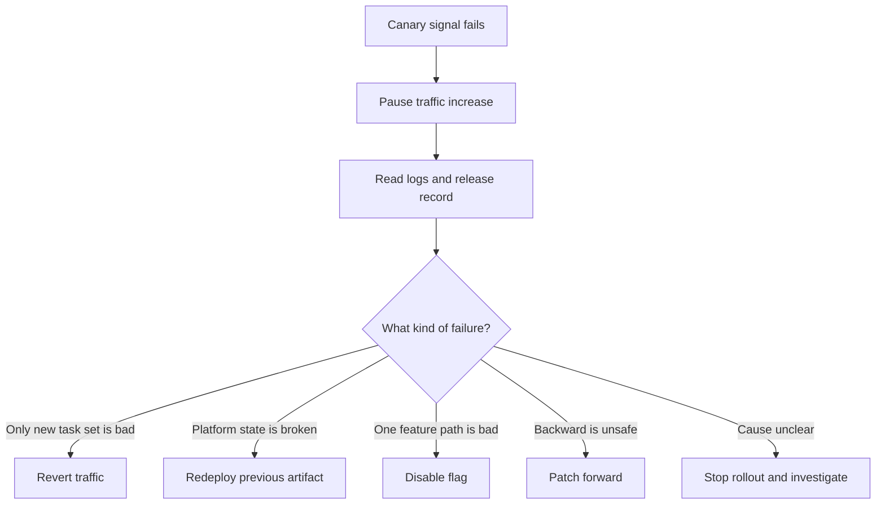

## Table of Contents

1. [What the Decision Is](#what-the-decision-is)
2. [The Example: Version 1.8.4 Fails at Ten Percent](#the-example-version-184-fails-at-ten-percent)
3. [The Recovery Paths](#the-recovery-paths)
4. [Read the Failure Before You Move](#read-the-failure-before-you-move)
5. [Revert Traffic When the Previous Task Set Is Healthy](#revert-traffic-when-the-previous-task-set-is-healthy)
6. [Redeploy the Previous Artifact When Traffic Revert Is Not Enough](#redeploy-the-previous-artifact-when-traffic-revert-is-not-enough)
7. [Disable a Flag When the Bad Behavior Is Isolated](#disable-a-flag-when-the-bad-behavior-is-isolated)
8. [Patch Forward When Backward Is More Dangerous](#patch-forward-when-backward-is-more-dangerous)
9. [Stop the Rollout When the Signal Is Unclear](#stop-the-rollout-when-the-signal-is-unclear)
10. [Write the Release Record While the Facts Are Fresh](#write-the-release-record-while-the-facts-are-fresh)
11. [Speed vs. Certainty](#speed-vs-certainty)

## What the Decision Is

When a deployment starts failing, the hard part is not knowing that something is wrong.
Your graphs, logs, or users will usually tell you that quickly.
The hard part is choosing the recovery move.

A **rollback** means moving production back toward the previous known-good behavior.
That can mean routing traffic to an older task set, redeploying an older artifact, or turning off a feature flag.
A **roll forward** means fixing the broken behavior with a new change and continuing toward the new release.

Both can be correct.
Both can be dangerous.

Rollback feels safer because it points back to a version that worked before.
But a rollback can fail if the database has already changed, if the previous artifact is gone, or if the old version cannot read data written by the new version.

Roll forward feels risky because it changes production again while production is already unhappy.
But it can be safer when the fix is tiny, the cause is clear, and going backward would make the system more confused.

This article teaches the decision, not just the command.
We will keep using `polaris-orders-api`, a Node.js backend deployed to Amazon ECS.
The service is rolling out version `1.8.4`.
The new ECS task set reaches ten percent traffic through CodeDeploy, then checkout errors rise.

The question is simple:

> What is the smallest move that protects users and keeps the team honest about what happened?

That question matters more than the label.
Many teams say "rollback" when they really mean "disable the broken discount rule."
Many teams say "hotfix" when they really mean "we do not know what is broken yet."
Good release work starts by naming the actual move.

## The Example: Version 1.8.4 Fails at Ten Percent

The current production service has two task sets.
The stable task set runs version `1.8.3`.
The canary task set runs version `1.8.4`.

The new version changes discount validation.
CI passed.
Staging passed.
The canary started at ten percent traffic.

The release record looks like this:

```text
release:
  id: rel-2026-04-30-184
  service: polaris-orders-api
  repository: github.com/polaris/orders-api
  commit: 8f3a12c6
  image: 123456789012.dkr.ecr.us-east-1.amazonaws.com/orders-api@sha256:9c1cfbb322f6f2b8f8cc4d2b9f9e6b77c92c8da7ad9226110f0cf0c30a2a7f54

production:
  ecs_cluster: polaris-prod
  ecs_service: orders-api-prod
  stable_task_definition: orders-api:41
  canary_task_definition: orders-api:42
  codedeploy_deployment: d-7A4Q9B2KD
  current_traffic:
    orders-api:41: 90%
    orders-api:42: 10%

owner:
  release_lead: Maya
  app_engineer: Theo
  platform_engineer: Iris
```

The canary starts to fail after six minutes.
The first page of the dashboard is enough to say "something changed", but not enough to say what to do.

```text
time window: 19:05-19:11 UTC

task definition      traffic   5xx rate   p95 latency   checkout success
orders-api:41        90%       0.02%      180 ms        99.4%
orders-api:42        10%       6.80%      410 ms        92.1%
```

That table says the canary is worse than stable.
It does not yet say whether you should revert traffic, disable a flag, redeploy the old image, or patch forward.

You need one more layer of evidence.
You need to know the shape of the failure.



Notice the first move:
pause the rollout.
Do not increase traffic while you are still reading the failure.
You can keep ten percent in place for a short watch window if the impact is small, but you should stop the automatic promotion step.

## The Recovery Paths

The five recovery paths are easier to understand when you separate them by what they change.

| Path | What You Change | Use It When |
|------|-----------------|-------------|
| Revert traffic | Routing percentages | The older task set is healthy and still available |
| Redeploy previous artifact | Running production artifact | The platform state or task history cannot be trusted |
| Disable a flag | Runtime behavior | The bad code path is behind a switch |
| Patch forward | New code or config | The cause is clear and rollback would be worse |
| Stop rollout | Release process | The signal is unclear or the team lacks a safe move |

This table is simple, but it prevents a common mistake.
Teams often jump straight to the move they know best.
If the platform team knows traffic splitting, everything looks like a traffic rollback.
If the app team knows feature flags, everything looks like a flag change.
If the senior engineer is comfortable with hotfixes, everything looks like a patch.

A good release lead asks a slower question:

> Which layer created the bad behavior, and which layer can remove it with the least extra risk?

For `polaris-orders-api`, the layers look like this:

| Layer | What It Controls |
|-------|------------------|
| Traffic routing | Whether users reach stable or canary task sets |
| Runtime configuration | Environment variables, secrets, and feature flags |
| Application artifact | The Node.js image digest built from commit `8f3a12c6` |
| Data state | Database rows, schema changes, and queued messages |
| External dependencies | Payment provider, tax service, and discount service |

When production is failing, do not treat the service as one big black box.
Find the layer.
Then choose the recovery move that changes that layer or safely avoids it.

## Read the Failure Before You Move

Before you take a recovery action, collect enough evidence to avoid making the second problem worse than the first.
This does not mean you wait forever.
It means you spend a few minutes checking the facts that change the decision.

Start with deployment state.
This tells you whether the bad release is actually receiving users.

In this case, CodeDeploy says the deployment is still `InProgress` and the deployment configuration is `CodeDeployDefault.ECSCanary10Percent5Minutes`.
That means the bad release is not fully promoted yet.
It is still at the canary stage, which gives the team a smaller recovery move.

Now read logs for the failing release only.
If you mix stable and canary logs together, the healthy task set can hide the failure.

```text
2026-04-30T19:07:14Z Error: missing DISCOUNT_RULES_URL
2026-04-30T19:07:18Z CheckoutError: discount validation unavailable
2026-04-30T19:07:22Z Error: missing DISCOUNT_RULES_URL
2026-04-30T19:07:30Z CheckoutError: discount validation unavailable
2026-04-30T19:07:39Z Error: missing DISCOUNT_RULES_URL
```

This failure is not random.
The canary is missing an environment variable.
That points to configuration, not a deep code bug.

Now compare task definition configuration.
You want to know whether the new task definition has a missing or different value.

The canary task definition includes `NODE_ENV=production`, `PAYMENT_PROVIDER=stripe`, and `FEATURE_DISCOUNT_V2=true`.
It does not include `DISCOUNT_RULES_URL`.
That missing value matches the log message.

The release record expected `DISCOUNT_RULES_URL`.
The task definition does not have it.

| Variable | Expected | Canary |
|----------|----------|--------|
| `NODE_ENV` | `production` | `production` |
| `PAYMENT_PROVIDER` | `stripe` | `stripe` |
| `FEATURE_DISCOUNT_V2` | `true` | `true` |
| `DISCOUNT_RULES_URL` | Internal discount URL | Missing |

Now the team has a real decision.
The current user impact is real, but the cause is narrow.
The safest first move is probably to remove traffic from the canary.
Then the team can either fix the environment variable and redeploy the same image, or patch the pipeline so the missing variable cannot happen again.

Reading first prevents a bad reflex.
If the team immediately rebuilt a new image without checking the config, the new image might fail the same way.

## Revert Traffic When the Previous Task Set Is Healthy

Traffic revert is the fastest recovery move when the older task set is still healthy.
It changes routing, not code.
For a canary or blue-green deployment, this is usually the first move when the new task set is clearly worse than the old one.

The failure shape looks like this:

```text
stable task set:
  version: 1.8.3
  error rate: normal
  checkout success: normal

canary task set:
  version: 1.8.4
  error rate: high
  checkout success: low

safe move:
  send 100% traffic back to stable
```

The command is short, but the reason matters more than the command.
You are not fixing the canary yet.
You are protecting users by returning them to a task set that is already serving most traffic successfully.

```bash
$ aws deploy stop-deployment --deployment-id d-7A4Q9B2KD --auto-rollback-enabled
```

Then prove the traffic state.
The service should show `orders-api:41` with the expected number of running tasks.
That proof matters because a recovery action is not complete when the command exits.
It is complete when production is back in the state you intended.

The release record should capture this as a recovery action, not as a mystery.

```text
19:12 UTC:
  action: traffic revert
  from: orders-api:42 at 10%
  to: orders-api:41 at 100%
  reason: canary task set returned 6.8% 5xx responses
  evidence: missing DISCOUNT_RULES_URL in canary task definition config
  owner: Maya
```

Traffic revert is usually right when these are true:

- The previous task set is still serving traffic or can receive traffic.
- The failure is clearly worse on the new task set.
- The old task definition can still read current data.
- No forward-only migration has made the old task definition unsafe.

The third and fourth bullets are important.
If version `1.8.4` wrote data that version `1.8.3` cannot read, a traffic revert may create a new error.
That is why database compatibility matters in deployment strategy.

## Redeploy the Previous Artifact When Traffic Revert Is Not Enough

Sometimes traffic revert is not available.
Maybe the platform no longer has the old task definition or image.
Maybe a manual change replaced the service configuration.
Maybe the current task definition points at the right code but the wrong environment.
In those cases, the safer move may be redeploying the previous artifact.

An **artifact** is the built thing you deploy.
For our Node service, it is a container image digest.
If a team deploys a package directly instead of a container image, the same rule applies:
record the exact checksum, not just the friendly version name.

Redeploying the previous artifact is different from reverting traffic.
Traffic revert says, "Use the old running task set."
Redeploy says, "Create a fresh running task set from the old known-good package."

You use it when the running platform state is not trustworthy.

For example, production config was edited during the release, the old task definition points at a removed secret version, and both the new and old task sets fail readiness.
In that case, a traffic revert may not give you a clean state.
The better move is to redeploy the last known-good image digest with known-good config.

The previous artifact should come from the release record, not from memory.

```text
last known-good release:
  id: rel-2026-04-28-183
  version: 1.8.3
  commit: 4b6e91aa
  image: 123456789012.dkr.ecr.us-east-1.amazonaws.com/orders-api@sha256:6447f5a96a80a87f19f6a6549e6dc03f63a2b8124c9d1c2f4a71f5b95ab9a621
  production_task_definition: orders-api:41
```

Then deploy that exact digest.
Do not redeploy `:1.8.3` if you can avoid it.
A tag is a name.
A digest is the exact image content.

The runbook registers a fresh task definition from that digest and updates `orders-api-prod` to use it.
After redeploying, check readiness and `/version`.
You are looking for three facts:
the service is ready, the version is `1.8.3`, and the image digest matches the release record.

Redeploying an old artifact costs more time than traffic revert.
It creates a new task set, waits for startup, and may run into config drift.
But it gives you a clean production state when the running state is messy.

The danger is pretending it is harmless.
If the database changed after `1.8.3`, the old artifact may not understand the new shape.
Before redeploying, ask one data question:

> Did the failed release write anything that the previous artifact cannot read?

If the answer is yes or unknown, slow down.
You may need a patch forward instead.

## Disable a Flag When the Bad Behavior Is Isolated

Feature flags change runtime behavior without deploying new code.
A release flag can hide a new code path.
A kill switch can turn off a risky dependency or feature during an incident.

Flags are useful because they separate deployment from exposure.
You can deploy code today and turn the behavior on later.
You can also turn behavior off without rebuilding the application.

For `polaris-orders-api`, imagine the canary is not crashing.
The service is healthy.
Only checkout requests that use the new discount engine fail.

The task definition is `orders-api:42`.
Readiness is passing.
General API traffic is healthy.
The bad path is narrower:
`POST /checkout` with a discount code returns `DiscountRuleError`.
The flag `FEATURE_DISCOUNT_V2=true` controls that path.

The logs show a different failure shape:

```text
2026-04-30T19:09:51Z DiscountRuleError: rule percentage-off-v2 returned invalid cap
2026-04-30T19:10:03Z DiscountRuleError: rule percentage-off-v2 returned invalid cap
2026-04-30T19:10:27Z DiscountRuleError: rule percentage-off-v2 returned invalid cap
```

If the new discount engine is behind a flag, the smallest move may be to turn the flag off.

```json
{
  "FEATURE_DISCOUNT_V2": false,
  "FEATURE_DISCOUNT_V1": true,
  "updatedBy": "maya",
  "reason": "rel-2026-04-30-184 canary discount errors"
}
```

After disabling the flag, verify behavior through the public service.
The smoke checkout should return `accepted` and report `discountEngine: v1`.
That proves the recovery came from changing behavior, not from moving traffic.

This is not a code rollback.
The new artifact may still be running.
The recovery is that the bad behavior is no longer active.

That distinction matters for the release record.

```text
19:21 UTC:
  action: feature flag disabled
  flag: FEATURE_DISCOUNT_V2
  production artifact: still 1.8.4 canary at 10%
  user impact: checkout errors returned to baseline
  follow-up: fix discount rule cap handling before promotion
```

Flags are not free.
They add branches to the code.
They require tests for both states.
They can hide old paths that nobody cleans up.

Use a flag recovery when the bad behavior is isolated and the fallback path is known to work.
Do not use a flag to hide a release you do not understand.

## Patch Forward When Backward Is More Dangerous

Patch forward means you fix the broken release with a new change.
This is the right move when going backward would be slower, riskier, or impossible.

The clearest example is data.
Imagine version `1.8.4` introduced a new column, started writing it, and version `1.8.3` cannot handle rows where that column is present.
If you route traffic back to `1.8.3`, old code may fail on new data.

```text
release 1.8.4:
  migration: add discount_rule_version column
  write behavior: stores "v2" for new discount checks

release 1.8.3:
  read behavior: assumes discount_rule_version does not exist
  rollback risk: old code crashes when reading new rows
```

In that case, a traffic rollback may not be safe.
A patch forward can be better if the fix is small and clear.

For example, the bug is a missing default value:

```text
error:
  TypeError: Cannot read properties of undefined (reading 'capCents')

root cause:
  new discount rule parser assumes every rule has capCents

safe patch:
  default capCents to null and skip cap comparison when absent
```

The patch should still go through CI.
Emergency does not make untested code safer.
The pipeline should produce a new image digest.

```text
patch release:
  id: rel-2026-04-30-184-p1
  commit: 91d24be3
  image: 123456789012.dkr.ecr.us-east-1.amazonaws.com/orders-api@sha256:46f7aaf3e4f74a47df9342e6a74c23c6013fb0dbad91d6e7ad1e7ac0e6813a90
  reason: fix missing capCents handling in discount parser
```

Deploy the patch as a new CodeDeploy canary first.
Even when patching forward, you still want a small gate before full public traffic.

The patch deployment gets a new deployment ID, such as `d-PATCH91D24BE3`.
Test the failing checkout case through the test listener first.
Only then let the patch receive a small canary slice.

This keeps the team's promise honest:
even a hotfix still earns trust before full traffic.

Patch forward is not a license to rush.
It needs a narrow cause, a narrow fix, and a clear reason rollback is worse.
If you cannot explain those three things, you are probably guessing.

## Stop the Rollout When the Signal Is Unclear

Stopping the rollout is an action.
It is not doing nothing.

You stop when the team cannot choose a safe recovery path yet.
That usually happens when signals disagree, ownership is unclear, or the failure touches data.

Here is a stop-worthy signal:

The canary `5xx` rate is normal, but checkout success is lower than stable.
Logs show no obvious app exception.
The payment provider dashboard shows intermittent timeouts.
Database write latency also increased.

That leaves three live questions.
Is the release bad?
Is the payment provider slow?
Is the new code causing extra database load?

If you promote in this state, you may spread the problem.
If you roll back blindly, you may hide the evidence and still leave users failing.

The safest release action is:

promotion is stopped, traffic is held at ten percent or reverted to zero if impact is user-visible, and one owner takes over the next decision.
The next check is to compare payment timeout rate by task definition.
The next decision time is `19:30 UTC`.

Stopping is especially important when the service has side effects.
A checkout API charges cards, reserves inventory, sends emails, and writes order rows.
If you keep moving traffic while you are confused, you can create data cleanup work that lasts longer than the outage.

Stopping also protects the team.
It gives everyone one shared statement:

> The release is paused. No more traffic increases. Maya owns the release decision. Theo owns application logs. Iris owns platform traffic state. Next decision at 19:30 UTC.

That is much better than five people silently clicking different dashboards.

## Write the Release Record While the Facts Are Fresh

A release record is the small document that says what happened.
It does not need to be fancy.
It needs to be accurate enough that another engineer can understand the decision tomorrow.

Write it during the event, not after everyone forgets.

```text
release: rel-2026-04-30-184
service: polaris-orders-api
version: 1.8.4
commit: 8f3a12c6
image: sha256:9c1cfbb322f6f2b8f8cc4d2b9f9e6b77c92c8da7ad9226110f0cf0c30a2a7f54

timeline:
  19:05 canary moved to 10%
  19:11 canary 5xx rate reached 6.8%
  19:12 traffic reverted to stable task set
  19:15 root cause found: missing DISCOUNT_RULES_URL on canary task definition
  19:24 deploy pipeline updated to require env presence check

decision:
  type: traffic revert
  reason: previous task set healthy, canary config missing required env var
  rejected_options:
    redeploy_previous_artifact: not needed because stable task set was healthy
    disable_flag: not enough because service crashed before discount fallback
    patch_forward: not needed because artifact code was not the first cause

follow_up:
  add pre-deploy env diff check
  add smoke test that calls discount validation path
  rerun release with fixed config
```

The rejected options are useful.
They show the team made a decision, not a guess.

The release record also makes future automation easier.
If every release records the same fields, a workflow can read them.
The next article uses this idea to build a deployment runbook.

## Speed vs. Certainty

Recovery decisions trade speed for certainty.
You rarely get both at full strength.

| Move | Fast? | Certain? | Main Risk |
|------|-------|----------|-----------|
| Revert traffic | Very fast | High if old task set is healthy | Old task definition may not read new data |
| Redeploy previous artifact | Medium | High if artifact and config are known | Startup or config drift can fail |
| Disable a flag | Very fast | High if failure is isolated | Bad code still exists in production |
| Patch forward | Slower | Medium to high if root cause is clear | Second bad deploy during incident |
| Stop rollout | Fast | Honest | User impact may continue while you investigate |

The mature move is not always the fastest command.
The mature move is the one that matches the evidence.

When you are the junior engineer in the room, you do not need to pretend you know the answer instantly.
Ask these questions out loud:

1. Is the previous task set healthy right now?
2. Did the new version write data the old version cannot read?
3. Is the bad behavior behind a flag?
4. Do we know the root cause well enough to patch forward?
5. Who owns the next decision, and when?

Those questions make you useful during a release problem.
They slow the room down just enough to prevent a reflex from becoming the next incident.

---

**References**

- [Amazon ECS Docs: CodeDeploy blue/green deployments](https://docs.aws.amazon.com/AmazonECS/latest/developerguide/deployment-type-bluegreen.html) - Explains ECS task sets and CodeDeploy traffic shifting used for canary and rollback decisions.
- [Amazon ECS Docs: Deploy Amazon ECS services by replacing tasks](https://docs.aws.amazon.com/AmazonECS/latest/developerguide/deployment-type-ecs.html) - Explains native ECS service updates and task replacement for redeploying a previous task definition.
- [AWS CodeDeploy Docs: Stop a deployment](https://docs.aws.amazon.com/codedeploy/latest/userguide/deployments-stop.html) - Shows how to stop a deployment and request rollback.
- [GitHub Actions deployment environments](https://docs.github.com/en/actions/reference/deployments-and-environments) - Covers protected deployment environments and approval controls.
- [LaunchDarkly kill switch flags](https://launchdarkly.com/docs/home/flags/killswitch/) - Gives a concrete vendor example of operational flags used to disable behavior during incidents.
