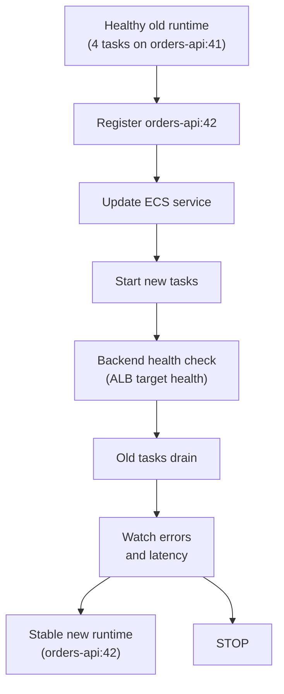

## Table of Contents

1. [What a Rolling Deployment Does](#what-a-rolling-deployment-does)
2. [The Example: One ECS Service, Two Task Definitions](#the-example-one-ecs-service-two-task-definitions)
3. [What a Task Definition Revision Is](#what-a-task-definition-revision-is)
4. [Updating the Service](#updating-the-service)
5. [Checking Readiness as Tasks Join the Target Group](#checking-readiness-as-tasks-join-the-target-group)
6. [Watching ECS Replace Tasks](#watching-ecs-replace-tasks)
7. [Automating the Rollout](#automating-the-rollout)
8. [Failure Modes During a Rollout](#failure-modes-during-a-rollout)
9. [Rolling Back to the Previous Task Definition](#rolling-back-to-the-previous-task-definition)
10. [Speed vs. Safety](#speed-vs-safety)

## What a Rolling Deployment Does

After staging passes, production still has one important question left:
how much of the live system should change at once?

If you replace the whole backend at the same time, the release is simple to understand.
It is also risky.
If the new version fails to start, every request can fail.
If the new version has a slow checkout path, every user can feel it immediately.

A **rolling deployment** avoids that.
It changes production in small pieces.
In a server-based setup, that often means updating one server at a time.
In Amazon ECS, it means starting new tasks from a new task definition while keeping enough old healthy tasks alive.

The mental model is the same in both cases:

> Do not bet all of production on the first move.

Rolling deployments exist because backend services cannot stop while you deploy.
Users keep clicking checkout.
Mobile apps keep retrying API calls.
Background workers keep sending events.
The release process has to work while production is alive.

In this article, we will use a Node.js backend called `devpolaris-orders-api`.
It runs on a managed container service, using Amazon ECS as the concrete example.
The deployment platform hides the individual machines, but it exposes things app developers can reason about:
task definitions, running tasks, target group health, service events, logs, and rollback.

Some runtimes make that last question more sensitive.
A Spring Boot API, for example, may take longer to start and may expose `/actuator/health/readiness` instead of `/readyz`.
That matters because the rollout should wait for the service to be truly ready, not merely running.

## The Example: One ECS Service, Two Task Definitions

`devpolaris-orders-api` handles checkout requests.
The current production release is `1.8.3`.
The new release, `1.8.4`, changes discount validation.

Production starts like this:

```text
service:
  orders-api-prod

public URL:
  https://orders-api.devpolaris.example

current production task definition:
  task definition: orders-api:41
  version: 1.8.3
  image digest: sha256:2b91fe0a7a61
  running tasks: 4

new release candidate:
  task definition: orders-api:42
  version: 1.8.4
  image digest: sha256:9c1cfbb322f6f2b8f8cc4d2b9f9e6b77c92c8da7ad9226110f0cf0c30a2a7f54
  running tasks: 0 at first
```

That `0 at first` detail matters.
It means the new backend task definition can exist before the service uses it.
That gives the pipeline a place to register the new runtime shape and then ask ECS to replace tasks gradually.

The rollout path looks like this:



The exact number of tasks can change.
The habit matters more than the numbers:
replace a small part, check the result, then continue only while the service stays healthy.

## What a Task Definition Revision Is

Amazon ECS stores the runtime shape of a container in a **task definition**.
A task definition says which image to run, how much CPU and memory to request, which port to expose, which environment variables to pass, and which command starts the app.
Each change creates a new task definition revision, such as `orders-api:41` and `orders-api:42`.

Think of it like a deploy snapshot:

```text
task definition revision:
  orders-api:42

contains:
  image digest
  environment variables
  memory and CPU settings
  startup command
  health check settings
  task role
```

That is helpful because rollback becomes a service update.
If task definition `orders-api:42` is bad, the service can point back to `orders-api:41`.
You do not need to rebuild the old code.
You need the previous task definition to still exist and still be compatible with the current data.

For a Node.js app, the task eventually runs `node dist/server.js`.
ECS still needs a clear recipe for the task.
The load balancer still needs a readiness signal before traffic arrives.

Slow-starting runtimes need a little more patience.
For example, the JVM and Spring application context may need time before readiness should pass.

## Updating the Service

Before showing a command, let us name the risk.
If the service stops too many old tasks before new tasks are healthy, users can hit empty capacity or unhealthy targets.
That is not a code problem.
It is a rollout problem.

The safer ECS pattern is:
register a new task definition, then let the ECS service scheduler replace tasks while preserving a minimum number of healthy tasks.

The exact AWS command belongs in a runbook.
The idea belongs here:
the service changes its desired task definition from `orders-api:41` to `orders-api:42`, but it should not throw away all old healthy tasks at once.
The deployment configuration tells ECS to keep enough old capacity alive while it starts new capacity.

That gives the release a safe inspection point:

```text
old task definition:
  orders-api:41
  version: 1.8.3
  running tasks: 4

new task definition:
  orders-api:42
  version: 1.8.4
  running tasks: starting
```

With a native ECS rolling update, there is no separate tagged URL for the new tasks.
The important check is whether the new tasks become healthy in the load balancer target group before old tasks are drained.

## Checking Readiness as Tasks Join the Target Group

Readiness answers a narrow but important question:
can this task receive real requests?

For the Node.js service, `/readyz` checks that the server has loaded config, can reach its database, and can publish a tiny test event.
It should not simply return `200` because the process exists.

ECS and the Application Load Balancer cooperate here.
The task can be running, but the load balancer should not send traffic to it until the target group health check passes.

Target health is the load balancer's view of the rollout.
During the replacement window, a healthy snapshot might look like this:

| Target | State | Meaning |
|--------|-------|---------|
| `10.0.42.18` | healthy | Old task still serving |
| `10.0.43.27` | healthy | Old task still serving |
| `10.0.52.14` | initial | New task being checked |
| `10.0.53.21` | initial | New task being checked |

This is a good moment to slow down as a learner.
`initial` is not failure.
It means the load balancer is still asking, "can I trust this task with real requests?"

Now check the public service version while the rollout is running.
You may see old and new versions during the replacement window.
That is normal for a rolling deployment.

The `/version` endpoint is useful because it tells you which release answered a request.
During a rolling update, seeing both `orders-api:41` and `orders-api:42` is expected.
That mixed state is not messy.
It is the whole point of a rolling deployment.

These checks protect against simple mistakes:
wrong image, missing environment variable, bad database URL, or a process that starts but cannot serve.

For Spring Boot, the equivalent readiness endpoint is often `/actuator/health/readiness`.
The response shape is different, but the release question is the same:
is the app ready to receive traffic?

If readiness fails, stop before moving traffic.
Do not treat a failed readiness check as a warning.
It is the app telling you it should not serve users yet.

## Watching ECS Replace Tasks

Once ECS starts the deployment, it replaces tasks in waves based on the service deployment configuration.
For a service with desired count `4`, `minimumHealthyPercent=100`, and `maximumPercent=200`, ECS can start up to four extra tasks before stopping old ones.
That gives the new tasks time to pass health checks before old capacity leaves.

While this happens, the service has two stories at the same time.
The old task definition is still active because it is protecting users.
The new task definition is primary because it is where ECS is trying to go.

| Status | Task definition | Running count | Meaning |
|--------|-----------------|---------------|---------|
| `PRIMARY` | `orders-api:42` | 2 | New release is joining |
| `ACTIVE` | `orders-api:41` | 4 | Old release is still protecting capacity |

Now watch the release signal:

```text
window: 10 minutes

task definition orders-api:41 version 1.8.3:
  requests: 9120
  5xx rate: 0.05%
  p95 latency: 172ms

task definition orders-api:42 version 1.8.4:
  requests: 1012
  5xx rate: 0.07%
  p95 latency: 181ms
```

`5xx` means server errors such as `500`, `502`, or `503`.
`p95 latency` means 95 percent of requests were faster than that number.
Those two signals are not everything, but they are good first signals for a backend API.

When the rollout finishes, ECS should show only the new task definition as primary:

| Status | Task definition | Running count | Meaning |
|--------|-----------------|---------------|---------|
| `PRIMARY` | `orders-api:42` | 4 | Rollout reached steady state |

At that point, the new task definition is production.
Keep the old task definition and image digest available until the team is confident rollback is no longer needed.

## Automating the Rollout

You do not want a person typing traffic commands from memory during every release.
Manual traffic changes drift.
People skip checks when they are tired.
A good CI/CD pipeline turns the rollout into a repeatable path.

The workflow does not need to show every AWS flag to teach the release.
It should show the story in plain order:
create the new task definition, update the service, wait for health, watch signals, then confirm steady state.

```yaml
jobs:
  rollout:
    environment:
      name: production
      url: https://orders-api.devpolaris.example
    steps:
      - run: ./scripts/register-task-definition.sh "$IMAGE_DIGEST"
      - run: ./scripts/update-ecs-service.sh orders-api-prod
      - run: ./scripts/watch-rollout.sh orders-api-prod --minutes 15
```

The scripts hide tool syntax.
The workflow still shows the release story:
register the task definition, update the service, and watch production.

This is important for reviews.
A reviewer should not need to read a 300-line Bash script to understand the rollout path.
The workflow should make the operational order visible.

## Failure Modes During a Rollout

The happy path is useful, but rolling deployments become real when you understand the failure shapes.
Here are the mistakes that matter most for a managed Node.js backend.

### Failure 1: The New Tasks Never Become Healthy

The new task definition is registered, but tasks never pass target group health checks.

The pipeline output looks like this:

| Target | State | Reason |
|--------|-------|--------|
| `10.0.52.14` | unhealthy | `Target.ResponseCodeMismatch` |
| `10.0.53.21` | unhealthy | `Target.ResponseCodeMismatch` |

That status means the load balancer asked the health endpoint a question and did not get the expected answer.
Now the app log gives the human reason:

```text
2026-04-30T18:23:09Z booting devpolaris-orders-api version=1.8.4
2026-04-30T18:23:10Z readiness failed reason="missing ORDERS_TOPIC"
2026-04-30T18:23:15Z readiness failed reason="missing ORDERS_TOPIC"
```

The fix is not to push traffic anyway.
Let the ECS deployment circuit breaker stop the bad deployment, fix the missing configuration, and deploy a new task definition.

For a Spring Boot service, the failure may look like a profile problem:

```text
readiness: DOWN
reason: profile "prod" expects ORDERS_TOPIC but it is not configured
```

Different runtime, same decision:
do not let a task serve users when the health checks say it is not ready.

### Failure 2: The New Tasks Are Slow After Traffic Moves

Readiness can pass while real requests still behave badly.
Maybe the Node app starts, but the new discount validation path is slow.
Maybe a JVM-based app starts, but the JVM needs more warmup before latency settles.

The rollout window shows the problem:

```text
window: 10 minutes

task definition orders-api:41 version 1.8.3:
  requests: 9120
  5xx rate: 0.05%
  p95 latency: 172ms

task definition orders-api:42 version 1.8.4:
  requests: 1012
  5xx rate: 0.06%
  p95 latency: 611ms
```

The error rate is fine, but the new tasks are much slower.
That is still a bad rollout signal.

The first action is to stop the rollout and move the service back to the previous task definition.
Then inspect app logs, traces, database timings, or JVM warmup settings.

### Failure 3: The Service Points at the Wrong Task Definition

Service update commands are easy to mistype.
If the script updates the wrong cluster or wrong service, you can deploy a release to the wrong place.

Always print the actual service state after changing it:

| Service | Task definition | Desired | Running |
|---------|-----------------|---------|---------|
| `orders-api-prod` | `orders-api:42` | 4 | 4 |

That table is not busy work.
It proves the service you think you updated is the service production actually runs.

### Failure 4: The App Rollback Works but the Data Rollback Does Not

Rolling back to task definition `orders-api:41` only changes which code serves new requests.
It does not undo data written by tasks from `orders-api:42`.

Suppose `1.8.4` writes a new field called `discountRulesV2`.
Version `1.8.3` does not understand that field.
After rollback, old tasks may fail when they read orders touched by the new tasks:

```text
2026-04-30T18:41:03Z checkout failed order_id=ord_9128 reason="unknown discountRulesV2"
2026-04-30T18:41:11Z checkout failed order_id=ord_9134 reason="unknown discountRulesV2"
```

The fix is not a better traffic command.
The fix is a compatible data change:
old and new code must be able to read the data during the rollout.

## Rolling Back to the Previous Task Definition

Rollback should be fast and boring.
When signals are bad, protect users first.
Debug after traffic is safe.

If `orders-api:42` is bad, update the ECS service back to `orders-api:41`.
Then confirm the public `/version` endpoint shows the previous release.
The command is not the main lesson.
The main lesson is that the rollback target must be known before the bad signal appears.

The release record can be short:

```text
release attempted: 2026-04-30-8f3a12c6
bad task definition: orders-api:42
rollback task definition: orders-api:41
service steady state restored: yes
reason: p95 latency rose from 172ms to 611ms
user impact: limited to the rolling replacement window
next action: inspect discount validation query
```

That record is useful because it keeps the incident from becoming a guessing game.
The next engineer can see what changed, when it stopped, and what to inspect first.

## Speed vs. Safety

Rolling deployments trade speed for safety.
You spend more time watching the release, but each step has a smaller blast radius.

For `devpolaris-orders-api`, the team chooses this default:

```text
default production rollout:
  register new task definition
  update ECS service with deployment circuit breaker enabled
  wait for target group health
  watch errors and latency while tasks are replaced
  confirm service steady state
  keep previous task definition ready for rollback
```

That is a good default for checkout.
Checkout is important.
The team would rather spend a few extra minutes than discover a bad release after every request has already moved.

For a lower-risk internal tool, the team might move from `0%` to `100%` after a readiness check.
That is faster.
It also means a bad release can affect everyone at once.

Here is the simple decision table:

| Deployment Style | Good Fit | Main Benefit | Main Cost |
|------------------|----------|--------------|-----------|
| Immediate 100% | Tiny internal tools | Fast release | Highest user impact if bad |
| Native ECS rolling | Normal backend releases | Gradual task replacement | Less control over exact percentages |
| CodeDeploy canary | Checkout, login, payment | Explicit small traffic slice | More setup |
| Blue-green | Full replacement test | Fast traffic switch | More setup |
| Canary | Long observation on small slice | Real-user signal | More metrics discipline |

A rolling deployment is not about being fancy.
It is about being able to stop.
Change a small part, check the result, keep a rollback target, and stop when the signals are bad.

---

**References**

- [Amazon ECS Docs: Deploy Amazon ECS services by replacing tasks](https://docs.aws.amazon.com/AmazonECS/latest/developerguide/deployment-type-ecs.html) - Explains native ECS rolling updates and how service deployment configuration controls replacement.
- [Amazon ECS Docs: Deployment circuit breaker](https://docs.aws.amazon.com/AmazonECS/latest/developerguide/deployment-circuit-breaker.html) - Shows how ECS can stop and roll back a failed rolling deployment.
- [Elastic Load Balancing Docs: Target group health checks](https://docs.aws.amazon.com/elasticloadbalancing/latest/application/target-group-health-checks.html) - Explains how an Application Load Balancer decides whether ECS tasks are healthy enough for traffic.
- [GitHub Docs: Deploying with GitHub Actions](https://docs.github.com/en/actions/concepts/use-cases/deploying-with-github-actions) - Shows how deployment workflows fit into GitHub Actions.
- [Spring Boot Docs: Actuator Endpoints](https://docs.spring.io/spring-boot/reference/actuator/endpoints.html) - Documents the readiness endpoint used in the Spring Boot rollout examples.
