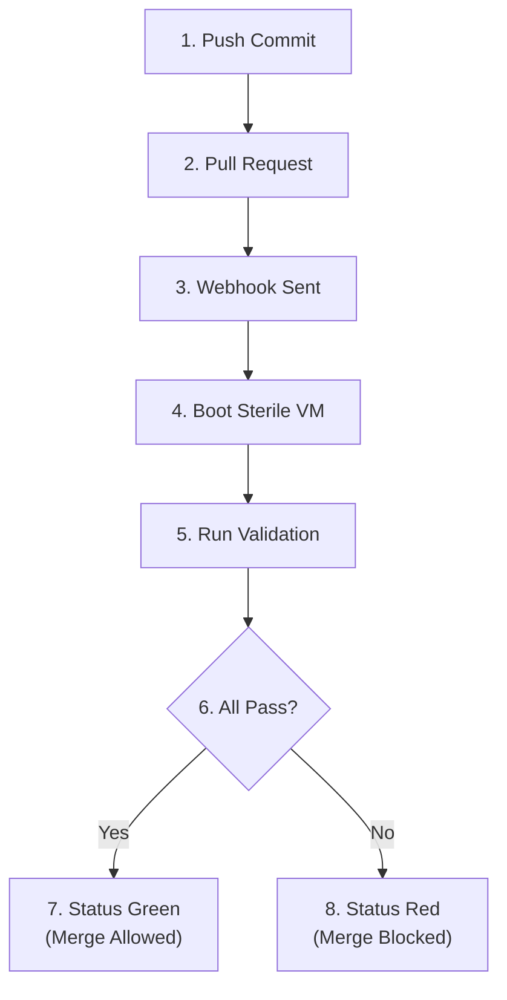

## Table of Contents

1. [Continuous Integration as the Operational Baseline](#continuous-integration-as-the-operational-baseline)
2. [The Core Loop: Merge Early, Validate Often](#the-core-loop-merge-early-validate-often)
3. [The Branching Evolution: Trunk-Based Workflows vs. Feature Drift](#the-branching-evolution-trunk-based-workflows-vs-feature-drift)
4. [Anatomy of the Automated Validation Path](#anatomy-of-the-automated-validation-path)
5. [Writing Declarative Pipeline Specifications](#writing-declarative-pipeline-specifications)
6. [The Testing Pyramid: Balancing Velocity and Confidence](#the-testing-pyramid-balancing-velocity-and-confidence)
7. [The Sterile Runner: Eliminating Environment Drift](#the-sterile-runner-eliminating-environment-drift)
8. [Common Failure Mode 1: The Missing Dependency](#common-failure-mode-1-the-missing-dependency)
9. [Common Failure Mode 2: The Flaky Test](#common-failure-mode-2-the-flaky-test)
10. [Putting It All Together](#putting-it-all-together)
11. [What's Next](#whats-next)

## Continuous Integration as the Operational Baseline

When multiple developers write code simultaneously, combining their changes into a unified application introduces friction. If team members work on isolated features for weeks before merging, they face a collision of conflicting changes. They discover broken dependencies, database schema mismatches, and regression bugs only at the end of the project. 

Continuous Integration (CI) is the engineering practice designed to resolve this bottleneck. It enforces the frequent integration of code changes into a shared mainline repository, often multiple times a day. 

Every proposal to merge code triggers an automated build and test sequence. This sequence programmatically verifies that the new code does not break existing application behavior. In the software delivery lifecycle, this automated gate stands between the developer's local code edits and the shared mainline.

Consider an industrial assembly analogy. When manufacturing a vehicle, engineers build the engine, chassis, and electrical wiring in separate locations. If these components are only assembled on the final day, the components will not align. Mount points will be off, and wire harnesses will be short. 

Continuous Integration represents the practice of continuously assembling and testing components at every stage of production. By integrating early, errors are caught when they are small and easy to fix.

## The Core Loop: Merge Early, Validate Often

The operation of Continuous Integration rests on two rules:

First, merge early. Developers must commit small, incremental modifications to the shared repository frequently. This practice prevents feature branches from drifting away from the state of the mainline.

Second, validate often. Every commit pushed to the repository must undergo automated verification. If a team relies on manual QA (Quality Assurance) loops or manual scripts to inspect every code change, developers skip the steps when deadlines approach.

When a team operates this core loop, the time to detect a bug drops from weeks to minutes. If a build fails, the engineer only needs to inspect the small set of changes pushed in the last commit. This isolates the root cause and prevents the rest of the team from inheriting broken states.

## The Branching Evolution: Trunk-Based Workflows vs. Feature Drift

To integrate code frequently, teams must choose a branching strategy.

The first strategy is the **Feature Branch Workflow**. A developer creates a dedicated branch (such as `feature/billing-api`) to build a specific capability, commits code to it for several days, and opens a Pull Request (PR) when the task is complete. The CI system executes the test suite against this PR. Once the status check goes green and a peer reviews the change, the branch is merged into the mainline. While this workflow is common, long-lived feature branches still accumulate drift if a feature takes weeks to complete.

The second, more advanced strategy is **Trunk-Based Development**. In this workflow, developers commit their changes directly to the mainline (the trunk) multiple times a day. This model eliminates long-lived feature branches. If a feature takes several weeks to complete, developers still push their partial code daily, but they wrap the active paths in a **Feature Flag**.

A feature flag is a simple conditional check resolved at application runtime:

```javascript
if (configuration.isBillingFeatureEnabled) {
  executeNewBillingLogic();
} else {
  executeLegacyBillingLogic();
}
```

Because the feature flag is disabled in production, the incomplete code remains inactive for customers. However, the code is continuously built and tested alongside the active paths. If another developer makes a breaking change to a shared database model, the automated test suite will immediately catch the conflict with the new billing logic. Trunk-based development represents the purest form of CI because integration happens continuously, without waiting for branch promotions.

## Anatomy of the Automated Validation Path

A modern CI workflow links a version control platform (such as GitHub or GitLab) with an automated build server (such as GitHub Actions or Jenkins).

Here is the operational pathway of an automated validation check:



This sequence begins the moment you push a branch change. The version control system triggers a webhook that notifies the CI controller. The controller provisions a sterile, isolated virtual machine (VM) or container workspace. The runner clones the repository, installs dependencies, and executes the test scripts. 

If any command in the sequence returns a non-zero exit code, the runner halts and reports a failure to the repository host, which automatically blocks the merge button.

## Writing Declarative Pipeline Specifications

A CI pipeline is defined in a declarative configuration file, typically written in YAML, that outlines the execution environment, triggers, and steps.

Consider a standard GitHub Actions pipeline configuration:

```yaml
name: Node.js Continuous Integration

on:
  pull_request:
    branches: [ "main" ]

jobs:
  validate:
    runs-on: ubuntu-latest
    steps:
    - name: Checkout Repository Code
      uses: actions/checkout@v4

    - name: Configure Node.js Environment
      uses: actions/setup-node@v4
      with:
        node-version: '20'

    - name: Install Locked Dependencies
      run: npm ci

    - name: Execute Source Code Linter
      run: npm run lint

    - name: Execute Automated Test Suite
      run: npm test
```

This YAML manifest tells the platform to execute the `validate` job whenever a pull request targets the `main` branch. 

The `runs-on:` instruction provisions a clean Ubuntu Linux virtual machine. 

The `steps:` block defines the execution order. The runner first clones the code using the checkout action, configures the Node.js runtime version, and executes `npm ci` (Clean Install). The clean install command reads the `package-lock.json` file to install the exact dependency versions locked by the team, preventing runtime drift. 

Finally, the runner executes the code linter (such as ESLint) and the automated test suite (such as Jest). If the test command returns exit code 0, the build succeeds; if it returns a non-zero exit code, the pipeline fails.

## The Testing Pyramid: Balancing Velocity and Confidence

A senior engineer must balance two competing forces in CI design: execution speed and verification confidence. We achieve this balance by structuring our test suites to follow the **Testing Pyramid**.

Here is the structured trade-off matrix:

* **Unit Tests**:
  * Scope: Isolated functions, methods, or single classes.
  * Speed: Milliseconds per test.
  * Confidence: Low (verifies logic in isolation; does not test integrations).
  * Target Count: Thousands of tests.
* **Integration Tests**:
  * Scope: Interactions between multiple components (such as API routes and databases).
  * Speed: Seconds per test.
  * Confidence: Medium (verifies system boundaries and data flows).
  * Target Count: Hundreds of tests.
* **End-to-End (E2E) Tests**:
  * Scope: Complete user journeys executed in a real browser context.
  * Speed: Minutes per test.
  * Confidence: High (verifies the entire customer experience).
  * Target Count: Tens of tests.

By keeping the test suite bottom-heavy, a CI pipeline can run thousands of unit tests in under a minute. 

We limit the slow, resource-heavy End-to-End (E2E) tests to critical business flows, such as customer login or payment processing. This strategy guarantees that the pipeline completes in under ten minutes, keeping developers in their flow state while providing high confidence before deployment.

## The Sterile Runner: Eliminating Environment Drift

The greatest value of an automated CI runner is that it eliminates the classic "It works on my machine" defense.

A developer's laptop is an unmonitored environment. Over months of work, engineers install global packages, modify system environment variables, and accumulate hidden files. Code that runs perfectly on a developer's machine might fail in production because of a missing package or a specific local setting.

The CI runner provides a sterile environment. Every time a pipeline executes, the runner boots up as a pristine virtual machine. It has no pre-existing files, global caches, or local shortcuts. 

By forcing the application to prove it can build and pass its tests from absolute scratch using only the instructions declared in the repository, the pipeline guarantees that the build is repeatable and safe for production servers.

## Common Failure Mode 1: The Missing Dependency

The most common reason a CI pipeline fails during first-time dependency updates is a missing declaration in the package configuration.

An engineer installs a utility library (such as `lodash`) locally. They execute the install command, write the implementation, and run their local test suite. The tests pass on their laptop. The developer commits the files, pushes the branch, and opens a Pull Request.

Within a minute, the CI pipeline fails. The engineer opens the build log and finds the Jest test execution error:

```text
> my-app@1.0.0 test
> jest

FAIL  src/cart.test.js
  ● Test suite failed to run

    Cannot find module 'lodash' from 'src/cart.js'

      1 | const express = require('express');
    > 2 | const _ = require('lodash');
        |           ^

Error: Process completed with exit code 1.
```

The error is a missing dependency. When the developer installed the library locally, they forgot to record it in their `package.json` file. Because their local `node_modules` directory already contained the package, the local tests passed. 

However, the sterile CI runner booted with an empty directory, read the `package.json` manifest, and ran `npm ci`. Because the library was missing from the manifest, it was never installed on the runner.

To resolve this, the developer runs `npm install lodash` locally, which updates `package.json` and `package-lock.json`, commits these files, and pushes again. The pipeline builds successfully.

## Common Failure Mode 2: The Flaky Test

The second, more dangerous failure mode is the **Flaky Test**. A flaky test is a test that sometimes passes and sometimes fails without any change to the source code.

Consider an asynchronous database test:

```javascript
test('creates user record', async () => {
  await database.createUser({ id: 101, name: 'Maya' });
  await sleep(100);
  const user = await database.findUser(101);
  expect(user.name).toBe('Maya');
});
```

On the developer's laptop, the database query executes in 20 milliseconds, so waiting 100 milliseconds is sufficient. The test passes consistently.

However, the CI runner executes on shared cloud infrastructure under heavy CPU load. In the runner environment, the database query occasionally takes 120 milliseconds. The test checks the database at 100 milliseconds, finds no user record, and fails. The developer sees the red status, clicks "Re-run Job," and the second attempt passes because the cloud server was under less load.

This behavior destroys the value of Continuous Integration. When developers learn that they can bypass a red build by simply clicking "Re-run" until it turns green, they stop trusting the pipeline. When a real, critical bug breaks the build, they assume it is another flaky test and ignore the signal.

To resolve this, the developer must eliminate hardcoded timers. The test should use a polling utility that waits for the database state to settle:

```javascript
test('creates user record', async () => {
  await database.createUser({ id: 101, name: 'Maya' });
  const user = await waitForCondition(() => database.findUser(101));
  expect(user.name).toBe('Maya');
});
```

This change ensures the test remains resilient to CPU and network fluctuations, maintaining the integrity of the CI status gate.

## Putting It All Together

Continuous Integration enforces high code quality and eliminates integration drift by programmatically building and testing every change. By merging early, validating often, implementing trunk-based development with feature flags, and structuring a balanced testing pyramid, engineering teams deliver software reliably without sacrificing developer velocity.

When configuring and auditing your CI pipelines, ensure you enforce these five core practices:

First, mandate continuous integration of changes. Avoid long-lived feature branches; push code to the shared mainline at least once a day, using feature flags to isolate incomplete code.

Second, ensure the pipeline is the primary quality gate. Never merge code to `main` without a passing status check from the automated build server.

Third, maintain a balanced testing pyramid. Focus your CI resources on fast, deterministic unit and integration tests, reserving slow end-to-end browser tests for critical business flows.

Fourth, rely on clean, repeatable environments. Never point test runs to persistent, shared databases; use service containers or ephemeral runtimes to guarantee a sterile start.

Fifth, eliminate flaky tests immediately. Never tolerate a test suite that passes randomly; rewrite asynchronous steps to poll for state rather than relying on sleep timers.

## What's Next

Programmatically validating code ensures that our changes are logically sound. However, we must also understand the execution engines that run these pipelines and the artifacts they compile. In the next chapter, **Pipelines, Runners, and Artifacts**, we will explore the split-brain architecture of controllers and runners, evaluate hosted versus self-hosted executors, mount isolated database containers, and manage dependency caches safely.

---

**References**

- [Continuous Integration by Martin Fowler](https://martinfowler.com/articles/continuousIntegration.html) - Seminal industry essay defining the rules, benefits, and operational mechanics of CI.
- [GitHub Actions Workflow Syntax](https://docs.github.com/en/actions/using-workflows/workflow-syntax-for-github-actions) - Technical specification for declaring jobs, steps, runners, and environments.
- [NIST SP 800-218 Secure Software Development Framework](https://csrc.nist.gov/pubs/sp/800/218/final) - NIST recommendations on automated verification, code integrity, and delivery gates.
- [OWASP Software Component Verification Standard](https://owasp.org/www-project-software-component-verification-standard/) - Industry standards for secure dependency locking and validation.
