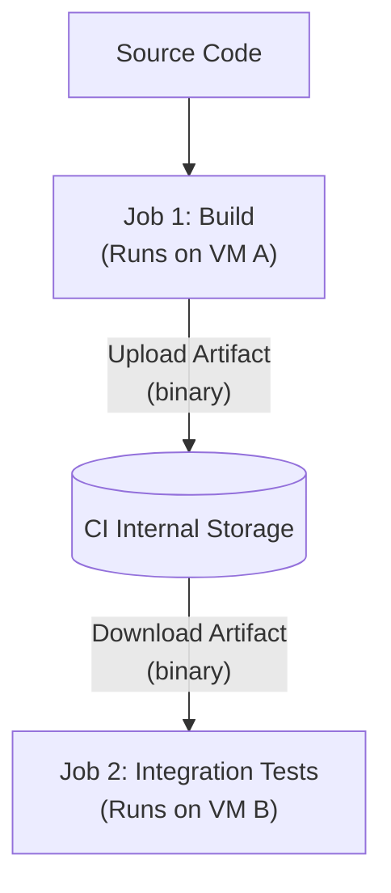
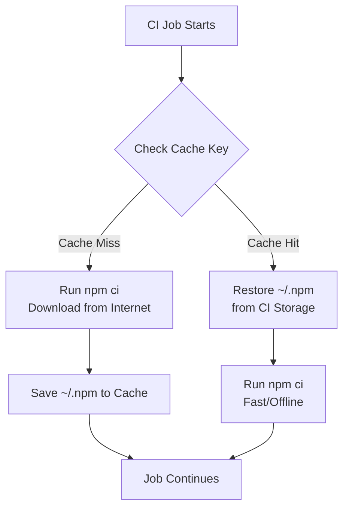

## Table of Contents

1. [The Ephemeral Problem](#the-ephemeral-problem)
2. [What Is an Artifact?](#what-is-an-artifact)
3. [Passing State Between Jobs](#passing-state-between-jobs)
4. [Registries vs. Pipeline Storage](#registries-vs-pipeline-storage)
5. [Caching: Speeding Up the Pipeline](#caching-speeding-up-the-pipeline)
6. [Cache Keys and Invalidation](#cache-keys-and-invalidation)
7. [A Real Failure: The Poisoned Cache](#a-real-failure-the-poisoned-cache)
8. [The Network vs. Compute Tradeoff](#the-network-vs-compute-tradeoff)

## The Ephemeral Problem

The defining characteristic of a modern CI/CD system is that the execution environment is ephemeral. When a job finishes, the Virtual Machine running it is immediately destroyed, taking its hard drive and every file on it into the incinerator. 

This design guarantees a pristine clean room for the next job, ensuring that leftover files do not secretly allow bad code to pass tests.

However, this creates a massive operational problem. If the goal of your pipeline is to compile a Go binary or bundle a React frontend, the runner does the hard work, creates the files, and then destroys itself. The compiled binary vanishes. If you need to deploy that binary to a server, or if a subsequent job needs to analyze that binary for security vulnerabilities, it cannot access the files because the runner no longer exists.

To solve this, CI systems provide two distinct mechanisms for persisting files: **Artifacts** and **Caches**. They sound similar, but they serve completely different purposes. Artifacts are the *output* of your work that you want to keep. Caches are the *inputs* to your work that you want to reuse to save time.

## What Is an Artifact?

An artifact is any file or directory produced during a pipeline run that you explicitly tell the CI system to save before destroying the runner.

Think of the runner like a chef in a rented kitchen. The chef buys ingredients, chops them, cooks a meal, and plates it. When their time is up, the kitchen is demolished. If the chef wants the customer to eat the meal, they must explicitly hand the plate out the window before the demolition occurs. That plated meal is the artifact.

Artifacts are tied to the specific pipeline run that created them. If Pipeline Run #123 builds `app-v1.0.zip`, that ZIP file is permanently associated with Run #123. If the pipeline fails later, or if a developer needs to debug why the app crashed in production, they can navigate to the CI dashboard for Run #123 and click a button to download the exact ZIP file that was created.

Common examples of artifacts include:
- Compiled binaries (e.g., a `.exe` or a Go executable).
- Minified frontend assets (a `dist/` directory).
- Test coverage reports (HTML files showing which lines of code were tested).
- Mobile application bundles (`.apk` or `.ipa` files).

## Passing State Between Jobs

Because pipelines are Directed Acyclic Graphs (DAGs) made of isolated jobs, artifacts serve as the bridge between those jobs.

Imagine a pipeline with two jobs: `build` and `test-integration`. The `build` job takes 10 minutes to compile a massive application. The `test-integration` job needs to run tests against that compiled application.



Because Job 1 and Job 2 run on completely different virtual machines, Job 2 cannot simply `cd` into the directory where Job 1 left the files. Instead, Job 1 must upload the files to the CI provider's internal storage. When Job 2 starts, its very first step is to download those files.

Here is what that looks like in YAML:

```yaml
jobs:
  build:
    runs-on: ubuntu-latest
    steps:
      - uses: actions/checkout@v4
      - run: make build
      - name: Upload compiled binary
        uses: actions/upload-artifact@v4
        with:
          name: compiled-app
          path: ./bin/app

  test-integration:
    needs: build
    runs-on: ubuntu-latest
    steps:
      - name: Download compiled binary
        uses: actions/download-artifact@v4
        with:
          name: compiled-app
          path: ./bin
      - run: chmod +x ./bin/app
      - run: ./test-script.sh ./bin/app
```

Notice that Job 2 does *not* include a `checkout` step. It does not need the raw source code. It only needs the compiled artifact produced by Job 1. By passing artifacts between jobs, you prevent duplicating expensive work.

## Registries vs. Pipeline Storage

When discussing artifacts, it is critical to distinguish between **Pipeline Storage** and a **Registry**.

When you use `actions/upload-artifact`, the file is stored in the CI provider's internal storage, tightly coupled to that specific pipeline run. It usually has a short retention policy (e.g., deleted after 90 days). It is designed for passing state between jobs or for short-term debugging.

A **Registry** (like Docker Hub, NPM, AWS ECR, or GitHub Packages) is a permanent, versioned storage system designed for distribution. 

If your pipeline builds a Docker image, you do not use `upload-artifact` to save the massive 1GB `.tar` file into the CI system. Instead, your pipeline authenticates with a Docker Registry and runs `docker push`. The registry is the permanent home for the artifact. When your deployment pipeline runs, it does not download the artifact from the CI system; it tells the production server to `docker pull` directly from the registry.

- **Pipeline Artifacts**: Temporary, tied to a specific run, used for inter-job communication and debugging.
- **Registries**: Permanent, versioned, designed for deploying to production or sharing with other teams.

| Feature | Pipeline Artifacts (Internal Storage) | Registries (Docker Hub, NPM, etc.) |
| :--- | :--- | :--- |
| **Lifespan** | Temporary (e.g. 30-90 days) | Permanent (Until explicitly deleted) |
| **Scope** | Tied to a specific CI pipeline run | Available globally across environments |
| **Primary Use** | Passing state between jobs, debugging | Deploying to production, library distribution |

## Caching: Speeding Up the Pipeline

While artifacts store outputs, caching stores inputs.

A modern Node.js application might rely on 1,500 transitive dependencies in its `package.json`. Every time a developer pushes code, the CI runner boots up and runs `npm ci` to download those dependencies. That download might take 2 minutes and consume 500MB of bandwidth. If a team pushes code 100 times a day, the CI system spends 3 hours a day just downloading the exact same files from the NPM registry.

Caching solves this by saving the downloaded files after the first run and restoring them on subsequent runs.

```yaml
      - name: Cache node modules
        uses: actions/cache@v3
        with:
          path: ~/.npm
          key: ${{ runner.os }}-node-${{ hashFiles('**/package-lock.json') }}
          
      - name: Install dependencies
        run: npm ci
```

When this runs, the CI system looks at the `key`. If it has never seen this key before (a **Cache Miss**), it skips the restore step, allows `npm ci` to download everything from the internet, and then saves the `~/.npm` folder to its internal storage under that key.

On the next pipeline run, it checks the key again. If the key matches (a **Cache Hit**), the CI system instantly drops the 500MB folder onto the runner's disk before `npm ci` runs. When `npm ci` executes, it sees the files are already there and finishes in 2 seconds instead of 2 minutes.



## Cache Keys and Invalidation

The magic of caching entirely depends on the **Cache Key**. 

A cache is essentially a giant key-value store. The value is the ZIP file containing your dependencies. The key is a string you define. If you used a static key like `my-node-cache`, the CI system would restore the exact same dependencies every single time you ran a pipeline.

But dependencies change. A developer adds a new library to `package.json`. If the cache key remains `my-node-cache`, the CI system restores the old dependencies, and the build fails because the new library is missing.

To solve this, the cache key must change automatically whenever the dependencies change. This is called **Cache Invalidation**.

Look closely at the key from the previous section:
`key: ${{ runner.os }}-node-${{ hashFiles('**/package-lock.json') }}`

This dynamically generates a string like `Linux-node-a1b2c3d4e5f6`. The hash changes if and only if the `package-lock.json` file changes.
1. Developer A pushes code modifying `app.js`. The lockfile is unchanged. The hash is `a1b2`. Cache Hit. Fast build.
2. Developer B installs a new library. The lockfile changes. The hash becomes `f9e8`. The CI system looks for `Linux-node-f9e8` and doesn't find it. Cache Miss. It downloads the new library and saves a new cache entry.

By tying the cache key to a cryptographic hash of the lockfile, you guarantee that the cache is perfectly synchronized with your actual dependencies.

## A Real Failure: The Poisoned Cache

Caching is the most common cause of bizarre, unreproducible CI failures. When a cache is incorrectly configured or corrupted, it is called a **Poisoned Cache**.

Imagine you are using a cache key that does not hash the lockfile, but instead uses the current branch name: `key: node-cache-${{ github.ref }}`.

1. Developer A pushes code to `main`. The cache misses, downloads dependencies, and saves them under the key `node-cache-main`.
2. Developer B pushes a commit that removes a library from `package.json`. The CI runs. It restores `node-cache-main`. The old library is placed back on the disk. The tests run and pass, because the library is physically present.
3. The code is merged and deployed.
4. The production server crashes with `Module not found`.

The CI pipeline lied. It told you the code was valid, but the code only passed because the poisoned cache injected a ghost dependency that did not actually exist in the source code.

To diagnose a poisoned cache, look at the pipeline logs for the restore step:

```text
Run actions/cache@v3
  with:
    path: ~/.npm
    key: node-cache-main
Cache restored from key: node-cache-main
Size: 450 MB
```

If you suspect a poisoned cache, the immediate diagnostic step is to bypass it. Most CI systems allow you to manually clear caches via the UI, or you can temporarily change the key in your YAML file (e.g., `key: node-cache-v2-${{ github.ref }}`) to force a Cache Miss. If the build suddenly behaves differently on a clean run, your cache was poisoned.

## The Network vs. Compute Tradeoff

Why don't we cache everything? If caching saves time, why not cache the `node_modules` folder, the `.git` directory, and every compiled intermediate file?

Because downloading a cache takes time. 

If your cache is 5GB of Docker layers, the runner has to download 5GB from the CI provider's internal storage over the network, decompress it, and write it to disk. 

If downloading and decompressing the cache takes 3 minutes, but simply rebuilding the Docker layers from scratch only takes 2 minutes, the cache has actually made your pipeline slower.

This is the Network vs. Compute tradeoff. 
- You **should** cache things that require heavy network calls to external registries (like downloading 1,000 tiny NPM packages) or extreme CPU time (like compiling a heavy C++ library).
- You **should not** cache things that are extremely large but fast to generate, because the network transfer time will exceed the compute time.

Senior engineers periodically audit their CI caches by looking at the "Restore" step duration in the logs. If restoring the cache takes longer than the job took before caching was introduced, they delete the cache step entirely. In CI/CD, complexity must pay for itself in speed or safety.

---

**References**

- [GitHub Actions: Caching Dependencies to Speed Up Workflows](https://docs.github.com/en/actions/using-workflows/caching-dependencies-to-speed-up-workflows) - Official guide detailing the mechanics of cache keys, paths, and eviction policies.
- [Docker Documentation: Optimize Builds with Cache Management](https://docs.docker.com/build/cache/) - Deep dive into how container layers act as a specialized form of caching and how to structure Dockerfiles to maximize cache hits.
