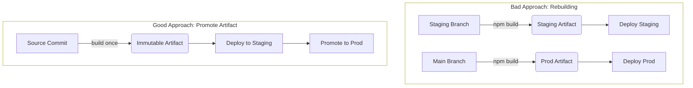

## Table of Contents

1. [What Is Continuous Delivery?](#what-is-continuous-delivery)
2. [Continuous Delivery vs. Continuous Deployment](#continuous-delivery-vs-continuous-deployment)
3. [The Problem with Manual Releases](#the-problem-with-manual-releases)
4. [The Golden Rule: Build Once, Deploy Everywhere](#the-golden-rule-build-once-deploy-everywhere)
5. [Anatomy of a Deployment Pipeline](#anatomy-of-a-deployment-pipeline)
6. [State and Secrets: Managing Environments](#state-and-secrets-managing-environments)
7. [A Real Deployment Failure](#a-real-deployment-failure)
8. [Environments and Blast Radius](#environments-and-blast-radius)
9. [Rollbacks: Optimizing for MTTR](#rollbacks-optimizing-for-mttr)

## What Is Continuous Delivery?

Continuous Integration (CI) guarantees that your code is valid, tested, and securely packaged. But a validated package sitting in a registry provides no value to your users. You must put it on a server where it can run.

Continuous Delivery (CD) is the practice of automating the release process so that your software can be deployed to production at any time, simply by clicking a button. It bridges the gap between the code sitting in your git repository and the running application answering HTTP requests on the internet.

When you have true Continuous Delivery, deploying to production is a boring, routine event. It happens on Tuesday afternoons without anyone sweating. There are no "release weekends" or midnight maintenance windows, because the pipeline handles the exact same deployment steps every single time.

## Continuous Delivery vs. Continuous Deployment

In the industry, you will see the acronym "CD" used interchangeably to mean two different things. It is crucial to understand the difference, because one is a business decision and the other is an engineering practice.

- **Continuous Delivery**: Every change that passes the automated tests is packaged and *ready* to be deployed. The deployment process is fully automated, but a human must explicitly press the "Deploy to Production" button. This is common in highly regulated industries (like banking or healthcare) where a compliance officer or product manager needs to approve the release timing.
- **Continuous Deployment**: Every change that passes the automated tests is deployed to production *automatically*, with zero human intervention. A developer merges a pull request, and 10 minutes later, those changes are live for customers.

| Practice | Human Approval | Automation | Risk Tolerance |
| :--- | :--- | :--- | :--- |
| **Continuous Delivery** | Yes, explicit button click required | High, artifact is ready | Low, allows business logic/compliance checks |
| **Continuous Deployment** | No human intervention | Complete, merge goes straight to prod | High, requires absolute trust in automated tests |

Continuous Deployment requires a massive amount of trust in your test suite. If your tests are flaky or incomplete, a bad commit will instantly bring down production. Because of this risk, most organizations start with Continuous Delivery and stay there.

## The Problem with Manual Releases

To understand why CD exists, you need to understand how software used to be deployed.

Ten years ago, a deployment looked like this:
1. A developer SSHes into a production server.
2. They run `git pull` to fetch the latest code.
3. They run `npm install` to update dependencies.
4. They restart the application server.

This manual process is fundamentally broken for three reasons.

First, it is **unrepeatable**. If the developer forgets to run `npm install`, the server crashes. If they pull the wrong branch, the wrong code goes live. 

Second, it is **unscalable**. When you have one server, SSHing in takes two minutes. When you have 50 servers behind a load balancer, you cannot manually SSH into all of them and perfectly execute the exact same sequence of commands.

Third, it creates **environment drift**. Over time, the production server becomes a unique snowflake. Someone manually installed a specific version of a library to fix a bug a year ago, but they never documented it. When that server eventually dies and you have to spin up a new one, the new server behaves differently because it lacks that undocumented manual tweak.

Continuous Delivery solves this by forcing all deployments through an automated pipeline. The pipeline does not forget steps, it does not typo commands, and it perfectly documents exactly how the software was deployed.

## The Golden Rule: Build Once, Deploy Everywhere

If there is one absolute rule in Continuous Delivery, it is this: **never rebuild your artifact for a new environment.**

A common mistake is creating a pipeline that looks like this:
1. Code pushed to `staging` branch -> Pipeline runs `npm build` -> Deploys to Staging.
2. Code pushed to `main` branch -> Pipeline runs `npm build` again -> Deploys to Production.

This is a serious mistake. Staging and production are no longer using the same artifact. Even if both builds come from the exact same source commit, the production build may differ because of dependency resolution, build-tool changes, environment variables, platform differences, timestamps, Docker base image updates, or other build-time inputs.

If you build separately for staging and production, you are *not* deploying the code you tested. You are deploying a newly compiled version of the code that has never been tested anywhere.

The safer pattern is: build once, store the artifact, deploy that exact artifact to staging, validate it, then promote the exact same artifact to production.



One more nuance: the "staging branch" versus "main branch" setup is also a smell. In strong CD setups, environments are usually not represented by long-lived branches. You build from a commit, produce an immutable artifact, and promote that artifact between environments. Branches represent code history; environments represent deployment state. Those are different things.

## Anatomy of a Deployment Pipeline

A deployment pipeline usually relies on environments and approval gates. Here is what a conceptual deployment pipeline looks like in a modern CI/CD system:

```yaml
name: Deploy Application

on:
  release:
    types: [published]

jobs:
  deploy-staging:
    runs-on: ubuntu-latest
    environment: staging
    steps:
      - name: Download Artifact
        uses: actions/download-artifact@v3
        with:
          name: app-bundle
          
      - name: Deploy to Staging Cluster
        run: ./deploy.sh --env staging

  deploy-production:
    needs: deploy-staging
    runs-on: ubuntu-latest
    environment: production
    steps:
      - name: Download Artifact
        uses: actions/download-artifact@v3
        with:
          name: app-bundle
          
      - name: Deploy to Production Cluster
        run: ./deploy.sh --env production
```

Notice the `needs` keyword. The `deploy-production` job will not start until `deploy-staging` finishes successfully. This enforces a strict promotion path. 

Also notice the `environment` keys. In CI systems like GitHub Actions or GitLab CI, declaring an environment hooks into manual approval gates. When the pipeline hits the `deploy-production` job, the system halts and sends an email to the engineering manager. The pipeline sits in a paused state until the manager clicks "Approve."

## State and Secrets: Managing Environments

If you are deploying the exact same artifact to both Staging and Production, how does the application know which database to connect to?

The answer is the environment itself. Your artifact (the compiled code or Docker image) must be completely stateless and agnostic to where it is running. All configuration (passwords, API URLs, connection strings) must be passed in by the CD pipeline at the exact moment of deployment.

In Staging, your pipeline reads secrets from the Staging Vault and injects them as environment variables:
```bash
DB_HOST=staging-db.internal.example.com
```

In Production, your pipeline reads secrets from the Production Vault and injects them:
```bash
DB_HOST=prod-db.internal.example.com
```

This strict separation ensures that a developer cannot accidentally connect the Staging app to the Production database. The code never contains the secrets; the deployment pipeline provides them.

## A Real Deployment Failure

Let's look at how a deployment fails and how you diagnose it.

Imagine your CD pipeline triggered a deployment to your Kubernetes cluster. The pipeline logs look successful:

```text
> deploy.sh --env production

Authenticating to cluster... Success.
Applying deployment manifests...
deployment.apps/frontend-app configured
service/frontend-app unchanged
ingress.networking.k8s.io/frontend-ingress unchanged

Waiting for deployment "frontend-app" rollout to finish: 0 of 3 updated replicas are available...
Waiting for deployment "frontend-app" rollout to finish: 1 of 3 updated replicas are available...
error: deployment "frontend-app" exceeded its progress deadline
Error: Process completed with exit code 1.
```

The pipeline failed with a timeout error. The orchestrator (Kubernetes) tried to deploy the new version of your app, but the new version never became "available." 

Why didn't it become available? Because CD pipelines rely on **health checks**. When the CD system deploys your code, it doesn't just throw the files on a server and assume success. It constantly polls an HTTP endpoint (like `/api/health`) on your application.

If your new code crashes on startup (perhaps because it requires a new database column that hasn't been created yet, or because an environment variable was misspelled in the pipeline), the health check fails. 

The CD pipeline sees that the health check is failing. After a few minutes, it hits a timeout ("exceeded its progress deadline"), marks the deployment as failed, and automatically stops routing traffic to the broken containers.

To diagnose this, you don't look at the CI/CD pipeline logs; the pipeline only knows that the deployment timed out. You have to look at the application logs from the crashed container itself, which will likely show the true culprit: `Error: column "user_preferences" does not exist`.

## Environments and Blast Radius

The concept of an "Environment" is central to CD. An environment is an isolated network, database, and compute cluster. 

A standard progression looks like this:
1. **Development**: Where engineers test code locally. Utter chaos.
2. **Staging**: A near-exact replica of production. This is where automated integration tests run, and where product managers click around to verify features before release.
3. **Production**: Where actual customers live. The most heavily guarded environment.

The goal of having multiple environments is to control the **blast radius**. The blast radius is the amount of damage a broken piece of code can do.

If you push a memory leak to Development, the blast radius is your own laptop. You reboot and move on.
If you push a memory leak to Staging, the blast radius is your coworkers. They might get annoyed that Staging is down, but no customers are affected.
If you push a memory leak to Production, the blast radius is the entire business. You lose money and user trust.

A robust CD pipeline ensures that code must prove its stability in a low-blast-radius environment before it is permitted to enter a high-blast-radius environment.

## Rollbacks: Optimizing for MTTR

No matter how good your test suite is, a bad bug will eventually make it to production. When that happens, you have two choices:
1. "Roll Forward": Frantically write a fix, run it through the 20-minute CI pipeline, and deploy the new version.
2. "Roll Back": Click a button in the CD system to instantly redeploy the previous, known-good artifact.

In operations, there are two primary metrics for reliability: **MTBF** (Mean Time Between Failures) and **MTTR** (Mean Time To Recovery).

Historically, software engineering focused entirely on MTBF. Teams built massive, complex, multi-week testing cycles to ensure a bug never reached production. But perfect software is a myth. When a failure inevitably happened, the recovery process was so manual and untested that the system stayed down for hours.

Modern DevOps and Continuous Delivery optimize for MTTR instead. We accept that failures will happen. The goal of a CD pipeline is to make the recovery from a failure nearly instantaneous.

If you follow the golden rule—build once, deploy everywhere—a rollback is trivial. The CD pipeline simply takes the artifact that was running perfectly an hour ago and re-deploys it. Because the artifact is an immutable image, and because the deployment process is fully automated, the system can be restored to a healthy state in seconds while the engineers investigate the root cause without the pressure of an ongoing outage.

---

**References**

- [GitHub Actions: Using Environments for Deployment](https://docs.github.com/en/actions/deployment/targeting-different-environments/using-environments-for-deployment) - Official guide on configuring environments and approval gates in GitHub Actions.
- [Kubernetes Documentation: Deployments](https://kubernetes.io/docs/concepts/workloads/controllers/deployment/) - Understanding how modern orchestrators handle health checks, progress deadlines, and safe rollouts.
