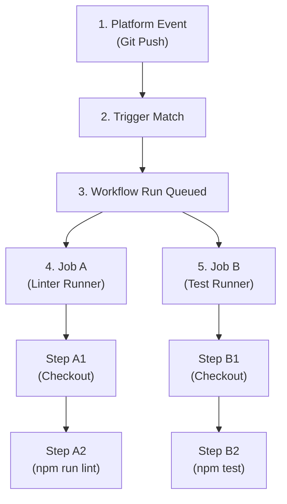

## Table of Contents

1. [The Webhook Revolution: Event-Driven Automation](#the-webhook-revolution-event-driven-automation)
2. [The Structural Anatomy: Workflows, Jobs, and Steps](#the-structural-anatomy-workflows-jobs-and-steps)
3. [Your First Workflow: The Hello World Baseline](#your-first-workflow-the-hello-world-baseline)
4. [Triggering Boundaries: Pull Request vs. Push Isolation](#triggering-boundaries-pull-request-vs-push-isolation)
5. [Filtering Events: Branch Gates and Activity Types](#filtering-events-branch-gates-and-activity-types)
6. [Manual and Scheduled Gates: Cron Constraints and Inputs](#manual-and-scheduled-gates-cron-constraints-and-inputs)
7. [Evaluating Contexts vs. Environment Variables](#evaluating-contexts-vs-environment-variables)
8. [Matrix Strategies: Multi-OS and Language Parallelism](#matrix-strategies-multi-os-and-language-parallelism)
9. [Concurrency Groups: Cancelling Stale Runs](#concurrency-groups-cancelling-stale-runs)
10. [Putting It All Together](#putting-it-all-together)
11. [What's Next](#whats-next)

## The Webhook Revolution: Event-Driven Automation

Before built-in platform orchestrators arrived, automated testing and software delivery was highly fragmented. Engineering teams operated separate version control servers and dedicated build servers. The build server managed automated validation using a polling model. Every few minutes, the build server opened a connection to the version control system, checked if any new commits had been added, and started a build if changes were detected. 

This polling model introduced significant latency, wasted compute resources, and remained completely detached from the developer's active workspace. While early Continuous Integration (CI) platforms eventually added custom webhook configurations to trigger builds on commit, setting up webhooks required managing complex network routes, firewall openings, and API secrets between separate services.

GitHub Actions resolved this fragmentation by integrating the automation engine directly into the version control platform. In this architecture, the repository itself acts as the event broker. Every user action inside the platform (such as pushing a branch, opening a Pull Request (PR), publishing a release, commenting on an issue, or clicking a button in the user interface) generates an internal event. 

Because the automation engine is co-located with the code, any eligible event can instantly trigger a workflow. Webhooks are handled natively, without custom endpoint configurations or secret sharing. When an event matches your declared trigger rules, the platform schedules a run, allocates a runner environment, and executes your automation. This event-driven model forms the operational core of modern development workflows, allowing pipelines to react dynamically to collaborative decisions.

## The Structural Anatomy: Workflows, Jobs, and Steps

An automation pipeline inside GitHub Actions is declared in a YAML configuration file. To be recognized by the orchestrator, these manifests must reside inside a specific directory at the root of the repository: `.github/workflows/`. If you place a YAML file outside this directory, the platform treats it as plain text and ignores its instructions.

Inside a workflow file, instructions follow a rigid three-tier hierarchy:

* **Workflows**: The top-level automation block. A workflow represents a high-level process (such as "Production Deployment" or "Pull Request Validation") tied to specific event triggers. You can define multiple independent workflows in a single repository.
* **Jobs**: The execution units. A job represents a set of sequential steps assigned to a single runner. By default, jobs run in parallel when compute capacity is available. However, because jobs execute on separate virtual or physical machines, they do not share filesystem states or local workspace directories.
* **Steps**: The individual commands. Steps run sequentially inside the runner allocated for the job. A step can execute raw shell scripts or invoke reusable software packages called Actions. Because steps share the same machine, they can access local files created by previous steps in the same job.



Most workflow configuration errors are structural hierarchy mistakes. A step command declared at the job level, or a job trigger defined at the step level, will cause the parser to reject the file. Memorizing the hierarchy ensures that you place settings in the correct scope.

## Your First Workflow: The Hello World Baseline

To understand how these structural pieces fit together, you should begin by writing the simplest possible workflow—a baseline manifest that triggers automatically and prints a message to the logs. 

Create a new file in your repository named `.github/workflows/hello-world.yml`. The name of the file does not matter to the orchestrator as long as it resides inside the correct directory and uses a `.yml` or `.yaml` extension. 

Add the following configuration to the file:

```yaml
name: Hello World Baseline

on: [push]

jobs:
  say-hello:
    runs-on: ubuntu-latest
    steps:
      - name: Print Welcome Message
        run: echo "Hello, GitHub Actions!"
```

Let us walk through this configuration line-by-line:

* **`name`**: The display name of the workflow. The platform renders this name in the "Actions" tab of your repository dashboard.
* **`on: [push]`**: The trigger event. This tells the platform to execute the workflow whenever a commit is pushed to any branch in the repository.
* **`jobs`**: The container block for all execution units in this workflow.
* **`say-hello`**: The unique identifier of the job. You can name this anything, such as `test` or `compile`.
* **`runs-on: ubuntu-latest`**: The operating system of the runner VM. This instructs the platform coordinator to provision a fresh, cloud-hosted Ubuntu Linux VM.
* **`steps`**: The sequential list of commands to run inside the VM.
* **`name: Print Welcome Message`**: The display name of this specific step.
* **`run: echo "Hello, GitHub Actions!"`**: The actual shell command. The runner VM executes this command inside its default Bash shell.

Once you commit and push this file to GitHub, navigate to your repository's web interface and click the **Actions** tab. You will find a new run associated with your commit. Click the run, select the `say-hello` job, and expand the "Print Welcome Message" step. You will see the printed text in the execution logs. 

This simple baseline demonstrates the absolute core loop of GitHub Actions: an event happens, the platform coordinator matches the rules, boots a sterile VM, and executes your steps cleanly.

## Triggering Boundaries: Pull Request vs. Push Isolation

To understand how triggering rules govern the promotion of software, let us evaluate the architectural boundary separating branch validations from mainline releases.

Imagine an engineering team working on an e-commerce API. The developers write a workflow file designed to run unit tests and automatically deploy code to a production AWS server. They want this pipeline to validate pull requests and automatically promote code once it lands on the `main` branch.

To achieve this, the developer configures the workflow triggers:

```yaml
name: Continuous Integration and Deployment

on:
  pull_request:
    branches:
      - main
  push:
    branches:
      - main

jobs:
  validate-and-deploy:
    runs-on: ubuntu-latest
    steps:
      - name: Checkout Code
        uses: actions/checkout@v4

      - name: Install Dependencies
        run: npm ci

      - name: Execute Tests
        run: npm test

      - name: Deploy to Production
        run: ./deploy.sh
```

A developer opens a pull request targeting the `main` branch to propose a new, unreviewed checkout feature. The platform triggers the workflow because of the `pull_request` event. The runner checks out the branch, installs the dependencies, executes the tests successfully, and immediately runs `./deploy.sh`. 

This represents a severe delivery gate failure. The developer only wanted to test their changes, but the workflow deployed the unreviewed feature branch code directly to production, bypassing review requirements and branch protections.

The root cause is a logical scoping error. The pipeline listened to both `pull_request` and `push` events, but it failed to isolate the deployment step. In this setup, every PR execution runs the deployment command because the step has no condition restricting its execution to merged code.

## Filtering Events: Branch Gates and Activity Types

To resolve this triggering failure, we must implement event filters and conditional execution.

We can restrict steps to run only under specific circumstances by checking the `github.event_name` context inside an `if` expression. The platform evaluates this condition before launching the step. If the expression returns false, the step is skipped.

```yaml
      - name: Execute Tests
        run: npm test

      - name: Deploy to Production
        if: github.event_name == 'push' && github.ref == 'refs/heads/main'
        run: ./deploy.sh
```

Now, when a developer opens a pull request, the `github.event_name` evaluates to `pull_request`. The validation step runs, but the deployment step evaluates to false and is skipped. 

Only when code is officially merged into the `main` branch (which triggers a `push` event on the target branch) does the condition evaluate to true, executing the deployment.

Furthermore, we must restrict event triggers at the top level by defining specific branches, file paths, or activity types. For example, if you only want to validate code when files inside the `src/` directory change, you can add a path filter:

```yaml
on:
  pull_request:
    branches:
      - main
    paths:
      - 'src/**'
```

This prevents resource waste by skipping automated test runs when a developer merely updates documentation files (such as `README.md`) at the root of the repository.

Additionally, many platform events support specific **Activity Types**. For example, the `pull_request` trigger fires by default when a PR is opened, synchronized, or reopened. If you want a workflow to run only when a pull request is marked ready for review (transitioning from a draft state), you can target specific activity types:

```yaml
on:
  pull_request:
    types:
      - opened
      - ready_for_review
```

By combining top-level triggers, branch paths, activity types, and step-level conditions, you establish precise control over when and where your automation executes.

## Manual and Scheduled Gates: Cron Constraints and Inputs

Not all automation is driven by direct code modifications. Many operations require time-based schedules or human intervention. GitHub Actions supports these patterns using two dedicated triggers:

* **`schedule`**: Triggers workflows at recurring intervals using standard cron syntax.
* **`workflow_dispatch`**: Exposes a manual "Run workflow" button in the web UI, allowing operators to trigger pipelines on demand with custom inputs.

Consider a workflow configured for scheduled vulnerability scans and manual rollback triggers:

```yaml
on:
  schedule:
    - cron: '0 0 * * *'

  workflow_dispatch:
    inputs:
      target_env:
        description: 'Target Deployment Stage'
        required: true
        default: 'staging'
        type: choice
        options:
          - staging
          - production
```

The `schedule` trigger uses five-field cron syntax to schedule runs. The cron expression `0 0 * * *` instructs the orchestrator to launch the workflow every night at midnight Coordinated Universal Time (UTC). 

However, scheduled workflows have two operational gotchas. First, they always execute against the latest commit on the repository's default branch. Second, because scheduled jobs share a global queue, the exact start time is not guaranteed; the orchestrator may delay execution by several minutes during high-traffic periods.

The `workflow_dispatch` trigger creates an interactive form in the Actions tab. When an operator clicks "Run workflow," the interface prompts them to select the target branch and complete the declared inputs. The pipeline can then access these values at runtime using the `inputs` context:

```yaml
      - name: Trigger Release Promotion
        run: ./promote.sh --env ${{ inputs.target_env }}
```

Manual triggers are critical for emergency operations (such as rollbacks or key rotations) that cannot wait for a scheduled clock or a code merge.

## Evaluating Contexts vs. Environment Variables

Throughout a workflow run, steps require access to metadata (such as the repository name, the triggering actor, or the active commit hash). The platform exposes this information using two distinct systems: **Contexts** and **Environment Variables**. 

Understanding the operational boundary between these systems is critical for avoiding parsing errors and secret leaks.

* **Contexts**: Evaluated by the orchestrator engine on the platform plane *before* the runner is provisioned or before individual steps are executed. Contexts use the `${{ }}` interpolation syntax.
* **Environment Variables**: Set inside the container or VM operating system shell *during* step execution. Environment variables use standard shell syntax (such as `$GITHUB_REF` in Bash).

Here is a quick reference matrix of standard metadata systems:

* **Commit Hash**:
  * Context: `${{ github.sha }}`
  * Environment Variable: `$GITHUB_SHA`
  * Evaluation Plane: Context: Platform Plane (Parse Time); Env: Runner Shell (Runtime)
* **Triggering Actor**:
  * Context: `${{ github.actor }}`
  * Environment Variable: `$GITHUB_ACTOR`
  * Evaluation Plane: Context: Platform Plane (Parse Time); Env: Runner Shell (Runtime)
* **Short Branch Name**:
  * Context: `${{ github.ref_name }}`
  * Environment Variable: `$GITHUB_REF_NAME`
  * Evaluation Plane: Context: Platform Plane (Parse Time); Env: Runner Shell (Runtime)
* **Event Payload JSON**:
  * Context: `${{ github.event_path }}`
  * Environment Variable: `$GITHUB_EVENT_PATH`
  * Evaluation Plane: Context: Platform Plane (Parse Time); Env: Runner Shell (Runtime)

The difference in evaluation planes dictates where you can use these systems. 

For example, because the orchestrator must evaluate step conditions before dispatching the job to a runner, you cannot use environment variables inside an `if:` block. The runner has not booted yet, so the shell variables do not exist. You must use contexts:

```yaml
    # CORRECT: Checked by the platform coordinator before assigning a runner
    if: github.ref_name == 'main'

    # WRONG: The coordinator cannot resolve this shell variable at parse time
    if: $GITHUB_REF_NAME == 'main'
```

Conversely, if you pass a repository secret to a custom script, you should map it to an environment variable rather than interpolating it directly in the shell command. Interpolating secrets directly (such as `run: ./test.sh ${{ secrets.API_KEY }}`) leaves the secret visible in the runner's raw execution log, bypassing redaction filters. 

Mapping it to an environment variable keeps the secret secure inside the shell process memory.

## Matrix Strategies: Multi-OS and Language Parallelism

When developing open-source libraries or cross-platform services, you must verify that your code runs successfully across multiple operating systems, dependency versions, and language runtimes. 

Copy-pasting the same job configuration three or four times to change a single version string introduces maintenance overhead and configuration drift.

We solve this using a **Matrix Strategy**. A matrix strategy instructs the orchestrator to automatically expand a single job definition into multiple parallel runs based on the combinations of variables you declare.

```yaml
jobs:
  test:
    runs-on: ${{ matrix.os }}
    strategy:
      matrix:
        os: [ubuntu-latest, macos-latest]
        node-version: [18, 20, 22]
    steps:
      - uses: actions/checkout@v4
      - name: Setup Node.js
        uses: actions/setup-node@v4
        with:
          node-version: ${{ matrix.node-version }}
      - run: npm ci
      - run: npm test
```

When parsing this configuration, the engine multiplies the matrix dimensions. In this example, it spawns six parallel jobs (2 operating systems multiplied by 3 Node.js versions) on separate runners.

By default, if any job in the matrix fails, the platform executes a **Fail-Fast** policy. It immediately cancels all other queued or currently executing matrix jobs to save billable minutes. 

If you want all combinations to complete regardless of individual failures (for example, when gathering a compatibility report), you can explicitly disable this behavior:

```yaml
    strategy:
      fail-fast: false
      matrix:
        os: [ubuntu-latest, macos-latest]
```

Matrix strategies optimize resource usage, allowing a single workflow to validate massive multi-platform configurations with minimal YAML maintenance.

## Concurrency Groups: Cancelling Stale Runs

When a team merges code rapidly, developers may push several commits to a branch in quick succession. 

By default, every push event triggers a new workflow run, causing the platform to launch parallel pipelines for the same branch.

If these pipelines execute deployment commands, parallel runs will stomp on each other's state. A slower, older run might finish after a faster, newer run, overwriting the production server with outdated code. 

Furthermore, running multiple test suites for intermediate commits on a single branch wastes billable compute minutes.

We solve this by defining **Concurrency Groups**. A concurrency group tells the platform to restrict execution to a single run within the group at any time.

```yaml
concurrency:
  group: ${{ github.workflow }}-${{ github.ref }}
  cancel-in-progress: true
```

The `group` string dynamically combines the workflow name and the branch reference (such as `Node.js-CI-refs/heads/feature-login`). 

When a developer pushes a commit, the workflow starts running. If the developer pushes a second commit two minutes later, the coordinator detects that a run with the exact same concurrency group is already active. 

Because `cancel-in-progress` is set to true, the platform automatically terminates the first active run and starts the new one. This guarantees that only the latest commit on any branch consumes runner resources, preventing deployment collisions and reducing queue bloat.

## Putting It All Together

GitHub Actions operates on a fully event-driven, webhook-first architecture co-located with your repository code. By understanding the structural hierarchy of workflows, jobs, and steps, utilizing precise branch filters and activity types, configuring manual or scheduled cron triggers, separating parse-time contexts from runtime variables, leveraging matrix strategies, and enforcing concurrency gates, platform engineers design high-performance, predictable, and secure automation loops.

When configuring and auditing your triggering systems and YAML workflows, ensure you enforce these five core practices:

First, maintain absolute structural separation. Keep workflows, jobs, and steps separated at their correct levels in the YAML hierarchy to prevent execution failures.

Second, isolate deployment steps. Never mix validation and promotion paths inside a single branch trigger without implementing strict step conditions or environment gates.

Third, leverage parse-time contexts correctly. Use `${{ github.* }}` contexts for pre-run conditions and step logic, reserving environment variables for in-process shell scripts.

Fourth, optimize cross-platform testing. Implement matrix strategies to validate multi-OS and language runtimes without duplicating workflow files.

Fifth, manage parallel queue resources. Define concurrency groups with cancel-in-progress enforcements to terminate stale builds and protect deployment sequences.

## What's Next

Configuring precise event triggers and workflow paths guarantees that our automation starts at the correct moment. However, once a job is scheduled, it must run on virtual or physical compute hardware. In the next chapter, **Runners and Execution**, we will explore the physical reality of hosted versus self-hosted executors, isolate steps using Docker container contexts, manage workspace filesystems, and evaluate system dependencies safely.

---

**References**

- [GitHub Docs: Events that trigger workflows](https://docs.github.com/en/actions/using-workflows/events-that-trigger-workflows) - Technical list of platform triggers, activity types, and branch path filters.
- [GitHub Docs: Contexts reference](https://docs.github.com/en/actions/learn-github-actions/contexts) - Documentation on parse-time contexts, payload properties, and security boundaries.
- [GitHub Docs: Workflow syntax for GitHub Actions](https://docs.github.com/en/actions/using-workflows/workflow-syntax-for-github-actions) - Detailed syntax reference governing matrix strategies, fail-fast options, and concurrency groups.
- [GitHub Docs: Variables](https://docs.github.com/en/actions/learn-github-actions/variables) - Explains how default and custom environment variables are exposed to runner shells at runtime.
