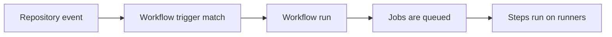

## Table of Contents

1. [What a Workflow Does](#what-a-workflow-does)
2. [The File GitHub Reads](#the-file-github-reads)
3. [Events Start Runs](#events-start-runs)
4. [Workflows, Jobs, and Steps](#workflows-jobs-and-steps)
5. [Push and Pull Request Triggers](#push-and-pull-request-triggers)
6. [Branch, Tag, and Path Filters](#branch-tag-and-path-filters)
7. [Manual and Scheduled Runs](#manual-and-scheduled-runs)
8. [Contexts, Variables, and Expressions](#contexts-variables-and-expressions)
9. [Matrix Jobs](#matrix-jobs)
10. [Concurrency](#concurrency)
11. [Putting It All Together](#putting-it-all-together)
12. [What's Next](#whats-next)

## What a Workflow Does
<!-- section-summary: A workflow connects a repository event to a set of automated jobs, so code changes can be checked or deployed without a person running every command. -->

GitHub Actions is GitHub's automation system for running build, test, release, and maintenance work from inside a repository. A **workflow** is one automated process, such as checking a pull request, publishing a package, or deploying a service after a release branch changes.

Think about a small team working on a service called `checkout-api`. Every pull request needs the same basic checks: install dependencies, run the linter, run unit tests, and maybe build a Docker image. Without automation, someone has to remember those commands every time, and different people will run slightly different versions of the same checklist.

A workflow makes that checklist part of the repository. When a developer pushes code or opens a pull request, GitHub reads the workflow file, creates a workflow run, and shows the result beside the commit. The green or red status becomes a shared signal for the whole team, not a private result on one laptop.

This article follows `checkout-api` from its first workflow to a more realistic setup. The pieces arrive in a practical order: where the workflow file lives, which events start it, how jobs and steps fit together, how filters reduce noise, how contexts pass event data, how matrix jobs test several versions, and how concurrency cancels stale runs.

## The File GitHub Reads
<!-- section-summary: GitHub only treats YAML files under `.github/workflows/` as workflow definitions, so file location is part of the automation contract. -->

A workflow is written in YAML and stored in the repository under `.github/workflows/`. The file can end with `.yml` or `.yaml`. GitHub ignores workflow-looking files outside that directory because the directory tells GitHub, "this file is automation, not ordinary project text."

Here is the smallest useful workflow for `checkout-api`. It is small on purpose because the first useful shape is easier to trust when every line has a clear job.

```yaml
name: Pull Request Checks

on: pull_request

jobs:
  test:
    runs-on: ubuntu-latest
    steps:
      - uses: actions/checkout@v6
      - uses: actions/setup-node@v4
        with:
          node-version: 22
      - run: npm ci
      - run: npm test
```

The `name` appears in the Actions tab and in status checks. The `on` key tells GitHub which events can start the workflow. The `jobs` key defines the work GitHub should run after the event matches.

YAML indentation matters because indentation expresses nesting. In this example, `steps` belongs to the `test` job, and each `run` line belongs to one step. A misplaced key can change the meaning of the file or make GitHub reject the workflow before any runner starts.

The file exists now, but a file alone does nothing. GitHub needs an event that matches the `on` block.

## Events Start Runs
<!-- section-summary: An event is the thing that happens in GitHub, and a matching event creates a workflow run from the workflow file. -->

An **event** is something that happens in GitHub, such as a push, a pull request update, a release publish, a manual button click, or a scheduled time. When an event happens, GitHub compares it with the `on` block in each workflow file. A match creates a **workflow run**, which is one execution of that workflow for that event.

For `checkout-api`, a pull request event carries useful information. It includes the source branch, the target branch, the commit SHA, the pull request number, the actor who triggered the run, and many other fields. GitHub exposes that information through contexts, which we will use later.

The event flow looks like this. The diagram is simple, but it shows the handoff from a GitHub event to work on a runner.



This matters because GitHub Actions is event-driven. The workflow usually starts because something changed in the repository or because a person intentionally requested a run. The event decides whether the workflow starts, and the workflow file decides what happens after that.

Now the event can start a run. The next thing to understand is the shape of the run itself.

## Workflows, Jobs, and Steps
<!-- section-summary: Workflows contain jobs, jobs contain steps, and each level controls a different part of the automation. -->

GitHub Actions uses three main layers: **workflows**, **jobs**, and **steps**. A workflow is the whole automated process. A job is a group of steps that run on one runner. A step is one command or one action invocation inside that job.

For `checkout-api`, the pull request workflow might have one job for tests and one job for building a container image. The jobs can run at the same time because they run on separate runners. The steps inside each job run in order because they share one working directory on that runner.

```yaml
name: Pull Request Checks

on: pull_request

jobs:
  test:
    runs-on: ubuntu-latest
    steps:
      - uses: actions/checkout@v6
      - uses: actions/setup-node@v4
        with:
          node-version: 22
      - run: npm ci
      - run: npm test

  build-image:
    runs-on: ubuntu-latest
    steps:
      - uses: actions/checkout@v6
      - run: docker build -t checkout-api:test .
```

The `test` job and the `build-image` job each receive a fresh runner. The `npm ci` step can use files created by `actions/checkout` because both steps run inside the `test` job. The `build-image` job receives its own checkout because it has its own runner and its own filesystem.

When one job needs another job to finish first, `needs` creates that dependency. This makes the relationship visible in YAML instead of hiding the order inside a long shell script.

```yaml
jobs:
  test:
    runs-on: ubuntu-latest
    steps:
      - uses: actions/checkout@v6
      - run: npm test

  package:
    needs: test
    runs-on: ubuntu-latest
    steps:
      - uses: actions/checkout@v6
      - run: npm pack
```

Here, `package` waits for `test`. This is the first time the workflow starts to look like a real delivery pipeline: validate first, then package or deploy.

## Push and Pull Request Triggers
<!-- section-summary: Push triggers follow branch updates, while pull request triggers follow review work before code reaches the target branch. -->

The two events beginners meet first are **`push`** and **`pull_request`**. A `push` event happens when commits are pushed to a branch or tag. A `pull_request` event happens when pull request activity occurs, such as opening the pull request, pushing new commits to it, reopening it, or marking it ready for review.

The difference matters in daily teamwork. A `push` workflow on `main` is good for work that should happen after code lands, such as publishing a preview artifact or deploying to staging. A `pull_request` workflow is good for review protection because it checks code before it merges into `main`.

```yaml
name: Pull Request Checks

on:
  pull_request:
    branches:
      - main

jobs:
  test:
    runs-on: ubuntu-latest
    steps:
      - uses: actions/checkout@v6
      - run: npm test
```

This workflow runs when a pull request targets `main`. A feature branch called `add-coupon-rules` can receive many pushes, and each update can refresh the same pull request checks. Reviewers see the result on the pull request before they merge.

The deployment side usually starts from a `push` to a trusted branch. This keeps deployment work tied to code that has already passed review and merged.

```yaml
name: Staging Deploy

on:
  push:
    branches:
      - main

jobs:
  deploy-staging:
    runs-on: ubuntu-latest
    steps:
      - uses: actions/checkout@v6
      - run: ./scripts/deploy-staging.sh
```

This workflow reacts after `main` changes. That separation gives the team a clean path: pull request checks protect the merge, then push workflows handle work that should happen after the merge.

The next problem is volume. A repository can receive many events, and a mature workflow should ignore events that do not matter.

## Branch, Tag, and Path Filters
<!-- section-summary: Filters narrow a trigger so the workflow runs only for the branches, tags, or files that matter to that automation. -->

**Filters** are trigger rules that reduce unnecessary workflow runs. Branch filters select branch names. Tag filters select tag names. Path filters select file patterns. They are useful because real repositories contain docs, scripts, application code, infrastructure code, and release metadata in the same place.

Imagine `checkout-api` stores application code under `src/`, Terraform under `infra/`, and documentation under `docs/`. A pull request that only changes `docs/deployment-notes.md` probably does not need the full Node test suite. A path filter keeps the workflow focused on changes that can affect the app.

```yaml
on:
  pull_request:
    branches:
      - main
    paths:
      - "src/**"
      - "package.json"
      - "package-lock.json"
      - ".github/workflows/pr-checks.yml"
```

The workflow now runs for pull requests into `main` when the app code, package files, or the workflow file itself changes. Including the workflow file is useful because a pull request that changes CI behavior should test CI behavior.

Tags are common for releases. A version tag gives the release workflow a specific Git ref to build and publish.

```yaml
on:
  push:
    tags:
      - "v*.*.*"
```

That trigger matches version tags like `v2.4.1`. A release workflow can build a production artifact only when a release tag appears, while ordinary branch pushes continue to use faster validation workflows.

Filters should follow the risk of the work. A documentation-only change can skip expensive integration tests, but a deployment workflow should be strict about the branch or tag that can start it.

## Manual and Scheduled Runs
<!-- section-summary: Manual and scheduled triggers cover work that depends on human timing or regular maintenance rather than a code change. -->

Some automation should start from a person rather than a code change. **`workflow_dispatch`** adds a manual run button in the GitHub UI and can accept inputs. For `checkout-api`, the team might use it to deploy a chosen version to a chosen environment after a release manager approves the timing.

```yaml
name: Manual Deploy

on:
  workflow_dispatch:
    inputs:
      environment:
        description: "Deployment target"
        required: true
        type: choice
        options:
          - staging
          - production
      version:
        description: "Release version"
        required: true
        type: string

jobs:
  deploy:
    runs-on: ubuntu-latest
    steps:
      - run: ./scripts/deploy.sh "${{ inputs.environment }}" "${{ inputs.version }}"
```

The `inputs` context exposes the values typed into the manual run form. That gives the workflow structured data instead of asking someone to edit YAML for every deployment.

Scheduled workflows use **cron** syntax through the `schedule` event. A nightly dependency audit, a weekly cleanup job, or a daily smoke test against staging can run even when nobody pushes code.

```yaml
name: Nightly Audit

on:
  schedule:
    - cron: "17 2 * * *"

jobs:
  audit:
    runs-on: ubuntu-latest
    steps:
      - uses: actions/checkout@v6
      - run: npm audit --audit-level=high
```

Schedules run in UTC. Picking a non-round minute, such as `17`, can reduce crowding around the top of the hour because many repositories schedule jobs at exactly `0`.

Manual and scheduled triggers add new data sources. That leads directly to contexts, variables, and expressions.

## Contexts, Variables, and Expressions
<!-- section-summary: Contexts are GitHub-side data objects, variables are values available to workflows or runner shells, and expressions decide how YAML turns that data into behavior. -->

A **context** is a GitHub-provided object that contains information about the workflow run. The `github` context contains event and repository data. The `inputs` context contains manual workflow inputs. The `matrix` context contains the current matrix combination. Context values use expression syntax with `${{ ... }}`.

An **environment variable** is a value available to a shell command while a step runs on the runner. On Linux, shell variables are read with `$NAME`. GitHub can create environment variables from the `env` key, and the runner then passes them to the shell.

```yaml
name: Context Example

on:
  workflow_dispatch:
    inputs:
      environment:
        description: "Deployment target"
        required: true
        type: string

env:
  SERVICE_NAME: checkout-api

jobs:
  show-data:
    runs-on: ubuntu-latest
    steps:
      - name: Print run data
        run: |
          echo "Service: $SERVICE_NAME"
          echo "Actor: $GITHUB_ACTOR"
          echo "Target: $TARGET_ENV"
        env:
          TARGET_ENV: ${{ inputs.environment }}
```

The `${{ inputs.environment }}` expression is evaluated by GitHub before the step command runs. The `$TARGET_ENV` shell variable is read later by the shell on the runner. This timing difference explains many confusing bugs: some values exist while GitHub is preparing the job, and other values exist only after the runner starts a shell.

Expressions also control conditions. A condition can skip a job or step before the runner spends time on work that does not apply.

```yaml
jobs:
  deploy:
    if: ${{ github.ref == 'refs/heads/main' }}
    runs-on: ubuntu-latest
    steps:
      - run: ./scripts/deploy-staging.sh
```

This job runs only when the ref is `refs/heads/main`. Conditions help keep one workflow file flexible, but they should stay readable. A workflow full of nested expressions can become harder to maintain than two clear workflow files.

Now the team knows how to read event data. The next scaling problem is testing the same code across several versions.

## Matrix Jobs
<!-- section-summary: A matrix turns one job definition into several job runs, which is useful for testing supported versions without duplicating YAML. -->

A **matrix strategy** creates multiple job runs from one job definition. Each run receives one combination of matrix values. This is useful when `checkout-api` needs to support more than one Node.js version, operating system, database version, or feature mode.

```yaml
name: Version Checks

on: pull_request

jobs:
  test:
    runs-on: ubuntu-latest
    strategy:
      matrix:
        node-version: [20, 22]
    steps:
      - uses: actions/checkout@v6
      - uses: actions/setup-node@v4
        with:
          node-version: ${{ matrix.node-version }}
      - run: npm ci
      - run: npm test
```

GitHub expands this into two job runs: one for Node.js 20 and one for Node.js 22. The YAML stays short, and the pull request result shows whether a change works on every supported runtime.

Matrices can combine dimensions. Each list adds another axis of test coverage, so the number of runs grows from the combinations.

```yaml
strategy:
  fail-fast: false
  matrix:
    os: [ubuntu-latest, windows-latest]
    node-version: [20, 22]

runs-on: ${{ matrix.os }}
```

This creates four runs: Ubuntu with Node.js 20, Ubuntu with Node.js 22, Windows with Node.js 20, and Windows with Node.js 22. `fail-fast: false` lets the remaining matrix runs finish even after one fails, which gives the team a fuller picture of what broke.

Matrix jobs increase confidence, but they also increase run count. When developers push several commits quickly, the repository can end up running old checks nobody cares about anymore. That is where concurrency becomes useful.

## Concurrency
<!-- section-summary: Concurrency groups prevent older runs for the same branch or deployment target from wasting runner time after newer work arrives. -->

**Concurrency** limits how many workflow runs or jobs in the same group can run at the same time. The common pull request use case is canceling stale checks. If a developer pushes five commits to the same branch in ten minutes, the team usually cares about the newest commit, not the four older attempts.

```yaml
name: Pull Request Checks

on: pull_request

concurrency:
  group: pr-${{ github.event.pull_request.number }}
  cancel-in-progress: true

jobs:
  test:
    runs-on: ubuntu-latest
    steps:
      - uses: actions/checkout@v6
      - run: npm test
```

The group name is based on the pull request number. When a new run starts for the same pull request, GitHub cancels the older in-progress run in that group. The newest commit receives the runner time.

Deployments need a different group shape. A production deployment should usually allow only one production deployment at a time, even if two release tags appear close together.

```yaml
jobs:
  deploy-production:
    runs-on: ubuntu-latest
    environment: production
    concurrency:
      group: deploy-production
      cancel-in-progress: false
    steps:
      - uses: actions/checkout@v6
      - run: ./scripts/deploy-production.sh
```

Here, `cancel-in-progress: false` makes later production deployments wait instead of canceling the current one. This is a safer shape for work that changes real infrastructure or user traffic because an in-progress deployment should finish cleanly.

The trigger decides whether a run starts. The matrix can multiply the work. Concurrency keeps that work from piling up in ways that waste time or create deployment races.

## Putting It All Together
<!-- section-summary: A practical workflow combines clear triggers, scoped filters, job structure, matrix testing, and concurrency into one readable automation path. -->

Here is a more complete pull request workflow for `checkout-api`. It checks only relevant files, cancels stale pull request runs, tests supported Node.js versions, and keeps each job readable.

```yaml
name: Pull Request Checks

on:
  pull_request:
    branches:
      - main
    paths:
      - "src/**"
      - "test/**"
      - "package.json"
      - "package-lock.json"
      - ".github/workflows/pr-checks.yml"

concurrency:
  group: pr-${{ github.event.pull_request.number }}
  cancel-in-progress: true

jobs:
  test:
    runs-on: ubuntu-latest
    strategy:
      fail-fast: false
      matrix:
        node-version: [20, 22]
    steps:
      - uses: actions/checkout@v6
      - uses: actions/setup-node@v4
        with:
          node-version: ${{ matrix.node-version }}
      - run: npm ci
      - run: npm test

  build-image:
    runs-on: ubuntu-latest
    steps:
      - uses: actions/checkout@v6
      - run: docker build -t checkout-api:${{ github.sha }} .
```

The workflow starts from one idea: a repository event should create useful feedback. The `pull_request` trigger starts the run when review work changes. Branch and path filters reduce noise. Jobs separate test work from image build work. Steps keep the command order clear inside each job. The matrix verifies supported Node versions. Concurrency keeps only the newest pull request checks running.

This is the foundation for GitHub Actions. Once this structure feels normal, most workflow changes become a question of where the change belongs: trigger, job, step, context, matrix, or concurrency.

## What's Next
<!-- section-summary: The next article follows the machines that execute these jobs, because workflow YAML still has to run on real compute. -->

You now have the structure of a workflow run: events start it, YAML describes it, jobs and steps shape it, and contexts pass useful data into it. The next question is where those commands actually run.

The next article follows **runners**. We will look at GitHub-hosted machines, self-hosted machines, checkout behavior, system dependencies, tool setup, containers, and the security choices that come from running real commands on real compute.

---

**References**

- [Workflow syntax for GitHub Actions](https://docs.github.com/en/actions/reference/workflows-and-actions/workflow-syntax) - Documents workflow files, triggers, jobs, steps, permissions, matrices, and concurrency syntax.
- [Events that trigger workflows](https://docs.github.com/en/actions/reference/workflows-and-actions/events-that-trigger-workflows) - Lists supported events and explains event-specific behavior.
- [Variables](https://docs.github.com/en/actions/how-tos/write-workflows/choose-what-workflows-do/use-variables) - Explains contexts, runner environment variables, and when each kind of value is available.
- [Running variations of jobs in a workflow](https://docs.github.com/en/actions/how-tos/write-workflows/choose-what-workflows-do/run-job-variations) - Explains matrix strategies for expanding one job definition into multiple runs.
- [Control the concurrency of workflows and jobs](https://docs.github.com/en/actions/how-tos/write-workflows/choose-when-workflows-run/control-workflow-concurrency) - Documents concurrency groups and `cancel-in-progress`.
