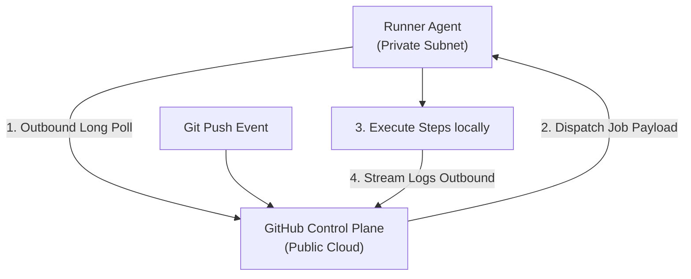

## Table of Contents

1. [The Cloud Agent: Demystifying the Serverless Illusion](#the-cloud-agent-demystifying-the-serverless-illusion)
2. [What Is a Runner? Outbound Long Polling Mechanics](#what-is-a-runner-outbound-long-polling-mechanics)
3. [Environmental Parity: System Dependencies and VM States](#environmental-parity-system-dependencies-and-vm-states)
4. [Hosted vs. Self-Hosted: Infrastructure Lifecycles](#hosted-vs-self-hosted-infrastructure-lifecycles)
5. [The Threat Vector: Remote Code Execution on Private Networks](#the-threat-vector-remote-code-execution-on-private-networks)
6. [Execution Environments: Host Shells vs. Container Actions](#execution-environments-host-shells-vs-container-actions)
7. [The Workspace Lifecycle: The Checkout Gate](#the-workspace-lifecycle-the-checkout-gate)
8. [Dynamic Provisioning: Inside Language Setup Toolcaches](#dynamic-provisioning-inside-language-setup-toolcaches)
9. [Putting It All Together](#putting-it-all-together)
10. [What's Next](#whats-next)

## The Cloud Agent: Demystifying the Serverless Illusion

When working with modern DevOps (Development and Operations) cloud services, it is easy to view pipeline execution as a serverless abstraction. You write a YAML configuration, push a commit, and watch a green checkmark appear. There is no physical hardware to manage, no operating system to patch, and no local hypervisor to configure.

However, software commands must execute on real hardware. Every compiler run, linter pass, unit test check, and docker build script requires CPU cycles, physical memory, network bandwidth, and local disk space. 

Understanding the execution layer is critical because most pipeline debugging is actually system troubleshooting. When a build fails due to a missing package, an out-of-memory exception, or a network timeout, you are diagnosing a real server operating system failure. Demystifying the execution environment allows you to configure builds that are deterministic, secure, and fast.

## What Is a Runner? Outbound Long Polling Mechanics

In the GitHub Actions ecosystem, the system that executes your steps is called a **Runner**. Structurally, a runner is a server (typically a Virtual Machine (VM) or a container) that operates a lightweight, open-source agent application: the GitHub Actions Runner application.

This agent application acts as a worker. It does not accept inbound connections from the internet, which eliminates complex firewall rules and inbound router configurations. 

Instead, the agent operates entirely via outbound **Long Polling**. The runner opens an outbound HTTPS connection to GitHub's orchestrator plane and holds it open, repeatedly checking if a job matches its labels.



When a matching job is queued, the coordinator dispatches the step instructions over the open polling connection. The runner downloads the instructions, executes the shell commands sequentially, streams the standard output and error logs back to the interface in real time, and returns the final exit code. 

Because the agent establishes the network path from the inside, the runner can sit safely within a highly restricted private network while still executing public repository jobs.

## Environmental Parity: System Dependencies and VM States

To understand how runners manage compilation states, let us evaluate the concept of Environmental Parity—the engineering goal of aligning local development platforms with automated runner VM environments.

A developer builds a Python application locally on their macOS laptop. The application relies on `psycopg2`, a popular PostgreSQL database adapter. Months ago, the developer installed the PostgreSQL system libraries locally using Homebrew (`brew install postgresql`), which placed the compiler utility `pg_config` on their local shell path. 

The developer writes the code, and their local test suite passes. They write a workflow file to validate their code on every push:

```yaml
jobs:
  test:
    runs-on: ubuntu-latest
    steps:
      - uses: actions/checkout@v4
      - uses: actions/setup-python@v5
        with:
          python-version: '3.11'
      - run: pip install -r requirements.txt
      - run: pytest
```

When the developer pushes the branch, the pipeline boots a clean runner, clones the code, configures the Python runtime, and immediately crashes during `pip install` with a compilation error:

```bash
Building wheel for psycopg2 (setup.py) ... error
Error: pg_config executable not found.
Please add the directory containing pg_config to the $PATH
```

The build failed because the developer assumed the runner environment was identical to their laptop. It was not. The default `ubuntu-latest` image provided by the platform does not include the PostgreSQL development headers by default. 

To fix this compilation failure, the developer must explicitly define the runner's operating system state by installing the system dependencies before running the Python setup:

```yaml
    steps:
      - uses: actions/checkout@v4
      
      - name: Install DB Headers
        run: sudo apt-get update && sudo apt-get install -y libpq-dev
        
      - uses: actions/setup-python@v5
        with:
          python-version: '3.11'
          
      - run: pip install -r requirements.txt
```

By adding `libpq-dev`, the runner's package manager downloads the PostgreSQL development libraries, placing `pg_config` on the path. Subsequent compilation steps can now compile the binary wheel, and the tests pass. 

This error highlights the primary rule of continuous integration: **you do not own the runner host, but you must define its state.**

## Hosted vs. Self-Hosted: Infrastructure Lifecycles

When configuring jobs, you must choose where the compute agent executes. This decision introduces a trade-off between absolute convenience and operational control.

**GitHub-Hosted Runners** are ephemeral virtual machines provisioned dynamically by the platform. 
* *Lifecycle*: Ephemeral. A fresh virtual machine is booted specifically for your job, and the entire VM is destroyed the moment the job finishes.
* *Prerequisites*: Pristine environment. Every run starts from an absolutely clean disk, guaranteeing no state leaks, residual directories, or background processes from previous builds.
* *Resource Scale*: Fixed. Standard virtual machines provide 2 vCPUs, 7GB of RAM, and 14GB of storage space.

**Self-Hosted Runners** are physical or virtual machines that you provision, operate, and maintain within your own cloud or on-premise infrastructure.
* *Lifecycle*: Persistent. The agent runs continuously on a server, mounting successive jobs onto the same persistent host filesystem.
* *Prerequisites*: Mutable state. If a step fails to clean up massive temporary files, the host's disk will eventually fill up, crashing subsequent builds.
* *Resource Scale*: Custom. You can deploy the agent on high-performance 96-core servers, systems with specialized GPUs, or systems located behind your corporate firewall.

Choosing between hosted and self-hosted fleets is a direct engineering decision:

* Use hosted runners by default to benefit from zero-maintenance overhead, fresh state guarantees, and automated operating system patching.
* Move to self-hosted runners only when you hit concrete physical limits, such as a requirement for heavy database access inside private networks, specialized high-compute compilation resources, or restricted corporate compliance boundaries.

## The Threat Vector: Remote Code Execution on Private Networks

Attaching a persistent self-hosted runner to a public repository introduces a high-severity security risk.

Imagine you register a self-hosted runner agent on a virtual machine located inside your company's private AWS Virtual Private Cloud (VPC). The VPC contains internal databases and confidential APIs. The runner is attached to a public open-source project repository.

An attacker forks the public repository, modifies the workflow YAML file or a test script, and inserts a malicious command:

```bash
curl http://169.254.169.254/latest/meta-data/local-ipv4
nmap -sP 10.0.0.0/24
```

The attacker opens a Pull Request targeting your base repository. Because the project is configured to run tests on PR events, the platform schedules the job. 

Your self-hosted runner polls GitHub, pulls down the attacker's commit payload, and executes the commands. The attacker has successfully achieved Remote Code Execution (RCE) inside your private corporate network.

The attacker can now extract the runner instance's AWS metadata credentials, scan your internal subnet for vulnerable databases, or pivot to attack other corporate systems. 

For this reason, **never connect a self-hosted runner to a public repository** unless you have implemented strict manual approval gates (such as `environment` gates) or enforce ephemeral, container-isolated environments (such as Kubernetes pods that are torn down after every single execution).

## Execution Environments: Host Shells vs. Container Actions

Even within a specific operating system runner, you must decide how steps are executed. The platform supports two execution paradigms:

### Paradigm 1: Host Shell Execution

By default, every `run:` step executes directly in the shell of the runner's host operating system (such as Bash on Linux or PowerShell on Windows).

```yaml
    steps:
      - run: node --version
```

This shell has full sudo access to the virtual machine. While host execution is simple and fast, it depends heavily on the tools pre-installed on the runner OS. If the host operating system updates its default Node.js version, your build may break unexpectedly.

### Paradigm 2: Containerized Execution

To guarantee absolute dependency isolation, you can instruct the job to execute all its steps inside a designated Docker container image.

```yaml
jobs:
  test:
    runs-on: ubuntu-latest
    container: node:20-alpine
    steps:
      - uses: actions/checkout@v4
      - run: node --version
```

When parsing this job, the runner uses the host machine's Docker daemon to pull the `node:20-alpine` image, boots the container, mounts the workspace directory into it, and routes all step commands to execute inside that container. 

Even though the underlying host is a standard Ubuntu VM, your Node.js code executes in a sterile, alpine container. This isolates your compilation and test tools completely from the host's configuration.

## The Workspace Lifecycle: The Checkout Gate

When a runner executes a job, it constructs a designated workspace directory. You can query the absolute path to this directory using the `${{ github.workspace }}` context (which defaults to a path like `/home/runner/work/repository-name/repository-name` on Linux).

A common mistake for beginners is attempting to run build steps before checkout:

```yaml
jobs:
  build:
    runs-on: ubuntu-latest
    steps:
      - run: npm run build
```

This job will fail instantly with a filesystem error:

```bash
npm ERR! enoent ENOENT: no such file or directory, open 'package.json'
```

The build failed because the runner boots as a sterile workspace. The orchestrator does not automatically clone your repository files onto the machine. 

To run tests or compile code, you must first execute the official checkout action:

```yaml
    steps:
      - uses: actions/checkout@v4
      - run: npm run build
```

The checkout action performs a `git clone` or `git fetch`, checks out the specific commit hash that triggered the workflow run, and places the files inside the workspace directory. 

Because subsequent `run:` steps default to executing inside this same directory, they can now locate and execute your project files.

## Dynamic Provisioning: Inside Language Setup Toolcaches

When you declare language setup actions (such as `actions/setup-node@v4` or `actions/setup-python@v5`), how do they configure the compiler in seconds?

```yaml
      - uses: actions/setup-node@v4
        with:
          node-version: '20.11.0'
```

If the action ran `apt-get install nodejs`, it would be slow and vulnerable to mirror outages. Instead, hosted runner VMs maintain a massive, local directory called the **Toolcache** (located at `/opt/hostedtoolcache/` on Linux).

This toolcache contains pre-compiled, compressed archives of every major language version, updated weekly. When the setup action executes, it checks the local toolcache for the requested version. 
* If the version is present, it extracts the pre-compiled binary instantly and manipulates the runner's `$PATH` environment variable.
* If the version is missing (such as a very obscure or bleeding-edge patch release), it calls GitHub's tool service, downloads the pre-compiled binary, saves it to the toolcache, and updates the path.

This mechanism ensures that your compiler setup completes in under two seconds, maintaining high build speed and absolute version consistency across all pipeline runs.

## Putting It All Together

Pipeline platforms execute workflows on real physical and virtual systems. By understanding the long-polling runner architecture, defining system states to avoid pg_config failures, matching infrastructure lifecycles to operational tradeoffs, securing self-hosted subnets against RCE attacks, leveraging container contexts, and utilizing checkout and toolcache systems, you construct resilient execution environments.

When configuring and auditing your runner hosts and execution workflows, ensure you enforce these five core practices:

First, define your operating system states explicitly. Install required dev headers and compiler tools before executing language dependency installers.

Second, protect your self-hosted subnets. Never hook self-hosted agents to public repositories without implementing strict ephemeral VM cleanups or review rules.

Third, isolate build environments. Use containerized execution to decouple step compilers from runner host OS upgrades.

Fourth, checkout code explicitly. Always place the checkout action as the first step of any job requiring access to your repository files.

Fifth, leverage local toolcaches. Use official language setup actions to provision compilers dynamically in seconds instead of running slow system installers.

## What's Next

Configuring secure, repeatable execution environments ensures our code is validated safely. However, as our organization grows to manage dozens of repositories, copy-pasting the same YAML configurations creates maintenance bottlenecks. In the next chapter, **Actions and Reusability**, we will explore how to write custom composite actions, handle inputs and outputs, and design reusable compliance workflows.


*Use this as the runner-execution checklist: know how runners poll, choose hosted or self-hosted capacity deliberately, isolate risky code, choose shell or container execution, understand checkout, and manage toolcaches.*

---

**References**

- [GitHub Docs: About GitHub-hosted runners](https://docs.github.com/en/actions/using-github-hosted-runners/about-github-hosted-runners) - Hardware specifications, pre-installed software images, and virtual machine allocations.
- [GitHub Docs: Hosting your own runners](https://docs.github.com/en/actions/hosting-your-own-runners) - Architectural instructions for provisioning, labeling, and maintaining self-hosted runner fleets.
- [GitHub Docs: Runner images](https://github.com/actions/runner-images) - The official open-source repository containing the software manifests for hosted VM environments.
- [GitHub Docs: Security hardening for GitHub Actions](https://docs.github.com/en/actions/security-hardening-your-workflows/security-hardening-for-github-actions) - Security guidance on self-hosted RCE threat mitigations and workspace isolation.
