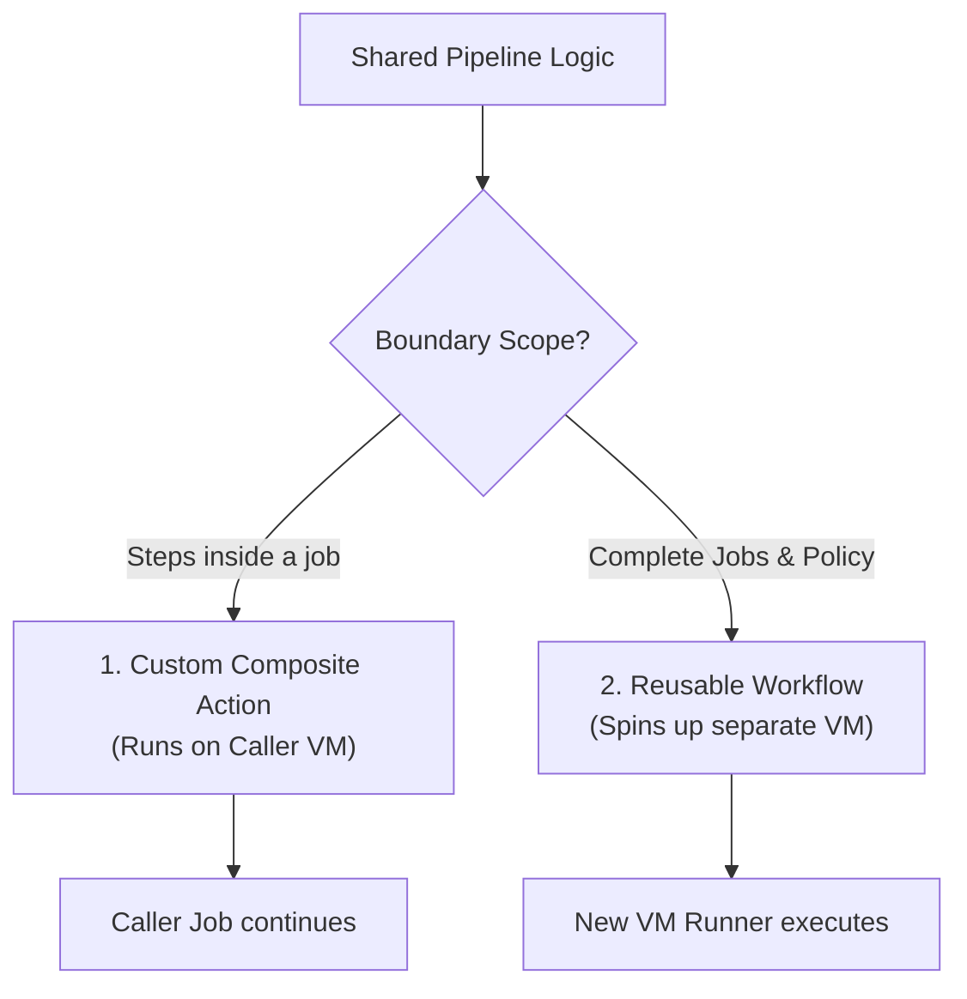

## Table of Contents

1. [The Microservice Duplication Trap](#the-microservice-duplication-trap)
2. [DRY Design Principles in Continuous Delivery](#dry-design-principles-in-continuous-delivery)
3. [The Boundary: Custom Actions vs. Reusable Workflows](#the-boundary-custom-actions-vs-reusable-workflows)
4. [Shared Actions: Refactoring the Duplicated Setup Block](#shared-actions-refactoring-the-duplicated-setup-block)
5. [Creating a Composite Action: The action.yml Structure](#creating-a-composite-action-the-action-yml-structure)
6. [Designing Interfaces: Inputs, Defaults, and Outputs](#designing-interfaces-inputs-defaults-and-outputs)
7. [The Path Resolution Trap: Resolving local Scripts](#the-path-resolution-trap-resolving-local-scripts)
8. [Reusable Workflows: Enforcing Compliance Policies](#reusable-workflows-enforcing-compliance-policies)
9. [Putting It All Together](#putting-it-all-together)
10. [What's Next](#whats-next)

## The Microservice Duplication Trap

When an engineering team builds a single monolithic application, managing the CI/CD pipeline is straightforward. The entire codebase resides in a single repository, and a single, 150-line YAML configuration handles linting, testing, and deployment.

However, modern engineering organizations often transition to a microservices architecture. Instead of one repository, you now have twenty, fifty, or a hundred separate code checkouts. Because the services are written in the same programming language (such as Node.js or Python), they require the exact same pipeline validation steps.

A common mistake is copying and pasting the monolithic YAML pipeline file into every repository. 

Months later, when the security team mandates a new compliance scanner in every pipeline, you must manually open fifty repositories, modify fifty YAML files, open fifty pull requests, and merge them all. If the linter version needs to be updated, the process repeats. 

This represents the microservice duplication trap. Duplicate configuration leads to **Configuration Drift**—a state where configurations slowly diverge over time because people forget to update all instances, introducing silent failures and security gaps.

## DRY Design Principles in Continuous Delivery

In software engineering, the DRY (Don't Repeat Yourself) principle states that every piece of knowledge must have a single, unambiguous representation within a system. This principle applies to pipeline design.

DRY pipeline design is the practice of extracting shared build, test, and deployment configurations into centralized, version-controlled modules. Multiple repositories then reference this central logic, rather than maintaining duplicate scripts locally.

By centralizing pipeline logic:
* You enforce organization-wide standards (such as required security scans or deployment steps) from a single repository.
* You eliminate configuration drift; a change in the central module propagates instantly to all consumer services.
* You simplify new repository bootstrapping; developers call the shared module using a single line of YAML instead of writing 150 lines of system commands.

## The Boundary: Custom Actions vs. Reusable Workflows

To implement a DRY pipeline, you must choose the correct reusability mechanism. The platform provides two distinct abstractions: **Custom Actions** and **Reusable Workflows**. 

We separate their purposes based on the scope of the execution boundary:

* **Custom Actions (Composite)**:
  * Scope: Bundles multiple sequentially executed `steps` inside a single job.
  * Runtime VM: Runs inside the caller's existing job runner.
  * Secret Scoping: Inherits the caller's secrets and environment variables automatically.
  * Use Case: Shared setup or cleanup logic (e.g. setting up languages, checking cache, installing dependencies).
* **Reusable Workflows (Workflow Call)**:
  * Scope: Bundles entire `jobs` (including their runners, strategies, and environments).
  * Runtime VM: Spins up its own separate runner Virtual Machines.
  * Secret Scoping: Scoped; secrets must be passed explicitly one by one or shared via org trust.
  * Use Case: Standardized compliance, security scans, or complete multi-stage promotions.



## Shared Actions: Refactoring the Duplicated Setup Block

To see these mechanisms in action, let us trace a common configuration duplication scenario. 

You have ten backend services. Every service starts its testing pipeline with the exact same sequence of three YAML steps:

```yaml
jobs:
  test:
    runs-on: ubuntu-latest
    steps:
      - uses: actions/checkout@v4
      
      # Duplicated Block Begins
      - name: Setup Node.js
        uses: actions/setup-node@v4
        with:
          node-version: '20'
          cache: 'npm'
          
      - name: Install dependencies
        run: npm ci
        
      - name: Compile source
        run: npm run build
      # Duplicated Block Ends
        
      - name: Execute Tests
        run: npm test
```

This sequence is copied across ten repositories. We want to refactor this pipeline by extracting the duplicated block (Setup, Install, Compile) into a custom **Composite Action**, allowing the developer's YAML to stay clean and DRY.

## Creating a Composite Action: The action.yml Structure

A custom action resides either locally in a directory (such as `.github/actions/setup-node-build/`) or in a centralized "DevOps" repository. To define the action, you must create a manifest file named `action.yml` or `action.yaml` inside that directory.

Unlike normal workflows, custom actions do not have `on` triggers or `jobs` blocks. Instead, they define their inputs, outputs, and execution steps.

Let us write the composite action manifest:

```yaml
# .github/actions/setup-node-build/action.yml
name: "Setup Node.js and Compile"
description: "Sets up Node.js runtime, restores npm dependency cache, installs libraries, and builds source code."

runs:
  using: "composite"
  steps:
    - name: Setup Node.js
      uses: actions/setup-node@v4
      with:
        node-version: '20'
        cache: 'npm'
        
    - name: Install dependencies
      shell: bash
      run: npm ci
      
    - name: Compile source
      shell: bash
      run: npm run build
```

Notice two critical structural enforcements inside this custom action:

First, the `using: "composite"` directive tells the orchestrator that this action combines multiple standard workflow steps, rather than compiling a custom Docker container or running a JavaScript bundle.

Second, every `run:` step must declare an explicit `shell: bash` instruction. 

In a normal workflow, the runner provides a default shell based on the host OS. However, because a composite action can be called by an Ubuntu runner, a macOS runner, or a Windows runner, the engine cannot guess which shell your scripts require. You must define it.

Now, we can update the backend service workflow to call our custom action locally using a single `uses` line:

```yaml
jobs:
  test:
    runs-on: ubuntu-latest
    steps:
      - uses: actions/checkout@v4
      - name: Standard Environment Setup
        uses: ./.github/actions/setup-node-build
      - name: Execute Tests
        run: npm test
```

When parsing this workflow, the engine reads the local action directory, downloads the `action.yml` manifest, and injects the three setup steps directly into the active job execution list.

## Designing Interfaces: Inputs, Defaults, and Outputs

Our composite action is currently hardcoded to use Node.js version 20. If a newer service requires Node.js 22, and a legacy service is stuck on Node.js 18, this hardcoded value blocks adoption. 

To achieve true reusability, custom actions must define clear interfaces using **Inputs** and **Outputs**.

We update our `action.yml` to support inputs with safe defaults:

```yaml
# action.yml
inputs:
  node-version:
    description: "The targeted Node.js runtime version"
    required: false
    default: '20'

runs:
  using: "composite"
  steps:
    - name: Setup Node.js
      uses: actions/setup-node@v4
      with:
        node-version: ${{ inputs.node-version }}
        cache: 'npm'
```

Now, the legacy service can override the Node.js version without rewriting any steps:

```yaml
      - name: Standard Environment Setup
        uses: ./.github/actions/setup-node-build
        with:
          node-version: '18'
```

Similarly, an action can return **Outputs**. If your compilation step generates a build directory path or an artifact signature, you can export these values so that the calling workflow can access them inside subsequent steps.

## The Path Resolution Trap: Resolving local Scripts

When you move complex shell commands from a workflow file into a composite action, you often want to extract long inline scripts into dedicated files (such as `scripts/build.sh`) inside your action's directory to keep the YAML clean.

However, this introduces a classic DevOps path resolution trap.

Consider this step inside your custom action:

```yaml
    # WRONG: The script will not be found
    - name: Compile source
      shell: bash
      run: ./scripts/build.sh
```

When a consumer repository (such as `my-org/auth-service`) calls this action, the runner clones the **caller's** repository into the workspace. When executing step commands, the runner's working directory is `/home/runner/work/auth-service/auth-service`. 

Because your custom script `build.sh` resides in the **action's** repository, the runner attempts to execute a local path that does not exist in the caller's codebase, crashing the build.

To resolve this path drift, you must use the special `${{ github.action_path }}` context variable. This variable resolves to the absolute local directory where the orchestrator downloaded the action's files on the host VM:

```yaml
    # CORRECT: Resolves the script path inside the downloaded action folder
    - name: Compile source
      shell: bash
      run: ${{ github.action_path }}/scripts/build.sh
```

By prefixing scripts with `github.action_path`, you guarantee that local assets, configurations, or helper binaries compiled inside your action's repository can be located and executed by any calling runner.

## Reusable Workflows: Enforcing Compliance Policies

While composite actions are perfect for sharing steps within a job, sometimes your security or operations team needs to enforce compliance rules globally. You cannot trust individual teams to piece together composite actions correctly.

Instead, you use a **Reusable Workflow** (triggered by the `workflow_call:` event). A reusable workflow is a complete, standalone YAML pipeline file that defines entire jobs and environments.

Consider a centralized security compliance scanner located in a central `devops-core` repository:

```yaml
# my-org/devops-core/.github/workflows/compliance-scan.yml
name: Corporate Compliance Scan

on:
  workflow_call:
    inputs:
      exit-on-fail:
        required: false
        type: boolean
        default: true

jobs:
  scan-dependencies:
    runs-on: ubuntu-latest
    steps:
      - uses: actions/checkout@v4
      - name: Scan vulnerabilities
        run: ./run-security-audit.sh --exit-on-high ${{ inputs.exit-on-fail }}
```

Other microservice repositories can invoke this entire compliance check as a complete job inside their pipelines:

```yaml
# my-org/orders-api/.github/workflows/ci.yml
jobs:
  build:
    runs-on: ubuntu-latest
    steps:
      - run: npm run build

  security-check:
    needs: build
    # Reference the central reusable workflow using tag v1
    uses: my-org/devops-core/.github/workflows/compliance-scan.yml@v1
    with:
      exit-on-fail: true
```

When this runs, the engine halts the `security-check` job, delegates the execution to the `devops-core` compliance workflow, boots a separate, isolated virtual machine, and executes the security steps. 

Because the central compliance workflow is versioned (using `@v1` or a specific commit SHA), you can update the scanner logic for all fifty repositories at once, securing your organization's entire delivery pipeline instantly.

## Putting It All Together

Centralizing your CI/CD configuration prevents microservice configuration drift and enforces strict compliance perimeters. By understanding when to choose custom actions over reusable workflows, refactoring duplicate steps into composite actions with explicit shells, defining input-output interfaces, resolving script paths using the github.action_path context, and utilizing reusable workflows for centralized gates, you build an efficient, DRY, and scalable deployment platform.

When configuring and auditing your DRY reusable pipelines, ensure you enforce these five core practices:

First, mandate DRY configurations. Never allow identical linter, setup, or compiler blocks to bleed across more than three microservices; refactor them immediately.

Second, declare explicit shells in composite actions. Always append `shell: bash` or `shell: pwsh` to every custom action step command to ensure platform compatibility.

Third, isolate composite script paths. Avoid local script execution errors by prefixing custom action scripts with the `${{ github.action_path }}` context.

Fourth, enforce organizational compliance. Implement reusable workflows at the job level to standardise security checks, vulnerability audits, and environment promotion gates.

Fifth, version your DRY references. Always pin custom action and reusable workflow references to immutable tags, version branches, or cryptographic commit hashes.

## What's Next

Configuring DRY, reusable automation structures ensures our pipelines are clean and maintainable at scale. However, once our validated packages are compiled, we must deploy them to staging and production clouds securely. In the next chapter, **Environments and Security**, we will explore how to protect production deployments using environments, secret scoping, required reviewer approvals, and keyless OpenID Connect (OIDC) authentication.

---

**References**

- [GitHub Docs: Creating a composite action](https://docs.github.com/en/actions/creating-actions/creating-a-composite-action) - Explains how to bundle multiple steps, configure input-output variables, and declare shells.
- [GitHub Docs: Reusing workflows](https://docs.github.com/en/actions/using-workflows/reusing-workflows) - Technical specifications for standardizing workflows using `workflow_call` triggers, input options, and secrets handling.
- [GitHub Docs: Contexts reference](https://docs.github.com/en/actions/learn-github-actions/contexts) - Documentation governing `github.action_path`, `inputs.*`, and other runtime metadata scopes.
- [GitHub Docs: Metadata syntax for GitHub Actions](https://docs.github.com/en/actions/creating-actions/metadata-syntax-for-github-actions) - Syntax reference for `action.yml` manifest files.
