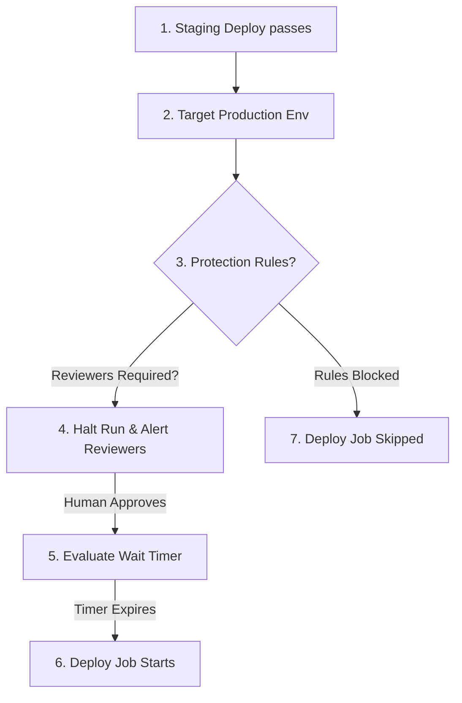
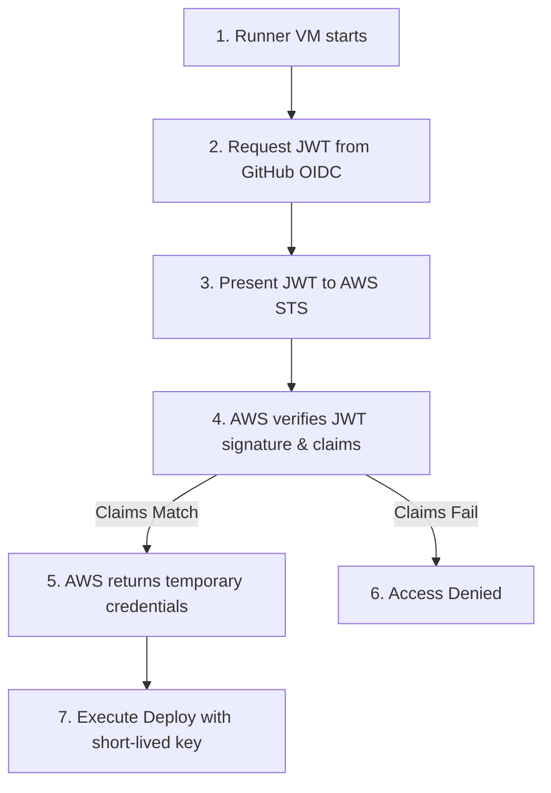

## Table of Contents

1. [The Secret Exposure Vector: Long-Lived Credentials](#the-secret-exposure-vector-long-lived-credentials)
2. [Encrypted Secrets: Repository, Environment, and Organization Scopes](#encrypted-secrets-repository-environment-and-organization-scopes)
3. [Isolating Stages: The GitHub Environment Abstraction](#isolating-stages-the-github-environment-abstraction)
4. [Environment Protection Rules: Approval Gates and Timers](#environment-protection-rules-approval-gates-and-timers)
5. [The Modern Standard: Eliminating Keys with OpenID Connect](#the-modern-standard-eliminating-keys-with-openid-connect)
6. [OIDC Mechanics: The JSON Web Token Handshake](#oidc-mechanics-the-json-web-token-handshake)
7. [AWS Identity and Access Management Trust Policy Design](#aws-identity-and-access-management-trust-policy-design)
8. [The Permissions Gate: Scoping the id-token Block](#the-permissions-gate-scoping-the-id-token-block)
9. [Putting It All Together](#putting-it-all-together)

## The Secret Exposure Vector: Long-Lived Credentials

To deploy an application to a cloud server, push a container image to a registry, or update a database schema, your CI/CD pipeline must prove its identity. The external system requires authentication credentials (such as an AWS access key, a database password, or an API token).

In the early days of pipeline automation, engineering teams solved this problem in the most obvious way possible: they generated a highly privileged, static access credential in their cloud provider account and pasted it directly into their pipeline settings as a plain environment variable.

This approach introduces an extremely high security risk. These static credentials are **long-lived**—they remain valid 24/7 until someone manually rotates or deletes them. 

If a developer accidentally commits a credential to a repository, runs a debug step that dumps all environment variables to the public logs, or leaves the company without rotating the key, your entire cloud infrastructure is exposed. Scraper bots can steal the key within seconds and spin up hundreds of high-compute servers to mine cryptocurrency, incurring massive corporate bills before morning.

Continuous delivery requires securing this perimeter. We must configure pipelines that scope access credentials, implement strict human approval gates, and eliminate static, long-lived API keys completely.

## Encrypted Secrets: Repository, Environment, and Organization Scopes

The first line of defense is GitHub's encrypted **Secrets** store. You can create a secret in your repository settings (Settings > Secrets and variables > Actions). The platform encrypts the value using a Libsodium sealed box before saving it. Once saved, the plaintext value is never visible again, not even to administrators.

Inside a workflow, you reference secrets using the `${{ secrets.SECRET_NAME }}` context. The orchestrator automatically redacts secrets from the console output. If your script runs `echo $SECRET_VALUE`, the runner replaces the output with `***`. 

However, this redaction has limits. If the secret is base64-encoded, embedded in a complex JSON block, or split across lines, redaction will fail. You must never run printenv or debug commands that dump active shell environments.

Secrets are scoped at three logical levels:

* **Repository Secrets**: Accessible by all workflows and branches in a single repository. This scope is simple, but it is over-permissioned: a linter or testing job on a feature branch has access to the exact same deployment keys as the production rollout.
* **Environment Secrets**: Scoped strictly to a named deployment target. These secrets are only injected when a job explicitly targets the environment.
* **Organization Secrets**: Configured at the enterprise level and shared across selected repositories. This prevents duplicate credential management across microservices.

## Isolating Stages: The GitHub Environment Abstraction

A **GitHub Environment** (Settings > Environments) represents a logical deployment target (such as `staging` or `production`). 

By defining environments, you can isolate credentials. For example, your staging environment can connect to a mock staging database, while your production environment holds the credentials for real customer data.

```yaml
jobs:
  test:
    runs-on: ubuntu-latest
    steps:
      - run: npm test

  deploy-staging:
    needs: test
    runs-on: ubuntu-latest
    # Scopes this job to staging secrets
    environment: staging
    steps:
      - run: ./deploy.sh
        env:
          AWS_KEY: ${{ secrets.AWS_ACCESS_KEY_ID }}

  deploy-prod:
    needs: deploy-staging
    runs-on: ubuntu-latest
    # Scopes this job to production secrets
    environment: production
    steps:
      - run: ./deploy.sh
        env:
          AWS_KEY: ${{ secrets.AWS_ACCESS_KEY_ID }}
```

In this pipeline, the `test` job has no environment declaration. It cannot access staging or production credentials, even if it attempts to interpolate them. 

The `deploy-staging` job can only read secrets configured inside the staging environment, while `deploy-prod` accesses production keys. This prevents staging environments from accidentally connecting to production systems.

## Environment Protection Rules: Approval Gates and Timers

Environments become truly powerful when you configure **Protection Rules**. These are policies enforced by the platform coordinator before a job targeting the environment is allowed to run.



The available protection rules are:

* **Required Reviewers**: You can require up to 6 designated individuals or teams to manually approve the deployment. The job enters a "Pending" state, and the platform alerts the reviewers. 
  
  Reviewers must verify the release notes and click "Approve" before the job starts. You can also block self-reviews, guaranteeing that the developer who wrote the code cannot approve their own production deployment.
* **Wait Timers**: You can set a delay (up to 30 days) that must pass before the job is allowed to execute. This is useful for giving the operations team time to monitor staging before automated production promotion begins.
* **Deployment Branches**: You can restrict which branches are allowed to deploy to the environment. For example, you can configure production to only accept deployments originating from the `main` branch or a branch matching `release/*`. 

If a developer attempts to deploy a feature branch (such as `feature/test-database`) to production, the orchestrator blocks the job before it can request a runner VM.

## The Modern Standard: Eliminating Keys with OpenID Connect

While environment scoping and required reviewers protect your delivery pipeline, they do not resolve the root vulnerability: the AWS credentials stored in GitHub Secrets are still static, long-lived keys. If an attacker compromises your GitHub organization, they can steal those keys and gain permanent cloud access.

The modern DevOps standard is to eliminate static secrets completely. We achieve this using **OpenID Connect (OIDC)**—a secure authentication protocol that allows GitHub Actions to authenticate directly with cloud providers (such as AWS, GCP, or Azure) using dynamic, short-lived keys.

OIDC is "keyless." You store absolutely no AWS credentials in GitHub Secrets. 

Instead, at the moment of execution, the runner requests a temporary, cryptographic token, presents it to the cloud provider, and receives temporary credentials that expire automatically after one hour (or less).

## OIDC Mechanics: The JSON Web Token Handshake

The OIDC handshake operates through a five-step sequence:

First, **Job Initialization**. The runner VM starts a job that has OIDC permissions enabled.

Second, **JWT Generation**. The runner requests a JSON Web Token (JWT) from GitHub's OIDC trust provider (`token.actions.githubusercontent.com`). The orchestrator generates a signed JWT containing claims about the job: which repository is running, which commit hash triggered the run, which branch is active, and which environment is targeted.

Third, **Token Presentation**. The runner presents this JWT to the cloud provider's Security Token Service (STS) and requests permission to assume a designated Identity and Access Management (IAM) role.

Fourth, **Signature Verification**. The cloud provider fetches GitHub's public keys, verifies the JWT's signature to prove it was generated by a real GitHub Actions runner, and checks the token's claims against its configured IAM role trust policy.

Fifth, **Temporary Credential Injection**. If the claims match, the cloud provider issues temporary credentials (valid for a short window, such as 15 minutes) and returns them to the runner. The runner uses these temporary credentials to execute cloud deployments and discards them immediately afterward.



Because this handshake is fully automated, no static keys are ever written to disk or saved in secrets. The credentials expire automatically, reducing the attack window to nearly zero.

## AWS Identity and Access Management Trust Policy Design

To set up OIDC, you register GitHub Actions as an OIDC Identity Provider in your AWS console (`https://token.actions.githubusercontent.com` with audience `sts.amazonaws.com`). 

Then, you create an IAM role with a trust policy that restricts access using repository-scoped subject (`sub`) claims.

```json
{
  "Version": "2012-10-17",
  "Statement": [
    {
      "Effect": "Allow",
      "Principal": {
        "Federated": "arn:aws:iam::123456789012:oidc-provider/token.actions.githubusercontent.com"
      },
      "Action": "sts:AssumeRoleWithWebIdentity",
      "Condition": {
        "StringEquals": {
          "token.actions.githubusercontent.com:aud": "sts.amazonaws.com"
        },
        "StringLike": {
          "token.actions.githubusercontent.com:sub": "repo:my-org/my-repo:environment:production"
        }
      }
    }
  ]
}
```

The `StringLike` check on the `sub` claim is the primary security boundary. This condition guarantees that only a workflow originating from the repository `my-org/my-repo` targeting the `production` environment can assume the IAM role. 

If a developer pushes a PR from a personal fork or triggers a job on a feature branch without targeting the production environment, the AWS Security Token Service detects the claim mismatch and denies the request.

## The Permissions Gate: Scoping the id-token Block

On the workflow plane, you must explicitly configure permissions to allow the runner to request the OIDC token. By default, the `GITHUB_TOKEN` secret has minimal read-only permissions. 

To enable OIDC, you must include an `id-token: write` permission:

```yaml
name: Deploy Application

on:
  push:
    branches:
      - main

permissions:
  contents: read
  id-token: write

jobs:
  deploy:
    runs-on: ubuntu-latest
    environment: production
    steps:
      - name: Checkout Code
        uses: actions/checkout@v4

      - name: Configure AWS Credentials
        uses: aws-actions/configure-aws-credentials@v4
        with:
          role-to-assume: arn:aws:iam::123456789012:role/github-deploy-role
          aws-region: us-east-1

      - name: Deploy static assets
        run: aws s3 sync ./dist s3://my-production-bucket
```

If you omit `id-token: write` from the permissions block, the orchestrator will refuse to generate the JWT, and the `configure-aws-credentials` action will fail with an error:

```bash
Error: Could not get ID Token from GitHub Actions.
Please make sure the 'id-token' permission is set to 'write'.
```

Enforcing least privilege by scoping the `permissions` block ensures that only jobs requiring OIDC access (such as deployment jobs) are granted token-writing capabilities, while testing and linting jobs remain securely isolated.

## Putting It All Together

Securing your delivery pipeline requires eliminating static credentials and scoping environments strictly. By moving away from static secrets, leveraging repository, environment, and organization-scoped vaults, configuring environment protection rules with required reviewers and wait timers, implementing keyless OIDC authentication handshakes, and designing AWS IAM role trust policies with strict subject claims, you establish a secure, enterprise-grade deployment platform.

When configuring and auditing your pipeline security, ensure you enforce these five core practices:

First, secure your secrets vault. Never use repository-level secrets for sensitive deployment stages; isolate credentials using named GitHub Environments.

Second, implement human approval gates. Configure required reviewer rules and branch protections to prevent unreviewed feature branch code from reaching production servers.

Third, eliminate static cloud keys. Move away from long-lived AWS or GCP access keys, adopting keyless OpenID Connect (OIDC) authentication workflows.

Fourth, restrict cloud trust relationships. Design AWS IAM trust policies that validate specific repository, branch, and environment claims, blocking access to unauthorized callers.

Fifth, scope GITHUB_TOKEN permissions. Enforce the principle of least privilege by explicitly defining your workflow `permissions` blocks, enabling `id-token: write` only where OIDC token exchange is required.


*Use this as the Actions security checklist: scope secrets narrowly, protect environments, require reviewers and wait timers where needed, prefer OIDC over static keys, and grant only the permissions a job needs.*

---

**References**

- [GitHub Docs: Configuring OpenID Connect in Amazon Web Services](https://docs.github.com/en/actions/security-for-github-actions/security-hardening-your-deployments/configuring-openid-connect-in-amazon-web-services) - The official guide to setting up OIDC provider metadata, role trusts, and workflow credential actions.
- [GitHub Docs: Managing environments for deployment](https://docs.github.com/en/actions/managing-workflow-runs-and-deployments/managing-deployments/managing-environments-for-deployment) - Explains how to create environments, define required reviewers, and configure branch protection deployment gates.
- [GitHub Docs: Automatic token authentication](https://docs.github.com/en/actions/security-guides/automatic-token-authentication) - Details the lifecycle and security scopes of the built-in GITHUB_TOKEN secret.
- [AWS Docs: Creating OpenID Connect (OIDC) identity providers](https://docs.aws.amazon.com/IAM/latest/UserGuide/id_roles_providers_create_oidc.html) - AWS documentation on establishing trust providers and exchanging federated identities.
