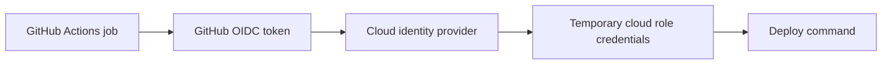

## Table of Contents

1. [Why Deployment Credentials Need Special Care](#why-deployment-credentials-need-special-care)
2. [Secrets and Their Scopes](#secrets-and-their-scopes)
3. [Environments](#environments)
4. [Protection Rules](#protection-rules)
5. [GITHUB_TOKEN Permissions](#github_token-permissions)
6. [OpenID Connect](#openid-connect)
7. [AWS Trust Policy Design](#aws-trust-policy-design)
8. [The id-token Permission](#the-id-token-permission)
9. [A Safer Deployment Shape](#a-safer-deployment-shape)
10. [Putting It All Together](#putting-it-all-together)

## Why Deployment Credentials Need Special Care
<!-- section-summary: Deployment jobs can change real systems, so the credentials and approvals around them need tighter controls than ordinary test jobs. -->

The earlier articles built up the mechanics of GitHub Actions: events start workflows, runners execute jobs, and shared actions or reusable workflows reduce repeated YAML. Security sits on top of all of that because a pipeline can do real work outside GitHub.

The `checkout-api` test job only needs the repository and a Node.js runtime. A deployment job might push a container image, update Kubernetes, run a database migration, invalidate a CDN cache, or change cloud infrastructure. That job needs credentials, and those credentials can affect customers.

A **credential** is proof that the workflow is allowed to call another system. It might be a cloud access key, a package registry token, a database password, or a GitHub token. Once a workflow has a credential, any command in that job can try to use it.

Security in GitHub Actions therefore has a practical goal: give each job the smallest useful access for the shortest useful time, and place human approval where a mistake would be expensive. We will connect repository secrets, environment secrets, protection rules, `GITHUB_TOKEN` permissions, and OpenID Connect into one deployment shape.

## Secrets and Their Scopes
<!-- section-summary: Secrets store sensitive values for workflows, and their scope controls which repositories or environments can read them. -->

A **secret** is an encrypted value stored in GitHub for use by workflows. Common examples include registry tokens, API keys, database passwords, and webhook signing keys. A workflow reads a secret through the `secrets` context, then passes it to a step as an environment variable or action input.

```yaml
jobs:
  publish:
    runs-on: ubuntu-latest
    steps:
      - run: npm publish
        env:
          NODE_AUTH_TOKEN: ${{ secrets.NPM_TOKEN }}
```

GitHub masks secret values in logs when it recognizes them, but masking should be treated as a backstop. A script that prints environment variables, encodes a secret, splits it across multiple lines, or sends it to another service can still create exposure. The safer workflow design keeps secrets out of jobs that do not need them.

Secrets can live at different scopes. The scope controls which workflows can even ask for the value.

| Scope | What it means | Common use |
|---|---|---|
| Repository secret | Available to workflows in one repository | A token used only by `checkout-api` |
| Environment secret | Available only to jobs targeting a named environment | Production deployment credentials |
| Organization secret | Shared with selected repositories in an organization | A scanner token used by many services |

For `checkout-api`, a repository secret might be enough for a staging-only demo token. A production database password or deploy token belongs behind an environment because the environment can add approval and branch rules before the secret becomes available.

Secrets are one part of the answer. The deployment target itself needs a name and rules, and that is what environments provide.

## Environments
<!-- section-summary: An environment represents a deployment target such as staging or production and can hold its own secrets, variables, and protection rules. -->

A **GitHub environment** is a named deployment target, such as `staging`, `production`, or `customer-demo`. A job targets an environment with the `environment` key. Environment-level secrets and variables become available only to jobs that target that environment.

```yaml
jobs:
  deploy-staging:
    runs-on: ubuntu-latest
    environment: staging
    steps:
      - run: ./scripts/deploy.sh
        env:
          DEPLOY_TOKEN: ${{ secrets.DEPLOY_TOKEN }}

  deploy-production:
    runs-on: ubuntu-latest
    environment: production
    steps:
      - run: ./scripts/deploy.sh
        env:
          DEPLOY_TOKEN: ${{ secrets.DEPLOY_TOKEN }}
```

The same secret name can exist in both environments with different values. The staging job receives the staging value. The production job receives the production value. The workflow code stays the same while the environment decides which sensitive value appears.

This is powerful because test and lint jobs can run with no deployment environment at all. They can read the repository, install dependencies, and run checks without touching staging or production credentials. The deployment jobs then opt into the environment that matches their target.

Environments also create a place for deployment controls. Credentials answer "what can this job use?" Protection rules answer "when is this job allowed to start?" Together, they separate access from approval.

## Protection Rules
<!-- section-summary: Protection rules add human approval, wait timers, branch restrictions, and custom checks before a deployment job receives environment access. -->

**Protection rules** are checks that must pass before a job can proceed into an environment. For production deployments, the most common rule is a required reviewer. GitHub pauses the job, shows the pending deployment, and waits for an approved reviewer before the job can continue.

This is useful because workflow automation moves fast. A merge to `main` might be safe for staging, while production needs a release manager or service owner to confirm timing. The environment gives that approval a natural home.

Protection rules can include required reviewers, wait timers, deployment branch rules, and custom protection rules depending on repository plan and configuration. A wait timer can create a deliberate delay before deployment. A branch rule can allow production deployments only from `main` or release branches. A custom protection rule can call an external system for change management or incident checks.

The workflow file stays simple. The repository settings hold the approval behavior, and the YAML still shows which job targets production.

```yaml
jobs:
  deploy-production:
    runs-on: ubuntu-latest
    environment: production
    steps:
      - uses: actions/checkout@v6
      - run: ./scripts/deploy-production.sh
```

The approval behavior lives in the repository environment settings. That separation is helpful because the release process can be governed without hiding important deployment code inside the settings page.

Credentials and approvals now have a shape. The next built-in credential to understand is the token GitHub gives each workflow run.

## GITHUB_TOKEN Permissions
<!-- section-summary: GITHUB_TOKEN is the workflow's built-in GitHub credential, and the `permissions` key should narrow what each workflow or job can do with it. -->

`GITHUB_TOKEN` is a GitHub-provided token available to workflows for calling GitHub APIs and performing repository operations. It lets a workflow do things like read repository contents, write pull request comments, upload security results, create releases, or publish packages, depending on permissions.

The important control is the `permissions` key. It can be set at workflow level or job level. A workflow that only reads code should ask for read access. A job that uploads security results can ask for `security-events: write`. A deployment job that needs OIDC can ask for `id-token: write`, which we will cover soon.

```yaml
name: Pull Request Checks

on: pull_request

permissions:
  contents: read

jobs:
  test:
    runs-on: ubuntu-latest
    steps:
      - uses: actions/checkout@v6
      - run: npm test
```

This workflow gives the token read access to repository contents and avoids broader write access. That is a good default for test jobs.

For a job that needs to publish a package, permissions can be scoped at the job. That keeps write access beside the job that actually needs it.

```yaml
jobs:
  publish:
    runs-on: ubuntu-latest
    permissions:
      contents: read
      packages: write
    steps:
      - uses: actions/checkout@v6
      - run: npm publish
        env:
          NODE_AUTH_TOKEN: ${{ secrets.NPM_TOKEN }}
```

Job-level permissions make review easier because the sensitive capability appears beside the job that uses it. They also stop one broad workflow-level permission from silently applying to every job.

Long-lived external secrets can still remain a problem. For cloud deployments, OpenID Connect gives a better pattern.

## OpenID Connect
<!-- section-summary: OpenID Connect lets a workflow request a short-lived identity token so a cloud provider can issue temporary credentials without storing static cloud keys in GitHub. -->

**OpenID Connect**, often shortened to **OIDC**, is an identity protocol that lets GitHub prove facts about a workflow run to an external cloud provider. Instead of storing a long-lived AWS access key in GitHub secrets, the workflow requests a short-lived OIDC token from GitHub. The cloud provider validates that token and then issues temporary cloud credentials for the allowed role.

The flow has three parts. First, the workflow asks GitHub for an OIDC token. Second, the cloud provider verifies the token issuer, audience, repository, branch, environment, and other claims. Third, the cloud provider returns temporary credentials if the claims match a trusted role.



This changes the credential problem. A leaked static cloud key can work until someone rotates or deletes it. A temporary credential from OIDC expires. The cloud role can also require that the token came from a specific repository, branch, pull request, tag, or environment.

For `checkout-api`, the production deployment can use OIDC so GitHub stores no AWS access key. GitHub stores workflow code and environment rules. AWS stores the trust policy that decides which GitHub workflow runs can assume the deployment role.

The trust policy is where the cloud provider decides whether the GitHub identity is acceptable. That makes it one of the most important security documents in the deployment path.

## AWS Trust Policy Design
<!-- section-summary: AWS trust policies should check the GitHub OIDC audience and subject so only the intended repository, branch, tag, or environment can assume the role. -->

In AWS, OIDC-based deployment usually means a GitHub workflow assumes an IAM role through AWS Security Token Service. The IAM role has a **trust policy**. A trust policy says who can assume the role and under which conditions.

For GitHub Actions, the trust policy should check the token audience and subject. The audience for the official AWS action is commonly `sts.amazonaws.com`. The subject, usually called `sub`, identifies the GitHub repository and the trusted context, such as a branch or environment.

Here is a simplified trust policy for a production deployment role. The account number, repository name, and role name are examples, but the condition shape is the important part.

```json
{
  "Version": "2012-10-17",
  "Statement": [
    {
      "Effect": "Allow",
      "Principal": {
        "Federated": "arn:aws:iam::123456789012:oidc-provider/token.actions.githubusercontent.com"
      },
      "Action": "sts:AssumeRoleWithWebIdentity",
      "Condition": {
        "StringEquals": {
          "token.actions.githubusercontent.com:aud": "sts.amazonaws.com",
          "token.actions.githubusercontent.com:sub": "repo:acme/checkout-api:environment:production"
        }
      }
    }
  ]
}
```

This policy trusts tokens from the GitHub OIDC provider only when the audience and subject match the expected values. The `sub` value ties the role to the `acme/checkout-api` repository and the `production` environment. A different repository or environment would produce a different subject and fail this trust check.

The role also needs permission policies that describe what it can do after assumption. A deployment role might update one ECS service, read one container registry path, or modify one CloudFormation stack. The trust policy controls who can assume the role. The permission policy controls what the assumed role can do.

The workflow side has one small but important permission setting. Without it, the job cannot request the OIDC token.

## The id-token Permission
<!-- section-summary: A workflow job must grant `id-token: write` before it can request an OIDC token from GitHub. -->

The `id-token: write` permission allows a job to request an OIDC token from GitHub. The wording can look surprising because it says `write`, but it means the job can request a signed identity token. It does not grant write access to the repository by itself.

Here is the workflow shape for AWS. The job asks GitHub for an OIDC token, and the AWS action exchanges it for temporary role credentials.

```yaml
name: Production Deploy

on:
  workflow_dispatch:

permissions:
  contents: read

jobs:
  deploy:
    runs-on: ubuntu-latest
    environment: production
    permissions:
      contents: read
      id-token: write
    steps:
      - uses: actions/checkout@v6
      - uses: aws-actions/configure-aws-credentials@v5
        with:
          role-to-assume: arn:aws:iam::123456789012:role/checkout-api-production-deploy
          aws-region: us-east-1
      - run: ./scripts/deploy-production.sh
```

The job targets the `production` environment, so environment protection rules can pause it before deployment. The job grants `id-token: write`, so the AWS credentials action can request the OIDC token. AWS validates the token against the role trust policy, then returns temporary credentials for the deploy script.

The workflow now stores no AWS access key. The long-lived trust lives in AWS IAM, and the short-lived credential appears only during the job.

Now we can combine secrets, environments, approvals, token permissions, and OIDC into one safer deployment shape. The goal is to make each job's access match its real responsibility.

## A Safer Deployment Shape
<!-- section-summary: A safer deployment separates validation, staging, and production jobs while keeping credentials scoped to the job and environment that needs them. -->

A practical `checkout-api` delivery flow has three different access levels. Pull request checks need repository read access and no deployment credentials. Staging deployment needs staging access after code reaches `main`. Production deployment needs approval, a protected environment, and temporary cloud credentials.

That separation might look like this. The same workflow can test every push while reserving production access for a manual, protected path.

```yaml
name: Delivery

on:
  push:
    branches:
      - main
  workflow_dispatch:
    inputs:
      production:
        description: "Deploy production"
        required: true
        type: boolean

permissions:
  contents: read

jobs:
  test:
    runs-on: ubuntu-latest
    steps:
      - uses: actions/checkout@v6
      - uses: actions/setup-node@v4
        with:
          node-version: 22
      - run: npm ci
      - run: npm test

  deploy-staging:
    needs: test
    if: ${{ github.event_name == 'push' }}
    runs-on: ubuntu-latest
    environment: staging
    permissions:
      contents: read
      id-token: write
    steps:
      - uses: actions/checkout@v6
      - uses: aws-actions/configure-aws-credentials@v5
        with:
          role-to-assume: arn:aws:iam::123456789012:role/checkout-api-staging-deploy
          aws-region: us-east-1
      - run: ./scripts/deploy-staging.sh

  deploy-production:
    needs: test
    if: ${{ github.event_name == 'workflow_dispatch' && inputs.production }}
    runs-on: ubuntu-latest
    environment: production
    concurrency:
      group: checkout-api-production
      cancel-in-progress: false
    permissions:
      contents: read
      id-token: write
    steps:
      - uses: actions/checkout@v6
      - uses: aws-actions/configure-aws-credentials@v5
        with:
          role-to-assume: arn:aws:iam::123456789012:role/checkout-api-production-deploy
          aws-region: us-east-1
      - run: ./scripts/deploy-production.sh
```

The test job has no cloud identity. The staging job can assume only the staging role. The production job uses the production environment, which can require reviewers and branch rules. Production also has a concurrency group so two production deployments do not overlap.

This shape gives each job a smaller blast radius. A failing test job cannot deploy. A staging role cannot change production. A production deployment waits for the environment rules before it receives the credentials it needs.

## Putting It All Together
<!-- section-summary: GitHub Actions security works best when secrets, environments, token permissions, and cloud trust policies each control one clear part of the deployment path. -->

The full security picture connects the whole GitHub Actions module. Each earlier topic controls one part of the final deployment path.

**Workflows and events** decide when automation starts. Pull request checks can run early with low permissions. Deployment workflows can start from trusted branches, tags, manual input, or release processes.

**Runners** decide where code executes. Ordinary checks can use GitHub-hosted runners. Jobs that need private network access can use carefully scoped self-hosted runners. The runner choice should match the job's real access needs.

**Actions and reusable workflows** decide how logic is shared. Shared deployment workflows can standardize permissions, environments, and cloud authentication while service repositories keep their own service names and release inputs.

**Secrets and environments** decide when sensitive values appear. Repository secrets fit narrow repository-only needs. Environment secrets and protection rules fit staging and production. Approval gates belong close to the environment that needs protection.

**`GITHUB_TOKEN` permissions and OIDC** decide how jobs authenticate. The `permissions` key narrows GitHub access. OIDC lets cloud providers issue temporary credentials based on verified workflow identity, which removes the need to store long-lived cloud keys in GitHub for modern cloud deployments.

For `checkout-api`, the secure path is now clear. Pull requests run with read access. Shared workflows keep policy consistent. Staging and production use separate environments. Production waits for approval. AWS trusts only the expected repository and environment. The workflow receives temporary credentials only during the deployment job.

That is the practical goal of GitHub Actions security: small access, clear approval points, temporary credentials, and workflow files that a teammate can review without guessing where the dangerous parts are hidden. A secure pipeline should feel understandable in code review, not magical.

---

**References**

- [Using secrets in GitHub Actions](https://docs.github.com/en/actions/how-tos/write-workflows/choose-what-workflows-do/use-secrets) - Documents repository, environment, and organization secrets, plus important limits around secret availability.
- [Managing environments for deployment](https://docs.github.com/en/actions/how-tos/deploy/configure-and-manage-deployments/manage-environments) - Explains environments, environment secrets, variables, required reviewers, wait timers, and deployment branch rules.
- [Use GITHUB_TOKEN for authentication in workflows](https://docs.github.com/en/actions/tutorials/authenticate-with-github_token) - Explains the built-in token and how to modify workflow or job permissions.
- [OpenID Connect](https://docs.github.com/en/actions/concepts/security/openid-connect) - Introduces GitHub Actions OIDC and the short-lived token flow for external services.
- [OpenID Connect reference](https://docs.github.com/en/actions/reference/security/oidc) - Documents OIDC claims, subject formats, and the required `id-token: write` permission.
- [Configuring OpenID Connect in Amazon Web Services](https://docs.github.com/en/actions/how-tos/secure-your-work/security-harden-deployments/oidc-in-aws) - Shows AWS-specific OIDC setup, IAM trust policy patterns, and the `configure-aws-credentials` workflow shape.
