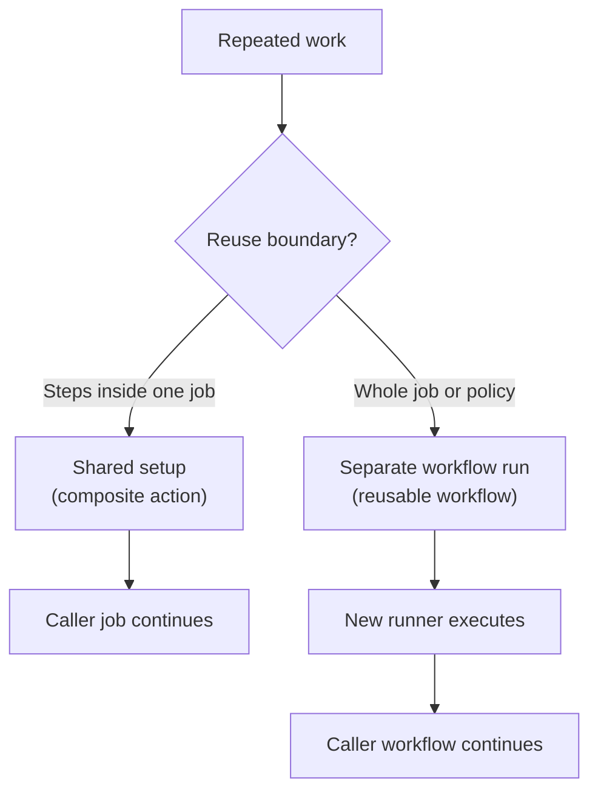

## Table of Contents

1. [The Copy-Paste Trap](#the-copy-paste-trap)
2. [What is Reusability in CI/CD?](#what-is-reusability-in-cicd)
3. [The Operational Spine: Refactoring the Monolith](#the-operational-spine-refactoring-the-monolith)
4. [Custom Actions vs. Reusable Workflows](#custom-actions-vs-reusable-workflows)
5. [Creating a Composite Action](#creating-a-composite-action)
6. [Inputs and Outputs](#inputs-and-outputs)
7. [Reusable Workflows](#reusable-workflows)
8. [Diagnosing Reusability Failures](#diagnosing-reusability-failures)
9. [The Abstraction Tradeoff](#the-abstraction-tradeoff)

## The Copy-Paste Trap

When engineers first discover CI/CD, they usually write a single YAML file for their repository. It installs dependencies, runs tests, builds an artifact, and deploys it. The file might be 150 lines long, but it is readable and contained.

Then, the engineering team adopts a microservices architecture. Instead of one repository, you now have twenty. Because every microservice is written in Node.js, an engineer simply copies the 150-line YAML file into all twenty repositories. 

Six months later, the security team mandates a new vulnerability scanner in every pipeline. You now have to manually open twenty repositories, find the exact line in twenty YAML files, insert the new scanner step, open twenty pull requests, and merge them all. If the Node.js version needs to be updated from 18 to 22, you have to do it twenty times again. 

This is the copy-paste trap. In software engineering, duplicating code leads to configuration drift (when identical configurations slowly diverge over time because people forget to update all of them). Pipelines are just code, and they suffer from the exact same problem.

## What is Reusability in CI/CD?

Reusability in CI/CD is the practice of extracting shared pipeline logic into a centralized, version-controlled module that multiple repositories can reference. 

It exists to solve the copy-paste trap. Instead of twenty repositories containing the instructions for "how to build a Node app", those twenty repositories contain a single line that says "call the central Node builder".

In the GitHub Actions ecosystem, this centralized logic sits right alongside your normal code. You can store reusable components in the same repository, or in a dedicated "DevOps" repository that the rest of the company imports. 

In this article, we will take a massive, duplicated workflow and refactor it by extracting the setup and build steps into a custom action. We will explore how data flows into these actions, and what happens when they break.

## The Operational Spine: Refactoring the Monolith

Imagine you have a frontend React application and a backend Express API. Both repositories have an identical block of YAML at the start of their CI pipelines:

```yaml
jobs:
  test:
    runs-on: ubuntu-latest
    steps:
      - uses: actions/checkout@v4
      
      # The duplicated block begins here
      - name: Setup Node
        uses: actions/setup-node@v4
        with:
          node-version: '22'
          cache: 'npm'
          
      - name: Install Dependencies
        run: npm ci
        
      - name: Run Build
        run: npm run build
      # The duplicated block ends here
        
      - name: Run Tests
        run: npm test
```

That block of three steps (Setup Node, Install Dependencies, Run Build) is identical across all your projects. Every time a new project is created, a developer copies this block. 

We are going to eliminate this duplication by creating a **Composite Action**. A composite action is a way to bundle multiple workflow steps into a single reusable component. 

## Custom Actions vs. Reusable Workflows

Before we refactor, we need to choose the right tool. GitHub Actions provides two entirely different mechanisms for reusability: Custom Actions and Reusable Workflows.



The diagram above illustrates the structural difference, which dictates when you should use each one.

| Feature | Custom Action (Composite) | Reusable Workflow (Workflow Call) |
| :--- | :--- | :--- |
| **Scope** | Bundles multiple `steps` together. | Bundles entire `jobs` together. |
| **Execution Location** | Runs inside the caller's existing job. | Spins up its own separate Virtual Machines. |
| **Secrets Access** | Automatically inherits the caller's secrets. | Must explicitly pass secrets one by one. |
| **Primary Use Case** | Shared setup logic (e.g., "Install Node and Cache"). | Shared compliance pipelines (e.g., "Deploy to Prod"). |

Because we only want to reuse a sequence of steps (setting up Node and running a build) inside our existing `test` job, a Custom Composite Action is the correct choice. If we wanted to mandate that every repository runs a specific security-scanning job on a separate VM before deploying, we would use a Reusable Workflow.

## Creating a Composite Action

To create a custom action, you must create a new file named `action.yml` (or `action.yaml`). This file can live in a `.github/actions/setup-node-build/` directory inside your current repository, or it can live in the root of an entirely separate repository.

Let us create our composite action. The syntax looks very similar to a normal workflow, but it lacks the `on` and `jobs` blocks because it only defines steps:

```yaml
# .github/actions/setup-node-build/action.yml
name: "Setup Node and Build"
description: "Sets up Node, installs dependencies cleanly, and runs the build script."

runs:
  # This tells GitHub we are combining multiple steps, not running a Docker container
  using: "composite"
  steps:
    - name: Setup Node
      uses: actions/setup-node@v4
      with:
        node-version: '22'
        cache: 'npm'
        
    - name: Install Dependencies
      # In composite actions, every 'run' step must explicitly declare its shell
      shell: bash
      run: npm ci
      
    - name: Run Build
      shell: bash
      run: npm run build
```

Notice the `shell: bash` requirement. In a normal workflow, GitHub defaults to the runner's standard shell. But because a composite action can be called by an Ubuntu runner, a macOS runner, or a Windows runner, GitHub forces you to be explicit about which shell your scripts require.

Now, we can return to our original application workflow and replace the 15 lines of duplicated YAML with a single `uses` statement pointing to our local directory:

```yaml
jobs:
  test:
    runs-on: ubuntu-latest
    steps:
      - uses: actions/checkout@v4
      
      # We replace the entire block with our custom action
      - name: Run Standard Setup
        uses: ./.github/actions/setup-node-build
        
      - name: Run Tests
        run: npm test
```

When GitHub runs this job, it pulls down your code, sees the local action reference, reads the `action.yml` file, and injects those three steps directly into the Ubuntu Virtual Machine before moving on to `npm test`.

## Inputs and Outputs

Our composite action is currently hardcoded to use Node version 22. What if the frontend needs Node 22, but a legacy backend API still requires Node 18? 

Hardcoding values destroys reusability. To fix this, we need to pass data into our action using **Inputs**.

We update our `action.yml` to define an input variable. We can even provide a default value so existing workflows do not break:

```yaml
# action.yml
name: "Setup Node and Build"
description: "Sets up Node, installs dependencies cleanly, and runs the build script."

inputs:
  node-version:
    description: "The version of Node.js to install"
    required: false
    default: '22'

runs:
  using: "composite"
  steps:
    - name: Setup Node
      uses: actions/setup-node@v4
      with:
        # We access the input using the inputs context
        node-version: ${{ inputs.node-version }}
        cache: 'npm'
        
    - name: Install Dependencies
      shell: bash
      run: npm ci
```

Now, the legacy backend workflow can override the default by passing a `with` block:

```yaml
      - name: Run Standard Setup
        uses: ./.github/actions/setup-node-build
        with:
          node-version: '18'
```

Similarly, actions can return **Outputs**. If your build step generates a specific directory path (like `dist/` or `build/`), you can define an output in the `action.yml` so the caller workflow knows exactly where to find the compiled files without having to guess the directory structure.

## Reusable Workflows

While composite actions are perfect for sharing steps, sometimes you need to enforce an entire process. 

Imagine your security team mandates that every deployment to AWS must run a specific suite of compliance checks on a locked-down runner before the deployment job can begin. You cannot trust individual teams to piece those steps together correctly in a composite action.

Instead, you use a **Reusable Workflow** (sometimes called a Workflow Call). 

A reusable workflow is a complete workflow file that uses the `workflow_call` trigger instead of `push` or `pull_request`:

```yaml
# .github/workflows/compliance-scan.yml
name: Compliance Scanner
on:
  workflow_call:
    inputs:
      target-environment:
        required: true
        type: string

jobs:
  scan:
    runs-on: ubuntu-latest
    steps:
      - run: echo "Running heavy compliance scan against ${{ inputs.target-environment }}"
```

Other repositories can now call this workflow as if it were a single job:

```yaml
# caller-workflow.yml
jobs:
  build:
    runs-on: ubuntu-latest
    steps:
      - run: npm run build

  call-compliance:
    needs: build
    uses: my-org/devops-repo/.github/workflows/compliance-scan.yml@v1
    with:
      target-environment: 'production'
```

When this runs, GitHub spins up a completely separate Virtual Machine to execute the compliance scan job. It operates in total isolation from the `build` job. 

## Diagnosing Reusability Failures

When you extract code into reusable modules, you introduce a new layer of abstraction. When a pipeline fails, that abstraction can make debugging difficult. 

Here are the most common failure modes when dealing with composite actions and reusable workflows:

1. **The Unrecognized Input Error**: 
   You added `node-version: '18'` to your caller workflow, but you forgot to declare `node-version` under the `inputs:` block in `action.yml`. GitHub will instantly fail the workflow with a message complaining about unexpected inputs. 
   *Diagnosis*: Always check the `action.yml` interface. You cannot pass an argument that is not explicitly defined in the action's manifest.

2. **The Missing Bash Shell Error**:
   You converted a normal step into a composite action step, but the workflow fails with a cryptic message about missing required parameters.
   *Diagnosis*: You forgot to add `shell: bash` to a `run` step. Composite actions require explicit shell definitions for every command.

3. **The Path Resolution Nightmare**:
   Your composite action runs a bash script located at `./scripts/build.sh`. But when the caller workflow executes it, the runner throws an error stating that the file does not exist.
   *Diagnosis*: The working directory is always the caller's repository, not the action's repository. If your action brings its own bash script, you must reference it using the special `${{ github.action_path }}` context variable, which points to the directory where the action's code was downloaded.

```yaml
    # WRONG: Looks for the script in the caller's repository
    - run: ./scripts/build.sh
      shell: bash

    # RIGHT: Looks for the script inside the downloaded action's directory
    - run: ${{ github.action_path }}/scripts/build.sh
      shell: bash
```

## The Abstraction Tradeoff

Extracting logic into reusable actions is powerful, but it comes with a significant engineering tradeoff: **Abstraction vs. Readability**.

When an engineer opens a workflow file and sees explicit steps (`npm install`, `npm test`, `docker build`), they can immediately understand exactly what the pipeline is doing. The file is a self-documenting script.

When an engineer opens a workflow and sees this:

```yaml
    steps:
      - uses: my-org/magic-ci-action@v3
```

They have absolutely no idea what is happening. What language is it building? Is it caching dependencies? Where are the artifacts going? To find out, they have to navigate away from their repository, find the DevOps repository, read the `action.yml` file, and mentally map the inputs.

If you abstract too early, you create "magic boxes" that terrify junior developers. When the magic box breaks, they do not know how to fix it because the underlying commands are hidden from them.

As a rule of thumb: do not create a reusable action until you have felt the pain of updating a duplicated script in three different repositories. Premature abstraction is just as dangerous in CI/CD as it is in application code.

---

**References**
- [GitHub Docs: Creating a composite action](https://docs.github.com/en/actions/creating-actions/creating-a-composite-action) - The official guide on bundling steps, handling inputs/outputs, and shell requirements.
- [GitHub Docs: Reusing workflows](https://docs.github.com/en/actions/using-workflows/reusing-workflows) - Explains the `workflow_call` trigger and how to pass secrets and inputs to reusable jobs.
- [GitHub Docs: Contexts reference](https://docs.github.com/en/actions/learn-github-actions/contexts) - Documentation on `github.action_path`, `inputs.*`, and other contexts for resolving paths inside custom actions.
- [GitHub Docs: Creating actions](https://docs.github.com/en/actions/creating-actions/about-custom-actions) - Covers the three action types (composite, JavaScript, Docker), when to use each, and how to publish them.
- [GitHub Docs: Sharing actions and workflows](https://docs.github.com/en/actions/creating-actions/sharing-actions-and-workflows-with-your-organization) - Best practices for distributing reusable actions across an organization.
