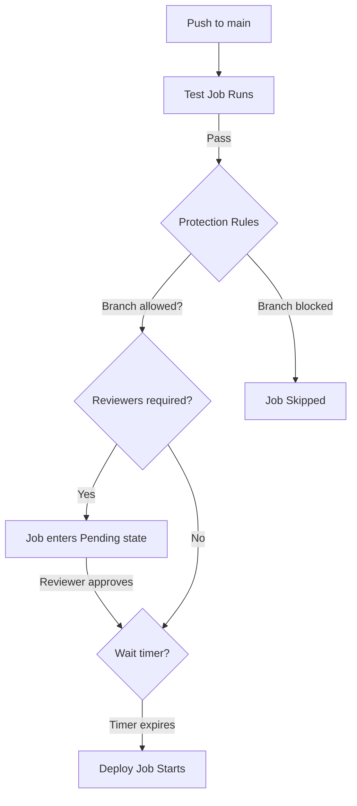
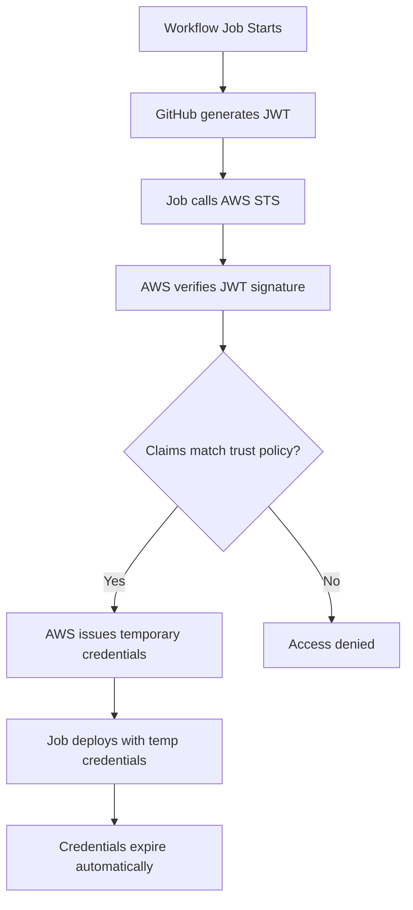

## Table of Contents

1. [The Credentials Problem](#the-credentials-problem)
2. [The Operational Spine: Deploying to AWS](#the-operational-spine-deploying-to-aws)
3. [GitHub Secrets: The Basics](#github-secrets-the-basics)
4. [Environments: Scoping Secrets to Stages](#environments-scoping-secrets-to-stages)
5. [Environment Protection Rules](#environment-protection-rules)
6. [The Danger of Long-Lived Credentials](#the-danger-of-long-lived-credentials)
7. [OpenID Connect: Keyless Authentication](#openid-connect-keyless-authentication)
8. [Setting Up OIDC with AWS](#setting-up-oidc-with-aws)
9. [The Permissions Block](#the-permissions-block)
10. [Secret Hygiene and Failure Modes](#secret-hygiene-and-failure-modes)
11. [The Security Tradeoff](#the-security-tradeoff)

## The Credentials Problem

Every useful CI/CD pipeline eventually needs to talk to something outside of GitHub. It needs to push a Docker image to a container registry. It needs to deploy an application to a cloud server. It needs to update a database migration. It needs to send a Slack notification.

Every one of those actions requires the pipeline to prove its identity. The registry needs to know the pipeline is allowed to push images. The cloud provider needs to know the pipeline is allowed to create servers. The database needs credentials.

In the early days of CI/CD, teams solved this problem in the most obvious way possible: they pasted their AWS access keys, database passwords, and API tokens directly into the CI server's configuration. Sometimes they committed them directly into the repository code. This worked, but it created a massive, invisible attack surface. If anyone gained read access to the repository or the CI server's settings, they instantly had production credentials.

GitHub Actions provides three layers of defense against this: encrypted Secrets, scoped Environments, and OpenID Connect (OIDC) for keyless cloud authentication.

## The Operational Spine: Deploying to AWS

Throughout this article, we will follow a single scenario. You are building a Node.js API. Your team has two deployment targets: a staging server for testing and a production server for real users. Both are running on AWS, and you need your GitHub Actions pipeline to deploy to them automatically.

The question is: how do you give the pipeline permission to deploy to AWS without storing long-lived AWS credentials in your repository?

We will start with the simplest (and most dangerous) approach, then progressively harden the pipeline until we reach the modern best practice.

## GitHub Secrets: The Basics

GitHub provides an encrypted key-value store called **Secrets**. You can create a secret in your repository settings (Settings > Secrets and variables > Actions), and GitHub encrypts the value using a Libsodium sealed box before storing it. The plaintext value is never visible again, not even to administrators.

Inside a workflow, you reference secrets using the `${{ secrets.SECRET_NAME }}` context. GitHub automatically redacts the secret value from workflow logs. If your script accidentally runs `echo $AWS_SECRET_ACCESS_KEY`, the log will show `***` instead of the actual key.

```yaml
jobs:
  deploy:
    runs-on: ubuntu-latest
    steps:
      - uses: actions/checkout@v4

      - name: Deploy to AWS
        env:
          AWS_ACCESS_KEY_ID: ${{ secrets.AWS_ACCESS_KEY_ID }}
          AWS_SECRET_ACCESS_KEY: ${{ secrets.AWS_SECRET_ACCESS_KEY }}
        run: |
          aws s3 sync ./build s3://my-app-bucket
```

This is the starting point most teams use. It is better than hardcoding credentials in code, but it has a critical flaw: **every job in every workflow in the repository can access the same secrets.** Your unit test job, your linting job, and your deploy job all have equal access to production AWS credentials.

Secrets exist at three scoping levels in GitHub:

| Scope | Visibility | Use Case |
| :--- | :--- | :--- |
| **Repository** | All workflows in one repository. | Secrets specific to a single project. |
| **Environment** | Only jobs targeting a named environment. | Stage-specific credentials (staging vs. production). |
| **Organization** | Selected repositories across the org. | Shared internal build credentials. |

The most important row in that table is Environment secrets, because they solve the scoping problem.

## Environments: Scoping Secrets to Stages

A GitHub Environment is a named deployment target (like `staging` or `production`) that you create in your repository settings under Settings > Environments.

When you associate secrets with an environment instead of the repository, those secrets are only available to jobs that explicitly declare `environment: <name>` in their YAML. A test job that does not declare an environment cannot access production credentials, even if it tries.

```yaml
jobs:
  test:
    runs-on: ubuntu-latest
    steps:
      - uses: actions/checkout@v4
      - run: npm ci
      - run: npm test

  deploy-staging:
    needs: test
    runs-on: ubuntu-latest
    environment: staging
    steps:
      - uses: actions/checkout@v4
      - name: Deploy
        env:
          AWS_ACCESS_KEY_ID: ${{ secrets.AWS_ACCESS_KEY_ID }}
        run: ./deploy.sh staging

  deploy-production:
    needs: deploy-staging
    runs-on: ubuntu-latest
    environment: production
    steps:
      - uses: actions/checkout@v4
      - name: Deploy
        env:
          AWS_ACCESS_KEY_ID: ${{ secrets.AWS_ACCESS_KEY_ID }}
        run: ./deploy.sh production
```

In this workflow, the `test` job has no `environment:` declaration. Even though it runs in the same workflow, it cannot read the `AWS_ACCESS_KEY_ID` stored in the `staging` or `production` environments. The `deploy-staging` job can only access secrets stored in the `staging` environment. The `deploy-production` job can only access secrets stored in `production`.

This matters because the staging and production AWS accounts should have completely different IAM credentials with different permission levels. You never want a staging credential to accidentally touch a production database.

## Environment Protection Rules

Environments become genuinely powerful when you add **Protection Rules**. These are policies that GitHub enforces before a job targeting the environment is allowed to start executing.

You configure protection rules in Settings > Environments > (select environment) > Protection rules. The available protections are:

### Required Reviewers

You can require between 1 and 6 designated individuals or teams to manually approve the deployment before it proceeds. When the workflow reaches the `deploy-production` job, it enters a "Waiting" state. The designated reviewers receive a notification via email, the GitHub web UI, and the GitHub mobile app. The job does not start until someone clicks "Approve."

You can also enable "Prevent self-reviews," which ensures that the person who pushed the code cannot approve their own deployment to production. This enforces a basic separation of duties.

### Wait Timers

You can set a delay between 0 and 43,200 minutes (30 days) that must pass before or after approval. This is useful for scheduling deployments during low-traffic windows, or for giving your team time to observe staging before promoting to production.

### Deployment Branches

You can restrict which branches are allowed to deploy to an environment. For example, you might configure production to only accept deployments from `main` or branches matching `release/*`. If a developer tries to deploy from `feature/experiment`, GitHub blocks the job before it starts.



The combination of environment secrets and protection rules gives you a surprisingly robust deployment pipeline without any third-party tools. The test job runs freely. The staging deployment runs automatically after tests pass. The production deployment waits for a senior engineer to review and approve.

## The Danger of Long-Lived Credentials

Even with environment scoping and approval gates, we still have a fundamental problem: the AWS credentials stored in GitHub Secrets are **long-lived**. They were generated months ago, and they will continue to work until someone manually rotates or deletes them.

Here is the nightmare scenario:

1. Six months ago, an engineer created an IAM user called `github-deployer` in AWS with `AdministratorAccess` (because "it was faster").
2. They copied the Access Key ID and Secret Access Key into GitHub Secrets.
3. The engineer left the company. Nobody rotated the credentials.
4. A junior developer accidentally exposes the secret in a log by running `printenv` in a debug step.
5. GitHub's automatic log redaction fails because the secret was embedded inside a larger JSON string (redaction works on exact matches, and structured data can break it).
6. An attacker reads the workflow log, extracts the AWS key, and now has administrator access to your entire AWS account.

The root cause is not the leak itself. It is the fact that a static credential existed at all. If the credential had expired after 15 minutes, the attacker's window would have been nearly zero.

This is the problem that OIDC solves.

## OpenID Connect: Keyless Authentication

OpenID Connect (OIDC) is an identity protocol that lets two systems establish trust without sharing passwords or static keys. In the context of GitHub Actions, it works like this:

1. Before any workflow runs, you configure your cloud provider (AWS, Azure, GCP) to trust GitHub as an identity provider. You register GitHub's OIDC endpoint (`https://token.actions.githubusercontent.com`) with your cloud provider.
2. When a workflow job starts, GitHub automatically generates a short-lived JSON Web Token (JWT) that contains claims about the job: which repository triggered it, which branch it ran on, which environment it targeted, and which workflow file it came from.
3. The job presents this JWT to AWS and says: "I am a GitHub Actions job from `my-org/my-repo`, running on the `main` branch, targeting the `production` environment. Here is my proof."
4. AWS verifies the JWT signature against GitHub's public keys, checks the claims against the IAM trust policy, and if everything matches, issues temporary AWS credentials that expire in 1 hour (or less, depending on configuration).



The critical security improvement is that no static credential ever exists. There is nothing stored in GitHub Secrets that an attacker could steal and reuse later. The temporary credentials are generated on the fly for each job and expire automatically.

## Setting Up OIDC with AWS

Setting up OIDC between GitHub Actions and AWS involves two sides: the AWS side (creating a trust relationship) and the GitHub side (requesting the token in your workflow).

### AWS Side: Create the Trust

First, you create an IAM Identity Provider in your AWS account:

- **Provider URL**: `https://token.actions.githubusercontent.com`
- **Audience**: `sts.amazonaws.com`

Then, you create an IAM Role with a trust policy that specifies exactly which GitHub repositories and branches are allowed to assume the role:

```json
{
  "Version": "2012-10-17",
  "Statement": [
    {
      "Effect": "Allow",
      "Principal": {
        "Federated": "arn:aws:iam::123456789012:oidc-provider/token.actions.githubusercontent.com"
      },
      "Action": "sts:AssumeRoleWithWebIdentity",
      "Condition": {
        "StringEquals": {
          "token.actions.githubusercontent.com:aud": "sts.amazonaws.com"
        },
        "StringLike": {
          "token.actions.githubusercontent.com:sub": "repo:my-org/my-repo:environment:production"
        }
      }
    }
  ]
}
```

The `StringLike` condition on the `sub` claim is the most important security boundary. It restricts this IAM role so that only workflows from `my-org/my-repo` targeting the `production` environment can assume it. A workflow from a different repository, or a job that does not declare `environment: production`, will be denied by AWS.

If you use `repo:my-org/my-repo:ref:refs/heads/main` instead, the restriction is branch-based rather than environment-based. You can combine both for defense in depth.

### GitHub Side: Request the Token

On the workflow side, you need two things: the `id-token: write` permission (so GitHub generates the JWT), and the official `aws-actions/configure-aws-credentials` action to handle the token exchange:

```yaml
permissions:
  id-token: write
  contents: read

jobs:
  deploy-production:
    runs-on: ubuntu-latest
    environment: production
    steps:
      - uses: actions/checkout@v4

      - name: Configure AWS Credentials
        uses: aws-actions/configure-aws-credentials@v4
        with:
          role-to-assume: arn:aws:iam::123456789012:role/github-deploy-role
          aws-region: us-east-1

      - name: Deploy
        run: aws s3 sync ./build s3://my-production-bucket
```

Notice what is missing: there is no `AWS_ACCESS_KEY_ID` or `AWS_SECRET_ACCESS_KEY` in the secrets or the environment variables. The `configure-aws-credentials` action handles the entire OIDC token exchange behind the scenes. It requests the JWT from GitHub, sends it to AWS STS, receives temporary credentials, and injects them into the runner environment for subsequent steps to use.

## The Permissions Block

The `permissions` block at the top of the workflow (or at the job level) controls what the `GITHUB_TOKEN` is allowed to do, and whether the job can request an OIDC token. By default, the `GITHUB_TOKEN` has a set of permissions determined by your repository and organization settings. When you explicitly declare a `permissions` block, you override those defaults.

This is important for security. The principle of least privilege says that a job should only have the permissions it actually needs. A test job that only reads code and runs `npm test` should not have write access to packages, deployments, or pull requests.

```yaml
permissions:
  contents: read
  id-token: write
  pull-requests: none
  packages: none
```

If you do not set `id-token: write`, GitHub will not generate the OIDC JWT, and the `configure-aws-credentials` action will fail with an error like:

```text
Error: Could not get ID Token from GitHub Actions. 
Please make sure the 'id-token' permission is set to 'write'.
```

This is one of the most common OIDC debugging issues. The fix is always the same: add `id-token: write` to the `permissions` block.

## Secret Hygiene and Failure Modes

Even with OIDC, secrets management requires ongoing discipline. Here are the most common failure modes and how to prevent them:

### Accidental Secret Exposure

GitHub automatically redacts secrets from workflow logs, but this redaction has limits. It works on exact string matches. If a secret is embedded inside a JSON object, base64-encoded, or split across multiple log lines, the redaction can fail. Never run `printenv` or dump environment variables in a workflow step, even for debugging.

### Over-Permissioned IAM Roles

The IAM role your OIDC trust policy points to should follow the principle of least privilege. If your deployment only needs to upload files to a specific S3 bucket, the role should only have `s3:PutObject` on that bucket. Giving the role `AdministratorAccess` "because it is easier" means that any workflow compromise immediately escalates to full account takeover.

### Forgotten Rotation

If you still use static secrets for services that do not support OIDC (Slack webhooks, third-party API keys, database passwords), you must rotate them on a regular schedule. A common recommendation is every 90 days. GitHub does not enforce rotation for you; it is your team's responsibility.

### Organization Secret Over-Sharing

Organization-level secrets default to being accessible by all repositories in the organization. Always restrict them to specific repositories. A secret that gives write access to your npm registry should not be available to every experimental fork in the org.

### The Fork Trap

When a pull request comes from a fork, GitHub strips most secret access to protect the base repository. Environment secrets and repository secrets are not passed to the runner for forked PRs using the standard `pull_request` event. This is a safety feature, not a bug. If a workflow needs secrets for fork PRs, it must use `pull_request_target`, which runs with the base repository's trust context and requires careful security review.

## The Security Tradeoff

As with every engineering decision, security measures in CI/CD involve tradeoffs between protection and friction.

| Approach | Security | Developer Friction | Operational Overhead |
| :--- | :--- | :--- | :--- |
| **Plain repository secrets** | Low. Every job can access every secret. | None. Simple to set up and use. | Low. No extra configuration needed. |
| **Environment-scoped secrets** | Medium. Secrets isolated per stage. | Low. Requires `environment:` in YAML. | Medium. Must manage per-environment secrets. |
| **OIDC (keyless)** | High. No static credentials to steal. | Low once configured. | Higher upfront. Requires IAM trust policy setup. |
| **OIDC + protection rules** | Very high. Human approval + short-lived tokens. | Higher. Requires manual approval for production. | Highest upfront. Worth it for production workloads. |

For a small personal project, plain repository secrets are probably fine. For a startup with a small team, environment-scoped secrets with branch restrictions give you solid protection without much overhead. For any team deploying to production cloud infrastructure, OIDC with environment protection rules is the modern standard. The upfront cost of configuring the IAM trust policy is small compared to the cost of a credential leak.

The general principle is: start with the simplest approach that matches your risk tolerance, and tighten the controls as your deployment targets become more sensitive. A staging environment that serves synthetic test data does not need the same approval gates as a production environment that processes real customer payments.

---

**References**
- [GitHub Docs: Configuring OpenID Connect in Amazon Web Services](https://docs.github.com/en/actions/security-for-github-actions/security-hardening-your-deployments/configuring-openid-connect-in-amazon-web-services) - The official walkthrough for setting up the OIDC identity provider, IAM role trust policy, and workflow configuration.
- [GitHub Docs: Managing environments for deployment](https://docs.github.com/en/actions/managing-workflow-runs-and-deployments/managing-deployments/managing-environments-for-deployment) - Explains how to create environments, configure protection rules, and scope secrets.
- [GitHub Docs: Using secrets in GitHub Actions](https://docs.github.com/en/actions/security-for-github-actions/security-guides/using-secrets-in-github-actions) - Covers repository, environment, and organization secret creation, access rules, and redaction behavior.
- [GitHub Docs: About security hardening with OpenID Connect](https://docs.github.com/en/actions/security-for-github-actions/security-hardening-your-deployments/about-security-hardening-with-openid-connect) - The conceptual overview of how GitHub generates JWTs and how cloud providers verify them.
- [AWS Docs: Creating OpenID Connect identity providers](https://docs.aws.amazon.com/IAM/latest/UserGuide/id_roles_providers_create_oidc.html) - The AWS side of the OIDC setup, including provider registration and role trust policies.
