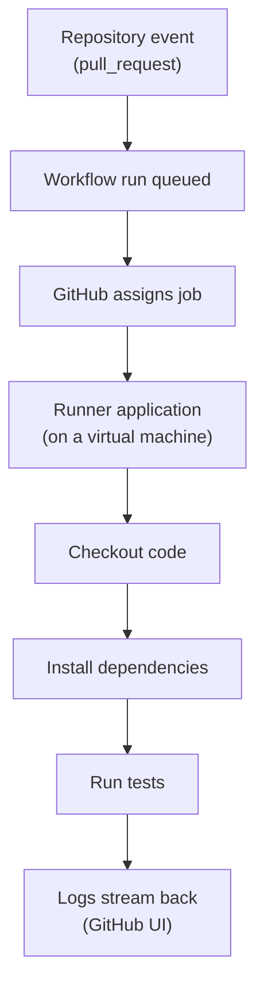

## Table of Contents

1. [The "Serverless" Illusion](#the-serverless-illusion)
2. [What is a Runner?](#what-is-a-runner)
3. [The Operational Spine: The Missing Dependency](#the-operational-spine-the-missing-dependency)
4. [GitHub-Hosted Runners](#github-hosted-runners)
5. [The `runs-on` Directive](#the-runs-on-directive)
6. [Self-Hosted Runners](#self-hosted-runners)
7. [The Security Risk of Self-Hosted Runners](#the-security-risk-of-self-hosted-runners)
8. [Hosted vs. Self-Hosted: The Tradeoff](#hosted-vs-self-hosted-the-tradeoff)
9. [Execution Environments: Shell vs. Container](#execution-environments-shell-vs-container)
10. [The Workspace Directory](#the-workspace-directory)
11. [How Setup Actions Actually Work](#how-setup-actions-actually-work)
12. [Diagnosing Runner Failures](#diagnosing-runner-failures)

## The "Serverless" Illusion

When you use modern cloud services, it is easy to fall into the trap of believing that your code is running in some magical, ethereal "cloud." You write a YAML file, push it to GitHub, and three minutes later, a green checkmark appears. You never had to provision a server, install an operating system, or configure a firewall.

But there is no magic in computer science. The "cloud" is just someone else's computer.

Before managed CI/CD platforms existed, if you wanted to automate your testing, you had to physically buy a server, rack it in a closet, install Linux on it, install Jenkins, and leave it running 24/7. When the hard drive failed, you had to replace it.

GitHub Actions abstracts all of that away, but the physical reality remains exactly the same: your code must execute on a real CPU, inside a real operating system, using real memory. Understanding exactly what that machine is, how it is provisioned, and what software is installed on it is the key to debugging 90% of all pipeline failures.

## What is a Runner?

In the GitHub Actions ecosystem, the machine that executes your code is called a **Runner**. 

A runner is simply a server (usually a Virtual Machine) that has a specific piece of software installed on it: the GitHub Actions Runner application. This application is a lightweight agent. Its only job is to open a long-lived outbound connection to GitHub's API, wait for a job to be assigned to it, execute the steps in that job one by one, and stream the logs back to the GitHub UI.



When you define a job in your YAML file, you must explicitly tell GitHub what kind of runner you need. This is the single most important decision you make when configuring a job, because it dictates the entire environment your code will run in.

## The Operational Spine: The Missing Dependency

Let us look at a concrete failure scenario. You are building a Python data science application on your MacBook. Your code relies on a C library called `libpq-dev` to connect to a PostgreSQL database. You used Homebrew (`brew install libpq`) to install it on your local machine months ago and completely forgot about it.

Your code works perfectly on your laptop. You write a workflow file to run your tests:

```yaml
jobs:
  test:
    runs-on: ubuntu-latest
    steps:
      - uses: actions/checkout@v4
      - uses: actions/setup-python@v5
        with:
          python-version: '3.12'
      - run: pip install -r requirements.txt
      - run: pytest
```

You push the code, and the pipeline immediately fails during the `pip install` step with a massive wall of red text:

```text
  Building wheel for psycopg2 (setup.py) ... error
  ERROR: Command errored out with exit status 1:
   command: /opt/hostedtoolcache/Python/3.12.0/x64/bin/python -u -c '...'
       cwd: /tmp/pip-install-xyz/psycopg2/
  Complete output (14 lines):
  running bdist_wheel
  running build
  running build_ext
  Error: pg_config executable not found.
  
  Please add the directory containing pg_config to the $PATH
  or specify the full executable path with the option:
      python setup.py build_ext --pg-config /path/to/pg_config build ...
```

Why did this fail? Because you assumed the environment running your code was identical to your laptop. It is not. You told the pipeline to run on `ubuntu-latest`, and the fresh Ubuntu virtual machine provisioned by GitHub does not have `libpq-dev` installed by default.

To fix this, you have to explicitly install the system dependency before you install your Python dependencies:

```yaml
    steps:
      - uses: actions/checkout@v4
      
      - name: Install System Dependencies
        run: sudo apt-get update && sudo apt-get install -y libpq-dev
        
      - uses: actions/setup-python@v5
        with:
          python-version: '3.12'
          
      - run: pip install -r requirements.txt
```

This failure mode is the core lesson of CI/CD: **You do not control the machine, but you must define its state.**

## GitHub-Hosted Runners

The easiest and most common way to run workflows is by using **GitHub-Hosted Runners**. 

When you use a hosted runner, GitHub is entirely responsible for the infrastructure. The moment your workflow triggers, GitHub dynamically provisions a brand-new, completely isolated Virtual Machine in Microsoft Azure. 

This VM is "ephemeral." That means it is born specifically for your job, and the second your job finishes (whether it passes or fails), the VM is completely destroyed. This provides a massive security and consistency benefit: every single time your pipeline runs, it starts from an absolutely pristine, identical state. There are no leftover files from the previous run, no corrupted caches, and no lingering background processes.

GitHub provides these VMs with a variety of operating systems pre-installed. Furthermore, they do not give you a bare OS; they pre-install hundreds of common developer tools (Node.js, Python, Docker, AWS CLI, Git, curl) so you do not have to waste five minutes installing them on every run.

## The `runs-on` Directive

You specify which hosted runner you want using the `runs-on` directive inside your job definition.

```yaml
jobs:
  build-linux:
    runs-on: ubuntu-latest
    steps:
      - run: echo "Running on Ubuntu Linux!"

  build-mac:
    runs-on: macos-latest
    steps:
      - run: echo "Running on Apple Silicon!"

  build-windows:
    runs-on: windows-latest
    steps:
      - run: echo "Running on Windows Server!"
```

The `-latest` suffix is a floating tag. It means "give me the newest stable version." As of this writing, `ubuntu-latest` points to Ubuntu 24.04. Eventually, GitHub will update it to point to the next LTS release (like 26.04). 

If your build is incredibly fragile and might break if the underlying OS upgrades unexpectedly, you should pin to a specific version instead, like `ubuntu-24.04` or `ubuntu-22.04`.

## Self-Hosted Runners

While GitHub-hosted runners are convenient, they have strict limitations. They run on shared infrastructure, their IP addresses constantly change, they only have a few CPU cores, and they cost money per minute.

If you are building a massive C++ application that requires 64 CPU cores and 128GB of RAM to compile in a reasonable amount of time, a standard GitHub-hosted runner will be too slow. Or, if your deployment script needs to connect to an internal database that sits behind your company's corporate firewall, the Azure-hosted VM will not be able to reach it because it is on the public internet.

The solution is the **Self-Hosted Runner**. 

A self-hosted runner is a machine that *you* own and manage. It could be an EC2 instance in your AWS account, a Kubernetes pod in your private cluster, or even an old Mac mini sitting on your desk. You install the open-source GitHub Runner agent on the machine, authenticate it with your repository, and leave it running.

```yaml
jobs:
  deploy-internal:
    # Instead of asking for ubuntu-latest, we target our custom label
    runs-on: [self-hosted, internal-network]
    steps:
      - run: ./deploy-to-private-db.sh
```

When the workflow triggers, GitHub sees the `self-hosted` label. Instead of provisioning an Azure VM, it holds the job in a queue. The agent running on your private machine polls GitHub, sees the pending job, pulls down the instructions, and executes them locally on your network.

## The Security Risk of Self-Hosted Runners

Using self-hosted runners on public repositories introduces a massive, often misunderstood security risk. 

Imagine you attach a self-hosted runner (a server sitting in your company's private network) to a public open-source repository. An attacker forks your repository, modifies the `package.json` to include a malicious post-install script, and opens a Pull Request.

Because GitHub Actions triggers on `pull_request` events by default, GitHub instantly queues the job. Your self-hosted runner polls GitHub, downloads the attacker's malicious code, and blindly executes `npm install`. The attacker's script runs.

If you were using a GitHub-hosted runner, this would be annoying but harmless. The script would run inside an isolated Azure VM, fail the build, and then the VM would be instantly destroyed. The attacker gains nothing.

But because this ran on your **self-hosted** runner, the attacker just achieved Remote Code Execution (RCE) on a machine inside your corporate firewall. They can now scan your internal network, steal environment variables left over from previous builds, or use the machine to pivot and attack your databases.

For this exact reason, **you should never attach a self-hosted runner to a public repository** unless you have implemented extreme, advanced isolation mechanisms (like ephemeral Docker-in-Docker runners or strict manual approval gates). By default, self-hosted runners trust the code they execute. If the code is untrusted, the runner is compromised.

## Hosted vs. Self-Hosted: The Tradeoff

Choosing between hosted and self-hosted runners is a classic engineering tradeoff between convenience and control.

| Feature | GitHub-Hosted Runner | Self-Hosted Runner |
| :--- | :--- | :--- |
| **Maintenance** | Zero. GitHub manages the OS, patches, and VM lifecycle. | High. You must patch the OS, monitor disk, and manage the VMs. |
| **State** | Ephemeral. Starts fresh every time. Guaranteed clean state. | Mutable. State can bleed between runs unless explicitly cleaned. |
| **Network Access** | Public internet. Cannot easily reach private VPCs. | Local network. Runs inside your firewall securely. |
| **Hardware** | Standardized (2-4 cores by default). | Custom. You can use 96-core servers or specialized GPUs. |
| **Cost** | Pay per minute of execution time. | Pay for the underlying server infrastructure 24/7. |

As a rule of thumb: always use GitHub-hosted runners until you hit a physical limitation (like a firewall or a need for a GPU) that explicitly forces you to manage your own servers.

## Execution Environments: Shell vs. Container

Even after you choose the operating system (`ubuntu-latest`), you still have to decide *how* your steps execute on that machine. GitHub Actions provides two distinct paradigms for this.

### Paradigm 1: Bare Metal Shell Execution

By default, every `run:` step executes directly in the bash shell of the underlying Virtual Machine.

```yaml
    steps:
      - name: Install and Run
        run: |
          node --version
          npm install
          npm run build
```

In this model, your script has full access to the VM. If you run `sudo rm -rf /`, you will destroy the VM (which does not matter, because it is ephemeral and will be deleted anyway). 

### Paradigm 2: Container Actions

Sometimes, you need to run a tool that is extremely difficult to install, or relies on an obscure version of an operating system. Instead of writing a complex `apt-get` script to install it on the Ubuntu runner, you can execute the step entirely inside a Docker container.

```yaml
    steps:
      - name: Scan Code with Custom Tool
        uses: docker://alpine:3.18
        with:
          entrypoint: /bin/sh
          args: -c "echo 'Running inside an Alpine container!'"
```

When GitHub sees this, it pauses the workflow. It uses the Docker daemon installed on the Ubuntu runner to pull the `alpine:3.18` image. It starts a container from that image, mounts your source code into the container, and executes the command inside it. When the step finishes, the container is destroyed, and the workflow resumes back on the bare Ubuntu shell.

This provides incredible flexibility: you can run a pipeline on `ubuntu-latest`, but execute step 1 in an Alpine Linux container, step 2 in a Node container, and step 3 back on the bare Ubuntu VM.

## The Workspace Directory

When a runner executes your job, where exactly is it doing the work? 

GitHub creates a specific directory on the runner called the **Workspace**. You can access the exact path to this directory using the `${{ github.workspace }}` context variable. 

By default, the workspace is completely empty. This is a common point of confusion for beginners. They write a workflow like this:

```yaml
jobs:
  test:
    runs-on: ubuntu-latest
    steps:
      - run: npm test
```

And it immediately fails with: `npm ERR! enoent ENOENT: no such file or directory, open '/home/runner/work/my-repo/my-repo/package.json'`.

Why did it fail? Because simply triggering a workflow does not automatically put your source code onto the runner. You have an empty Virtual Machine. If you want your code, you must explicitly fetch it as the very first step of almost every job:

```yaml
    steps:
      # This Action runs 'git clone' and places your code in the workspace
      - uses: actions/checkout@v4
      
      # Now the package.json exists, and this will work
      - run: npm test
```

Throughout the entire job, every `run` step defaults to executing inside this workspace directory. If step 1 creates a file called `output.txt` in the workspace, step 2 can read it. 

## How Setup Actions Actually Work

When you read a YAML file, you will frequently see actions like `setup-node`, `setup-python`, or `setup-go`. 

```yaml
    steps:
      - uses: actions/setup-node@v4
        with:
          node-version: '20'
```

If the runner is just an Ubuntu server, what does this action actually do? 

It does not simply run `apt-get install nodejs`. That would be too slow, and it would rely on whatever version of Node happens to be in the Ubuntu package manager. 

Instead, GitHub maintains a massive, pre-compiled cache of every major language runtime on their servers. When `setup-node` executes, it makes an API call to GitHub, downloads a compressed tarball of the exact Node.js binary you requested (e.g., version 20.12.2), extracts it directly onto the runner's disk, and then manipulates the `$PATH` environment variable so that subsequent steps use that specific binary.

This process takes less than two seconds. It guarantees that your build uses the exact same compiler version every single time it runs, eliminating the "it works on my machine" problem entirely.

## Diagnosing Runner Failures

When a workflow fails, diagnosing the issue requires understanding the runner's perspective. 

1. **Did it fail instantly before any steps ran?** Check your `runs-on` directive. If you asked for a `self-hosted` runner but none are online, GitHub will queue the job indefinitely until it times out.
2. **Did a command say "not found"?** You assumed a tool was pre-installed on the runner. You need to use an action (like `actions/setup-node`) or a package manager (`apt-get`) to install it before calling it.
3. **Did it complain about a missing file?** You either forgot to include `actions/checkout`, or a previous step deleted/moved the file out of the workspace.
4. **Did the job run out of memory?** Your build process (like Webpack or a JVM) consumed more RAM than the standard runner provides (usually 7GB). You may need to optimize your build, or move to a "Larger Runner" / self-hosted runner.

Always remember: the runner is just a server. Treat pipeline failures the exact same way you would treat an SSH session into a broken EC2 instance. Read the logs, verify the environment state, and trace the path of execution.

---

**References**
- [GitHub Docs: About GitHub-hosted runners](https://docs.github.com/en/actions/using-github-hosted-runners/about-github-hosted-runners) - Details the exact hardware specifications, pre-installed software, and ephemeral lifecycle for hosted runners.
- [GitHub Docs: About self-hosted runners](https://docs.github.com/en/actions/hosting-your-own-runners/managing-self-hosted-runners/about-self-hosted-runners) - Explains the architecture and security implications of managing your own runner agents.
- [GitHub Docs: Default environment variables](https://docs.github.com/en/actions/learn-github-actions/variables#default-environment-variables) - Lists default paths like `GITHUB_WORKSPACE` and other variables available during execution.
- [GitHub Docs: Using containerized services](https://docs.github.com/en/actions/using-containerized-services/about-service-containers) - Explains how Docker containers integrate with GitHub Actions jobs and steps.
- [GitHub Docs: Runner images](https://github.com/actions/runner-images) - The open-source repository listing every pre-installed tool on each hosted runner image.
