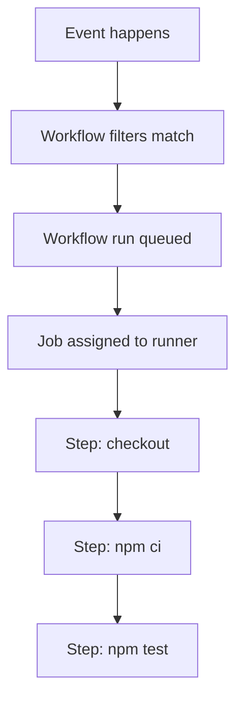

## Table of Contents

1. [The Event-Driven Mental Model](#the-event-driven-mental-model)
2. [Anatomy of a Workflow](#anatomy-of-a-workflow)
3. [A Real Scenario: PR vs. Push Events](#a-real-scenario-pr-vs-push-events)
4. [Manual and Scheduled Triggers](#manual-and-scheduled-triggers)
5. [The Event Payload and Contexts](#the-event-payload-and-contexts)
6. [Jobs and Concurrency](#jobs-and-concurrency)
7. [Matrix Builds Without Copy-Paste](#matrix-builds-without-copy-paste)
8. [Steps: The Actual Work](#steps-the-actual-work)
9. [The Built-in GITHUB_TOKEN](#the-built-in-github_token)
10. [Common Failure Modes](#common-failure-modes)

## The Event-Driven Mental Model

Before GitHub Actions arrived (announced as a beta in 2018, generally available in November 2019), the CI/CD landscape was highly fragmented. Developers wrote code on GitHub, but to test and deploy it, they usually had to connect third-party services like TravisCI, CircleCI, or a self-hosted Jenkins server. This required managing external credentials, stitching together complex webhooks, and jumping between entirely different websites just to see why a build failed.

GitHub Actions changed the industry by building CI/CD directly into the version control platform itself. For many teams, this means there is no separate CI server to install, upgrade, or secure. The infrastructure still exists (GitHub provides hosted virtual machines called "runners" to execute the code), but the platform where your code lives is the exact same platform that orchestrates the builds.

Because of this deep integration, GitHub Actions operates heavily on an event-driven mental model. An event is a recorded thing that happened: a branch was pushed, a pull request was opened, a release was published, a schedule reached its next tick, or an external system called GitHub's API to request a run.

In many older Jenkins-style setups, the CI server operated on a "polling" model. Every five minutes, it would wake up, ask the Git repository if there was new code, and if there was, it would run a build. While traditional CI systems eventually added webhook support, polling was historically the norm. It was slow, inefficient, and detached from what the developer was actually doing.

In contrast, many important actions inside GitHub can become workflow triggers. That wording matters. GitHub has many webhook events, but not every webhook event can trigger a workflow, and not every tiny UI action deserves automation. You choose the events that match the engineering decision you care about.

You write YAML files that listen for specific triggers. When an eligible event matches the workflow's filters, GitHub queues a workflow run. Each job in that run is then assigned to a runner, which is the machine that executes the job. If you use GitHub-hosted runners, GitHub usually gives you a fresh virtual machine. If you use self-hosted runners, the job runs on infrastructure your team operates. The mental model is the same either way: the event decides whether work should start, and the runner does the work.

## Anatomy of a Workflow

In GitHub Actions, the highest level of organization is a workflow. A workflow is a YAML file living in a very specific directory: `.github/workflows/`. The file must use a `.yml` or `.yaml` extension. If a YAML file is not in that folder, GitHub ignores it as an Actions workflow.

A workflow has three core hierarchical components:
1. **`on`**: The events that trigger the workflow.
2. **`jobs`**: Units of work that GitHub assigns to runners.
3. **`steps`**: The shell commands or actions that run inside one job.



That hierarchy is worth memorizing because most GitHub Actions bugs are really hierarchy bugs. A trigger problem belongs in `on`. A dependency or permission problem usually belongs at the job level. A missing command, shell mismatch, or failed script usually belongs inside a step.

## A Real Scenario: PR vs. Push Events

Let us look at a concrete operational spine. You are building a Node.js application. You want to run a fast suite of unit tests every time a developer opens a Pull Request to make sure they did not break anything. A Pull Request, often shortened to PR, is a proposed change where GitHub compares a source branch against a target branch before the team merges it.

However, when code lands on the `main` branch, you want to run the unit tests and run a slower deployment script that uploads the code to an AWS server. In a branch-protected repository, that usually happens through a merged PR. Technically, it means any push to `main`, including a direct push by an administrator.

You handle this by defining specific events in the `on` block.

```yaml
name: Node.js CI

on:
  pull_request:
    branches:
      - main
  push:
    branches:
      - main

jobs:
  test-and-deploy:
    runs-on: ubuntu-latest
    steps:
      - name: Checkout Code
        uses: actions/checkout@v4

      - name: Install Dependencies
        run: npm ci

      - name: Run Unit Tests
        run: npm test
```

This workflow listens for two distinct events:
1. `pull_request` targeting the `main` branch.
2. `push` to the `main` branch.

The `branches` filter has different meaning depending on the event. For `pull_request`, it matches the target branch of the PR, also called the base branch. For `push`, it matches the branch that was pushed. If a developer pushes code to a branch named `feature/login` but has not opened a PR yet, this workflow does nothing because there is no matching `pull_request` event and the `push` event is not for `main`.

### Conditional Execution Based on Events

If the same workflow runs for both PRs and pushes, how do we prevent the deployment script from running during a PR? We use the `github.event_name` and `github.ref` contexts to conditionally execute a step.

```yaml
      - name: Run Unit Tests
        run: npm test

      - name: Deploy to Production
        if: github.event_name == 'push' && github.ref == 'refs/heads/main'
        run: ./deploy.sh
```

When a developer opens a PR, the `github.event_name` is `pull_request`. The workflow runs the tests, evaluates the `if` condition on the deploy step, sees that it is false, and skips the deployment entirely. When a push updates `refs/heads/main`, the condition evaluates to true and the deployment script runs.

This is also why branch protection matters. If your repository allows direct pushes to `main`, this deploy step does not know whether the push came from a merged PR or a person with write access. GitHub Actions sees a `push` event. Branch rules, required reviews, and required checks are what make "push to main" mean "reviewed code reached main" in practice.

## Manual and Scheduled Triggers

Not all workflows are triggered by code changes. Sometimes you want a pipeline to run at a specific time, or you want to give a product manager a button to deploy the site manually. GitHub provides two specific triggers for this:

1. **`schedule`**: Uses standard cron syntax to run workflows based on a clock.
2. **`workflow_dispatch`**: Creates a physical "Run workflow" button in the GitHub UI and allows you to define custom text inputs.

```yaml
on:
  # Run every night at midnight UTC
  schedule:
    - cron: '0 0 * * *'

  # Allow manual triggering from the UI
  workflow_dispatch:
    inputs:
      environment:
        description: 'Environment to deploy to'
        required: true
        default: 'staging'
        type: choice
        options:
          - staging
          - production
```

If a product manager navigates to the Actions tab on GitHub, they will see a dropdown asking them to choose an environment and a button to trigger the run. The pipeline can then read their choice using `${{ inputs.environment }}`.

There are two caveats worth knowing before you rely on these triggers. Scheduled workflows run against the latest commit on the default branch, and GitHub can delay scheduled runs during busy periods. Manual `workflow_dispatch` triggers are also tied to the workflow file on the default branch. If you add a brand-new manual workflow on a feature branch and cannot find the button, that is usually why.

## The Event Payload and Contexts

When an event fires, GitHub does not just trigger the workflow blindly. It exposes the event payload, which is the JSON object describing what happened. The payload is available through `github.event`, and the path to the raw payload file is available through `github.event_path`.

You access this data using context syntax, which looks like this: `${{ context.property }}`. Contexts are not the same thing as environment variables. Contexts are evaluated by GitHub Actions before or during the run depending on where they appear. Environment variables like `$GITHUB_REF` exist inside the runner process once the job is already executing.

| Context Property | What it Contains | Example Output |
| :--- | :--- | :--- |
| `${{ github.actor }}` | The username of the person who triggered the run. | `octocat` |
| `${{ github.sha }}` | The exact Git commit hash being built. | `a1b2c3d4e5f6` |
| `${{ github.ref_name }}` | The short name of the branch or tag. | `main` or `v1.0.0` |
| `${{ github.event_name }}` | The name of the webhook event. | `pull_request` |
| `${{ github.head_ref }}` | The source branch for a PR workflow. | `feature/login` |
| `${{ github.event_path }}` | The runner path to the raw event JSON file. | `/home/runner/work/_temp/_github_workflow/event.json` |

For a normal open `pull_request` event, the payload is rich. It includes the PR title, the author's username, commit details, base branch, head branch, and whether the PR is currently marked as a draft. Still, treat event payloads as event-specific data instead of a fixed schema. Closed PRs, merged PRs, forked PRs, and different event types can expose different shapes.

```yaml
      - name: Welcome Message
        run: echo "Hello ${{ github.actor }}! You just opened PR #${{ github.event.pull_request.number }}"
```

This dynamic context is what lets a workflow react to the specific thing that happened. You can write scripts that label PRs based on the changed files, skip expensive work for draft PRs, or send a Slack message with the commit SHA that broke the build.

## Jobs and Concurrency

Inside the `jobs` block, you define the units of work GitHub should run. A workflow can have one job, or it can have many.

```yaml
jobs:
  lint:
    runs-on: ubuntu-latest
    steps:
      - run: npm run lint

  test:
    runs-on: ubuntu-latest
    steps:
      - run: npm test
```

By default, jobs run in parallel when runner capacity is available. If you push a commit, GitHub can assign the `lint` job and the `test` job to separate runner environments at the same time. This is how you optimize a pipeline for speed.

However, it is critical to understand that separate jobs do not share a working directory. If the `lint` job creates a compiled file, the `test` job cannot see it unless you explicitly upload it as an artifact, save it in a cache, publish it to a package registry, or pass it through some other external system. Treat each job like a fresh kitchen station: same recipe, separate counter.

If you need jobs to run sequentially (for example, you cannot deploy until the tests have successfully passed), you must explicitly declare a dependency using the `needs` keyword:

```yaml
jobs:
  test:
    runs-on: ubuntu-latest
    steps:
      - run: npm test

  deploy:
    needs: test
    runs-on: ubuntu-latest
    steps:
      - run: ./deploy.sh
```

Now, the `deploy` job waits until the `test` job finishes successfully. If the `test` job fails or is skipped, the dependent `deploy` job is skipped unless you deliberately override that behavior with a condition such as `always()`. That default protects production by making success the normal gate.

## Matrix Builds Without Copy-Paste

A matrix lets one job definition expand into many job runs. Instead of copying the same job three times and changing one value each time, you define the changing values once and let GitHub create the combinations.

Imagine you are building an open-source library. You want to guarantee that your code works on Node 18, Node 20, and Node 22. Writing three identical jobs by hand would be repetitive and easy to drift. Instead, you define a matrix strategy:

```yaml
jobs:
  test:
    runs-on: ubuntu-latest
    strategy:
      matrix:
        node-version: [18, 20, 22]

    steps:
      - uses: actions/checkout@v4

      - name: Use Node.js ${{ matrix.node-version }}
        uses: actions/setup-node@v4
        with:
          node-version: ${{ matrix.node-version }}

      - run: npm test
```

When GitHub reads this YAML, it sees the array of three versions. It automatically expands the job into three job runs. One run tests with Node 18, one uses Node 20, and one uses Node 22. If any required matrix job fails, the workflow fails. By default, matrix jobs use fail-fast behavior, which means GitHub can cancel queued or in-progress matrix jobs after a matrix job fails.

That fail-fast behavior is usually what you want for a normal CI pipeline. If Node 18 fails because the test suite is broken, spending more minutes on every other version may not teach you much. For compatibility work, though, you might set `fail-fast: false` so every version reports back and you can see the whole support matrix in one run.

## Steps: The Actual Work

The lowest level of a workflow is the step. Inside a job, steps run sequentially, one after the other, on the same runner environment. Because they run inside the same job, they share the same workspace. If step 1 creates a file, step 2 can read it. If step 1 fails, later steps are skipped by default unless their `if` condition says otherwise.

There are two distinct types of steps:
1. **`run`**: Executes command-line programs using the runner operating system's shell.
2. **`uses`**: Runs an action, such as a JavaScript action, Docker action, composite action, or local action from your repository.

```yaml
    steps:
      # Type 2: Uses a pre-packaged Action
      - name: Checkout Code
        uses: actions/checkout@v4

      # Type 1: Runs a raw shell command
      - name: Print Directory
        run: ls -la
```

Why do we need the `uses` step? Because starting a runner does not automatically put your repository files into the workspace. If you want to run `npm test`, you first have to get your source code onto the machine.

You could write a complex `bash` script using `run` to authenticate with Git, fetch the commit, and check it out. But GitHub already wrote that complex logic, battle-tested it, and packaged it as a reusable component called `actions/checkout`.

Whenever you see `uses`, the runner is executing an action with the inputs you provided and then moving to the next step. Some actions come from public repositories like `actions/checkout@v4`; some are private actions inside your organization; some are local actions in the same repository. The important habit is to pin actions intentionally and understand whose code you are running.

For `run` steps, the shell depends on the runner. On Linux and macOS, the unspecified default is Bash with a fallback to `sh`. On Windows, the default is PowerShell Core. If a script relies on Bash-specific behavior, say so explicitly:

```yaml
      - name: Run Bash script
        shell: bash
        run: |
          set -euo pipefail
          ./scripts/test.sh
```

## The Built-in GITHUB_TOKEN

There is one piece of magic in GitHub Actions that you must understand early: authentication.

Often, a workflow needs to talk back to GitHub. For example, a workflow might want to automatically leave a comment on a Pull Request, or publish a package to GitHub Packages. To do this via the API, the script needs an authentication token.

You do not need to manually create a personal access token and store it in your repository secrets for routine repository automation. At the start of each workflow job, GitHub creates a unique `GITHUB_TOKEN` secret. The token is also available through the `github.token` context. It is not the same thing as an automatically exported environment variable; if a command-line tool expects an environment variable, you pass it explicitly.

```yaml
permissions:
  contents: read
  pull-requests: write
  issues: write

jobs:
  comment:
    runs-on: ubuntu-latest
    if: github.event_name == 'pull_request'
    steps:
      - name: Comment on PR
        env:
          GH_TOKEN: ${{ secrets.GITHUB_TOKEN }}
        run: gh pr comment ${{ github.event.pull_request.number }} --body "Tests passed!"
```

This token is ephemeral. It expires when the job finishes or when its maximum lifetime is reached. Its permissions are limited to the repository that contains the workflow, but the exact permission set depends on repository, organization, enterprise, workflow, job, and fork settings. That is why production workflows usually declare `permissions` explicitly instead of relying on whatever the current default happens to be.

There is one more behavior that surprises beginners. Events created by the repository's `GITHUB_TOKEN` generally do not trigger new workflow runs, except for `workflow_dispatch` and `repository_dispatch`. If a workflow pushes a formatting commit with `GITHUB_TOKEN`, your `on: push` workflow normally will not start again from that commit. GitHub does this to prevent accidental recursive pipelines.

## Common Failure Modes

When a workflow does not run, start with the trigger before you inspect the job logs. If there is no run, there are no job logs yet. The most common trigger bug is putting a workflow file on a feature branch and expecting a scheduled or manual trigger to appear immediately. Those triggers are tied to the workflow file on the default branch.

The next common bug is confusing a PR's base branch with its head branch. In this workflow, `branches: [main]` under `pull_request` means "run when the PR targets main." It does not mean "run only when the source branch is named main." If you need to check the source branch, use `github.head_ref` in an `if` condition.

```yaml
jobs:
  release-branch-check:
    if: startsWith(github.head_ref, 'release/')
    runs-on: ubuntu-latest
    steps:
      - run: echo "This PR came from a release branch."
```

A third bug is assuming skipped work means cancelled work. A job skipped because `needs` failed is not the same thing as a job cancelled by concurrency or matrix fail-fast. The distinction matters when you read the run graph. "Skipped" usually means the dependency gate did its job. "Cancelled" usually means GitHub actively stopped queued or running work.

Finally, be careful with PRs from forks. GitHub protects secrets in that situation. With normal `pull_request` workflows, repository secrets are not passed to the runner, and the `GITHUB_TOKEN` is read-only for forked PRs. That is the safer default. If you reach for `pull_request_target` to get more permissions, pause and read the security guidance first, because that event runs with the base repository's trust context.

---

**References**
- [GitHub Docs: Events that trigger workflows](https://docs.github.com/en/actions/using-workflows/events-that-trigger-workflows) - The official list of workflow trigger events, activity types, fork caveats, and schedule behavior.
- [GitHub Docs: Workflow syntax for GitHub Actions](https://docs.github.com/en/actions/using-workflows/workflow-syntax-for-github-actions) - Defines `on`, `jobs`, `steps`, `needs`, `matrix`, `permissions`, and shell defaults.
- [GitHub Docs: Contexts reference](https://docs.github.com/en/actions/learn-github-actions/contexts) - Shows how `github.event`, `github.event_path`, `github.head_ref`, and other contexts behave.
- [GitHub Docs: Automatic token authentication](https://docs.github.com/en/actions/security-guides/automatic-token-authentication) - Explains how the per-job GITHUB_TOKEN is created, scoped, expired, and prevented from causing recursive workflow runs.
- [GitHub Docs: About GitHub-hosted runners](https://docs.github.com/en/actions/using-github-hosted-runners/about-github-hosted-runners) - Describes hosted runner machines, images, and when GitHub creates fresh runner environments.
