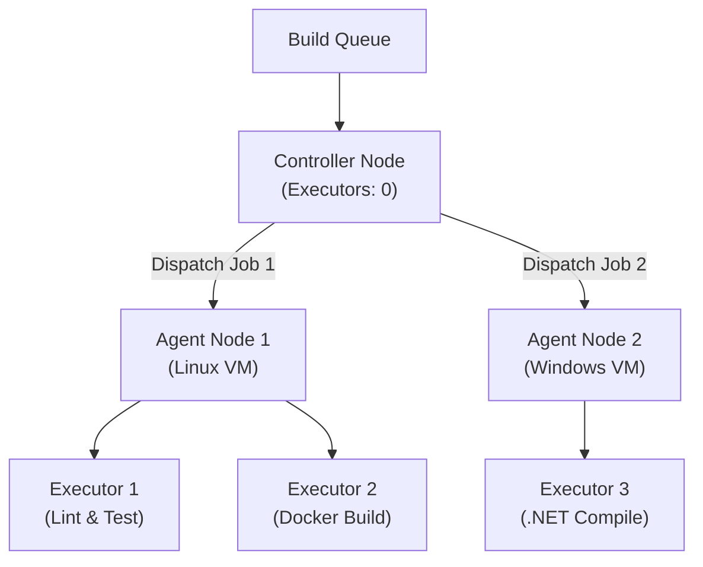

## Table of Contents

1. [The Problem](#the-problem)
2. [The Controller and Agent Split](#the-controller-and-agent-split)
3. [Agent Connection Topologies](#agent-connection-topologies)
4. [Label Routing and Workload Scheduling](#label-routing-and-workload-scheduling)
5. [Dynamic Container Agents](#dynamic-container-agents)
6. [Putting It All Together](#putting-it-all-together)
7. [What's Next](#whats-next)

## The Problem

Operating a self-hosted Continuous Integration and Continuous Delivery (CI/CD) system exposes an engineering team to resource, scheduling, and network boundaries that managed cloud services hide. When teams move from managed runners to their own self-hosted automation servers, they frequently run into major operational friction:

* **The Controller Resource Crash**: A development team hosts Jenkins on a single virtual machine. To get up and running quickly, they run all test suites, code compilations, and Docker builds directly on the primary Jenkins server process. When a developer pushes an un-optimized test suite containing an infinite CPU loop, it consumes all available system memory. The entire Jenkins web interface freezes, active pipelines abort midway, and the team is locked out of deploying critical hotfixes until the system administrator forcefully restarts the server.
* **The Firewall Access Deadlock**: An enterprise installs a central Jenkins controller in a highly secured corporate virtual private cloud. The development teams want to attach build machines situated in remote private subnets and external staging clouds. Because corporate security policy strictly prohibits the controller from opening outbound network connections to external networks, the team cannot register new build executors, halting delivery across departments.
* **The Shared Workspace Contamination**: Multiple software projects share a permanent, persistent build server. During a morning deployment sprint, a Node.js test run writes temporary build artifacts to a shared folder. A subsequent Python build runs on the same machine, reads the stale temporary files left behind by the Node.js build, and fails its integration checks due to ghost dependency mismatches that do not exist in the source repository.

These scenarios illustrate that running an automation server requires an explicit physical split between coordinating builds and executing code.

## The Controller and Agent Split

To prevent resource-exhaustion crashes and system-wide slowness, Jenkins uses a distributed architecture that separates coordination logic from execution environments. This is known as the **Controller and Agent Split**.

The **Controller** (historically called the Master) is the central orchestration process of the Jenkins installation. It is a Java-based daemon that runs the web-based UI dashboard, manages the pipeline execution queue, stores credentials, loads and updates plugins, and coordinates build distributions. The controller should never compile code, run unit tests, or build container images. In a production-ready Jenkins topology, the controller's internal executor count is explicitly configured to zero. This ensures that the controller's CPU and memory remain entirely reserved for lightweight system operations, UI rendering, and agent scheduling.

An **Agent** is an independent compute instance (a bare-metal server, a virtual machine, or a container) that connects to the controller and waits for work. The agent runs a lightweight, headless Java agent runtime (`remoting.jar`). When the controller decides to run a pipeline stage, it serializes the step instructions and dispatches them to an available agent. The agent executes the commands locally inside its own operating system environment and streams the resulting console logs and execution statuses back to the controller over a network socket.

An **Executor** is an individual execution slot on an agent. An executor represents a single thread of execution. If an agent is configured with four executors, it can run up to four distinct pipeline steps or jobs concurrently.




*The controller owns durable state and scheduling decisions; agents provide disposable execution workspaces selected by labels and connected through SSH or WebSocket.*

### The $JENKINS_HOME File Structure

The controller preserves all system state, job definitions, credentials, and build logs within a single root folder known as `$JENKINS_HOME` (typically located at `/var/lib/jenkins` on Linux systems). It is critical to understand what lives inside this directory:

* `config.xml`: The global Jenkins configuration file containing security settings, agent definitions, and system-wide options.
* `jobs/`: A directory containing one subfolder for every registered pipeline job, storing job configurations (`config.xml`), build histories, and serialized console logs.
* `plugins/`: The folder containing all installed plugin files (`.jpi` or `.hpi`) and their extracted directories.
* `secrets/`: Cryptographic keys used to encrypt credentials stored in the system vault.
* `nodes/`: Metadata and configurations for all registered agent nodes.

Because `$JENKINS_HOME` holds the entire state of the controller, it must be regularly backed up or, preferably, managed declaratively using configuration-as-code patterns.

### Agent Workspace Persistence

When an agent receives a build assignment, it creates a persistent workspace folder on its local disk (usually located at `<agent_root>/workspace/<job_name>/`). The agent checks out the Git repository into this workspace and executes all script steps inside it.

By default, agent workspaces persist between builds. This persistence speeds up builds by caching dependencies like `node_modules` or `.m2` folders. However, it also introduces the risk of workspace contamination if files from a previous run are left behind. To ensure a clean state, pipelines can explicitly call the `cleanWs()` step inside their post-build blocks, or use ephemeral container agents that destroy the workspace filesystem entirely when the build completes.

## Agent Connection Topologies

Jenkins supports multiple connection topologies to establish communication between the controller and its agents. The choice depends on network firewalls, subnets, and operating systems.

### SSH Agents (Controller-Initiated Outbound)

In the SSH agent topology, the controller acts as an SSH client. The agent machine runs an SSH daemon. When the agent is registered, the administrator stores the agent's private SSH key in the controller's secure credential store.

The connection handshake follows these steps:

1. The controller opens an outbound TCP connection to the agent over port 22.
2. The controller authenticates using the stored SSH credentials.
3. The controller automatically copies the Java agent library (`remoting.jar`) to the agent's filesystem.
4. The controller starts the Java agent process on the agent machine:
   ```bash
   java -jar /path/to/remoting.jar
   ```

This topology is highly recommended when the controller has direct network route access to the agents, such as when both live in the same private cloud VPC. The main limitation is that if an agent resides behind a NAT or inside a secured private office network, the controller cannot open the outbound SSH connection.

### Inbound WebSocket Agents (Agent-Initiated Inbound)

When agents live behind strict firewalls, NATs, or in remote staging networks, the controller cannot initiate outbound connections. Inbound agents flip the connection direction. The agent machine initiates the connection to the controller.

Historically, inbound agents required opening a dedicated TCP port on the controller (typically port 50000). Modern Jenkins setups replace this with WebSocket communication. The agent connects to the controller over the standard HTTP or HTTPS port (port 80 or 443) used to serve the web UI, upgrading the connection to a persistent WebSocket.

To run an inbound WebSocket agent, the agent downloads `agent.jar` from the controller and runs the process locally:

```bash
java -jar agent.jar \
  -url https://jenkins.example.com/ \
  -secret 4a7e93b8fbc8d312a009 \
  -name production-agent-01 \
  -webSocket
```

The secret token is a cryptographically secure key generated by the controller when the agent is registered. This token validates the agent's identity before the controller accepts the connection.

### Connection Topology Tradeoffs

| Feature | SSH Agent | Inbound WebSocket |
| :--- | :--- | :--- |
| **Connection Initiator** | Controller (outbound) | Agent (inbound) |
| **Transport Protocol** | SSH (TCP port 22) | WebSocket (HTTP/HTTPS port 80/443) |
| **Firewall Requirement** | Agent must accept SSH traffic from Controller | Controller must accept HTTP/HTTPS from Agent |
| **Credential Storage** | Private keys stored on the Controller | Secret token stored on the Agent machine |
| **Best Used For** | Same-VPC Linux virtual machines | Private subnet or remote-office agents |

## Label Routing and Workload Scheduling

In a production cluster, agents are rarely identical. Some agents run on Linux with GPU drivers for machine learning pipelines, others run on macOS to compile iOS applications, and others run inside specialized Windows environments.

Jenkins uses **Label Routing** to match pipeline jobs with the correct execution environments. A label is an arbitrary alphanumeric tag assigned to an agent in the controller's configuration.

When authoring a Jenkinsfile, developers declare which labels the pipeline requires:

```groovy
pipeline {
    agent { label 'linux-docker-builder' }
    stages {
        stage('Compile') {
            steps {
                sh 'npm ci && npm run build'
            }
        }
    }
}
```

When this pipeline is triggered, the controller holds the build in its queue while it scans all online agents. Once it finds an agent carrying the `linux-docker-builder` label with an open executor slot, it dispatches the build steps to that agent.

For complex workflows, developers can declare different agent requirements for individual stages by setting the pipeline-level agent to `none`:

```groovy
pipeline {
    agent none
    stages {
        stage('Build Frontend') {
            agent { label 'node-22-agent' }
            steps {
                sh 'npm run build'
            }
        }
        stage('Compile iOS App') {
            agent { label 'macos-xcode-agent' }
            steps {
                sh 'xcodebuild -scheme PolarisApp'
            }
        }
    }
}
```

Using `agent none` at the pipeline root requires declaring an explicit `agent` inside every single `stage` block. It is important to note that when stages execute on different agents, the local workspace files do not automatically carry over. Platform teams must use `stash` and `unstash` steps to serialize and copy build artifacts across agents over the network.

## Dynamic Container Agents

While permanent virtual machine agents are highly effective for consistent workloads, they suffer from two operational weaknesses: dependency drift and workspace pollution. Over time, manually installing compilers, runtimes, and libraries on permanent VMs leads to snowflake environments that are hard to replicate.

**Dynamic Container Agents** solve this problem by leveraging Docker or Kubernetes. Instead of using a permanent VM, Jenkins spins up a fresh container or Kubernetes Pod dynamically when a build starts, executes the pipeline steps inside that container, and automatically destroys the container when the build completes.

This dynamic topology mirrors the serverless execution model of managed platforms, ensuring 100% environment isolation and clean environments for every build.

### Docker Pipeline Execution

When using Docker-based agents, the controller tells a Docker daemon on a registered agent machine to spin up a container from a specified image. The pipeline steps are executed directly within the container's shell context:

```groovy
pipeline {
    agent {
        docker {
            image 'node:22.2.0-alpine'
            args '-v /tmp/cache:/tmp/cache'
        }
    }
    stages {
        stage('Test') {
            steps {
                sh 'node --version'
                sh 'npm ci && npm test'
            }
        }
    }
}
```

Under the hood, Jenkins executes this container by automatically mounting the agent's workspace directory inside the container using volume mounts. This allows steps inside the container to read and write files directly to the agent host's disk.

### Kubernetes Dynamic Pod Agents

In cloud-native environments, the most robust topology is running Jenkins on Kubernetes. Using the Kubernetes plugin, the controller communicates with the Kubernetes API server to spin up ephemeral Pods to act as one-time agents.

Developers define a custom Pod specification directly inside the Jenkinsfile, grouping multiple container runtime dependencies together:

```groovy
pipeline {
    agent {
        kubernetes {
            yaml '''
apiVersion: v1
kind: Pod
metadata:
  labels:
    some-label: jenkins-agent
spec:
  containers:
  - name: maven
    image: maven:3.9.6-eclipse-temurin-17
    command:
    - cat
    tty: true
  - name: docker
    image: docker:26.1.1
    command:
    - cat
    tty: true
'''
        }
    }
    stages {
        stage('Build Java Code') {
            steps {
                container('maven') {
                    sh 'mvn clean package'
                }
            }
        }
        stage('Build Container Image') {
            steps {
                container('docker') {
                    sh 'docker build -t myapp:latest .'
                }
            }
        }
    }
}
```

The `container` step directs Jenkins to execute specific shell commands inside a targeted container within the dynamic Pod. The Kubernetes plugin automatically attaches a helper container (`jnlp`) to the Pod to maintain the connection back to the controller, destroying the entire Pod namespace when the build concludes.

## Putting It All Together

By separating the control center from the execution engine, we solve the stability, networking, and workspace contamination problems described at the start:

* **Monolithic Controller Crashes**: Setting the controller's internal executor count to 0 ensures that memory-heavy builds never run on the controller. When an infinite CPU loop or memory leak occurs inside a pipeline, it only crashes the isolated agent VM or container. The controller dashboard remains fully operational and handles subsequent builds normally.
* **Network Deadlocks**: The Inbound WebSocket agent topology allows build machines in secure private networks to connect outward to the controller over standard HTTPS (port 443). This eliminates the need for security teams to open dangerous outbound network ports on the core controller VPC.
* **Workspace Contamination**: Moving from permanent shared virtual machines to dynamic container or Kubernetes agents guarantees that every pipeline run starts with a completely pristine filesystem. Caches and dependencies are isolated to specific container namespaces, eliminating side-effects from legacy builds.

## What's Next

Now that we have established a secure and distributed master-agent architecture, the next challenge is representing the build instructions as version-controlled code. Rather than manually clicking through job forms in the Jenkins web UI, we declare our entire build workflow inside a `Jenkinsfile` stored alongside our application code. Let's move to **Pipelines and Jenkinsfile** to learn how to author, lint, and coordinate structured Groovy declarative pipelines.


*Use this as the Jenkins architecture checklist: separate controller state from agent execution, protect `$JENKINS_HOME`, choose connection modes deliberately, route by labels, and use dynamic agents for disposable work.*

---

**References**

* [Jenkins Documentation: Distributed Builds](https://www.jenkins.io/doc/book/managing/nodes/) - Official guide on configuring controller nodes, JNLP inbound agents, and execution labels.
* [Jenkins Remoting Library](https://github.com/jenkinsci/remoting) - Technical specification of the Java-based network communication layer used to stream logs and manage sockets between controllers and agents.
* [Kubernetes Plugin for Jenkins](https://plugins.jenkins.io/kubernetes/) - Detailed architectural reference for orchestrating dynamic, ephemeral Pod agents on Kubernetes clusters.
* [Jenkins Hardware Recommendations](https://www.jenkins.io/doc/book/scaling/hardware-recommendations/) - Official system specs, JVM heap sizing, and CPU allocation rules for production controllers.
