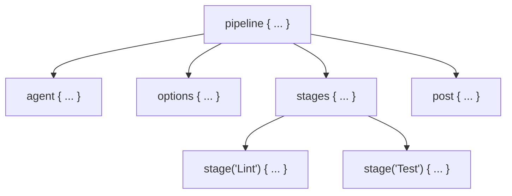

## Table of Contents

1. [The Problem](#the-problem)
2. [The Pipeline-as-Code Mandate](#the-pipeline-as-code-mandate)
3. [Declarative vs. Scripted Groovy](#declarative-vs-scripted-groovy)
4. [Anatomy of a Declarative Pipeline](#anatomy-of-a-declarative-pipeline)
5. [Parallel Execution and Concurrency Optimization](#parallel-execution-and-concurrency-optimization)
6. [Scoping Parameters, Environment Variables, and Gates](#scoping-parameters-environment-variables-and-gates)
7. [Post-Build Conditions and Workspace Hygiene](#post-build-conditions-and-workspace-hygiene)
8. [Putting It All Together](#putting-it-all-together)
9. [What's Next](#whats-next)

## The Problem

Configuring software pipelines through manual web dashboards introduces severe operational fragility. When engineering teams build their software workflows inside the Jenkins web UI, they face recurring delivery roadblocks:

* **The Silent UI Deletion**: An operator logs into the Jenkins dashboard to adjust a staging deployment step. While clicking through the browser menus, they accidentally delete a crucial integration shell command. Because the build steps were configured entirely through the web interface, the team has no change log, no diff comparison, and no backup to restore. The delivery process remains broken until a senior engineer manually reconstructs the script from memory.
* **The Monolithic Stage Blindspot**: To get up and running quickly, developers write their entire CI/CD flow inside a single giant build script. When the build pipeline fails, the Jenkins Stage View renders a single red column. Developers cannot tell if the failure happened during dependency installation, code compilation, unit testing, or container pushing. They are forced to scroll through thousands of lines of raw, un-structured console outputs to identify the root cause.
* **The Ghost Workspace Leak**: A development pipeline builds and tests an application. The pipeline completes successfully, but leaves behind temporary target directories and heavy compiler caches on the permanent agent's filesystem. Over time, the agent's disk fills up, causing subsequent builds to fail mid-run due to out-of-disk errors. Additionally, stale artifacts from previous runs leak into new builds, causing transient failures that cannot be replicated locally.

These failures show that build descriptions must be treated as version-controlled code.

## The Pipeline-as-Code Mandate

The solution to fragile manual configurations is **Pipeline-as-Code**. Rather than defining build steps inside a web form, the entire pipeline is written in a text-based descriptor file called a `Jenkinsfile` and committed directly to the root of the source code repository.

Committing the pipeline alongside the application code yields three major engineering benefits:

1. **Pull Request Validation**: Every pipeline change goes through code review. If a developer attempts to add a risky shell command or update a deployment environment, adjacent team members can audit the diff before it is merged into the default branch.
2. **Versioned Synchronization**: The pipeline configuration stays in sync with the branch state. If a legacy release branch requires older Node.js versions or different build commands, its historical `Jenkinsfile` remains untouched, while the default branch safely evolves to modern requirements.
3. **Disaster Recovery**: If the Jenkins controller server suffers a catastrophic hardware failure, the administrator does not need to manually rebuild fifty distinct jobs. Once the controller is re-provisioned, it automatically reads the repositories' Git branches, discovers the `Jenkinsfile` in each root, and instantly reconstructs the entire build suite.

Under this model, the Jenkins controller acts purely as a coordinator. It reads the `Jenkinsfile` from the repository, allocates an agent node, and walks through the declared steps one by one.

## Declarative vs. Scripted Groovy

Jenkins pipelines are authored in **Groovy**, a dynamic object-oriented programming language designed for the Java Virtual Machine. When writing a `Jenkinsfile`, developers choose between two syntactic approaches: **Declarative** and **Scripted**.

### Declarative Pipeline

Declarative is the modern, opinionated standard for application pipelines. It uses a rigid, structured schema with pre-defined blocks. The Jenkins controller validates the entire syntax of a Declarative pipeline *before* executing any code, blocking the run immediately if a developer makes a typo.

```groovy
pipeline {
    agent { label 'linux-builder' }
    stages {
        stage('Build') {
            steps {
                sh 'npm ci && npm run build'
            }
        }
    }
}
```

The rigid structure of Declarative pipelines ensures consistent visual rendering in the Jenkins UI, supports native "Restart from Stage," and provides built-in conditional blocks.

### Scripted Pipeline

Scripted is the legacy, imperative model. It uses raw Groovy code with minimal syntactic guardrails. The controller does not pre-validate Scripted pipelines; instead, it executes them sequentially like a script, raising errors only when a line actually executes and fails.

```groovy
node('linux-builder') {
    stage('Build') {
        try {
            sh 'npm ci && npm run build'
        } catch (err) {
            echo "Failed: ${err}"
            throw err
        }
    }
}
```

While Scripted pipelines offer absolute programmatic flexibility—allowing developers to use raw `if` blocks, `for` loops, and try-catch structures—they are significantly harder to audit, do not support native UI stage-level restarts, and are prone to runtime syntax failures.

### Syntax Style Comparison

| Feature | Declarative Pipeline | Scripted Pipeline |
| :--- | :--- | :--- |
| **Structure** | Rigid, opinionated schema (`pipeline {}`) | Flexible, imperative script (`node {}`) |
| **Validation** | Pre-validated before execution starts | Evaluated line-by-line at runtime |
| **UI Stage View** | Consistent, granular rendering | Inconsistent; depends on script logic |
| **Error Handling** | Declarative `post` blocks | Imperative `try-catch-finally` |
| **Recommended For** | 95% of application CI/CD pipelines | Complex shared libraries and dynamic pipelines |

## Anatomy of a Declarative Pipeline

A valid Declarative pipeline follows a strict structural schema. The controller walks through these core blocks to orchestrate the build:



### Core Structural Blocks

* **`pipeline`**: The mandatory outer wrapper that identifies the script as a Declarative pipeline.
* **`agent`**: Specifies where the pipeline steps execute. It can target a specific machine label (`label 'linux'`), an ephemeral container (`docker { image 'node:22' }`), or be set to `none` to delegate agent allocation to individual stages.
* **`stages`**: The main sequence containing one or more `stage` blocks that run in linear order.
* **`stage`**: A logical division of the pipeline (such as "Checkout", "Test", or "Deploy"). Splitting work into clear stages is what generates the granular columns in the Jenkins Stage View UI.
* **`steps`**: The actual command execution list within a stage (such as `sh` for shell scripts, `bat` for Windows batch files, or specialized plugins).
* **`options`**: System-wide configuration flags (such as timeouts, retries, and log formatters).
* **`post`**: A dedicated execution block that runs at the end of the pipeline or stage, branching conditionally based on the build outcome.

## Parallel Execution and Concurrency Optimization

Running all build steps sequentially is highly inefficient. If an application requires running static code analysis, unit testing, and Docker compilation, executing them one after the other wastes precious development time.

Declarative pipelines support concurrent execution natively through the `parallel` block. This allows platform teams to split a single stage into multiple concurrent branches that run simultaneously on available agent executors:

```groovy
stage('Quality Gates') {
    failFast true
    parallel {
        stage('Unit Tests') {
            steps {
                sh 'npm run test:unit'
            }
        }
        stage('Static Analysis') {
            steps {
                sh 'npm run lint'
            }
        }
        stage('Security Scan') {
            steps {
                sh 'npm run audit'
            }
        }
    }
}
```

### The Fail-Fast Optimization

By default, when one branch in a parallel block fails, Jenkins allows the other branches to run to completion. While polite, this wastes resource queue capacity. If the 30-second `Lint` stage fails, there is no reason to wait for a 5-minute `Security Scan` to finish.

Setting `failFast true` instructs the controller to immediately abort all other parallel branches the second any single branch fails. This shortens the feedback loop, allowing developers to push fixes faster while freeing up agent nodes for other queued jobs.

## Scoping Parameters, Environment Variables, and Gates

To make pipelines reusable across environments and branches, developers parameterize configurations and use conditional gates.

### Pipeline Parameters

The `parameters` block declares inputs that developers can select in the web interface using the "Build with Parameters" menu. This is highly useful for manually triggered actions like rolling back or deploying to specific clouds:

```groovy
parameters {
    choice(name: 'DEPLOY_ENV', choices: ['staging', 'production'], description: 'Target Cloud')
    booleanParam(name: 'RUN_INTEGRATION_TESTS', defaultValue: true, description: 'Execute integration tests')
}
```

Inside steps, these parameters are read using the `params` map (for example, `params.DEPLOY_ENV`).

### Environment Variable Scoping

The `environment` block declares key-value pairs that are injected as environment variables into all shell execution steps. Variables can be scoped globally at the pipeline root or restricted to a single stage:

```groovy
environment {
    GLOBAL_REGISTRY = 'registry.example.com'
}
stages {
    stage('Build') {
        environment {
            STAGE_BUILD_ARG = 'production-flags'
        }
        steps {
            sh 'echo "Using registry: ${GLOBAL_REGISTRY} with args: ${STAGE_BUILD_ARG}"'
        }
    }
}
```

It is a critical security rule that sensitive credentials must never be written in plaintext within the `environment` block. Secrets belong in the encrypted vault and must be injected using secure credentials bindings, which we cover in a later chapter.

### Conditional Stage Gating

The `when` block lets a stage decide at runtime whether it should execute. This is primarily used to ensure that deployment stages only execute on specific branches or under specific parameter conditions:

```groovy
stage('Deploy to Production') {
    when {
        allOf {
            branch 'main'
            expression { params.DEPLOY_ENV == 'production' }
        }
    }
    steps {
        sh 'kubectl apply -f k8s/prod/'
    }
}
```

Common `when` conditions include:

* `branch`: Executes when the built branch matches a pattern (such as `'main'`).
* `expression`: Evaluates a Groovy boolean expression at runtime.
* `environment`: Executes when an environment variable matches a specific value.
* `allOf` / `anyOf`: Logical AND and OR wrappers to combine multiple gates.

When a stage's `when` gate evaluates to false, the stage is skipped. In the Jenkins UI, skipped stages are rendered as grey pills, providing a clear visual signal that the skip was intentional rather than a build failure.

## Post-Build Conditions and Workspace Hygiene

A common operational failure in self-hosted environments is disk exhaustion caused by stale build workspaces. To maintain system health and automate notifications, pipelines use the pipeline-level or stage-level `post` block.

The `post` block branches conditionally based on the final execution state of the preceding steps:

```groovy
post {
    always {
        junit testResults: '**/test-results/*.xml', allowEmptyResults: true
        cleanWs()
    }
    success {
        slackSend channel: '#deploy-alerts', color: 'good',
            message: "Application build #${env.BUILD_NUMBER} succeeded on branch ${env.BRANCH_NAME}"
    }
    failure {
        slackSend channel: '#deploy-alerts', color: 'danger',
            message: "Application build #${env.BUILD_NUMBER} FAILED on branch ${env.BRANCH_NAME}"
    }
}
```

### Built-in Post Condition Branches

* **`always`**: Executes regardless of the build's outcome. This is the correct place to publish JUnit test reports (ensuring test history is preserved even on test failures) and call the `cleanWs()` step.
* **`success`**: Executes only if all stages completed successfully.
* **`failure`**: Executes if any stage failed, making it the perfect place to trigger engineering alerts.
* **`unstable`**: Runs when steps completed but raised warning signals (such as test suite failures captured by the JUnit step).
* **`aborted`**: Runs when a user manually cancels the build, or when a step exceeds its configured timeout duration.

### Ensuring Workspace Hygiene with cleanWs

The `cleanWs()` step is provided by the Workspace Cleanup plugin. It wipes the local workspace directory on the agent node at the end of the run. Wiping workspaces ensures that subsequent builds on the same agent start with a completely pristine filesystem, preventing disk exhaustion and cross-build cache contamination.

## Putting It All Together

Let's look at a complete, production-ready `Jenkinsfile` for a Node.js microservice. This manifest incorporates options, global environment parameters, parallel testing with fail-fast optimization, conditional staging branch gates, and robust post-build cleanup blocks:

```groovy
pipeline {
    agent { label 'linux-docker-executor' }

    options {
        timeout(time: 30, unit: 'MINUTES')
        retry(1)
        timestamps()
        disableConcurrentBuilds()
        buildDiscarder(logRotator(numToKeepStr: '30', artifactNumToKeepStr: '10'))
    }

    environment {
        APP_NAME     = 'polaris-orders'
        REGISTRY_URL = 'registry.devpolaris-internal.net'
    }

    stages {
        stage('Checkout') {
            steps {
                checkout scm
            }
        }

        stage('Install Dependencies') {
            steps {
                sh 'npm ci'
            }
        }

        stage('Quality Gates') {
            failFast true
            parallel {
                stage('Static Analysis') {
                    steps {
                        sh 'npm run lint'
                    }
                }
                stage('Unit Tests') {
                    steps {
                        sh 'npm run test:unit -- --reporter=junit --reporter-option output=unit-results.xml'
                    }
                }
            }
        }

        stage('Build Image') {
            steps {
                sh "docker build -t ${REGISTRY_URL}/${APP_NAME}:${env.BUILD_NUMBER} ."
            }
        }

        stage('Deploy Staging') {
            when {
                branch 'main'
            }
            steps {
                sh "docker push ${REGISTRY_URL}/${APP_NAME}:${env.BUILD_NUMBER}"
                sh "kubectl set image deployment/${APP_NAME} orders=${REGISTRY_URL}/${APP_NAME}:${env.BUILD_NUMBER} -n staging"
            }
        }
    }

    post {
        always {
            junit testResults: '**/unit-results.xml', allowEmptyResults: true
            cleanWs()
        }
        success {
            echo "Build #${env.BUILD_NUMBER} succeeded."
        }
        failure {
            echo "Build #${env.BUILD_NUMBER} failed."
        }
    }
}
```

This configuration guarantees that:

1. The entire build will abort and release its executor if it hangs for longer than 30 minutes.
2. The linter and test suite run concurrently to optimize execution time, immediately halting if either fails.
3. The application is only pushed and deployed when running on the default `main` branch.
4. The local workspace is wiped completely clean at the end of every run, protecting agent node disk capacity.

## What's Next

While managing a structured `Jenkinsfile` inside a repository secures application-level delivery, copy-pasting an 80-line declarative schema across fifty separate repositories leads to severe maintenance bottlenecks. When global build requirements, artifact registries, or security scanners update, platform teams are forced to manually modify dozens of codebases, introducing configuration drift. 

To solve this, we abstract repeated pipeline code into central, reusable repositories. Let's move to **Shared Libraries** to learn how to write global Groovy libraries that enforce compliance and keep microservice pipelines DRY.


*Use this as the Jenkinsfile checklist: keep pipelines in version control, prefer declarative shape when possible, use scripted code carefully, model stages clearly, parallelize safely, and always clean up.*

---

**References**

* [Jenkins Documentation: Pipeline Syntax](https://www.jenkins.io/doc/book/pipeline/syntax/) - Canonical reference guide mapping all Declarative directives, options, and step patterns.
* [Jenkins Documentation: Pipeline Best Practices](https://www.jenkins.io/doc/book/pipeline/pipeline-best-practices/) - Architectural recommendations for structuring stages, configuring timeouts, and designing workspace hygiene.
* [Workspace Cleanup Plugin Catalog](https://plugins.jenkins.io/ws-cleanup/) - Details on the workspace cleanup steps, selective wipes, and parameter configurations.
* [declarative-linter Specification](https://www.jenkins.io/doc/book/pipeline/development/) - Guide on using the Jenkins CLI to validate syntax errors programmatically before committing files.
