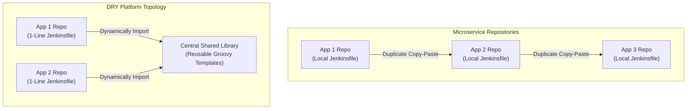

## Table of Contents

1. [The Problem](#the-problem)
2. [The Duplication and Drift Bottleneck](#the-duplication-and-drift-bottleneck)
3. [Structure of a Jenkins Shared Library](#structure-of-a-jenkins-shared-library)
4. [Authoring Reusable Steps in the vars Folder](#authoring-reusable-steps-in-the-vars-folder)
5. [The Script Security Sandbox and Trust Model](#the-script-security-sandbox-and-trust-model)
6. [Enforcing Version Pinning and Compliance](#enforcing-version-pinning-and-compliance)
7. [Putting It All Together](#putting-it-all-together)
8. [What's Next](#whats-next)

## The Problem

As a software organization grows, copy-pasting build descriptions introduces severe maintenance overhead. When engineering teams attempt to manage individual pipelines across dozens or hundreds of microservices, they face recurring delivery blockages:

* **The Stagnant Security Audit**: A security team discovers a critical vulnerability in a base Docker image used across fifty microservices. To enforce compliance, they must inject a new image-scanning tool execution step into every repository's build pipeline. Because each application maintains its own copy-pasted `Jenkinsfile`, platform engineers must open fifty individual pull requests, wait for fifty development teams to approve them, and manually debug configuration drifts across multiple branches.
* **The Registry Migration Crisis**: A systems administrator migrates the company's internal artifact registry to a new cloud domain. Because thirty microservice pipelines hardcode the old registry hostname inside their build stages, a wave of builds fails immediately. The administrator must spend days hunting down, modifying, and testing registry host strings across separate repositories.
* **The Compilation Sandbox Failure**: An engineer attempts to import standard Java utility classes directly into a local repository's `Jenkinsfile`. Because the Jenkins controller enforces a strict JVM security sandbox on local application scripts, the pipeline immediately crashes with a `RejectedAccessException` error, blocking the developer until an administrator manually approves the raw Java methods in the web panel.

These operational crises demonstrate that pipeline logic must be centralized, standardized, and kept DRY (Don't Repeat Yourself).

## The Duplication and Drift Bottleneck

In a classic microservice architecture, separate repositories often share nearly identical delivery processes. For example, twenty separate Java services might all run: check out code, run Maven tests, build a Docker image, push it to ECR, and apply a Kubernetes rollout.

Copy-pasting an 80-line declarative `Jenkinsfile` across these twenty repositories creates **Configuration Drift**. Over time, different teams customize their local pipelines—changing timeouts, skipping test stages, or referencing older tool versions. This drift makes it impossible for platform teams to manage global standards.



Centralizing pipeline logic solves the drift problem. Instead of writing all stages locally, application repositories maintain a minimal, one-line `Jenkinsfile` that imports a central **Jenkins Shared Library**. This architecture decouples application configurations from global delivery mechanics, allowing platform teams to update compilers, security scans, and registry hosts globally without touching individual codebases.

## Structure of a Jenkins Shared Library

A Jenkins Shared Library is a standalone Git repository structured in a specific directory layout that the Jenkins controller recognizes. The repository must use the following standard schema:

```text
shared-library-root/
├── src/
│   └── net/
│       └── devpolaris/
│           └── Utility.groovy
├── vars/
│   ├── standardBuild.groovy
│   ├── slackNotify.groovy
│   └── buildDockerImage.groovy
└── resources/
    └── net/
        └── devpolaris/
            └── config-template.json
```

### The Folder Responsibilities

* **`vars/`**: This directory contains global variables and custom pipeline step scripts. Each Groovy file in this folder represents a single step that application pipelines can invoke directly by name. For example, `vars/slackNotify.groovy` exposes a `slackNotify` step. This is the primary directory used to write high-level Declarative wrappers and reusable pipeline stages.
* **`src/`**: This directory is reserved for standard Java-like Groovy classes. It follows standard Java package namespace conventions (such as `net.devpolaris.Utility`). Classes inside `src/` are used to write complex utility functions, database parsers, or API clients that require standard object-oriented programming.
* **`resources/`**: This directory holds static non-Groovy assets (such as JSON configuration templates, XML files, or SQL scripts). Reusable steps in the library can load these static resources dynamically during pipeline runs using the `libraryResource` step helper.

## Authoring Reusable Steps in the vars Folder

The most common way to build shared library steps is by writing Groovy scripts in the `vars/` directory. Each script must define a public parameterless method named `call`.

### Custom Step Variable: slackNotify.groovy

Let's look at a simple reusable step placed in `vars/slackNotify.groovy` to standardize Slack alert colors and formats across applications:

```groovy
// vars/slackNotify.groovy
def call(Map config = [:]) {
    def channel = config.get('channel', '#deploy-logs')
    def status  = config.get('status', 'SUCCESS')
    def message = config.get('message', "Build #${env.BUILD_NUMBER} finished")

    def color = (status == 'SUCCESS') ? 'good' : 'danger'

    slackSend(
        channel: channel,
        color: color,
        message: "${message} (Status: ${status})"
    )
}
```

Application developers invoke this step inside their pipeline `post` blocks:

```groovy
post {
    failure {
        slackNotify(status: 'FAILURE', channel: '#emergency-alerts')
    }
}
```

### Reusable Pipeline Wrapper: standardBuild.groovy

For ultimate centralization, platform teams write complete, single-line pipeline wrappers. Let's look at `vars/standardBuild.groovy`, which encapsulates the entire checkout, build, lint, test, and container push workflow:

```groovy
// vars/standardBuild.groovy
def call(Map pipelineParams = [:]) {
    def appName     = pipelineParams.get('appName')
    def registryUrl = pipelineParams.get('registryUrl', 'registry.devpolaris-internal.net')
    def nodeVersion = pipelineParams.get('nodeVersion', '22')

    pipeline {
        agent { label 'linux-docker-executor' }

        options {
            timeout(time: 30, unit: 'MINUTES')
            timestamps()
            disableConcurrentBuilds()
            cleanWs()
        }

        stages {
            stage('Checkout') {
                steps {
                    checkout scm
                }
            }

            stage('Install Dependencies') {
                steps {
                    sh "nvm use ${nodeVersion} || npm ci"
                }
            }

            stage('Quality Checks') {
                failFast true
                parallel {
                    stage('Lint') {
                        steps {
                            sh 'npm run lint'
                        }
                    }
                    stage('Unit Tests') {
                        steps {
                            sh 'npm run test -- --reporter=junit --reporter-option output=results.xml'
                        }
                    }
                }
            }

            stage('Container Build') {
                steps {
                    sh "docker build -t ${registryUrl}/${appName}:${env.BUILD_NUMBER} ."
                }
            }
        }

        post {
            always {
                junit testResults: '**/results.xml', allowEmptyResults: true
                cleanWs()
            }
            failure {
                slackNotify(status: 'FAILURE', message: "${appName} build failed!")
            }
        }
    }
}
```

This single script completely encapsulates the organization's delivery standard.

## The Script Security Sandbox and Trust Model

To understand how shared libraries execute, we must understand the Jenkins controller's security boundaries.

### The Groovy Sandbox

Jenkins runs untrusted application pipelines (such as standard repository `Jenkinsfiles`) inside a restricted **Groovy Sandbox**. The sandbox blocks scripts from calling core Java APIs directly (such as `System.exit()`, `java.io.File`, or internal Jenkins reflection classes). This protects the controller filesystem and memory from malicious user code. 

If an application pipeline attempts to call a sandboxed method, the build aborts immediately with a script security exception. An administrator must manually approve the specific signature in the controller's "In-process Script Approval" dashboard.

### Trusted Shared Libraries

Unlike local repository scripts, Jenkins Shared Libraries registered globally by system administrators are **Fully Trusted**. 

Shared libraries bypass the Groovy Sandbox entirely. They can call raw Java APIs, read and write files on the controller's filesystem, execute arbitrary JVM instructions, and invoke third-party Java libraries. 

Because shared libraries run with administrative privileges, platform teams must enforce strict code-review guidelines on the shared library repository. A single unreviewed merge containing a buggy `java.io.File` write or infinite loop could corrupt `$JENKINS_HOME` or crash the central controller server process.

## Enforcing Version Pinning and Compliance

To safely import a shared library without breaking microservice pipelines during updates, Jenkins provides explicit version-pinning controls.

### Importing a Library

Administrators register the library globally in the Jenkins System Configuration panel under "Global Pipeline Libraries," assigning it a logical name (such as `polaris-pipeline-library`).

Application developers import the library at the very top of their `Jenkinsfile` using the `@Library` annotation:

```groovy
@Library('polaris-pipeline-library@v1.2.0') _

standardBuild(
    appName: 'polaris-orders',
    nodeVersion: '22'
)
```

The underscore (`_`) at the end of the annotation is mandatory. It tells the Groovy compiler to import all global variable steps from the library into the current script's classpath immediately.

### Safe Versioning Guidelines

To maintain stability and enforce security compliance, teams must adhere to three version-pinning rules:

1. **Never Rely on Default Master Branches**: Using `@Library('my-library@master')` is highly dangerous. A platform team pushing a new feature or registry update to `master` will instantly affect every active codebase in the organization, introducing widespread build failures due to breaking API shifts.
2. **Pin to Git Tags or Commit SHAs**: Developers must explicitly lock their imports to immutable Git tags (`@v1.2.0`) or specific commit hashes (`@8a3d12b`). This ensures that the pipeline execution remains 100% deterministic over time.
3. **Automate Updates via Staged Environments**: Platform teams should test library changes by pointing a test job to `@Library('my-library@feature-branch')` before tagging a production release, ensuring that new delivery gates are fully validated against test codebases.

## Putting It All Together

Let's look at how centralizing pipeline configurations completely resolves the microservice delivery crises described at the start:

* **Stagnant Security Audits**: When the security team mandates a new SCA (Software Component Analysis) container scanner, platform engineers do not need to edit fifty microservice repositories. They simply add the scanning step inside `vars/standardBuild.groovy` once, test it, and tag a new version (`v1.3.0`). Individual teams update their single-line imports to `@Library('polaris-pipeline-library@v1.3.0')` when ready, instantly inheriting the new security gate.
* **Registry Host Migrations**: The INTERNAL registry URL hostname is abstracted inside the central library's default configuration parameters. When the registry migrates, the platform team changes the host value inside `vars/standardBuild.groovy` once. Every microservice dynamically inherits the new address during their next build execution.
* **Sandbox Exceptions**: Because global shared libraries run as trusted code, complex utility methods that read configurations or parse build logs run smoothly without triggering sandbox exceptions or requiring manual system administrator approvals in the web UI.

## What's Next

Now that we have abstracted our pipeline configurations into reusable code and global shared libraries, we must secure the underlying Jenkins controller itself from manual UI adjustments. While shared libraries keep our code DRY, administrators still manage plugins, define credentials, and allocate system nodes manually through the Jenkins web UI forms, making the controller server a highly fragile "snowflake" asset. 

To solve this, we define the entire controller's configuration as code. Let's move to **Plugins and Configuration** to learn how to manage Jenkins Configuration as Code (JCasC) and package immutable, Docker-baked controllers.


*Use this as the shared-library checklist: remove duplicated pipeline logic, keep the library structure clear, expose `vars` steps and wrappers, understand sandbox trust, and pin library versions.*

---

**References**

* [Jenkins Documentation: Shared Libraries](https://www.jenkins.io/doc/book/pipeline/shared-libraries/) - Official structural reference guide for directory structures, logical variables, and dynamic library loading.
* [Jenkins Script Security Plugin](https://plugins.jenkins.io/script-security/) - Technical documentation on sandbox boundaries, method approvals, and the security model for trusted vs. untrusted code.
* [Groovy Language Documentation](https://groovy-lang.org/documentation.html) - Structural syntax reference for maps, variables, closures, and dynamic object bindings used in Jenkinsfile authoring.
* [Jenkins Pipeline Utility Steps](https://plugins.jenkins.io/pipeline-utility-steps/) - Official plugin guide for using helper steps like `readJSON`, `writeJSON`, and `libraryResource` within shared libraries.
