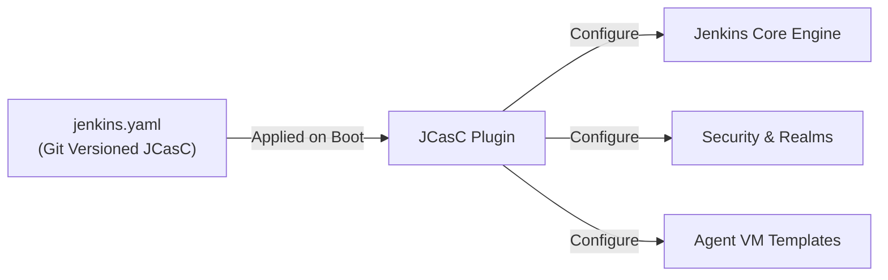
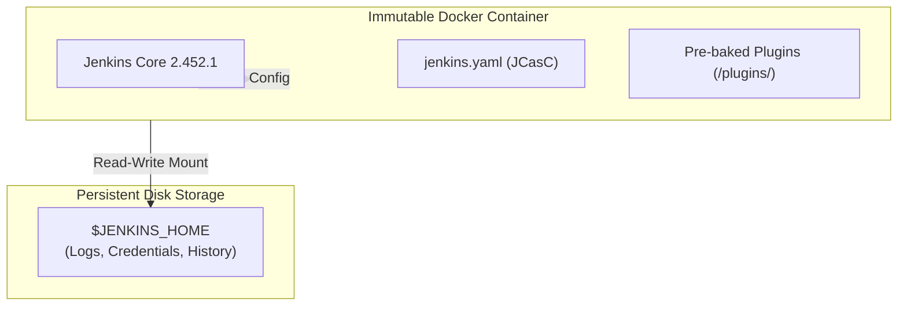

## Table of Contents

1. [The Problem](#the-problem)
2. [The Danger of Snowflake Controllers](#the-danger-of-snowflake-controllers)
3. [Jenkins Configuration as Code (JCasC)](#jenkins-configuration-as-code-jcasc)
4. [Safeguarding the Plugin Dependency Tree](#safeguarding-the-plugin-dependency-tree)
5. [Building Repeatable, Immutable Controllers with Docker](#building-repeatable-immutable-controllers-with-docker)
6. [Putting It All Together](#putting-it-all-together)
7. [What's Next](#whats-next)

## The Problem

Managing the operations and settings of a self-hosted CI/CD engine presents platform teams with severe configuration bottlenecks. When systems administrators manage Jenkins configurations and plugin versions through the standard web UI, they hit recurring operational walls:

* **The Midnight Dependency Crash**: An administrator logs into the Jenkins UI to update a single core plugin. The update silently triggers a cascade of updates across seven nested, transitive dependencies. On restart, the controller fails to load, throwing Java classpath errors and leaving the team with no way to revert the system except by manually digging into raw XML configuration files.
* **The Snowflake Backup Nightmare**: A production Jenkins controller virtual machine suffers an irreversible hardware failure. Although the raw pipeline job directories are backed up, the platform team realizes they have no written record of how the server's security realms, LDAP directory links, system environments, and cloud agent templates were configured in the web UI. Rebuilding the server takes two days of manual form-filling, causing a complete release freeze.
* **The Plugin Drift Mismatch**: A developer writes a new pipeline stage locally that leverages utility steps provided by a modern plugin. When the pipeline runs in the production controller, it immediately fails. The production server runs a slightly older version of the plugin that does not support the new syntax, and administrators are hesitant to update it due to the risk of breaking other teams' pipelines.

These crises show that both the controller's system configurations and its plugin environments must be treated as immutable, version-controlled code.

## The Danger of Snowflake Controllers

A **Snowflake Controller** is a server that has been manually configured and updated over time in a way that makes it completely unique and impossible to reproduce from scratch.

Snowflake servers are built through "point-and-click" administration. An operator logs in, navigates to `Manage Jenkins`, installs a plugin, adjusts an agent configuration, clicks `Save`, and writes the state to disk. Over months and years, this practice creates three major operational risks:

1. **Undocumented Configuration State**: The actual configuration of the server lives only in `$JENKINS_HOME` XML files. The team has no audit trail of who changed which setting, why it was changed, or when the adjustment occurred.
2. **Upgrade Hesitancy**: Because the exact classpath and plugin relationships are fragile and undocumented, the platform team becomes afraid to update the server. Jenkins remains unpatched, exposing the organization to severe security vulnerabilities.
3. **No Staging Parity**: It is impossible to run a staging replica of the controller to pre-test plugin upgrades or pipeline changes. If a change breaks the system, it breaks the production cluster directly.

To eliminate snowflakes, platform teams must treat the Jenkins controller as cattle, not a pet. The entire system must be defined declaratively in code, allowing identical controllers to be spun up instantly on demand.

## Jenkins Configuration as Code (JCasC)

**Jenkins Configuration as Code (JCasC)** is a core plugin that allows administrators to declare the entire system state of a Jenkins controller—including security, credential references, global environments, tools, and agent templates—inside a single, human-readable YAML file.

When the controller boots, the JCasC plugin reads the YAML file, parses the parameters, and programmatically applies the settings to the Jenkins core engine, completely bypassing the manual UI configuration screens.



### The Structure of a JCasC Manifest

A valid `jenkins.yaml` is organized into logical namespaces that match the standard Jenkins configuration pages:

```yaml
jenkins:
  securityRealm:
    local:
      allowsSignup: false
      users:
        - id: "admin"
          password: "${admin_password}"
  authorizationStrategy:
    projectMatrix:
      permissions:
        - "Overall/Administer:admin"
        - "Overall/Read:authenticated"
  numExecutors: 0
  nodes:
    - dumb:
        name: "linux-builder-01"
        nodeDescription: "Permanent Linux VM"
        numExecutors: 4
        remoteFS: "/home/jenkins/workspace"
        launcher:
          ssh:
            host: "10.0.12.45"
            credentialsId: "agent-ssh-key"
            port: 22

unclassified:
  location:
    adminAddress: "platform-alerts@example.com"
    url: "https://jenkins.example.com/"

security:
  queueItemAuthenticator:
    authenticators:
      - global:
          strategy: "triggeringUsersAuthorizationStrategy"
```

### Key JCasC Best Practices

* **Zero Controller Executors**: Notice `numExecutors: 0` inside the main `jenkins` namespace. JCasC guarantees that the controller itself has zero execution slots, enforcing the architectural rule that builds must run only on agents.
* **Inject Secrets Dynamically**: Plaint-text passwords must never be committed to the JCasC YAML. JCasC supports runtime variable expansion (`${admin_password}`). Secrets are securely injected at boot time using environment variables, Vault integrations, or Docker secret mounts.
* ** 프로젝트 매트릭스 보안 (Project Matrix Security)**: The `projectMatrix` block defines explicit permission scopes globally in code, preventing unauthorized users from accessing job panels or administrative menus.

## Safeguarding the Plugin Dependency Tree

The most fragile subsystem in any Jenkins installation is the **Plugin Directory**. Jenkins plugins are authored by separate community contributors, share a single shared JVM classpath, and heavily depend on transitive parent libraries.

Manually updating a plugin in the UI is highly risky because it can trigger a cascade of dependency updates that break compatibility with other plugins, leading to startup failures.

### The Version-Locked Plugins List

To safely manage plugins, platform teams completely disable the web-based Plugin Manager. Instead, they define their required plugins and locked versions inside a declarative, text-based plugins manifest file:

```text
# plugins.txt
git:5.2.1
workflow-aggregator:596.v8c21b_91e9b_ed
configuration-as-code:1775.v8108ef9a_8702
kubernetes:4254.v1d3e8e7a_03e0
ws-cleanup:0.45
slack:684.v0a_a_c95780f2d
```

Each line defines a precise plugin ID and the target version. By defining this list in text, teams can track plugin changes in Git history, audit version updates through pull requests, and enforce strict, reproducible classpaths across all controller deployments.

## Building Repeatable, Immutable Controllers with Docker

The ultimate way to enforce configuration-as-code and plugin security is by packaging the Jenkins controller as an **Immutable Docker Container**.

Instead of manually installing Java, Jenkins, and plugins on a bare VM, we build a custom Docker image that pre-bakes the correct Jenkins core version, installs the exact plugin list declared in `plugins.txt`, and copies the JCasC `jenkins.yaml` file into the system path.

### The Production Dockerfile

Let's look at a production-grade `Dockerfile` that packages an immutable, repeatable Jenkins controller:

```dockerfile
# Dockerfile
FROM jenkins/jenkins:2.452.1-lts-jdk21

# Prevent interactive prompts during plugin setup
ENV DEBIAN_FRONTEND=noninteractive

# Disable the setup wizard dynamically
ENV JAVA_OPTS="-Djenkins.install.runSetupWizard=false"

# Tell the JCasC plugin where the configuration YAML resides
ENV CASC_JENKINS_CONFIG="/usr/share/jenkins/ref/jenkins.yaml"

# Copy our declarative plugins list into the container
COPY plugins.txt /usr/share/jenkins/ref/plugins.txt

# Run the official plugin CLI to download and validate classpaths
RUN jenkins-plugin-cli --plugin-file /usr/share/jenkins/ref/plugins.txt

# Copy our declarative JCasC system configuration file
COPY jenkins.yaml /usr/share/jenkins/ref/jenkins.yaml
```

### The Architectural Deployment Pattern

When deploying this immutable image, the container filesystem is completely locked down. The platform team mounts the persistent `$JENKINS_HOME` directory to `/var/jenkins_home` on the host, but restricts it *only* to storing build logs, job histories, and secure credential keys. 

System settings and plugins are loaded entirely read-only from the immutable container image.



This separation of concerns provides three major benefits:

1. **Deterministic Boot**: The controller always boots with the exact same plugins and system settings. Manual web-based alterations to the system environment are wiped out on restart, eliminating configuration drift.
2. **Instant Rollback**: If a plugin version in `plugins.txt` introduces a regression, the platform team does not need to manually uninstall plugins. They simply revert the Git commit, rebuild the Docker image, and run the container. The system instantly reverts to the previous working state.
3. **Local Testing Parity**: Developers can run the exact same Docker image on their local laptops. This allows them to test JCasC additions, plugin updates, or library imports locally in a safe environment before promoting the change to the production server.

## Putting It All Together

Let's trace how Configuration as Code, JCasC, and immutable Docker builds completely resolve the operational risks described at the start:

* **Midnight Dependency Crashes**: Administrators never update plugins inside the live web UI. Instead, they update a version string inside the `plugins.txt` file in Git, build the image, and test the boot sequence in a local or staging container. If a dependency classpath clash occurs, it is caught immediately in test builds before touching the live production cluster.
* **Snowflake Rebuild Failures**: When a virtual machine hosting Jenkins crashes, the recovery time drops from days to seconds. Because the entire server state is defined inside the Git-managed `jenkins.yaml` and packaged in a Docker container, the platform team simply spins up the pre-baked Docker image, mounts the persistent `$JENKINS_HOME` storage containing build histories, and restores a fully operational, identical controller instantly.
* **Plugin Drifts**: The local testing parity guaranteed by immutable containers allows developers to test pipeline updates locally against the exact plugin classpaths running in production, ensuring that merged code runs smoothly without unexpected syntax mismatch failures.

## What's Next

Now that we have automated the system configurations and locked down the plugin dependency trees using immutable Docker containers, we face the final operational security gate: **Secrets Management**. While JCasC automates LDAP, clouds, and tools, our pipelines still require access to highly privileged credentials, AWS keys, database passwords, and Kubernetes configurations to execute deployments. 

Let's move to **Credentials and Security** to learn how to store secrets securely inside the encrypted Jenkins vault, safely inject them using log-redacted blocks, and secure the controller's filesystem using the Master-Agent security gateway.


*Use this as the controller-configuration checklist: avoid snowflake controllers, manage JCasC as code, lock plugin versions, build immutable images, and prove recovery with restore tests.*

---

**References**

* [Jenkins Configuration as Code (JCasC) Plugin Specification](https://www.jenkins.io/projects/jcasc/) - The official schema reference, architecture guides, and syntax structures for JCasC YAML variables.
* [Official Jenkins Docker Packaging Guide](https://github.com/jenkinsci/docker) - Standard parameters, environment overrides, and plugin install CLI structures for containerizing controllers.
* [Jenkins Plugin Installation Manager CLI](https://github.com/jenkinsci/plugin-installation-manager-tool) - Technical documentation on resolving transitive dependencies and downloading verified plugins via the command line.
* [Jenkins Security Best Practices](https://www.jenkins.io/doc/book/security/) - Official hardening recommendations for restricting controller executor slots and enforcing administrative project matrices.
