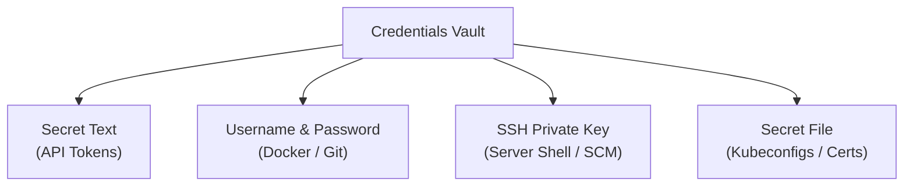
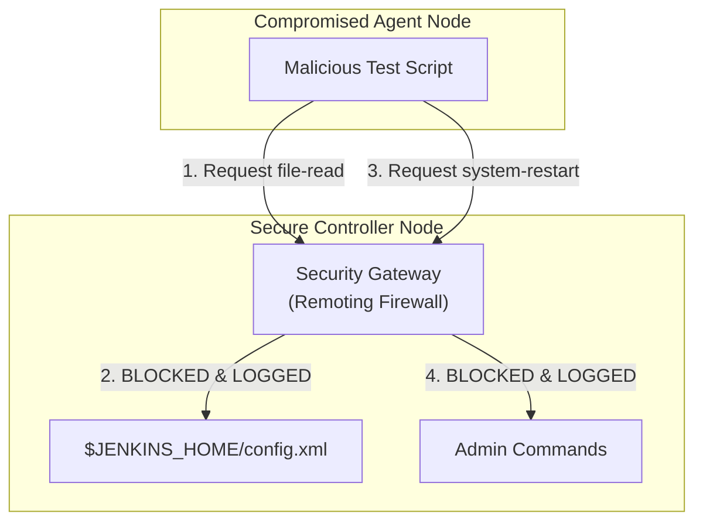

## Table of Contents

1. [The Problem](#the-problem)
2. [The Cryptographic Vault on Disk](#the-cryptographic-vault-on-disk)
3. [Secure Credentials Binding and Log Masking](#secure-credentials-binding-and-log-masking)
4. [Selecting Specific Secret Schemas](#selecting-specific-secret-schemas)
5. [The Agent-to-Controller Security Gateway](#the-agent-to-controller-security-gateway)
6. [Putting It All Together](#putting-it-all-together)

## The Problem

Operating a CI/CD server that deploys to highly privileged production clouds requires strict controls over passwords, API keys, and private network routes. When software organizations fail to establish clear credential security boundaries, they face severe operational exploits:

* **The Plaintext Log Exposure**: An engineer needs to publish a built container image to a central Docker registry. To authenticate, they write their plaintext registry username and password directly inside a pipeline shell execution step (`docker login -u user -p mysecretpassword`). The pipeline executes, and Jenkins automatically prints the active shell commands to the web UI console logs. The password becomes visible to the entire organization, forcing the security team to revoke credentials immediately.
* **The Master Filesystem Intrusion**: A virtual machine acting as a Jenkins build agent is compromised by a malicious dependency or an open network port. The attacker gains root shell access to the agent node and executes a script that attempts to read `$JENKINS_HOME/config.xml` directly from the primary controller over the network. Because the network gateway between the master and agent is unrestricted, the agent successfully steals global cryptographic keys and administrative passwords, compromising the entire company infrastructure.
* **The Composed Credentials Leaks**: An administrator attempts to pass an SSH private key to a git clone step using simple environment variables. The key is written to a temporary environment file on the agent host's disk. Because workspace directories persist on shared agents, subsequent pipelines running on the same machine can read the exposed temporary file, leading to cross-project credential theft.

These scenarios illustrate that credentials must be encrypted at rest, masked during execution, and strictly isolated from the execution agent nodes.

## The Cryptographic Vault on Disk

Jenkins incorporates a secure, internal **Credentials Vault** to store database passwords, API tokens, SSH keys, and file certificates. Rather than keeping credentials in plaintext files or local environment variables, all secrets are registered globally or within specific folder namespaces inside the controller's vault.

### Encryption at Rest

When an administrator registers a new credential, the controller encrypts the secret value before writing it to the XML configurations on disk. Jenkins secures this data using a two-key AES (Advanced Encryption Standard) encryption system located within the `$JENKINS_HOME/secrets/` directory:

1. `secrets/master.key`: A master cryptographic key generated dynamically on the very first boot of the controller. This key is used exclusively to encrypt and protect the primary data key.
2. `secrets/hudson.util.Secret`: The primary data key. This key is stored encrypted on disk by the `master.key`. When Jenkins needs to write a credential to `$JENKINS_HOME/credentials.xml`, it uses this data key to encrypt the secret string.

Because the data key is protected by the `master.key`, an intruder who gains raw read access to the server's XML configuration files cannot decrypt the credentials. They would need access to both keys inside the secure `/secrets/` filesystem directory to decrypt the vault.

```text
secrets/master.key  ──(Decrypts)──>  secrets/hudson.util.Secret  ──(Decrypts)──>  credentials.xml (Plaintext Secret)
```

It is a critical system administration rule that the `/secrets/` directory must be protected with strict Linux filesystem permissions (`chmod 700`) and must never be backed up or committed to the same repository as the system's Configuration as Code (JCasC) YAML files.

## Secure Credentials Binding and Log Masking

Storing secrets securely at rest is only half the battle. When a pipeline runs, the agent must use those secrets to authenticate against registries, databases, and cloud providers. The pipeline must inject the secret into the build steps without exposing it in console logs or environment dumps.

The Credentials Binding plugin solves this problem. It provides the `withCredentials` step wrapper, which binds vault secrets to temporary, local environment variables that exist *only* for the duration of that specific step block.

### Groovy withCredentials Syntax

Let's look at the correct, secure way to inject a username and password to authenticate against a Docker registry:

```groovy
stage('Publish Image') {
    steps {
        withCredentials([usernamePassword(
            credentialsId: 'docker-hub-production',
            usernameVariable: 'REGISTRY_USER',
            passwordVariable: 'REGISTRY_PASSWORD'
        )]) {
            sh '''
                echo "Authenticating as: ${REGISTRY_USER}"
                echo "${REGISTRY_PASSWORD}" | docker login -u "${REGISTRY_USER}" --password-stdin
            '''
        }
    }
}
```

### The Log-Masking Mechanism

When a secret is loaded inside the `withCredentials` block, the Jenkins controller automatically registers the raw secret string with its internal **Console Log Masker**. 

If a step accidentally prints `${REGISTRY_PASSWORD}` to stdout, or if a command fails and dumps the executing command line, the log masker scans the stream and replaces every occurrence of the secret with a secure redacted marker (`****` or `*`). 

### Key Security Caveats

* **Avoid Global Scopes**: Secrets must never be bound globally at the pipeline root level. Binding a secret globally makes it visible to *every* stage, including third-party test suites or npm test commands that could exfiltrate env vars to external servers.
* **Do Not Use Echo on Bound Variables**: Although the log masker is highly robust, developers must never write commands that attempt to manipulate or print the secret string (such as `sh "echo ${SECRET} | base64"`). Creative encodings can bypass the literal log masker, causing leaks.
* **Use password-stdin**: Always pass passwords over standard input (`--password-stdin`) rather than CLI arguments (`-p ${PASSWORD}`). CLI arguments are visible in the operating system's process table (`ps aux`) to other users running on the shared agent machine.

## Selecting Specific Secret Schemas

Jenkins enforces typed schemas for different credential kinds to ensure that secrets are structured to match their target communication protocols.



### 1. Secret Text

Used for simple, one-line string secrets such as Slack webhooks, AWS secret keys, or GitHub Personal Access Tokens (PATs).

* **Binding Syntax**:
  ```groovy
  withCredentials([string(credentialsId: 'slack-webhook-token', variable: 'SLACK_TOKEN')]) {
      sh 'curl -X POST -H "Authorization: Bearer ${SLACK_TOKEN}" https://slack.com/api/chat.postMessage'
  }
  ```

### 2. Username and Password

Used for services that require dual-field credentials, such as container registries, database connections, or basic Git authentication.

* **Binding Syntax**: Exposes separate variables for the username and password, as illustrated in the ECR/Docker Hub example in the previous section.

### 3. SSH Private Key

Used to authenticate shell connections to external bare-metal servers or secure SCM (Source Control Management) repositories.

* **Binding Syntax**:
  ```groovy
  withCredentials([sshUserPrivateKey(
      credentialsId: 'production-ssh-key',
      keyFileVariable: 'KEY_PATH',
      usernameVariable: 'SSH_USER'
  )]) {
      sh 'ssh -i "${KEY_PATH}" -l "${SSH_USER}" 10.0.4.12 "systemctl restart orders"'
  }
  ```

Jenkins writes the private key to a temporary, read-only file on the agent's filesystem and binds the path to `KEY_PATH`, automatically deleting the temporary file when the block exits.

### 4. Secret File

Used for entire configuration payloads, such as Kubernetes `kubeconfig` files, GPG signing certificates, or SSL client keys.

* **Binding Syntax**:
  ```groovy
  withCredentials([file(credentialsId: 'k8s-kubeconfig-staging', variable: 'KUBECONFIG')]) {
      sh 'kubectl get pods -n staging'
  }
  ```

Similar to the SSH private key, Jenkins securely mounts the file inside the agent workspace and deletes it immediately when the step finishes, preventing other jobs on the same agent from accessing the file.

## The Agent-to-Controller Security Gateway

In a distributed Jenkins architecture, the controller is the brain, while agents are the muscles. Agents are disposable executors that run untrusted developer code. This split introduces a severe threat vector: if a build agent is compromised (e.g., an attacker exploits a CVE in a running dependency), the compromised agent could try to attack the controller node.

Historically, agents could request the controller to execute arbitrary Java methods or read files from `$JENKINS_HOME` over the JNLP remoting protocol, allowing a single compromised agent to seize administrative control of the entire Jenkins installation.

The **Agent-to-Controller Security Gateway** solves this problem by enforcing a strict command and file-read firewall at the JNLP remoting layer on the controller.



### Enforced Restrictions

When the security gateway is enabled (which is the default in all modern Jenkins versions), the controller rejects the following requests from agents:

* **File-Read Block**: Agents are strictly blocked from reading files outside their assigned workspace directory. An agent cannot request the controller to send it the contents of `$JENKINS_HOME/config.xml` or `/etc/passwd` on the master.
* **System Commands Block**: Agents cannot request the controller to execute arbitrary system-level commands or Java reflection methods on the controller's JVM.
* **Whitelisted Commands Only**: Only a narrow list of safe, pre-approved orchestration commands are allowed to flow over the network socket.

### Hardening Best Practices

To secure a self-hosted Jenkins cluster, platform teams must implement a four-layer security checklist:

1. **Enforce Agent-to-Controller Security**: Verify that `Enable Agent -> Controller Security` is checked in the controller's Global Security panel.
2. **Restrict Directory Access**: Set absolute workspace paths on the agents (e.g. `/home/jenkins/workspace/`) and configure the agent system user with minimal OS privileges to block shell escapes to the host node.
3. **Use Ephemeral Containers**: The most robust way to secure agents is by running them inside ephemeral Docker containers or Kubernetes Pods. If a container is compromised, the attacker is locked inside a temporary container namespace that is destroyed minutes later, preventing persistent lateral movement.
4. **Isolate Master and Agent Networks**: Place the controller inside a highly secured private network subnet. Agents should reside in separate subnets, communicating with the controller exclusively over a one-way inbound HTTPS WebSocket port (443), with all other ports closed.

## Putting It All Together

By combining the cryptographic credentials vault, log-redacted binding blocks, typed secret schemas, and the master-agent security gateway, we build a highly secured self-hosted CI/CD engine:

* **Plaintext Log Leaks**: Registering registry tokens inside the secure vault and injecting them via `withCredentials` username-password bindings guarantees that secrets are masked dynamically during pipeline execution. Even if a script dumps its environment, the console output prints a harmless redacted marker (`****`).
* **Compromised Agent Intrusions**: The Agent-to-Controller Security Gateway blocks compromised agents from requesting arbitrary Java execution or accessing the controller's `$JENKINS_HOME` directory. The master's configurations, plugin classpaths, and vault keys remain fully protected.
* **Cross-Project Secret Leaks**: Utilizing typed SSH keys and Secret File bindings ensures that large credentials payloads are written only to temporary, read-only files that are forcefully wiped from the agent's workspace the moment the step exits, preventing subsequent builds from stealing credentials.

---

**References**

* [Jenkins Documentation: Handling Credentials](https://www.jenkins.io/doc/book/pipeline/jenkinsfile/#handling-credentials) - Official guide on credentials vault, credentials bindings, and username/password injections.
* [Jenkins Security: Agent-to-Controller Security Gateway](https://www.jenkins.io/doc/book/security/controller-isolation/) - Architectural specification of the remoting firewall, command whitelists, and master-agent security boundaries.
* [Credentials Binding Plugin Specification](https://plugins.jenkins.io/credentials-binding/) - Technical reference guide for using `withCredentials`, file, and private key bindings inside Groovy pipelines.
* [OWASP Jenkins Hardening Cheat Sheet](https://cheatsheetseries.owasp.org/cheatsheets/Jenkins_Hardening_Cheat_Sheet.html) - Security guidelines for securing JCasC configurations, managing permissions, and isolating JVM classpaths.
