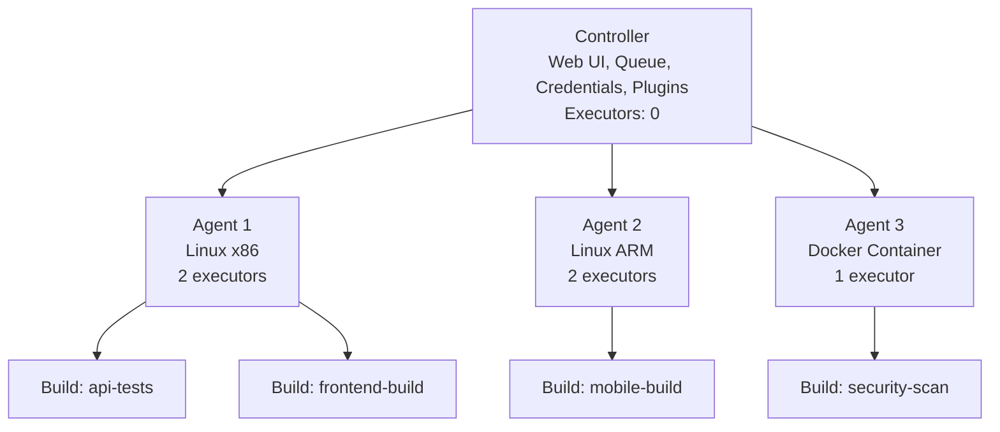

## Table of Contents

1. [The Self-Hosted CI/CD Model](#the-self-hosted-cicd-model)
2. [Controller and Agent Architecture](#controller-and-agent-architecture)
3. [How Agents Connect](#how-agents-connect)
4. [Labels and Agent Selection](#labels-and-agent-selection)
5. [JVM Tuning for the Controller](#jvm-tuning-for-the-controller)
6. [Failure Modes](#failure-modes)
7. [The Self-Hosted Tradeoff](#the-self-hosted-tradeoff)

## The Self-Hosted CI/CD Model

In 2004, a software engineer at Sun Microsystems named Kohsuke Kawaguchi got tired of breaking builds. He was working on a large Java project, and every time he committed code, he had to wait for the entire team's integration process to reveal whether his changes worked. So he built a small automation server called Hudson that would watch the repository for changes, pull new code, run the tests, and report the results.

Hudson was open-sourced and quickly became the most popular CI server in the Java ecosystem. In 2010, Oracle acquired Sun Microsystems and attempted to take control of the Hudson trademark. The community voted in January 2011 to fork the project and rename it to Jenkins. Oracle continued Hudson for a few more years before donating it to the Eclipse Foundation in 2013, where it was eventually declared obsolete in 2017. Jenkins, backed by the original community and nearly all the active contributors, became the dominant CI/CD server in the industry.

Today, Jenkins is a self-hosted automation server written in Java. "Self-hosted" is the defining characteristic. Unlike GitHub Actions, where GitHub provides the infrastructure and you write YAML files, Jenkins is a server process that you install, configure, secure, update, and operate on machines that you control. It runs on the Java Virtual Machine (JVM), which means it works on Linux, macOS, and Windows. The current LTS release is Jenkins 2.555.1, and it requires Java 21 or newer.

If you have already read the GitHub Actions module, think of Jenkins as the other end of the spectrum. GitHub Actions is a fully managed service: you never see the runner until your workflow starts, and the runner is destroyed after it finishes. Jenkins is the opposite: you see everything. You own the server. You manage the disk. You decide how much memory the process gets. This control is both the main advantage and the main burden of running Jenkins.


## Controller and Agent Architecture

Think of Jenkins like a small workshop. The controller is the person at the front desk who knows which jobs are waiting, which workers are free, and where the keys are stored. The agents are workers in separate rooms who actually run `npm test`, build Docker images, or deploy to staging. An executor is one desk in one room: one build can sit at that desk at a time.

That mental model matters because you do not want the front desk person also lifting boxes all day. If the controller runs builds, the whole workshop slows down, and eventually crashes.

In concrete terms:

The **controller** is the main Jenkins server process. It runs the web UI, manages the job queue, stores credentials, loads plugins, and coordinates the entire system. It does not need to execute any builds. In a properly configured Jenkins installation, the controller's number of executors is set to 0.

An **agent** is a separate machine (physical, virtual, or a container) that connects to the controller and waits for work. When the controller decides to run a build, it sends the instructions to an available agent. The agent executes the build steps (shell commands, Docker builds, test suites) and streams the console output back to the controller for display in the web UI.

An **executor** is a slot on an agent. If an agent has 2 executors, it can run 2 builds simultaneously. If you have 5 agents with 2 executors each, your Jenkins cluster can run 10 builds in parallel.



The controller never touches the build artifacts directly. It tells Agent 1: "Run the `api-tests` job." Agent 1 checks out the code from Git, runs `npm ci && npm test`, and streams the log lines back to the controller. If Agent 1 crashes, the controller marks the build as failed and can reschedule it to another agent. If the controller crashes, all agents lose their coordinator, but the controller's data (job configs, build history, credentials) is safe on disk in the `$JENKINS_HOME` directory.

### What Lives in $JENKINS_HOME

The `$JENKINS_HOME` directory (usually `/var/lib/jenkins` on Linux) is the most important path on the controller. It contains everything Jenkins knows about itself:

- `config.xml`: the global Jenkins configuration (security realm, authorization strategy, number of executors).
- `jobs/`: one subdirectory per job, each containing the job's `config.xml` and the `builds/` directory with build logs and artifacts.
- `plugins/`: every installed plugin `.jpi` file and its expanded directory.
- `secrets/`: encryption keys used to protect credentials at rest.
- `nodes/`: configuration for each registered agent.
- `users/`: per-user settings and API tokens.

If you lose `$JENKINS_HOME`, you lose the entire Jenkins installation: every job definition, every credential, every build log. Backing up this directory (or, better, managing it with Configuration as Code, which we cover in a later article) is one of the most important operational practices for any Jenkins team.

### Workspaces on Agents

When the controller dispatches a build to an agent, the agent creates a workspace directory for that build. The workspace is where the source code gets checked out and where the build runs. By default, the workspace path on the agent is `<agent_root>/workspace/<job_name>/`.

Workspaces are not cleaned up automatically between builds by default. If you run the same job twice on the same agent, the second run reuses the same workspace directory. This can speed up builds (because cached dependencies like `node_modules` persist), but it can also cause subtle bugs if leftover files from a previous build interfere with the current one.

You can force a clean workspace by adding a `cleanWs()` step to your pipeline, or by configuring the job to wipe the workspace before each build. Docker agents sidestep this problem entirely because every build gets a fresh container with no leftover state.

## How Agents Connect

There are three ways an agent can connect to a controller. The right choice depends on your network topology and security requirements.

### SSH Agents (Controller Initiates)

The controller acts as an SSH client. It connects to the agent machine over SSH (port 22), uploads the agent runtime (`remoting.jar`), and starts the agent process. This is the most traditional approach and works well when the controller can reach the agent directly over the network.

You configure an SSH agent in the Jenkins UI by providing the agent's hostname or IP address, SSH credentials (usually an SSH key stored in the Jenkins credential store), and the path to the Java binary on the agent.

The downside is that the controller must be able to open an outbound SSH connection to the agent. If the agent is in a private subnet or behind a NAT, the controller cannot reach it.

The SSH approach also requires that the agent machine has Java installed (since the agent runtime is a Java process). The controller will verify the Java version on the agent when it first connects. If the agent's Java version is incompatible with the controller's remoting protocol, the connection will fail with a version mismatch error.

### Inbound Agents (Agent Initiates)

Inbound agents flip the connection direction. The agent starts a process that connects outward to the controller. This is the approach you use when the agent is behind a firewall or in a cloud VPC where the controller cannot initiate connections into the private network.

The traditional inbound mechanism uses a dedicated TCP port on the controller (often port 50000). The agent downloads `agent.jar` from the controller's web UI and runs:

```bash
$ java -jar agent.jar -url https://jenkins.example.com -secret <token> -name agent-01
```

The agent opens a persistent TCP connection to the controller and waits for build instructions.

The modern alternative is WebSocket mode. Instead of requiring a separate TCP port, the agent connects over the same HTTP/HTTPS port that serves the Jenkins web UI. The connection upgrades to a WebSocket, and all communication flows through it. This is significantly easier to configure when Jenkins is behind a reverse proxy or load balancer, because you do not need to expose an extra port. You enable WebSocket by adding the `-webSocket` flag:

```bash
$ java -jar agent.jar -url https://jenkins.example.com -secret <token> -name agent-01 -webSocket
```

### Docker Agents (Ephemeral Containers)

If your Jenkins controller runs on a host with Docker installed (or connects to a Kubernetes cluster), you can configure agents that are Docker containers. When a build starts, Jenkins spins up a fresh container from a specified image, runs the build inside it, and destroys the container when the build finishes. This gives you complete isolation between builds: each build starts with a clean filesystem, and nothing from one build can leak into the next.

This is conceptually similar to GitHub Actions' hosted runners, where every workflow gets a fresh virtual machine that is destroyed after the run.

You configure Docker agents in a Jenkinsfile using the `docker` agent type instead of `label`:

```groovy
pipeline {
    agent {
        docker {
            image 'node:22-slim'
            args '-v /tmp:/tmp'
        }
    }
    stages {
        stage('Test') {
            steps {
                sh 'npm ci && npm test'
            }
        }
    }
}
```

This requires the Docker Pipeline plugin on the controller and Docker installed on the agent (or the controller itself if agents are not configured). Jenkins pulls the `node:22-slim` image, starts a container, mounts the workspace inside it, runs the pipeline steps, and destroys the container when the pipeline finishes.

| Feature | SSH Agent | Inbound (TCP) | Inbound (WebSocket) | Docker Agent |
| :--- | :--- | :--- | :--- | :--- |
| **Who initiates** | Controller | Agent | Agent | Controller (via Docker API) |
| **Transport** | SSH (port 22) | Raw TCP (port 50000) | WebSocket over HTTPS | Docker socket/API |
| **Firewall needs** | Agent accepts incoming SSH | Controller exposes TCP port | Only standard HTTPS | Docker host or K8s access |
| **Persistence** | Permanent (always running) | Permanent or on-demand | Permanent or on-demand | Ephemeral (per-build) |
| **Best for** | Internal Linux servers | Agents behind NAT/firewall | Cloud/K8s with proxies | Full build isolation |

## Labels and Agent Selection

In any non-trivial Jenkins setup, your agents are not identical. One agent has Docker installed for building container images. Another has GPU drivers for machine learning workloads. A third runs Windows for building .NET applications.

Labels solve the routing problem. A label is a tag you attach to an agent in the Jenkins UI. For example, you might label your Linux Docker agents as `linux-docker`, your GPU machines as `gpu`, and your Windows agents as `windows-dotnet`.

In your Jenkinsfile, you tell Jenkins which kind of agent your pipeline needs:

```groovy
pipeline {
    agent { label 'linux-docker' }
    stages {
        stage('Build Image') {
            steps {
                sh 'docker build -t myapp:latest .'
            }
        }
    }
}
```

When this pipeline runs, the controller looks at the queue, finds all agents with the `linux-docker` label, picks one that has a free executor, and dispatches the build. If no matching agent is available, the build waits in the queue until one becomes free.

You can also assign different agents to different stages within the same pipeline:

```groovy
pipeline {
    agent none
    stages {
        stage('Test') {
            agent { label 'linux' }
            steps {
                sh 'npm test'
            }
        }
        stage('Build Image') {
            agent { label 'linux-docker' }
            steps {
                sh 'docker build -t myapp:latest .'
            }
        }
    }
}
```

Using `agent none` at the pipeline level means "do not allocate an agent for the entire pipeline." Instead, each stage declares its own agent. This is useful when different stages have different infrastructure requirements, but it comes with a cost: the workspace (the directory containing your checked-out code) does not automatically carry over between stages. You need to use `stash` and `unstash` to move files between agents, or check out the code again in each stage.

## JVM Tuning for the Controller

Jenkins runs on the Java Virtual Machine, which means the controller process has a fixed amount of memory allocated to it at startup. This allocation is called the heap, and if the heap is too small for the controller's workload, the JVM throws `OutOfMemoryError` and the process crashes.

On most Linux installations, the Jenkins systemd service reads its JVM options from `/etc/default/jenkins` (Debian/Ubuntu) or `/etc/sysconfig/jenkins` (RHEL/CentOS). The key setting is `JAVA_OPTS`:

```bash
JAVA_OPTS="-Xmx2g -Xms1g -XX:+UseG1GC"
```

`-Xmx2g` sets the maximum heap size to 2 GB. `-Xms1g` sets the initial heap to 1 GB so the JVM does not have to grow the heap repeatedly during startup. `-XX:+UseG1GC` selects the G1 garbage collector, which handles large heaps with lower pause times than the default collector.

For a small team (under 50 jobs, under 10 agents), 2 GB of heap is usually enough for the controller when it is not running builds. For a medium-sized installation (50 to 200 jobs), 4 to 8 GB is typical. For large enterprises, 16 GB or more is common, though at that scale you should also consider running multiple controllers instead of scaling one vertically.

The critical rule is: tuning the heap does not fix the problem if the controller is running builds. Even with 16 GB of heap, a controller that executes 50 concurrent `docker build` processes will eventually run out of memory. JVM tuning is for the controller's own overhead (plugins, job metadata, queue management, web UI sessions). Build execution belongs on agents.

To set the controller's executor count to zero, navigate to Manage Jenkins > Nodes and Clouds > Built-In Node > Configure, and set "Number of executors" to 0. This is the single most important configuration change you can make to a new Jenkins installation.

### Diagnosing Memory Pressure

Before the controller reaches a full `OutOfMemoryError`, you will usually see warning signs. The Jenkins web UI becomes slow to respond. Page loads that normally take 200ms start taking 5 to 10 seconds. The system log shows frequent garbage collection pauses.

You can monitor the JVM heap directly from the Jenkins UI by navigating to Manage Jenkins > System Information. The "Memory Usage" section shows the current heap consumption. If the used heap is consistently above 85% of the maximum, the controller is under memory pressure.

For more detailed monitoring, enable GC logging by adding this to `JAVA_OPTS`:

```bash
JAVA_OPTS="-Xmx4g -Xms2g -XX:+UseG1GC -Xlog:gc*:file=/var/log/jenkins/gc.log:time,uptime,level,tags:filecount=5,filesize=10m"
```

This writes garbage collection events to `/var/log/jenkins/gc.log` with rotation (5 files, 10 MB each). If you see GC pauses exceeding 500ms or full GC events happening more than once per minute, the heap is too small for the workload.

The Jenkins Monitoring plugin (based on JavaMelody) provides a web dashboard with heap usage graphs, thread counts, and HTTP request timings. Installing it on a production controller gives you visibility into resource consumption without needing to SSH into the server.

## Failure Modes

### Controller Running Builds (The OOM Crash)

This is the spine scenario. The symptoms are a frozen web UI, SSH access to the server showing high memory usage, and the log file containing `java.lang.OutOfMemoryError: Java heap space`. The fix is to set the controller's executors to 0 and add dedicated agents.

If you are in this situation and cannot add agents immediately, a temporary fix is to increase the heap size with `-Xmx`. But this only buys time. The real solution is architectural.

### Agent Goes Offline Mid-Build

An agent can disconnect from the controller for many reasons: network instability, the agent machine rebooting, the agent process crashing, or the SSH session timing out. When this happens, any build running on that agent fails with:

```text
ERROR: hudson.remoting.RequestAbortedException: java.io.IOException: 
  Unexpected termination of the channel
```

The build is marked as failed in the Jenkins UI, and the agent node shows "Offline" with a red X. If the agent was configured as a permanent SSH agent, the controller will periodically attempt to reconnect. If it was an inbound agent, the agent process needs to be restarted manually or by a process manager like systemd.

To protect against this, configure health monitoring on your agents. Jenkins has a built-in "Node Monitoring" feature (Manage Jenkins > Nodes and Clouds) that checks disk space, free memory, and clock synchronization on each agent. If any of these fall below the configured thresholds, Jenkins takes the agent offline proactively rather than letting a build fail halfway through.

### Executor Starvation

If your team has 20 jobs that trigger on every push, and you only have 4 executors total across all agents, builds pile up in the queue. Developers push code and wait 30 minutes before their build even starts. The Jenkins dashboard shows a long queue of pending builds under Build Queue on the left sidebar.

The fix is either adding more agents (horizontal scaling) or adding more executors to existing agents (if the agent hardware can handle the extra concurrency). A rough guideline from the Jenkins community is: number of executors equals the number of jobs multiplied by 0.03. So 200 jobs would need approximately 6 executors. This is a starting point, not a hard rule. Monitor your queue depth and average wait time, and adjust accordingly.

### Security: Untrusted Builds on Shared Agents

If multiple teams share the same Jenkins agents, a build from one team can potentially read files left behind in the workspace by another team's build. Worse, if an agent has Docker installed, a malicious or misconfigured build could mount the host filesystem through a Docker bind mount and access secrets outside the workspace.

The safest approach is to use ephemeral Docker or Kubernetes agents so that each build runs in an isolated container that is destroyed after the build finishes. If you must use permanent agents, restrict Docker socket access and ensure workspaces are cleaned between jobs.

This is the same class of problem that GitHub Actions solves by provisioning a fresh virtual machine for every workflow run. In Jenkins, you have to solve it yourself.

### Mastering the Build Queue

The build queue is the brain of the Jenkins controller's orchestration. Every time a job is triggered—whether by a Git push, a timer, or a manual click—it enters the queue. The controller then scans all available agents to find one with an executor that matches the job's required labels.

If no executor is free, the job waits. You can see these waiting jobs in the "Build Queue" sidebar. Clicking on a waiting job reveals why it is stuck. Common reasons include:
- "All nodes of label 'docker' are offline"
- "Waiting for next available executor on 'agent-01'"
- "Build #42 is already in progress" (if the job is configured to not run concurrent builds)

Monitoring the "Build Queue" is the primary way to determine if you need to scale your infrastructure. If your queue is consistently deep during core working hours, it is time to add more agents or increase executor counts on existing ones.

## The Self-Hosted Tradeoff

If you have used GitHub Actions, you might wonder why anyone would choose to operate their own CI server. The answer comes down to control, cost structure, and organizational constraints.

| Factor | GitHub Actions (Managed) | Jenkins (Self-Hosted) |
| :--- | :--- | :--- |
| **Infrastructure** | GitHub provides and manages runners. | You provision, patch, and maintain servers. |
| **Cost model** | Per-minute billing for hosted runners. Free tier for public repos. | No per-minute cost. You pay for the server hardware (EC2, bare metal, etc.). |
| **Build minutes** | Limited by plan (2,000 to unlimited depending on tier). | Unlimited. Constrained only by your hardware. |
| **Network access** | Runners are on GitHub's network. Reaching private VPCs requires self-hosted runners. | Agents can run anywhere: on-premise, air-gapped networks, private data centers. |
| **Customization** | Limited to what the runner image provides (can add steps, but the base is fixed). | Full control over the OS, installed tools, kernel modules, GPU drivers, and JVM settings. |
| **Security model** | GitHub manages runner security. You trust GitHub with your code and secrets. | You manage all security: patching, firewalling, credential encryption, plugin updates. |
| **Plugin ecosystem** | GitHub Marketplace actions (curated, versioned). | 1,800+ plugins (some maintained, some abandoned, dependency conflicts possible). |
| **Compliance** | Depends on GitHub's certifications (SOC 2, etc.). | You control the audit trail, data residency, and can operate in air-gapped environments. |
| **Setup time** | Minutes (write a YAML file). | Hours to days (install Java, install Jenkins, configure agents, secure the controller). |

For a startup with a small team and public repositories, GitHub Actions is almost always the right choice. The managed infrastructure eliminates operational overhead, and the free tier is generous.

For a large enterprise with private data centers, strict compliance requirements, or air-gapped networks that cannot reach the public internet, Jenkins (or a similar self-hosted server) may be the only option. The cost of operating Jenkins is justified by the control it provides over the build environment.

Many organizations use both. GitHub Actions handles the standard CI pipelines (test, lint, build) while Jenkins handles specialized workloads that require specific hardware, network access, or regulatory compliance.

---

**References**
- [Jenkins Docs: Managing Nodes](https://www.jenkins.io/doc/book/managing/nodes/) - How to add, configure, and monitor agents in the Jenkins UI.
- [Jenkins Docs: Using Agents](https://www.jenkins.io/doc/book/using/using-agents/) - The official guide to distributed builds, including SSH and inbound agent setup.
- [Jenkins Docs: Hardware Recommendations](https://www.jenkins.io/doc/book/scaling/hardware-recommendations/) - Sizing guidelines for controllers and agents at different scales.
- [Jenkins Docs: System Requirements](https://www.jenkins.io/doc/book/installing/initial-settings/) - Java version requirements, supported platforms, and initial configuration.
- [Jenkins History: About Jenkins](https://www.jenkins.io/doc/book/getting-started/) - Background on the project, including the Hudson origin story and community governance.
