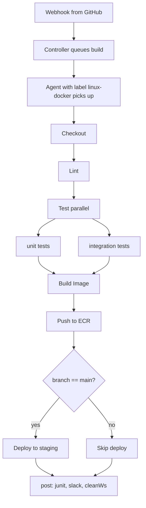

## Table of Contents

1. [Why a Jenkinsfile Exists](#why-a-jenkinsfile-exists)
2. [The Naive Single-Stage Build](#the-naive-single-stage-build)
3. [Anatomy of a Declarative Pipeline](#anatomy-of-a-declarative-pipeline)
4. [Refactoring Into Real Stages](#refactoring-into-real-stages)
5. [Parallel Branches, Post Conditions, and Options](#parallel-branches-post-conditions-and-options)
6. [Parameters, Environment, and `when` Gating](#parameters-environment-and-when-gating)
7. [Multibranch Pipelines: Branches and Pull Requests](#multibranch-pipelines-branches-and-pull-requests)
8. [Linting the Jenkinsfile in CI](#linting-the-jenkinsfile-in-ci)
9. [Failure Modes](#failure-modes)
10. [Declarative vs Scripted: The Tradeoff](#declarative-vs-scripted-the-tradeoff)

## Why a Jenkinsfile Exists

In the early years of Jenkins, jobs were configured entirely through the web UI. You logged in, clicked "New Item," picked a job type, filled out a tabbed form with shell commands, post-build actions, and SCM polling settings, and clicked Save. Jenkins wrote the result into a `config.xml` file inside `$JENKINS_HOME/jobs/<name>/`. That worked until you had fifty jobs that all needed the same change. There was no diff, no review, no rollback. Two engineers editing the same job at the same time would silently overwrite each other.

In 2016, the Jenkins project shipped Pipeline as a first-class plugin. The idea was simple: take everything that lived in those clickable forms and move it into a single text file in your repository called a `Jenkinsfile`. The controller reads the file at build time, and the file is committed alongside the code it builds. Suddenly your CI configuration goes through pull requests, lives in `git log`, and reverts cleanly when something breaks.

A Jenkinsfile is essentially a contract between your repo and your Jenkins controller. The repo says "this is how I want to be tested, built, and deployed." The controller reads the file, picks an agent (covered in the previous article), and walks through the stages one at a time. Pipeline jobs in the UI now point to a Jenkinsfile path in the repo instead of holding the build logic themselves.

There are two flavors of pipeline syntax. **Declarative** is the structured, opinionated form with a fixed grammar (`pipeline { agent { ... } stages { ... } }`). **Scripted** is raw Groovy with a few helper functions (`node('linux') { stage('build') { sh '...' } }`). Declarative is the default recommendation for new projects, and the rest of this article focuses on it. Scripted comes back at the end as the escape hatch when you need full programming-language power.

## The Naive Single-Stage Build

To make this concrete, follow a small Node.js TypeScript service called `devpolaris-orders` through three versions of its Jenkinsfile. The team's first attempt was the version that anyone with a working local build can write in five minutes:

```groovy
pipeline {
    agent { label 'linux-docker' }
    stages {
        stage('Everything') {
            steps {
                sh 'npm ci'
                sh 'npm run lint'
                sh 'npm test'
                sh 'docker build -t devpolaris-orders:${BUILD_NUMBER} .'
                sh 'docker push 123.dkr.ecr.us-east-1.amazonaws.com/devpolaris-orders:${BUILD_NUMBER}'
                sh 'kubectl set image deploy/devpolaris-orders orders=devpolaris-orders:${BUILD_NUMBER} -n staging'
            }
        }
    }
}
```

This file does the right work. It also makes Jenkins almost useless as a feedback tool. Open the build in the UI and you see a single pill labelled "Everything" that is either green or red. When the deploy fails, the Stage View does not tell you whether tests passed or whether the image was pushed. You have to scroll the raw console log to find the line where the failure happened.

The cost of one giant stage shows up in five places. **Stage View signal** collapses to one bit: pass or fail. **Restart from stage** is unavailable, because there is only one stage; if `kubectl set image` fails because the cluster credential expired, you re-run the entire pipeline including the 90-second image build. **Parallelism** is impossible; the linter and the test runner have to run sequentially even though they touch different files. **Per-step timeouts** cannot be set; if `kubectl` hangs for 6 hours waiting for a stuck pod, the build hangs for 6 hours. **Notifications** become hard to scope; "the build failed" is the only signal you can wire to Slack.

The fix is structural, not stylistic. Each thing that can succeed or fail independently deserves its own stage.

## Anatomy of a Declarative Pipeline

Before refactoring, look at the building blocks Declarative gives you. Think of a Declarative Jenkinsfile like a small recipe with a fixed set of section headings. You always start with `pipeline { ... }` and inside it you can use a known list of blocks:

- `agent` says where the work runs (a label, a Docker image, or `none` for stage-level agents).
- `stages` is the ordered list of `stage` blocks the pipeline walks through.
- Inside each `stage`, `steps` lists the actual commands (`sh`, `bat`, `archiveArtifacts`, `junit`, etc.).
- `environment` declares variables visible to all steps in the pipeline or stage.
- `parameters` declares inputs the user can set when triggering a build.
- `options` configures pipeline-wide knobs (timeouts, retry, build retention, concurrency).
- `triggers` lists how the pipeline kicks off automatically (cron, SCM polling, GitHub webhooks).
- `post` runs cleanup or notification logic at the end of a pipeline or stage, branching on outcome.

This grammar is enforced. If you write `agnt` or put a `post` block where a `stages` block belongs, Jenkins refuses the file before any agent picks it up. That refusal is the point: Declarative trades flexibility for a contract that the controller can validate.

The controller-side flow looks like this. The pipeline's `agent` block reserves an executor on a matching agent (see the agents article for how labels select machines). Each `stage` runs in order, with its `steps` executed sequentially on that agent. After the last stage (or after a failure), `post` runs. The build's pass/fail status is determined by whether any stage failed.



That diagram is what the team is aiming for. The current Jenkinsfile is one box where every step is fused. The next two sections walk through breaking it apart.

## Refactoring Into Real Stages

The first refactor splits `devpolaris-orders` into the six stages the team actually cares about: checkout, lint, test, build image, push, deploy. Each one becomes a real `stage`, and each acquires its own pill in the Stage View.

```groovy
pipeline {
    agent { label 'linux-docker' }

    stages {
        stage('Checkout') {
            steps {
                checkout scm
            }
        }
        stage('Lint') {
            steps {
                sh 'npm ci'
                sh 'npm run lint'
            }
        }
        stage('Test') {
            steps {
                sh 'npm test -- --reporter=junit --reporter-option output=test-results.xml'
            }
        }
        stage('Build Image') {
            steps {
                sh 'docker build -t devpolaris-orders:${BUILD_NUMBER} .'
            }
        }
        stage('Push to ECR') {
            steps {
                sh '''
                    aws ecr get-login-password --region us-east-1 \
                        | docker login --username AWS --password-stdin 123.dkr.ecr.us-east-1.amazonaws.com
                    docker tag devpolaris-orders:${BUILD_NUMBER} \
                        123.dkr.ecr.us-east-1.amazonaws.com/devpolaris-orders:${BUILD_NUMBER}
                    docker push 123.dkr.ecr.us-east-1.amazonaws.com/devpolaris-orders:${BUILD_NUMBER}
                '''
            }
        }
        stage('Deploy to staging') {
            steps {
                sh 'kubectl set image deploy/devpolaris-orders orders=devpolaris-orders:${BUILD_NUMBER} -n staging'
            }
        }
    }
}
```

The same work, but the controller now knows where each thing starts and stops. Open this build in the UI and the Stage View renders something like:

```text
[ Checkout ]  [ Lint ]  [ Test ]  [ Build Image ]  [ Push to ECR ]  [ Deploy to staging ]
   12s          24s       2m 10s     1m 35s            48s              19s
```

When the deploy stage fails, the previous five pills stay green and the failure is isolated to the last column. Click the red pill, jump straight to the relevant slice of the console log, and the developer's debugging loop drops from "scroll three thousand lines" to "open the failed stage." More importantly, the team can now use **Restart from Stage**: in the build's left sidebar, the option lets you re-run from "Deploy to staging" without redoing the 90-second image build, which matters when the failure was a transient `kubectl` connection error rather than anything wrong with the image.

A note on the agent: the pipeline-level `agent { label 'linux-docker' }` reserves one agent for the whole pipeline. The architecture article covered the alternative, `agent none`, where each stage declares its own agent and you use `stash`/`unstash` to move files between them. For most application pipelines, one agent for the whole run is the right default; you only split agents when stages have genuinely different infrastructure needs (a Linux build stage and a Windows test stage, for example).

## Parallel Branches, Post Conditions, and Options

The refactored pipeline still runs the unit and integration tests one after the other. On `devpolaris-orders`, unit tests take 30 seconds and integration tests take 90 seconds. Running them in parallel cuts the test stage from two minutes to ninety seconds. Declarative supports parallel branches inside a stage natively (the syntax has been stable since the Pipeline Plugin's declarative engine landed it years ago):

```groovy
stage('Test') {
    parallel {
        stage('Unit') {
            steps {
                sh 'npm run test:unit -- --reporter=junit --reporter-option output=unit-results.xml'
            }
        }
        stage('Integration') {
            steps {
                sh 'docker compose -f docker-compose.test.yml up -d'
                sh 'npm run test:integration -- --reporter=junit --reporter-option output=int-results.xml'
            }
            post {
                always {
                    sh 'docker compose -f docker-compose.test.yml down -v'
                }
            }
        }
    }
}
```

Each parallel branch is itself a `stage` with its own steps and its own `post` block. The Stage View renders the two branches side by side under a single "Test" column. The pipeline waits for both to finish before moving on.

The `post` block deserves attention because it is where most teams handle the cleanup and notification logic that they would otherwise duplicate in every step. It can appear at the pipeline level or inside any stage, and it branches on outcome:

```groovy
post {
    always {
        junit testResults: '**/test-results*.xml', allowEmptyResults: false
        archiveArtifacts artifacts: 'dist/**', allowEmptyArchive: true
        cleanWs()
    }
    success {
        slackSend channel: '#builds', color: 'good',
            message: "devpolaris-orders #${env.BUILD_NUMBER} succeeded"
    }
    failure {
        slackSend channel: '#builds', color: 'danger',
            message: "devpolaris-orders #${env.BUILD_NUMBER} FAILED on ${env.GIT_BRANCH}"
        emailext to: 'platform@devpolaris.dev',
            subject: "Build failed: ${env.JOB_NAME} #${env.BUILD_NUMBER}",
            body: "See ${env.BUILD_URL}"
    }
    aborted {
        echo "Build was aborted (likely a timeout or manual cancel)"
    }
    unstable {
        slackSend channel: '#builds', color: 'warning',
            message: "devpolaris-orders #${env.BUILD_NUMBER} unstable: tests failed but build kept going"
    }
}
```

`always` runs no matter what, which is the right place for `junit` (so the test report is published even on failure) and `cleanWs()` from the Workspace Cleanup plugin (so leftover `node_modules` and Docker context are wiped between builds; without it, the workspace persists on the agent and can leak state from one run to the next, as the agents article warned). `success`, `failure`, and `aborted` are mutually exclusive. `unstable` covers the specific case where the build technically passed but, for example, the JUnit reporter found failing tests; the JUnit step marks the build unstable rather than failed by default.

The pipeline-level `options` block sets cross-cutting policies. The team adds:

```groovy
options {
    timeout(time: 30, unit: 'MINUTES')
    retry(2)
    timestamps()
    disableConcurrentBuilds()
    buildDiscarder(logRotator(numToKeepStr: '50', artifactNumToKeepStr: '20'))
    ansiColor('xterm')
}
```

`timeout(30, MINUTES)` aborts the entire pipeline if it runs longer than half an hour, so a stuck agent does not hold an executor forever. `retry(2)` re-runs the whole pipeline up to twice on failure (use carefully, see the failure-modes section). `timestamps()` prefixes every console line with `[2026-04-30T14:32:01.123Z]`, which makes it possible to correlate the log with external observability data. `disableConcurrentBuilds()` prevents two pushes from triggering two simultaneous deploys to staging that race each other. `buildDiscarder` caps the number of historical builds Jenkins retains so `$JENKINS_HOME` does not fill up, and `ansiColor` makes `npm` output readable instead of a soup of escape sequences.

## Parameters, Environment, and `when` Gating

Two more pieces complete the picture: making the pipeline configurable, and gating stages so they only run on the right branches.

`parameters` declares inputs that show up in the "Build with Parameters" UI. Useful for ad-hoc deploys to other environments:

```groovy
parameters {
    string(name: 'TARGET_ENV', defaultValue: 'staging', description: 'Where to deploy')
    booleanParam(name: 'SKIP_INTEGRATION', defaultValue: false, description: 'Skip integration tests')
    choice(name: 'IMAGE_TAG_STRATEGY', choices: ['build-number', 'git-sha', 'semver'], description: 'How to tag the pushed image')
}
```

Inside the pipeline, `params.TARGET_ENV` reads back as a string (or boolean, depending on the type). The `string` type is for free-form text, `booleanParam` for checkboxes, `choice` for dropdowns. Every triggered build records the chosen values, so the build history shows you "this deploy targeted staging, that one targeted prod."

`environment` declares variables visible to every step (and visible to shell commands as `$VAR`). It is the right place for non-secret values that the steps reference repeatedly:

```groovy
environment {
    AWS_REGION  = 'us-east-1'
    ECR_HOST    = '123.dkr.ecr.us-east-1.amazonaws.com'
    IMAGE_NAME  = 'devpolaris-orders'
    NODE_ENV    = 'test'
}
```

Secrets do not belong here. Anything sensitive (AWS keys, tokens, kubeconfigs) goes through Jenkins credentials and is bound with `credentials('id')` or `withCredentials { ... }`. The next article in the module covers that in depth; for now, just know that `environment { AWS_SECRET_KEY = 'AKIA...' }` is the wrong answer.

`when` lets a stage decide whether it should run, based on conditions evaluated at runtime. The most common use is "only deploy from `main`":

```groovy
stage('Deploy to staging') {
    when {
        allOf {
            branch 'main'
            not { changeRequest() }
            expression { params.TARGET_ENV == 'staging' }
        }
    }
    steps {
        sh "kubectl set image deploy/devpolaris-orders orders=${ECR_HOST}/${IMAGE_NAME}:${BUILD_NUMBER} -n ${params.TARGET_ENV}"
    }
}
```

`branch 'main'` matches when the build is for the `main` branch. `changeRequest()` is true when the build is a pull request, so `not { changeRequest() }` excludes PR builds even when they are filed against `main`. `expression { ... }` is the escape hatch: a Groovy expression evaluated at runtime, useful for anything the named conditions cannot express. `allOf` combines them with a logical AND; `anyOf` is the OR variant; `not` negates a single condition.

When the `when` block is false, the stage is skipped and rendered grey in the Stage View, not red. That is exactly the signal you want: "we deliberately did not deploy this PR" reads differently from "we tried to deploy and failed."

The full third-iteration Jenkinsfile, putting all of these together, is around 80 lines of structured Groovy. The team can now answer "which commit got deployed to staging at 14:30?" by clicking the build history, see which test branch failed when a parallel run goes red, and rerun the deploy stage in isolation when staging clusters flake.

## Multibranch Pipelines: Branches and Pull Requests

A single Pipeline job in Jenkins points at one repo and one Jenkinsfile. That is fine if you only ever build `main`, but most teams want one CI pipeline per branch and one per pull request. **Multibranch Pipeline** is the job type that handles this automatically.

When you create a Multibranch Pipeline, you give it a Git source (a GitHub org, a GitLab project, a generic Git URL) and credentials to read it. Jenkins then runs a periodic **branch indexing** scan that walks every branch and pull request in the source and looks for a `Jenkinsfile` at the configured path. Every branch with a Jenkinsfile becomes a sub-job under the multibranch project, and Jenkins builds it whenever new commits arrive.

The folder structure in the UI ends up looking like:

```text
devpolaris-orders (Multibranch Pipeline)
├── main                  (last build #142 - SUCCESS)
├── feature/order-cancel  (last build #8 - SUCCESS)
├── feature/refund-flow   (last build #3 - FAILED on Test)
└── PR-219                (last build #2 - SUCCESS, by alex)
```

When a developer pushes to `feature/order-cancel`, the GitHub webhook tells Jenkins, branch indexing kicks off, and the sub-job for that branch builds. When they open a pull request, GitHub sends a different webhook and Jenkins creates a `PR-NNN` sub-job that builds the PR head commit (or the PR merge commit, depending on configuration). When the branch is deleted, Jenkins removes the sub-job after a configurable retention window.

Three operational details matter. First, **the Jenkinsfile must exist on every branch you want built.** If you add a Jenkinsfile on `main` and forget to merge it into a long-lived feature branch, that branch silently stops getting CI. Second, **PRs from forks are sandboxed by default**: untrusted PRs do not get access to credentials marked global, because a malicious PR could exfiltrate them. The credentials article covers the trust model in detail. Third, **branch indexing has a cost**: scanning a repo with thousands of stale branches consumes controller memory and time, so many teams configure stale-branch retention to a few weeks.

## Linting the Jenkinsfile in CI

A subtle but expensive failure mode is the typo'd Jenkinsfile. You commit a change with `paralel` instead of `parallel`, push, and the next branch indexing run fails to parse the file. The branch's last successful build was three days ago, so until someone notices, every push to the branch is silently broken. Worse, the failure does not show in the Stage View; it shows as "failed to parse Jenkinsfile" in the controller log.

The fix is to lint the Jenkinsfile before the pipeline ever runs. Jenkins ships a CLI tool that exposes a syntax check:

```bash
$ ssh -p 50022 jenkins.example.com declarative-linter < Jenkinsfile
Jenkinsfile successfully validated.
```

If the file is malformed:

```text
$ ssh -p 50022 jenkins.example.com declarative-linter < Jenkinsfile
Errors encountered validating Jenkinsfile:
WorkflowScript: 14: Expected one of "agent", "options", ... @ line 14, column 5.
       paralel {
       ^
```

Wire this into a pre-commit hook or a fast lint job that runs on every PR. The cost is one second per push; the savings are every "I broke main with a typo" outage. Some teams also run `groovy -e` against the file to catch Groovy-level mistakes that the linter does not cover, though the official linter is the supported path.

## Failure Modes

### The Flaky Integration Test

`devpolaris-orders` integration tests spin up a Postgres container and wait for it to accept connections. Roughly 1 in 30 builds fails because the container takes longer to come up than the wait loop allows. The "fix" some teams reach for is `retry`:

```groovy
stage('Integration') {
    options { retry(2) }
    steps {
        sh 'npm run test:integration'
    }
}
```

This works in the immediate sense: 99% of builds now go green. It also hides a real bug. The right question to ask before adding `retry` is "is the failure caused by something outside our control?" Network blips reaching ECR, transient cloud API rate limits, and ephemeral CI infrastructure failures are the right targets for retry. A Postgres container that races against your wait loop is a bug in the wait loop, not infrastructure flake. Fix the wait loop with `pg_isready` polling, and only fall back to `retry` for the genuine "the world flapped" cases.

A useful rule of thumb: if the same test fails twice in a row when retried, retry will not save you. If `retry(2)` covers up a real regression for hours before someone notices, you have replaced a fast failure with a slow one.

### The Hung Deploy

A `kubectl rollout status` call waits for a Deployment to become healthy. If the Pod fails to start (image pull error, OOM, crashloop), the rollout never finishes. Without a timeout, the build hangs indefinitely, holds an executor, and eventually the executor is the only thing keeping the queue full at 9am.

The pipeline-level `timeout(30, MINUTES)` from the `options` block protects you, but stage-level timeouts are sharper. They tell you exactly where the hang was:

```groovy
stage('Deploy to staging') {
    options { timeout(time: 10, unit: 'MINUTES') }
    steps {
        sh 'kubectl set image deploy/devpolaris-orders orders=${ECR_HOST}/${IMAGE_NAME}:${BUILD_NUMBER} -n staging'
        sh 'kubectl rollout status deploy/devpolaris-orders -n staging'
    }
}
```

When the timeout fires, the console log shows:

```text
[Pipeline] timeout
Timeout set to expire after 10 min
[Pipeline] {
[Pipeline] sh
+ kubectl rollout status deploy/devpolaris-orders -n staging
Waiting for deployment "devpolaris-orders" rollout to finish: 0 of 1 updated replicas are available...
Sending interrupt signal to process
script returned exit code 143
[Pipeline] // timeout
ERROR: script returned exit code 143
Finished: ABORTED
```

The build status is `ABORTED`, not `FAILED`, which is why the `post { aborted { ... } }` block exists separately. Treat aborts as "the world or the deploy got stuck" rather than "the code is broken," and route them to a different alert channel if it matters.

### The Parallel Branch That Keeps Going

When you have parallel test branches and one fails, the default behavior is to let the others finish. That sounds polite but wastes time: a 30-second unit-test failure makes the team wait 90 more seconds for the integration tests they no longer care about. Set `failFast: true` inside the parallel block to abort the others as soon as the first failure happens:

```groovy
stage('Test') {
    failFast true
    parallel {
        stage('Unit')        { steps { sh 'npm run test:unit' } }
        stage('Integration') { steps { sh 'npm run test:integration' } }
    }
}
```

The Stage View difference is visible: without `failFast`, both branches run to completion and both columns show their actual outcome. With `failFast`, the first failing branch is red, the others are aborted (rendered grey), and the build moves on to the next stage 60 seconds sooner. Use it for tests where one signal is enough; turn it off for quality gates where you want every branch's report (like running lint and security-scan in parallel where seeing both results matters even if one fails).

### Lost State Between Stages

A more subtle failure: the Lint stage runs `npm ci`, the Test stage assumes `node_modules` is still there, but they were running on different agents (because the team split agents per stage). The Test stage hits `Cannot find module 'jest'` and fails. The fix is either (a) keep one pipeline-level agent so the workspace persists, or (b) use `stash` after Lint and `unstash` in Test. The agents article covered the mechanics; the practical takeaway here is that every time you split an agent, you sign up for explicit state movement.

## Declarative vs Scripted: The Tradeoff

Declarative is the recommended starting point because it gives you guardrails. Scripted exists because some pipelines need things the grammar does not allow.

A scripted version of a tiny build looks like:

```groovy
node('linux-docker') {
    stage('Checkout') { checkout scm }
    stage('Build') {
        try {
            sh 'npm ci && npm run build'
        } catch (err) {
            currentBuild.result = 'FAILURE'
            throw err
        } finally {
            archiveArtifacts artifacts: 'dist/**', allowEmptyArchive: true
        }
    }
}
```

That is Groovy. You can use `if`, `for`, `try`/`catch`, define functions, read files at runtime to decide which stages to add, and dynamically generate the stage list. You also lose the linter, the structured `post` block, the typed `parameters` block, and most of what makes Stage View readable.

The honest tradeoff sits in this table:

| Feature | Declarative | Scripted |
| :--- | :--- | :--- |
| Syntax | Fixed grammar (`pipeline { ... }`) | Full Groovy with `node`/`stage` helpers |
| Validation | `declarative-linter` catches errors before build | Errors surface only at runtime |
| Stage View | First-class, every `stage` is a pill | Works, but stages defined dynamically may not render |
| Restart from stage | Supported | Limited; depends on stage stability |
| Replay | Edit any stage's script and re-run | Edit the whole file and re-run |
| Conditional stages | `when { branch ...; expression ... }` | `if` statements, anything goes |
| Dynamic stage generation | Not allowed | Allowed (`for` loop creating stages) |
| `post` block | Built in, branches on outcome | Roll your own with `try`/`catch`/`finally` |
| Best for | 95% of application pipelines | Library code, dynamic CI, complex shared steps |

The practical advice most Jenkins teams converge on: write Declarative pipelines for application code, write Scripted pipelines only inside the shared libraries that those applications call into. The shared-libraries article covers that pattern in detail. If you find yourself reaching for Scripted because Declarative "won't let you do something," the first question to ask is whether that something belongs in a shared library function instead of inside every team's Jenkinsfile.

The deeper point is that a Jenkinsfile is not just a script, it is the long-term interface between your repo and your CI infrastructure. Anything that makes that interface harder to reason about (dynamic stages, hidden conditional branches, untyped parameters) costs you every time someone new opens the file. Declarative's rigidity is the feature.

---

**References**

- [Jenkins Docs: Pipeline Syntax](https://www.jenkins.io/doc/book/pipeline/syntax/) - The canonical reference for every block, directive, and step in Declarative Pipeline.
- [Jenkins Docs: Using a Jenkinsfile](https://www.jenkins.io/doc/book/pipeline/jenkinsfile/) - How to author, version, and load a Jenkinsfile from your repo.
- [Jenkins Docs: Multibranch Pipeline](https://www.jenkins.io/doc/book/pipeline/multibranch/) - Branch indexing, PR discovery, and the per-branch sub-job model.
- [Workspace Cleanup Plugin](https://plugins.jenkins.io/ws-cleanup/) - The plugin that provides `cleanWs()` and the patterns for selective workspace cleanup.
- [Jenkins LTS Changelog 2.555.1](https://www.jenkins.io/changelog-stable/) - Current LTS release notes, Java 21/25 requirements, and recent multibranch scanning fixes.
- [Jenkins Docs: Pipeline Best Practices](https://www.jenkins.io/doc/book/pipeline/pipeline-best-practices/) - Recommended patterns for stages, agents, retries, and shared-library boundaries.
