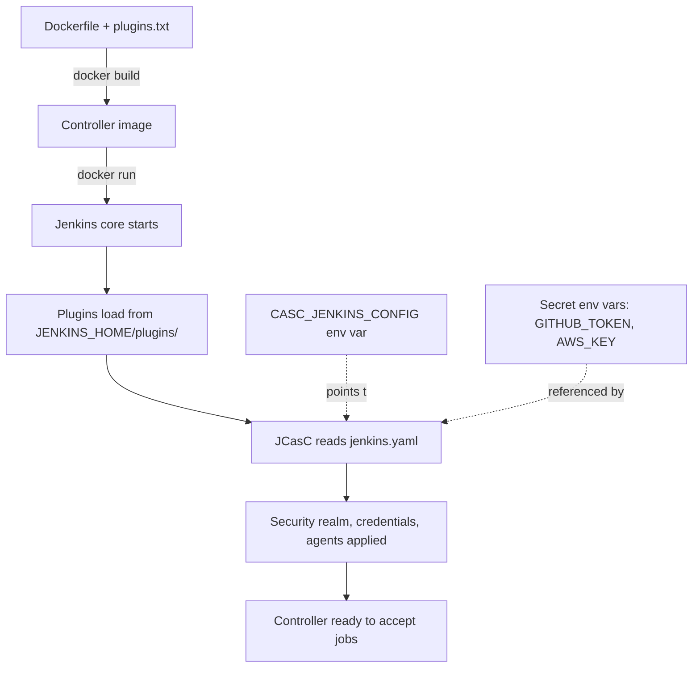

## Table of Contents

1. [The Plugin Problem](#the-plugin-problem)
2. [How Plugins Load](#how-plugins-load)
3. [The Plugin Manager UI](#the-plugin-manager-ui)
4. [Dependency Hell](#dependency-hell)
5. [Version Pinning with plugins.txt](#version-pinning-with-pluginstxt)
6. [Configuration as Code](#configuration-as-code)
7. [Anatomy of jenkins.yaml](#anatomy-of-jenkinsyaml)
8. [Reload vs Restart](#reload-vs-restart)
9. [The Failed Upgrade](#the-failed-upgrade)
10. [An Upgrade Cadence That Survives](#an-upgrade-cadence-that-survives)

## The Plugin Problem

A bare Jenkins installation cannot do very much. It can run shell commands, schedule jobs on a timer, and store some build history. That is the whole feature set out of the box. There is no Git checkout, no Pipeline syntax, no Docker integration, no Slack notifier, no AWS credential type. Everything that makes Jenkins useful in a real CI/CD pipeline is added by a plugin.

Plugins are how Jenkins reaches into every corner of the development ecosystem. The official Update Center hosts more than 1,800 of them, written by Jenkins core developers, vendor teams, and individual contributors over the past 15 years. Most are open-source `.jpi` files (short for Jenkins Plugin Archive, originally named `.hpi` because Jenkins started its life as Hudson). When you install one through the web UI, Jenkins downloads it from the Update Center, drops it into `$JENKINS_HOME/plugins/`, and loads it into the JVM at the next restart.

This is also where Jenkins's biggest operational headache lives. Plugins are written in Java by hundreds of different authors, with no enforced API stability between versions. A core update can break a plugin you depend on. One plugin can require an old version of a library that conflicts with what another plugin needs. The community has a saying: "Jenkins is 1,800 plugins held together with hope." That is only half a joke.

This article walks through how plugins actually work, what goes wrong when you upgrade them, and how to put your controller's entire configuration (plugins, security settings, credentials, agent definitions) into version control. The running spine is a real upgrade gone wrong: an ops engineer takes a controller from LTS 2.426.3 to LTS 2.555.1, clicks "Update All" in the Plugin Manager, ignores three warning panels, and watches the next pipeline crash with a `NoSuchMethodError`. We rebuild from a snapshot, then introduce two structural fixes (a `plugins.txt` baked into a Docker controller image, and a `jenkins.yaml` capturing the entire controller config) so the next upgrade is a one-line pull request instead of a recovery operation.

## How Plugins Load

A Jenkins plugin is a `.jpi` file: a renamed `.jar` file with a manifest that tells Jenkins which classes to load, which extension points it provides, and which other plugins it depends on. When the Jenkins controller starts, it scans `$JENKINS_HOME/plugins/`, finds every `.jpi`, and registers each one with its own classloader.

The classloader part matters. Each plugin gets its own isolated classloader, so two plugins can technically use different versions of the same library without colliding. In practice, isolation is partial: when a plugin extends a class defined in core Jenkins (or in another plugin), the parent class must be loaded from a single classloader. That is the source of most upgrade pain. If `git` extends a class from `git-client`, and `git-client` removes a method, every plugin downstream that called that method gets a `NoSuchMethodError` the first time it runs.

Plugins integrate with Jenkins through extension points. An extension point is an abstract class or interface that Jenkins core (or another plugin) declares, and other plugins implement. For example, `hudson.scm.SCM` is the extension point for source control systems: the Git plugin implements it, the Subversion plugin implements it, and so does the Mercurial plugin. When you configure a job, Jenkins lists every implementation of `SCM` it currently has loaded, and you pick one. Plugins do not patch core Jenkins; they plug into well-defined sockets that core (and other plugins) expose.

The Update Center is where Jenkins discovers what is available. Once a day by default, the controller fetches a JSON file from `https://updates.jenkins.io/update-center.json` listing every plugin, every version, and the dependency graph. The Plugin Manager UI uses this metadata to show you what is installable and what has updates. You can change the URL to point at an internal mirror if your controller cannot reach the public internet, which is a common setup in air-gapped environments.

```text
$JENKINS_HOME/plugins/
├── git.jpi                      # the .jpi archive on disk
├── git/                         # extracted contents (lazy-extracted on first load)
│   ├── META-INF/MANIFEST.MF     # version, dependencies, extension points
│   ├── WEB-INF/
│   │   ├── classes/
│   │   └── lib/                 # bundled JARs the plugin needs
│   └── ...
├── git-client.jpi
├── git-client/
└── ...
```

Inspecting a plugin's `MANIFEST.MF` is sometimes the fastest way to debug a version conflict. The `Plugin-Dependencies` line shows exactly which other plugins (and which minimum versions) the plugin requires. If a plugin is misbehaving, opening its manifest is often more useful than reading the changelog.

## The Plugin Manager UI

You manage plugins from the web UI under Manage Jenkins > Plugins. The screen has four tabs, and each tab represents a different operational mood.

The **Available** tab lists every plugin in the Update Center that you have not yet installed. Filter by category (Source Code Management, Build Tools, Notifications) or search by name. Selecting a plugin and clicking "Install" downloads the `.jpi`, drops it into `$JENKINS_HOME/plugins/`, and either loads it on the fly or queues it for the next restart. Most modern plugins load dynamically, but anything that touches the security realm or the agent protocol still requires a restart to take effect.

The **Installed** tab is the inventory: every plugin currently active on this controller, with its version number and a checkbox to disable or uninstall it. This is where you spot plugins that have been deprecated upstream. Jenkins surfaces a yellow banner for any plugin that the maintainers have marked obsolete or that has known unpatched security advisories. Reading this tab once a month is the cheapest preventive maintenance you can do on a Jenkins controller.

The **Updates** tab is the riskiest one. It lists every installed plugin that has a newer version available, with a tempting "Select All" checkbox at the top of the list paired with a "Download now and install after restart" button. Clicking those two things is the single most common way to break a long-running Jenkins controller. Updates can change behavior, change configuration schema, or pull in a new transitive dependency that conflicts with something else you have installed. Always read the changelog of each plugin you are about to update; the changelog link sits next to the version number in the same row.

The **Advanced** tab has the escape hatches. You can upload a `.hpi` or `.jpi` file from your local disk, useful for installing a private plugin built in-house or pinning to an exact version that has been pulled from the Update Center. You can configure an HTTP proxy for the Update Center to use. You can override the Update Center URL itself, which is how teams point Jenkins at a private mirror in restricted networks.

> The "Update All" button is the single most common cause of an unscheduled outage on a long-running Jenkins controller.

If your controller is in a high-availability or compliance environment, treat the Plugin Manager as a development tool rather than a production deployment tool. The UI is fine for trying things on a sandbox controller. For production, you want plugin installs to come from a Dockerfile or a configuration-management system, which we get to next.

## Dependency Hell

Every plugin declares two kinds of dependencies in its manifest: required and optional. A required dependency means the plugin will refuse to load if the named plugin is missing. An optional dependency means "I will use this if it is installed, but I work without it."

The trouble is that required dependencies also pin a minimum version. If `git` 5.4.0 declares `git-client >= 4.7.0`, then `git-client` 4.6.x is not enough. When you install the `git` plugin, Jenkins also fetches `git-client` 4.7.0 (or newer) automatically. This is helpful most of the time. It becomes painful when you have multiple plugins with overlapping but conflicting version requirements.

Imagine two plugins on a controller:

- `git` 5.4.0 requires `ssh-credentials >= 305.v8f4381501156`
- `kubernetes` 4296.v20a_3a_3aff5e1 requires `ssh-credentials >= 343.v884f71d78167`

If you install both, Jenkins fetches `ssh-credentials` at version `343.v884f71d78167` (the higher of the two minimums). That works because both plugins were happy with "at least X." But suppose a future version of `git` deprecates a method that `kubernetes` was calling. The next time you upgrade `git`, the `kubernetes` plugin breaks because the method it relies on no longer exists in the library. You will not see this error during the install. You will see it the first time a build runs that exercises the affected code path.

When you go to upgrade plugins through the Plugin Manager UI, Jenkins shows a "Compatibility warnings" panel for any plugin where the new version raises its minimum dependencies. The panel might say:

```text
The following plugins have warnings about their compatibility:
  • git 5.5.0 requires ssh-credentials version 350.v2c0c6fea_a_22b_ but
    you have version 343.v884f71d78167 installed. ssh-credentials will
    be upgraded automatically.
  • git-client 6.0.0 (a transitive dependency of git 5.5.0) drops
    support for the deprecated GitClient.fetch(String, RefSpec) method.
    Plugins that call this method will fail at runtime.
```

The first warning is benign: an automatic transitive bump. The second is the dangerous one. It is telling you that the upgrade compiles fine but fails at runtime in any plugin that has not yet adopted the new API. If you have a third-party plugin that depends on `git-client` and has not been updated for a year, this is the upgrade that breaks it.

The fix is not to ignore the warnings. The fix is to mirror the upgrade on a non-production controller first, run a representative job that exercises the affected paths, and only promote the new plugin set to production after a green run. That discipline is the entire point of the rest of this article.

## Version Pinning with plugins.txt

Once you accept that Plugin Manager clicks belong on a sandbox controller, the next question is how production controllers should get their plugins. The community-standard answer is to bake them into the controller's Docker image using the `jenkins-plugin-cli` tool that ships inside the official `jenkins/jenkins` image.

The recipe is two files. First, a `plugins.txt` listing every plugin and its version, one per line:

```text
configuration-as-code:1932.v75d6b_d987932
git:5.4.0
git-client:4.7.0
ssh-credentials:343.v884f71d78167
workflow-aggregator:600.vb_57cdd26fdfb_
docker-workflow:572.v950f58993843
kubernetes:4296.v20a_3a_3aff5e1
matrix-auth:3.2.2
job-dsl:1.87
credentials:1337.v60b_d7b_c7b_c9f
```

Second, a `Dockerfile` that pulls the official LTS image with Java 21 and runs the plugin manager against the file at build time:

```dockerfile
FROM jenkins/jenkins:2.555.1-lts-jdk21

USER root
RUN apt-get update && apt-get install -y --no-install-recommends \
      git docker.io \
    && rm -rf /var/lib/apt/lists/*
USER jenkins

COPY plugins.txt /usr/share/jenkins/ref/plugins.txt
RUN jenkins-plugin-cli --plugin-file /usr/share/jenkins/ref/plugins.txt
```

`jenkins-plugin-cli` reads `plugins.txt`, resolves every transitive dependency, downloads each `.jpi` from the Update Center, and writes the files to `/usr/share/jenkins/ref/plugins/`. When the controller container starts for the first time, Jenkins copies any `.jpi` files from `/usr/share/jenkins/ref/plugins/` into `$JENKINS_HOME/plugins/` if they are not already there. Rebuilding the image with the same `plugins.txt` produces the exact same plugin layout every time. That reproducibility is the whole point.

The trick is that you must list every plugin, including transitive ones, with an exact version. If you write only `git:5.4.0`, the CLI resolves and downloads `git-client`, `ssh-credentials`, and the other dependencies at whatever version is current the moment you run the build. The next time you rebuild, those transitive versions might have moved, and you have lost reproducibility. The community convention is to flatten the entire dependency tree into `plugins.txt` after the first install:

```bash
$ docker run --rm jenkins/jenkins:2.555.1-lts-jdk21 \
    jenkins-plugin-cli --plugin-file /usr/share/jenkins/ref/plugins.txt \
    --available-updates --output txt
```

That command prints the resolved set, which you commit to the repository as the new `plugins.txt`. The next image build is then deterministic: same Dockerfile, same `plugins.txt`, same byte-for-byte plugin directory.

## Configuration as Code

Pinning plugin versions solves half the problem. The other half is the controller's own configuration: the security realm, the authorization strategy, the global system message, the credential store, the agent definitions, the executor count on the built-in node. By default all of this lives in XML files under `$JENKINS_HOME` (`config.xml`, `credentials.xml`, `nodes/*/config.xml`), edited indirectly through the web UI. That is exactly the kind of state you do not want to back up by tarballing the directory and hoping for the best. The architecture article noted that backing up `$JENKINS_HOME` is critical, but also said that managing it with Configuration as Code is the better answer. This is that better answer.

The Configuration as Code plugin (commonly called JCasC) takes the entire controller configuration and lets you declare it in a single YAML file. When the controller starts, JCasC reads that YAML and applies it to the running Jenkins instance. If something is wrong (a missing field, an invalid plugin reference, a typo'd YAML key), JCasC refuses to apply the partial config and surfaces the error in the system log instead of silently leaving the controller in a half-configured state.

You point JCasC at your config with the `CASC_JENKINS_CONFIG` environment variable. It can be a single file path, a directory of YAML files (loaded alphabetically and merged), or even an HTTPS URL.

```bash
$ docker run -d \
    -p 8080:8080 -p 50000:50000 \
    -v jenkins_home:/var/jenkins_home \
    -v $(pwd)/casc:/var/jenkins_home/casc_configs \
    -e CASC_JENKINS_CONFIG=/var/jenkins_home/casc_configs \
    -e GITHUB_TOKEN=ghp_xxx \
    -e ADMIN_PASSWORD=changeit \
    polaris/jenkins-controller:2.555.1
```

The architectural picture, end to end, looks like this. The image build bakes plugins from `plugins.txt`. The container starts. Jenkins core boots. JCasC loads `jenkins.yaml`. Within a few seconds, you have a controller that is byte-for-byte identical to every other controller built from the same Dockerfile and the same YAML.



The payoff is that rolling forward and rolling back become Git operations. Want to add a new agent? Edit `jenkins.yaml`, open a pull request, get it reviewed, merge, redeploy. Want to undo a security change made in production yesterday? Revert the merge.

## Anatomy of jenkins.yaml

A JCasC YAML file has five top-level sections. Each one corresponds to a different area of the Manage Jenkins page in the web UI.

| YAML section | Owns | UI equivalent |
| :--- | :--- | :--- |
| `jenkins` | Core controller settings: system message, executors on built-in node, security realm, authorization, agents, clouds | Manage Jenkins > System / Manage Jenkins > Nodes |
| `credentials` | The credential store: secret text, username/password, SSH keys, certificates | Manage Jenkins > Credentials |
| `tool` | Tool installations: JDK, Maven, Gradle, custom tools that jobs can reference by name | Manage Jenkins > Tools |
| `unclassified` | Configuration for installed plugins that does not fit elsewhere: Jenkins URL, GitHub server entries, Slack settings, shared library definitions | Various plugin-specific pages |
| `security` | Cross-cutting security toggles: agent-to-controller protocol, CSRF protection, script approval | Manage Jenkins > Security |

Here is a starter `jenkins.yaml` for a small team. It enforces zero executors on the built-in node (the change the architecture article called the most important configuration on a new install), defines a basic local user database, and stores one GitHub token using an environment variable for the secret value.

```yaml
jenkins:
  systemMessage: "Polaris CI controller. Runbook: https://wiki.polaris.dev/jenkins"
  numExecutors: 0
  mode: EXCLUSIVE
  labelString: "controller"
  securityRealm:
    local:
      allowsSignup: false
      users:
        - id: "admin"
          password: "${ADMIN_PASSWORD}"
        - id: "ci-bot"
          password: "${CI_BOT_PASSWORD}"
  authorizationStrategy:
    roleBased:
      roles:
        global:
          - name: "admin"
            permissions:
              - "Overall/Administer"
            assignments:
              - "admin"
          - name: "developer"
            permissions:
              - "Overall/Read"
              - "Job/Build"
              - "Job/Cancel"
              - "Job/Read"
              - "Job/Workspace"
            assignments:
              - "ci-bot"
              - "authenticated"

credentials:
  system:
    domainCredentials:
      - credentials:
          - string:
              scope: GLOBAL
              id: "github-pat"
              description: "GitHub personal access token for build status updates"
              secret: "${GITHUB_TOKEN}"
          - usernamePassword:
              scope: GLOBAL
              id: "registry-creds"
              description: "Container registry push credentials"
              username: "ci-bot"
              password: "${REGISTRY_PASSWORD}"

unclassified:
  location:
    url: "https://jenkins.polaris.dev/"
    adminAddress: "platform-team@polaris.dev"
  globalLibraries:
    libraries:
      - name: "polaris-pipeline"
        defaultVersion: "v1.4.2"
        retriever:
          modernSCM:
            scm:
              git:
                remote: "https://github.com/polaris/jenkins-shared-library.git"
```

Two details to notice. First, `numExecutors: 0` is the controller's executor count, so builds will never run on the controller itself, only on agents. Second, every secret value uses `${ENV_VAR}` syntax. JCasC reads these from the controller's process environment at startup. The actual values come from the orchestrator (Docker Compose, Kubernetes Secrets, AWS Secrets Manager) so they never sit in the YAML file or in version control.

The full schema is documented at `Manage Jenkins > Configuration as Code > Documentation`. That page is generated at runtime from the plugins you actually have installed, so it always matches your controller. Reading it is the fastest way to figure out which YAML key a particular Jenkins UI checkbox maps to.

## Reload vs Restart

JCasC supports two ways to apply configuration changes after the controller is already running.

A **Reload Configuration from Disk** (clickable from `Manage Jenkins > Configuration as Code`, or triggerable via a `POST` to the `/configuration-as-code/reload` HTTP endpoint with admin credentials) re-reads the YAML and applies the deltas. Most changes apply live: a new credential becomes available immediately, a new agent definition is registered, a system message updates on the next page load. This is the right tool for small day-to-day changes.

A few changes still require a full restart. Switching the security realm, changing the authorization strategy, or adding a plugin that was not previously installed are the main ones. JCasC will surface "this change requires a restart" in the apply log when that is the case. If you ignore it, the controller may end up in a half-applied state where some changes are live and some are not, which is harder to reason about than just restarting cleanly.

The reload path is what makes JCasC operationally cheap. You do not need to bounce a controller (and lose every running build's console connection) every time you add a credential. You edit `jenkins.yaml`, push it, the deployment system updates the file in `$JENKINS_HOME/casc_configs/`, and you click reload. Total downtime: zero seconds. That is a different operating model from the "restart for everything" reflex that long-time Jenkins admins develop, and it is worth unlearning the old habit.

## The Failed Upgrade

Time to walk through the spine. The platform team owns a Jenkins controller running LTS 2.426.3 with about 80 plugins installed. The team has been busy and has not upgraded in a year. The security team flags two CVEs in `git-client` that require an upgrade to LTS 2.555.1 within the week.

Tuesday afternoon, an ops engineer logs into the controller, navigates to Manage Jenkins > Plugins > Updates, and clicks Select All. The Compatibility warnings panel surfaces three messages. Two are benign transitive bumps. The third reads:

```text
git-client 6.0.0 drops support for the deprecated
GitClient.fetch(String, RefSpec) method. Plugins that call this method
will fail at runtime. Affected: git, github, github-branch-source.
```

The engineer assumes the affected plugins are also in the upgrade list and have already been adapted. They click "Download now and install after restart." Jenkins downloads 47 plugin updates and triggers a restart. The controller comes back up in 90 seconds. The web UI looks fine. The engineer calls it a day.

Wednesday morning, the first commit lands on the `polaris-api` repository. The pipeline triggers, an agent picks up the build, and 30 seconds later the build fails. The console log shows:

```text
Started by GitHub push by ci-bot
Running in Durability level: MAX_SURVIVABILITY
[Pipeline] Start of Pipeline
[Pipeline] node
Running on linux-docker-02 in /var/lib/jenkins/workspace/polaris-api
[Pipeline] {
[Pipeline] stage
[Pipeline] { (Checkout)
[Pipeline] checkout
ERROR: Error fetching remote repo 'origin'
hudson.plugins.git.GitException: Failed to fetch from
  https://github.com/polaris/polaris-api.git
  at org.jenkinsci.plugins.gitclient.CliGitAPIImpl.execute(CliGitAPIImpl.java:2683)
  ...
Caused by: java.lang.NoSuchMethodError: 'org.jenkinsci.plugins.gitclient.FetchCommand
  org.jenkinsci.plugins.gitclient.GitClient.fetch(java.lang.String,
  org.eclipse.jgit.transport.RefSpec[])'
  at hudson.plugins.git.GitSCM.fetchFrom(GitSCM.java:1052)
  at hudson.plugins.git.GitSCM.retrieveChanges(GitSCM.java:1311)
  ...
Finished: FAILURE
```

That is the warning from yesterday, made real. The `git` plugin update did include the API change, but a third-party `github-branch-source-extras` plugin (installed two years ago, never updated since) was still calling the old method signature. The new `git-client` no longer has that method, so the call blows up at runtime the first time a checkout happens.

The diagnosis path:

1. Read the controller's main log. On a systemd-managed package install, the log lives at `/var/log/jenkins/jenkins.log`. Inside a Docker container, it goes to stdout (`docker logs jenkins`). Search for `NoSuchMethodError` or the failing class name.
2. Check Manage Jenkins > System Information > Plugins. Each plugin's version is listed there. Identify the plugin that called the missing method (`github-branch-source-extras`) and the plugin that owns the method (`git-client`).
3. Open the `github-branch-source-extras` page on the Update Center. If there is no compatible release for the new `git-client`, the plugin is stuck. In this case there is not, because the plugin has been unmaintained for two years.

The fix is to roll back. Because `$JENKINS_HOME` was snapshotted before the upgrade (the team has a nightly EBS snapshot of the volume backing `/var/lib/jenkins`):

```bash
$ sudo systemctl stop jenkins
$ sudo umount /var/lib/jenkins
$ aws ec2 detach-volume --volume-id vol-current
$ aws ec2 attach-volume --volume-id vol-snapshot --device /dev/xvdf \
    --instance-id i-controller01
$ sudo mount /dev/xvdf /var/lib/jenkins
$ sudo systemctl start jenkins
```

Two minutes later, the controller is back at LTS 2.426.3 with the old plugin set, and pipelines are green again. The CVE is still open, but at least production is no longer down.

The root cause is not the plugin. The root cause is that the upgrade happened directly on production. There was no place to discover the runtime failure before it hit a developer. The structural fix is a Dockerfile pinning the plugin set in `plugins.txt`, plus a JCasC `jenkins.yaml` capturing the rest of the config. The next upgrade attempt looks like this:

1. Open a pull request bumping `FROM jenkins/jenkins:2.426.3-lts-jdk21` to `2.555.1-lts-jdk21` and editing `plugins.txt` with the new plugin versions.
2. CI builds the image and deploys it to a staging controller that points at the same JCasC YAML.
3. A smoke-test job runs on staging: it checks out a sample repository, runs a representative pipeline, and asserts the build passes.
4. If staging fails (as it would have here), the PR cannot merge. The engineer adjusts `plugins.txt` (pinning `git-client` to `4.7.0` until the third-party plugin is fixed, or replacing the third-party plugin entirely) and tries again.
5. When staging passes, merging the PR triggers the production deploy.

The same upgrade with this workflow takes longer to ship, but it never causes a Wednesday-morning outage.

## An Upgrade Cadence That Survives

The overall tradeoff is between staying current and staying calm. Fully frozen plugin sets are stable, but they accumulate CVEs (Jenkins publishes plugin advisories nearly every month), and they fall outside the LTS support window after a few releases. Fully rolling updates ship security fixes promptly but invite the "Wednesday morning" outage. The middle path is a defined cadence with mandatory staging.

Here is a concrete schedule that works for teams of around 50 to 200 jobs:

| Cadence | What changes | Where it runs | Promotion gate |
| :--- | :--- | :--- | :--- |
| Weekly (every Monday) | Auto-rebuild image with `--available-updates` resolved into a fresh `plugins.txt` | Staging controller in a separate VPC | Smoke-test job runs the 5 most representative pipelines; must pass |
| Monthly (first Wednesday) | Promote staging's `plugins.txt` and Dockerfile to production via PR | Production controller after 24 hours of soak on staging | Manual review, two-engineer approval, change ticket |
| Emergency (within 24 hours of advisory) | Bump only the specific plugin flagged in a Jenkins security advisory | Staging then production same day | Smoke-test plus targeted check that the affected feature still works |

The weekly job lives inside Jenkins itself. It is a pipeline that runs `jenkins-plugin-cli --available-updates`, opens a pull request against the controller image repository with the diff, and triggers the staging deploy. The monthly promotion is just a manual merge of last week's already-validated PR. The emergency lane is what you use when CVE-2026-XXXXX shows up and you cannot wait until Monday.

The most important habit is keeping the staging controller alive at all times. A staging controller that nobody uses except during an upgrade catches almost nothing, because it has none of the real-world job configurations that exercise the dependencies that actually break. Either point staging at a copy of production's `jenkins.yaml` and run a small but representative subset of the production pipelines on it, or accept that you are upgrading directly to production with extra steps.

The reward for this discipline is that "a Jenkins upgrade" stops being an event. It is just another pull request. The controller becomes infrastructure-as-code in a real sense: a Dockerfile, a `plugins.txt`, a `jenkins.yaml`, and an environment file with secret values, all under version control and all reviewable. If a controller catches fire, you rebuild it from those four files in five minutes. That is the actual prize for everything in this article.

---

**References**

- [Jenkins Docs: Managing Plugins](https://www.jenkins.io/doc/book/managing/plugins/) - Official guide to the Plugin Manager UI, manual installs, and the Update Center.
- [Jenkins Docs: Configuration as Code](https://www.jenkins.io/doc/book/managing/casc/) - Canonical reference for JCasC, including reload semantics and secret expansion.
- [Plugin Installation Manager Tool](https://github.com/jenkinsci/plugin-installation-manager-tool) - GitHub repository for `jenkins-plugin-cli`, the tool used to bake plugins into a Docker image.
- [Configuration as Code Plugin](https://github.com/jenkinsci/configuration-as-code-plugin) - Plugin source, schema reference, and example `jenkins.yaml` files for common scenarios.
- [Official Jenkins Docker Image](https://hub.docker.com/r/jenkins/jenkins) - The `jenkins/jenkins` image on Docker Hub, including the `2.555.1-lts-jdk21` tag used in this article.
- [Jenkins Security Advisories](https://www.jenkins.io/security/advisories/) - The page to subscribe to so you know when an emergency upgrade is required.
