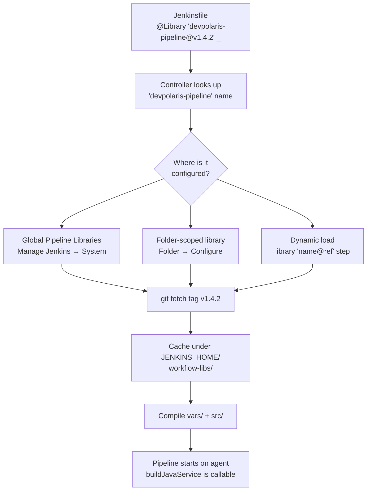

## Table of Contents

1. [The Twentieth Pull Request](#the-twentieth-pull-request)
2. [What a Shared Library Actually Is](#what-a-shared-library-actually-is)
3. [The Operational Spine: Refactoring the Monolith](#the-operational-spine-refactoring-the-monolith)
4. [Anatomy of a Library Repository](#anatomy-of-a-library-repository)
5. [The Global Step in vars/](#the-global-step-in-vars)
6. [Helpers in src/ and Templates in resources/](#helpers-in-src-and-templates-in-resources)
7. [Configuring and Loading Libraries](#configuring-and-loading-libraries)
8. [Versioning by Git Ref](#versioning-by-git-ref)
9. [Testing the Library](#testing-the-library)
10. [The Day the Library Broke Production](#the-day-the-library-broke-production)
11. [The DRY vs Autonomy Tradeoff](#the-dry-vs-autonomy-tradeoff)

## The Twentieth Pull Request

Imagine you are the platform engineer on a team that runs 30 Java microservices on Kubernetes. Every service has the same shape of build pipeline: check out the code, run `./mvnw verify`, generate an SBOM (a software bill of materials, a list of every dependency baked into the artifact), build a Docker image, scan it with Trivy, push to a registry, then deploy to staging on `main`. The first time someone wrote this pipeline, it was a careful 60 lines of Groovy. Two years later, after a parade of new requirements (Spotless linting, JUnit reporting, image fingerprinting, signed pushes, multi-namespace deploys), the Jenkinsfile is 200 lines.

That 200-line file lives in 30 repositories. Yesterday the security team mandated a stricter Trivy severity threshold. So you opened 30 pull requests. Two of them already had local edits that conflicted with the change. One repository had quietly dropped to Java 17 last quarter and your patch did not even apply cleanly. You spent the day playing keyboard whack-a-mole, and the change still rolled out unevenly across the fleet because two services were paused while a contractor finished work.

This is configuration drift, the specific failure mode where copies of "the same" config slowly diverge because no one updates them all at the same time. Jenkins solves it the same way that any sane engineer would solve it inside an application: extract the repeated logic into a versioned module that the consumers depend on. In Jenkins, that module is called a **shared library**, and it is written in Groovy.

If you have read the GitHub Actions article on actions and reusability, the *idea* will feel familiar. The mechanism is different. GitHub Actions gives you composite actions and reusable workflows, both authored in YAML. Jenkins gives you a Git repository full of Groovy code that the controller compiles and injects into your pipelines at build time.

## What a Shared Library Actually Is

A Jenkins shared library is a Git repository with a specific directory layout that the Jenkins controller knows how to load. When a Jenkinsfile says `@Library('devpolaris-pipeline@v1.4.2') _`, the controller does three things:

1. Looks up "devpolaris-pipeline" in its library configuration to find the Git URL.
2. Fetches the `v1.4.2` ref from that repository into a controller-side cache.
3. Compiles every `.groovy` file under the library's `vars/` and `src/` directories and adds them to the classpath of the running pipeline.

After that, anything the library exposes is callable from your Jenkinsfile as if it were a built-in step. A file at `vars/buildJavaService.groovy` becomes a top-level step named `buildJavaService(...)`. A class at `src/com/devpolaris/pipeline/Sbom.groovy` becomes importable as `import com.devpolaris.pipeline.Sbom`.

The important conceptual point is that all of this runs on the controller. Library code is part of the pipeline definition, not the build itself. Your `sh` and `docker` steps still execute on agents, but the Groovy logic that decides *which* shell commands to issue, in what order, with what arguments, runs inside the controller's JVM. That is why library code has to be safe to run on the controller, why it is subject to Script Security on untrusted libraries, and why heavy file-processing belongs inside an `sh` step on an agent rather than in Groovy on the controller.

The other thing worth saying upfront: a shared library is just a Git repo. There is no special package manager, no registry, no `npm publish`. You push a tag, and consumers reference that tag.

## The Operational Spine: Refactoring the Monolith

Here is a representative excerpt from one of those 30 Jenkinsfiles. Every service has near-identical content; only the name of the artifact, the Java version, and the list of deploy targets vary.

```groovy
// orders-service/Jenkinsfile (excerpt, ~35 of ~200 lines)
pipeline {
    agent { label 'linux-docker' }
    options {
        timeout(time: 30, unit: 'MINUTES')
        disableConcurrentBuilds()
        buildDiscarder(logRotator(numToKeepStr: '50'))
    }
    environment {
        IMAGE_REGISTRY = 'ghcr.io/devpolaris-corp'
        IMAGE_NAME     = 'orders'
        TRIVY_SEVERITY = 'CRITICAL,HIGH'
    }
    stages {
        stage('Lint') { steps { sh './mvnw -B spotless:check' } }
        stage('Test') {
            steps { sh './mvnw -B verify' }
            post  { always { junit 'target/surefire-reports/*.xml' } }
        }
        stage('SBOM') {
            steps {
                sh "syft packages dir:. -o cyclonedx-json > sbom.json"
                archiveArtifacts artifacts: 'sbom.json'
            }
        }
        stage('Build Image') {
            steps {
                sh "docker build -t ${IMAGE_REGISTRY}/${IMAGE_NAME}:${env.GIT_COMMIT.take(7)} ."
            }
        }
        // ... 8 more stages, all near-identical to peer services ...
    }
}
```

The goal of the refactor is to replace those 200 lines with this:

```groovy
// orders-service/Jenkinsfile (after refactor)
@Library('devpolaris-pipeline@v1.4.2') _

buildJavaService(
    name:        'orders',
    javaVersion: '21',
    deployTo:    ['staging'],
)
```

Eight lines, one function call, one library version pinned. The Sonar token, the SBOM tool, the Trivy severity, and the kubectl deploy logic all live in the library. Service teams stop owning pipeline plumbing. The platform team owns one repository, ships one tag, and consumers pick it up at their own pace.

## Anatomy of a Library Repository

Every shared library follows the same three-directory layout. Jenkins is opinionated about these names; you cannot rename them.

```text
devpolaris-pipeline/
├── vars/
│   ├── buildJavaService.groovy
│   ├── buildJavaService.txt
│   └── notifySlack.groovy
├── src/
│   └── com/
│       └── devpolaris/
│           └── pipeline/
│               ├── Sbom.groovy
│               └── ImageTag.groovy
└── resources/
    └── templates/
        └── Dockerfile.tmpl
```

Each directory plays a different role:

| Directory | Purpose | When to use it | Naming convention |
| :--- | :--- | :--- | :--- |
| `vars/` | Global steps callable directly from a Jenkinsfile. | Top-level workflows that consumers invoke by name. | `vars/buildJavaService.groovy` exposes a step named `buildJavaService(...)`. The optional `.txt` file beside it is rendered as inline help in the Pipeline Snippet Generator. |
| `src/` | Plain Groovy classes in standard package layout. | Reusable logic shared between multiple `vars/` scripts, complex parsing, anything that benefits from being a real class. | `src/com/devpolaris/pipeline/Sbom.groovy` declares `package com.devpolaris.pipeline; class Sbom { ... }`. |
| `resources/` | Static text files (templates, config snippets) loaded via the `libraryResource` step. | Dockerfiles, Helm values, JSON templates, anything you want the library to ship alongside its code. | `resources/templates/Dockerfile.tmpl` is loaded as `libraryResource('templates/Dockerfile.tmpl')`. |

The split between `vars/` and `src/` is the part that confuses newcomers. Think of it this way: `vars/` is the public API. Everything in `vars/` is a verb the consumer types into a Jenkinsfile. `src/` is the implementation. It is where you put the noun classes (`Sbom`, `ImageTag`, `KubeClient`) that those verbs use internally.

## The Global Step in vars/

The shape of a `vars/` file is: define a `call(...)` method, and that method becomes the body of the step. Here is `buildJavaService.groovy`, the workhorse of the library.

```groovy
// vars/buildJavaService.groovy
import com.devpolaris.pipeline.Sbom

def call(Map config) {
    def name           = config.name           ?: error('buildJavaService: "name" is required')
    def javaVersion    = config.javaVersion    ?: '21'
    def deployTo       = config.deployTo       ?: []
    def trivySeverity  = config.trivySeverity  ?: 'CRITICAL,HIGH'
    def registry       = config.registry       ?: 'ghcr.io/devpolaris-corp'

    pipeline {
        agent { label 'linux-docker' }
        options {
            timeout(time: 30, unit: 'MINUTES')
            disableConcurrentBuilds()
            buildDiscarder(logRotator(numToKeepStr: '50'))
        }
        environment {
            IMAGE_TAG = "${registry}/${name}:${env.GIT_COMMIT?.take(7) ?: 'dev'}"
        }
        stages {
            stage('Lint') { steps { sh './mvnw -B spotless:check' } }
            stage('Test') {
                steps { sh "./mvnw -B -Pjava${javaVersion} verify" }
                post  { always { junit 'target/surefire-reports/*.xml' } }
            }
            stage('SBOM') {
                steps { script { Sbom.generate(this, env.IMAGE_TAG) } }
            }
            stage('Build & Scan') {
                steps {
                    sh "docker build -t ${env.IMAGE_TAG} ."
                    sh "trivy image --severity ${trivySeverity} --exit-code 1 ${env.IMAGE_TAG}"
                }
            }
            stage('Push') {
                when { branch 'main' }
                steps {
                    withCredentials([usernamePassword(credentialsId: 'ghcr-creds',
                                                      usernameVariable: 'U', passwordVariable: 'P')]) {
                        sh 'echo $P | docker login ghcr.io -u $U --password-stdin'
                        sh "docker push ${env.IMAGE_TAG}"
                    }
                }
            }
            stage('Deploy') {
                when { expression { deployTo && env.BRANCH_NAME == 'main' } }
                steps {
                    script {
                        deployTo.each { ns ->
                            sh "kubectl set image deploy/${name} ${name}=${env.IMAGE_TAG} -n ${ns}"
                        }
                    }
                }
            }
        }
    }
}
```

A few things are worth pointing out. First, `def call(Map config)` is the magic signature. When a Jenkinsfile writes `buildJavaService(name: 'orders', javaVersion: '21')`, Groovy turns that named-argument call into a single `Map` and passes it to `call`. So inside the function, `config.name` is `'orders'`. The `?:` operator is Groovy's "Elvis operator" (named because it has the hair). It is shorthand for "use the left side if it is truthy, otherwise the right side", which gives you cheap default values without explicit `if` checks.

Second, the entire `pipeline { ... }` block is inside the function. The library is constructing a declarative pipeline at runtime, parameterised by the config map. The consumer's Jenkinsfile contains *only* the `buildJavaService(...)` call; the library decides the agent label, the stages, and the order.

Third, `error('buildJavaService: "name" is required')` is the standard Jenkins way for a step to fail loudly with a clear message. Library steps should validate their inputs eagerly so a typo in a Jenkinsfile fails immediately rather than crashing halfway through stage 4.

If you also create `vars/buildJavaService.txt` next to the Groovy file, its contents render as Markdown documentation in the Pipeline Snippet Generator. Service teams browsing the Jenkins UI see the same docs as the source of truth.

## Helpers in src/ and Templates in resources/

Once a `vars/` file gets long, you want to extract logic into normal Groovy classes. The `Sbom.generate(this, env.IMAGE_TAG)` call above lives in `src/`:

```groovy
// src/com/devpolaris/pipeline/Sbom.groovy
package com.devpolaris.pipeline

class Sbom implements Serializable {

    static String generate(def script, String image) {
        script.sh "syft packages ${image} -o cyclonedx-json > sbom.json"
        script.archiveArtifacts artifacts: 'sbom.json', fingerprint: true
        return 'sbom.json'
    }
}
```

The detail that surprises people the first time they write one of these is the `script` parameter. A class in `src/` cannot call pipeline steps like `sh` or `archiveArtifacts` directly, because those steps are bound to the running pipeline's execution context, not to the class. So the convention is: the caller passes its own `this` (which is a reference to the pipeline `WorkflowScript`) into the helper, and the helper invokes pipeline steps as `script.sh(...)` and `script.archiveArtifacts(...)`. That is why the call site looks like `Sbom.generate(this, env.IMAGE_TAG)`. The `this` is the bridge that lets the class talk to the pipeline.

The `implements Serializable` part matters because Jenkins pipelines are durable: the controller can pause a pipeline mid-execution (waiting on an agent, for example) and serialise the entire Groovy object graph to disk. If your helper class holds non-serialisable state, the controller will fail with a `NotSerializableException` when it tries to checkpoint. Keeping helpers small and stateless is the easiest way to avoid that whole class of bug.

The `resources/` directory is for files that are not Groovy code: Dockerfile templates, Helm values, JSON config blobs, anything you want the library to ship as data. The `libraryResource` step reads the file and returns its contents as a string. This pattern is useful when you want the library to enforce a baseline configuration that the consumer can then customise.

```groovy
// resources/templates/Dockerfile.tmpl
FROM eclipse-temurin:__JAVA_VERSION__-jre-jammy
WORKDIR /app
COPY target/*.jar app.jar
USER 65532:65532
ENTRYPOINT ["java","-jar","/app/app.jar"]
```

```groovy
// inside vars/buildJavaService.groovy, before the docker build stage
def template = libraryResource('templates/Dockerfile.tmpl')
writeFile file: 'Dockerfile', text: template.replace('__JAVA_VERSION__', javaVersion)
```

One catch: `libraryResource` only works for *external* libraries (libraries loaded from a separate Git repository). It does not work for "internal" libraries loaded from inside the same repository as the Jenkinsfile. In practice this is rarely a problem because most teams keep their library in a dedicated repo anyway.

## Configuring and Loading Libraries

Jenkins offers three places to configure a shared library, and each one corresponds to a different organisational scope.



The three paths are:

**Global Pipeline Libraries**, configured under Manage Jenkins → System. These are visible to every job on the controller, which is what you want for a platform-team library that the whole org depends on. You name the library, point it at a Git URL, set a default version, and choose whether it is "trusted".

**Folder-scoped libraries**, configured on a folder under Folder → Configure → Pipeline Libraries. These are only visible to jobs inside that folder. This is the right tool when one team wants its own helper library without polluting the global namespace.

**Dynamic loading via the `library` step**, which lets a Jenkinsfile load a library on demand inside the script body:

```groovy
def lib = library('devpolaris-pipeline@v1.4.2')
lib.com.devpolaris.pipeline.Sbom.generate(this, 'orders:abc1234')
```

The difference between `@Library('devpolaris-pipeline@v1.4.2') _` and the dynamic `library('devpolaris-pipeline@v1.4.2')` is *when* the library loads. The annotation is resolved at compile time, before the pipeline starts, so the `vars/` steps are available throughout the file. The `library()` step loads at runtime, so the steps only become available after that line executes. The annotation is what you want for the common case. The trailing underscore (`_`) on the annotation form is a Groovy quirk: annotations have to attach to *something*, and the underscore is a valid throwaway variable name. You can chain multiple libraries with `@Library(['devpolaris-pipeline@v1.4.2', 'security-shared@v0.9']) _`.

The "trusted" checkbox is the most important security knob in the library configuration. A **trusted library** runs unsandboxed: its code can call any Java or Groovy API, mutate the controller, even read `JENKINS_HOME`. A **non-trusted library** runs through the Groovy sandbox, the same script-security mechanism that gates user-written Jenkinsfiles, and any non-whitelisted API call requires manual approval by an admin. Folder-scoped libraries default to non-trusted; global libraries default to trusted. The rule of thumb is: if your platform team owns the library and the Git history is auditable, leave it trusted. If the library can be edited by people you would not let SSH to the controller, untrust it.

## Versioning by Git Ref

The string after the `@` in `@Library('devpolaris-pipeline@v1.4.2')` is a Git ref. Jenkins resolves it the same way `git checkout` would: branch, tag, or full commit SHA. All three work. Only one of them is a good idea in production.

| Ref style | Example | Mutability | When to use |
| :--- | :--- | :--- | :--- |
| Branch | `@main` | Mutable. Whoever pushes to `main` changes what every consumer pulls on the next build. | Local development of the library against a sentinel consumer repo. Never in production consumers. |
| Tag | `@v1.4.2` | Immutable by convention. A tag should never be moved once published. | The default for production consumers. |
| Commit SHA | `@a1b2c3d4` | Truly immutable. | Surgical pinning when you need to reference a commit between two tagged releases. |

The reason tags win for production is simple: if a consumer's pipeline reproduces from history six months from now, you want the library it loaded to be the same code that ran the first time. A branch ref makes that impossible. A tag ref, combined with a release process where humans never force-push tags, gives you reproducible builds.

The library configuration in Manage Jenkins includes a "Default version" field. This is the ref Jenkins uses when a Jenkinsfile says `@Library('devpolaris-pipeline') _` without specifying a version. **Set this to a tag, not to `main`.** A surprising amount of "the pipeline broke and we did not change anything" trouble traces back to a default version that points at a moving branch, which means the controller silently picked up a new library commit overnight when someone merged to `main`.

## Testing the Library

The same library that runs your 30 production pipelines deserves the same testing rigour as application code. The standard tool for this is `jenkins-pipeline-unit` (the `lesfurets/JenkinsPipelineUnit` project on GitHub), which lets you load `vars/` scripts and `src/` classes inside a JUnit test and assert on the sequence of pipeline steps they would have called.

A typical test looks like this:

```groovy
// test/com/devpolaris/pipeline/BuildJavaServiceTest.groovy
import com.lesfurets.jenkins.unit.BasePipelineTest
import org.junit.Before
import org.junit.Test

class BuildJavaServiceTest extends BasePipelineTest {

    @Before
    void setUp() {
        super.setUp()
        helper.registerAllowedMethod('pipeline', [Closure]) { c -> c.call() }
        helper.registerAllowedMethod('agent', [Closure]) { c -> c.call() }
        // ... register the rest of the declarative DSL ...
    }

    @Test
    void deploysToStagingOnMainBranch() {
        binding.setVariable('env', [BRANCH_NAME: 'main', GIT_COMMIT: 'abc1234567'])
        def script = loadScript('vars/buildJavaService.groovy')
        script.call(name: 'orders', javaVersion: '21', deployTo: ['staging'])
        assertCallStack().contains("kubectl set image deploy/orders")
    }
}
```

The test does not actually run a pipeline. It runs the Groovy code with a mock binding and records every step call so you can assert on them after. That is fast (sub-second) and means you can run the test on every PR to the library repo without standing up a Jenkins controller.

The discipline that turns this into a safety net is to wire the library's own CI pipeline to run those tests on every pull request, plus a smoke build that pushes the change to a sandbox controller and runs a sentinel consumer repo against the new ref. If both pass, the PR is mergeable. If the smoke build fails, you caught a regression *before* the tag went out.

## The Day the Library Broke Production

Here is the failure mode that every platform team eventually meets. It is what motivated everything in the previous section.

A platform engineer pushes a "small refactor" to `devpolaris-pipeline`'s `main` branch. The change splits the SBOM stage into two: one to generate, one to publish. The split breaks artifact archiving in a subtle way (the new code archives `sbom.json` from the wrong working directory). The change passes review because the diff looks innocent. No tag is cut; `main` is updated.

Twenty-six of the 30 consumer Jenkinsfiles are using `@Library('devpolaris-pipeline') _` (no `@version`). Their library default version is `main`. Within the next four hours, every push from those 26 services triggers a build that fails at the SBOM stage. The on-call channel fills up with reports.

The Stage View under Manage Jenkins → Build History looks like this:

```text
JOB                     BRANCH  RESULT   DURATION  CAUSE
orders-service          main    FAILED   0m32s     SBOM stage
catalog-service         main    FAILED   0m31s     SBOM stage
payments-service        main    FAILED   0m33s     SBOM stage
inventory-service       main    FAILED   0m32s     SBOM stage
notifications-service   main    FAILED   0m30s     SBOM stage
... 21 more rows, all FAILED at SBOM ...
```

The four services that pinned to `@v1.3.8` are unaffected. They are the diagnostic clue: the failure is not in the consumers, it is in the library version that the un-pinned consumers are pulling.

The immediate fix is to revert the bad commit on `main`. The post-mortem fix has four parts, each one closing a gap in the release process:

1. **The library now has CI on every PR.** `jenkins-pipeline-unit` tests run on the PR branch, plus a smoke build that points a sentinel consumer repo at the PR's commit SHA. A green CI is required before merge.
2. **All consumer Jenkinsfiles must pin to immutable tags.** A linter enforces this in the central monorepo of pipeline configs. `@Library('devpolaris-pipeline') _` (no version) fails CI.
3. **The library's "Default version" in Manage Jenkins is set to the latest tag**, not `main`. Even if a consumer slips past the linter, the worst that happens is they get the previous good release, not whatever is on `main` right now.
4. **`main` is build-only by the library's own CI.** Humans cannot push to `main` directly; they merge PRs. Tags are cut by a release script (`scripts/release.sh`) that runs the test suite, runs the smoke build, then `git tag -a vX.Y.Z` and `git push --tags`.

After these four changes, the next time someone pushes a regression, the failure is contained to the library's own CI. Consumers do not see it until a release script (operated by a human who can read CI results) cuts a new tag.

## The DRY vs Autonomy Tradeoff

A shared library is centralisation. Centralisation is a tradeoff, not a free win. You give up some autonomy to get consistency, and the right call depends on how your organisation is shaped.

The case *for* the library is everything you saw above. One change, one tag, all consumers picked it up at their next build. Security mandates ship in days instead of quarters. Service teams stop reinventing pipeline scaffolding. Onboarding a new microservice is an 8-line Jenkinsfile instead of a 200-line copy. Auditing what every pipeline does is auditing one repo.

The case *against* it is real too. When a service team needs a slightly different shape (a different test command, an extra security gate, a non-standard deploy target), they have two unattractive options: add a config knob to the shared step, which makes the library's surface area grow forever, or stop using the library and write their own Jenkinsfile, which puts them back in the copy-paste world for *their* pipeline. Either choice has cost.

The healthy escape hatches are:

- **Config-map overrides.** The library exposes named knobs (`testCommand: './gradlew check'`, `extraStages: [...]`) so common variations stay inside the library. The risk is over-fitting: if every consumer has one unique override, the library is no longer DRY, just disguised.
- **Composition.** The library exposes smaller building blocks (`runTrivy(image)`, `pushImage(tag)`) alongside the monolithic `buildJavaService`. A team with unusual needs writes their own Jenkinsfile that calls the building blocks directly, getting most of the reuse benefit without the all-or-nothing buy-in.
- **Local override.** The team writes a normal Jenkinsfile and does not use the library at all. This is fine for outliers. It becomes a problem when more than 10% of services do it, because then you are losing the consistency benefit that justified the library.

The org-shape question is: who owns the library, and how do change requests from consumer teams flow back? The two patterns that work are a small platform team with a clear contract for accepting feature requests (e.g., RFC-style proposals from service teams, fortnightly review), and a federated model where service teams can open PRs against the library directly with a CODEOWNERS gate that requires platform-team approval. The pattern that fails is "no clear owner, anyone can push to main", which is exactly how regressions like the one above get shipped to production.

The shared library is one of the highest-leverage things a Jenkins-running org can build. It is also one of the things you should *not* build until the duplication actually hurts. If you have three services and three Jenkinsfiles, copy-paste is fine. The library starts paying for itself somewhere between five and ten consumers, and becomes a clear win past that. Premature abstraction is just as expensive in pipeline code as it is in application code.

---

**References**
- [Jenkins Docs: Extending with Shared Libraries](https://www.jenkins.io/doc/book/pipeline/shared-libraries/) - The canonical guide to library structure, configuration, and the Groovy CPS execution model.
- [JenkinsPipelineUnit on GitHub](https://github.com/jenkinsci/JenkinsPipelineUnit) - The standard unit-testing framework for `vars/` scripts and shared library classes.
- [Jenkins Docs: Pipeline Syntax](https://www.jenkins.io/doc/book/pipeline/syntax/) - Reference for the declarative DSL constructs used inside library `call()` methods.
- [Jenkins Docs: Script Security](https://www.jenkins.io/doc/book/managing/script-approval/) - How the sandbox treats trusted vs untrusted libraries and what triggers manual script approval.
- [CloudBees: Getting Started With Shared Libraries in Jenkins](https://www.cloudbees.com/blog/getting-started-with-shared-libraries-in-jenkins) - A practical walkthrough of authoring a first library, with notes on serialisable state.
