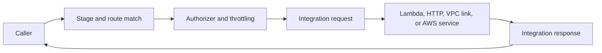
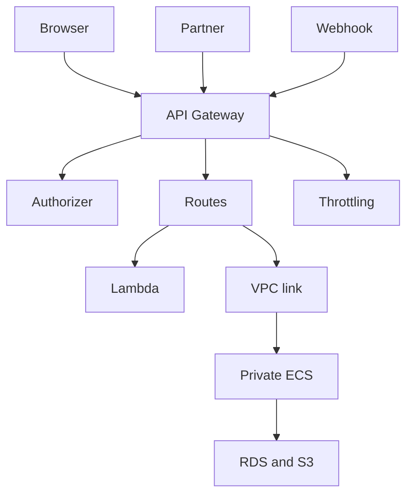

## Table of Contents

1. [The Problem](#the-problem)
2. [What Is API Gateway](#what-is-api-gateway)
3. [Request Lifecycle](#request-lifecycle)
4. [APIs](#apis)
5. [Routes](#routes)
6. [Stages](#stages)
7. [Integrations](#integrations)
8. [Authorizers](#authorizers)
9. [Throttling](#throttling)
10. [Private Backends](#private-backends)
11. [ALB Comparison](#alb-comparison)
12. [Sample API Shape](#sample-api-shape)
13. [Putting It All Together](#putting-it-all-together)
14. [What's Next](#whats-next)

## The Problem

The orders application now has places to run code and places to store data. The next question is how other systems should reach it.

A browser, mobile app, webhook provider, and partner system all need API access:

- The browser calls `GET /orders/{id}` and should receive only the customer's own order.
- A payment provider posts a webhook that needs a different authentication path from normal users.
- A mobile app needs stable routes while the backend moves from Lambda for one path to ECS for another.
- A partner should be rate limited before a sudden spike reaches the application service.
- The orders API runs privately in a VPC, but selected callers outside the VPC still need an HTTPS entry point.

Putting every concern directly into every backend service makes the system harder to change. The backend should own business behavior. The API boundary should own API shape, caller access, and the first integration hop.

That is the API Gateway-shaped problem.

## What Is API Gateway

Amazon API Gateway is a managed service for creating, deploying, securing, and operating APIs. It gives callers a stable endpoint, then routes each request to an integration such as a Lambda function, an HTTP service, a private VPC backend, or another AWS service.

The useful beginner mental model is a managed API boundary. API Gateway does not replace the backend. It sits before the backend and answers questions that every caller should not have to negotiate separately:

| Question | API Gateway concept |
| --- | --- |
| Which path and method did the caller request? | Route or resource and method |
| Which deployed version is live? | Stage |
| Which backend should handle it? | Integration |
| Who is allowed to call it? | Authorizer or IAM/resource policy |
| How much traffic should be accepted? | Throttling and quotas |
| How does a private service receive external API traffic? | VPC link or private integration |

That does not mean every HTTP endpoint needs API Gateway. An Application Load Balancer can be the simpler ingress layer for a normal web service. API Gateway becomes more attractive when the API layer itself needs managed routes, authorization patterns, request shaping, throttling, usage plans, WebSocket behavior, or direct integration with Lambda and AWS services.

## Request Lifecycle

The easiest way to understand API Gateway is to follow one request from the caller to the backend.

The request lifecycle is an ordered API pipeline. API Gateway matches a request to a deployed route, applies boundary controls, invokes the integration, and returns the backend response through the managed API surface.

First, the caller opens an HTTPS connection to the API endpoint and sends a method, path, headers, query string, and optional body. API Gateway matches that request against a deployed stage and route. If no route matches, the request fails before it reaches your backend.

Second, API Gateway applies API boundary controls. Depending on your API type and configuration, it can evaluate resource policies, IAM authorization, JWT or Cognito authorizers, Lambda authorizers, request validation, throttling, and usage-plan limits. A rejected request stops here with a client-facing error such as `401`, `403`, `429`, or a validation failure.

Third, API Gateway invokes the integration. For Lambda, it sends an event payload to the function. For an HTTP or private VPC integration, it forwards an HTTP request to the configured backend. For AWS service integrations, it calls the selected AWS API action using the configured permissions.

Fourth, the backend returns a response. API Gateway can pass it through directly or apply response mappings, headers, and status-code handling before returning the final HTTP response to the caller.

This lifecycle is useful during debugging. A `403` before integration points to the API boundary. A `502` or timeout after integration often points to the backend handoff, VPC link, Lambda error, or response shape.

*API Gateway is easiest to debug as an API pipeline. A request must match a deployed stage and route, pass boundary controls, reach the right integration, and then return a response through the same managed API surface.*

## APIs

An API in API Gateway is the collection of externally visible API behavior: endpoint, routes, stages, and integration rules. AWS has different API types, but the beginner split is enough for most decisions.

An API is the caller-facing contract object. It groups the endpoint, route table, deployment stages, integrations, and controls that external clients experience as one service surface.

HTTP APIs are often the simpler fit for modern HTTP routes to Lambda or HTTP backends. They usually have lower latency and a smaller feature surface. REST APIs are the older, larger feature set, including usage plans, API keys, request validation, request/response mapping options, and several mature deployment controls. WebSocket APIs handle long-lived bidirectional connections where clients send messages that API Gateway routes by route key.

The important point is that API Gateway owns the contract callers see. If the backend is reorganized, the API can keep the same public route while its integration changes behind the API boundary.

This is the first gotcha. A public route is not the same thing as a backend path. The caller may request `/v1/orders/1042`, while API Gateway maps that request to a Lambda function, an ECS service path, or a private integration. Keep the public API contract stable even when the backend implementation changes.

## Routes

A route connects an incoming request pattern to behavior. For an HTTP API, a route usually combines an HTTP method and path, such as `GET /orders/{id}` or `POST /webhooks/payment`.

A route is the method-and-path mapping layer. It translates caller intent into the API Gateway behavior or integration that should handle that request shape.

Routes should describe the caller's intent, not the backend's internal layout. A route named after one Lambda function can become awkward when the backend changes. A route named after the API resource usually ages better.

For the orders API, the route map might start like this:

| Route | Caller intent | Likely integration |
| --- | --- | --- |
| `GET /orders/{id}` | Read one order | ECS orders service |
| `POST /checkout` | Create checkout | Lambda or ECS service |
| `POST /webhooks/payment` | Receive payment event | Lambda function |
| `GET /exports/{id}` | Read export status | ECS service |

The route is the API promise. The integration is the implementation behind that promise.

## Stages

A stage is a deployed lifecycle view of an API, such as `dev`, `staging`, `prod`, or `v1`. A stage gives callers and operators a named place where a version of the API is available.

A stage functions as a named deployed view of the API. It lets operators expose different configuration, logging, throttling, and integration settings for development, staging, production, or versioned clients.

Stages matter because APIs change. A team may test a new route in a staging stage before exposing it to production callers. A production stage may have different throttling, logging, variables, or backend integration settings.

The common mistake is treating a stage as only a URL suffix and forgetting that it is part of release management. If a private integration receives the stage name in the backend path, the backend may see a path such as `/prod/orders` unless mappings remove or account for it. That is an API-to-backend contract detail that affects more than cosmetic URL shape.

Stages should make deployment state visible. They should not become a hiding place for mystery behavior that only one person remembers.

## Integrations

An integration is where API Gateway sends the request after it has matched the route and applied the API-layer behavior. The integration can be a Lambda function, an HTTP endpoint, an AWS service action, or a private backend reached through a VPC link.

The integration is the backend handoff configuration. API Gateway can validate, authorize, transform, throttle, and route. The backend still owns the business work. Moving the route into API Gateway leaves checkout's order validation problem in the backend.

Integrations also let a stable API evolve. A route can start with Lambda while the team learns the domain, then move to a private ECS service when the workload needs a long-running container. Callers do not need to learn that migration if the API contract stays steady.

The gotcha is mapping. API Gateway can shape requests and responses, but transformations should be deliberate. If the API hides every backend detail through complex mappings, debugging becomes harder. For beginner systems, keep mapping simple until there is a clear reason to transform.

## Authorizers

An authorizer decides whether a caller is allowed to use an API route. API Gateway supports several authorization patterns, including IAM-based access, Lambda authorizers, and Amazon Cognito user pools depending on API type and use case.

An authorizer is an API boundary policy evaluator. It checks caller identity or trust before the request consumes backend compute, database connections, or application code paths.

Authorizers belong at the API boundary because they answer caller questions before the backend spends application effort. A customer route, a partner route, and a payment webhook often need different caller checks.

Authorization still needs backend discipline. Passing an authorizer does not mean every requested object belongs to the caller. The backend must still enforce domain rules such as "this customer can read only their own order."

API keys deserve special caution. In API Gateway, an API key mainly identifies an API client for usage plans and metering. It is not a strong authentication method by itself because keys can be copied, leaked, or shared. Use an authorizer, IAM, OAuth/JWT, Cognito, or another real identity mechanism for caller trust, then use API keys and usage plans when you need per-client quota and traffic controls.

The clean separation is:

| Layer | Example question |
| --- | --- |
| API Gateway authorizer | Is this caller authenticated or trusted for this route? |
| Backend service | Is this caller allowed to act on this specific order? |
| IAM role | Is this backend allowed to call DynamoDB, SQS, or another AWS API? |

Those are different permission decisions. Mixing them into one vague "auth problem" leads to confusing fixes.

## Throttling

Throttling limits how quickly API Gateway accepts requests. This protects the backend from sudden caller spikes and gives API owners a way to define traffic expectations.

Throttling is request-rate control at the API layer. It rejects or slows excess traffic before downstream Lambda functions, containers, or databases pay the execution cost.

API Gateway throttling can apply at several levels, including account, stage, method, and usage-plan settings depending on API type. When a limit is exceeded, callers can receive `429 Too Many Requests` instead of pushing unlimited traffic into Lambda, ECS, or a database.

Throttling is the API-layer pressure control alongside backend scaling and abuse protection. The backend should still have capacity limits, queues where appropriate, and useful error handling. Throttling lets the API reject excess traffic before every downstream system pays the cost. API Gateway throttling and quotas are important controls, but AWS documents quota enforcement as best-effort. Design critical abuse controls and billing protections with defense in depth rather than assuming one quota is a perfect hard wall.

The practical habit is to set limits around the caller and route. A partner export route may need stricter limits than normal customer reads. A webhook route may need burst tolerance but careful retry behavior.

## Private Backends

API Gateway can connect public or external API callers to private resources in a VPC through private integrations and VPC links. That is useful when the backend service should not have its own public listener, but selected API routes still need public HTTPS access.

A private integration is a managed network path from API Gateway into a VPC backend. It lets the public API boundary invoke private services without giving those services their own public endpoints.

For example, an ECS orders service can run behind a private load balancer in private subnets. API Gateway exposes `GET /orders/{id}` to approved callers and uses a VPC link to reach the private backend.

This keeps the backend's network posture cleaner. The service does not become public just because callers need an API. API Gateway becomes the controlled API boundary, while the service stays inside the VPC.

The gotcha is that private integration is still networking. Security groups, load balancer health, VPC link configuration, stage path behavior, and backend routing all matter. API Gateway can reach only what the private integration path allows.

## ALB Comparison

API Gateway and Application Load Balancer both sit in front of backends, but they optimize for different jobs.

The API Gateway versus ALB decision is an ingress-control choice. ALB is optimized for HTTP load balancing to services; API Gateway is optimized for managed API contracts, routes, authorization, throttling, and service integrations.

| Need | Better starting point |
| --- | --- |
| Normal web service traffic to containers | ALB |
| API routes with authorizers, throttling, stages, and request shaping | API Gateway |
| Lambda-backed HTTP endpoints | API Gateway or Lambda Function URL depending on needs |
| Private ECS service exposed through managed API routes | API Gateway with private integration |
| Long-lived web app front end with path routing to services | ALB |

The choice is about the ingress job. If the job is HTTP load balancing to a web service, ALB is often simpler. If the job is API management, API Gateway earns its place.

That comparison also prevents a common mistake: adding API Gateway because it sounds more "serverless" when the team only needs a load balancer. Use the simpler ingress layer unless the API layer needs API-specific behavior.

## Sample API Shape

A small API shape for the orders system might look like this:

The diagram keeps the jobs separate. Callers see API Gateway. API Gateway owns routes, authorizers, stages, throttling, and the first integration hop. Lambda and ECS own backend behavior. Storage services keep the data.

This is the application integration pattern: one managed boundary that connects callers to internal work without exposing every backend detail.

## Putting It All Together

The opening team needed browser routes, partner calls, payment webhooks, private backend access, and traffic limits. Sending every caller directly to every service would make the backend topology leak into the public API.

API Gateway gives the team a managed API boundary. APIs define the caller-facing contract. Routes connect requests to intent. Stages name deployed API states. Integrations send work to Lambda, HTTP services, private VPC backends, or AWS services. Authorizers check caller access at the boundary. Throttling protects downstream systems from API-layer pressure. Private integrations keep internal services private while still allowing controlled external API access.

The design is healthy when API Gateway owns API concerns and the backend owns business behavior.

## What's Next

Some work should not happen while the caller waits. Receipt emails, export generation, vendor calls, and retries need a place to wait safely after the API accepts the request. The next article covers messaging with SQS and SNS.

*Use this as the API Gateway checklist: keep the caller-facing contract stable, route by intent, treat stages as deployments, choose integrations deliberately, authorize at the boundary, and throttle before downstream systems pay the cost.*

---

**References**

- [Amazon API Gateway concepts](https://docs.aws.amazon.com/apigateway/latest/developerguide/api-gateway-basic-concept.html). Supports the API Gateway definitions for REST APIs, HTTP APIs, WebSocket APIs, deployments, stages, routes, API keys, and integrations.
- [Choosing between REST APIs and HTTP APIs](https://docs.aws.amazon.com/apigateway/latest/developerguide/http-api-vs-rest.html). Supports the beginner distinction between simpler HTTP APIs and feature-rich REST APIs.
- [Create and use usage plans with API keys](https://docs.aws.amazon.com/apigateway/latest/developerguide/api-gateway-api-usage-plans.html). Supports the API key and usage plan explanation, including key limitations and best-effort quota behavior.
- [Private integrations for REST APIs in API Gateway](https://docs.aws.amazon.com/apigateway/latest/developerguide/private-integration.html). Supports the VPC link and private backend integration explanation.
- [Throttle requests to your REST APIs for better throughput in API Gateway](https://docs.aws.amazon.com/apigateway/latest/developerguide/api-gateway-request-throttling.html). Supports the throttling explanation, including account, stage, method, and usage-plan throttling behavior.
