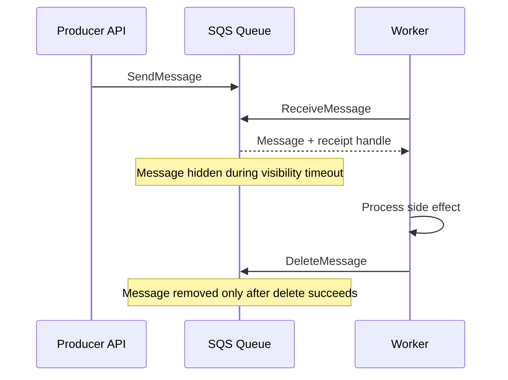
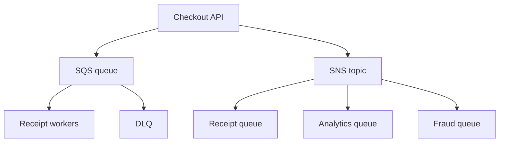

## Table of Contents

1. [The Problem](#the-problem)
2. [What Is Messaging](#what-is-messaging)
3. [Queues](#queues)
4. [Producers](#producers)
5. [Consumers](#consumers)
6. [Message Timeline](#message-timeline)
7. [Visibility Timeout](#visibility-timeout)
8. [Retries](#retries)
9. [Dead-Letter Queues](#dead-letter-queues)
10. [Standard And FIFO](#standard-and-fifo)
11. [Topics](#topics)
12. [Fanout](#fanout)
13. [Sample Messaging Shape](#sample-messaging-shape)
14. [Putting It All Together](#putting-it-all-together)
15. [What's Next](#whats-next)

## The Problem

The previous article put API Gateway in front of the orders API. Now the request reaches the backend cleanly. But not every piece of work belongs inside the request.

Checkout should create the order quickly. Around that core action, several slower things happen:

- A receipt email should be sent, but the email provider may be slow or rate-limited.
- A finance export should run later and can take minutes.
- A vendor fraud check may fail and need retry without losing the order.
- A search index should update, but customers should not wait for indexing.
- One bad worker release should not break checkout itself.

If the API calls every side system directly before responding, checkout becomes as fragile as the slowest dependency. The customer waits for work that does not need to finish immediately.

Messaging gives that work a place to wait.

## What Is Messaging

Messaging is the pattern of sending a small record from one component to another so the receiver can process it later or independently. The sender does not need the receiver to be online at the same moment. The receiver can work at its own pace.

At a high level, messaging is an asynchronous handoff contract. One component writes a durable work record or notification, and another component receives it later under explicit delivery, retry, and failure rules.

In AWS, the two first services to learn are SQS and SNS.

Amazon Simple Queue Service, or SQS, is a queue. It stores messages until consumers receive and process them. It is useful when one kind of worker needs to drain a backlog of work.

Amazon Simple Notification Service, or SNS, is a topic. Publishers send messages to the topic, and SNS pushes copies to subscribers such as SQS queues, Lambda functions, or HTTPS endpoints. It is useful when one publication should notify multiple destinations.

| Need | Service shape |
| --- | --- |
| Work should wait until a worker can process it | SQS queue |
| One message should notify several subscribers | SNS topic |
| Subscribers need their own retry and backlog | SNS topic fanout to SQS queues |

The useful distinction is wait versus announce. A queue lets work wait. A topic announces to subscribers.

## Queues

A queue stores messages between producers and consumers. For checkout, the API can put a message on `receipt-email-jobs` and return to the customer after the order is created. Receipt workers poll the queue and send emails when they have capacity.

An SQS queue acts as a durable buffer for work records. It decouples the producer's request path from the consumer's processing speed, retry behavior, and failure handling.

That changes the failure boundary. If the email provider is slow, messages build up in the queue. Checkout can still create orders. Operators can scale workers, pause workers, or let the backlog drain after the provider recovers.

A queue is a buffer with delivery behavior, retry behavior, visibility timeout, and monitoring signals. The queue owns the waiting state. Workers own the processing.

The gotcha is that a queue does not make work harmless. If workers send duplicate emails or call a rate-limited vendor too quickly, the queue preserves the work but does not fix the side effect. Worker code still needs idempotency and downstream limits.

## Producers

A producer sends messages to a queue or topic. In the orders system, the checkout API is the producer for receipt jobs. A storage event might be the producer for a thumbnail job. A scheduler might be the producer for nightly exports.

A producer is the component that creates the handoff record. It should publish enough stable identifiers for the consumer to find the work without embedding large mutable state into the message.

A good message is small and specific. It should contain the facts the consumer needs to find the real work, not a giant copy of every related object.

For receipt email, a message might include:

```json
{
  "type": "ReceiptRequested",
  "orderId": "order-1042",
  "receiptKey": "receipts/2026/05/order-1042.pdf",
  "requestedAt": "2026-05-14T12:40:00Z"
}
```

The message names the work. It does not attach the PDF. The PDF lives in S3. The order lives in RDS. The idempotency record may live in DynamoDB. Messaging connects the work without becoming the data store for everything.

## Consumers

A consumer receives messages and performs the work. The consumer might be an ECS worker, Lambda function, EC2 process, or another application. With SQS, consumers poll the queue, receive messages, process them, and delete them after success.

A consumer is the processing runtime for queued work. It temporarily claims a message, performs the side effect, and deletes the message only after successful completion.

That delete step matters. Receiving a message does not mean the work is done. It means one consumer has a chance to process it. The message leaves the queue only after successful processing and deletion.

This creates a useful recovery behavior. If the consumer crashes after receiving a message but before deleting it, the message can become visible again later. Another consumer can try. That is why consumers must be safe to retry.

The consumer contract is simple:

| Consumer step | Meaning |
| --- | --- |
| Receive | Claim temporary processing time |
| Process | Do the side effect safely |
| Delete | Tell the queue the work is complete |
| Fail or crash | Let the message return for another attempt |

The queue gives you retry opportunity. Idempotent worker code makes that retry safe.

## Message Timeline

SQS becomes much easier to reason about when you picture the message timeline.

The message timeline is the state machine for one SQS message. It moves from sent, to received and hidden, to deleted after success, or visible again after failure or timeout.



The receipt handle is important. The consumer does not delete by message ID alone; it deletes the specific received copy using the receipt handle returned by `ReceiveMessage`. If the worker crashes before `DeleteMessage`, SQS can make the message visible again after the visibility timeout.

This timeline explains why duplicate handling is not optional. A message can be received, processed, and then reappear if the delete step fails or the worker times out. The queue protects against losing work. Your consumer protects against repeating harmful work.

## Visibility Timeout

Visibility timeout is the period after a consumer receives an SQS message when that message is hidden from other consumers. The message remains in the queue, but other consumers cannot process it at the same time.

Visibility timeout is a temporary processing lease. It gives one consumer exclusive time to finish and delete the message before SQS makes that message available for another attempt.

This is one of the most important SQS concepts. If the timeout is too short, a second worker may receive the same message before the first worker finishes. If the timeout is too long, failed messages take too long to return after a worker crashes.

For a receipt worker that usually finishes in 10 seconds, a 2 minute timeout may be reasonable. For a video processing job, the worker may need to extend the timeout while it is still making progress. For work that can take longer than the SQS visibility model fits comfortably, another workflow pattern may be better.

Visibility timeout does not guarantee exactly-once processing. Standard queues use at-least-once delivery. A message can be delivered more than once, so consumers need idempotency.

That is the SQS bargain: the queue helps avoid loss and smooth pressure, while the application accepts that retry and duplicate handling are part of the design.


*An SQS message is not finished when a worker receives it. The message is hidden during the visibility timeout, deleted only after success, retried after failure, and eventually quarantined in a DLQ when repeated attempts cannot complete it.*

## Retries

Retries happen when work fails or does not finish. With SQS, if a message is not deleted before the visibility timeout expires, it can become visible again and be received for another attempt.

Retry behavior is the re-delivery path for unfinished work. It protects against temporary consumer failures, but it also means worker code must tolerate duplicate attempts.

Retries are useful when failure is temporary: a provider returned `429`, a network call timed out, or a worker restarted during deploy. They are dangerous when the message is permanently bad. A malformed message can fail forever, waste worker capacity, and hide newer work behind repeated attempts.

The retry design should answer:

| Question | Why it matters |
| --- | --- |
| How many attempts are useful? | Prevents endless churn |
| How long should one attempt be hidden? | Matches processing time |
| Which failures are safe to retry? | Avoids repeating harmful side effects |
| Where does poison work go? | Creates an inspection path |

Queues make retries visible. They do not remove the need to classify failure.

## Dead-Letter Queues

A dead-letter queue, or DLQ, receives messages that could not be processed successfully after the configured number of receives. It is the place for work that needs human review, a code fix, or a controlled redrive later.

A DLQ is a failure isolation queue. It separates repeatedly failing messages from the main work stream so operators can inspect, fix, or redrive them deliberately.

A DLQ prevents one bad message from looping forever in the main queue. It also creates evidence. Instead of saying "the worker is failing sometimes," the team can inspect the failed message, receive count, timestamps, and related logs.

The redrive policy decides when a message moves. Its `maxReceiveCount` is not a universal value. A payment worker that fails because of malformed input may need a low count so poison messages leave the main queue quickly. A worker calling a flaky vendor may need more attempts or a longer visibility timeout before the message is quarantined. The number should match the failure pattern and the cost of retrying.

The gotcha is that DLQ is not a deletion destination. It is a quarantine queue. Messages in a DLQ often represent customer-impacting work that did not complete. The team needs an owner and a review process.

For receipt emails, a DLQ message might mean a customer did not receive a receipt. Deleting the message without a record may hide the failure. Redriving it blindly may send duplicate emails if the worker bug is still present.

## Standard And FIFO

SQS has standard queues and FIFO queues. Standard queues are the default starting point for many workloads because they support high throughput and at-least-once delivery. They may deliver messages more than once and can deliver them out of exact order.

Queue type defines the delivery and ordering contract. Standard queues optimize for throughput and at-least-once delivery; FIFO queues add ordered message groups and deduplication behavior for workloads that require them.

FIFO queues are for workloads that need first-in-first-out processing within a message group and stronger deduplication behavior. They ask more from the design because message group IDs decide ordering lanes. Ordering is per message group, not necessarily across the entire queue unless every message uses the same group. That single-group design protects global order but also limits parallelism. For FIFO workloads where exact order matters, be careful with DLQs because moving one failed message out of the main queue can let later messages continue and change the visible processing order.

The beginner choice is:

| Need | Queue type |
| --- | --- |
| Independent jobs where duplicates are safe to handle | Standard queue |
| Strict order for related messages | FIFO queue |
| One customer/order must process in sequence | FIFO with careful message group design |
| Maximum simple throughput for independent work | Standard queue |

Do not choose FIFO only because it sounds safer. If every message uses the same group ID, the queue can serialize work that could have run in parallel. Choose FIFO when order is a real requirement, then design message groups deliberately.

## Topics

An SNS topic is a publication point. A producer publishes a message to the topic. SNS delivers copies to the topic's subscriptions.

An SNS topic functions as a publish-subscribe distribution point. The publisher writes one notification, and SNS delivers matching copies to configured subscribers.

Topics are useful when the publisher should not know every receiver. For example, checkout can publish `OrderCreated`. Receipt, analytics, search indexing, and fraud systems may all care. If checkout calls each of them directly, checkout becomes tightly wired to every downstream team. If checkout publishes to a topic, subscribers can be added without changing checkout code.

SNS subscriptions can include SQS queues, Lambda functions, HTTPS endpoints, and other destinations. Subscription filtering can let subscribers receive only messages that match attributes or message body fields.

The gotcha is fanout delivery behavior. A topic announces a message. It does not automatically give each subscriber a durable backlog unless the subscriber endpoint provides one. This is why SNS to SQS is a common pattern: SNS fans out, and each SQS queue gives one subscriber its own backlog and retry path.

## Fanout

Fanout means one published message is delivered to multiple subscribers. For the orders system, one `OrderCreated` message can create several independent paths:

Fanout is one-to-many message delivery. It is useful when each subscriber should react independently with its own backlog, retry rules, and operational ownership.

- Receipt service sends the customer email.
- Analytics service records conversion data.
- Search indexing updates customer support search.
- Fraud review starts a background check.

Each subscriber should own its own failure behavior. If analytics is down, receipt email should not stop. If fraud review is slow, search indexing should not wait.

SNS with SQS subscriptions is a clean fanout shape because each subscriber gets its own queue:

| Subscriber | Queue | Why it helps |
| --- | --- | --- |
| Receipt worker | `receipt-jobs` | Email retries do not block analytics |
| Analytics worker | `analytics-events` | Analytics can lag without losing events |
| Fraud worker | `fraud-review` | Fraud can apply provider-specific rate limits |

The message should still be designed carefully. If each subscriber needs different facts, publish the stable event facts and let each service read its own supporting data.

## Sample Messaging Shape

A checkout messaging shape might look like this:



The first path shows direct queue-backed work. The API sends one receipt job, and workers drain it. The second path shows fanout. One published event gives several subscribers their own queues.

The important detail is that queues make waiting visible. Queue depth, age of oldest message, receive count, and DLQ messages become operational signals.

## Putting It All Together

The opening checkout request had slow side work around it: receipt emails, exports, vendor calls, indexing, and retries. Running all of that inside the API request would make checkout fragile and slow.

SQS gives work a queue where it can wait. Producers send messages. Consumers receive, process, and delete messages. Visibility timeout gives one consumer a temporary processing window. Retries happen when work fails to finish. Dead-letter queues quarantine work that keeps failing. Standard and FIFO queues let the team choose between high-throughput independent work and ordered message groups. SNS topics publish messages to multiple subscribers, and SNS-to-SQS fanout gives each subscriber its own backlog.

Messaging is healthy when it makes pressure visible and failure contained. The customer request can finish. Background work can catch up. Downstream failures stop becoming every service's immediate problem.

## What's Next

Queues and topics move work between known components. The next article looks at broader event-driven architecture: event buses, rules, schedules, service events, and workflows where many systems react to facts without point-to-point wiring.


*Use this as the messaging checklist: keep producers small, let queues hold work, make consumers retry-safe, tune visibility timeout to processing time, inspect DLQs as quarantine, and use SNS fanout when one publication needs independent subscribers.*

---

**References**

- [Amazon SQS visibility timeout](https://docs.aws.amazon.com/AWSSimpleQueueService/latest/SQSDeveloperGuide/sqs-visibility-timeout.html). Supports the receive, visibility timeout, retry, at-least-once delivery, FIFO message group, and timeout guidance.
- [Configure a dead-letter queue using the Amazon SQS console](https://docs.aws.amazon.com/AWSSimpleQueueService/latest/SQSDeveloperGuide/sqs-configure-dead-letter-queue.html). Supports the DLQ explanation, `maxReceiveCount`, source queue relationship, and FIFO ordering warning.
- [Amazon SQS FIFO queues](https://docs.aws.amazon.com/AWSSimpleQueueService/latest/SQSDeveloperGuide/sqs-fifo-queues.html). Supports the per-message-group ordering and deduplication explanation.
- [Fanout Amazon SNS notifications to Amazon SQS queues for asynchronous processing](https://docs.aws.amazon.com/sns/latest/dg/sns-sqs-as-subscriber.html). Supports the SNS-to-SQS fanout pattern and the distinction between SNS push and SQS polling.
- [Amazon SNS message filtering](https://docs.aws.amazon.com/sns/latest/dg/sns-message-filtering.html). Supports the subscription filtering explanation.
- [Amazon SNS features](https://aws.amazon.com/sns/features/). Supports the standard and FIFO topic behavior, fanout, subscription types, and message durability discussion.
