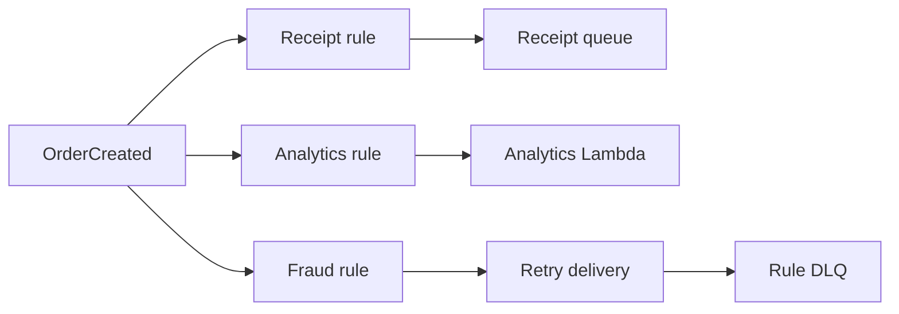
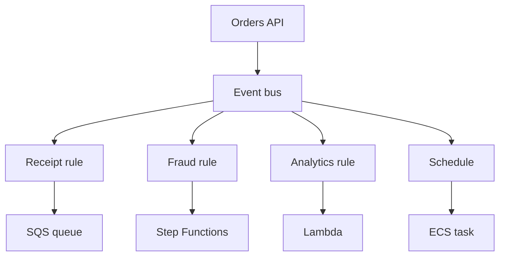

## Table of Contents

1. [The Problem](#the-problem)
2. [What Is Event-Driven Architecture](#what-is-event-driven-architecture)
3. [Events](#events)
4. [Event Buses](#event-buses)
5. [Rules](#rules)
6. [Targets](#targets)
7. [Delivery Failures and Redrive](#delivery-failures-and-redrive)
8. [Schedules](#schedules)
9. [Idempotency](#idempotency)
10. [Ordering](#ordering)
11. [Step Functions](#step-functions)
12. [Sample Event Shape](#sample-event-shape)
13. [Putting It All Together](#putting-it-all-together)
14. [What's Next](#whats-next)

## The Problem

The previous article showed how queues and topics move work between components. Now the orders system has a broader integration problem.

When an order is created, many teams care:

- Receipt email should start.
- Analytics should record the sale.
- Fraud review may need to inspect the order.
- Shipping should prepare fulfillment after payment is confirmed.
- A nightly reconciliation should run on a schedule.
- A failed workflow should leave evidence that operators can inspect.

If checkout directly calls every interested system, checkout becomes a map of the whole company. Every new subscriber changes checkout. Every slow subscriber threatens checkout. Every retry decision leaks into the wrong service.

Event-driven architecture changes the integration shape. A service publishes a fact. Other systems decide whether they care.

## What Is Event-Driven Architecture

Event-driven architecture is a way to connect systems through events. An event is a record that something happened. Instead of asking another service to do work right now, a producer says, "This fact is true now," and consumers react.

In AWS, Amazon EventBridge is the main service to learn for event routing. An event bus receives events. Rules match event patterns. Targets receive matching events. The target might be a Lambda function, SQS queue, SNS topic, Step Functions state machine, ECS task, or another supported destination.

The useful mental model is routing facts:

| Part | Job |
| --- | --- |
| Event | The fact that happened |
| Source | Who emitted it |
| Event bus | Where events arrive |
| Rule | Which events match this interest |
| Target | Where matching events are delivered |

Event-driven design is strongest when the producer should not know every future consumer. It is weaker when the producer needs an immediate answer before continuing. For immediate answers, use a request/response API. For work that should wait for one known worker, use a queue. For facts that many systems may react to, use events.

## Events

An event should describe something that already happened. `OrderCreated` is an event. `CreateOrder` is a command. That difference matters because it changes ownership.

A command asks another component to do something. The sender usually cares whether it succeeded. An event announces that something happened. The publisher should not need to know every reaction.

A small order event might look like this:

```json
{
  "source": "devpolaris.orders",
  "detail-type": "OrderCreated",
  "detail": {
    "orderId": "order-1042",
    "customerId": "cust-991",
    "createdAt": "2026-05-14T12:40:00Z"
  }
}
```

The event includes stable facts, not every database row. Consumers can use `orderId` to fetch the data they own or need. This keeps events small and prevents the event bus from becoming the system of record.

The gotcha is tense. If the payload says something happened, the producing service should commit the real state before publishing or have a reliable pattern that keeps state and event publication aligned. Otherwise consumers react to facts the system cannot prove.

## Event Buses

An EventBridge event bus receives events and routes them to targets through rules. AWS accounts have a default event bus that receives events from many AWS services. Teams can also create custom event buses for application events.

For the orders system, a custom `orders-events` bus can receive events such as `OrderCreated`, `PaymentCaptured`, and `RefundIssued`. Rules on that bus can route only the events each downstream system cares about.

The event bus is not the owner of the business state. RDS owns orders. S3 owns receipt PDFs. DynamoDB may own idempotency records. The event bus owns routing. That separation keeps the architecture readable.

Event buses are well-suited for many-to-many routing. One source can produce events that several targets receive. Many sources can send events that a shared operational target receives. The bus becomes the routing surface, not a database.

## Rules

Rules decide which events are sent to which targets. A rule uses an event pattern to match fields in the event, such as `source`, `detail-type`, or values inside `detail`.

For example, a receipt rule might match only order-created events:

```json
{
  "source": ["devpolaris.orders"],
  "detail-type": ["OrderCreated"]
}
```

An event can match more than one rule. It can also match no rules. Both outcomes are normal. If analytics, receipt, and fraud each have rules for `OrderCreated`, one event can trigger several targets. If no one cares about `CartViewed`, EventBridge can receive it and do nothing.

The gotcha is pattern precision. A broad rule can send too much work to a target. A too-narrow rule can silently miss events. Treat event patterns like route tables for facts: small changes can alter where the event goes.

## Targets

A target is the destination for a matched event. EventBridge supports many target types, including Lambda functions, SQS queues, SNS topics, Step Functions state machines, ECS tasks, and API destinations.

The target should match the work shape:

| Target | Good fit |
| --- | --- |
| Lambda | Small event handler |
| SQS | Durable backlog for a worker |
| SNS | Fanout through topic subscriptions |
| Step Functions | Multi-step workflow with state and branching |
| ECS task | Containerized job started by an event |
| API destination | Event delivered to an external HTTP endpoint |

EventBridge can also transform input before sending it to a target. That is useful when a target expects a smaller or different payload. Keep transformations understandable. If every target receives a heavily transformed event, debugging the original fact becomes harder.

Targets need permissions too. EventBridge must be allowed to invoke the target. A missing permission can make the event route look right while delivery fails.

## Delivery Failures and Redrive

Event routing is not the same thing as guaranteed business success. EventBridge can successfully match a rule and still fail to deliver to a target because the target permission is missing, the target is throttling, or the target returns an error.

For many target types, EventBridge retries failed invocations for a configured retry window. By default, EventBridge retries delivery for up to 24 hours and up to 185 attempts with exponential backoff and jitter. That is useful for temporary errors, but it also means targets can receive the same event more than once. If all retries are exhausted and no dead-letter queue is configured, EventBridge can drop the failed delivery after recording failure metrics. Configure a dead-letter queue when failed events need inspection instead of disappearing into metrics and logs.

The failure model is per target. If one `OrderCreated` event matches three rules, the receipt target can fail while analytics succeeds and fraud review is delayed. EventBridge does not automatically roll back the successful targets because another target failed.



This partial-failure behavior is why event consumers must be independently observable. Each target needs logs, metrics, idempotency, and an owner for redrive decisions. EventBridge routes facts; it does not guarantee that every downstream business reaction completed.


*EventBridge routes facts independently per target. One rule can succeed while another retries or moves to a DLQ, and a workflow target such as Step Functions is the right shape when the reaction has ordered state and branches.*

## Schedules

Not every event comes from a business action. Some work starts because time passed: nightly export, stale-cart cleanup, subscription renewal, backup verification, or report generation.

EventBridge can run scheduled work. AWS now recommends EventBridge Scheduler for scheduled invocations when you need a managed scheduling service. Scheduler can use rate or cron expressions, one-time schedules, flexible time windows, retries, and target invocation permissions.

The scheduling mental model is still event-shaped. Time becomes the source. The target receives an invocation because a schedule fired.

The gotcha is ownership. A schedule that starts a cleanup job can delete or change data. It deserves the same review as any other production writer: target, permissions, retry behavior, failure handling, and observability.

## Idempotency

Event-driven systems must expect retries and duplicates. A target may receive the same event more than once. A producer may publish twice after a retry. A subscriber may fail after doing the side effect but before recording success. EventBridge also gives each delivered event an ID, but application-level idempotency should usually use a stable business key when the business action must happen only once.

Idempotency means handling repeated input without repeating harmful side effects. If `OrderCreated` is delivered twice, the receipt service should not send two receipts. If `PaymentCaptured` is processed twice, fulfillment should not ship twice.

Use a stable event id or business id to protect side effects:

| Side effect | Idempotency key |
| --- | --- |
| Send receipt | `orderId + receiptType` |
| Start fraud review | `orderId + reviewVersion` |
| Create shipment | `orderId + shipmentType` |
| Write analytics event | Event id or business event key |

This is where the Storage and Databases module comes back. DynamoDB conditional writes, RDS uniqueness constraints, and S3 key design can all protect event handlers from duplicate side effects.

EventBridge routes facts. Your application still owns safe reaction.

## Ordering

Events often arrive in the order you hope for, until the day they do not. Distributed systems can retry, buffer, parallelize, and redeliver. EventBridge is a routing service, not a strict ordering engine for a business workflow. If a workflow needs strict ordering, design for it explicitly.

For example, `PaymentCaptured` should not be processed as if the order is ready if `OrderCreated` has not committed. A consumer that receives `PaymentCaptured` can fetch the current order state before acting. That is often safer than assuming event arrival order tells the whole truth.

Ordering expectations should be written down:

| Need | Better shape |
| --- | --- |
| Independent reactions to facts | EventBridge rules and targets |
| One worker drains ordered messages by group | SQS FIFO |
| Multi-step process with explicit order and state | Step Functions |
| Immediate request needs an answer now | API call |

Event-driven architecture reduces coupling, but it does not remove sequence from the business. It moves sequence decisions to the right place.

## Step Functions

Step Functions is AWS's workflow orchestration service. It lets a team define a state machine made of steps. Steps can call Lambda, AWS services, HTTP endpoints, or other work units. The workflow can branch, retry, catch errors, wait, run parallel paths, and keep execution history.

Use Step Functions when the process itself has important state and order. Fraud review may need: validate order, call provider, wait for manual review if risk is high, retry temporary provider errors, write the final decision, then notify fulfillment. That is more than "an event happened." It is a workflow.

Step Functions and EventBridge fit together. EventBridge can route `OrderCreated` to a Step Functions state machine. The state machine can then coordinate the multi-step process.

The gotcha is not to replace every event with a workflow. Loose events are better when independent subscribers react in their own way. Step Functions is better when one business process needs central coordination, visible state, branching, and error handling.

## Sample Event Shape

A small event-driven shape for orders might look like this:



The orders API publishes facts. EventBridge routes those facts. Receipt uses a queue because email can wait and retry. Fraud uses a workflow because review has steps and decisions. Analytics uses a handler. A schedule starts export work.

Each target owns its reaction. The producer owns the truth of the event it published.

## Putting It All Together

The opening system had too many interested parties for direct calls from checkout. Receipts, analytics, fraud, shipping, schedules, and reconciliation all cared about order facts in different ways.

Event-driven architecture gives those facts a routing layer. Events describe what happened. Event buses receive and route them. Rules match patterns. Targets receive the matching events. Delivery failures are handled per target with retries, DLQs, and redrive ownership. Schedules turn time into invocations. Idempotency protects side effects from duplicates. Ordering is designed where the business needs it. Step Functions coordinates processes that need explicit state, branching, retries, and history.

The design is healthy when producers publish stable facts, consumers own safe reactions, and workflows are used only where the process itself deserves coordination.

## What's Next

Application integration creates more paths for work to move. The next module, Observability, explains how to see those paths in production: logs, metrics, traces, dashboards, alarms, and correlation across API calls, queues, events, and workflows.


*Use this as the event-driven checklist: publish stable facts, route through an event bus, match with precise rules, choose targets by work shape, make reactions idempotent, and use Step Functions when the process itself needs visible state.*

---

**References**

- [Event buses in Amazon EventBridge](https://docs.aws.amazon.com/eventbridge/latest/userguide/eb-event-bus.html). Supports the event bus, source, rule, pattern, multi-rule matching, and target routing explanation.
- [Rules in Amazon EventBridge](https://docs.aws.amazon.com/eventbridge/latest/userguide/eb-rules.html). Supports the rule, event pattern, target, and schedule rule explanation.
- [Event bus targets in Amazon EventBridge](https://docs.aws.amazon.com/eventbridge/latest/userguide/eb-targets.html). Supports the target examples including Lambda, SQS, SNS, ECS tasks, Step Functions, API destinations, and target input shaping.
- [How EventBridge retries delivering events](https://docs.aws.amazon.com/eventbridge/latest/userguide/eb-rule-retry-policy.html). Supports the 24-hour, 185-attempt default retry behavior and DLQ recommendation.
- [Using dead-letter queues to process undelivered events in EventBridge](https://docs.aws.amazon.com/eventbridge/latest/userguide/eb-rule-dlq.html). Supports the DLQ redrive and failed target delivery explanation.
- [Using Amazon EventBridge Scheduler to start a Step Functions state machine execution](https://docs.aws.amazon.com/step-functions/latest/dg/using-eventbridge-scheduler.html). Supports the Scheduler explanation, including one-time and recurring schedules, flexible windows, retries, and target permissions.
- [What is Step Functions?](https://docs.aws.amazon.com/step-functions/latest/dg/welcome.html). Supports the state machine, workflow, task, execution, service integration, and use-case explanations.
- [Handling errors in Step Functions workflows](https://docs.aws.amazon.com/step-functions/latest/dg/concepts-error-handling.html). Supports the Step Functions retry, catch, timeout, and workflow error-handling explanation.
