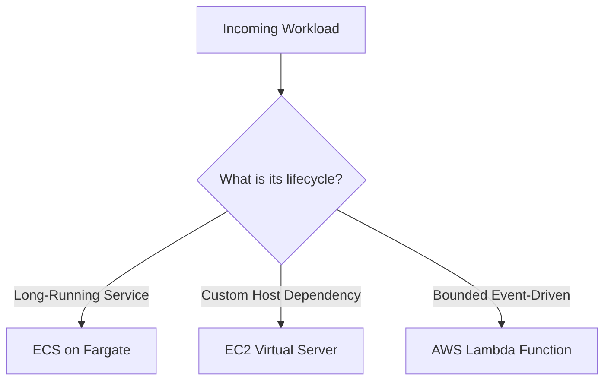

## Table of Contents

1. [The Localhost Execution Illusion](#the-localhost-execution-illusion)
2. [What Is Compute](#what-is-compute)
3. [The Workload Shape](#the-workload-shape)
4. [The Ownership Budget](#the-ownership-budget)
5. [EC2 vs. ECS Fargate](#ec2-vs-ecs-fargate)
6. [Connecting the Workloads](#connecting-the-workloads)
7. [Putting It All Together](#putting-it-all-together)
8. [What's Next](#whats-next)

## The Localhost Execution Illusion

When you run a software application on your local laptop during development, the physical environment that executes your code is simple and unified. The application process runs directly on the laptop guest operating system, binds to a local port like `3000`, writes logs directly to standard output or a local file on your hard drive, and reads environment configurations from a local dotenv file. If the process crashes, you press a key to restart it, and if it runs out of memory, you simply close unrelated personal browser tabs to free up resources.

However, once you are ready to host that application in the cloud for real users, this unified local trust environment disappears. You quickly realize that the single application codebase is not a single operational unit. It contains different jobs with entirely different execution lifecycles:

* A primary checkout API that must stay online constantly and answer user HTTP requests instantly.
* A specialized enterprise fraud-detection worker that intercepts network packets via a custom-compiled Linux kernel module (`sec-audit.ko`) to analyze socket buffers in kernel space, and enforces a node-locked vendor license tied directly to the host's physical motherboard GUID and the primary network card's static MAC address.
* Nightly email campaigns, financial exports, and database cleanups that only need to run once a day or when a queue message arrives.

Trying to force all of these tasks onto the same virtual server or runtime environment creates massive operational friction. The continuous API process can choke during a heavy background export batch, a crash in the email campaign script can bring down the entire checkout checkout path, and you spend your cloud budget paying for idle servers that do nothing but wait for nightly exports. To deploy software successfully in the cloud, you must step back from the specific tool names and build a systematic mental model around application compute.

## What Is Compute

Compute is the generic term for the physical hardware and virtual operating environments that execute your application code. In plain English, compute is the combination of virtual CPU, memory (RAM), storage, networking interfaces, and process supervisors that actually runs your software.

On your laptop, the compute layer is your machine. In AWS, you do not buy physical computer racks; instead, you rent slices of CPU and memory programmatically via APIs. AWS divides these compute slices into distinct service families, each offering a different operational contract. To choose the right home for your code, you must evaluate three core styles of compute:

* **Virtual Servers (Amazon EC2)**: Virtual machines that you configure, patch, and manage directly. It behaves exactly like renting a private Linux server in a remote data center.
* **Managed Container Services (Amazon ECS with AWS Fargate)**: A container orchestrator that runs your packaged Docker images directly as a service, without making your team manage or patch the underlying virtual machines.
* **Serverless Functions (AWS Lambda)**: Event-driven compute that executes isolated blocks of code only when triggered by an incoming event, shutting down completely when the work is finished.

The choice of compute is not a ranking of which service is the most advanced. It is a design decision about what shape your workload has, and how much operational responsibility your team is prepared to carry under its engineering budget.

By mapping your application's distinct functions to these three runtime profiles, you can run a single product across multiple compute styles. Your web API can run on containers, your legacy background processes on virtual servers, and your side effects on serverless functions, with all of these sharing the same database while maintaining clean, isolated operational boundaries.

## The Workload Shape

Before comparing specific AWS service features, you must describe the work your code performs in plain English. This is the practice of identifying the workload shape:

* **Service-Shaped (Continuous)**: Workloads that must listen on a network port constantly to answer incoming public traffic. They require steady-state compute replicas, load balancer target registrations, active health checks, and rolling deploy rollouts. The primary Node checkout API is a service-shaped workload.
* **Host-Shaped (Server-Dependent)**: Workloads that depend directly on the specific guest operating system kernel or physical machine identifiers. This includes software requiring custom kernel module installations, direct access to physical CPU performance-monitoring counters (PMUs) for anomaly detection, or proprietary licensing systems bound to static hardware assets like MAC addresses. These workloads cannot run on serverless container engines like Fargate, which share a locked host kernel and dynamically rotate task network interfaces on every single deployment. The specialized fraud-detection worker is a classic host-shaped workload.
* **Event-Shaped (Reactive)**: Workloads that only execute when triggered by an external event. They do not need to listen on a port all day; instead, they boot, process a single message or file, and exit. The receipt email sender and nightly financial exports are event-shaped workloads.

Filing your tasks by their natural shape prevents you from over-engineering simple features or under-engineering complex runtimes.

Workload Characterization Matrix:

* **orders-api (Continuous)**:
  * Port Listener: Yes, binds to port `3000`.
  * Trigger: Public HTTP requests from an Application Load Balancer.
  * Idle State: Must remain active to accept traffic.
  * Primary Home: ECS with Fargate.
* **fraud-worker (Server-Dependent)**:
  * Port Listener: No.
  * Trigger: Continuous queue polling, hardware performance counter monitoring, and low-level kernel module execution.
  * Idle State: Runs host security monitoring agents, local socket audits, and kernel driver loops constantly on dedicated guest hardware.
  * Primary Home: EC2 (demands direct guest OS administrative root, custom kernel driver insertions via `insmod`, and static hardware card bindings).
* **receipt-job (Event-Driven)**:
  * Port Listener: No.
  * Trigger: An SQS queue message arrives.
  * Idle State: Shuts down completely, costing zero.
  * Primary Home: Lambda.

By identifying these shapes first, you ensure that you do not force a short event campaign to run on a permanent, expensive virtual machine, or overload a critical long-running HTTP server with memory-intensive file processing tasks.

## The Ownership Budget

Every compute choice is an operational trade-off. The key to choosing the right service is evaluating your team's ownership budget: the amount of administrative work, security patching, process monitoring, and capacity scaling your engineers are prepared to carry.

As you move from virtual servers to serverless functions, the physical infrastructure tasks are shifted onto AWS, but you gain new design rules that you must enforce in your application architecture.

Compute Ownership Trade-offs:

* **Amazon EC2 (Virtual Servers)**:
  * What AWS Operates: Physical server racks, virtualization layer, network cables, and power delivery.
  * What Your Team Operates: Guest operating system selection, security patching, library updates, process managers (like systemd), log file rotation, and scaling rules.
  * Operational Vibe: Absolute control. If your code needs a custom kernel module or specific system agent, you can configure it directly.
* **Amazon ECS on AWS Fargate (Containers)**:
  * What AWS Operates: Host operating system patching, container engine runtime, cluster server fleet, and physical hardware.
  * What Your Team Operates: Container image packaging, task definitions, environment variables, network port mappings, and load balancer target health paths.
  * Operational Vibe: Managed services. You focus on the container interface and the application process, leaving the virtual machines to AWS.
* **AWS Lambda (Serverless Functions)**:
  * What AWS Operates: Complete execution environment lifecycle, horizontal capacity scaling, network routing, and platform runtimes.
  * What Your Team Operates: Single handler code logic, event input validations, function timeout boundaries, memory sizing, and retry idempotency keys.
  * Operational Vibe: Zero infrastructure. You pay only for the exact milliseconds your code executes, but you must design for transient environments, cold starts, and database connection limits.

If you have a small engineering team with zero dedicated systems administrators, choosing EC2 for your entire application stack means your developers will spend valuable time managing OS security updates and writing custom monitoring scripts instead of building product features. 

For such teams, defaulting to ECS with Fargate for continuous containers and AWS Lambda for event jobs matches their ownership budget, allowing them to focus entirely on the application boundary.

## EC2 vs. ECS Fargate

When you deploy a long-running, continuous workload on AWS, the core architectural decision centers on whether to host your application directly on Amazon EC2 virtual servers or utilize Amazon ECS on AWS Fargate. While both services provide elastic, cloud-based compute, they operate under fundamentally different infrastructure contracts and engineering lifecycles.

To select the correct home, you must evaluate how their operational footprints compare across five core dimensions:

### 1. Operating System and Kernel Control
* **Amazon EC2**: Gives your team absolute administrative root control over a dedicated guest operating system. You choose the Linux distribution, build custom kernel images, load proprietary kernel extensions (`.ko` binary drivers), and tune low-level TCP/IP socket structures or kernel namespace limits directly.
* **AWS Fargate**: Runs your application containers on a shared, highly optimized Linux host kernel managed entirely by AWS. Your container processes are strictly blocked from loading kernel modules, modifying host network interfaces, or executing privileged root-level hardware calls.

### 2. Resource and Network Ephemerality
* **Amazon EC2**: Virtual machines are stable, running environments. You can assign static Elastic IPs directly to host interfaces, attach persistent EBS volumes that survive OS reboots, and maintain stable network configurations.
* **AWS Fargate**: Container tasks are designed to be completely ephemeral and stateless. Every new deployment, autoscaling event, or task replacement provisions a fresh network interface (ENI) with a dynamic private IP address from your VPC pool, rotating all host identifiers.

### 3. Startup Speed and Provisioning Latency
* **Amazon EC2**: Launching a new instance requires hypervisor initialization, guest OS boot stages, and the execution of User Data bootstrap scripts. This boot sequence typically takes between 1 and 3 minutes before the application can actively accept traffic.
* **AWS Fargate**: Tasks bypass guest OS virtualization boot stages. The Fargate container engine pulls your packaged Docker image directly from ECR and boots the application process in 30 to 90 seconds, providing much faster horizontal scaling response.

### 4. Administrative and Patching Overhead
* **Amazon EC2**: Your team carries full operational ownership of the guest OS. You must manage runtime security patches, rotate local log files via `logrotate` to prevent disk saturation, configure daemon supervisors like `systemd`, and monitor virtual disk space.
* **AWS Fargate**: AWS completely handles all host operating system patching, hypervisor security, ECS agent updates, and underlying hardware provisioning. Your team manages only the container definition and application code, reducing administrative overhead to near zero.

### 5. Cost Mechanics
* **Amazon EC2**: You pay a flat hourly rate for the selected instance size, regardless of whether your application process is consuming 5% or 95% of the allocated CPU and memory. This is highly cost-effective for steady-state workloads that can fully utilize a dedicated machine.
* **AWS Fargate**: You are billed per second strictly for the exact CPU and memory resources requested by your running container tasks. There is no paying for idle VM operating systems, but high-scale, continuous workloads can sometimes incur a premium compared to fully utilized raw EC2 instances.

### Compute Comparison Matrix

The table below provides a side-by-side architectural blueprint to guide your hosting choice:

| Architectural Dimension | Amazon EC2 (Virtual Servers) | Amazon ECS with AWS Fargate (Serverless Containers) |
| :--- | :--- | :--- |
| **Operational Interface** | Virtual Guest OS (Linux/Windows) | Packaged Container Image (Docker/OCI) |
| **OS Kernel Access** | Absolute. Root access, custom kernel modules. | None. Shared, locked host kernel managed by AWS. |
| **Host Identifiers** | Stable. Motherboard GUIDs, MACs, EBS disk volumes. | Ephemeral. Dynamic ENI IPs, rotating host parameters. |
| **Patching Responsibility** | Customer manages guest OS security and updates. | AWS manages host OS; Customer manages container. |
| **Process Supervisor** | Guest OS init systems (e.g., `systemd`). | ECS Service Controller task health monitoring. |
| **Scaling & Boot Speed** | 1–3 minutes (OS virtualization boot + user data). | 30–90 seconds (direct container process launch). |
| **Billing Increment** | Per-second for the entire virtual machine. | Per-second for configured task vCPU and RAM. |

### Architectural Recommendations

Selecting between these two compute models is a design decision about matching your workload's system dependencies to your team's engineering capacity:

* **Default to ECS Fargate**: For 95% of standard web applications, REST/GraphQL APIs, queue-processing microservices, and background workers. If your code can run inside a standard Docker container and communicates over standard TCP/UDP ports, Fargate is the superior choice. It eliminates host patching, disk failures, and systemd maintenance, allowing a small team to operate a global service with minimal system administration budget.
* **Choose Amazon EC2 Only Under Special Constraints**: Select virtual servers exclusively when your workload is physically incompatible with container virtualization. The explicit technical triggers that mandate choosing EC2 are:
  * **Custom Kernel Drivers**: The application must insert proprietary Linux kernel modules (`.ko` binary drivers via `insmod`) to inspect low-level system call buffers or perform custom packet capture at the network card level.
  * **Node-Locked Software Licensing**: The software vendor enforces a node-locked licensing model tied to the host's physical motherboard UUID, boot disk hardware volume serial number, or a static MAC address that cannot tolerate the ephemeral, rotating nature of container ENIs.
  * **Legacy Virtualization**: The workload requires nested virtualization (such as launching guest hypervisors or running Android OS emulators) that serverless container runtimes physically block.
  * **Specialized Hardware Tuning**: The system demands direct, raw access to physical hardware Performance Monitoring Units (PMUs) or highly customized block-storage RAID array formatting that container file boundaries abstract away.

By applying this decision framework, you prevent your engineering team from carrying unnecessary administrative burdens, while guaranteeing that specialized, host-dependent workloads receive the deep OS and hardware control they require.

## Connecting the Workloads

No compute runtime operates in isolation. Once you distribute your application across EC2, ECS, and Lambda, you must connect them using clean network and messaging paths:

* **HTTP Request Routing**: The public entry point should hit an Application Load Balancer. The load balancer checks target health and routes HTTP traffic directly to your continuous ECS container tasks.
* **Decoupled Messaging**: The checkout API should not call the receipt email function directly on the request path. Instead, the API writes a quick message to an SQS queue, and the queue automatically triggers the Lambda email function in the background. If the email provider is down, the message remains safely in the queue, and the user's checkout experience is not interrupted.
* **Private API Access**: Host-dependent workers on EC2 sit privately inside private subnets, polling the database or communicating securely over internal VPC paths without ever exposing public ports to the internet.

By separating and decoupling your compute workloads, you build a system that is naturally secure, highly resilient to traffic spikes, and simple to observe and debug during production incidents.

## Putting It All Together

Evaluating AWS compute is the practice of matching application needs to the right runtime environment:

* **Analyze the Workload First**: Describe your code's functional lifecycle in plain English before looking at AWS console menus.
* **Run a Distributed Stack**: Do not assume that your entire system must run on the same service. Use containers for your main API, virtual machines for custom OS needs, and functions for reactive tasks.
* **Budget Your Operational Burden**: Choose the compute style that matches what your engineering team can realistically operate. If you cannot support 24/7 server patching, choose Fargate and Lambda.
* **Decouple with Queues**: Protect your main request paths by pushing background side effects to event-driven queues and serverless invocation loops.

By designing your compute around workload shapes and team ownership, you build a system that is cost-efficient, resilient, and manageable at any scale.

## What's Next

We now have a clean mental model for choosing where our application code should run in AWS. However, to operate virtual machines effectively when a host-shaped workload truly demands it, we must understand the baseline compute service under the cloud. In the next article, we will go deep into EC2 virtual servers, deconstructing AMIs, instance types, EBS storage volumes, automated boot scripts, and process daemons.

---

**References**

- [Amazon EC2 Overview](https://docs.aws.amazon.com/AWSEC2/latest/UserGuide/concepts.html) - Introduction to elastic virtual servers and instance management.
- [Amazon ECS on AWS Fargate](https://docs.aws.amazon.com/AmazonECS/latest/developerguide/AWS_Fargate.html) - Technical details on running serverless containers without managing EC2 host fleets.
- [AWS Lambda Basics](https://docs.aws.amazon.com/lambda/latest/dg/welcome.html) - Technical documentation on event-driven, serverless execution lifecycles.
