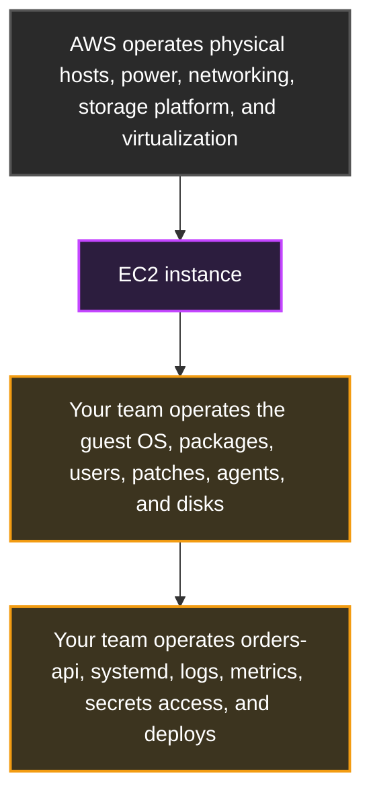
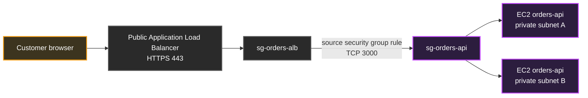
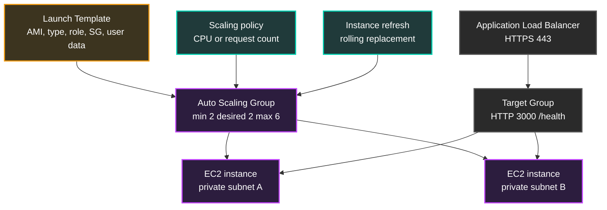
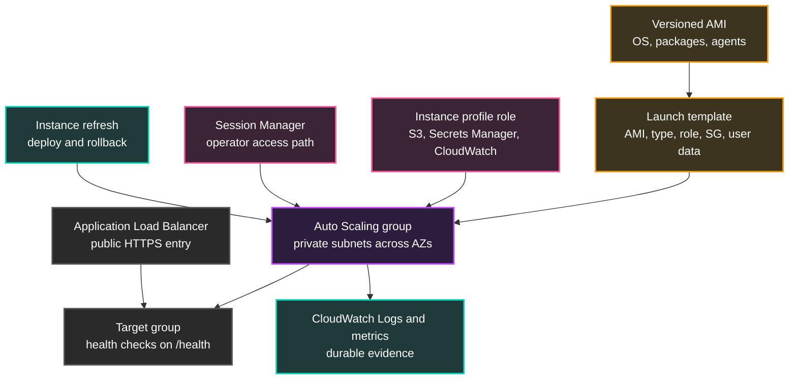

## Table of Contents

1. [The EC2 Path](#the-ec2-path)
2. [What Is EC2](#what-is-ec2)
3. [AMIs, Instance Types, and Storage](#amis-instance-types-and-storage)
4. [Network Placement and Access](#network-placement-and-access)
5. [Instance Roles, Metadata, and Secrets](#instance-roles-metadata-and-secrets)
6. [First Boot with User Data](#first-boot-with-user-data)
7. [Keeping the Process Alive with systemd](#keeping-the-process-alive-with-systemd)
8. [From One Instance to a Fleet](#from-one-instance-to-a-fleet)
9. [Deployments, Rollback, and Patching](#deployments-rollback-and-patching)
10. [Operating Evidence During an Incident](#operating-evidence-during-an-incident)
11. [Putting It All Together](#putting-it-all-together)
12. [What's Next](#whats-next)

## The EC2 Path
<!-- section-summary: EC2 makes sense after you connect the server, boot image, network, identity, process, fleet, and operating evidence. -->

In the previous compute article, we sorted AWS compute into server-shaped, container-shaped, and event-shaped choices. **Amazon EC2** is the server-shaped option. It gives a team a virtual machine with an operating system, a disk, a network interface, host-level processes, and the familiar feeling of a Linux box that can run almost anything.

That familiar shape can trick a team into treating EC2 like one precious server. A developer SSHs into it, installs packages by hand, starts the app in a terminal, fixes a file at midnight, and suddenly the production runtime exists only in someone's shell history. That version of EC2 causes pain because a failed instance, a bad patch, or a lost disk turns into a rebuilding mystery.

So we will follow one concrete service: `devpolaris-orders-api`, a Node.js API that listens on port `3000`. It needs to call S3 for release artifacts, CloudWatch for logs, and Secrets Manager for runtime configuration. The team chooses EC2 because the app depends on a legacy PDF engine and a host-level monitoring agent that need normal Linux package access.

Here is the path we will build through the article. Each row connects the beginner question to the production habit we want the orders team to practice.

| Piece | Beginner question | Production answer |
|---|---|---|
| **EC2 instance** | What is actually running my code? | A virtual server in a VPC subnet with a guest operating system your team operates. |
| **AMI and instance type** | What does the server boot from, and how much hardware does it get? | A versioned boot image plus a measured CPU, memory, network, and storage shape. |
| **Subnet, security group, and access path** | Who can reach the server? | Users reach the load balancer, the load balancer reaches the instance, and operators use Session Manager. |
| **Instance role and metadata** | How does the app call AWS without access keys on disk? | The instance profile delivers temporary role credentials through the metadata path. |
| **User data and systemd** | How does a new server turn into a working app server? | First-boot automation installs the release, and systemd keeps the process tied to the OS lifecycle. |
| **Launch template and Auto Scaling group** | How does one server turn into a fleet? | A versioned server recipe feeds an Auto Scaling group behind an Application Load Balancer. |
| **Patching, deployment, and evidence** | How does the team operate it every week? | New images, instance refreshes, rollback versions, logs, metrics, status checks, and patch findings drive the routine. |

This is the main idea for the whole article: EC2 gives control, and control creates operating work. We keep that work under control by making every instance replaceable, private, observable, and launched from a recipe. Every section adds one part of that recipe.

## What Is EC2
<!-- section-summary: EC2 is AWS virtual-machine compute, where AWS runs the physical platform and your team runs the guest operating system and application process. -->

An **EC2 instance** is a virtual server in the AWS cloud. AWS runs the data center, physical host, network hardware, storage platform, and virtualization layer. Your team chooses the operating system image, virtual hardware size, subnet, firewall rules, attached disks, host packages, application process, and monitoring agents.

That split matters because EC2 gives more control than managed runtimes like Lambda or Fargate. On EC2, the team can install Linux packages, tune kernel settings, run a process manager, attach block storage, place custom agents on the host, and inspect OS logs. The same freedom also means the team owns OS patching, disk pressure, log shipping, process crashes, SSH or Session Manager access, and cleanup of old instances.

For the orders API, EC2 fits because the PDF engine ships as a native Linux package and needs fonts installed at the OS level. The monitoring team also requires an agent that reads host metrics and local log files. Those are normal server tasks, so a virtual machine gives the team the right boundary.

The boundary has two sides. AWS operates the platform below the instance, while the application team owns the guest operating system and service runtime above it.



EC2 often appears in production for workloads that need host control, stable server processes, licensed software, background workers, special networking, or a migration path from an existing virtual machine. A team might later move the app to ECS, EKS, or Lambda after packaging and operating needs change. For now, the orders team has chosen a server, so the next question is what kind of server AWS should create.

## AMIs, Instance Types, and Storage
<!-- section-summary: AMIs define the boot image, instance types define the virtual hardware, and storage choices decide what survives instance replacement. -->

An **Amazon Machine Image**, usually called an **AMI**, is the boot template for an EC2 instance. It contains the operating system and any software baked into the image. For example, the orders team might build an AMI named `orders-api-2026-06-13` with Amazon Linux, the PDF engine, the CloudWatch agent package, company CA certificates, and baseline security settings already installed.

An **instance type** is the virtual hardware shape. It controls the CPU, memory, network performance, storage performance, processor family, and sometimes local instance storage. A `t4g.small` can work for a low-traffic development API, while an `m7i.large` or `c7g.large` might fit a busier production service after the team measures CPU and memory under real traffic.

The AMI and instance type answer different questions. The storage choices then decide which files belong to the replaceable server and which files need a durable home.

| Choice | What it answers | Orders API example |
|---|---|---|
| **AMI** | What operating system and baseline software boot? | `ami-0abc...` with Amazon Linux, PDF packages, agents, and hardening. |
| **Instance type** | How much virtual hardware does the guest receive? | `m7i.large` for steady CPU and memory after load testing. |
| **Root EBS volume** | Where does the OS disk live? | A `gp3` root volume sized for OS, packages, and temporary install files. |
| **Data volume** | Where does local application data live? | A separate EBS volume only for workloads that truly need host-attached state. |
| **Instance store** | What temporary local disk exists on some instance families? | Scratch space for cache files that can disappear during stop, termination, or host replacement. |

**Amazon EBS** gives EC2 persistent block storage. A block volume behaves like a disk attached to the instance, and it lives in one Availability Zone. The root EBS volume usually contains the operating system. Extra EBS volumes can store application data, but a web API fleet usually keeps durable data in regional services such as RDS, DynamoDB, S3, or EFS so any one instance can disappear.

For a replaceable EC2 service, the team treats the AMI as a versioned baseline and the instance as temporary capacity. If someone patches a package by hand on one running server, that change only lives on that one server. The next instance launched by Auto Scaling still boots from the AMI and user data recipe, so production practice pushes package changes into the next AMI or bootstrap version.

Teams usually build AMIs with tools such as EC2 Image Builder, Packer, or a CI pipeline that runs hardening and smoke tests before publishing the image ID. The important habit is versioning the image and recording which app release expects it. For the orders API, the deployment record might say: app release `2026.06.13.4` runs on AMI `orders-api-2026-06-13`, with launch template version `12`.

An operator can inspect the current server shape with the AWS CLI. This check is useful during both reviews and incidents because it shows the real instance AWS is running now.

```bash
aws ec2 describe-instances \
  --instance-ids i-orders-api-01 \
  --query "Reservations[].Instances[].{State:State.Name,Type:InstanceType,Image:ImageId,Subnet:SubnetId,PrivateIp:PrivateIpAddress,Profile:IamInstanceProfile.Arn,SecurityGroups:SecurityGroups[].GroupId}" \
  --output table
```

The value of that command is evidence rather than repair. It gives the team the current instance facts: which AMI booted, which instance type runs, where the instance sits, which private IP it has, and which instance profile gives it AWS permissions. Once the server shape is visible, the next question is who can reach it.

## Network Placement and Access
<!-- section-summary: A production EC2 app usually sits in private subnets, accepts traffic from the load balancer security group, and uses Session Manager for operator shell access. -->

A **subnet** is a range of IP addresses inside a VPC, and each subnet lives in one Availability Zone. EC2 instances launch into subnets, so subnet placement controls the network neighborhood for the server. For the orders API, the application instances belong in private application subnets across at least two Availability Zones.

A **security group** is a stateful virtual firewall attached to the instance network interface. Stateful means return traffic for an allowed connection can flow back without a separate reverse rule. The orders API instance security group should allow inbound TCP `3000` from the Application Load Balancer security group, because users reach the load balancer first.

The public request path should stay narrow. Customers reach the ALB, and the ALB security group acts as the allowed source for the private application instances.



That security group rule is more stable than allowing a list of load balancer IP addresses. Load balancer nodes can change, and EC2 instances can change, but the security group identity stays attached to the application role in the network. The rule is small enough to read directly:

```bash
aws ec2 authorize-security-group-ingress \
  --group-id sg-orders-api \
  --protocol tcp \
  --port 3000 \
  --source-group sg-orders-alb
```

Operator shell access needs a separate path from customer traffic. **AWS Systems Manager Session Manager** gives operators an interactive shell through AWS APIs without opening inbound SSH, running a bastion host, or managing SSH key pairs. The instance needs the SSM Agent, an instance role with Systems Manager permissions, and network egress to Systems Manager endpoints through NAT or VPC endpoints.

The operator command looks simple because the access setup lives in IAM, SSM Agent, and network egress. The shell opens through Systems Manager instead of an inbound port on the instance.

```bash
aws ssm start-session --target i-orders-api-01
```

Behind that command, the local SSM Agent maintains an outbound control path to Systems Manager. IAM decides who can start a session, and Session Manager preferences can send session logs to CloudWatch Logs or S3. That gives the team an access path that fits audit and private networking better than public port `22`.

Network access now has a clean shape: customers reach the ALB, the ALB reaches private instances, and operators reach instances through Session Manager. The application also needs to call AWS APIs, and that brings us to instance roles.

## Instance Roles, Metadata, and Secrets
<!-- section-summary: An EC2 instance profile gives applications temporary AWS credentials through the metadata path, so servers can avoid stored access keys. -->

An **IAM role** is an AWS identity that can receive temporary credentials. An **instance profile** is the wrapper EC2 uses to attach one IAM role to an instance. The practical result is that code running on the instance can call AWS services without a static access key stored in `/home/orders-app/.aws/credentials`, an environment variable, or a deployment script.

For the orders API, the instance role might allow three narrow jobs: read the release artifact from one S3 prefix during boot, read one Secrets Manager secret at runtime, and write logs or metrics to the expected CloudWatch destinations. The role should avoid broad permissions such as `s3:*` on every bucket because a compromised instance would then receive the same broad access.

A scoped policy shape might look like this. It gives the orders host access to the exact artifact, secret, and log destination the service needs.

```json
{
  "Version": "2012-10-17",
  "Statement": [
    {
      "Sid": "ReadOrdersReleaseArtifacts",
      "Effect": "Allow",
      "Action": [
        "s3:GetObject"
      ],
      "Resource": "arn:aws:s3:::devpolaris-artifacts-prod/orders-api/*"
    },
    {
      "Sid": "ReadOrdersRuntimeSecret",
      "Effect": "Allow",
      "Action": [
        "secretsmanager:GetSecretValue"
      ],
      "Resource": "arn:aws:secretsmanager:us-east-1:123456789012:secret:prod/orders-api/runtime-*"
    },
    {
      "Sid": "WriteOrdersLogs",
      "Effect": "Allow",
      "Action": [
        "logs:CreateLogStream",
        "logs:PutLogEvents"
      ],
      "Resource": "arn:aws:logs:us-east-1:123456789012:log-group:/aws/ec2/orders-api:*"
    }
  ]
}
```

The instance receives these temporary credentials through the **Instance Metadata Service**, or **IMDS**. IMDS is a link-local HTTP service reachable from inside the instance. Modern EC2 configurations should require **IMDSv2**, which adds a token request before metadata is returned and reduces the risk from common server-side request forgery paths.

Applications usually get these credentials through the AWS SDK credential provider chain rather than direct IMDS calls. The SDK finds the role credentials, refreshes them, and signs AWS API requests. That means the Node.js code can call Secrets Manager with normal SDK code, while the instance role controls what that code can read.

User data deserves special care here. User data is useful for boot instructions, and AWS documents that it can be viewed from the instance metadata path. For that reason, user data should contain IDs, paths, and release versions, while passwords, API tokens, and database URLs should live in a secret store or parameter store and be read with the instance role.

Now the instance can reach AWS safely. The next problem is turning a fresh boot into a working application server without someone typing commands by hand.

## First Boot with User Data
<!-- section-summary: User data gives a new EC2 instance a small first-boot handoff that installs the release and prepares the service without manual shell work. -->

**User data** is launch-time input that EC2 passes to the instance. On Linux, teams commonly provide a shell script or cloud-init configuration. AWS documents a raw user data limit of 16 KB before base64 encoding, and default Linux user data behavior runs during the first boot cycle after launch.

That size and lifecycle tell us how to use it. User data works well as a small handoff: install a few packages, create a service user, fetch a versioned artifact, place files, write a systemd unit, and start the service. Large configuration systems usually belong in an AMI build, a configuration management tool, or a bootstrap script downloaded from a trusted artifact location.

Here is a realistic first-boot script for the orders API. The script stays short enough to review, and the bigger software baseline belongs in the AMI.

```bash
#!/bin/bash
set -euo pipefail

dnf update -y
dnf install -y nodejs amazon-cloudwatch-agent

id orders-app >/dev/null 2>&1 || useradd --system --home-dir /opt/orders-api --shell /sbin/nologin orders-app

install -d -o orders-app -g orders-app /opt/orders-api
install -d -o orders-app -g orders-app /var/log/orders-api
install -d -m 0755 /etc/orders-api

aws s3 cp s3://devpolaris-artifacts-prod/orders-api/releases/2026.06.13.4.tgz /tmp/orders-api.tgz
tar -xzf /tmp/orders-api.tgz -C /opt/orders-api --strip-components=1
chown -R orders-app:orders-app /opt/orders-api

cat >/etc/orders-api/runtime.env <<'ENV'
PORT=3000
NODE_ENV=production
CONFIG_SECRET_ID=prod/orders-api/runtime
ENV
chown root:orders-app /etc/orders-api/runtime.env
chmod 0640 /etc/orders-api/runtime.env

cat >/etc/systemd/system/orders-api.service <<'UNIT'
[Unit]
Description=DevPolaris Orders API
After=network-online.target
Wants=network-online.target

[Service]
Type=simple
User=orders-app
Group=orders-app
WorkingDirectory=/opt/orders-api
EnvironmentFile=/etc/orders-api/runtime.env
ExecStart=/usr/bin/node server.js
Restart=on-failure
RestartSec=5
NoNewPrivileges=true
ProtectSystem=strict
ReadWritePaths=/var/log/orders-api
StandardOutput=append:/var/log/orders-api/stdout.log
StandardError=append:/var/log/orders-api/stderr.log

[Install]
WantedBy=multi-user.target
UNIT

systemctl daemon-reload
systemctl enable --now orders-api
```

Several production habits are hiding in this small script. The app runs under the dedicated `orders-app` user instead of `root`. The release comes from a versioned S3 path, so the team can tell which code a new instance downloaded. The script stores only a secret ID instead of the secret value, and the application can use its instance role to read the secret at runtime.

The script also creates the systemd unit before enabling the service. Some teams bake the unit into the AMI and let user data only choose the release version. Both patterns can work, but every new instance needs a repeatable path from boot to a healthy `/health` response.

Boot failures need evidence. On Amazon Linux and many cloud-init based images, the team usually checks user data output, the service status, and the local health endpoint through Session Manager. These checks separate a failed boot script from a failed application process:

```bash
sudo tail -n 100 /var/log/cloud-init-output.log
sudo systemctl status orders-api --no-pager
curl -fsS http://localhost:3000/health
```

User data got the files onto the box. The application now needs a supervisor so it survives restarts, crashes, and normal OS boot.

## Keeping the Process Alive with systemd
<!-- section-summary: systemd gives the application a service contract with a user, working directory, restart policy, logs, and boot integration. -->

**systemd** is the service manager used by many Linux distributions. It starts services during boot, tracks process state, restarts failed processes when configured, and gives operators a standard command surface through `systemctl` and `journalctl`. For EC2, systemd turns the app from "a command someone ran" into "a service the operating system owns."

Here is the service unit from the previous section in its own view. The unit file is the contract between the operating system and the application process.

```ini
[Unit]
Description=DevPolaris Orders API
After=network-online.target
Wants=network-online.target

[Service]
Type=simple
User=orders-app
Group=orders-app
WorkingDirectory=/opt/orders-api
EnvironmentFile=/etc/orders-api/runtime.env
ExecStart=/usr/bin/node server.js
Restart=on-failure
RestartSec=5
NoNewPrivileges=true
ProtectSystem=strict
ReadWritePaths=/var/log/orders-api
StandardOutput=append:/var/log/orders-api/stdout.log
StandardError=append:/var/log/orders-api/stderr.log

[Install]
WantedBy=multi-user.target
```

Each line answers an operating question. `User=orders-app` limits the process to a dedicated Linux user. `WorkingDirectory=/opt/orders-api` places the process in the release directory. `EnvironmentFile=/etc/orders-api/runtime.env` keeps small runtime settings outside the code bundle. `Restart=on-failure` tells systemd to start the service again after a failed exit. `NoNewPrivileges=true` and `ProtectSystem=strict` add useful hardening for many simple services.

The local checks are part of the daily operating loop. They are the quick instance-side checks an operator can run after opening a Session Manager shell.

```bash
sudo systemctl is-active orders-api
sudo journalctl -u orders-api --since "15 minutes ago" --no-pager
sudo systemctl restart orders-api
```

Those commands help during a live incident, but durable observability should leave the instance. Local log files disappear with terminated instances unless an agent ships them out. A typical EC2 service installs the unified CloudWatch agent and sends `/var/log/orders-api/*.log` to a log group such as `/aws/ec2/orders-api`.

A small CloudWatch agent log collection shape looks like this:

```json
{
  "logs": {
    "logs_collected": {
      "files": {
        "collect_list": [
          {
            "file_path": "/var/log/orders-api/stdout.log",
            "log_group_name": "/aws/ec2/orders-api",
            "log_stream_name": "{instance_id}/stdout"
          },
          {
            "file_path": "/var/log/orders-api/stderr.log",
            "log_group_name": "/aws/ec2/orders-api",
            "log_stream_name": "{instance_id}/stderr"
          }
        ]
      }
    }
  }
}
```

Now the single instance can boot, run, restart, and emit evidence. Production still has a bigger problem: one healthy instance is still one failure boundary.

## From One Instance to a Fleet
<!-- section-summary: Launch templates, Auto Scaling groups, target groups, and load balancer health checks turn one repeatable server into replaceable capacity. -->

A **launch template** stores the EC2 launch recipe: AMI ID, instance type, security groups, instance profile, block devices, user data, and tags. It is the formal version of the choices we have been making by hand. Launch templates are versioned, which gives the team a clean deployment handle.

An **Auto Scaling group**, often shortened to **ASG**, owns a group of EC2 instances. It has a minimum size, desired capacity, maximum size, subnet list, launch template version, and health check settings. If an instance fails health checks, EC2 Auto Scaling can replace it with a new instance from the group's current launch template settings.

An **Application Load Balancer**, or **ALB**, gives users one stable HTTP or HTTPS entry point. A **target group** is the backend pool attached to the ALB listener rule. For EC2 instance targets, the target group can route traffic to registered instance IDs on port `3000`, and the load balancer sends requests only to targets that pass health checks.

The orders API fleet connects the recipe to capacity and traffic. The launch template feeds the ASG, while the ALB and target group decide which healthy instances receive requests.



The ASG capacity numbers tell the team how many instances should exist. **Minimum size** is the floor. **Desired capacity** is the current target. **Maximum size** is the ceiling that protects cost, database connection limits, and downstream services. For a small production service, `min=2`, `desired=2`, and `max=6` gives the app two steady instances across two private subnets and room to scale during traffic.

The health check deserves care because it decides which instances receive traffic and which instances Auto Scaling can replace. A good `/health` endpoint checks the real things needed to serve a basic request, without doing expensive work. For the orders API, it might check that the Node.js process can answer, required config loaded, and the app can reach a lightweight dependency path.

Many teams manage this with Terraform, CDK, or CloudFormation instead of hand-running CLI commands. The exact tool can change, but the shape stays the same. In Terraform, a simplified launch template plus ASG might look like this:

```hcl
resource "aws_launch_template" "orders_api" {
  name_prefix   = "orders-api-"
  image_id      = var.orders_api_ami_id
  instance_type = "m7i.large"

  iam_instance_profile {
    name = aws_iam_instance_profile.orders_api.name
  }

  vpc_security_group_ids = [aws_security_group.orders_api.id]
  user_data              = base64encode(templatefile("${path.module}/user-data.sh", {
    release_version = var.orders_api_release
  }))
}

resource "aws_autoscaling_group" "orders_api" {
  name                = "orders-api"
  min_size            = 2
  desired_capacity    = 2
  max_size            = 6
  vpc_zone_identifier = [aws_subnet.private_a.id, aws_subnet.private_b.id]
  target_group_arns   = [aws_lb_target_group.orders_api.arn]
  health_check_type   = "ELB"

  launch_template {
    id      = aws_launch_template.orders_api.id
    version = "$Latest"
  }
}
```

This is where EC2 turns from one hand-built server into a runtime platform. The launch template explains how to build one instance, the ASG explains how many to keep, and the ALB target group explains which instances can receive traffic.

## Deployments, Rollback, and Patching
<!-- section-summary: EC2 production work usually deploys by creating a new image or launch template version, then replacing instances under health checks. -->

A **deployment** for an EC2 fleet should change the recipe first, then replace capacity under health checks. The clean path is usually a new AMI, a new release artifact, or a new launch template version. After that, an **instance refresh** rolls the new configuration through the ASG.

For the orders API, release `2026.06.13.4` might pass CI, publish an S3 artifact, build AMI `orders-api-2026-06-13`, and create launch template version `12`. The team starts an instance refresh so Auto Scaling launches new instances, waits for health checks and warmup, and then terminates old instances in batches.

A CLI deployment shape can look like this. In a real pipeline, this command usually runs after CI publishes the artifact and records the launch template version.

```bash
aws autoscaling start-instance-refresh \
  --auto-scaling-group-name orders-api \
  --desired-configuration '{"LaunchTemplate":{"LaunchTemplateName":"orders-api","Version":"12"}}' \
  --preferences '{"MinHealthyPercentage":100,"InstanceWarmup":180,"CheckpointPercentages":[50,100],"CheckpointDelay":300}'
```

The settings matter. `MinHealthyPercentage=100` tells Auto Scaling to keep the desired healthy capacity during replacement. `InstanceWarmup=180` gives the app time to boot, load config, and pass health checks before the next batch. Checkpoints give the team a pause to inspect logs, target health, and error rates before replacement continues.

**Rollback** uses the same machinery. If version `12` causes errors, the team points the ASG back to launch template version `11` and starts another instance refresh. The rollback works because the previous recipe still exists and the app can run on fresh instances created from that recipe.

```bash
aws autoscaling start-instance-refresh \
  --auto-scaling-group-name orders-api \
  --desired-configuration '{"LaunchTemplate":{"LaunchTemplateName":"orders-api","Version":"11"}}' \
  --preferences '{"MinHealthyPercentage":100,"InstanceWarmup":180}'
```

Patching follows the same repeatable idea. For many EC2 web fleets, the strongest pattern is **build a patched AMI, create a new launch template version, and refresh the group**. That gives the team a tested image and removes the need to nurse old servers forever.

Some EC2 workloads live longer because they carry state, licenses, or vendor constraints. Those fleets need a patching program. AWS Systems Manager Patch Manager can scan and install approved OS updates on managed nodes, Amazon Inspector can surface package vulnerabilities and unintended network exposure, and maintenance windows can schedule the work. Even then, the team should keep a replacement path tested because patching a running server still leaves room for drift.

Disk hygiene belongs in this same operating loop. Root volumes need enough space for OS updates, logs before shipment, temporary artifacts, and package caches. Application data that matters should live outside the replaceable instance, and EBS snapshots or database backups should have retention rules. A full root disk can stop logs, break package updates, and crash the app in a way that looks like a code bug until someone checks disk usage.

## Operating Evidence During an Incident
<!-- section-summary: EC2 incidents make more sense when the team checks the load balancer, Auto Scaling group, instance status, OS service, logs, disk, and IAM path in order. -->

An EC2 incident usually has several possible failure layers. The customer sees `502`, but the cause might be a bad ALB target health check, a missing security group rule, a failed user data script, a crashed systemd service, a full disk, an expired secret, a broken IAM permission, or an unhealthy underlying instance. The team needs evidence from each layer instead of guessing.

For the orders API, a calm investigation can move from the outside request path toward the process:

| Layer | What the team checks | Useful signal |
|---|---|---|
| **ALB target group** | Target health and reason codes | Is the load balancer sending traffic to this instance? |
| **Auto Scaling group** | Desired capacity, lifecycle state, recent activities | Did the ASG launch, replace, or fail to launch capacity? |
| **EC2 instance status** | Instance state, system status, instance status | Does AWS see a host or guest-level status problem? |
| **Network rules** | Security group source rule from ALB to API | Can the ALB reach TCP `3000` on the instance? |
| **Boot automation** | `cloud-init-output.log` and user data output | Did the release install and service unit get created? |
| **Process supervisor** | `systemctl` and `journalctl` | Is `orders-api.service` active, restarting, or failing? |
| **Local resources** | Disk, memory, CPU, open files | Did the guest OS run out of something? |
| **AWS identity** | Instance profile and app errors | Can the app read S3, Secrets Manager, and CloudWatch as expected? |

The AWS side gives fast clues. These commands show whether the load balancer, Auto Scaling group, and EC2 control plane agree that capacity is healthy.

```bash
aws elbv2 describe-target-health \
  --target-group-arn arn:aws:elasticloadbalancing:us-east-1:123456789012:targetgroup/orders-api/6d0ecf831eec9f09

aws autoscaling describe-auto-scaling-groups \
  --auto-scaling-group-names orders-api \
  --query "AutoScalingGroups[].{Desired:DesiredCapacity,Min:MinSize,Max:MaxSize,Instances:Instances[].{Id:InstanceId,State:LifecycleState,Health:HealthStatus}}"

aws ec2 describe-instance-status \
  --instance-ids i-orders-api-01 \
  --include-all-instances
```

The instance side fills in the operating system story. These checks show whether the process, logs, disk, memory, and local health endpoint agree with the AWS-side signals.

```bash
sudo systemctl status orders-api --no-pager
sudo journalctl -u orders-api --since "30 minutes ago" --no-pager
df -h
free -m
curl -fsS http://localhost:3000/health
```

A common beginner trap is stopping at the first green check. EC2 status checks can pass while the app fails. The systemd service can run while the ALB health check fails because the security group blocks traffic. The ALB target can report unhealthy while the local app works because `/health` depends on a downstream secret or database check.

Real incident work connects those signals. If local `curl` works and target health fails, the team looks at security groups, target group port, and health check path. If user data failed, the team fixes the launch recipe and replaces the instance. If only one instance fails, the team can terminate it and let Auto Scaling launch a replacement after evidence collection.

## Putting It All Together
<!-- section-summary: A healthy EC2 design treats each server as replaceable capacity launched from a recipe and operated through evidence. -->

The orders API started as one server-shaped workload because it needed host-level control. That choice gave the team a guest OS, packages, disks, a process supervisor, host agents, and a private network placement. AWS handled the physical platform, but the team accepted responsibility for everything inside the instance.

The production design connects the pieces. Each box is a place where the team can inspect, deploy, restrict access, or roll back.



The AMI gives the baseline. The launch template records the server recipe. The Auto Scaling group keeps enough copies alive. The target group and ALB control customer traffic. The instance profile gives AWS access without static keys. Session Manager gives shell access without public SSH. CloudWatch, Inspector, Patch Manager, and ASG activity history give the team evidence for operations.

That is the practical EC2 skill: treating a server as replaceable capacity managed from versioned inputs. The team can still open a shell during an incident, but the fix should flow back into the AMI, user data, launch template, policy, or service unit. The next replacement instance should include the lesson automatically.

## What's Next

EC2 gives maximum host control, and that control carries ongoing server work. Many application teams eventually want a smaller host ownership surface while still running long-lived web services.

The next article moves to **ECS and Fargate**. It keeps the long-running service shape, but the deployment unit changes from a whole virtual machine to a container task, and AWS takes more of the server maintenance out of the team's daily work.

---

**References**

- [Amazon EC2 instances](https://docs.aws.amazon.com/AWSEC2/latest/UserGuide/Instances.html) - Defines EC2 instances as virtual servers and explains instance control, lifecycle, billing, and scaling options.
- [Launch an Amazon EC2 instance](https://docs.aws.amazon.com/AWSEC2/latest/UserGuide/LaunchingAndUsingInstances.html) - Documents launching from AMIs, subnet placement, instance profiles, and Auto Scaling as the automation path.
- [Amazon EC2 instance types](https://docs.aws.amazon.com/AWSEC2/latest/UserGuide/instance-types.html) - Explains how instance types define compute, memory, storage, networking capacity, families, and processor choices.
- [Run commands when you launch an EC2 instance with user data](https://docs.aws.amazon.com/AWSEC2/latest/UserGuide/user-data.html) - Documents user data behavior, size limits, root execution, and first-boot defaults.
- [IAM roles for Amazon EC2](https://docs.aws.amazon.com/AWSEC2/latest/UserGuide/iam-roles-for-amazon-ec2.html) - Explains instance profiles, temporary credentials, and least-privilege permissions for applications on EC2.
- [AWS Systems Manager Session Manager](https://docs.aws.amazon.com/systems-manager/latest/userguide/session-manager.html) - Describes Session Manager access without inbound ports, bastion hosts, or SSH key management.
- [Amazon EC2 security groups](https://docs.aws.amazon.com/AWSEC2/latest/UserGuide/ec2-security-groups.html) - Defines security groups as stateful virtual firewalls for EC2 instances.
- [Amazon EC2 launch templates](https://docs.aws.amazon.com/AWSEC2/latest/UserGuide/ec2-launch-templates.html) - Documents storing AMI IDs, instance types, network settings, and other launch parameters in templates.
- [Amazon EC2 Auto Scaling](https://docs.aws.amazon.com/autoscaling/ec2/userguide/what-is-amazon-ec2-auto-scaling.html) - Explains Auto Scaling groups, min desired max capacity, health management, and scaling policies.
- [Auto Scaling health checks](https://docs.aws.amazon.com/autoscaling/ec2/userguide/ec2-auto-scaling-health-checks.html) - Documents how Auto Scaling monitors and replaces unhealthy instances.
- [Auto Scaling instance refresh](https://docs.aws.amazon.com/autoscaling/ec2/userguide/instance-refresh-overview.html) - Explains rolling replacement, launch template versions, warmup, checkpoints, and rollback options.
- [Application Load Balancer target groups](https://docs.aws.amazon.com/elasticloadbalancing/latest/application/load-balancer-target-groups.html) - Documents target groups, target types, health checks, and routing to healthy targets.
- [CloudWatch agent configuration](https://docs.aws.amazon.com/AmazonCloudWatch/latest/monitoring/CloudWatch-Agent-Configuration-File-Details.html) - Shows the JSON configuration structure for collecting logs and metrics from EC2 instances.
- [AWS Systems Manager Patch Manager](https://docs.aws.amazon.com/systems-manager/latest/userguide/patch-manager.html) - Documents scanning and installing operating system patches on managed nodes.
- [Amazon Inspector](https://docs.aws.amazon.com/inspector/latest/user/what-is-inspector.html) - Describes continual scanning for software vulnerabilities and unintended network exposure on EC2 and other workloads.
- [systemd.service](https://www.freedesktop.org/software/systemd/man/systemd.service.html) - Official systemd service unit reference, including service restart behavior.
