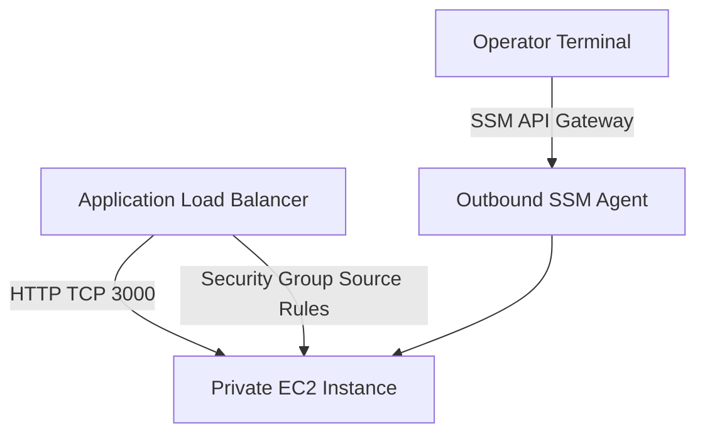

## Table of Contents

1. [The Mutable Server Trap](#the-mutable-server-trap)
2. [What Is EC2](#what-is-ec2)
3. [AMIs and Instance Types](#amis-and-instance-types)
4. [Subnets, Security Groups, and SSM Shells](#subnets-security-groups-and-ssm-shells)
5. [Automated Bootstrapping with User Data](#automated-bootstrapping-with-user-data)
6. [Process Supervision with systemd](#process-supervision-with-systemd)
7. [Disk Hygiene and Patching Lifecycles](#disk-hygiene-and-patching-lifecycles)
8. [Putting It All Together](#putting-it-all-together)
9. [What's Next](#whats-next)

## The Mutable Server Trap

When a developer starts hosting an application on a virtual server, the environment initially feels highly familiar. They open their command terminal, establish a secure shell connection (SSH) directly to the server's public IP address, manually download their application files, install database packages, and type a command to start the web server in the background.

While this hands-on, manual approach immediately makes the application available to the public, it introduces severe operational vulnerabilities that turn your infrastructure into a unique, hand-maintained server that cannot be reproduced from source-controlled inputs:

* **Irreproducible configurations**: Because every library, package, and directory was configured manually by hand, no single engineer knows the exact list of steps required to duplicate the setup. If the host hardware fails, rebuilding the server becomes a high-risk guessing game.
* **Environmental configuration drift**: Over months of operation, engineers run minor live patches, edit local configurations, and leave temporary files on disk. The running server drifts completely away from the base image used to create it, making it impossible to scale horizontally.
* **Accidental shell exposures**: To allow operators to SSH into the host for debugging, port `22` is opened to the public internet. This public entry point attracts constant, automated brute-force attacks and security scans from across the globe.

To survive and operate virtual machines safely in the cloud, you must stop treating servers as permanent, hand-patched computers. You must treat them as temporary, replaceable infrastructure. You need a design where a blank machine can boot privately in your network, bootstrap itself to a fully configured application server automatically without operator intervention, and run under a guest OS supervisor that heals the process on crashes.

## What Is EC2

Amazon Elastic Compute Cloud, commonly known as EC2, is the baseline AWS service for provisioning virtual servers, which AWS calls instances. In the normal shared-tenancy model, AWS does not allocate a dedicated physical server to you; instead, it uses a hypervisor to slice a massive, physical host computer into isolated virtual machines (VMs) sharing the physical CPU, memory, and hardware interfaces. If licensing or placement rules require dedicated physical hardware, EC2 also offers Dedicated Hosts and Dedicated Instances, but those are deliberate tenancy choices with separate cost and placement behavior.

EC2 behaves like a programmable guest operating system on AWS-managed hardware. You control the operating system, packages, disks, processes, and host-level agents, while AWS controls the physical facility, physical host, hypervisor, and cloud APIs.

From your application team's perspective, EC2 feels close to renting a private Linux server because you get broad guest operating system control and administrative root privileges. This server-shaped environment is exactly what specialized, host-shaped workloads demand. With EC2, you can:
* Load proprietary Linux kernel modules (`.ko` binary drivers via `insmod`/`modprobe`) to capture low-level kernel event loops or audit raw network socket buffers.
* Run host-level agents, tracing tools, or operating system tunings that require administrative control of the guest OS.
* Run software packages that depend on stable virtual host attributes, dedicated hosts, fixed ENIs, or licensing models that do not tolerate short-lived container task identities.
* Run nested virtualization hypervisors or custom operating system configurations that container runtimes cannot accommodate.

Because your guest operating system runs on physical hardware managed by AWS, host failures, hypervisor upgrades, and network maintenance events are normal, expected occurrences. AWS can stop, retire, or require replacement of instances for system maintenance or hardware recovery. If your application stores persistent files, custom logs, or unique configurations only on that single machine's local disk, you have constructed a dangerous single point of failure. You must design and operate EC2 servers as replaceable processing nodes connected to external regional storage and APIs.

The key to operating EC2 is understanding the division of responsibility between your team and AWS:

* **What AWS Operates**: Physical server racks, power delivery, cooling systems, host virtualization hypervisors, network hardware, and the APIs used to manage resources.
* **What Your Team Operates**: The guest operating system configuration, package management, runtime security patches, application process management, local disk space limits, custom kernel modules, and least-privilege IAM credentials.

EC2 is virtual server-shaped compute. It gives you complete control over the guest OS boundary, but it demands that your team accepts full operational responsibility for maintaining everything above that line.

## AMIs and Instance Types

Every EC2 instance is configured by choosing two foundational templates at launch: the Amazon Machine Image (AMI) and the Instance Type.

The AMI is the boot filesystem template, and the instance type is the virtual hardware profile. Together, they define what operating system starts and how much CPU, memory, network, and storage throughput the guest receives.

An Amazon Machine Image, or AMI, is the pre-configured snapshot of the guest operating system filesystem used to boot your virtual server. When you select an AMI, you choose the starting Linux distribution (such as Amazon Linux, Ubuntu, or Red Hat), the CPU architecture (such as x86 or ARM-based Graviton), and any pre-baked system utilities.

A critical gotcha of AMIs is the difference between mutable runtime drift and immutable deployment. If your bootstrap process modifies the server's guest OS files after boot, those changes only exist on that specific running instance, creating mutable runtime drift. 

In a replaceable infrastructure model, you practice immutable deployments. The AMI represents the static, unchangeable baseline of your server. Instead of SSH-patching a running server's packages or files (which turns it into an irreproducible, hand-patched host), you build a new versioned AMI and replace the running instances entirely. This guarantees that your active production fleet always matches your verified baseline configuration exactly, and that any newly autoscaled instances booted to handle traffic spikes are identical copies of the active fleet. If that instance is replaced by Auto Scaling, EKS, or a host crash, the replacement instance will boot from the clean, original AMI snapshot, meaning all your manual changes will be lost.

The Instance Type represents the virtual hardware profile assigned to your server. AWS categorizes instance types into families optimized for different workloads:

* **General Purpose (T and M families)**: Balanced CPU and memory allocation. T-family instances are cost-effective for development because they use a credit system to burst CPU performance when traffic arrives, and scale down when idle.
* **Compute Optimized (C family)**: High-performance processors designed for CPU-heavy tasks like media encoding, machine learning, or busy batch workers.
* **Memory Optimized (R family)**: Large RAM capacity optimized for databases, in-memory caches, or data-intensive analytics engines.

Selecting your instance type is a precise operational contract. If you pick a size that is too small to save a few dollars, your application will crash with out-of-memory errors under traffic spikes. Conversely, if you provision a massive instance without measuring your code's real resource footprint, you waste your cloud budget on idle capacity.

## Subnets, Security Groups, and SSM Shells

Securing your EC2 instance requires a clean separation of network routing, firewall rules, and administrative access paths.

The technical anchor is three separate control layers: subnet placement decides routing, security groups decide packet permissions, and Systems Manager Session Manager decides administrative shell access. First, never assign a public IP address to your backend application server. The instance should live inside a private application subnet, completely cut off from direct inbound internet routing. The public ingress point for your traffic is the Application Load Balancer sitting in the public subnet.

Second, control traffic using security groups, which act as stateful, host-level firewalls. Instead of opening port `3000` to all IP addresses (`0.0.0.0/0`), your instance security group should explicitly allow inbound TCP traffic on port `3000` only from the security group attached to your Application Load Balancer.

Finally, eliminate the public SSH entry point completely. Instead of opening port `22` and managing fragile SSH key pairs, utilize AWS Systems Manager Session Manager (SSM). Session Manager allows operators to open a secure shell session directly to the instance guest OS via the AWS Console or CLI. 

This access path operates over a secure, outbound HTTPS channel managed by the local SSM Agent. You do not need to open any inbound firewall ports. Session access is authenticated through IAM, and you can configure session logging to CloudWatch Logs or S3 so shell activity is auditable.




*A safe EC2 server is built from repeatable inputs, not hand repair. The AMI, bootstrap script, artifact store, private network path, SSM access channel, instance profile, supervisor, and log stream together make the instance replaceable.*

To enable this secure SSM connection and authorize your application code to call AWS APIs, you attach an IAM Role to your instance using an Instance Profile. The instance profile acts as the bridge that delivers dynamic, temporary credentials to the server without storing static access keys on the filesystem.

## Automated Bootstrapping with User Data

A replaceable cloud server must be able to boot, configure itself, and start your application automatically without any manual keyboard input. In EC2, this first-boot automation is handled using User Data.

User Data acts as the first-boot bootstrap input for an EC2 instance. It is a shell script or cloud-init configuration that you pass to EC2 at launch. The guest operating system usually executes this script as the root user during the instance's first boot lifecycle. Treat it as a small bootstrap handoff rather than a giant installer: EC2 user data is limited to 16 KB before base64 encoding, and default execution behavior is first launch unless you configure the operating system launch agent or cloud-init to run it again.

A clean bootstrap script should perform only a few explicit tasks:

```bash
#!/bin/bash
# Install Node.js and AWS CLI packages
dnf install -y nodejs awscli

# Create a non-root system user to run the application safely
useradd -m -s /sbin/nologin orders-app

# Copy the versioned release artifact from a secure S3 bucket
aws s3 cp s3://company-artifacts-prod/orders-api/release-v42.tgz /tmp/release.tgz

# Unpack the application files to the target directory
mkdir -p /opt/orders-api
tar -xzf /tmp/release.tgz -C /opt/orders-api
chown -R orders-app:orders-app /opt/orders-api

# Start and enable the systemd process supervisor
systemctl enable --now orders-api
```

This bootstrap script illustrates several critical design rules:

* **No Hardcoded Credentials**: The script uses `aws s3 cp` without specifying any access keys. This call succeeds because the instance profile role grants the server permission to read from that specific S3 bucket.
* **Run as Least-Privilege**: The script creates a dedicated `orders-app` system user with no login shell. Never run your web application process as the root user, as any compromise in your code would grant the attacker total control over the entire operating system.
* **No Secrets in User Data**: User data is not encrypted at rest and can be read by anyone with metadata permissions in the account. Never paste database passwords or signing secrets directly into your bootstrap scripts.

By utilizing User Data, you guarantee that if a host fails, you do not spend hours recovering files or manually installing packages. Because your server is temporary and replaceable, your User Data script must contain the complete, deterministic recipe to bring the server to a fully healthy state from a blank, freshly booted AMI. This automation completely removes human administrators from the lifecycle of the machine. If an instance is terminated by an AWS hardware crash or an Auto Scaling scale-in event, a replacement server can spin up, pull its own packages, download its versioned code from S3, register with target groups, and accept traffic with zero manual intervention. User Data is the operational tool that transforms EC2 from a high-maintenance computer into a modular, disposable resource.

## Process Supervision with systemd

Starting your web application from an interactive terminal session is a test, not an operating model. If you close your terminal connection, the process exits. If the code throws an uncaught exception, the application crashes and remains dead.

To keep your application active and self-healing, you must daemonize your process using the guest OS supervisor, systemd. systemd functions as the Linux service manager that starts, stops, restarts, and records the lifecycle of long-running background processes.

To manage your application under systemd, you write a service unit configuration file:

```ini
[Unit]
Description=Orders API Service
After=network.target

[Service]
Type=simple
User=orders-app
WorkingDirectory=/opt/orders-api
Environment=PORT=3000
Environment=NODE_ENV=production
ExecStart=/usr/bin/node server.js
Restart=on-failure
RestartSec=5s
StandardOutput=append:/var/log/orders-api/stdout.log
StandardError=append:/var/log/orders-api/stderr.log

[Install]
WantedBy=multi-user.target
```

The systemd configuration establishes a robust operational contract for your runtime process:

* **Explicit Runtime Boundary**: The service runs strictly as the non-root `orders-app` user inside the specified directory, with clean, isolated environment configurations.
* **Automated Self-Healing**: The `Restart=on-failure` directive ensures that if the Node.js process crashes due to a memory leak or uncaught exception, systemd will automatically restart the process after five seconds.
* **Controlled Logging**: Output and error streams are redirected to dedicated local files, ready to be swept and shipped to durable cloud storage.

By supervisor-managing your application under systemd, you decouple process health from interactive operator sessions. Your web API boots automatically when the virtual server starts up, and self-heals in the background when errors occur.

## Disk Hygiene and Patching Lifecycles

Unlike managed container clusters, choosing EC2 virtual servers makes your team responsible for ongoing host hygiene, disk monitoring, and security patching.

Local disk storage on EC2 begins on the EBS Root Volume, which behaves like the virtual boot disk created from your AMI snapshot. Because local storage is finite, any application that writes extensive logs to disk without a rotation plan will eventually fill the filesystem.

When a root volume reaches 100% capacity, systemd cannot write cache files, shell connections fail to allocate terminal variables, and the application crashes completely.

Disk and Patching Best Practices:

* **Aggregate Your Logs**: Never treat local server disks as the permanent home for application logs. Configure log shippers (like the CloudWatch Agent) to sweep local logs and stream them immediately to a central cloud destination, and use logrotate to clean local files on a schedule that matches your log volume.
* **Avoid Live Server Patching**: Do not establish a habit of running `yum update` or live library installations on active production servers. This introduces configuration drift and breaks reproducibility.
* **Immutable OS Patching**: When security patches arrive, do not update a running server in place. Update your baseline bootstrap script or build a new gold-standard AMI, launch fresh replacement instances, verify their health behind the load balancer, and terminate the old, unpatched instances.

This replacement-first patching workflow illustrates the core cloud engineering shift from unique manual hosts to replaceable node groups. In older server operations, each machine often accumulated manual changes and became difficult to reproduce. In a cloud replacement model, instances are disposable copies of a known baseline that can be launched, verified, drained, and terminated. By enforcing strict disk hygiene and adopting an immutable, replacement-first patching lifecycle, you ensure that your servers remain highly predictable, secure, and resilient to host failures, as the system is continuously designed and tested to replace its own compute layer cleanly.

## Putting It All Together

Operating virtual machines effectively in AWS requires you to transition from unique hand-maintained servers to reproducible, automated virtual infrastructure:

* **Eliminate Manual Installs**: Treat SSH as an emergency debugging tool, not an install path. Code all packages, folders, and service registrations into User Data scripts.
* **Lock Down the Network**: Place instances in private subnets, restrict inbound traffic strictly to your load balancer's security group, and connect shell operators securely using Session Manager.
* **Supervise Your Processes**: Never run raw terminal commands to start your app. Always register your application process as a supervised daemon under systemd.
* **Practice Immutable Upgrades**: When the operating system needs updates, do not patch the live server. Build an updated AMI, launch replacement instances, and terminate the old hosts.

By automating your bootstrap lifecycle, protecting your network gates, and supervising your daemons, you transform EC2 from a hand-managed virtual box into a highly reliable, reproducible, and secure cloud compute runtime.

## What's Next

We now understand what it means to own and operate a server-shaped runtime using EC2 virtual machines. However, as our application footprint grows, managing individual host patching, systemd units, and EBS disk volumes can introduce massive operational overhead. In the next article, we will explore ECS and Fargate container hosting, deconstructing how container images are orchestrated as services, connected to dynamic VPC networking, and run without managing virtual servers.


*Use this as the EC2 operations checklist: keep the instance private, bootstrap from a known image and script, grant AWS access through an instance profile, supervise the app with systemd, ship logs before disks fill, and patch by replacing hosts.*

---

**References**

- [Amazon EC2 User Guide for Linux Instances](https://docs.aws.amazon.com/AWSEC2/latest/UserGuide/concepts.html) - Comprehensive documentation on operating Linux-based virtual servers.
- [Amazon EC2 Dedicated Hosts](https://docs.aws.amazon.com/AWSEC2/latest/UserGuide/dedicated-hosts-overview.html) - Explains dedicated physical host placement, host affinity, and BYOL licensing support.
- [Run commands when you launch an EC2 instance with user data input](https://docs.aws.amazon.com/AWSEC2/latest/UserGuide/user-data.html) - Documents user data execution behavior, first-launch defaults, and size limits.
- [AWS Systems Manager Session Manager](https://docs.aws.amazon.com/systems-manager/latest/userguide/session-manager.html) - Guide on opening secure, auditable shell tunnels without port 22 or SSH keys.
- [systemd Service Unit Files](https://www.freedesktop.org/software/systemd/man/latest/systemd.service.html) - Official freedesktop specifications for configuring supervised background services.
