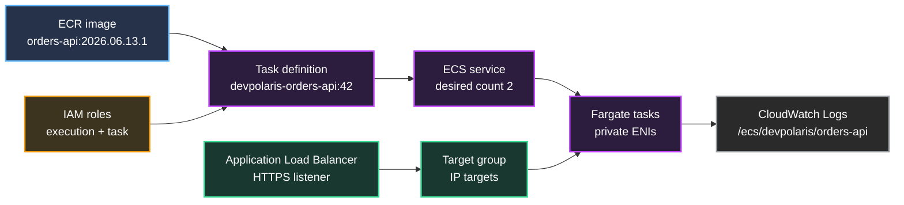

## Table of Contents

1. [The Runtime Path For One Container](#the-runtime-path-for-one-container)
2. [What ECS Does](#what-ecs-does)
3. [Task Definitions: The Launch Contract](#task-definitions-the-launch-contract)
4. [Tasks: One Running Copy](#tasks-one-running-copy)
5. [Services: Keeping Copies Alive](#services-keeping-copies-alive)
6. [Fargate: The Host Boundary](#fargate-the-host-boundary)
7. [Networking: ENIs, Subnets, And Target Groups](#networking-enis-subnets-and-target-groups)
8. [IAM Roles: Boot Permissions And App Permissions](#iam-roles-boot-permissions-and-app-permissions)
9. [Logs, Health, And Deployment Evidence](#logs-health-and-deployment-evidence)
10. [A Practical Deployment Flow](#a-practical-deployment-flow)
11. [Putting It All Together](#putting-it-all-together)
12. [What's Next](#whats-next)

## The Runtime Path For One Container
<!-- section-summary: A production container path connects an image, task definition, service, Fargate task, load balancer target, IAM roles, and logs. -->

Imagine the **devpolaris-orders-api** team has a small web API in a Docker image. On a laptop, the workflow is direct. The developer builds the image, runs the container, opens `localhost:3000`, and sees the health endpoint return `200`. That proves the image can start, but it leaves the production runtime questions open.

Production needs more than a container process. The team needs two healthy copies across private subnets, a public HTTPS endpoint, logs after a task disappears, permission to read one database secret, permission to write receipts to one S3 bucket, and a clear way to roll back a bad release. Those pieces are separate AWS resources, and ECS connects them into one running service.

The production path uses this flow:



Each resource has one job. **Amazon ECR** stores the container image. A **task definition** describes how ECS should start that image. An **ECS service** keeps the chosen number of copies running. **AWS Fargate** supplies the compute boundary for each copy. The **Application Load Balancer** receives user traffic and sends it to healthy task IP addresses. **IAM roles** decide what the platform and application can call. **CloudWatch Logs** keeps the container output after the task stops.

This article follows that path in order. We will keep using the same orders API because real ECS work usually fails at the boundaries between these pieces: image pull, task startup, service replacement, target health, role permission, or missing logs. When each boundary has a name, the team can debug the right thing instead of changing random settings.

## What ECS Does
<!-- section-summary: ECS is the AWS container orchestrator that turns task definitions into running tasks and keeps service state aligned. -->

**Amazon Elastic Container Service**, usually called **ECS**, is AWS's container orchestration service. A container orchestrator starts containers, tracks their lifecycle, replaces failed copies, connects them to networking, and coordinates deployments. ECS handles that control work while your application code stays inside normal container images.

The orders API team gives ECS a task definition that says, "start this image with this CPU, memory, port, environment, secrets, roles, and logging setup." ECS turns that definition into running tasks. When the team creates a service with desired count `2`, ECS keeps two task copies running and replaces tasks that stop or fail health checks.

ECS has a few words that show up everywhere:

| ECS word | Simple meaning | Orders API example |
|---|---|---|
| **Cluster** | A logical place where ECS runs tasks and services | `devpolaris-orders-prod` |
| **Task definition** | A versioned launch contract for the container | `devpolaris-orders-api:42` |
| **Task** | One running copy created from a task definition | one private task with its own IP |
| **Service** | A controller that maintains a desired number of tasks | two healthy copies behind the ALB |
| **Capacity** | The compute that runs the task | Fargate in this article |

The cluster gives ECS a home for service placement. The task definition gives ECS the recipe for one copy. The service joins the recipe with a desired count, network placement, deployment rules, and load balancer registration.

That separation matters during incidents. If the image tag is wrong, the task definition needs attention. If the task exits after boot, the task stopped reason and logs need attention. If desired count is `2` and running count stays `1`, the service events need attention. If tasks run but users get `503`, the target group and port contract need attention.

## Task Definitions: The Launch Contract
<!-- section-summary: A task definition is the versioned JSON contract that tells ECS which image to run and which runtime settings to apply. -->

A **task definition** is the launch contract for one ECS task. AWS describes it as a blueprint for your application, and that word fits the daily work well. It records the container image, CPU and memory, network mode, roles, ports, environment variables, secrets, and log driver. Registering a task definition creates a new revision, such as `devpolaris-orders-api:42`, and ECS services can deploy that exact revision.

The task definition is also where many production mistakes enter. A container image can be good, but the task definition can point at the wrong tag, declare the wrong port, omit a secret, choose too little memory, or use the wrong IAM role. The container then fails in ECS even though the same image worked during a local test.

Here is a trimmed task definition for the orders API:

```json
{
  "family": "devpolaris-orders-api",
  "requiresCompatibilities": ["FARGATE"],
  "networkMode": "awsvpc",
  "cpu": "512",
  "memory": "1024",
  "runtimePlatform": {
    "cpuArchitecture": "X86_64",
    "operatingSystemFamily": "LINUX"
  },
  "executionRoleArn": "arn:aws:iam::123456789012:role/devpolaris-orders-api-execution",
  "taskRoleArn": "arn:aws:iam::123456789012:role/devpolaris-orders-api-task",
  "containerDefinitions": [
    {
      "name": "orders-api",
      "image": "123456789012.dkr.ecr.us-east-1.amazonaws.com/devpolaris-orders-api:2026.06.13.1",
      "essential": true,
      "portMappings": [
        {
          "containerPort": 3000,
          "protocol": "tcp"
        }
      ],
      "environment": [
        {
          "name": "NODE_ENV",
          "value": "production"
        }
      ],
      "secrets": [
        {
          "name": "DATABASE_URL",
          "valueFrom": "arn:aws:secretsmanager:us-east-1:123456789012:secret:prod/orders/database-url-AbCdEf"
        }
      ],
      "logConfiguration": {
        "logDriver": "awslogs",
        "options": {
          "awslogs-group": "/ecs/devpolaris/orders-api",
          "awslogs-region": "us-east-1",
          "awslogs-stream-prefix": "orders"
        }
      }
    }
  ]
}
```

The important Fargate fields connect directly to the runtime path. `requiresCompatibilities` tells ECS to validate the definition for Fargate. `networkMode` uses `awsvpc`, which gives each task its own VPC network interface. `cpu` and `memory` describe the task-level size that Fargate will provision. `executionRoleArn` lets the platform pull the image, fetch configured secrets, and send logs. `taskRoleArn` gives the application code its own AWS permissions.

The `containerDefinitions` block describes the actual container. The `image` points at ECR. The `portMappings` block says the app listens on port `3000`. The `secrets` block injects sensitive values at startup from Secrets Manager. The `logConfiguration` block sends stdout and stderr to CloudWatch Logs through the `awslogs` driver.

The deployment job registers the definition before it updates the service:

```shell
aws ecs register-task-definition \
  --cli-input-json file://task-definition.json
```

The output includes a new task definition ARN. A real pipeline stores that ARN or revision and passes it into the service update step. That keeps the release precise. The team can say, "revision 42 is the image from build `2026.06.13.1` with these roles, these ports, and this log group."

## Tasks: One Running Copy
<!-- section-summary: A task is one live copy of the task definition, with current state, networking, stopped reasons, and logs. -->

A **task** is one running copy created from a task definition. If the task definition is `devpolaris-orders-api:42`, a task is the actual container process that started from revision 42, received CPU and memory, attached to a subnet, got an IP address, and began writing logs.

Tasks have a lifecycle. They move through states such as provisioning, pending, running, stopping, and stopped. ECS records useful timestamps and reasons along the way. When a task fails before the app starts, the task may show a resource initialization error, image pull problem, secret retrieval problem, or log driver problem. When the app starts and then exits, the stopped reason and container exit code usually point closer to the application.

For the orders API, a failed task might tell the team this:

```shell
aws ecs describe-tasks \
  --cluster devpolaris-orders-prod \
  --tasks arn:aws:ecs:us-east-1:123456789012:task/devpolaris-orders-prod/abc123
```

Useful fields from that response include `lastStatus`, `desiredStatus`, `stoppedReason`, `containers[].exitCode`, `containers[].reason`, `attachments`, and `startedAt`. The attachment data shows the task network interface, which helps connect one ECS task to one private IP, one security group, one target group target, and one flow-log path.

Standalone tasks have a place in ECS. Teams use them for one-time jobs, migrations, diagnostics, and scheduled work. A web API needs a service around its tasks because user traffic expects the app to keep existing after one container exits. The service is the next layer.

## Services: Keeping Copies Alive
<!-- section-summary: An ECS service keeps the desired number of tasks running, replaces unhealthy copies, and coordinates deployments. -->

An **ECS service** is the long-running controller for a workload. It runs and maintains a specified number of task copies from a task definition. When the desired count is `2`, ECS tries to keep two tasks running. If one task stops, the service scheduler launches another copy from the task definition to bring the service back to the desired count.

This gives the orders API its stable shape. Users never call a task directly. Users call the load balancer. The load balancer sends traffic to healthy targets. The service keeps registering new healthy task IPs behind that target group as old tasks disappear during failures, deployments, or scaling events.

The service owns several production decisions:

| Service setting | What it controls | Orders API choice |
|---|---|---|
| **Desired count** | How many task copies should run | `2` for normal production |
| **Deployment configuration** | How many old and new tasks can overlap | `minimumHealthyPercent` and `maximumPercent` |
| **Deployment circuit breaker** | Whether ECS can fail and roll back a bad rollout | enabled with rollback |
| **Network configuration** | Which subnets and security groups tasks use | private app subnets and task security group |
| **Load balancer mapping** | Which target group and container port receive traffic | target group to `orders-api:3000` |

The service is also the first place the team checks during a release:

```shell
aws ecs describe-services \
  --cluster devpolaris-orders-prod \
  --services devpolaris-orders-api
```

The response shows `desiredCount`, `runningCount`, `pendingCount`, active deployments, rollout state, and recent events. A healthy release should move toward one primary deployment with the new task definition, running count equal to desired count, and service events that say the service reached a steady state.

Deployment settings decide how much overlap the service can use. With desired count `2`, `minimumHealthyPercent: 100` tells ECS to keep two healthy tasks available during a rolling deployment. `maximumPercent: 200` allows ECS to run up to four tasks temporarily while new tasks start. That gives the replacement tasks room to pass health checks before old tasks stop.

The **deployment circuit breaker** gives the rollout a failure path. ECS can mark a deployment failed when tasks fail to reach running state or health checks keep failing. With rollback enabled, ECS can return to the last completed deployment. Production teams often combine this with CloudWatch alarms for HTTP 5xx, target response time, task failures, CPU, memory, and business-level error signals.

## Fargate: The Host Boundary
<!-- section-summary: Fargate supplies serverless ECS task compute, so the team sizes and configures tasks without managing EC2 container hosts. -->

**AWS Fargate** is serverless compute for ECS tasks. The team chooses task CPU, memory, operating system family, CPU architecture, networking, and container settings. AWS provides the host capacity and manages the underlying server fleet, container agent work, and task isolation boundary.

ECS had an EC2 hosting model before Fargate. In that model, a team runs EC2 instances as container hosts, patches the instances, manages AMIs, monitors disk, updates the ECS agent, and thinks about how tasks pack onto hosts. Fargate removes that host fleet from the team's daily work. The team still owns the container image, task definition, service, scaling rules, network access, and application behavior.

That division matters because Fargate will faithfully run the contract you gave it. If the orders API uses too little memory, the task can exit. If the app binds to `127.0.0.1` instead of `0.0.0.0`, the load balancer health check can fail. If private subnets lack a NAT path or the right VPC endpoints, the task may fail while pulling the image, fetching secrets, or sending logs. Fargate handles host capacity, and the application team handles the runtime contract.

Fargate tasks require valid CPU and memory combinations. A small API might begin with `512` CPU units and `1024` MiB memory, then change after load testing. The team watches CPU utilization, memory utilization, startup time, and request latency. If memory climbs during traffic spikes, the fix may be a larger task size, a code fix, or autoscaling more copies, depending on what the metrics and logs show.

Fargate also changes cost thinking. Each task has a size and runtime duration. A service with desired count `2` runs all day. A one-time migration task runs only while the job is active. That is why long-running HTTP APIs often use ECS services, while short event handlers may fit Lambda, and scheduled container jobs may use standalone ECS tasks or EventBridge Scheduler.

## Networking: ENIs, Subnets, And Target Groups
<!-- section-summary: Fargate tasks use awsvpc networking, private task ENIs, security groups, and IP target groups behind the load balancer. -->

Fargate tasks use **awsvpc networking**. In simple terms, each task receives its own elastic network interface, usually called an **ENI**, inside your VPC. That ENI gives the task a private IP address and security groups. From the network's point of view, each task looks like a small private network target.

The orders API should usually run in private subnets. The public Application Load Balancer sits in public subnets and receives HTTPS from users. The ECS tasks sit in private subnets and allow inbound traffic only from the load balancer security group on the application port. The database allows inbound traffic only from the task security group on the database port.

The security group path might look like this:

| Path | Source | Destination | Port |
|---|---|---|---|
| User to ALB | Internet | ALB security group | `443` |
| ALB to task | ALB security group | ECS task security group | `3000` |
| Task to database | ECS task security group | RDS security group | `5432` |
| Task to AWS APIs | ECS task private IP | NAT gateway or VPC endpoints | `443` |

The load balancer target group needs `ip` target type for Fargate and awsvpc tasks. The target group registers task IP addresses, such as `10.0.21.45:3000`, because the task has its own ENI. An `instance` target group points at EC2 instances, a different network shape than Fargate tasks.

The port contract needs to line up across the whole path:

| Layer | Orders API value | What breaks when it disagrees |
|---|---|---|
| Application listen address | `0.0.0.0:3000` | Task starts, but outside traffic has no route to the process |
| Task definition container port | `3000` | ECS registers the wrong port or health checks fail |
| Target group port and health check | `3000` and `/healthz` | ALB marks targets unhealthy |
| Listener rule | HTTPS `443` to target group | Users reach the load balancer but miss the service |

Private tasks still need outbound access for normal platform work. If the task pulls an image from ECR, sends logs to CloudWatch Logs, or fetches a secret from Secrets Manager, it needs a path to those AWS APIs. Teams usually use a NAT gateway, VPC endpoints, or a mix of both. In locked-down private VPCs, common endpoints include ECR API, ECR Docker registry, CloudWatch Logs, Secrets Manager, and S3 for image layer or application object access.

Many ECS networking incidents are plain path mismatches. The service has running tasks, but the target group is unhealthy because the app listens on `8080` while the task definition says `3000`. The task startup fails because the private subnet has no path to ECR. The task reaches running state, but RDS rejects the database path because the database security group allows yesterday's IP instead of the task security group. The fix follows the named boundary.

## IAM Roles: Boot Permissions And App Permissions
<!-- section-summary: ECS uses a task execution role for platform boot work and a task role for application AWS API calls. -->

ECS task definitions usually name two IAM roles, and the difference matters during every real incident. The **task execution role** gives the ECS and Fargate platform permission to do boot work on your behalf. The **task role** gives the application code permission to call AWS APIs after the container starts.

For the orders API, the execution role needs platform permissions. It can pull the image from ECR, retrieve configured Secrets Manager values that ECS injects at startup, and write container logs through CloudWatch Logs. These permissions support the task boot path. The application code uses the task role for normal SDK calls.

The task role belongs to the running application. If the orders API writes receipt files to S3, reads order events from SQS, or calls DynamoDB, those permissions belong on the task role. The AWS SDK inside the container receives temporary task role credentials through the ECS credential provider path. No static AWS access key belongs in the image, environment file, or source code.

A small task role policy might look like this:

```json
{
  "Version": "2012-10-17",
  "Statement": [
    {
      "Sid": "WriteReceipts",
      "Effect": "Allow",
      "Action": [
        "s3:PutObject"
      ],
      "Resource": "arn:aws:s3:::devpolaris-prod-receipts/*"
    },
    {
      "Sid": "ReadQueue",
      "Effect": "Allow",
      "Action": [
        "sqs:ReceiveMessage",
        "sqs:DeleteMessage",
        "sqs:GetQueueAttributes"
      ],
      "Resource": "arn:aws:sqs:us-east-1:123456789012:orders-events"
    }
  ]
}
```

The matching execution role should stay focused on platform startup:

```json
{
  "Version": "2012-10-17",
  "Statement": [
    {
      "Sid": "GetEcrAuthToken",
      "Effect": "Allow",
      "Action": [
        "ecr:GetAuthorizationToken"
      ],
      "Resource": "*"
    },
    {
      "Sid": "PullOrdersImage",
      "Effect": "Allow",
      "Action": [
        "ecr:BatchCheckLayerAvailability",
        "ecr:GetDownloadUrlForLayer",
        "ecr:BatchGetImage"
      ],
      "Resource": "arn:aws:ecr:us-east-1:123456789012:repository/devpolaris-orders-api"
    },
    {
      "Sid": "WriteTaskLogs",
      "Effect": "Allow",
      "Action": [
        "logs:CreateLogStream",
        "logs:PutLogEvents"
      ],
      "Resource": "arn:aws:logs:us-east-1:123456789012:log-group:/ecs/devpolaris/orders-api:*"
    },
    {
      "Sid": "ReadStartupSecrets",
      "Effect": "Allow",
      "Action": [
        "secretsmanager:GetSecretValue"
      ],
      "Resource": "arn:aws:secretsmanager:us-east-1:123456789012:secret:prod/orders/database-url-*"
    }
  ]
}
```

Notice how the roles answer different questions. "Can ECS pull the image and send logs?" points to the execution role. "Can the app write a receipt to S3?" points to the task role. "Can ECS inject the database URL before the app starts?" points back to the execution role because ECS retrieves that configured secret during startup.

This split also makes reviews easier. Security teams can review platform boot permissions separately from application business permissions. Operations teams can read an error and pick the right role instead of adding broad access to both roles and hoping the symptom disappears.

## Logs, Health, And Deployment Evidence
<!-- section-summary: ECS operations use service events, task details, target health, CloudWatch Logs, metrics, alarms, and deployment state together. -->

Cloud debugging starts with evidence that survives replacement. Tasks are temporary by design. If a task exits and Fargate cleans it up, the team still needs logs, stopped reasons, target health history, metrics, and deployment state. ECS and CloudWatch provide those signals when the task definition and service include the right configuration.

The `awslogs` log driver sends container stdout and stderr to CloudWatch Logs. That means the application should log useful startup facts, configuration validation failures, database connection errors, request IDs, and shutdown messages to stdout or stderr. The task definition chooses the log group, Region, and stream prefix. The team should also set a retention policy on the log group so logs stay long enough for incident review without growing forever.

A normal investigation for the orders API uses several views together:

| Question | Evidence source | Example clue |
|---|---|---|
| Did ECS keep the desired count? | `describe-services` | `desiredCount: 2`, `runningCount: 1` |
| Did the task start? | `describe-tasks` | `lastStatus`, `stoppedReason`, exit code |
| Did the load balancer accept it? | target group health | `Target.ResponseCodeMismatch` or timeout |
| Did the app fail during startup? | CloudWatch Logs | missing env var or DB connection error |
| Did the release fail? | deployment state and events | `rolloutState: FAILED` |
| Did traffic get worse? | CloudWatch metrics and alarms | 5xx rate or latency alarm |

The team checks logs with a command like this:

```shell
aws logs tail /ecs/devpolaris/orders-api \
  --since 30m \
  --follow
```

The target group health check explains the user-facing path:

```shell
aws elbv2 describe-target-health \
  --target-group-arn arn:aws:elasticloadbalancing:us-east-1:123456789012:targetgroup/devpolaris-orders-api-tg/6d0ecf831eec9f09
```

The ECS service event explains the controller path. A repeated message about failing load balancer health checks means the container may be running while the ALB still fails to verify it as healthy. A repeated resource initialization error points earlier, often image pull, secret retrieval, logging, or network egress.

Production teams usually wire rollback decisions into this evidence. ECS deployment failure detection can use the deployment circuit breaker and CloudWatch alarms. The circuit breaker looks at whether tasks reach running state and pass health checks. CloudWatch alarms can catch broader service symptoms, such as HTTP 5xx or latency. With rollback enabled and a previous completed deployment available, ECS can roll back a failed deployment to the last completed state.

## A Practical Deployment Flow
<!-- section-summary: A production ECS deployment registers a new task definition, updates the service, watches steady state, verifies health, and keeps rollback evidence. -->

Now the pieces can move as one release. The orders API team builds an image, pushes it to ECR, registers a task definition revision, updates the service, and watches the deployment until ECS reaches steady state. Each step creates evidence that the next step depends on.

The build step creates an immutable image tag:

```shell
docker build -t devpolaris-orders-api:2026.06.13.1 .
docker tag devpolaris-orders-api:2026.06.13.1 \
  123456789012.dkr.ecr.us-east-1.amazonaws.com/devpolaris-orders-api:2026.06.13.1
docker push 123456789012.dkr.ecr.us-east-1.amazonaws.com/devpolaris-orders-api:2026.06.13.1
```

The release job writes the image tag into `task-definition.json` and registers the new revision:

```shell
aws ecs register-task-definition \
  --cli-input-json file://task-definition.json
```

Then the job updates the service to the exact revision returned by registration:

```shell
aws ecs update-service \
  --cluster devpolaris-orders-prod \
  --service devpolaris-orders-api \
  --task-definition devpolaris-orders-api:42 \
  --deployment-configuration "minimumHealthyPercent=100,maximumPercent=200,deploymentCircuitBreaker={enable=true,rollback=true}"
```

The watch step waits for a stable deployment and then verifies the outside path:

```shell
aws ecs wait services-stable \
  --cluster devpolaris-orders-prod \
  --services devpolaris-orders-api

curl -fsS https://api.devpolaris.example.com/healthz
```

If the deployment fails, the team follows the evidence instead of changing multiple things at once. An image-pull failure points to ECR permissions or network egress. A task that stops after startup points to app logs and exit codes. A running task that stays unhealthy points to the port contract, health path, security groups, or warm-up timing. A 5xx alarm after healthy target registration points into application behavior or downstream dependencies.

Rollback should use known revisions. The previous service deployment, previous task definition revision, and previous image tag should be visible in the deployment record. If automatic rollback succeeds, the team still records the failed revision, the first failed signal, and the smallest fix. When automatic rollback has no completed deployment available, the team needs a manual service update back to the last known good task definition.

## Putting It All Together
<!-- section-summary: ECS and Fargate turn a container image into an operated service by assigning each runtime concern to the right AWS boundary. -->

The orders API starts as one container image in ECR. ECS needs a task definition before it can serve users from that image, so the team registers a definition that names the image, resources, roles, port, secrets, and logs. ECS starts tasks from that definition, and the service keeps the desired number of healthy task copies running.

Fargate provides the compute boundary for each task. AWS manages EC2 container hosts for the team, while the team still owns task sizing, image quality, subnet choice, security groups, health checks, and application startup behavior. Fargate removes host maintenance from the workload, and it leaves the runtime contract visible in the task definition and service.

Networking connects users to changing task IPs. Each Fargate task gets its own ENI through awsvpc mode. The ALB target group uses IP targets and health checks, and the ECS service registers and deregisters task IPs during replacement and deployment. The port contract has to match from application bind address to task definition, target group, and listener rule.

IAM keeps boot work separate from application work. The execution role supports image pull, secret injection, and log delivery. The task role supports the application code after startup. That split keeps policy review, debugging, and least-privilege work clean.

Operations come from durable signals. Service events, task stopped reasons, target health, CloudWatch Logs, metrics, alarms, and deployment state tell the team where a failure occurred. A good ECS service is a named chain of runtime boundaries that a team can deploy, scale, debug, and roll back with confidence.

## What's Next

ECS services fit long-running container workloads like APIs, workers, and internal services. The next compute shape is different. Some workloads only need code to run after an event, such as an uploaded file, queue message, scheduled job, or API request that can finish quickly.

The next article moves into Lambda. It follows event-driven compute through events, handlers, triggers, timeouts, memory settings, retries, and idempotency so you can compare long-running ECS services with short-lived function execution.

---

**References**

- [Amazon ECS services](https://docs.aws.amazon.com/AmazonECS/latest/developerguide/ecs_services.html) - Explains how ECS services maintain desired task count, replace failed tasks, integrate with load balancers, and support service autoscaling.
- [Amazon ECS task definitions](https://docs.aws.amazon.com/AmazonECS/latest/developerguide/task_definitions.html) - Defines task definitions as application blueprints and lists the core task parameters.
- [Amazon ECS task definition parameters for Fargate](https://docs.aws.amazon.com/AmazonECS/latest/developerguide/task_definition_parameters.html) - Documents Fargate task role, execution role, awsvpc network mode, runtime platform, and task CPU and memory parameters.
- [Amazon ECS task definition differences for Fargate](https://docs.aws.amazon.com/AmazonECS/latest/developerguide/fargate-tasks-services.html) - Covers Fargate-specific task requirements, CPU and memory combinations, awsvpc networking, private subnet image-pull paths, logging, and storage notes.
- [Use an Application Load Balancer for Amazon ECS](https://docs.aws.amazon.com/AmazonECS/latest/developerguide/alb.html) - Documents ALB integration and the requirement to use `ip` target groups for awsvpc tasks.
- [Best practices for IAM roles in Amazon ECS](https://docs.aws.amazon.com/AmazonECS/latest/developerguide/security-iam-roles.html) - Describes separate ECS roles, including the task execution role and task role.
- [Send Amazon ECS logs to CloudWatch](https://docs.aws.amazon.com/AmazonECS/latest/developerguide/using_awslogs.html) - Explains how ECS captures stdout and stderr through the `awslogs` driver for CloudWatch Logs.
- [Amazon ECS deployment failure detection](https://docs.aws.amazon.com/AmazonECS/latest/developerguide/deployment-failure-detection.html) - Summarizes deployment circuit breaker and CloudWatch alarm rollback options.
- [How the Amazon ECS deployment circuit breaker detects failures](https://docs.aws.amazon.com/AmazonECS/latest/developerguide/deployment-circuit-breaker.html) - Details circuit breaker stages, rollback behavior, rollout state, and CLI examples.
- [Amazon ECS interface VPC endpoints](https://docs.aws.amazon.com/AmazonECS/latest/developerguide/vpc-endpoints.html) - Explains VPC endpoint considerations for ECS, ECR, Secrets Manager, and CloudWatch Logs paths.
