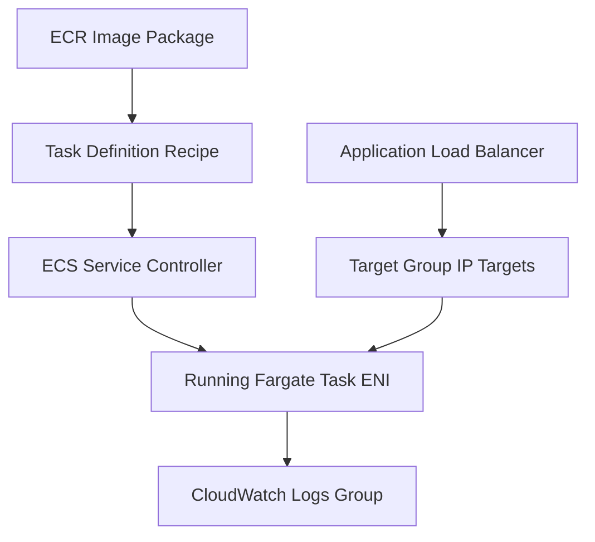

## Table of Contents

1. [The Container Service Challenge](#the-container-service-challenge)
2. [What Is ECS](#what-is-ecs)
3. [Task Definitions and Running Tasks](#task-definitions-and-running-tasks)
4. [The Role of ECS Services](#the-role-of-ecs-services)
5. [AWS Fargate Serverless Containers](#aws-fargate-serverless-containers)
6. [Container Networking and Load Balancing](#container-networking-and-load-balancing)
7. [Roles and Observability](#roles-and-observability)
8. [Putting It All Together](#putting-it-all-together)
9. [What's Next](#whats-next)

## The Container Service Challenge

Once you package your application and its dependencies into a Docker container image, running it on your laptop is simple. You run a single startup command, and the container process boots instantly, binds to a local port like `3000`, reads environment settings from a local dotenv file, and logs stdout output directly to your terminal screen. You verify the setup by browsing localhost, push the container image to Amazon ECR, and assume your code is fully ready for AWS.

However, once you are ready to host that container image in the cloud for real users, this simple localhost smoke test leaves several major production questions unanswered:

* How many copies of the container should run to survive hardware failures, and what restarts a container if the process exits?
* How does the public load balancer know where to send traffic if containers are constantly started, stopped, and assigned new, dynamic private IP addresses?
* How do we grant secure AWS API permissions to the application code running *inside* the container, without baking permanent credentials into the image?
* Where do container boot-up errors, environment config failures, and standard print logs go once the container leaves your terminal screen?

The hard part of container hosting in the cloud is not building the Docker image. It is turning the container package into a resilient, load-balanced application service. To do this, you need a container orchestrator that coordinates container lifecycles, monitors process health, manages network interfaces, translates ingress traffic, and aggregates logs durable in the background.

## What Is ECS

Amazon Elastic Container Service, commonly known as ECS, is AWS's native container orchestration service. Orchestration means ECS manages the coordination work around your containers: it schedules when and where they start, monitors their active health, replaces failed copies automatically to maintain your desired state, and registers their changing IP addresses behind Application Load Balancers.

ECS does not build your container image. It does not decide what your Node.js or Python code does. It takes your packaged image from Amazon ECR and a set of operational instructions from you, and works constantly to make the real-world cluster match your requested design.

To build a reliable mental model of ECS, you must map the progression of a container from a static build package to a live request target:

This model is a highly integrated pipeline. The container image in Amazon ECR moves into a Task Definition configuration. An ECS Service uses that task definition to start running Tasks on Fargate managed compute. 

The Application Load Balancer routes incoming user traffic through a Target Group directly to the private network interfaces of those tasks, while the container's standard output is captured and streamed to CloudWatch Logs.

## Task Definitions and Running Tasks

A Task Definition is the blueprint for your containerized workload. It is an immutable, versioned JSON document that describes exactly how your container should be executed by the AWS platform. When you register a task definition, you are not starting a container; you are writing down the recipe AWS must follow every time it launches your code.

For a standard backend web service, a task definition defines:

* **Container Image**: The ECR registry URI pointing to your versioned build package.
* **CPU and Memory Limits**: The exact share of virtual processors and RAM allocated to the container (such as `0.5 vCPU` and `1 GB` RAM).
* **Network Mode**: Set to `awsvpc` on Fargate, giving each task its own network interface.
* **Port Mappings**: The inbound container port where your application process actually listens (such as port `3000`).
* **Environment variables and Secrets**: The dynamic configuration keys and vaulted Secrets Manager ARNs injected at boot.
* **Logging Driver**: Typically set to `awslogs` to stream standard output lines directly to CloudWatch.

A Task is one active running instance of your task definition. If the task definition is the recipe, the task is the actual container process running with its allocated CPU, memory, and network resources.

A common beginner trap is attempting to debug a container by launching a standalone task directly in the ECS cluster. While this works for a quick test, a standalone task has no supervisor. 

If the application process throws an unhandled exception or the host hardware crashes, the task exits permanently. The web server goes down, and nobody starts a replacement copy. For a production backend, you need a service controller that monitors and maintains your running tasks.

## The Role of ECS Services

An ECS Service is the long-running controller that maintains your desired workload state. It sits on top of your running tasks, continuously comparing the number of active tasks in your cluster with the configured desired count.

If you configure a desired count of `2`, the ECS service controller works in a constant loop. If a container task crashes or a virtual host is retired, the controller immediately notices that the active task count has dropped to `1`. 

It queries the active task definition, schedules a new Fargate task to boot, and registers the replacement task IP behind the load balancer, recovering the service desired state automatically.

The ECS Service controls:

* **Desired Count**: The number of replica container copies that must stay alive (e.g., 2 tasks for high availability).
* **Deployment Controls**: The rollout rules used when you register a new task definition revision.
* **VPC Placement**: The private subnets where tasks must be launched.
* **Load Balancer Integration**: The target group where task IP addresses are registered.

The ECS service is what transforms a temporary, replaceable container process into a stable, highly available application backend. Clients connect to the stable load balancer, and the ECS service handles the chaos of launching, stopping, and replacing the tasks behind it.

## AWS Fargate Serverless Containers

When deploying containers in ECS, you must choose where the tasks physically execute. AWS offers two primary compute models: EC2-backed clusters and AWS Fargate.

In an EC2-backed cluster, you are responsible for managing the cluster's virtual servers. You must launch EC2 instances, install the container runtime, maintain the ECS host agent, patch the host operating systems, and coordinate how tasks are packed onto instances to optimize CPU usage.

AWS Fargate completely eliminates this host server fleet management. Fargate is serverless compute for containers. With Fargate, you do not launch or patch virtual servers; you specify the exact CPU and memory your task needs, and Fargate instantly provisions the required virtual hardware inside an AWS-managed boundary.

The Fargate division of responsibility is highly efficient:

* **What AWS Managed under Fargate**: Host operating system patching, hypervisor security boundaries, ECS agent updates, container engine operations, and physical hardware scaling.
* **What Your Team Manages**: Container image packaging, task definition configuration, task-level CPU/memory boundaries, environment configurations, and target health checks.

Fargate does not make your application automatic. Your team still owns the container's internal stability. If your Node.js code has a memory leak, runs out of memory, or binds to the wrong port, Fargate will execute the container faithfully, but the application will crash. Fargate manages the host capacity; your team manages the container's operational contract.

## Container Networking and Load Balancing

Under the default Fargate networking model, `awsvpc`, container networking is simple and isolated. Each Fargate task receives its own Elastic Network Interface (ENI) cabled directly into your VPC. The task behaves exactly like a private virtual server, receiving a unique private IP address and its own security groups.

This private IP is completely dynamic. When ECS replaces a task, the old ENI is deleted, the old IP is discarded, and the new replacement task receives a completely new private IP. Because task IPs change constantly, you cannot route traffic to static IP addresses.

This routing challenge is solved by integrating the ECS Service with an Application Load Balancer through an IP-Target Group:

* **Target Type IP**: You configure your load balancer target group with target type `ip`, not `instance`. This tells the load balancer that it is sending traffic directly to task ENI private IP addresses, bypassing any shared host interfaces.
* **Automated Registration**: When the ECS service boots a new task, it waits for the container network interface to become active, retrieves the task's private IP, and automatically registers that IP and the container port (e.g., `10.0.2.14:3000`) in the Target Group.
* **Dynamic Health Checks**: The target group periodically sends HTTP health requests (such as `GET /health`) directly to each registered task IP. Traffic is routed only to tasks that return successful responses.
* **Connection Draining**: During deployments, when a task is scheduled for retirement, the ECS service deregisters the task IP from the target group. The load balancer stops sending new requests, drains active connections safely, and terminates the old task without dropping any user packets.

The container port contract must align perfectly across all layers for this flow to succeed.

Container Port Contract Mapping:

* **ALB Public Listener**:
  * Action: Receives user traffic on public `HTTPS:443`.
  * Operational Job: Decrypts TLS and forwards to target group.
* **Target Group Port**:
  * Action: Targets private `HTTP:3000`.
  * Operational Job: Routes traffic to registered task IPs.
* **Task Definition Container Port**:
  * Action: Declares `containerPort: 3000`.
  * Operational Job: Tells ECS where to open the network path.
* **Application Code Port**:
  * Action: App process binds to `0.0.0.0:3000`.
  * Operational Job: Listens for incoming socket connections inside container.

If your application code binds to port `8080` but your task definition declares port `3000`, the task will start successfully, but the target group health checks will fail, and the load balancer will return 503 Service Unavailable errors to your users.

## Roles and Observability

Operating containerized workloads securely requires a strict division of IAM permissions and robust log aggregation.

First, secure your container APIs using two distinct IAM roles:

* **Task Execution Role (Infrastructure Boot)**: Used by the ECS agent before your container starts. It grants the platform permission to authenticate with ECR, pull your private container image, fetch vaulted secrets from Secrets Manager, and stream logs to CloudWatch.
* **Task Role (Application Runtime)**: Used by your application code running inside the container after boot. It grants your code permission to call AWS APIs, such as uploading files to S3, writing DynamoDB records, or publishing SNS messages.

Never merge these roles or copy application permissions into the execution role. If your app cannot write to S3, adding S3 permissions to the execution role is a common false repair; the app inside the container will continue to fail because its Task Role lacks the required policy.

Second, configure container observability. In Fargate, the task definition needs the `awslogs` log driver configured. This driver automatically captures any output written by your application process to standard output (stdout) or standard error (stderr), and streams those lines directly to CloudWatch Logs. 

You do not write log rotation scripts or manage local log files inside the container. If a task crashes or is replaced, its logs survive, allowing you to debug boot failures, runtime exceptions, and deployment glitches easily from a centralized console.

## Putting It All Together

Transitioning from local containers to resilient, orchestrated cloud services requires managing clean boundaries around your images:

* **Orchestrate via Services**: Never run standalone container tasks for production backends. Always deploy tasks under an ECS Service to ensure automatic replacement and self-healing.
* **Default to Fargate**: Budget your team's operational time by choosing serverless Fargate compute, eliminating the burden of managing and patching EC2 clusters.
* **Align Your Ports**: Enforce the port contract. Ensure that your application process, task definition container port, target group port, and load balancer listeners align perfectly.
* **Isolate Your Roles**: Distinguish between the Task Execution Role (used by the platform to boot) and the Task Role (used by the app code at runtime).

By wrapping your container images in structured task definitions, managing their life-cycles via ECS services, and routing traffic dynamically through IP-target groups, you build containerized systems that are highly available, self-healing, and secure.

## What's Next

We have established a robust runtime shape for containerized services that stay online constantly and answer load-balanced HTTP requests. However, what about bounded, background tasks? How do we run code that only executes in response to queue messages, file uploads, or cron schedules without keeping a container process running and costing money all day? In the next article, we will explore AWS Lambda event-driven compute, deconstructing JSON events, triggers, invocation methods, and retry-driven idempotency.

---

**References**

- [Amazon ECS Developer Guide](https://docs.aws.amazon.com/AmazonECS/latest/developerguide/welcome.html) - Technical documentation on orchestrating containers in AWS.
- [AWS Fargate Task Definitions](https://docs.aws.amazon.com/AmazonECS/latest/developerguide/fargate-tasks-services.html) - Guide on configuring serverless, containerized task blueprints.
- [Application Load Balancer Target Groups](https://docs.aws.amazon.com/elasticloadbalancing/latest/application/load-balancer-target-groups.html) - Guide on routing traffic to IP-based targets dynamically.
