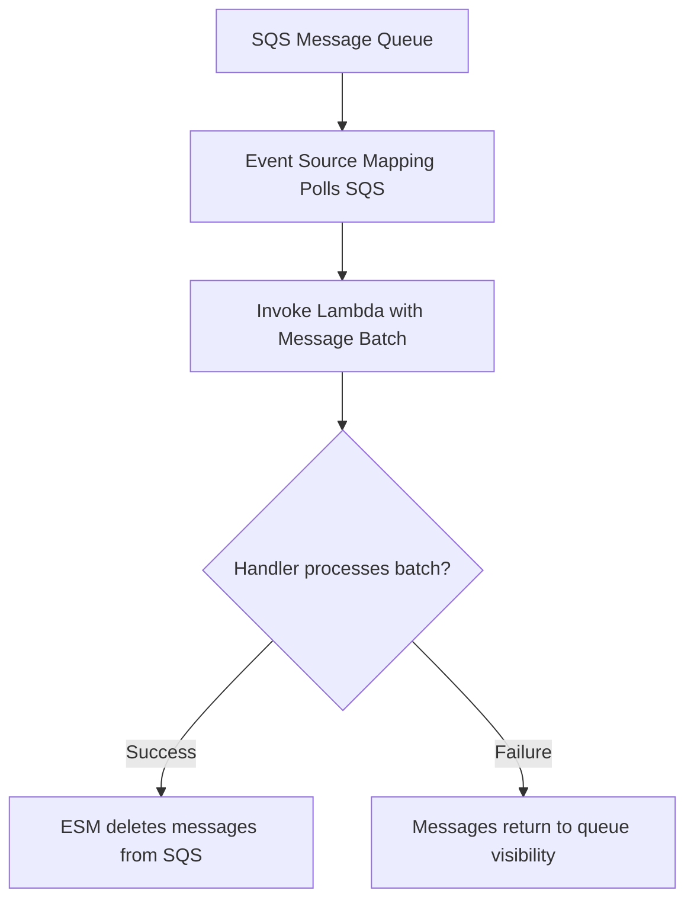

## Table of Contents

1. [The Continuous Process Overhead](#the-continuous-process-overhead)
2. [What Is Lambda](#what-is-lambda)
3. [The JSON Event Contract](#the-json-event-contract)
4. [Invocations and Triggers](#invocations-and-triggers)
5. [Tuning Timeout and Memory](#tuning-timeout-and-memory)
6. [The Retry Hazard and Idempotency](#the-retry-hazard-and-idempotency)
7. [Managing Concurrency Pressure](#managing-concurrency-pressure)
8. [Sample Code Structure](#sample-code-structure)
9. [Putting It All Together](#putting-it-all-together)
10. [What's Next](#whats-next)

## The Continuous Process Overhead

When you run a web application, keeping a process active and waiting for work is a normal requirement. Your web API listens constantly on a port, manages database connection pools, maintains in-memory session caches, and checks load balancer target health paths. The process consumes CPU cycles and RAM even when nobody is browsing the website.

However, once you introduce background operational jobs, this continuous process model becomes highly inefficient:

* **Idle compute waste**: A nightly billing cleanup script or stale-cart sweeper takes five minutes to run. If you host it inside a running container, you pay 24/7 for the memory and CPU needed to support those idle waiting loops.
* **Unpredictable memory surges**: If a user uploads a heavy CSV manifest file, processing the rows locally can spike your web server's RAM usage, starving the primary request thread and dropping active checkout connections.
* **Tight fault coupling**: If the external email service is temporarily slow or offline, your web API threads will block waiting for a response, quickly exhausting your connection pools and bringing down the entire storefront.

To eliminate this overhead and isolate failures, you must decouple these background tasks from your primary request pipeline. You need to transition to event-driven compute. Instead of keeping a process waiting constantly, you package your task as an isolated function that stays inactive until a work trigger arrives, executes its bounded job, and then freezes or shuts down. Without provisioned concurrency, you are not billed for idle wait time between invocations.

## What Is Lambda

AWS Lambda is compute for running isolated application function handlers in response to events. You do not manage host servers, patch container engines, or configure port listeners. You package your code and dependencies, declare the runtime platform (such as Node.js or Python), and define which AWS resource triggers the execution.

A Lambda function is fundamentally different from a continuous container service because it operates under a reactive, rather than a continuous, lifecycle:

Continuous Service Process:

* Startup: Process starts first and waits.
* Networking: Binds to a local port and listens.
* Runtime: Stays active constantly, consuming idle CPU/RAM.
* Lifecycle: Managed by desired count schedulers.

Lambda Event-Driven Function:

* Startup: Has no always-listening process until an event trigger arrives.
* Networking: Has no listener port; reads an incoming JSON payload.
* Runtime: Starts a transient execution environment, processes one job, and freezes.
* Lifecycle: Managed by event triggers and parallel invocations.

This reactive design means you are billed for the compute time your code actively processes requests, plus any configured extras such as provisioned concurrency. When ordinary on-demand invocation volume drops to zero, the function is not sitting on a paid server waiting for work. However, this shift requires a new architectural discipline. A Lambda function should represent a single, bounded operation. It is not a place to host a multi-route, complex web application framework. If a function begins to require route-based middleware, shared process memory, and massive startup packages, it is telling you it belongs inside a container service.

## The JSON Event Contract

A Lambda function does not listen on a network socket like a web server. The primary input your handler receives is a structured JSON document called the Event. Lambda also provides a temporary local filesystem at `/tmp`, which is useful for scratch files during an invocation but should not be treated as durable storage.

The most vital beginner habit in serverless development is treating the event as a strict API contract. The shape of the JSON event is defined entirely by the service triggering the function, and these shapes vary drastically:

* **API Gateway Event**: Simulates a standard HTTP request, containing headers, query parameters, URL path variables, and stringified body payloads.
* **Amazon SQS Event**: A batch list containing SQS message records, where each record contains a unique message ID and a custom body string.
* **Amazon S3 Event**: A metadata record describing a specific bucket name and the exact object key that was uploaded or deleted.
* **EventBridge Scheduled Event**: A clean cron-like metadata envelope containing the request execution timestamp.

If you write a handler expecting a simple object and deploy it to SQS, your function will fail instantly because SQS wraps all messages inside a `Records` array.

SQS Event Payload Structure:

```json
{
  "Records": [
    {
      "messageId": "1a2b3c4d",
      "body": "{\"orderId\":\"ord_5521\",\"email\":\"user@example.com\"}",
      "eventSource": "aws:sqs"
    }
  ]
}
```

Because your code must parse and unpack these nested JSON structures, you must write strict input validation at the edge of your handler. Parse the body, check for required keys, and throw an explicit validation error immediately if the payload is malformed. Catching a schema error at the edge of your code is much easier to debug than a silent failure deep within your database queries.

## Invocations and Triggers

An invocation is one attempt to execute your Lambda function handler. AWS divides these executions into three distinct invocation models, which control how errors are reported and how work is buffered:

* **Synchronous Invocation**: The caller sends the event and blocks, waiting for your handler to return a payload or throw an error. This model is used when Lambda sits behind API Gateway to answer public HTTP requests, where the user is actively waiting for the response.
* **Asynchronous Invocation**: The caller hands the event to Lambda and moves on immediately. Lambda queues the event internally and executes the handler in the background. S3 file uploads and EventBridge schedules use this asynchronous handoff.
* **Queue-Based Polling**: Lambda uses an Event Source Mapping to poll an SQS queue or DynamoDB stream dynamically, gathers records into batches, and hands them to your function handler. This model provides natural back-pressure buffering, ensuring that spike workloads wait safely in the queue until compute capacity is ready.

The mechanism of a queue-based polling trigger follows a vertical, managed path:



Understanding your invocation model is critical. If your function is invoked asynchronously and fails, the caller cannot see the error. You must configure Dead Letter Queues (DLQs) or Lambda Destinations to capture failed events for inspection, and ship all handler errors to CloudWatch Logs to make the failure visible. For SQS batches, the default behavior is also easy to misunderstand: if one record fails and your function throws, Lambda treats the whole batch as failed and successful messages can be retried. To return only the failed records, enable `ReportBatchItemFailures` on the event source mapping and return a `batchItemFailures` list from the handler.

## Tuning Timeout and Memory

Every Lambda function has two critical configuration dials that define its execution boundary: Timeout and Memory.

The **Timeout** is the absolute limit on how long a single invocation is allowed to run before AWS forcibly terminates the execution environment. The default timeout is 3 seconds, but you can configure it up to a maximum of 15 minutes (900 seconds).

Never treat timeout as a safety valve for slow code. If your function connects to an external API that occasionally hangs for ten minutes, setting a ten-minute Lambda timeout will cause your function to run for ten minutes, generating massive, unexpected billing charges during outages. 

Instead, set strict, short timeouts on your internal SDK clients, and size your function timeout to match your expected upper-bound execution time plus a small safety margin.

The **Memory** allocation is your primary performance lever. You can allocate between 128 MB and 10,240 MB of RAM to your function. 

The non-obvious gotcha is that AWS scales CPU power in direct proportion to your memory allocation. When you select 1,769 MB of memory, your function receives the equivalent of 1 full vCPU.

Memory and CPU Scaling Trade-offs:

* **128 MB (Minimum Sizing)**:
  * CPU Share: Very low fraction of a vCPU.
  * Operational Result: Cost-effective for tiny utility scripts, but slow startup times and high latency for library-heavy tasks.
* **1769 MB (The 1-vCPU Threshold)**:
  * CPU Share: 1 full vCPU.
  * Operational Result: Ideal for standard business logic and database writes. Proportional CPU speeds up execution, often lowering the overall bill.
* **10240 MB (Maximum Sizing)**:
  * CPU Share: Multiple vCPUs.
  * Operational Result: Heavy CPU-bound tasks like image manipulation or machine learning inference.

Because billing is based on gigabyte-seconds of execution, raising your memory from 512 MB to 1024 MB can increase CPU share and sometimes cut execution duration enough to offset the higher memory rate. The right setting is workload-specific, so benchmark a few memory sizes instead of assuming the smallest memory value is cheapest.

Additionally, optimize your function performance by leveraging execution environment warm starts. When Lambda reuses a container environment for subsequent invocations, any clients or database connections initialized outside your handler function remain active. 

Always instantiate your AWS SDK clients and database pool connections globally outside the handler. This keeps connections warm, bypassing the expensive cryptographic startup cost during subsequent executions.

## The Retry Hazard and Idempotency

In event-driven architectures, transient network drops, database locking errors, and downstream timeouts are normal operational realities. To ensure reliable delivery, AWS automatically retries failed invocations.

* **Asynchronous Invocations**: Retried twice by default, with exponential backoff.
* **SQS Polling Invocations**: Retried according to the queue's redrive policy, returning failed messages to the queue for a different batch.

This retry behavior introduces a major architectural hazard: the exact same event payload can be delivered to your handler more than once.

If your function processes a payments event, charges a card via Stripe, and then times out before deleting the message, the next retry may execute the payment charge again.

To prevent duplicate charges, financial errors, or double emails, your handler must be idempotent. Idempotency means that executing the same operation multiple times produces the exact same system state as a single execution.

To implement idempotency, your handler must enforce an Idempotency Key. The safest pattern is to atomically claim the key before the external side effect, record the final result after success, and make retries return the stored result instead of repeating the side effect:

```javascript
const idempotencyKey = `payment:${event.orderId}`;

// 1. Atomically claim the transaction key before the external side effect
const claim = await db.tryCreateProcessingRecord(idempotencyKey);
if (!claim.created) {
  console.info("Duplicate transaction skipped", { key: idempotencyKey });
  return claim.storedResult;
}

try {
  // 2. Perform the critical external side effect with the provider's own idempotency key
  const paymentResult = await chargeCard(event.total, event.token, { idempotencyKey });

  // 3. Mark the transaction complete in a fast database
  await db.saveSuccess(idempotencyKey, paymentResult);
  return paymentResult;
} catch (error) {
  await db.markFailedOrRetryable(idempotencyKey);
  throw error;
}
```

By using a fast database such as DynamoDB with a conditional write for the initial claim, you protect your system from retry surges. The event can safely arrive more than once, but duplicate workers see the existing key and do not blindly repeat the external side effect. This order matters: if you charge the card first and only write the idempotency record afterward, a timeout between those two steps leaves no proof that the charge happened. For payment providers, also pass the provider's own idempotency key so their API can reject duplicate charges even if your function is retried.


*A Lambda retry is normal delivery behavior, not an edge case. The handler should claim an idempotency key before the side effect so a repeated event can be recognized and skipped instead of sending the same email or charge twice.*

## Managing Concurrency Pressure

Concurrency is the number of execution environments running your function code simultaneously to handle incoming events. If your SQS queue suddenly receives 1,000 messages, Lambda can scale horizontally to process them quickly, subject to account concurrency limits and event source mapping behavior.

While this horizontal scaling is excellent for processing massive spikes, it introduces a severe danger to your downstream infrastructure:

* **Relational Database Exhaustion**: A traditional relational database (like RDS Postgres) has a finite connection pool. If 1,000 parallel Lambda functions boot and immediately open a connection to the database, they will instantly exhaust the pool, locking up the database and crashing your entire application.
* **Third-Party API Throttling**: A payment vendor or inventory provider may limit your API key to 50 requests per second. A concurrency spike in Lambda will instantly trigger throttling limits on the vendor side, causing all downstream transactions to fail.

To protect your system, you must restrict your function concurrency. You can configure **Reserved Concurrency**, which sets a strict ceiling on the maximum number of parallel environments your function is allowed to create (e.g., limiting the database worker to a maximum of 20 concurrent executions). 

Alternatively, deploy an RDS Proxy between your serverless functions and your database. RDS Proxy pools and shares database connections dynamically, allowing thousands of transient serverless invocations to execute safely without overloading the database engine.

## Sample Code Structure

Here is a clean Node.js handler template for our receipt email function. The code is written strictly without JSDoc or source comments, ensuring maximum readability and focus on the event boundaries:

```javascript
import { SESClient, SendEmailCommand } from "@aws-sdk/client-ses";
import {
  DynamoDBClient,
  GetItemCommand,
  PutItemCommand,
  UpdateItemCommand
} from "@aws-sdk/client-dynamodb";

const ses = new SESClient();
const db = new DynamoDBClient();

export const handler = async (event, context) => {
  const processed = [];
  const batchItemFailures = [];

  for (const record of event.Records ?? []) {
    let idempotencyKey;
    let claimed = false;

    try {
      const message = JSON.parse(record.body);

      if (!message.orderId || !message.email || !message.total) {
        throw new Error(`Invalid message contract: ${record.messageId}`);
      }

      idempotencyKey = `receipt:${message.orderId}`;
      const now = Date.now();
      const processingExpiresAt = now + 10 * 60 * 1000;

      try {
        await db.send(new PutItemCommand({
          TableName: "ProcessedReceipts",
          Item: {
            Id: { S: idempotencyKey },
            Status: { S: "PROCESSING" },
            FirstSeenAt: { N: now.toString() },
            ProcessingExpiresAt: { N: processingExpiresAt.toString() }
          },
          ConditionExpression: "attribute_not_exists(Id)"
        }));
        claimed = true;
      } catch (error) {
        if (error.name !== "ConditionalCheckFailedException") {
          throw error;
        }

        const existing = await db.send(new GetItemCommand({
          TableName: "ProcessedReceipts",
          Key: { Id: { S: idempotencyKey } },
          ConsistentRead: true
        }));

        const status = existing.Item?.Status?.S;
        const expiresAt = Number(existing.Item?.ProcessingExpiresAt?.N ?? "0");

        if (status === "SENT") {
          console.info("Duplicate receipt request skipped", {
            orderId: message.orderId,
            messageId: record.messageId,
            requestId: context.awsRequestId
          });
          continue;
        }

        if (status === "PROCESSING" && expiresAt > now) {
          throw new Error(`Receipt is already being processed: ${message.orderId}`);
        }

        await db.send(new UpdateItemCommand({
          TableName: "ProcessedReceipts",
          Key: { Id: { S: idempotencyKey } },
          UpdateExpression: "SET #status = :processing, ProcessingExpiresAt = :expiresAt, LastAttemptAt = :now",
          ConditionExpression: "#status = :failed OR ProcessingExpiresAt < :now",
          ExpressionAttributeNames: {
            "#status": "Status"
          },
          ExpressionAttributeValues: {
            ":processing": { S: "PROCESSING" },
            ":failed": { S: "FAILED" },
            ":expiresAt": { N: processingExpiresAt.toString() },
            ":now": { N: now.toString() }
          }
        }));
        claimed = true;
      }

      await ses.send(new SendEmailCommand({
        Source: "orders@company.com",
        Destination: { ToAddresses: [message.email] },
        Message: {
          Subject: { Data: `Your Receipt for Order ${message.orderId}` },
          Body: { Text: { Data: `Thank you for your purchase of $${message.total}.` } }
        }
      }));

      await db.send(new UpdateItemCommand({
        TableName: "ProcessedReceipts",
        Key: { Id: { S: idempotencyKey } },
        UpdateExpression: "SET #status = :status, ProcessedAt = :processedAt REMOVE ProcessingExpiresAt",
        ExpressionAttributeNames: {
          "#status": "Status"
        },
        ExpressionAttributeValues: {
          ":status": { S: "SENT" },
          ":processedAt": { N: Date.now().toString() }
        }
      }));

      processed.push(message.orderId);
    } catch (error) {
      if (claimed && idempotencyKey) {
        await db.send(new UpdateItemCommand({
          TableName: "ProcessedReceipts",
          Key: { Id: { S: idempotencyKey } },
          UpdateExpression: "SET #status = :status, LastError = :error, FailedAt = :failedAt",
          ExpressionAttributeNames: {
            "#status": "Status"
          },
          ExpressionAttributeValues: {
            ":status": { S: "FAILED" },
            ":error": { S: error.message },
            ":failedAt": { N: Date.now().toString() }
          }
        }));
      }

      console.error("Receipt message failed", {
        messageId: record.messageId,
        requestId: context.awsRequestId,
        error: error.message
      });

      batchItemFailures.push({ itemIdentifier: record.messageId });
    }
  }

  return { processed, batchItemFailures };
};
```

This handler cleanly implements all serverless design rules:

* **Reuses SDK Clients**: SES and DynamoDB clients are declared globally outside the handler, leveraging warm starts.
* **Strict Schema Verification**: Validates the nested SQS JSON contract at boot.
* **Enforces Idempotency**: Claims the receipt key in DynamoDB with a conditional write before sending the email, treats completed records as duplicates, and lets stale or failed records retry instead of leaving a permanent `PROCESSING` lock.
* **Reports Partial Batch Failures**: Returns failed SQS message IDs so Lambda can delete successful messages and retry only the records that failed, provided the event source mapping has `ReportBatchItemFailures` enabled.
* **Correlates Metadata**: Logs using both business identifiers (`orderId`) and invocation metadata (`requestId`).

## Putting It All Together

Transitioning to event-driven serverless compute requires designing for transient, decoupled, and retry-prone runtime environments:

* **Isolate Bounded Jobs**: Move cron loops, nightly cleanup scripts, and background side effects out of your continuous web servers and onto AWS Lambda.
* **Validate the Event Contract**: Treat incoming JSON event structures as strict APIs. Validate all fields at the absolute edge of your handler.
* **Tune Memory for CPU**: Proactively scale your memory allocation to gain proportional CPU performance, cutting runtimes and lowering your bill.
* **Code for Idempotency**: Expect duplicate deliveries and retries. Enforce DynamoDB-backed idempotency keys to protect external side effects.
* **Limit Your Concurrency**: Restrict maximum parallel invocations using Reserved Concurrency limits or proxies to protect downstream relational databases.

By wrapping your background reactive logic in isolated handlers, tuning their resources, and writing retry-safe idempotent code, you build event-driven architectures that scale quickly, avoid paying for idle on-demand servers, and are highly resilient to failures.

## What's Next

We have established runtime shapes for continuous servers, serverless containers, and event-driven functions. However, what about teams operating at massive scale, who need to coordinate thousands of containers across a shared multi-team platform? How do we run managed Kubernetes clusters on AWS? In the next article, we will explore Amazon EKS, deconstructing pods, deployments, services, VPC CNI IP scaling, and Pod Identity.


*Use this as the Lambda checklist: validate the event contract, know the trigger model, set short timeouts, tune memory for CPU, protect side effects with idempotency keys, and cap concurrency before downstream systems run out of capacity.*

---

**References**

- [AWS Lambda Developer Guide](https://docs.aws.amazon.com/lambda/latest/dg/welcome.html) - Technical details on configuring and operating serverless functions.
- [AWS Lambda Event Source Mappings](https://docs.aws.amazon.com/lambda/latest/dg/invocation-eventsourcemapping.html) - Technical overview of polling-based triggers for queues and streams.
- [Using Lambda with Amazon SQS](https://docs.aws.amazon.com/lambda/latest/dg/with-sqs.html) - Explains SQS event source behavior and partial batch response recommendations.
- [Handling errors for an SQS event source in Lambda](https://docs.aws.amazon.com/lambda/latest/dg/services-sqs-errorhandling.html) - Documents retry behavior, backoff, and `ReportBatchItemFailures`.
- [Database connection management with RDS Proxy](https://docs.aws.amazon.com/AmazonRDS/latest/UserGuide/rds-proxy.html) - Guide on pooling database connections for serverless compute scales.
