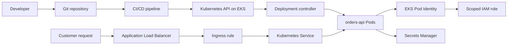

## Table of Contents

1. [The Problem EKS Solves](#the-problem-eks-solves)
2. [What EKS Is](#what-eks-is)
3. [What AWS Manages and What Your Team Owns](#what-aws-manages-and-what-your-team-owns)
4. [Pods, Deployments, Services, and Probes](#pods-deployments-services-and-probes)
5. [Traffic Through Ingress and Load Balancers](#traffic-through-ingress-and-load-balancers)
6. [Worker Capacity: Managed Nodes, Fargate, and Auto Mode](#worker-capacity-managed-nodes-fargate-and-auto-mode)
7. [VPC CNI and IP Runway](#vpc-cni-and-ip-runway)
8. [AWS Permissions With EKS Pod Identity](#aws-permissions-with-eks-pod-identity)
9. [Operations: Add-ons, Upgrades, Debugging, and Rollback](#operations-add-ons-upgrades-debugging-and-rollback)
10. [ECS vs EKS](#ecs-vs-eks)
11. [Putting It All Together](#putting-it-all-together)

## The Problem EKS Solves
<!-- section-summary: EKS fits teams that need Kubernetes as the shared operating contract for many container workloads. -->

Imagine a commerce company that began with two container services: `orders-api` and `inventory-api`. At first, Amazon ECS with AWS Fargate is a very good fit. The team builds an image, pushes it to Amazon ECR, points an ECS service at the image, and lets AWS run the container compute for them.

Six months later, the shape of the platform changes. The payments team wants the same Helm chart pattern they use in another environment. The search team wants a Kubernetes operator to manage indexing jobs. The platform team wants namespaces, admission policies, service mesh experiments, shared observability agents, and one deployment contract for twenty teams. The application is still containers, but the operating layer around those containers has grown.

That is where **Amazon Elastic Kubernetes Service**, usually called **EKS**, enters the AWS compute story. EKS gives the team a managed way to run Kubernetes on AWS. The team still gets AWS networking, IAM, load balancers, EC2 capacity, Fargate options, and AWS observability, while Kubernetes supplies the API and object model that the platform team wants everyone to use.

Before we go deeper, here are the names that will keep showing up in the article:

| Concept | Simple definition | Commerce example |
|---|---|---|
| **Cluster** | One Kubernetes environment with its own API endpoint and worker capacity. | `commerce-prod` runs production services. |
| **Control plane** | The Kubernetes management layer that receives API requests and stores cluster state. | The API server accepts a new `orders-api` deployment. |
| **Worker capacity** | The compute where application pods run. | EC2 nodes or Fargate run the `orders-api` containers. |
| **Pod** | The smallest Kubernetes runtime unit around one or more containers. | One running copy of `orders-api`. |
| **Deployment** | A controller that keeps the desired number of pods running and handles rollouts. | Three `orders-api` pods should run at version `1.8.4`. |
| **Service** | A stable network name in front of changing pods. | `orders-api.shop.svc.cluster.local` sends traffic to ready `orders-api` pods. |
| **Ingress** | HTTP routing rules for traffic entering the cluster. | `shop.example.com/orders` routes to the `orders-api` service. |
| **Pod Identity** | A way to give a Kubernetes service account an AWS IAM role. | `orders-api` can read one Secrets Manager secret through its own workload role. |

These pieces connect in one path. A pipeline applies Kubernetes YAML to the cluster. The control plane records the desired state. Worker capacity runs the pods. Services and ingress route traffic to healthy pods. Pod Identity gives the pod a narrow AWS role for the AWS APIs it needs.

Now that the names are on the table, we can define EKS with the vocabulary connected.

## What EKS Is
<!-- section-summary: EKS is the AWS service that runs the Kubernetes management layer and connects Kubernetes workloads to AWS infrastructure. -->

**EKS is AWS-managed Kubernetes**. Kubernetes is an API-driven system for running containers by declaring desired state in objects such as Deployments, Services, Ingresses, ConfigMaps, and Secrets. A team describes the state it wants in YAML, and Kubernetes controllers keep working to make the live cluster match that description.

In plain terms, EKS gives the commerce team a Kubernetes cluster while AWS runs the Kubernetes management layer. AWS runs the managed control plane, and the team uses normal Kubernetes tools such as `kubectl`, Helm, GitOps controllers, and Kubernetes manifests. The cluster still lives in an AWS account and VPC, so AWS services remain part of the system.

Here is the request path we will keep using:



This diagram shows why EKS has a larger operating surface than a smaller container runtime. The pipeline talks to the Kubernetes API, the API stores Kubernetes objects, controllers create pods, AWS load balancing brings customer traffic into the cluster, and IAM still controls access to AWS services. The team operates a Kubernetes platform that sits on top of AWS infrastructure.

For the commerce team, the release of `orders-api` might start with a container image such as `111122223333.dkr.ecr.us-east-1.amazonaws.com/orders-api:1.8.4`. The pipeline updates a Deployment manifest, applies it to EKS, and Kubernetes rolls the pods gradually. A Service keeps the network name stable while pods rotate, and an Ingress keeps the public URL stable while the backend changes.

That gives us the first important boundary. EKS gives the team a managed Kubernetes foundation, but the cluster still has two different kinds of responsibility: the management layer AWS operates, and the application platform the team designs on top of it.

## What AWS Manages and What Your Team Owns
<!-- section-summary: EKS separates the managed Kubernetes control plane from the worker capacity, access model, add-ons, and workloads your team designs. -->

The **control plane** is the management side of Kubernetes. It includes the API server that receives requests, controllers that compare desired state to live state, the scheduler that places pods, and etcd, the database that stores cluster state. In EKS standard clusters, AWS runs this control plane for you, including the Kubernetes API endpoint and the underlying control-plane storage.

The **data plane** is the worker side where containers actually run. In a standard EKS cluster, the data plane usually means EC2 nodes in managed node groups, self-managed nodes, Fargate pods, or a mix of those choices. AWS manages parts of those choices, but the team still designs capacity, subnets, labels, scaling rules, upgrade timing, and the workload manifests that run there.

That split matters during incidents. The EKS control plane can be healthy while `orders-api` is down because every worker node is full, a subnet is out of pod IP addresses, a bad readiness probe blocks endpoints, or an IAM role lacks permission to read a secret. The status page for the control plane tells only one part of the story.

EKS now has two broad operating modes:

| Mode | What AWS takes on | What the team still handles |
|---|---|---|
| **EKS standard** | Managed Kubernetes control plane, control-plane availability, and AWS integration points. | Node groups or Fargate profiles, add-ons, autoscaling, upgrades, pod networking settings, and workload operations. |
| **EKS Auto Mode** | Control plane plus more data-plane work, including automated node management, pod networking, load balancing integration, storage integration, security-focused node defaults, and Pod Identity agent handling. | Application containers, VPC design, cluster configuration, workload availability, policies, observability, and platform conventions. |

Auto Mode reduces the amount of cluster infrastructure the platform team manages. For a team that wants Kubernetes but has a small platform staff, that can be a practical starting point. For a larger platform group with deep requirements around custom node pools, specialized add-ons, service mesh behavior, GPU placement, and custom networking, standard EKS still gives more direct control.

Access has its own split. **AWS IAM** answers which AWS principal can authenticate to the EKS cluster and call EKS APIs. **Kubernetes authorization** answers what that caller can do inside the cluster, such as reading pods, editing deployments, or creating namespaces. Newer EKS clusters should use **access entries** and access policies for IAM principals, while older clusters may still have the legacy `aws-auth` ConfigMap.

A platform team might give a CI role permission to deploy only into the `shop` namespace. The IAM role authenticates to EKS, and the access entry or Kubernetes RBAC binding gives it namespace-scoped Kubernetes permissions. That keeps a deployment pipeline for `orders-api` away from cluster-admin powers.

The local evidence for a human operator often starts like this:

```bash
aws eks update-kubeconfig \
  --region us-east-1 \
  --name commerce-prod \
  --alias commerce-prod

kubectl get namespaces
kubectl get deployments -n shop
kubectl auth can-i patch deployment/orders-api -n shop
```

Those commands tell a simple story. The AWS CLI writes a kubeconfig entry that uses AWS credentials to authenticate to EKS. `kubectl` then talks to the Kubernetes API. The `can-i` check is useful when Kubernetes RBAC grants permissions directly, while EKS access policies should also be reviewed through the EKS access configuration because they are managed by EKS.

Now we can move from cluster ownership to the actual objects that run the application.

## Pods, Deployments, Services, and Probes
<!-- section-summary: Pods run containers, Deployments manage replicas and rollouts, Services keep network names stable, and probes control traffic safety. -->

A **Pod** is the smallest unit Kubernetes schedules. Most application pods contain one main container, although a pod can also include helper containers that share the same network namespace and local volumes. Kubernetes schedules pods rather than raw containers, so the pod is where restart behavior, resource requests, labels, service accounts, and health checks come together.

A **Deployment** is the controller for a long-running stateless service. It says which pod template should exist, how many replicas should run, and how updates should roll out. If one `orders-api` pod crashes or a node disappears, the Deployment controller creates a replacement pod from the template.

A **Service** is the stable network front door for a group of pods. Pods are temporary, and their IP addresses change during rollouts and rescheduling. A Service selects pods by labels and gives callers a stable DNS name and virtual IP, so `inventory-api` can call `orders-api` while pod IPs rotate behind the Service.

A production Deployment usually includes more than an image name. It includes labels that line up with the Service, resource requests that help the scheduler place pods, security settings that reduce container privileges, and probes that tell Kubernetes when the pod can receive traffic.

```yaml
apiVersion: apps/v1
kind: Deployment
metadata:
  name: orders-api
  namespace: shop
  labels:
    app: orders-api
spec:
  replicas: 3
  selector:
    matchLabels:
      app: orders-api
  strategy:
    type: RollingUpdate
    rollingUpdate:
      maxUnavailable: 0
      maxSurge: 1
  template:
    metadata:
      labels:
        app: orders-api
    spec:
      serviceAccountName: orders-api
      containers:
        - name: orders-api
          image: 111122223333.dkr.ecr.us-east-1.amazonaws.com/orders-api:1.8.4
          ports:
            - containerPort: 8080
          resources:
            requests:
              cpu: 250m
              memory: 512Mi
            limits:
              memory: 768Mi
          readinessProbe:
            httpGet:
              path: /ready
              port: 8080
            initialDelaySeconds: 10
            periodSeconds: 5
          livenessProbe:
            httpGet:
              path: /healthz
              port: 8080
            initialDelaySeconds: 30
            periodSeconds: 10
          securityContext:
            allowPrivilegeEscalation: false
            readOnlyRootFilesystem: true
            capabilities:
              drop: ["ALL"]
---
apiVersion: v1
kind: Service
metadata:
  name: orders-api
  namespace: shop
spec:
  type: ClusterIP
  selector:
    app: orders-api
  ports:
    - name: http
      port: 80
      targetPort: 8080
```

There are a few production ideas hiding in this small file. The `replicas` value asks for three running copies. The rolling update settings let Kubernetes add one new pod before removing old pods, which preserves capacity during the release. The readiness probe controls whether the pod receives Service traffic, while the liveness probe lets Kubernetes restart a container that has stopped making progress.

The label relationship deserves attention because it is the source of many quiet outages:

| Field | Example value | Why it matters |
|---|---|---|
| `spec.selector.matchLabels` on the Deployment | `app: orders-api` | The Deployment uses this to know which pods belong to it. |
| `template.metadata.labels` on the pod template | `app: orders-api` | New pods receive this label when the Deployment creates them. |
| `spec.selector` on the Service | `app: orders-api` | The Service uses this to find ready pods for traffic. |

If the Service selector says `app: order-api` while the pod label says `app: orders-api`, the pods can run perfectly and the Service will still have no endpoints. The customer sees timeouts, the pods look green, and the real issue sits in one missing letter in the label path.

The internal service name solves service-to-service traffic, but customers still need to enter the cluster from the outside. That brings us to ingress and load balancers.

## Traffic Through Ingress and Load Balancers
<!-- section-summary: EKS uses Kubernetes traffic objects together with AWS load balancers to move customer requests into ready pods. -->

An **Ingress** is a Kubernetes object for HTTP and HTTPS routing. It says which host and path should route to which Service. The Ingress object is only the rule; a controller has to watch the rule and create the real load-balancing infrastructure.

In standard EKS clusters, teams commonly install the **AWS Load Balancer Controller**. This controller watches Kubernetes Ingress and Service resources, then creates AWS Elastic Load Balancing resources such as Application Load Balancers and Network Load Balancers. In EKS Auto Mode, load balancer integration is built more directly into the managed cluster infrastructure, and the team configures load balancing through Kubernetes resources such as IngressClass and related parameters.

For the commerce platform, the public route might look like this:

```yaml
apiVersion: networking.k8s.io/v1
kind: Ingress
metadata:
  name: shop-public
  namespace: shop
  annotations:
    alb.ingress.kubernetes.io/scheme: internet-facing
    alb.ingress.kubernetes.io/target-type: ip
spec:
  ingressClassName: alb
  rules:
    - host: shop.example.com
      http:
        paths:
          - path: /orders
            pathType: Prefix
            backend:
              service:
                name: orders-api
                port:
                  number: 80
```

This file connects several layers. The host and path describe the customer-facing route. The backend points to the `orders-api` Service. The Service points to ready pods by label. The load balancer controller creates or updates the AWS load balancer, listeners, target groups, and target registration needed to deliver traffic.

Target type changes the network path. With **IP targets**, the load balancer can register pod IP addresses directly. With **instance targets**, the load balancer sends traffic to worker nodes and uses NodePort plumbing to reach the pods. IP targets are common in EKS because the Amazon VPC CNI gives pods VPC-routable IP addresses, but subnet IP capacity then matters even more.

A traffic debugging session usually follows the request path in order:

```bash
kubectl get ingress shop-public -n shop
kubectl describe ingress shop-public -n shop
kubectl get service orders-api -n shop
kubectl get endpointslice -n shop -l kubernetes.io/service-name=orders-api
kubectl get pods -n shop -l app=orders-api -o wide
```

Those commands ask one question at each layer. Did the Ingress get a load balancer address? Does the Service point to the right selector? Do endpoint slices contain ready backend pods? Are the pods running, ready, and placed on nodes with reachable pod IPs?

Traffic now reaches the pods. The next question is where those pods actually run.

## Worker Capacity: Managed Nodes, Fargate, and Auto Mode
<!-- section-summary: Worker capacity decides where pods run, how scaling works, and how much platform ownership the team accepts. -->

**Worker capacity** is the compute pool behind the Kubernetes API. The scheduler can only place pods where there is available CPU, memory, storage, network capacity, and matching scheduling rules. EKS gives several ways to provide that capacity, and each one changes the day-to-day platform work.

**Managed node groups** are groups of EC2 instances that EKS creates and manages as Kubernetes nodes. The nodes run in your AWS account, usually through an Auto Scaling group managed by EKS. The platform team chooses instance families, capacity type, subnets, labels, taints, launch templates, and upgrade timing.

Managed node groups fit teams that need control. One node group might use On-Demand instances for `orders-api`, another might use Spot instances for retry-safe image-processing jobs, and another might use GPU instances for a product-recommendation batch workload. Kubernetes labels and taints turn those pools into schedulable boundaries.

```yaml
apiVersion: apps/v1
kind: Deployment
metadata:
  name: receipt-worker
  namespace: shop
spec:
  replicas: 4
  selector:
    matchLabels:
      app: receipt-worker
  template:
    metadata:
      labels:
        app: receipt-worker
    spec:
      nodeSelector:
        workload.devpolaris.io/pool: worker-spot
      tolerations:
        - key: workload.devpolaris.io/spot
          operator: Equal
          value: "true"
          effect: NoSchedule
      containers:
        - name: receipt-worker
          image: 111122223333.dkr.ecr.us-east-1.amazonaws.com/receipt-worker:2.3.0
```

This kind of placement gives the platform team cost control. The checkout path can stay on steady On-Demand capacity, while a receipt job that can retry after interruption can use cheaper Spot capacity. The rule lives in Kubernetes YAML, so reviewers can see the placement decision beside the workload.

**EKS on Fargate** runs selected pods on AWS Fargate infrastructure rather than EC2 nodes you manage. A Fargate profile selects namespaces and labels, and matching pods run on Fargate-managed capacity. Fargate can fit small services, isolated workloads, or teams that want pod-level serverless compute, but it has its own constraints around DaemonSets, privileged node-level agents, and some networking and storage patterns.

**EKS Auto Mode** takes on more of the data-plane work. AWS handles automated node provisioning, node repair and replacement, load balancer integration, pod networking operations, storage integration, and some managed components that standard clusters often treat as add-ons. The team can still create custom NodePools and NodeClasses for workload-specific needs, while AWS manages more of the routine lifecycle.

The practical choice is about ownership:

| Capacity choice | Good fit | Operational attention |
|---|---|---|
| **Managed node groups** | Teams that need EC2 control, custom AMIs or launch templates, multiple pools, GPUs, DaemonSets, or detailed scheduling rules. | Node scaling, AMI updates, node draining, add-ons, subnet IP capacity, and cluster autoscaling. |
| **Fargate profiles** | Teams that want selected pods to run on serverless pod capacity. | Profile design, pod execution role, workload compatibility, startup behavior, and cost visibility. |
| **EKS Auto Mode** | Teams that want Kubernetes with more AWS-managed infrastructure defaults. | Cluster settings, application reliability, VPC design, policy, observability, and custom pools only where needed. |

Capacity is never only CPU and memory in EKS. Because pod networking uses VPC addresses, the subnet can run out of usable IPs before nodes run out of compute. That is the EKS networking topic people usually meet during their first scaling incident.

## VPC CNI and IP Runway
<!-- section-summary: The Amazon VPC CNI gives pods VPC-routable addresses, so subnet planning is part of pod capacity planning. -->

The **Amazon VPC Container Network Interface**, usually shortened to **VPC CNI**, is the networking plugin that connects Kubernetes pods to your AWS VPC. In EKS, pods on EC2 nodes can receive private IP addresses from VPC subnets. That makes pod traffic look like normal VPC traffic, which helps with private databases, VPC endpoints, security groups, route tables, and AWS load balancers.

This design is very useful in production. If `orders-api` calls an internal RDS database or a private VPC endpoint for Secrets Manager, the network path stays inside the VPC design the cloud team already understands. The same VPC flow logs, subnet routes, security groups, and network controls can help explain the traffic.

The tradeoff is IP capacity. Each pod needs an address path. On EC2 nodes, the CNI manages elastic network interfaces, secondary private IP addresses, and warm pools so pods can start quickly. Warm IPs are available addresses the CNI keeps ready before a pod needs them, and those warm addresses still consume subnet space.

Here is a small capacity sketch:

| Planning item | Example |
|---|---|
| Availability Zones | 3 private application subnets |
| Expected `orders-api` pods | 30 pods during normal traffic |
| Expected worker pods and jobs | 90 pods during normal traffic |
| Rollout and failure buffer | 40 extra pods |
| Warm IP and autoscaling buffer | 60 extra addresses |
| Starting pod IP runway | Around 220 pod addresses, before future growth |

A `/24` subnet has 256 total IPv4 addresses, and AWS reserves some addresses in each subnet. Three `/24` private subnets may sound large at the first design meeting, but a busy EKS cluster can consume that space through pods, warm pools, nodes, load balancers, and growth. The painful failure mode is a deployment that fails to add pods even though CPU and memory still look available.

Prefix delegation can help. Instead of assigning individual secondary IP addresses one by one, the CNI can assign IP prefixes to nodes, which increases the number of pod IPs a node can manage and reduces EC2 API calls during scaling. EKS Auto Mode uses prefix delegation by default for pod networking and manages more of this IP lifecycle for you, but the VPC and subnet size still belong in the design review.

In real platform work, the EKS subnet plan should answer these questions before the first production cluster:

| Question | Why it matters |
|---|---|
| How many pods can run during rollout peaks and steady state? | Rolling updates temporarily run old and new pods together. |
| How many pods appear during a node failure or Availability Zone recovery? | Replacement capacity needs IPs while failed capacity drains. |
| Which subnets are used by nodes, pods, internal load balancers, and public load balancers? | Shared subnets can lose IP runway from several directions. |
| Will the cluster use prefix delegation, custom networking, IPv6, or security groups for pods? | These features change pod density and subnet design. |
| How will the team alert on available subnet IPs? | IP exhaustion looks like a scheduling problem until someone checks the VPC layer. |

A useful incident command set crosses Kubernetes and AWS:

```bash
kubectl get pods -n shop -o wide
kubectl describe node ip-10-42-18-91.ec2.internal
kubectl -n kube-system get pods -l k8s-app=aws-node

aws ec2 describe-subnets \
  --subnet-ids subnet-0123456789abcdef0 subnet-0fedcba9876543210 \
  --query 'Subnets[*].{SubnetId:SubnetId,AvailableIpAddressCount:AvailableIpAddressCount,CidrBlock:CidrBlock}'
```

The Kubernetes commands show whether pods are pending and which node or subnet pattern they follow. The AWS command shows available IPs in the subnets. EKS debugging often gets clear only after both views sit next to each other.

With networking covered, the next production question is permissions. Pods usually need AWS access, and that access should belong to the workload role instead of every node in the cluster.

## AWS Permissions With EKS Pod Identity
<!-- section-summary: EKS Pod Identity maps a Kubernetes service account to a scoped IAM role so pods can call AWS APIs with temporary credentials. -->

Applications inside EKS often call AWS services. `orders-api` might read a database password from Secrets Manager, write order events to SQS, or read product metadata from S3. The risky old pattern is giving a broad IAM role to the EC2 node and letting every pod on that node inherit too much AWS access.

**EKS Pod Identity** gives a cleaner boundary. A Kubernetes service account in a namespace is associated with an IAM role. Pods that use that service account receive temporary AWS credentials through the EKS Pod Identity credential path, and the AWS SDK inside the container can use those credentials automatically.

There are three separate identities in this story:

| Identity | Lives in | Job |
|---|---|---|
| **Kubernetes service account** | Kubernetes namespace | Names which workload identity the pod uses inside the cluster. |
| **IAM role** | AWS IAM | Defines which AWS API actions the workload can call. |
| **Pod Identity association** | EKS API | Connects one service account in one namespace to one IAM role. |

The IAM role trust policy for Pod Identity uses the EKS pods service principal:

```json
{
  "Version": "2012-10-17",
  "Statement": [
    {
      "Sid": "AllowEksAuthToAssumeRoleForPodIdentity",
      "Effect": "Allow",
      "Principal": {
        "Service": "pods.eks.amazonaws.com"
      },
      "Action": [
        "sts:AssumeRole",
        "sts:TagSession"
      ]
    }
  ]
}
```

The permission policy should be narrow. For `orders-api`, the role might read only the production database secret and publish only to the order-events queue:

```json
{
  "Version": "2012-10-17",
  "Statement": [
    {
      "Sid": "ReadOrdersDatabaseSecret",
      "Effect": "Allow",
      "Action": "secretsmanager:GetSecretValue",
      "Resource": "arn:aws:secretsmanager:us-east-1:111122223333:secret:prod/orders-api/db-*"
    },
    {
      "Sid": "PublishOrderEvents",
      "Effect": "Allow",
      "Action": "sqs:SendMessage",
      "Resource": "arn:aws:sqs:us-east-1:111122223333:prod-order-events"
    }
  ]
}
```

The Kubernetes side is ordinary YAML. The Deployment says which service account it uses:

```yaml
apiVersion: v1
kind: ServiceAccount
metadata:
  name: orders-api
  namespace: shop
---
apiVersion: apps/v1
kind: Deployment
metadata:
  name: orders-api
  namespace: shop
spec:
  selector:
    matchLabels:
      app: orders-api
  template:
    metadata:
      labels:
        app: orders-api
    spec:
      serviceAccountName: orders-api
      containers:
        - name: orders-api
          image: 111122223333.dkr.ecr.us-east-1.amazonaws.com/orders-api:1.8.4
```

The AWS API creates the association between the service account and the IAM role:

```bash
aws eks create-pod-identity-association \
  --cluster-name commerce-prod \
  --namespace shop \
  --service-account orders-api \
  --role-arn arn:aws:iam::111122223333:role/eks-orders-api-prod
```

On standard EKS clusters, the EKS Pod Identity Agent needs to run in the cluster before pods can receive credentials. EKS Auto Mode handles that agent requirement for Auto Mode clusters. Pod Identity associations are eventually consistent, so platform teams usually create or update them in setup workflows rather than inside a hot deployment path.

One compatibility note belongs right beside this pattern. AWS lists EKS Pod Identity support for pods running on Linux Amazon EC2 worker nodes. Fargate pods, Windows EC2 pods, AWS Outposts, EKS Anywhere, and Kubernetes clusters you run yourself sit outside that support path. For Fargate workloads, the pod execution role handles Fargate infrastructure tasks such as pulling images and routing logs, while application AWS access needs a separate supported credential design and a test before the team chooses Fargate for that workload.

Many existing clusters still use **IAM Roles for Service Accounts**, usually called **IRSA**. IRSA uses an OIDC provider and service account annotations. Pod Identity is the newer EKS-native path for many workloads, and teams usually migrate service by service so they can verify one workload before changing the whole cluster.

The benefit shows up during review. The node role can stay focused on node-level tasks. `orders-api` receives only the AWS actions it needs. `receipt-worker` receives a different role. A random debug pod in the same namespace receives AWS powers only when it uses an associated service account.

Now the platform can run pods, route traffic, and give workloads AWS permissions. The remaining work is operations: keeping the cluster healthy after the first successful deployment.

## Operations: Add-ons, Upgrades, Debugging, and Rollback
<!-- section-summary: EKS operations combine Kubernetes evidence with AWS evidence, especially around add-ons, upgrades, failed rollouts, and capacity. -->

An EKS cluster has platform components beyond your application pods. **Add-ons** are cluster components such as CoreDNS, `kube-proxy`, the Amazon VPC CNI, the EBS CSI driver, and the EKS Pod Identity Agent. Amazon EKS add-ons give AWS-managed installation and update paths for supported components, while some teams still manage certain controllers through Helm or GitOps.

The platform team should treat add-ons as production software. Version changes can affect DNS, pod networking, storage mounts, load balancing, and credential delivery. A release plan for EKS usually includes application manifests, managed add-on versions, Helm chart versions, node AMIs, autoscaling settings, and cluster access configuration.

Cluster upgrades need a staged rhythm. EKS control plane upgrades move one Kubernetes minor version at a time. Before the update, teams review upgrade insights, deprecated API usage, add-on compatibility, node versions, Pod Disruption Budgets, and `kubectl` version compatibility. After the control plane update, they update nodes and add-ons so the cluster stays in a supported version mix.

Here is a practical upgrade checklist for the `commerce-prod` cluster:

| Step | Evidence to collect |
|---|---|
| Review upgrade insights | EKS cluster insights and deprecated API findings. |
| Check workload disruption settings | Pod Disruption Budgets for `orders-api`, `inventory-api`, ingress, and critical controllers. |
| Check add-ons | Current and target versions for VPC CNI, CoreDNS, `kube-proxy`, EBS CSI, and Pod Identity Agent. |
| Update control plane | EKS update status and Kubernetes API health. |
| Update nodes or confirm Auto Mode behavior | Managed node group rollout status, node readiness, and pod rescheduling. |
| Update add-ons | EKS add-on status, controller logs, and workload smoke tests. |
| Verify customer paths | Ingress address, Service endpoints, readiness, logs, and synthetic checks. |

A command bundle during an upgrade or incident often looks like this:

```bash
kubectl get nodes -o wide
kubectl get pods -A --field-selector=status.phase!=Running
kubectl get events -A --sort-by=.lastTimestamp
kubectl get pdb -A
kubectl rollout status deployment/orders-api -n shop
kubectl logs deployment/orders-api -n shop --all-containers=true --tail=100

aws eks describe-cluster \
  --name commerce-prod \
  --query 'cluster.{status:status,version:version,endpoint:endpoint}'

aws eks list-addons --cluster-name commerce-prod
```

These commands collect the minimum useful story. Nodes show data-plane health. Pending pods and events show scheduling and controller errors. Pod Disruption Budgets show whether voluntary maintenance can proceed. Rollout status and logs show the application layer. The EKS API shows cluster and add-on state from the AWS side.

Rollback has different meanings depending on the layer. A bad application Deployment can roll back through Kubernetes rollout history:

```bash
kubectl rollout history deployment/orders-api -n shop
kubectl rollout undo deployment/orders-api -n shop
kubectl rollout status deployment/orders-api -n shop
```

A bad manifest change can also roll forward by applying a fixed Git commit. Many teams prefer GitOps for EKS because the cluster state then follows reviewed files in a repository. If an Ingress annotation breaks traffic, reverting the commit that changed the Ingress is cleaner than editing the live object by hand and leaving the repository behind.

Node and cluster rollback require more care. A managed node group update can often be handled by creating a new corrected node group, cordoning or draining bad nodes, and letting pods reschedule onto healthy capacity. A Kubernetes control plane version update should be treated as a carefully tested forward path with a restore or new-cluster migration plan. Teams reduce risk with staging clusters, upgrade insights, backups for persistent state, and application smoke tests before production.

The main operating habit is to follow the layer that changed. If the image changed, start with Deployment rollout, pod logs, and readiness. If the load balancer changed, start with Ingress, controller events, target groups, and Service endpoints. If the node group changed, start with nodes, taints, pending pods, and subnet IPs. If the cluster version changed, include add-ons, API deprecations, node versions, and controller compatibility.

This operational weight is exactly why EKS should be a deliberate choice. The final decision is usually between the smaller AWS-native container contract and the larger Kubernetes platform contract.

## ECS vs EKS
<!-- section-summary: ECS fits AWS-native container hosting, while EKS fits teams that need Kubernetes as their platform contract. -->

Amazon ECS and Amazon EKS both run containers on AWS. The real question is the operating contract your organization wants to support. ECS gives teams AWS-native container objects: task definitions, services, clusters, target groups, and IAM task roles. EKS gives teams Kubernetes objects: pods, deployments, services, ingress, namespaces, service accounts, controllers, and add-ons.

For a small product team running a few HTTP APIs and background workers, ECS with Fargate can be the faster and quieter choice. The team gets managed container hosting, load balancer integration, service autoscaling, task roles, logs, and fewer Kubernetes-specific operations. The platform surface stays smaller.

EKS fits a different organization shape. It fits teams that already use Kubernetes, need Helm charts, operate custom controllers, use service mesh policies, enforce admission controls, share a multi-team cluster platform, need Kubernetes-native observability, or want one deployment API that can also run outside AWS. The team accepts more platform work because Kubernetes itself is part of the value.

| Situation | Stronger fit |
|---|---|
| A few AWS-hosted container APIs with straightforward routing and scaling | ECS with Fargate |
| A shared platform for many teams using Kubernetes manifests and Helm | EKS |
| Workloads needing custom controllers, operators, admission policies, or service mesh patterns | EKS |
| A team with little Kubernetes experience and no platform staff | ECS with Fargate or EKS Auto Mode only after a careful review |
| GPU jobs, advanced scheduling, many node pools, or Kubernetes-native batch tooling | EKS |
| A service that only needs to run one container behind an ALB | ECS with Fargate |

For the commerce company, EKS makes sense only if Kubernetes solves real platform requirements. A team can defend EKS in a design review with a concrete sentence: "We need Kubernetes because our teams share Kubernetes manifests, namespace policy, workload identity, ingress conventions, custom controllers, and node-pool scheduling across many services." That sentence is much stronger than choosing EKS because Kubernetes is familiar or fashionable.

Now we can connect the whole article into one production flow.

## Putting It All Together
<!-- section-summary: EKS ties Kubernetes objects, AWS networking, IAM, capacity, and operations into one platform workflow. -->

The commerce team ships `orders-api:1.8.4`. The pipeline pushes the image to ECR, updates the Deployment manifest, and applies it to the `commerce-prod` EKS cluster. The Kubernetes API stores the new desired state, the Deployment controller creates one new pod at a time, and readiness probes decide which pods can receive traffic.

The Service keeps the internal name stable while pods rotate. The Ingress keeps `shop.example.com/orders` stable while the AWS load balancer sends traffic to the current ready backends. The Amazon VPC CNI gives pods VPC-routable addresses, so subnet IP runway and warm IP behavior are part of the capacity plan.

The `orders-api` pod uses the `orders-api` Kubernetes service account. EKS Pod Identity maps that service account to a narrow IAM role that can read one Secrets Manager path and publish to one SQS queue. The application code uses the AWS SDK credential chain, so static AWS keys stay out of the container image and Kubernetes Secret.

When a rollout fails, the team follows the evidence path. Deployment status shows rollout progress. Pod events and logs show application and scheduling failures. Service endpoints show whether traffic has healthy backends. Ingress and load balancer status show whether the external route is connected. EKS and AWS commands show cluster version, add-ons, node groups, and subnet IP capacity.

That is EKS in one connected story. AWS manages the Kubernetes control plane, and in Auto Mode it manages more of the data-plane infrastructure. Your team still owns the application platform contract: Kubernetes objects, workload identity, traffic routing, VPC design, capacity choices, upgrade rhythm, observability, and rollback practice. EKS is powerful because it lets Kubernetes and AWS meet in one platform, and it asks for care because both sides matter during production work.

---

**References**

- [What is Amazon EKS?](https://docs.aws.amazon.com/eks/latest/userguide/what-is-eks.html) - Defines EKS standard mode, EKS Auto Mode, managed Kubernetes, and AWS integration points.
- [Automate cluster infrastructure with EKS Auto Mode](https://docs.aws.amazon.com/eks/latest/userguide/automode.html) - Explains Auto Mode automation for compute, load balancing, networking, storage, identity, upgrades, and shared responsibility.
- [Simplify node lifecycle with managed node groups](https://docs.aws.amazon.com/eks/latest/userguide/managed-node-groups.html) - Documents managed node group behavior, Auto Scaling groups, labels, updates, Spot capacity, and Pod disruption budget handling.
- [Amazon EKS Pod execution IAM role](https://docs.aws.amazon.com/eks/latest/userguide/pod-execution-role.html) - Explains the role used by EKS Fargate infrastructure to run pods and call AWS APIs on your behalf.
- [Route internet traffic with AWS Load Balancer Controller](https://docs.aws.amazon.com/eks/latest/userguide/aws-load-balancer-controller.html) - Documents how the controller watches Kubernetes Ingress and Service resources and creates Elastic Load Balancing resources.
- [Create an IngressClass to configure an Application Load Balancer](https://docs.aws.amazon.com/eks/latest/userguide/auto-configure-alb.html) - Shows the EKS Auto Mode path for creating Application Load Balancers from Kubernetes ingress resources.
- [Amazon VPC CNI best practices](https://docs.aws.amazon.com/eks/latest/best-practices/vpc-cni.html) - Explains pod IP assignment, ENIs, warm pools, subnet consumption, and pod density constraints.
- [Assign more IP addresses to Amazon EKS nodes with prefixes](https://docs.aws.amazon.com/eks/latest/userguide/cni-increase-ip-addresses.html) - Documents prefix delegation for increasing pod IP capacity and reducing EC2 API pressure during scale.
- [Learn how EKS Pod Identity grants pods access to AWS services](https://docs.aws.amazon.com/eks/latest/userguide/pod-identities.html) - Explains Pod Identity, the Pod Identity Agent, SDK credential delivery, service-account associations, and key considerations.
- [Assign an IAM role to a Kubernetes service account](https://docs.aws.amazon.com/eks/latest/userguide/pod-id-association.html) - Documents how to associate a Kubernetes service account with an IAM role using EKS Pod Identity.
- [Grant IAM users and roles access to Kubernetes APIs](https://docs.aws.amazon.com/eks/latest/userguide/grant-k8s-access.html) - Explains EKS cluster authentication through IAM principals, access entries, and Kubernetes permissions.
- [Amazon EKS add-ons](https://docs.aws.amazon.com/eks/latest/userguide/eks-add-ons.html) - Documents AWS-managed add-ons, managed configuration fields, and add-on update options.
- [Update existing cluster to new Kubernetes version](https://docs.aws.amazon.com/eks/latest/userguide/update-cluster.html) - Covers EKS control plane upgrades, node version considerations, add-on updates, upgrade insights, and `kubectl` compatibility.
- [Understand the Kubernetes version lifecycle on EKS](https://docs.aws.amazon.com/eks/latest/userguide/kubernetes-versions.html) - Documents EKS standard support, extended support, and auto-upgrade behavior at lifecycle end.
- [Pods](https://kubernetes.io/docs/concepts/workloads/pods/) - Defines pods as the smallest deployable Kubernetes units and explains their shared network and storage context.
- [Deployments](https://kubernetes.io/docs/concepts/workloads/controllers/deployment/) - Explains Deployment rollout behavior, replica management, `maxUnavailable`, and `maxSurge`.
- [Service](https://kubernetes.io/docs/concepts/services-networking/service/) - Defines Services as stable network abstractions over changing pod backends.
- [Liveness, Readiness, and Startup Probes](https://kubernetes.io/docs/concepts/workloads/pods/probes/) - Explains how probes let Kubernetes restart unhealthy containers and keep containers that are still starting or unhealthy out of traffic.
