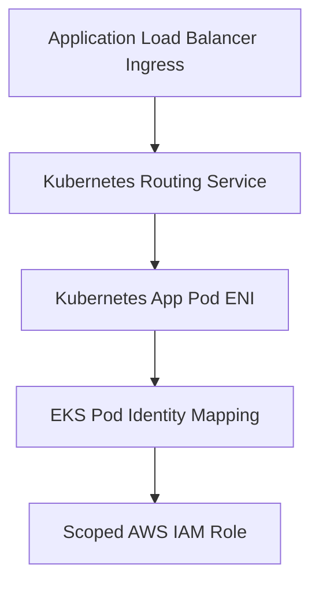

## Table of Contents

1. [The Platform Scale Challenge](#the-platform-scale-challenge)
2. [What Is EKS](#what-is-eks)
3. [The Control Plane vs Worker Capacity](#the-control-plane-vs-worker-capacity)
4. [Kubernetes Core Nouns: Pods, Deployments, and Services](#kubernetes-core-nouns-pods-deployments-and-services)
5. [VPC CNI Subnet IP Sizing](#vpc-cni-subnet-ip-sizing)
6. [Least-Privilege Authorization with Pod Identity](#least-privilege-authorization-with-pod-identity)
7. [ECS vs EKS: The Platform Trade-off](#ecs-vs-eks-the-platform-trade-off)
8. [Putting It All Together](#putting-it-all-together)

## The Platform Scale Challenge

When an engineering team starts launching containerized services in AWS, the operational workflow around Amazon ECS and AWS Fargate is highly productive. The team builds Docker images, registers version-specific task definitions, and runs native ECS services behind Application Load Balancers. The system architecture is straightforward and native to AWS.

However, as the organization grows and scales its containerized footprint, the platform requirements quickly shift:

* Sibling engineering teams want to deploy microservices using the exact same Kubernetes manifests, Helm charts, and custom resource definitions they already run in separate environments.
* Workloads require advanced architectural patterns, such as dynamic traffic sidecars for a service mesh, automated custom controllers, or custom pod placement rules based on labels.
* Platform engineers want to enforce logical workspaces (namespaces), custom admission controllers, shared logging add-ons, and a single API layer to manage hundreds of distinct services.
* The system still needs AWS-native VPC networking, security groups, IAM access roles, and private database connections to behave securely and predictably.

This is where Amazon Elastic Kubernetes Service, known as EKS, enters the compute conversation. EKS is not simply a managed version of ECS. It is the AWS service designed to host Kubernetes clusters when Kubernetes itself is the primary operating layer your team wants to establish.

To use EKS effectively, you must stop viewing it as a simple container runtime and start treating it as a complete platform ecosystem. You trade the simplicity of AWS-native container services for the immense extensibility of the Kubernetes standard.

## What Is EKS

Amazon EKS is AWS-managed Kubernetes. Kubernetes is an open-source system designed to run containerized workloads by declaring your desired system state in YAML manifests, and letting the cluster automatically work to reconcile reality with that shape.

EKS is different from ECS because Kubernetes becomes the active interface between your team and the AWS cloud runtime. In ECS, your primary operational files describe task definitions, services, and task desired counts. In EKS, you manage Pods, Deployments, Services, and Namespaces.

The architectural request and access pipeline in EKS bridges the Kubernetes API layer with your native VPC subnets:

This pipeline demonstrates how Kubernetes resources are cabled directly into AWS infrastructure. The Application Load Balancer routes external traffic through a Kubernetes Ingress Controller directly into the virtual cluster. 

The Kubernetes Service maps requests to the private IP addresses of the running Pods. EKS Pod Identity associates the workload's Kubernetes service account with a scoped AWS IAM Role, granting the container dynamic permissions to call AWS APIs.

## The Control Plane vs Worker Capacity

To operate EKS, you must understand the separation between the cluster's brain, called the Control Plane, and its muscle, called Worker Capacity.

The **Control Plane** is the core management layer of Kubernetes. It runs the API Server (which receives and authenticates your YAML manifests), the Scheduler (which decides which node runs your containers), the Controller Manager (which monitors replica states), and etcd (the durable database that stores the cluster state). 

In self-managed Kubernetes, operating this control plane requires significant effort to ensure high availability, back up etcd, and secure API server access. EKS completely eliminates this burden: AWS runs and automatically scales the control plane behind a secure, highly available API endpoint inside an AWS-managed boundary.

The **Worker Capacity** is the actual compute infrastructure where your application containers execute. The control plane does not run your code; it only schedules where the containers should go. Your team must choose how to provision and manage this worker capacity:

* **Managed Node Groups**: EKS provisions and operates groups of EC2 virtual servers that register as Kubernetes nodes in your cluster. Your team chooses the instance types, but AWS handles node updates, AMI lifecycle, and draining tasks during maintenance.
* **Fargate Profiles**: You define selective namespaces and labels, and EKS automatically runs those specific pods on AWS Fargate serverless compute, eliminating EC2 virtual nodes completely.
* **EKS Auto Mode**: An automated compute model where AWS dynamically provisions, sizes, and updates the worker nodes based on active pod resource requests, reducing infrastructure overhead.

This division is an essential operational checkpoint. The EKS control plane can be 100% healthy while your application is completely offline because the worker nodes are out of memory, subnets are exhausted, or your pod manifests requested resources that the capacity group cannot fulfill.

## Kubernetes Core Nouns: Pods, Deployments, and Services

When you transition to EKS, you write YAML manifests to describe three core Kubernetes resources that manage your application compute:

* **Pods**: The smallest deployable unit in Kubernetes. A pod wraps one or more container processes that must share the exact same network space and local storage. Kubernetes schedules, scales, and terminates pods, never raw containers.
* **Deployments**: The desired-state controller for your pods. A Deployment manifest describes the pod template, the desired replica count, and the rollout strategy (such as rolling updates). If a pod crashes, the Deployment controller automatically schedules a replacement.
* **Services**: The stable network routing endpoint for your pods. Because pods are temporary and receive dynamic IP addresses, you cannot target their IPs directly. A Service selects pods using labels (such as `app: orders-api`) and provides a stable DNS name and virtual IP to route traffic inside the cluster.

To manage your stateless containers successfully, you must ensure that your metadata labels match perfectly.

Kubernetes Label Binding Mapping:

* **Deployment metadata.name**:
  * Value: `orders-api`
  * Operational Job: Names the controller managing the pod replicas.
* **Deployment spec.selector.matchLabels**:
  * Value: `app: orders-api`
  * Operational Job: Tells the deployment controller which running pods it owns.
* **Pod template.metadata.labels**:
  * Value: `app: orders-api`
  * Operational Job: Attaches the label identifier to the spawned pods.
* **Service spec.selector**:
  * Value: `app: orders-api`
  * Operational Job: Tells the service router which active pods must receive incoming traffic.

If a developer makes a minor typo, setting the Service selector to `app: order-api` while the Deployment spawns pods with `app: orders-api`, the service will find zero healthy backends. 

The pods will be running successfully in the cluster, but the load balancer health checks will fail, and users will receive connection timeouts because the network gatekeeper is looking for a label that does not exist.

## VPC CNI Subnet IP Sizing

One of the most significant architectural differences between running containers in EKS and other platforms is how networking is integrated into your VPC. EKS enforces this integration using the Amazon VPC Container Network Interface (CNI) plugin.

Under the Amazon VPC CNI, every single pod launched on your worker nodes receives a real, fully routed private IP address from your VPC subnets. The CNI attaches secondary ENIs and pre-allocates warm private IPs directly to the EC2 worker hosts.

This architecture provides a massive operational benefit: pod traffic is native VPC traffic. You do not manage complex network address translation (NAT) bridges inside the cluster, and pods can connect directly to private databases or external VPC endpoints using standard security group rules.

However, this architecture introduces a severe subnet capacity hazard:

* **Rapid IP Address Exhaustion**: A single large EC2 worker node can run dozens of pods. If you run a cluster with 10 nodes and each node runs 30 pods, you consume 300 private IP addresses from your subnet instantly.
* **Warm IP Pre-allocation**: To speed up container launch times, the CNI pre-allocates and holds a pool of warm private IP addresses on each node. Even if you only run 5 active pods, the nodes may hold 60 VPC IP addresses host-bound, quickly draining smaller subnets.

If you build your EKS cluster inside tight `/24` subnets (which only provide 251 usable IP addresses), your cluster will quickly fail to scale. Nodes will refuse to schedule new pods, and deployments will get stuck because the VPC subnet has run completely out of private IP addresses. 

When designing for EKS, you must size your private application subnets generously (using at least `/20` or `/19` CIDR blocks) to provide the massive IP address runway that Kubernetes workloads demand.

## Least-Privilege Authorization with Pod Identity

Securing your containerized applications in EKS requires separating Kubernetes cluster permissions from AWS API permissions.

First, authorize operators and pipelines using Kubernetes Role-Based Access Control (RBAC). RBAC defines what a principal can do inside the Kubernetes API server (such as creating namespaces or editing deployments).

Second, authorize your application code to call AWS APIs (like reading S3 or Secrets Manager) using **EKS Pod Identity**.

Historically, granting AWS permissions to containers on EC2 hosts was coarse and insecure: you attached the IAM role to the EC2 host node profile, which automatically granted every container running on that host the same high-level permissions. EKS Pod Identity completely eliminates this risk:

* **Workload Association**: You create a standard Kubernetes Service Account inside your namespace and associate it directly with a scoped AWS IAM Role.
* **Scoped Temporary Credentials**: When EKS schedules your pod, the EKS Pod Identity agent automatically mounts a temporary security token directly into the pod container environment.
* **Zero-Trust Boundary**: Your application code uses the standard AWS SDK, which reads the mounted token and signs S3 or Secrets Manager API requests under the narrow role. 

Unrelated pods running on the exact same host EC2 node remain completely blocked from accessing your AWS resources, enforcing least-privilege security at the individual container boundary.

## ECS vs EKS: The Platform Trade-off

Choosing between Amazon ECS and Amazon EKS is not a technical ranking. It is a decision about which operating layer your organization wants to maintain.

* **Amazon ECS (AWS-Native Containers)**:
  * Simplicity: Extremely high. It uses native AWS concepts, integrates out of the box with standard security groups and load balancers, and requires very little specialized container knowledge.
  * Operational Cost: Very low. Ideal for teams that want to run standard, containerized web APIs and background workers with minimum infrastructure management.
* **Amazon EKS (Kubernetes Container Platform)**:
  * Complexity: High. It introduces an entirely new platform API layer with clusters, nodes, pods, deployments, services, ingress, Helm charts, namespaces, RBAC, and add-ons.
  * Operational Cost: Significant. Requires ongoing cluster upgrades, platform engineering support, and specialized Kubernetes training for developers.
  * When to Choose: Mandatory when your applications require cross-cloud portability, advanced Kubernetes ecosystem integrations (such as service meshes or operators), or when you operate a shared, multi-team container platform.

Avoid the trap of choosing EKS simply because Kubernetes is a popular buzzword. If your startup only needs to run a few web containers and connect them to a database, choosing EKS will divert valuable engineering hours into cluster maintenance and YAML troubleshooting. 

ECS with Fargate provides the same container speed, high availability, and security with a fraction of the operational complexity. Choose EKS only when the unique platform features of Kubernetes deliver a concrete, strategic advantage to your organization.

## Putting It All Together

Amazon EKS is a powerful container orchestrator that bridges the vast Kubernetes ecosystem with the secure infrastructure of AWS:

* **Differentiate the Plane from Node**: Separate control plane health (managed by AWS) from worker node capacity (managed by your team).
* **Align Your Selectors**: Enforce perfect label selectors across your Deployment replicas and Service routers to guarantee successful traffic paths.
* **Size Your VPC Subnets Generously**: Plan for rapid IP consumption under the Amazon VPC CNI. Allocate large private application subnets to prevent IP exhaustion.
* **Enforce Scoped Pod Identity**: Never attach broad AWS permissions to your EC2 node profiles. Associate IAM roles directly with specific Pod Service Accounts.
* **Choose by Complexity**: Select ECS with Fargate for straightforward AWS-native container backends, and reserve EKS for multi-team platforms that demand the Kubernetes standard.

By mastering EKS control structures, optimizing your VPC subnet IP footprints, and securing workload boundaries via Pod Identity, you construct containerized platforms that are highly extensible, globally portable, and secure.

---

**References**

- [Amazon EKS User Guide](https://docs.aws.amazon.com/eks/latest/userguide/what-is-eks.html) - Technical documentation on setting up and managing Kubernetes on AWS.
- [Amazon VPC CNI plugin for Kubernetes](https://docs.aws.amazon.com/eks/latest/userguide/managing-vpc-cni.html) - Guide on managing IP address allocation for pods on AWS nodes.
- [EKS Pod Identity User Guide](https://docs.aws.amazon.com/eks/latest/userguide/pod-identities.html) - Technical details on mapping IAM roles to Kubernetes service accounts.
