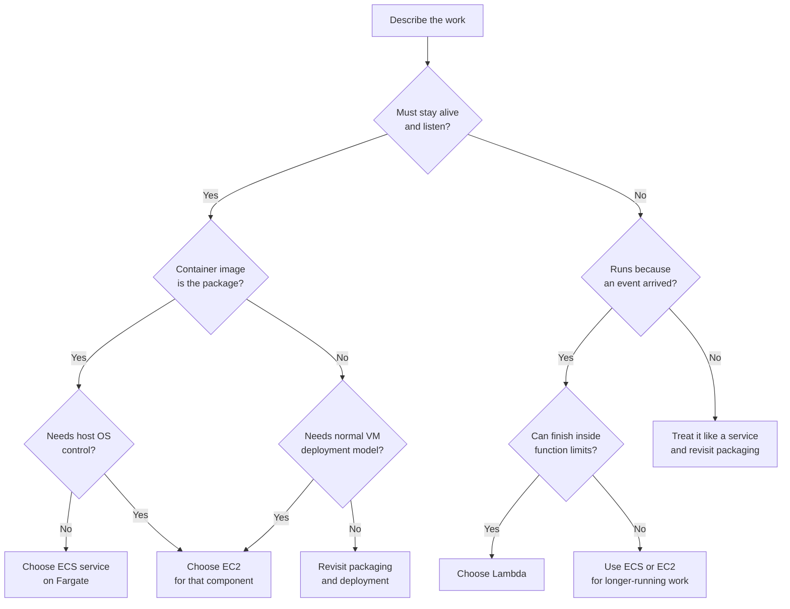

## Table of Contents

1. [The Choice Is About Operating Shape](#the-choice-is-about-operating-shape)
2. [Start With The Workload](#start-with-the-workload)
3. [The Practical Decision Path](#the-practical-decision-path)
4. [Why The Checkout API Fits ECS With Fargate](#why-the-checkout-api-fits-ecs-with-fargate)
5. [When EC2 Is The Honest Choice](#when-ec2-is-the-honest-choice)
6. [Where Lambda Belongs](#where-lambda-belongs)
7. [Cost, Scaling, And Debugging Shape](#cost-scaling-and-debugging-shape)
8. [Failure Modes And Diagnosis](#failure-modes-and-diagnosis)
9. [Decision Records You Can Reuse](#decision-records-you-can-reuse)

## The Choice Is About Operating Shape

Choosing compute is not about finding the most modern AWS service.
It is about choosing the operating shape that fits the work.
A compute service is the place where your code runs, but each option gives your team a different relationship with servers, deployments, scaling, networking, logs, and incidents.

EC2 gives you a virtual server.
That means you get the most control over the operating system, packages, disk layout, background daemons, startup scripts, and debugging tools.
It also means your team owns more of the routine care: patching, process supervision, capacity planning, instance replacement, and disk cleanup.

ECS with Fargate runs containers without asking your team to manage the EC2 hosts underneath.
ECS is the scheduler and service model.
Fargate is the serverless compute capacity that runs the task.
Your team still owns the container image, task definition, CPU and memory choice, environment variables, networking, health checks, and logs.
You just do not patch or scale a fleet of container hosts yourself.

Lambda runs code because an event arrived.
The event might be an S3 upload, an EventBridge schedule, a queue message, or an HTTP request through another AWS service.
Lambda is strongest when the unit of work is short, isolated, and event-shaped.
It is weaker when the service wants to behave like a long-running process with steady connections and a familiar server lifecycle.

The running example is `devpolaris-orders-api`.
It is a checkout service that receives customer orders, checks stock, writes order records, and publishes small side effects such as order confirmation jobs and finance exports.
For this article, the likely answer is:

```text
Main checkout API:
  ECS service on Fargate

Special OS-level processing:
  EC2 instance or EC2-backed worker

Supporting event jobs:
  Lambda functions
```

That answer is not a slogan.
It comes from the shape of the workload.
Checkout traffic is a long-running HTTP service.
The team already packages the API as a container image.
The service needs predictable VPC networking to the database and the load balancer.
It benefits from steady health checks and rolling deployments.
That points to ECS with Fargate.

The same team may still choose EC2 for one special component.
Maybe fraud scoring needs a licensed OS package, a custom kernel setting, or a local agent that Fargate does not support.
That does not make EC2 "better."
It makes EC2 honest for that one requirement.

The same team may also choose Lambda for supporting jobs.
Maybe an order export should run when a file lands in S3.
Maybe a scheduled function should close abandoned carts every hour.
Maybe a queue message should send a receipt after checkout succeeds.
Those jobs do not need to be alive all day waiting for a request.
They need to run when something happens.

> Start with the work, not the brand name of the compute service.

## Start With The Workload

Before you choose EC2, ECS, or Lambda, describe the workload in plain English.
This prevents a common beginner mistake: comparing service features before you understand what the application is trying to do.
If the workload description is vague, the compute choice will also be vague.

Here is the first useful worksheet for `devpolaris-orders-api`:

| Question | Checkout API Answer | What It Suggests |
|----------|---------------------|------------------|
| Does it need a long-running process? | Yes, it listens for HTTP requests all day | ECS service or EC2 |
| Does it already have a container image? | Yes, `devpolaris-orders-api` builds an image | ECS with Fargate |
| Does it need OS-level control? | Not for normal checkout | Avoid EC2 unless a special need appears |
| Is the work event-driven? | The main API is not, side jobs are | ECS for API, Lambda for side jobs |
| Is traffic steady? | Mostly steady during the day | ECS desired count and autoscaling fit well |
| Is traffic bursty? | Some flash sale spikes | ECS can scale tasks, Lambda may fit async burst jobs |
| Does it need custom runtime setup? | The image contains app dependencies | ECS is enough unless host setup is required |
| Does it need predictable networking? | Yes, ALB to app, app to RDS | ECS in private subnets is a clean fit |
| Can the team operate servers? | Small team, limited ops time | Prefer Fargate over EC2 for the main API |

This table already narrows the choice.
The main API does not look like a one-off event job.
It also does not require deep host control.
It looks like a containerized service that should keep a desired number of tasks running behind a load balancer.

The word "task" matters here.
In ECS, a task is one running copy of a task definition.
A task definition is the recipe for the containers, image, CPU, memory, environment, secrets, ports, and log settings.
An ECS service keeps a chosen number of tasks running and can replace tasks when they fail.

That service model is a good fit for checkout.
The team can say, "keep two healthy copies of `orders-api` running in production."
ECS can start replacement tasks during a deployment.
The Application Load Balancer can send traffic only to healthy task targets.
The team has a clear place to inspect service events, task logs, target health, and deployment status.

Lambda uses a different mental model.
You do not normally say, "keep two copies running all day."
You say, "when this event arrives, invoke this function."
That is great for receipt emails, export jobs, queue processors, and scheduled cleanup.
It is not the first shape I would choose for a checkout API that already wants to be a web service in a container.

EC2 uses a more manual mental model.
You say, "launch this virtual server, install what it needs, run the process, watch the disk, patch the OS, and replace it when it is unhealthy."
That is sometimes exactly right.
But when a small team can get the same app behavior from Fargate with less server care, the extra control should have a reason.

Here is a short service inventory from the `devpolaris-orders-api` planning notes:

```text
Service: devpolaris-orders-api
Primary job: synchronous checkout API
Runtime package: container image
Public entry point: Application Load Balancer
Private dependencies: RDS orders database, Secrets Manager, CloudWatch Logs
Traffic shape: steady weekday traffic, bursty sale windows
State: database-backed, no local disk state required
Team capacity: two backend engineers, shared platform support
First compute decision: ECS service on Fargate
Supporting compute: Lambda for scheduled and event jobs
Exception path: EC2 only for host-level requirements
```

Notice the tone of this record.
It does not say "serverless is cheaper" or "containers are production-grade."
Those phrases are too broad to guide a real system.
The record names the work, the runtime package, the traffic shape, and the team capacity.

## The Practical Decision Path

A useful decision path should feel like a code review.
It should ask one question at a time, and each answer should remove a few bad choices.
You do not need a perfect architecture meeting to use it.
You can run this path while reviewing a small design document.

Start with process shape.
If the code needs to stay alive and listen on a port, you are usually deciding between ECS and EC2.
If the code should run only when an event arrives, Lambda becomes a strong candidate.
If the answer is "both", split the workload.
The main API and the event job are allowed to use different compute.

Next ask about packaging.
If the team already builds a container image, ECS with Fargate is often the simplest production shape.
The image is the deployment unit.
The task definition says how much CPU and memory it needs, what port it listens on, and which logs it writes.
The ECS service keeps copies running.

Then ask about control.
If the app needs host-level control, EC2 may be the right answer.
Host-level control means things like custom kernel modules, a special filesystem layout, low-level networking tools, a vendor agent that must run on the host, or a daemon that expects normal VM access.
If you do not need those things, EC2 may be extra work rather than extra value.

Now ask about traffic.
Steady traffic favors always-on capacity because you are using the service all day.
Bursty event traffic can favor Lambda because compute appears when work appears.
Bursty HTTP traffic is more nuanced.
ECS can scale tasks, but new tasks need time to start, pull images, pass health checks, and receive traffic.
Lambda can scale very quickly for event-shaped work, but the request path, concurrency limits, cold starts, and function timeout need attention.

Finally ask about operations capacity.
A service is not done when it runs once.
Someone must deploy it, roll it back, read logs, patch it, rotate secrets, inspect alarms, and explain incidents.
If the team is small, choose the compute model that leaves fewer routine chores while still giving enough control.

Here is the decision path as a compact flow:



Read the diagram as a practical guide, not a law.
There are edge cases in every real system.
The value is that it keeps the first conversation honest.
If someone proposes EC2, ask which host-level control the service needs.
If someone proposes Lambda, ask which event invokes it and whether the timeout and startup behavior fit.
If someone proposes ECS, ask whether the team has a container image and a health check.

For `devpolaris-orders-api`, the path is short:
it must stay alive and listen for checkout requests.
The package is a container image.
It does not need special host control.
It needs predictable load balancer and database networking.
The team wants less server care.
That lands on ECS with Fargate for the main API.

The side jobs take a different branch.
The finance export job runs when an object appears in S3 or when a schedule fires.
The receipt worker runs when a queue message arrives.
Those jobs can finish quickly, retry independently, and write logs per invocation.
That lands on Lambda for supporting work.

## Why The Checkout API Fits ECS With Fargate

The checkout API is a normal web service.
It accepts HTTP requests, keeps a process warm, reads configuration at startup, opens database connections, writes logs, and answers health checks.
That shape maps naturally to an ECS service behind an Application Load Balancer.

Here is the simple production path:

```text
Customer browser
  -> orders.devpolaris.com
  -> Application Load Balancer
  -> target group for orders API
  -> ECS service
  -> Fargate task running the orders-api container
  -> RDS database and CloudWatch Logs
```

The strongest reason to use ECS with Fargate is not that containers are trendy.
The reason is that the container is already the thing the team trusts.
The image that passed tests in CI is the image that ECS runs.
The task definition pins the runtime settings around that image.
The service decides how many copies should stay running.

A realistic task snapshot for the team might look like this:

```text
ECS service: devpolaris-orders-api
Cluster: devpolaris-prod
Capacity provider: FARGATE
Desired tasks: 2
Container image: 333333333333.dkr.ecr.us-east-1.amazonaws.com/devpolaris-orders-api:2026-05-02.4
Container port: 3000
Health path: /health
CPU: 512
Memory: 1024
Subnets: private app subnets
Security group: allow ALB to 3000, allow egress to RDS and AWS APIs
Logs: /ecs/devpolaris-orders-api
```

This snapshot is useful because every line can be checked during an incident.
If tasks are unhealthy, inspect the health path and container port.
If image pulls fail, inspect task execution role permissions and network egress.
If database calls time out, inspect the task security group, database security group, and subnet routes.

ECS also gives the team a service-level deployment model.
When a new task definition revision is deployed, ECS can start new tasks, wait for health, and stop old tasks.
That matches how a checkout API should change.
You do not want a deployment to replace the only running process before the replacement proves it can receive traffic.

Here is a release status snapshot a reviewer could understand:

| Check | Expected Evidence | Status |
|-------|-------------------|--------|
| New task revision registered | `devpolaris-orders-api:42` | Passed |
| Desired count preserved | `2` running tasks | Passed |
| Target health | Both targets `healthy` | Passed |
| App logs | Startup completed, no secret errors | Passed |
| Smoke test | `POST /v1/orders` returns `201` in staging | Passed |
| Rollback path | Previous task revision `41` still known | Passed |

This is the kind of evidence that makes ECS friendly for a team.
The status is not hidden inside one server.
It is visible through service events, task state, target health, and logs.

The tradeoff is that ECS is still an operating model.
Your team must understand task definitions, service deployments, networking, logs, secrets, health checks, and autoscaling.
Fargate removes host management.
It does not remove application operations.

That distinction matters during design review.
If someone says "Fargate means no ops," correct the sentence gently.
Fargate means no EC2 host patching for this service.
The team still owns whether the app starts, answers `/health`, connects to the database, handles shutdown, and emits useful logs.

## When EC2 Is The Honest Choice

EC2 becomes attractive when the application really needs the server to be part of the design.
That means the operating system is not just a hidden place where code runs.
It is a thing the team must shape directly.

For `devpolaris-orders-api`, the normal checkout path does not need that.
But imagine the team adds a special fraud-analysis worker.
The vendor library needs a licensed Linux package, a host-level agent, a local cache on an attached volume, and a debugging workflow that depends on standard VM tools.
Now EC2 is a serious option.

Here is the decision record for that exception:

```text
Decision: Use EC2 for fraud-scorer-worker
Date: 2026-05-02
Owner: orders platform team

Context:
  The checkout API can stay on ECS/Fargate.
  The fraud scorer needs a licensed OS package and a host agent.
  The vendor support runbook assumes SSH access and host logs under /var/log/vendor.

Options considered:
  ECS/Fargate: rejected because the host agent and OS package requirement do not fit.
  Lambda: rejected because the worker has warm local cache and longer processing windows.
  EC2: accepted because the server itself is part of the support contract.

Consequence:
  The team now owns OS patching, AMI updates, process supervision, disk alarms, and instance replacement.
```

This record is intentionally narrow.
It does not move the whole system to EC2 just because one worker needs EC2.
The checkout API can remain on ECS/Fargate.
The exception can use EC2.

The big tradeoff is control versus operations.
On EC2, you can install more things, tune more things, and inspect more things.
You can also break more things.
Package drift, full disks, stale AMIs, SSH access, orphaned processes, and manual hotfixes become part of the risk surface.

For a junior engineer, it helps to name what your team owns when EC2 is chosen:

| Area | EC2 Ownership Question |
|------|------------------------|
| OS patches | Who updates the image or running server? |
| Process supervision | What restarts the app if it exits? |
| Scaling | How are more instances added and removed? |
| Deployment | How does a new version arrive on the server? |
| Disk | What happens when logs or cache fill the volume? |
| Access | Who can SSH, and how is that audited? |
| Replacement | How does a failed instance come back cleanly? |

None of these questions are impossible.
Many teams operate EC2 well.
The problem is choosing EC2 without admitting those questions exist.
If the team has no owner for patching, process supervision, and replacement, EC2 control can become production debt.

Use EC2 when the control is worth the care.
Do not use it only because it feels familiar from tutorials.
Familiar is useful during learning, but production choices need a reason that survives the first incident.

## Where Lambda Belongs

Lambda belongs where the work is naturally event-driven.
An event is a message that says something happened.
An object was uploaded.
A queue message arrived.
A schedule fired.
An API request came through an event source.
The function wakes up, handles that event, writes evidence, and exits.

For `devpolaris-orders-api`, Lambda is a good fit for supporting jobs around the checkout service:

| Job | Event | Why Lambda Fits |
|-----|-------|-----------------|
| Send receipt email | Queue message after order creation | Isolated retryable work |
| Build finance export | Scheduled EventBridge rule | Runs on schedule, not all day |
| Normalize uploaded CSV | S3 object created | Work starts when file arrives |
| Close stale carts | Hourly schedule | Short cleanup task |
| Alert on failed export | Event from job status | Small notification handler |

These jobs should not make the main API slower.
The checkout request should create the order and publish the side effect.
Then the supporting compute handles the side effect separately.
That split protects the customer path.

Here is the shape:

```text
POST /v1/orders
  -> ECS/Fargate checkout API writes order
  -> checkout API publishes event or queue message
  -> Lambda receipt worker handles message
  -> worker writes logs and updates delivery status
```

The strength of Lambda is that you do not keep a process running just in case.
You pay attention to events, function duration, retries, concurrency, permissions, and logs.
For sporadic jobs, that can be simpler and cheaper than an always-on worker.

The weakness is that Lambda has a different debugging surface.
There may be no long-lived process to inspect.
Each invocation has its own logs.
Cold starts can affect latency.
Timeouts end the invocation.
Concurrency limits can throttle bursts.
If the function sits inside a VPC, networking and ENI behavior can become part of the diagnosis.

For Lambda, keep a small readiness checklist:

| Check | Why It Matters |
|-------|----------------|
| Event source | Proves what invokes the function |
| Timeout | Prevents work from running longer than the function allows |
| Retry behavior | Controls duplicate or delayed side effects |
| Idempotency | Lets the same event be handled safely more than once |
| Logs | Gives one place to inspect invocation evidence |
| Permissions | Allows only the AWS actions the function needs |
| Startup time | Helps decide whether latency is acceptable |

Idempotency means the job can safely process the same event more than once.
This matters because event systems often retry after failures.
For a receipt email, idempotency might mean storing a `receiptSentAt` value before sending another message.
For a finance export, it might mean writing the output to a deterministic S3 key and checking whether that export already exists.

Lambda is not "the small app option."
It is the event option.
When the main work is a long-running API, use Lambda beside it rather than forcing the whole API into a function shape.

## Cost, Scaling, And Debugging Shape

Cost is not only price per second.
Cost is also the shape of waste.
Every compute choice wastes money in a different way when the design does not match the workload.

EC2 can waste money when instances sit underused.
You pay for server capacity while it exists, even if the app is quiet.
That can still be a good deal for steady workloads, especially when the team can commit to predictable usage.
But for a small bursty side job, an always-on instance is often the wrong cost shape.

ECS with Fargate can waste money when the service keeps too many tasks running or chooses too much CPU and memory.
It can also cost more than EC2 for very steady, high-volume workloads where a team is skilled at operating hosts.
The tradeoff is that Fargate removes host care from the team.
For many teams, that operational relief is worth more than squeezing every compute dollar.

Lambda can waste money when a function is invoked too often, runs too long, uses too much memory, or retries a broken event repeatedly.
It can also surprise teams through concurrency pressure.
If a burst invokes many copies at once, downstream systems such as a database or third-party API may receive more parallel work than they can handle.

Here is the same comparison without pretending one answer always wins:

| Dimension | EC2 | ECS With Fargate | Lambda |
|-----------|-----|------------------|--------|
| Control | Highest host control | Container-level control | Function-level control |
| Operations | Highest routine care | Medium app/runtime care | Lower server care, higher event care |
| Deployment | You design the server rollout | Task revision and service deployment | Function version or alias rollout |
| Cost shape | Pay for provisioned instances | Pay for task CPU and memory while running | Pay per request and duration |
| Scaling shape | Scale instances or processes | Scale desired task count | Scale invocations and concurrency |
| Networking | Full VM networking control | Task ENI in VPC | AWS-managed path or VPC-attached function |
| Debugging | Host logs plus app logs | Service events, task logs, target health | Invocation logs, retries, concurrency |
| Team fit | Strong ops skills needed | Good fit for container teams | Good fit for event-driven jobs |

The debugging row deserves extra attention.
When a checkout request fails, you need to know where evidence lives.
On EC2, evidence may be in system logs, process manager logs, app logs, disk metrics, and load balancer target health.
On ECS, evidence usually starts with service events, task state, task logs, and target health.
On Lambda, evidence starts with invocation logs, event source status, retry behavior, concurrency, and dead-letter or failure destinations if configured.

For the main checkout API, ECS gives a balanced debugging surface.
You can see whether the service is steady.
You can see whether tasks are running.
You can see whether targets are healthy.
You can inspect application logs without SSH.
That is a good fit for a team that wants production evidence but does not want to operate hosts.

For side jobs, Lambda gives a tighter debugging surface.
You ask:
which event invoked the function, did the function run, what did it log, did it retry, and did it write the expected output?
That is exactly the shape of a receipt or export job.

For host-specific work, EC2 gives the deepest debugging surface.
You can inspect processes, sockets, disk paths, agents, kernel settings, and vendor logs directly.
That depth is helpful only if the team is ready to own it.

## Failure Modes And Diagnosis

A compute decision is incomplete until you can diagnose its failure modes.
Every option can fail.
The question is whether the team knows where to look and what a fix usually changes.

Start with the ECS/Fargate checkout API.
The most common failure shape is not "AWS is down."
It is a mismatch between the application, task definition, load balancer, network, or secret permissions.

Here is a realistic incident snapshot:

```text
Incident: checkout API returns 503
Service: devpolaris-orders-api
Time: 2026-05-02 10:42 UTC

ALB target group:
  10.0.42.18:3000 unhealthy Target.ResponseCodeMismatch
  10.0.43.27:3000 unhealthy Target.ResponseCodeMismatch

ECS service event:
  service devpolaris-orders-api was unable to reach a steady state

Recent deployment:
  task definition changed from revision 41 to revision 42

First useful clue:
  /health returns 500 because DATABASE_URL is missing
```

The fix direction is not "add more tasks."
More broken tasks would still fail health checks.
The diagnostic path is:
check target health reason, check service events, check task logs, compare the new task definition with the previous revision, and verify that the secret name and task role are correct.

A short task log might show:

```text
2026-05-02T10:40:18.225Z service=devpolaris-orders-api level=info msg="starting" version=2026-05-02.4
2026-05-02T10:40:18.449Z service=devpolaris-orders-api level=error msg="missing required config" key=DATABASE_URL
2026-05-02T10:40:18.451Z service=devpolaris-orders-api level=warn msg="health check failed" path=/health status=500
```

This failure teaches why ECS is a good fit for the main API.
The service did not become healthy, so the load balancer had evidence.
The logs pointed at missing runtime configuration.
The team can roll back the task definition or fix the secret mapping and redeploy.

Now compare an EC2 failure:

```text
Incident: fraud scorer stopped processing
Host: ip-10-0-55-19
Time: 2026-05-02 12:15 UTC

System status:
  instance reachable
  app process not running
  /var/log/vendor/scorer.log stopped at 11:58 UTC
  disk /var/cache/vendor is 100% full

First useful clue:
  vendor agent exits when cache directory has no free space
```

The fix direction is different.
You clear or rotate the cache safely, add disk alarms, update the service restart behavior, and decide whether the cache should live on a larger attached volume.
This is EC2 work because the host is part of the problem.
The debugging is useful, but it is also your team's responsibility.

Now compare a Lambda failure:

```text
Incident: receipt emails delayed
Function: orders-receipt-worker
Time: 2026-05-02 18:03 UTC

Event source:
  orders-receipts queue has 18,420 visible messages

Function logs:
  Task timed out after 30.00 seconds
  provider=email-vendor status=timeout

First useful clue:
  every retry calls the same slow vendor endpoint
```

The fix direction is not to SSH into anything.
There is no host to rescue.
You inspect function duration, timeout, retry policy, queue age, concurrency, and downstream vendor latency.
You may increase the timeout, reduce concurrency to protect the vendor, add idempotency, or move slow bulk work to a longer-running worker.

Here is a practical diagnosis table:

| Symptom | Likely Compute Area | First Evidence | Common Fix Direction |
|---------|---------------------|----------------|----------------------|
| ALB returns `503` | ECS/Fargate service | Target health and ECS service events | Fix health path, port, config, or task startup |
| Task stays `PENDING` | ECS/Fargate placement or networking | ECS service events | Check capacity, subnets, image pull route, execution role |
| App cannot reach RDS | ECS or EC2 networking | App timeout logs and security groups | Fix source security group, route, or database endpoint |
| Disk fills up | EC2 host | `df`, disk metrics, app logs | Rotate logs, resize volume, move state out of host |
| Function times out | Lambda execution | Invocation log and timeout setting | Shorten work, raise timeout, split job, or use ECS |
| Queue age grows | Lambda event processing | Queue metrics and function errors | Check concurrency, retries, downstream dependency |

The diagnostic habit is the same across all three choices:
find the boundary where the promise failed.
For ECS, the promise is "keep healthy tasks running."
For EC2, the promise is "this server and process are healthy."
For Lambda, the promise is "this event finishes successfully within its limits."

## Decision Records You Can Reuse

A decision record is a short note that explains why a choice was made.
It is useful because future teammates will see the tradeoff, not only the final AWS service name.
The record should be small enough to read during review.

Here is the main record for `devpolaris-orders-api`:

```text
Decision: Run devpolaris-orders-api on ECS with Fargate
Date: 2026-05-02
Owner: orders platform team

Context:
  The checkout API is a long-running HTTP service.
  It is already packaged as a container image.
  It needs predictable ALB, VPC, RDS, Secrets Manager, and CloudWatch integration.
  The team has limited capacity for host patching and instance operations.

Decision:
  Use an ECS service on Fargate with two desired tasks in private subnets.
  Place the service behind an Application Load Balancer.
  Use task logs, service events, target health, and smoke tests as release evidence.

Tradeoff:
  We give up host-level control.
  We gain a simpler container deployment model and avoid managing EC2 hosts for the API.
```

Here is the supporting event record:

```text
Decision: Use Lambda for receipt and export support jobs
Date: 2026-05-02
Owner: orders platform team

Context:
  Receipt delivery and finance exports run because events arrive.
  They do not need to listen on a port all day.
  Each job can log one invocation, retry safely, and write a small result.

Decision:
  Use Lambda functions for queue, S3, and scheduled jobs around the checkout API.
  Keep idempotency keys in the order database or output location.

Tradeoff:
  We gain event-shaped scaling and avoid idle workers.
  We must design timeout, retry, concurrency, and duplicate-event behavior carefully.
```

Here is the exception record for EC2:

```text
Decision: Use EC2 only for host-level fraud scorer
Date: 2026-05-02
Owner: orders platform team

Context:
  The fraud scorer requires a licensed OS package and a host agent.
  The vendor support path assumes VM access and host logs.
  This requirement does not apply to the checkout API.

Decision:
  Run the fraud scorer on EC2.
  Keep the checkout API on ECS/Fargate.
  Add explicit ownership for OS patching, disk alarms, process supervision, and replacement.

Tradeoff:
  We gain host control for the vendor workload.
  We accept more operational responsibility for that component.
```

These records show the practical habit this article is teaching.
You do not choose compute once for the whole company.
You choose it per workload.
The checkout API, the receipt worker, and the fraud scorer have different shapes, so they can have different answers.

When you review a compute choice, use this final checklist:

| Review Question | Good Answer Sounds Like |
|-----------------|-------------------------|
| What keeps running? | "The checkout API runs as two ECS tasks behind the ALB." |
| What starts on an event? | "Receipt delivery starts from a queue message." |
| What needs host control? | "Only the fraud scorer, because of the vendor agent." |
| What scales? | "ECS task count for API traffic, Lambda concurrency for jobs." |
| What can fail first? | "Health checks, task startup, secrets, network reachability, timeouts." |
| Where is evidence? | "Target health, ECS events, CloudWatch logs, queue metrics, function logs." |
| Who owns operations? | "The app team owns runtime behavior, platform helps with shared AWS patterns." |

The best compute choice is not the one with the fewest boxes in a diagram.
It is the one whose failure modes your team can understand, whose operations your team can sustain, and whose tradeoffs match the work in front of you.

---

**References**

- [What is Amazon EC2?](https://docs.aws.amazon.com/AWSEC2/latest/UserGuide/concepts.html) - AWS's EC2 overview explains instances, AMIs, instance types, storage, security groups, and pricing models.
- [Amazon ECS services](https://docs.aws.amazon.com/AmazonECS/latest/developerguide/ecs_services.html) - This page explains how ECS services maintain desired task count, replace failed tasks, and work with load balancers.
- [Amazon ECS task networking options for Fargate](https://docs.aws.amazon.com/AmazonECS/latest/developerguide/fargate-task-networking.html) - This page explains Fargate task networking, ENIs, subnets, security groups, and image pull networking.
- [How Lambda works](https://docs.aws.amazon.com/lambda/latest/dg/concepts-basics.html) - AWS's Lambda basics describe functions, handlers, events, runtimes, and permissions.
- [Lambda quotas](https://docs.aws.amazon.com/lambda/latest/dg/gettingstarted-limits.html) - This page lists current Lambda limits such as timeout, memory, concurrency, package size, and payload limits.
- [Health checks for Application Load Balancer target groups](https://docs.aws.amazon.com/elasticloadbalancing/latest/application/target-group-health-checks.html) - This page explains ALB health checks, target health states, reason codes, and fail-open behavior.
