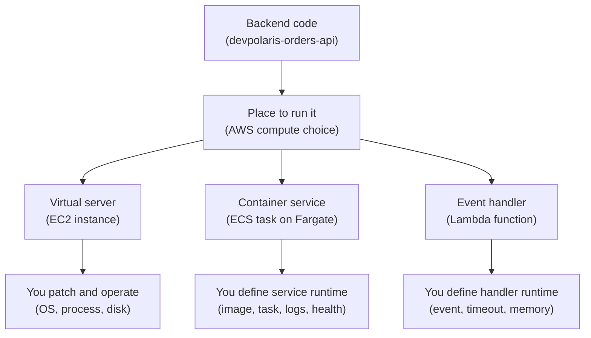
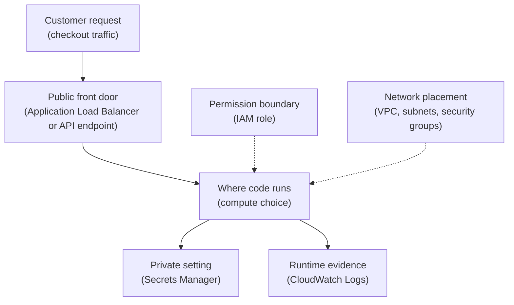
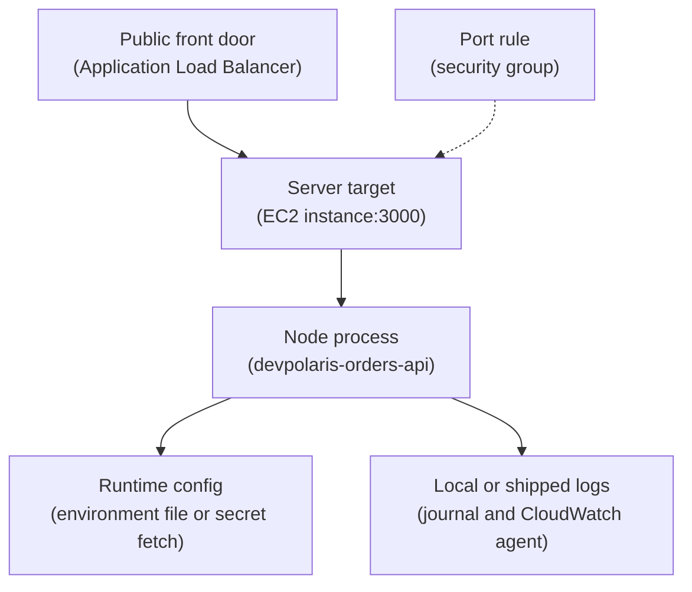
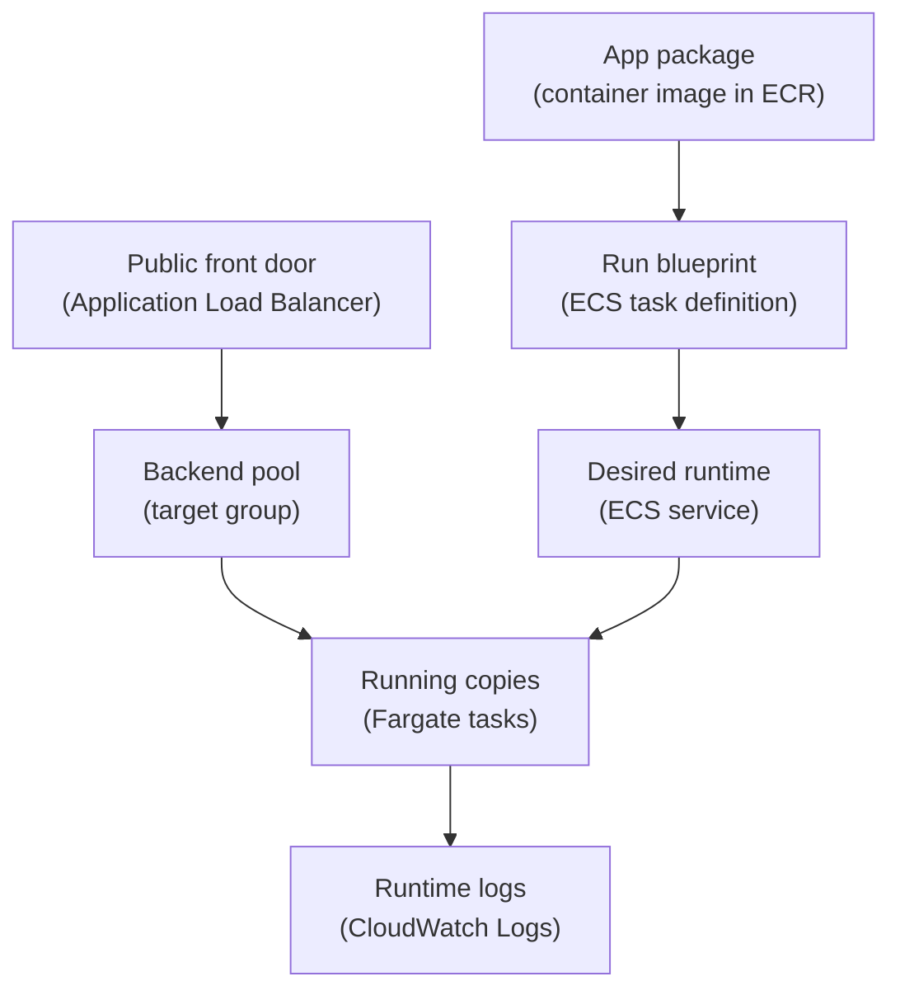
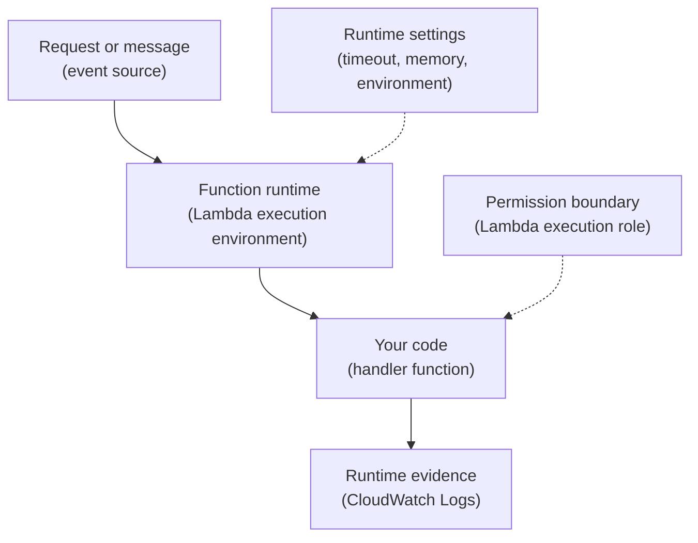

## Table of Contents

1. [Where Code Runs After Your Laptop](#where-code-runs-after-your-laptop)
2. [The Running Example: devpolaris-orders-api](#the-running-example-devpolaris-orders-api)
3. [The Five Compute Questions](#the-five-compute-questions)
4. [EC2: You Manage The Server Shape](#ec2-you-manage-the-server-shape)
5. [ECS On Fargate: You Manage The Service Shape](#ecs-on-fargate-you-manage-the-service-shape)
6. [Lambda: You Manage The Handler Shape](#lambda-you-manage-the-handler-shape)
7. [Where Traffic Reaches Each Option](#where-traffic-reaches-each-option)
8. [Where Scaling And Failures Show Up](#where-scaling-and-failures-show-up)
9. [A Practical Diagnostic Path](#a-practical-diagnostic-path)
10. [The First Decision](#the-first-decision)

## Where Code Runs After Your Laptop

On your laptop, the place where code runs is obvious.
You open a terminal, run `npm start`, and a Node.js process listens on `localhost:3000`.
The machine, the operating system, the network, the environment variables, the logs, and the process all sit in one familiar place.

That simple picture changes when the same backend moves to AWS.
The code still needs CPU, memory, environment variables, network access, and logs.
The difference is that those jobs are split across cloud resources.
AWS compute is the family of services that give your code a place to execute.

Compute exists because an application cannot run as an idea.
It needs a real runtime somewhere.
That runtime might be a virtual server, a container task, or a function execution environment.
Each choice changes who manages the machine, how your app starts, how traffic reaches it, how scaling happens, and where you look when it fails.

In this article, you will compare three common AWS compute choices:
Amazon EC2, Amazon ECS on AWS Fargate, and AWS Lambda.
EC2 is closest to a server you operate.
ECS on Fargate runs your container as a managed service without making you manage EC2 hosts.
Lambda runs a function when an event arrives.

The goal is not to crown one winner.
The goal is to give you a practical mental model.
When a team asks where `devpolaris-orders-api` should run, you should be able to say what each option makes easier, what each option makes more visible, and what each option asks the team to own.

> The compute choice is not only "where does the code run?" It is also "where will I debug the code when it does not run?"

Here is the high-level map.
Read it from top to bottom.
The plain-English labels come first because the job matters before the AWS name.



This diagram hides many details on purpose.
At the beginner level, start with ownership.
If you own the server, you debug like a server operator.
If you own the container service, you debug tasks, target health, and service events.
If you own the function, you debug invocations, timeouts, permissions, and cold starts.

## The Running Example: devpolaris-orders-api

Our running example is `devpolaris-orders-api`.
It is a Node.js backend that receives checkout requests, validates the cart, creates an order record, and writes a few application logs.
Locally, a developer starts it like this:

```bash
$ npm start

> devpolaris-orders-api@1.0.0 start
> node server.js

2026-05-02T09:00:04.212Z INFO service=devpolaris-orders-api port=3000
2026-05-02T09:00:04.218Z INFO health path=/health status=ready
```

This output proves two useful things.
The process started.
The service is listening on port `3000`.
That is enough for a laptop test, but production needs more than a local process.

The same service in AWS needs a network path from users, a way to read private configuration, a place to send logs, and a health signal for the load balancer.
The earlier AWS articles already gave you the surrounding pieces.
A VPC contains subnets.
Security groups decide which ports are allowed.
An Application Load Balancer, usually shortened to ALB, receives HTTP or HTTPS traffic and checks target health.
IAM roles decide what the running app can call.
Secrets Manager stores private values such as `DATABASE_URL`.
CloudWatch Logs stores runtime log events.

For this article, the app has these simple production requirements:

| Need | Practical Example | AWS Piece Nearby |
|------|-------------------|------------------|
| Receive checkout traffic | `POST /v1/orders` | ALB listener and target group |
| Prove readiness | `GET /health` returns `200` | Target group health check |
| Read database credentials | `DATABASE_URL` | Secrets Manager and IAM role |
| Write runtime logs | startup, request, and error logs | CloudWatch Logs |
| Scale for traffic | more running copies when load rises | EC2 Auto Scaling, ECS service scaling, or Lambda concurrency |

The compute service is the box where the Node.js code runs.
It is not the whole architecture.
That distinction matters because many outages are not caused by the compute service alone.
A task can be healthy but blocked by a security group.
A function can run but lack IAM permission.
An EC2 process can listen on the wrong port while the ALB waits on another one.

Here is the running example with the same outer shape for all three compute choices:



The diagram is intentionally boring.
Boring architecture diagrams are often the most useful ones.
They show where traffic goes, where code runs, where private values come from, and where evidence appears.

## The Five Compute Questions

A beginner compute decision gets easier when you ask the same five questions every time.
The AWS names then become possible answers instead of a list to memorize.

The first question is: who manages the machine?
With EC2, you manage a virtual server.
AWS gives you the instance, but you care about the operating system, packages, disk, process manager, and patching.
With ECS on Fargate, AWS manages the server capacity behind the task, and you manage the container image, task definition, service, health, and logs.
With Lambda, AWS manages the execution environment, and you manage function code, configuration, timeout, memory, and event source.

The second question is: how does the app start?
On EC2, something on the server starts the process, often `systemd`, a process manager, or a deploy script.
On ECS, the ECS service starts tasks from a task definition.
On Lambda, an invocation event causes Lambda to prepare an execution environment and call your handler.

The third question is: how does traffic reach it?
EC2 and ECS services often sit behind an ALB for HTTP traffic.
The ALB forwards to instance targets, IP targets, or sometimes Lambda targets.
Lambda can also be reached through services such as API Gateway, Function URLs, EventBridge, SQS, or other event sources.
The important point is that a compute service is usually not the only public entry point.

The fourth question is: how does scaling work?
EC2 scaling usually means adding, removing, or resizing instances.
ECS scaling usually means changing the desired number of tasks, and Fargate gives each task its requested CPU and memory without you managing the EC2 host fleet.
Lambda scaling usually means more concurrent invocations when more events arrive, within configured limits and account limits.

The fifth question is: where do failures show up?
EC2 failures show up in instance status, SSH access, `systemd`, disk, process logs, ALB target health, and CloudWatch if you configured it.
ECS on Fargate failures show up in service events, task stopped reasons, target health, container logs, task definition settings, IAM roles, and CloudWatch Logs.
Lambda failures show up in invocation errors, timeout reports, `INIT_REPORT` or `REPORT` log lines, retry behavior, dead-letter or failure destinations if configured, and CloudWatch metrics.

Use this comparison as a quick map:

| Question | EC2 | ECS On Fargate | Lambda |
|----------|-----|----------------|--------|
| Who manages the machine? | You manage the virtual server | AWS manages host capacity, you manage tasks | AWS manages the execution environment |
| How does the app start? | Server boot or process manager starts Node | ECS starts a task from a task definition | Event invokes the function handler |
| How does traffic reach it? | Often ALB to instance and port | Often ALB to task IP and port | API or event source invokes function |
| How does scaling work? | Add, remove, or resize instances | Change desired task count or service scaling | More concurrent invocations |
| Where do failures show up? | OS, process, disk, ALB, instance status | ECS events, task health, target health, logs | Invocation errors, timeouts, logs, metrics |

This table is the spine of the article.
Everything else is a guided walkthrough of the same five questions.

## EC2: You Manage The Server Shape

Amazon EC2 gives you a virtual server called an instance.
For a developer coming from a laptop, EC2 feels familiar because you can SSH into it, install packages, inspect files, restart services, and look at the process table.
That familiarity is helpful, especially when you need OS-level control.

For `devpolaris-orders-api`, an EC2 setup might look like this:
an Amazon Machine Image starts an Ubuntu server.
A deploy process copies or pulls the app.
`systemd` starts the Node.js process.
The instance sits in a private subnet.
An ALB forwards traffic to the instance on port `3000`.



The main benefit is control.
You can install a package that the app needs.
You can tune the operating system.
You can run helper processes next to the API.
You can inspect the server directly during debugging.

The cost of that control is ownership.
Someone must patch the operating system.
Someone must keep disk space healthy.
Someone must decide how the process restarts after a crash.
Someone must install and configure the CloudWatch agent if logs should leave the machine.
Someone must replace instances safely during deployments.

A small EC2 status snapshot might look like this:

```bash
$ systemctl status devpolaris-orders-api
* devpolaris-orders-api.service - DevPolaris Orders API
     Loaded: loaded (/etc/systemd/system/devpolaris-orders-api.service; enabled)
     Active: active (running) since Sat 2026-05-02 09:17:41 UTC; 12min ago
   Main PID: 1842 (node)
      Tasks: 11
     Memory: 148.6M
        CPU: 4.821s
```

This is the kind of evidence EC2 makes easy.
You can ask the server whether the service is running.
You can read local logs.
You can check whether port `3000` is open.

```bash
$ ss -ltnp | grep 3000
LISTEN 0      511          0.0.0.0:3000       0.0.0.0:*    users:(("node",pid=1842,fd=22))
```

That output proves the process is listening on all interfaces, not only `127.0.0.1`.
That detail matters because the ALB is not inside the process.
It reaches the instance through the network.
If Node only listens on `127.0.0.1`, the app might work from the server itself while the ALB health check fails.

EC2 scaling has two common beginner shapes.
You can scale vertically by choosing a larger instance type.
That is like giving one server more CPU or memory.
You can scale horizontally by running more instances, usually through an Auto Scaling group behind a load balancer.
That is like adding more servers to share requests.

EC2 is a good first choice when the team needs server control, has existing server-based operations, or runs software that does not fit cleanly into a container or function.
It is a weaker first choice when the team wants to avoid OS patching, instance replacement, and process supervision work.

The EC2 mental model is simple:
you get a server-shaped runtime.
That shape is flexible, but the server is now part of your job.

## ECS On Fargate: You Manage The Service Shape

Amazon ECS runs containers.
A container is a packaged process with its dependencies, often built as a Docker image.
AWS Fargate is the compute mode that lets ECS run those containers without making your team manage EC2 container hosts.

For `devpolaris-orders-api`, this is often the cleanest next step after local development.
The team builds one container image.
The ECS task definition describes how to run it.
The ECS service keeps the desired number of tasks running.
The ALB sends traffic to the task IPs that pass health checks.



The task definition is the service's run blueprint.
It names the image, CPU, memory, container port, environment values, secrets, roles, and log configuration.
You do not need to memorize every field.
Read it by job.

```json
{
  "family": "devpolaris-orders-api",
  "requiresCompatibilities": ["FARGATE"],
  "networkMode": "awsvpc",
  "cpu": "512",
  "memory": "1024",
  "executionRoleArn": "arn:aws:iam::111122223333:role/orders-api-execution",
  "taskRoleArn": "arn:aws:iam::111122223333:role/orders-api-task",
  "containerDefinitions": [
    {
      "name": "api",
      "image": "111122223333.dkr.ecr.us-east-1.amazonaws.com/devpolaris-orders-api:2026-05-02.4",
      "portMappings": [{ "containerPort": 3000 }],
      "secrets": [
        {
          "name": "DATABASE_URL",
          "valueFrom": "arn:aws:secretsmanager:us-east-1:111122223333:secret:prod/orders/DATABASE_URL-a1b2c3"
        }
      ],
      "logConfiguration": {
        "logDriver": "awslogs",
        "options": {
          "awslogs-group": "/ecs/devpolaris-orders-api",
          "awslogs-region": "us-east-1",
          "awslogs-stream-prefix": "ecs"
        }
      }
    }
  ]
}
```

This snippet shows the main operational promises.
The image is the app package.
The CPU and memory say how much runtime space the task gets.
The port tells ECS and the load balancer where the container listens.
The secret reference says ECS should fetch `DATABASE_URL` before the app starts.
The log configuration sends container output to CloudWatch Logs.

ECS has two IAM roles that beginners often mix up.
The task execution role is used by ECS to pull the image, fetch startup secrets, and send logs with the configured log driver.
The task role is used by your application code after the container starts, for example when the app calls S3 or DynamoDB.
If the task cannot start because it cannot read a secret, inspect the execution role first.
If the app starts but gets `AccessDenied` when calling an AWS API, inspect the task role first.

Scaling ECS on Fargate usually means changing the desired number of tasks or configuring service auto scaling.
If desired count is `2`, ECS tries to keep two tasks running.
If one task stops, the service scheduler starts another one from the task definition.
That is a different feeling from EC2 because you are not nursing one server back to health.
You are asking the service to keep replaceable task copies alive.

A normal ECS service snapshot might look like this:

```text
service: devpolaris-orders-api
cluster: prod-orders
desired tasks: 2
running tasks: 2
pending tasks: 0
task definition: devpolaris-orders-api:42
target group: orders-api-tg
health: 2 healthy, 0 unhealthy
```

That snapshot is the happy path.
It connects ECS service state to load balancer target health.
If the service says two tasks are running but the target group says zero healthy targets, the app is alive enough for ECS but not healthy enough for the ALB.
That difference is one of the most important ECS debugging lessons.

ECS on Fargate is a good first choice when the service already fits a container, needs to run continuously, and should sit behind a load balancer.
You give up some server-level control, but you also remove a lot of server care.
For many small backend teams, that is a good trade.

## Lambda: You Manage The Handler Shape

AWS Lambda runs code in response to events.
Instead of starting a long-running server process yourself, you write a handler.
When an event arrives, Lambda prepares or reuses an execution environment, calls the handler, records logs and metrics, and then waits for more work or shuts the environment down later.

For `devpolaris-orders-api`, Lambda is easiest to understand as a different shape rather than a smaller ECS.
The code is not mainly "a service listening forever on port `3000`."
The code is "a handler that receives an event and returns a response or result."

That shape fits some parts of an orders system very well.
A payment webhook handler can run when an HTTP event arrives.
An export generator can run when a schedule fires.
A notification sender can run when a queue message arrives.
Those jobs have clear inputs and outputs.

It is possible to build APIs on Lambda, but the mental model changes.
Traffic reaches an API entry point or event source first.
That service invokes Lambda.
Lambda does not need your code to listen on a port.
Your handler receives an event object.



The startup model is also different.
If Lambda needs a new execution environment, it runs an initialization phase before invoking the handler.
This is the source of what people call a cold start.
For a Node.js function, cold start time can include loading modules, creating clients, and running code outside the handler.
For our Node.js backend, the more common beginner checks are package size, initialization work, timeout, memory, and whether the handler opens too many database connections under concurrency.

A Lambda log snapshot has a different shape from an ECS task log:

```text
START RequestId: 3b8b6b0d-6a18-4a3b-9b42-2b7e7c4cfd01 Version: $LATEST
2026-05-02T09:42:11.884Z INFO service=devpolaris-orders-webhook event=payment.succeeded
2026-05-02T09:42:12.117Z INFO order_id=ord_824 status=confirmed
END RequestId: 3b8b6b0d-6a18-4a3b-9b42-2b7e7c4cfd01
REPORT RequestId: 3b8b6b0d-6a18-4a3b-9b42-2b7e7c4cfd01 Duration: 245.10 ms Billed Duration: 246 ms Memory Size: 512 MB Max Memory Used: 97 MB
```

The important fields are not a port or a target group.
They are request ID, duration, memory, timeout, errors, and the event path.
If the handler fails, you follow the invocation evidence.

Lambda scaling is event-driven.
More events can create more concurrent invocations.
That is convenient because you do not set desired task count for every spike.
It also means you must think about downstream systems.
If one Lambda function opens a fresh database connection for every concurrent invocation, the database can become the bottleneck.

Lambda is a good first choice for small event handlers, scheduled jobs, queue consumers, and lightweight request handlers.
It is less comfortable when your main mental model is a long-running HTTP server with connection pooling, background workers, and process-level lifecycle work.
You can adapt many apps to Lambda, but adaptation is real work.

The Lambda mental model is:
you own a handler and its runtime settings, not a listening server process.

## Where Traffic Reaches Each Option

Traffic is where the compute choice meets the networking articles you already read.
The app can be correct, but if the front door cannot reach it, users still see errors.

For EC2, an ALB usually forwards to instances.
The target group can use target type `instance`.
The instance security group must allow traffic from the ALB security group on the app port.
The Node.js process must listen on the port that the target group checks.

For ECS on Fargate, an ALB usually forwards to task IPs.
The target group should use target type `ip`.
Each task gets a network interface in the VPC.
The task security group must allow traffic from the ALB security group on the container port.
The health check path must return a successful status when the task is ready.

For Lambda, traffic often reaches an event source first.
That might be an HTTP API, a function URL, a queue, a schedule, or another AWS service.
The event source invokes the function.
There is no container port for your handler to listen on.
There may still be VPC networking if the function needs private database access, but the request path is not "ALB connects to Node on port `3000`" unless you deliberately configure an ALB Lambda target.

Here is the traffic comparison for `devpolaris-orders-api`:

| Compute Choice | Public Entry Shape | Private Runtime Shape | Health Or Success Signal |
|----------------|--------------------|-----------------------|--------------------------|
| EC2 | ALB listener forwards to instance target | Node process listens on `3000` | ALB health check and service status |
| ECS on Fargate | ALB listener forwards to task IP target | Container listens on `3000` | ALB target health and ECS service health |
| Lambda | API or event source invokes function | Handler runs per event | Invocation result, logs, and metrics |

This table helps you avoid a common beginner mistake.
You cannot debug every compute choice with the same checklist.
For EC2, "can I SSH and is `systemd` running?" might be useful.
For ECS on Fargate, there is no normal server to SSH into, so ECS events and CloudWatch Logs matter more.
For Lambda, there is no listener port, so a port check is the wrong tool.

Here is a short healthy target snapshot for ECS on Fargate:

```text
Target group: orders-api-tg

Target            Port  State     Reason
10.0.42.18        3000  healthy   -
10.0.43.27        3000  healthy   -
```

This snapshot says the ALB has two task IPs that passed health checks.
It does not prove every order request will succeed.
It proves the front door can reach the health path on both tasks.
That is still a strong first signal.

Now compare it with a Lambda invocation snapshot:

```text
Function: devpolaris-orders-webhook

Invocations: 128
Errors: 0
Throttles: 0
Average duration: 184 ms
Max memory used: 97 MB of 512 MB
```

That evidence belongs to a different runtime shape.
You are looking at invocations, errors, throttles, duration, and memory.
No target group appears because the event source is not forwarding to a long-running process port.

The practical lesson is simple:
first identify the traffic shape, then pick the diagnostic tool.

## Where Scaling And Failures Show Up

Scaling sounds like a happy-path feature until the system fails during a traffic spike.
Then scaling becomes a debugging problem.
You need to know where the compute service records the pressure.

For EC2, pressure appears on servers.
CPU can rise.
Memory can fill.
Disk can run out.
The Node process can crash and restart.
An Auto Scaling group can add instances if it is configured to do so.
If new instances fail to join the load balancer, the ALB target group exposes that through target health.

For ECS on Fargate, pressure appears on tasks and the service.
Tasks have CPU and memory settings.
If the container exceeds memory, the task can stop.
If the service needs more capacity, service auto scaling can raise desired count.
If new tasks start but fail health checks, ECS service events and ALB target health show the disagreement.

For Lambda, pressure appears as concurrency, duration, throttles, errors, and downstream saturation.
More events can mean more concurrent handlers.
If concurrency is limited, Lambda can throttle invocations.
If the handler takes too long, the invocation times out.
If downstream services cannot keep up, your function logs may show database connection errors or API rate limits.

Here is a realistic failure for `devpolaris-orders-api` on ECS:

```text
Customer symptom:
  POST https://orders.devpolaris.com/v1/orders returns 503

ALB target group:
  healthy targets: 0
  unhealthy targets: 2

ECS service event:
  service devpolaris-orders-api (task 8fd1) failed ELB health checks in target-group orders-api-tg

CloudWatch log:
  2026-05-02T10:18:44.129Z ERROR path=/health status=500 reason="missing DATABASE_URL"
```

This failure tells a clean story.
The load balancer has no healthy targets.
ECS says tasks failed load balancer health checks.
The app log says `/health` returned `500` because the database URL was missing.
The next check is not "increase CPU."
The next check is the task definition secret reference and the ECS task execution role.

Now compare an EC2 failure:

```text
Customer symptom:
  GET https://orders.devpolaris.com/health returns 502

ALB access log:
  elb_status_code=502
  target=10.0.12.44:3000
  target_status_code=-
  error_reason=target_connection_error

EC2 check:
  devpolaris-orders-api.service failed with exit-code
```

This failure points to the instance and process.
The ALB tried a target, but the target did not complete a valid HTTP exchange.
On EC2, you can inspect `systemd`, local journal logs, disk, package state, and whether Node is listening.

Now compare a Lambda failure:

```text
Customer symptom:
  Payment webhook retries several times

CloudWatch log:
  START RequestId: 0b2c...
  2026-05-02T10:22:19.408Z ERROR connect ETIMEDOUT orders-prod.cluster-example.us-east-1.rds.amazonaws.com:5432
  END RequestId: 0b2c...
  REPORT RequestId: 0b2c... Duration: 30000.00 ms Billed Duration: 30000 ms Status: timeout
```

This failure points to invocation duration and a database connection path.
You would check timeout settings, VPC access if the database is private, security groups, database capacity, and connection handling.
You would not check whether a container port is registered in a target group unless this Lambda function is deliberately behind an ALB target group.

The same business symptom can have different evidence depending on compute shape.
That is why the compute mental model is not trivia.
It saves time when the system is noisy.

## A Practical Diagnostic Path

When checkout fails, resist the urge to change settings immediately.
Walk the path from public symptom to runtime evidence.
The goal is to prove one layer before moving to the next.

Start with the front door.
For the main orders API behind an ALB, a quick header check tells you whether the request reached the load balancer.

```bash
$ curl -I https://orders.devpolaris.com/health
HTTP/2 503
server: awselb/2.0
date: Sat, 02 May 2026 10:31:12 GMT
```

The `server: awselb/2.0` header tells you the ALB generated the response.
That means DNS reached the front door.
Now inspect listener rules and target health instead of debugging the Node router first.

Next, check the target group.
For ECS on Fargate, you expect task private IPs on port `3000`.

```text
Target group: orders-api-tg

Target            Port  State       Reason
10.0.42.18        3000  unhealthy   Target.ResponseCodeMismatch
10.0.43.27        3000  unhealthy   Target.ResponseCodeMismatch
```

`Target.ResponseCodeMismatch` means the ALB reached something, but the response code did not match the health check success rule.
That points you to the app's `/health` behavior.
If the reason were `Target.Timeout`, you would spend more time on security groups, port mapping, startup delay, or network path.

Then read the runtime logs for the compute option.
For ECS with the `awslogs` driver, the log group might be `/ecs/devpolaris-orders-api`.

```text
CloudWatch log group: /ecs/devpolaris-orders-api

2026-05-02T10:32:01.120Z INFO  service=devpolaris-orders-api boot image=2026-05-02.4
2026-05-02T10:32:01.188Z WARN  config DATABASE_URL missing
2026-05-02T10:32:06.202Z INFO  path=/health status=500 reason="config_not_ready"
```

This proves the container started and received health checks.
It also proves the app is not ready because configuration is missing.
Now the diagnostic path moves to the task definition, secret reference, and IAM role.

Check the service event next:

```text
ECS service events

10:32:14 service devpolaris-orders-api has started 1 tasks: task 8fd1.
10:32:28 service devpolaris-orders-api registered 1 targets in target-group orders-api-tg.
10:33:12 service devpolaris-orders-api (task 8fd1) failed ELB health checks in target-group orders-api-tg.
10:33:13 service devpolaris-orders-api stopped 1 running tasks: task 8fd1.
```

The event stream confirms that ECS is replacing tasks because the ALB health check never passes.
If the task had failed before the container started, you would expect a different stopped reason, often around image pull, secret fetch, or resource initialization.

Finally, check the role and secret path.
The app needs `DATABASE_URL`, but the ECS task definition should contain a secret ARN, not the plaintext value.
The ECS task execution role needs permission to fetch it before the container starts.

```text
Expected startup chain

task definition secret:
  DATABASE_URL -> arn:aws:secretsmanager:us-east-1:111122223333:secret:prod/orders/DATABASE_URL-a1b2c3

execution role:
  orders-api-execution allows secretsmanager:GetSecretValue on that ARN

container environment:
  process.env.DATABASE_URL exists when Node starts
```

If the secret ARN is wrong, fix the task definition and deploy a new revision.
If the role lacks permission, update the execution role policy.
If the app receives the value but still cannot connect, move to database networking, security groups, and database credentials.

Here is the compact diagnostic table:

| Step | Question | Evidence |
|------|----------|----------|
| 1 | Did traffic reach the front door? | `curl -I` shows ALB or API endpoint headers |
| 2 | Did the front door find a runtime target? | ALB target health or invocation metrics |
| 3 | Did the runtime start? | EC2 service status, ECS service events, or Lambda logs |
| 4 | Did the app receive needed config? | Task definition secret refs, Lambda env, or server config |
| 5 | Did IAM allow the action? | Role error, `AccessDenied`, or resource initialization error |
| 6 | Did the app report the real failure? | CloudWatch Logs around request ID or health check |

This table is not a replacement for deeper runbooks.
It is the beginner path that stops you from debugging in random order.
In cloud systems, random debugging is expensive because every layer has its own correct-looking dashboard.

## The First Decision

The first compute decision is really an ownership decision.
How much of the runtime does the team want to operate directly, and what shape does the app naturally have?

Use EC2 when a server-shaped runtime is the honest fit.
Maybe the app needs special OS packages.
Maybe the team already operates Linux servers well.
Maybe a legacy process expects local disk and a long-lived machine.
EC2 gives control, but it also gives you patching, server replacement, process supervision, and disk care.

Use ECS on Fargate when the app is a long-running containerized service.
This fits `devpolaris-orders-api` well.
The team can package the Node.js backend as an image, run two or more tasks, put them behind an ALB, inject secrets at startup, and read logs in CloudWatch.
The team still owns the service shape, but not the EC2 host fleet.

Use Lambda when the work is naturally event-shaped.
A webhook handler, scheduled cleanup, queue consumer, or small request handler can fit Lambda neatly.
You gain event-driven scaling and less server thinking.
You give up some long-running process assumptions and must care about timeouts, initialization, concurrency, and downstream pressure.

Here is the practical tradeoff in one table:

| Choice | You Gain | You Give Up |
|--------|----------|-------------|
| EC2 | Maximum server control and familiar Linux debugging | More patching, process, disk, and scaling work |
| ECS on Fargate | Container service model without managing EC2 hosts | Less direct host control and more ECS-specific diagnosis |
| Lambda | Event-driven runtime with little server operation | Handler lifecycle limits, timeout thinking, and concurrency surprises |

For the main `devpolaris-orders-api` HTTP backend, a beginner-friendly first choice is ECS on Fargate.
It keeps the service shape close to how many Node backends already run: a container listens on a port, the ALB checks `/health`, and ECS keeps the desired number of tasks alive.
It also connects cleanly to the AWS pieces you already learned: VPC subnets, security groups, ALB target health, IAM roles, Secrets Manager, and CloudWatch Logs.

That recommendation is not permanent.
If the team later needs special host-level control, EC2 may be a better fit.
If part of the orders workflow becomes a small event handler, Lambda may be the cleaner home for that part.
Good AWS design often uses more than one compute shape, but a beginner should choose one shape for one job at a time.

The final habit is the diagnostic one:
when compute fails, name the runtime shape first.
Server, container service, or function.
Then follow the evidence where that shape actually records it.

---

**References**

- [What is Amazon EC2?](https://docs.aws.amazon.com/AWSEC2/latest/UserGuide/concepts.html) - AWS's starting point for EC2 instances, instance types, AMIs, storage, and the server-shaped compute model.
- [Amazon ECS task definitions](https://docs.aws.amazon.com/AmazonECS/latest/developerguide/task_definitions.html) - The core ECS reference for the JSON blueprint that describes images, CPU, memory, networking, IAM roles, and logging.
- [Learn how to create an Amazon ECS Linux task for Fargate](https://docs.aws.amazon.com/AmazonECS/latest/developerguide/getting-started-fargate.html) - A practical AWS walkthrough showing ECS tasks and services running on Fargate-managed infrastructure.
- [Amazon ECS services](https://docs.aws.amazon.com/AmazonECS/latest/developerguide/ecs_services.html) - The AWS reference for ECS services, desired task count, and load balancer integration.
- [Understanding the Lambda execution environment lifecycle](https://docs.aws.amazon.com/lambda/latest/dg/lambda-runtime-environment.html) - The official Lambda lifecycle guide for initialization, invocation, shutdown, cold starts, and runtime logs.
- [Health checks for Application Load Balancer target groups](https://docs.aws.amazon.com/elasticloadbalancing/latest/application/target-group-health-checks.html) - The canonical AWS reference for target health states, reason codes, health check settings, and ALB fail-open behavior.
