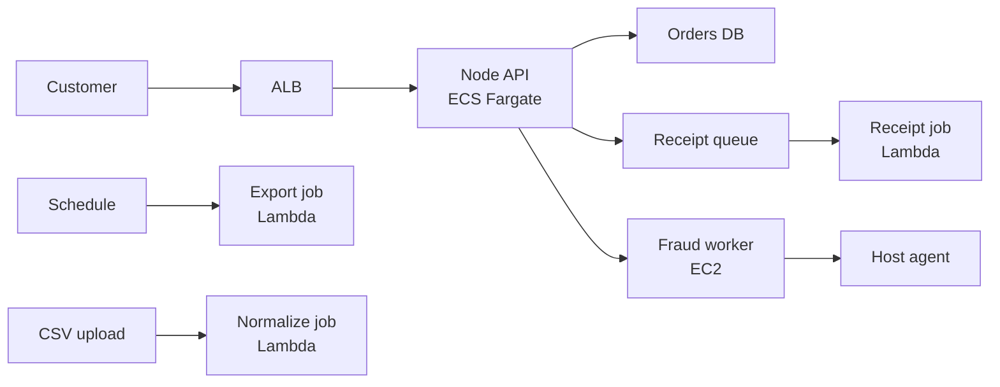

## Table of Contents

1. [The Problem](#the-problem)
2. [What Is Compute](#what-is-compute)
3. [The Workload Shape](#the-workload-shape)
4. [EC2](#ec2)
5. [ECS And Fargate](#ecs-and-fargate)
6. [Lambda](#lambda)
7. [Traffic And Events](#traffic-and-events)
8. [Scaling And Failures](#scaling-and-failures)
9. [Sample Compute Map](#sample-compute-map)
10. [Putting It All Together](#putting-it-all-together)
11. [What's Next](#whats-next)

## The Problem

A team has a Node.js API that works on a laptop. It listens on port `3000`, reads a database URL from the environment, writes logs, and handles checkout requests. Moving it to AWS sounds like one decision: "Where should we run it?"

Then the one decision splits into several real questions:

- The checkout API needs to stay online all day and answer HTTP requests quickly.
- A fraud worker needs a special OS package and a vendor agent that expects normal Linux host access.
- Receipt emails, finance exports, and stale-cart cleanup should run only when an event or schedule asks for them.
- The team wants to know who patches the machine, who restarts failed code, where logs appear, and what scales during a traffic spike.

Those are compute questions. Compute is not just "CPU in the cloud." It is the operating shape around your code: the machine or runtime it gets, how it starts, how traffic reaches it, how scaling happens, and what the team must own when it fails.

The practical mental model is simple: choose compute per workload. A long-running web service, a host-specific worker, and an event job do not need the same answer just because they belong to the same product.

## What Is Compute

Compute is the place where application code runs. In AWS, that place might look like a virtual server, a container task, or a function invocation. Each shape gives your code CPU and memory, but each shape gives your team a different job.

On your laptop, the runtime is obvious. You start the Node process, watch the terminal, and know which machine owns the files, packages, port, and logs. In AWS, those responsibilities move into services. The code still needs a process, configuration, network access, permissions, logs, and a health signal. The compute choice decides which parts are yours and which parts AWS manages around you.

Three AWS compute options make the contrast clear:

| Compute shape | AWS option | Best beginner description | What the team mainly owns |
| --- | --- | --- | --- |
| Server | EC2 | A virtual machine you operate | OS care, packages, disk, process startup, instance replacement |
| Container service | ECS with Fargate | Containers kept running without your own EC2 host fleet | Image, task definition, service health, logs, deployment, networking |
| Function | Lambda | Code invoked by events | Handler code, event source, timeout, memory, permissions, retry behavior |

The table is not a ranking. It is a way to ask a better question. Instead of asking which service is best, ask what shape the workload already has and what ownership the team can sustain.

## The Workload Shape

Before choosing EC2, ECS, or Lambda, describe the work in plain English. This protects you from comparing service features before you understand the application.

For a small orders system, the main API is a long-running HTTP service. It should have at least a few healthy copies, sit behind a front door, connect to a database, and roll forward or back during deployments. If the team already packages it as a container image, ECS with Fargate is a natural starting point because the container is the deployment unit and the service keeps copies running.

The special fraud worker has a different shape. If the vendor requires a licensed Linux package, a host-level agent, a local cache on disk, and support steps that assume VM access, the server itself is part of the workload. EC2 may be the honest answer for that component because the team needs control below the container boundary.

The receipt and export jobs have a third shape. They do not need to listen on a port all day. A queue message, S3 upload, or EventBridge schedule says that work is ready. Lambda fits that event-shaped work because the unit of operation is one invocation, not a permanently running server process.

Use a small worksheet before naming a service:

| Question | Main Node API | Special OS worker | Event jobs |
| --- | --- | --- | --- |
| Does it need to stay alive? | Yes, it listens for HTTP requests | Usually yes, or it processes long batches | No, it runs when events arrive |
| Does it need host control? | Not normally | Yes, the OS and agent matter | Usually no |
| Is a container image the package? | Yes | Maybe, but host requirements dominate | Maybe, but event shape dominates |
| What starts the work? | Service deployment and traffic | Process manager, scheduler, or job runner | Queue, upload, schedule, or API event |
| What should scale? | Number of service copies | Instances or worker processes | Concurrent invocations or event polling |
| First likely home | ECS with Fargate | EC2 | Lambda |

The most useful thing this table teaches is that the same product can use more than one compute shape. The API, worker, and jobs can share a database and still run in different places.

## EC2

Amazon EC2 gives you virtual servers called instances. You choose an Amazon Machine Image, instance type, storage, network placement, security groups, and startup path. From an application team's point of view, EC2 feels familiar because it behaves like a server you can operate.

That familiarity is valuable when the server is part of the requirement. A vendor agent might need host installation. A special runtime might need OS packages that are awkward or impossible in Fargate. A debugging workflow might require normal Linux tools, local files, sockets, and service logs. EC2 gives you that control.

The tradeoff is that control comes with care. Someone has to patch the OS, replace old images, monitor disk, supervise the process, rotate access, ship logs, and decide how failed instances come back cleanly. AWS provides the virtual server, but your team still owns the server-shaped operating model.

For the fraud worker, that might be acceptable:

| EC2 decision point | Honest answer for the special worker |
| --- | --- |
| Why not the main API shape? | The worker depends on a host agent and licensed OS package. |
| What does EC2 make easier? | Vendor support, host logs, local cache inspection, OS-level tools. |
| What new work appears? | Patching, AMI updates, disk alarms, process supervision, instance replacement. |
| What should stay elsewhere? | The normal checkout API can still run as a container service. |

The non-obvious lesson is that EC2 should not spread by gravity. One server-shaped exception does not force the whole system back onto servers. Use EC2 where the host is truly part of the design, then write down the extra ownership so nobody mistakes familiarity for simplicity.

## ECS And Fargate

Amazon ECS runs containers. A task definition describes the container image, CPU, memory, ports, environment, secrets, roles, and log settings. An ECS service keeps a specified number of tasks running and can sit behind a load balancer.

AWS Fargate is the compute mode that runs those ECS tasks without your team provisioning or scaling a cluster of EC2 container hosts. Fargate removes host fleet management. It does not remove application operations. Your team still owns whether the image starts, whether the container listens on the expected port, whether `/health` returns success, whether secrets are wired correctly, and whether logs are useful.

That is why the Node checkout API fits well. It already has a service shape:

| Need | ECS with Fargate answer |
| --- | --- |
| Run the API continuously | An ECS service keeps the desired number of tasks running. |
| Deploy a known package | The container image is the package. |
| Receive HTTP traffic | An Application Load Balancer can forward to task IP targets. |
| Prove readiness | Target group health checks call the container's health path. |
| Replace failed copies | The service scheduler starts replacement tasks when tasks fail or stop. |
| Avoid host patching | Fargate runs tasks without a self-managed EC2 host fleet. |

The gotcha is that "running" and "healthy" are not the same word. A task can start successfully and still fail the load balancer health check because the app listens on the wrong port, returns `500` from `/health`, lacks a secret, or cannot reach the database. ECS service events, task state, CloudWatch Logs, and target health belong together during diagnosis.

For many backend teams, ECS with Fargate is a strong default for long-running containerized services. It keeps the mental model close to the app the team already knows: a container listens on a port, the load balancer checks it, and the service keeps enough copies alive. The team gives up deep host control, but avoids making host care the center of the API's operation.

## Lambda

AWS Lambda runs code in response to events. You write a function handler. When an event arrives, Lambda prepares or reuses an execution environment, invokes the handler, records logs and metrics, and stops or keeps the environment for later reuse.

That shape is different from a server listening on port `3000`. The important question is not "which port does the function expose?" The important question is "which event invokes it, how long can it run, what should happen if it fails, and what downstream system can it safely call?"

For the orders system, Lambda is a good fit around the main API:

| Job | Event | Why Lambda fits |
| --- | --- | --- |
| Send receipt email | Queue message after order creation | The job is isolated, retryable, and does not need to run all day. |
| Build finance export | Schedule or object-created event | Work starts at a known time or when a file appears. |
| Normalize uploaded CSV | S3 object event | The upload is the trigger and the output can be written separately. |
| Close stale carts | Hourly schedule | A short cleanup task does not need a permanent worker. |

Lambda brings its own surprises. Event source mappings for queues and streams can process records at least once, so duplicate processing can occur. That means functions should be idempotent: handling the same event twice should not create two receipts, charge twice, or export duplicate files. Concurrency is also real pressure. More events can create more simultaneous function executions, which can overwhelm a database or third-party API if the function opens too many connections or retries too aggressively.

Lambda is not simply "the small app option." It is the event option. Use it when the work has a clear event, a bounded runtime, and a failure story based on retries, logs, destinations, or queue behavior.

## Traffic And Events

Traffic is where the compute choice meets the rest of the AWS architecture. The same Node code can be packaged several ways, but requests and events reach each compute shape differently.

For EC2, traffic often reaches an Application Load Balancer first, then the load balancer forwards to an instance and port. The instance security group, process listener, target group, and health path all have to agree. If the app binds only to `127.0.0.1`, the server may look fine locally while the load balancer cannot reach it.

For ECS with Fargate, traffic often reaches an Application Load Balancer first, then the load balancer forwards to task IPs. Each task has VPC networking, a security group, and a container port. A target can be unhealthy even while the ECS task is running, because the load balancer judges the health check response, not only whether the process exists.

For Lambda, an event source usually comes first. An API service, function URL, queue, stream, schedule, S3 event, or direct invoke asks Lambda to run the function. There is no long-running listener port unless you deliberately place Lambda behind a service that translates requests into invocations.

| Compute shape | How work arrives | First useful health signal |
| --- | --- | --- |
| EC2 | Load balancer, direct private request, job runner, or scheduler reaches a server process | Instance status, process status, listener port, target health |
| ECS with Fargate | Load balancer reaches task IPs, or the service runs background tasks | ECS service state, task logs, target health |
| Lambda | Event source invokes the function | Invocation logs, errors, throttles, duration, retries |

The non-obvious habit is to debug the entry shape first. A `503` from a load balancer, a queue with growing age, and a failed server process may all hurt the same checkout flow, but they point to different compute evidence.

## Scaling And Failures

Scaling is not only a happy-path feature. It decides what breaks first when pressure rises.

On EC2, scaling usually means changing server capacity. You might use larger instances, more instances, or an Auto Scaling group. Failures often look like server failures: full disks, failed services, unhealthy instances, missing packages, stale images, or load balancer targets that cannot connect to the process.

On ECS with Fargate, scaling usually means changing the desired task count or using service auto scaling. Failures often appear as tasks that stop, tasks that never become healthy, service events that repeat, image pulls that fail, secrets that cannot be fetched, or target groups with zero healthy tasks.

On Lambda, scaling usually means more concurrent invocations as more events arrive. Failures often appear as timeouts, throttles, repeated retries, queue backlog, duplicate processing, or downstream systems that cannot absorb the parallelism.

| Pressure | EC2 question | ECS with Fargate question | Lambda question |
| --- | --- | --- | --- |
| More HTTP requests | Do we have enough healthy instances and process capacity? | Do we have enough healthy tasks behind the target group? | Is this even an event-shaped HTTP path, and can concurrency handle it? |
| Failed startup | Did the OS, package, disk, process manager, or app config fail? | Did the image, task definition, secret, role, port, or health check fail? | Did init code, handler config, timeout, package, or permission fail? |
| Dependency pressure | Is the server exhausting connections, disk, or local resources? | Are all tasks multiplying the same bad dependency behavior? | Is concurrency overwhelming the dependency? |
| Recovery | Replace or repair instances and processes | Replace tasks or deploy a fixed task definition | Retry safely, throttle, send to a destination, or split work |

This is why compute is an ownership decision. The team should choose the failure mode it understands and can operate. EC2 gives deep inspection but more routine care. ECS with Fargate gives service-level replacement and target health but requires container-service fluency. Lambda gives event-driven execution but requires careful timeout, retry, idempotency, and concurrency design.

## Sample Compute Map

Here is the orders system after the team chooses compute per workload. The diagram is intentionally small. It shows the runtime shapes, not every network or IAM detail.

Read the map from the workload outward. The Node API is long-running, so it sits behind an Application Load Balancer as an ECS service on Fargate. The fraud worker needs host control, so it gets EC2 and the team accepts server ownership for that component. Receipt, export, and normalize jobs are event-shaped, so Lambda owns the invocation lifecycle.

The map also shows a practical design habit: split side effects away from the request path when you can. The checkout API should not wait on every receipt email or export job. It can publish a message or write a record, then let event compute handle the side effect with its own retries and logs.

## Putting It All Together

The original question was, "Where should this application code run?" The better version is, "What shape does this workload have, and what does that choice make the team own?"

For the main Node checkout API, the work is a long-running HTTP service. It needs steady copies, load balancer health checks, predictable network access to the database, secrets at startup, logs, and controlled deployments. ECS with Fargate is a good foundation because the team can operate a service made of containers without managing an EC2 host fleet.

For the fraud worker, the work depends on the host. The special OS package, vendor agent, local cache, and support workflow make EC2 the honest choice. That choice is narrow. It should not pull the normal API onto EC2 unless the API also needs server-level control.

For receipt, export, upload, and cleanup jobs, the work starts from events. Lambda fits because each job can run when asked, log one invocation path, retry according to the event design, and stop when finished. The team must design idempotency and downstream protection because event systems can retry and scale in parallel.

That gives the team a compute map instead of a slogan:

- Use ECS with Fargate for the containerized API that should stay healthy behind a load balancer.
- Use EC2 for the exceptional worker where the server itself is part of the requirement.
- Use Lambda for bounded event jobs where invocations, retries, and concurrency are the natural operating model.
- Debug each choice where that choice records evidence: target health and service events for ECS, host and process state for EC2, invocation logs and event behavior for Lambda.

Compute is where code runs, but the real decision is where responsibility lands.

## What's Next

The next article goes deeper into EC2. Now that you can name when a server-shaped runtime is the honest fit, the next question is how an EC2 instance is built and operated: AMIs, instance types, storage, security groups, startup, health, and replacement.

That server foundation matters even if ECS with Fargate becomes the default for many APIs. EC2 is still the baseline compute shape behind a lot of AWS thinking, and understanding it makes the higher-level services easier to reason about.

---

**References**

- [What is Amazon EC2?](https://docs.aws.amazon.com/AWSEC2/latest/UserGuide/concepts.html). Supports the explanation of EC2 instances as virtual servers, instance types, AMIs, storage, security groups, and scalable compute capacity.
- [Amazon ECS services](https://docs.aws.amazon.com/AmazonECS/latest/developerguide/ecs_services.html). Supports the ECS service model, desired task count, replacement of failed or unhealthy tasks, service auto scaling, and load balancer integration.
- [Architect for AWS Fargate for Amazon ECS](https://docs.aws.amazon.com/AmazonECS/latest/developerguide/AWS_Fargate.html). Supports the explanation that Fargate runs ECS containers without managing EC2 server clusters and that each Fargate task defines CPU, memory, networking, and IAM policy.
- [How Lambda works](https://docs.aws.amazon.com/lambda/latest/dg/concepts-basics.html). Supports the Lambda handler, event, execution environment, trigger, runtime, and execution role explanations.
- [Understanding Lambda function invocation methods](https://docs.aws.amazon.com/lambda/latest/dg/lambda-invocation.html). Supports the direct, synchronous, asynchronous, function URL, trigger, and event source mapping invocation model.
- [How Lambda processes records from stream and queue-based event sources](https://docs.aws.amazon.com/lambda/latest/dg/invocation-eventsourcemapping.html). Supports the event source mapping, queue and stream polling, at-least-once processing, duplicate record, batching, retry, and idempotency discussion.
- [Understanding Lambda function scaling](https://docs.aws.amazon.com/lambda/latest/dg/lambda-concurrency.html). Supports the concurrency and execution environment scaling explanation used in the Lambda and failure sections.
- [Health checks for Application Load Balancer target groups](https://docs.aws.amazon.com/elasticloadbalancing/latest/application/target-group-health-checks.html). Supports the target health, health check path, status, reason code, and healthy target routing discussion.
