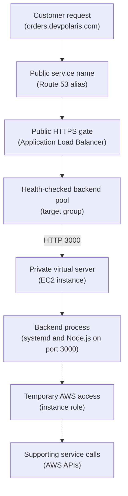

## Table of Contents

1. [The Server You Actually Operate](#the-server-you-actually-operate)
2. [The Launch Choices That Shape The Machine](#the-launch-choices-that-shape-the-machine)
3. [The Orders API On One Instance](#the-orders-api-on-one-instance)
4. [Bootstrapping With User Data](#bootstrapping-with-user-data)
5. [Running Port 3000 With systemd](#running-port-3000-with-systemd)
6. [Access, SSH, SSM, And Instance Roles](#access-ssh-ssm-and-instance-roles)
7. [Logs, Patches, And Disk Are Now Your Job](#logs-patches-and-disk-are-now-your-job)
8. [Failure Modes You Will Actually See](#failure-modes-you-will-actually-see)
9. [A Calm Diagnostic Path](#a-calm-diagnostic-path)
10. [The Tradeoff: Control And Responsibility](#the-tradeoff-control-and-responsibility)

## The Server You Actually Operate

A backend feels simple on your laptop because the machine is already yours.
You can install Node, open a terminal, run `npm start`, read logs, and kill a stuck process.
When that same backend needs to run for real users, you need a machine that is reachable, repeatable, monitored, patched, and recoverable.
Amazon EC2 gives you that machine in AWS.

Amazon EC2 is AWS's service for launching virtual servers.
AWS calls one virtual server an instance.
You choose an operating system image, choose the amount of compute and memory, put the instance in a network, attach storage, and then operate it like a Linux server.
That means you can install packages, create users, write systemd units, inspect `/var/log`, tune kernel settings, and choose exactly how your app starts.

EC2 exists because not every app fits a fully managed runtime.
Sometimes you need OS-level control.
You may need a particular package, a custom agent, a legacy binary, a one-off migration tool, direct filesystem access, or a runtime setup that is easier to express as a server than as a higher-level service.
EC2 gives you the familiar Linux shape, but it also gives you the Linux chores.

In an AWS web app, an EC2 instance usually sits inside a VPC (Virtual Private Cloud, your private network space in AWS).
Public users should normally reach a load balancer first, not the instance directly.
The load balancer checks health, receives HTTPS, and forwards only the app traffic that should reach the server.

This article follows one service, `devpolaris-orders-api`.
It is a Node.js backend that listens on port `3000`.
Customers call `https://orders.devpolaris.com`.
An Application Load Balancer, usually called an ALB, receives that request and forwards it to an EC2 instance.
On the instance, systemd keeps the Node process running.

The goal is not to memorize every EC2 option.
The goal is to understand the operating shape:
you get a real server, and now your team owns more of the runtime.
That includes access, startup, logs, patches, disk space, process health, network rules, and the IAM role the app uses when it calls AWS APIs.

## The Launch Choices That Shape The Machine

Launching an EC2 instance feels like filling out a form, but the form is really a set of operating decisions.
Each choice answers a question you will later debug.
If a teammate asks why the app cannot start, connect to AWS, receive traffic, or store logs, the answer often comes from one of these launch choices.

An AMI (Amazon Machine Image) is the boot image for the instance.
It decides the starting operating system and the first filesystem layout.
For a beginner Node backend, the AMI decision is usually simple: choose a normal Linux AMI your team knows how to patch and support.
The AMI is not the app by itself.
It is the starting machine that your app will run on.

The instance type decides the virtual hardware.
For example, a small general purpose instance gives the orders API a modest amount of CPU and memory.
If the app uses too much memory, the Linux kernel can kill the process.
If the instance is too small for traffic, the ALB may start seeing slow health checks or timeouts.
You can change instance type later, but the first choice should match the app's real memory and CPU needs, not only the cheapest line in the console.

Subnet placement decides where the instance lives in the VPC.
A subnet is a slice of the VPC in one Availability Zone.
For a public API behind an ALB, a common first design is:
the ALB lives in public subnets, and the EC2 instance lives in a private subnet.
The instance does not need a public IP address if operators use Session Manager for access and the ALB is the only public entry point.

The security group decides which packets may reach the instance.
For this service, the instance should accept TCP `3000` from the ALB security group.
It should not accept port `3000` from the whole internet.
If you choose SSH access, port `22` should be limited to a trusted source, not opened broadly.
If you choose Session Manager access, the instance does not need inbound SSH at all.

The key pair or Session Manager choice decides how humans get a shell.
A key pair is the SSH path: AWS places the public key on the Linux instance at first boot, and you keep the private key.
Session Manager is the AWS Systems Manager path: a permitted user starts a session through AWS, and the instance needs the SSM Agent, an instance role, and network access to Systems Manager.
These are different access models, so do not debug them as if they fail for the same reason.

The root volume is the boot disk.
It is usually an Amazon EBS volume (Elastic Block Store, AWS block storage that behaves like a disk attached to the instance).
For many beginner services, it stores the operating system, app files, package cache, and logs.
If it fills up, the app can fail even while CPU and memory look fine.
You can attach more EBS volumes later, but the first root volume should not be so tiny that normal logs and package updates push it to `100%`.

The instance role is the AWS identity for software on the instance.
In EC2, this role is attached through an instance profile.
An instance profile is the AWS wrapper that lets EC2 attach an IAM role to the virtual server.
Your Node process should use this role when it reads a parameter, downloads an artifact, writes to S3, or calls another AWS API.
Do not copy long-lived AWS keys into `.env` just because the app now runs on a server.

Here is the launch shape for `devpolaris-orders-api` in staging:

| Choice | Example | Why It Matters Later |
|--------|---------|----------------------|
| AMI | Team-approved Linux AMI | Sets OS, package manager, and boot defaults |
| Instance type | Small general purpose instance | Sets CPU, memory, and network baseline |
| Subnet | Private subnet in `us-east-1a` | Keeps the server away from direct internet access |
| Security group | `sg-orders-ec2` | Allows ALB traffic to port `3000` |
| Access | Session Manager preferred, SSH fallback | Decides how operators get a shell |
| Root volume | EBS root volume | Holds OS, app files, package cache, and logs |
| Instance role | `devpolaris-orders-api-ec2` | Gives the app temporary AWS credentials |

This table is not just launch documentation.
It is your future incident map.
When the service fails, each row becomes a place to prove or disprove.

## The Orders API On One Instance

The simplest useful EC2 hosting pattern has one public front door and one private server.
The user never calls the EC2 instance directly.
The user calls the domain.
DNS points the domain to the ALB.
The ALB forwards healthy requests to the instance.
The Node process listens on port `3000`.

Here is the shape:



Read the solid path first.
The ALB receives HTTPS on port `443`.
It forwards to the target group.
The target group sends traffic to the EC2 instance on port `3000`.
The Node process answers `/health` and normal API requests.

Now read the dotted path.
That is not network traffic from customers.
That is the app using its instance role to call AWS APIs.
The role does not open port `3000`.
The security group does not grant S3 access.
Those are separate checks, and keeping them separate makes debugging much calmer.

The target group is the ALB's list of backends.
For an EC2 target group, the target can be an instance ID and a port.
The health check should hit something small and honest, such as `/health`.
Do not make health checks depend on every downstream service unless you really want the ALB to remove the instance whenever one dependency is slow.

A healthy target snapshot might look like this:

```bash
$ aws elbv2 describe-target-health \
>   --target-group-arn arn:aws:elasticloadbalancing:us-east-1:123456789012:targetgroup/orders-api/abc123 \
>   --query 'TargetHealthDescriptions[].{Target:Target.Id,Port:Target.Port,State:TargetHealth.State,Reason:TargetHealth.Reason}'
[
  {
    "Target": "i-0f2c4a91b8d0e1234",
    "Port": 3000,
    "State": "healthy",
    "Reason": null
  }
]
```

The useful evidence is the target ID, the port, and the state.
If the port is `80` but your Node process listens on `3000`, the load balancer is checking the wrong place.
If the target is unhealthy, the next question is whether the process is running, the security group allows the ALB, and the health endpoint returns the expected status code.

## Bootstrapping With User Data

An empty Linux server does not become an application server by hope.
Something has to prepare it.
User data is one way to run commands when the instance launches.
On Linux instances, user data is commonly handled by cloud-init, which runs early during boot.

User data is best for first-boot setup.
It can install packages, create a service user, download a release artifact, place config files, and start a systemd service.
It should not become the only place your team understands deployment.
If a 300-line user data script is the whole production story, every instance replacement becomes a guessing game.

For `devpolaris-orders-api`, user data can do the first handoff:
prepare the machine, install Node, fetch the app release, and let systemd own the process after that.
The exact package manager depends on the AMI, so focus on the shape rather than memorizing this script.

```bash
#!/bin/bash
set -euxo pipefail

dnf update -y
dnf install -y nodejs awscli

useradd --system --home /opt/devpolaris-orders-api --shell /sbin/nologin orders
mkdir -p /opt/devpolaris-orders-api

aws s3 cp s3://devpolaris-artifacts/orders-api/releases/2026-05-02/orders-api.tgz /tmp/orders-api.tgz
tar -xzf /tmp/orders-api.tgz -C /opt/devpolaris-orders-api
chown -R orders:orders /opt/devpolaris-orders-api

systemctl daemon-reload
systemctl enable --now devpolaris-orders-api
```

The `aws s3 cp` line only works if the instance role allows the read.
That is a good thing.
The machine should prove its identity with a role instead of carrying an access key inside the script.
If this download fails with `AccessDenied`, the fix is the instance role or bucket policy, not a secret pasted into user data.

This example assumes the AMI or release artifact provides the systemd unit shown in the next section.
Some teams write the unit from user data, but keeping it in an image, package, or reviewed release artifact is easier to reason about later.

User data is also visible to people who can inspect the instance configuration.
Do not put database passwords, API tokens, or private keys in it.
Use a secrets service, parameter store, or your deployment system's secret path instead.
The boot script should arrange the machine, not become a secret drawer.

You can inspect whether user data ran by looking at cloud-init logs on the instance.
That is one of the first places to check when a new instance launches but the app never appears.

```bash
$ sudo tail -n 20 /var/log/cloud-init-output.log
Cloud-init v. 23.x running 'modules:final'
Installed:
  nodejs.x86_64
Downloaded s3://devpolaris-artifacts/orders-api/releases/2026-05-02/orders-api.tgz
Created symlink /etc/systemd/system/multi-user.target.wants/devpolaris-orders-api.service
Started devpolaris-orders-api.service
Cloud-init finished at Sat, 02 May 2026 10:18:44 +0000
```

This output proves the boot script reached the service start step.
It does not prove the app stayed healthy.
After bootstrapping, systemd and the ALB target group become the better evidence.

## Running Port 3000 With systemd

Running `node server.js` in an SSH session is fine for a quick experiment.
It is not a production process model.
When your terminal closes, the process may die.
If the app crashes, nothing restarts it.
If the machine reboots after a patch, nobody starts the app unless you remembered to type the command again.

systemd is the Linux service manager on many modern distributions.
It starts services at boot, restarts failed processes when configured, captures logs through journald, and gives operators one common command shape.
For a beginner EC2 app, systemd is the bridge between "I can run this app" and "the server can run this app without me watching the terminal."

Here is a small service unit for the orders API:

```ini
[Unit]
Description=DevPolaris Orders API
After=network-online.target
Wants=network-online.target

[Service]
Type=simple
User=orders
WorkingDirectory=/opt/devpolaris-orders-api
Environment=NODE_ENV=production
Environment=PORT=3000
ExecStart=/usr/bin/node server.js
Restart=on-failure
RestartSec=5

[Install]
WantedBy=multi-user.target
```

The most important lines are not fancy.
`User=orders` avoids running the app as root.
`WorkingDirectory` tells systemd where the app lives.
`Environment=PORT=3000` matches the ALB target port.
`Restart=on-failure` gives you a basic safety net if the process exits unexpectedly.

After the unit exists, the normal evidence starts with `systemctl`.

```bash
$ sudo systemctl status devpolaris-orders-api --no-pager
* devpolaris-orders-api.service - DevPolaris Orders API
     Loaded: loaded (/etc/systemd/system/devpolaris-orders-api.service; enabled)
     Active: active (running) since Sat 2026-05-02 10:18:42 UTC; 4min 12s ago
   Main PID: 1842 (node)
      Tasks: 11
     Memory: 96.4M
        CPU: 1.84s
```

The useful fields are `Loaded`, `Active`, `Main PID`, and memory.
`enabled` means the service should start at boot.
`active (running)` means systemd sees the process alive right now.
It does not prove the app can answer HTTP requests, so you still check the local health endpoint.

```bash
$ curl -s http://127.0.0.1:3000/health
{"status":"ok"}
```

This local check removes the ALB and security group from the story.
If local health fails, fix the app or service first.
If local health works but ALB health fails, move outward to target group port, security group, subnet routing, and health check settings.

## Access, SSH, SSM, And Instance Roles

You need a way to get a shell during setup and incidents.
Beginners often treat "I cannot connect" as one problem, but EC2 has several access paths.
Each path has different requirements.

SSH uses a key pair and network access to port `22`.
AWS stores the public key on the instance at launch.
You keep the private key on your machine.
For SSH to work, the instance must be reachable from your network path, the security group must allow inbound SSH from your source, the username must match the AMI, and your private key file permissions must be safe enough for SSH to accept.

Session Manager uses AWS Systems Manager.
SSM is the common AWS abbreviation for Systems Manager.
It does not need inbound port `22`.
It needs the SSM Agent on the instance, an instance profile that lets the instance register as a managed node, operator IAM permission to start a session, and network access from the instance to Systems Manager endpoints.
This is often better for private instances because you can avoid public IP addresses and broad SSH rules.

Here is the beginner map:

| Access Path | Needs Inbound Port 22? | Needs Key Pair? | Needs Instance Role? | Common Failure |
|-------------|------------------------|-----------------|----------------------|----------------|
| SSH client | Yes | Yes | No | Timeout, wrong username, bad key permissions |
| EC2 Instance Connect SSH | Yes | No permanent key | IAM permission | Key push succeeds but network path fails |
| Session Manager | No | No | Yes | Instance is not a managed node |

For `devpolaris-orders-api`, the preferred path is Session Manager.
The instance sits in a private subnet.
The ALB is the public entry point.
Humans do not need direct public SSH to the server during normal operation.

Access for humans is separate from access for the app.
The Node process should use the instance role when it calls AWS APIs.
On EC2, AWS exposes temporary role credentials through the instance metadata path, and AWS SDKs know how to use that provider chain.
Your app should not need `AWS_ACCESS_KEY_ID` and `AWS_SECRET_ACCESS_KEY` stored on disk.

A quick identity check from the instance is useful evidence:

```bash
$ aws sts get-caller-identity
{
  "UserId": "AROAXAMPLEEC2:i-0f2c4a91b8d0e1234",
  "Account": "123456789012",
  "Arn": "arn:aws:sts::123456789012:assumed-role/devpolaris-orders-api-ec2/i-0f2c4a91b8d0e1234"
}
```

The important clue is `assumed-role/devpolaris-orders-api-ec2`.
That says the instance is using the role intended for the orders API.
If this output shows the wrong role, or no role-backed identity at all, AWS API calls from the app will fail in confusing ways.

## Logs, Patches, And Disk Are Now Your Job

EC2 gives you control because you own the operating system surface.
That same control means you also own routine server care.
The app can be correct and still fail because the disk filled up, the OS is unpatched, log shipping stopped, or a service never came back after a reboot.

Start with logs.
systemd writes service logs to journald, the logging component that stores logs for systemd-managed services.
For a small service, `journalctl` gives you the first useful view.

```bash
$ sudo journalctl -u devpolaris-orders-api -n 8 --no-pager
May 02 10:18:42 ip-10-20-12-44 systemd[1]: Started devpolaris-orders-api.service.
May 02 10:18:43 ip-10-20-12-44 node[1842]: service=devpolaris-orders-api env=staging port=3000 msg="listening"
May 02 10:19:01 ip-10-20-12-44 node[1842]: method=GET path=/health status=200 latency_ms=3
May 02 10:21:17 ip-10-20-12-44 node[1842]: method=POST path=/orders status=201 latency_ms=48
```

Those logs prove the process started and handled traffic.
For production, you usually also ship logs off the instance, often with a CloudWatch agent or another log collector.
Local logs are helpful during a session, but they disappear from view when the instance is replaced unless you send them somewhere durable.

Patch care is the next habit.
The AMI is only the starting point.
After launch, packages age.
Security fixes arrive.
Your team needs a patch rhythm, a reboot plan, and a way to verify that the app returned healthy after patching.
On a single instance, even a short reboot can be user-visible unless another healthy target is serving traffic.

Disk care is easy to forget because the app may run fine for weeks before it fails.
Package caches, rotated logs, uploaded files, and temporary release archives all consume the root volume unless you design around them.
When disk fills, the error may appear in the app logs, system logs, package manager, or database client, depending on which write failed.

```bash
$ df -h /
Filesystem      Size  Used Avail Use% Mounted on
/dev/nvme0n1p1   20G   19G  120M 100% /
```

At `100%`, normal work becomes strange.
The app may not write a temporary file.
journald may drop logs.
Package updates may fail.
SSH or Session Manager login may still work, which can trick you into thinking the server is healthy.

The fix direction depends on the cause.
Clean old release archives if that is safe.
Rotate or ship logs.
Move app data to a separate EBS volume if it is real data.
Increase the EBS volume and grow the filesystem if the service has simply outgrown the original disk.
Do not only delete random files until the app starts, because you may erase the evidence that explains why it filled.

## Failure Modes You Will Actually See

EC2 failures often look like "the site is down" from the outside.
Inside the system, the shapes are different.
You want to match the symptom to the layer before changing anything.

The first failure is the app process being down.
The ALB can reach the instance, but nothing useful answers on port `3000`.
Target health may show a failed health check.

```bash
$ sudo systemctl status devpolaris-orders-api --no-pager
* devpolaris-orders-api.service - DevPolaris Orders API
     Loaded: loaded (/etc/systemd/system/devpolaris-orders-api.service; enabled)
     Active: failed (Result: exit-code) since Sat 2026-05-02 11:04:16 UTC; 2min ago
   Main PID: 1842 (code=exited, status=1/FAILURE)

$ sudo journalctl -u devpolaris-orders-api -n 3 --no-pager
May 02 11:04:16 ip-10-20-12-44 node[1842]: Error: Cannot find module './dist/server.js'
May 02 11:04:16 ip-10-20-12-44 systemd[1]: devpolaris-orders-api.service: Main process exited, code=exited, status=1/FAILURE
May 02 11:04:16 ip-10-20-12-44 systemd[1]: devpolaris-orders-api.service: Failed with result 'exit-code'.
```

This is not a security group problem yet.
The service is dead locally.
Fix the release artifact, working directory, start command, or environment first.
Then restart the service and confirm local `/health` before looking at the ALB.

The second failure is the security group blocking the ALB.
The app is running locally, but the load balancer cannot connect to port `3000`.

```bash
$ aws elbv2 describe-target-health \
>   --target-group-arn arn:aws:elasticloadbalancing:us-east-1:123456789012:targetgroup/orders-api/abc123 \
>   --query 'TargetHealthDescriptions[].{Target:Target.Id,State:TargetHealth.State,Reason:TargetHealth.Reason}'
[
  {
    "Target": "i-0f2c4a91b8d0e1234",
    "State": "unhealthy",
    "Reason": "Target.Timeout"
  }
]
```

If `curl http://127.0.0.1:3000/health` works on the instance, but the ALB target times out, inspect the instance security group.
For this service, inbound TCP `3000` should allow source `sg-orders-alb`.
Opening port `3000` to `0.0.0.0/0` may hide the symptom, but it breaks the intended architecture.

The third failure is the wrong instance role.
The process starts, receives requests, and then fails when it tries to read an AWS resource.

```text
2026-05-02T11:12:44Z service=devpolaris-orders-api env=staging
error=AccessDenied
action=ssm:GetParameter
resource=arn:aws:ssm:us-east-1:123456789012:parameter/devpolaris/orders-api/database-url
principal=arn:aws:sts::123456789012:assumed-role/devpolaris-web-ec2/i-0f2c4a91b8d0e1234
```

The principal is the clue.
The app is running as `devpolaris-web-ec2`, not `devpolaris-orders-api-ec2`.
The fix direction is to attach the correct instance profile or correct that role's permissions.
Do not put the parameter value in an environment file because the role is wrong.

The fourth failure is disk full.
It may show up as a Node error, a package manager error, or missing logs.

```text
2026-05-02T11:20:03Z service=devpolaris-orders-api
error=write_failed
path=/tmp/orders-cache/recent.json
cause=ENOSPC: no space left on device
```

`ENOSPC` means the filesystem has no space left.
The fix is to inspect disk usage, clean the known cause, and decide whether the volume should be larger or data should live somewhere else.

The fifth failure is the instance itself becoming unhealthy.
EC2 status checks are different from ALB health checks.
ALB health asks, "can the load balancer use this target?"
EC2 status checks ask, "does AWS or the guest instance see a machine-level problem?"

```bash
$ aws ec2 describe-instance-status \
>   --instance-ids i-0f2c4a91b8d0e1234 \
>   --query 'InstanceStatuses[].{Instance:InstanceId,System:SystemStatus.Status,InstanceStatus:InstanceStatus.Status}'
[
  {
    "Instance": "i-0f2c4a91b8d0e1234",
    "System": "ok",
    "InstanceStatus": "impaired"
  }
]
```

An impaired instance status can mean the guest OS is not healthy even if the underlying AWS host is fine.
The fix may be a reboot, log inspection, disk repair, or replacing the instance from a known-good setup.
If the system status is impaired, the underlying host path may be involved, and stop-start or replacement can move an EBS-backed instance to fresh hardware.

The sixth failure is access confusion.
SSH and Session Manager fail for different reasons.

```bash
$ ssh -i orders-staging.pem ec2-user@10.20.12.44
ssh: connect to host 10.20.12.44 port 22: Operation timed out

$ aws ssm start-session --target i-0f2c4a91b8d0e1234
An error occurred (TargetNotConnected) when calling the StartSession operation:
i-0f2c4a91b8d0e1234 is not connected.
```

The SSH timeout points to network reachability, security group rules, or the wrong address.
The Session Manager error points to SSM Agent, instance profile permissions, or network access from the instance to Systems Manager.
Do not open SSH to the internet just because Session Manager is not connected.
Fix the access path you intended to use.

## A Calm Diagnostic Path

When the orders API fails, start from the user path and move inward.
Do not begin by changing the instance.
Collect the first broken piece of evidence.
That keeps you from widening security groups, restarting healthy services, or patching the wrong role.

First, check the public edge.
Does `https://orders.devpolaris.com/health` return the expected response?
If it fails before reaching the app, DNS, TLS, listener rules, or target health may be involved.
If it returns `502` or `504`, the ALB received the request but had trouble with the backend path.

Second, check target health.
The target group tells you whether the ALB considers the EC2 instance usable.
If the reason is `Target.Timeout`, think network path or process not listening.
If the reason is `Target.ResponseCodeMismatch`, the health endpoint answered with a status code outside the expected range.

Third, connect to the instance using the intended access path.
If the design says Session Manager, debug Session Manager.
If the design says SSH, debug SSH.
Do not mix them halfway through and accidentally create a new public access path during an incident.

Fourth, test locally on the instance.

```bash
$ sudo systemctl is-active devpolaris-orders-api
active

$ curl -s -o /dev/null -w "%{http_code}\n" http://127.0.0.1:3000/health
200
```

These two checks split the problem cleanly.
If systemd is not active, stay on the server and inspect logs.
If local health is not `200`, the app or config is wrong.
If both are healthy, move outward to security groups, target group port, and ALB health check settings.

Fifth, prove the AWS identity before debugging AWS API errors.

```bash
$ aws sts get-caller-identity --query Arn --output text
arn:aws:sts::123456789012:assumed-role/devpolaris-orders-api-ec2/i-0f2c4a91b8d0e1234
```

If the role name is wrong, fix the instance profile path.
If the role name is right but the app gets `AccessDenied`, inspect the role permissions and the exact denied action.

Sixth, check disk and recent boot evidence.

```bash
$ df -h /
Filesystem      Size  Used Avail Use% Mounted on
/dev/nvme0n1p1   20G   13G  6.1G  68% /

$ sudo tail -n 5 /var/log/cloud-init-output.log
Started devpolaris-orders-api.service
Cloud-init finished at Sat, 02 May 2026 10:18:44 +0000
```

Disk proves whether the server still has room to write.
Cloud-init proves whether first-boot setup completed.
Neither replaces app logs, but both prevent you from missing basic server problems.

Here is the full diagnostic map:

| Question | Evidence | Healthy Answer | If Not Healthy |
|----------|----------|----------------|----------------|
| Does the public endpoint work? | `curl https://orders.devpolaris.com/health` | Expected HTTP response | Check DNS, TLS, listener, target health |
| Does the ALB like the target? | `describe-target-health` | `healthy` on port `3000` | Check process, port, health path, security group |
| Can operators reach the server? | SSH or Session Manager | Shell opens through intended path | Debug that access model only |
| Is the service running? | `systemctl status` | `active (running)` | Inspect unit, app release, env, restart policy |
| Does local health work? | `curl 127.0.0.1:3000/health` | `200` or expected body | Fix app before ALB |
| Is AWS identity correct? | `sts get-caller-identity` | Orders API instance role | Fix instance profile or role permissions |
| Is disk healthy? | `df -h`, `journalctl` | Space available, logs writing | Clean cause, resize, or move data |

This path is deliberately plain.
During a real incident, plain is a gift.
It lets a junior engineer gather useful evidence without needing to understand every AWS service in one sitting.

## The Tradeoff: Control And Responsibility

EC2 is attractive because it does not hide the server from you.
If you know Linux, you can use that knowledge.
You can install a debugging tool, inspect a process, pin a package, tune a service unit, mount a disk, or run a careful one-off command.
For some systems, that direct control is exactly what the team needs.

The cost is that AWS is not operating the app runtime for you.
AWS provides the virtual machine, networking primitives, storage, IAM integration, and health signals.
Your team still owns the operating system above that line.
You decide how the app is installed, how it starts, where logs go, how patches happen, how secrets are read, how disk is managed, and what happens when the instance is unhealthy.

For `devpolaris-orders-api`, the healthy EC2 design is not complicated:
an ALB receives public HTTPS, a private EC2 instance runs Node on port `3000`, systemd owns the process, the instance role gives temporary AWS credentials, and operators use Session Manager for shell access.
That design is simple enough to teach and real enough to run.

The tradeoff is clear:

| You Gain | You Own |
|----------|---------|
| Full Linux control | OS patching and reboot planning |
| Custom runtime setup | Bootstrapping and service startup |
| Direct debugging tools | Access design and audit habits |
| Attached block storage | Disk growth, cleanup, and backups |
| Instance role integration | Correct permissions and identity checks |
| ALB integration | Target health, security groups, and port alignment |

The most important habit is to keep the architecture readable.
Let the ALB be the public front door.
Let the instance security group say "ALB to port `3000`."
Let systemd say how the app starts.
Let the instance role say which AWS calls the app can make.
When those pieces are explicit, EC2 stops feeling like a mystery box and starts feeling like what it is: a Linux server in AWS that your team can operate with care.

---

**References**

- [Amazon EC2 instances](https://docs.aws.amazon.com/AWSEC2/latest/UserGuide/Instances.html) - Defines an EC2 instance as a virtual server and explains the control you have over operating system and instance setup.
- [Amazon Machine Images in Amazon EC2](https://docs.aws.amazon.com/AWSEC2/latest/UserGuide/AMIs.html) - Explains AMIs as the boot images used to launch instances and why they must match Region, OS, architecture, and storage choices.
- [Run commands when you launch an EC2 instance with user data input](https://docs.aws.amazon.com/AWSEC2/latest/UserGuide/user-data.html) - Documents Linux user data, shell scripts, cloud-init, and the need for an instance profile when user data calls AWS APIs.
- [Connect to your EC2 instance](https://docs.aws.amazon.com/AWSEC2/latest/UserGuide/connect.html) - Compares EC2 connection methods, including SSH and Session Manager, with their network, IAM, role, software, and key pair requirements.
- [IAM roles for Amazon EC2](https://docs.aws.amazon.com/AWSEC2/latest/UserGuide/iam-roles-for-amazon-ec2.html) - Explains instance profiles and how applications on EC2 instances receive role-based credentials.
- [Health checks for Application Load Balancer target groups](https://docs.aws.amazon.com/elasticloadbalancing/latest/application/target-group-health-checks.html) - Describes target group health checks, target states, and reason codes used when an ALB decides whether an EC2 target is healthy.
