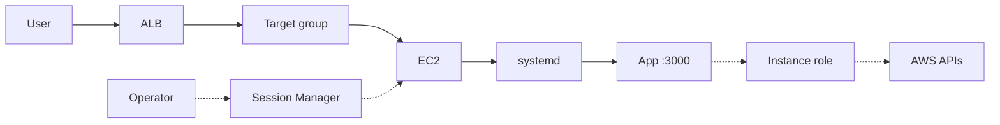

## Table of Contents

1. [The Problem](#the-problem)
2. [What Is EC2](#what-is-ec2)
3. [AMI](#ami)
4. [Instance Type](#instance-type)
5. [Subnets And Security Groups](#subnets-and-security-groups)
6. [Startup](#startup)
7. [Process Management](#process-management)
8. [Logs And Disk](#logs-and-disk)
9. [Patching](#patching)
10. [Sample Server Shape](#sample-server-shape)
11. [Putting It All Together](#putting-it-all-together)
12. [What's Next](#whats-next)

## The Problem

A team has a backend that works on a developer laptop. The app listens on a port, writes logs to disk, reads a few environment variables, and calls AWS APIs. Running it feels familiar because the machine is familiar. Someone can open a terminal, install a package, restart the process, and inspect files.

Then the app needs to run for real users, and the familiar server questions become production questions:

- Which operating system image starts the machine, and who patches it after launch?
- How does a blank server become the application server every time it is replaced?
- What keeps the app process running after a reboot or crash?
- How do operators get a shell without turning the instance into a public entry point?
- Where do logs, temporary files, package caches, and uploaded artifacts go when disk space is finite?
- Which AWS identity does the app use when it reads a secret or downloads a release?

Amazon EC2 answers these questions by giving you a virtual server. That is powerful because the server shape is flexible. It is also demanding because the server shape is yours to operate.

The main question is not "how do I launch a VM?" The main question is: what do I own when I choose a virtual server?

## What Is EC2

Amazon Elastic Compute Cloud, usually called EC2, is the AWS service for running virtual servers. AWS calls one virtual server an instance. You choose how the instance starts, what size it is, where it lives in the network, what storage is attached, and what IAM role software on the instance can use.

EC2 feels close to renting a Linux machine because you get direct control over the guest operating system. You can install packages, run a background process, configure log shipping, mount disks, tune a service manager, and inspect the filesystem. That is exactly why EC2 is still useful. Some applications need a custom agent, a legacy binary, a licensed package, a special filesystem layout, or a debugging workflow that is easier to express as a server than as a managed runtime.

The tradeoff is that AWS is not operating the application runtime for you. AWS provides the EC2 service, virtual hardware, integration with networking and storage, and machine-level health signals. Your team operates the server above that line.

| Question | EC2 gives you | Your team owns |
| --- | --- | --- |
| What boots? | An instance launched from an AMI | Choosing and refreshing the OS image |
| How big is it? | An instance type | CPU, memory, storage, and network fit for the workload |
| Where can it talk? | Subnets and security groups | The intended access path and packet rules |
| How does the app start? | User data and the guest OS | Bootstrapping, deployment, and process startup |
| Who keeps it running? | A machine that can run long-lived processes | A supervisor such as systemd and restart behavior |
| Where does state collect? | Root and attached volumes | Disk sizing, logs, cleanup, and backups |
| How does it call AWS? | An instance profile and IAM role | Least-privilege permissions for the app |

That ownership map is the mental model for the rest of the article. EC2 is server-shaped compute.

## AMI

An Amazon Machine Image, or AMI, is the image used to set up and boot an EC2 instance. It is the starting filesystem and operating system shape. When you choose an AMI, you are choosing more than a name in a console. You are choosing the Linux distribution, package manager, architecture, root volume behavior, and any software that was baked into the image.

This matters because instance replacement repeats the AMI story. If the AMI is old, every new instance starts old. If the AMI includes a half-forgotten agent, every replacement brings that agent back. If the AMI uses an architecture that does not match the instance type you want, the launch choice will not fit.

A useful beginner habit is to separate the base machine from the app release. The AMI should give you a known operating system and baseline tooling. The app release should still be versioned somewhere obvious, such as an artifact, package, or image-building pipeline. Baking everything into an AMI can work, but the team then needs a clear process for producing a new AMI whenever the OS, agent set, or app version changes.

The non-obvious part is the difference between patching one running server and patching the replacement path. A running instance can drift away from the image that created it. If you later replace the instance from the old AMI, the old state returns. EC2 gives you the freedom to repair a live server, but reliable operations come from making the repair repeatable.

## Instance Type

The instance type is the virtual hardware shape. It determines the CPU, memory, storage options, and network performance available to the instance. A small instance type may be enough for a staging API. A memory-heavy process, busy web server, search node, or high-throughput worker may need a different family or size.

This choice is easy to underthink because many tutorials pick the cheapest small instance that works for a demo. Production asks whether the process starts, has enough memory under load, enough CPU during bursts, enough network capacity for traffic, and enough storage performance for the way it reads and writes.

The symptom of a bad instance type often appears far away from the launch screen. A Node process may crash because the machine runs out of memory. Health checks may become slow because CPU is saturated. A batch job may look "stuck" because disk or network throughput is the limiting resource. The instance type is part of the runtime contract and the bill.

You can change an instance type later, and teams often should test more than one. Still, treat that as an operational change, not as a free edit. The app may need downtime, replacement, or a rollout behind a load balancer. The better habit is to choose a type from the workload's shape, then measure it with the real service running.

## Subnets And Security Groups

An EC2 instance lives inside a VPC subnet. The subnet places the instance in one Availability Zone and connects it to a route table. That placement decides whether the server is in a public entry tier, a private application tier, or a more isolated data tier.

For a normal web backend, the clean first shape is simple: put the Application Load Balancer in public subnets and put the EC2 instance in private application subnets. Users reach the load balancer. The load balancer reaches the instance. The instance does not need a public IP address just because it serves a public app.

A security group is the rule set attached to the instance's network path. For the backend server, the important rule is usually not "open port 3000." It is "allow TCP 3000 from the load balancer security group." That source matters. It says the app accepts traffic from the public front door, not from every address on the internet.

Access for humans is a separate design choice. SSH needs an inbound network path, a key pair, the right operating-system user, and a security group rule for port 22 from a trusted source. Session Manager uses AWS Systems Manager instead. It does not require inbound SSH, but the instance must be managed by Systems Manager, have the right instance role permissions, and reach the Systems Manager endpoints.

The instance role is separate again. A security group can let the load balancer reach port 3000, but it cannot grant permission to read an S3 object or fetch a parameter. Software on the instance should use the IAM role attached through the instance profile when it calls AWS APIs. Long-lived access keys copied into an environment file are a server smell, not a requirement of EC2.

The useful split is:

| Concern | EC2 choice | What it answers |
| --- | --- | --- |
| User traffic | Private subnet plus load balancer source rule | Who may send requests to the app port? |
| Operator shell | SSH or Session Manager | How do humans reach the OS during setup and incidents? |
| AWS API calls | Instance profile and IAM role | What may the app do in AWS? |

When those three concerns blur together, teams open too much network access or paste credentials onto the server. EC2 works best when each path is explicit.

## Startup

A new EC2 instance is not an application server just because it has booted. Something has to install packages, fetch or unpack the application, write configuration, and ask the operating system to start the service.

User data is the common first handoff. When you launch an instance, you can pass user data that the instance uses for automated setup. On Linux, this is often a shell script or cloud-init directive. It is useful for first-boot work: install a package, create a service user, download a release artifact, or enable a service.

Keep the script small enough that a teammate can read the operating intent:

```bash
#!/bin/bash
dnf install -y nodejs awscli
aws s3 cp s3://devpolaris-artifacts/orders-api/app.tgz /tmp/app.tgz
tar -xzf /tmp/app.tgz -C /opt/orders-api
systemctl enable --now orders-api
```

This tiny script teaches three things. The server needs packages. The app release comes from somewhere repeatable. After the files are present, a process manager owns the running app.

It also hides two common mistakes. First, user data scripts commonly run as root, so any files they create may need deliberate ownership changes before a non-root service user can read them. Second, if the script calls AWS APIs, the instance needs an instance profile with permissions for those calls. The `aws s3 cp` line should succeed because the instance role is allowed to read that artifact, not because someone pasted an access key into the script.

User data is not a secret store. People with enough permission can inspect instance configuration, and AWS documents that user data is an instance attribute. Put secrets in a secrets or parameter service and let the instance role read only what the app needs.

The deeper lesson is that startup must be reproducible. If the only working server is the one someone fixed by hand, EC2 has become a pet server. A replaceable instance needs a known AMI, a clear boot handoff, and a release artifact that can be installed again.

## Process Management

Starting the app from a terminal is a test, not an operating model. When the terminal closes, the process may die. If the app crashes, nothing restarts it. If the instance reboots after patching, nobody starts the app unless the boot path says so.

On many Linux EC2 instances, systemd is the process manager that turns an app command into a service. It defines which user runs the process, where the process starts, which environment variables are present, and what should happen when the process exits.

A small service unit shows the contract:

```ini
[Service]
User=orders
WorkingDirectory=/opt/orders-api
Environment=PORT=3000
ExecStart=/usr/bin/node server.js
Restart=on-failure
```

The important line for the load balancer is `PORT=3000`, because that must match the target group port and the instance security group rule. The important line for operations is `Restart=on-failure`, because a single process crash should not leave the server permanently dead.

Process health and load balancer health are related, but they are not the same signal. systemd can say the process is running while the app returns the wrong HTTP status. The local app can answer `/health` while the load balancer cannot reach it because a security group blocks the path. The Application Load Balancer's target health is the next layer out: it periodically sends health check requests to registered targets and routes to healthy targets.

For EC2, the clean debugging habit is to move one step at a time. Is the service active? Does the app answer locally? Does the load balancer check the same port and path? Does the instance security group allow the load balancer source? The article about runtime configuration and health checks goes deeper later. Here, the point is simpler: EC2 makes process supervision your responsibility.

## Logs And Disk

Servers collect evidence on disk. Service logs, system logs, package caches, release archives, temporary files, and crash output all have to live somewhere. On many EC2 instances, they start on the root volume unless you design a different path.

The root volume is the disk that contains the image used to boot the instance. With common EBS-backed AMIs, EC2 creates an EBS root volume from the AMI's snapshot. That volume gives the instance a familiar filesystem, but it is still finite storage. If the app writes large temporary files or logs forever, a correctly configured process can still fail because the filesystem fills.

A full root volume is rarely graceful:

```text
Filesystem      Size  Used Avail Use% Mounted on
/dev/nvme0n1p1   20G   19G  120M 100% /
```

At `100%`, strange things happen. The app may fail to write a cache file. The package manager may fail during a patch. Log capture may become unreliable. A shell may still open, which can make the instance look healthier than it is.

Local logs are useful evidence, but they are not a durable logging strategy by themselves. If the instance is replaced, stopped for repair, or deleted, the easiest view of those logs may disappear with the server workflow. Production EC2 services usually ship application and system logs to a durable place, such as CloudWatch Logs or another log platform, so incidents can be understood after the instance changes.

Disk design is part of server ownership. Keep app releases, logs, caches, and real application data conceptually separate. If the app produces durable data, it probably should not live only on the root filesystem. If logs are important, ship them. If release archives accumulate, clean them intentionally. EC2 lets you attach and resize storage, but it does not decide your disk hygiene for you.

## Patching

An AMI is a starting point, not a lifetime maintenance plan. After launch, packages age. Security updates arrive. Agents need upgrades. The kernel or userspace may need a reboot before the fix is truly active.

That makes patching more than running a command. A team needs a rhythm for updating the base image or live instances, a way to restart safely, and a way to confirm the service returned healthy. On one lonely instance, even a short reboot can be user-visible. Behind a load balancer with multiple healthy targets, patching can become a rolling operation.

EC2 status checks help separate machine health from application health. System status checks monitor the AWS systems underneath the instance. Instance status checks monitor the software and network connectivity of the individual instance. If an instance status check is impaired, the guest operating system or instance configuration may need your attention. If an ALB target is unhealthy, the app path may be broken even when the EC2 status checks pass.

That distinction prevents a common mistake. Passing EC2 status checks does not prove your Node process is listening on port 3000. Passing an ALB health check does not prove the operating system is fully patched. They answer different questions.

For beginner EC2 operations, the patching model should be boring:

| Patch question | Practical answer |
| --- | --- |
| Where do updates start? | In the base AMI, boot script, package repository, or configuration management path |
| How does the app survive reboot? | The service is enabled and supervised by systemd |
| How do users avoid downtime? | More than one healthy target, or an accepted maintenance window |
| How do you know it worked? | EC2 status checks pass, the process is active, and the load balancer target is healthy |

The goal is to avoid discovering during an urgent security update that nobody knows how to replace the server.

## Sample Server Shape

Imagine `devpolaris-orders-api`, a small Node.js backend. It receives HTTPS traffic through an Application Load Balancer, listens on port 3000 on the instance, reads a database URL from a parameter service, and writes application logs.

The server shape can be described before any command is run:

| Choice | Example | Ownership question |
| --- | --- | --- |
| AMI | Team-approved Amazon Linux image | Can we rebuild the same OS baseline? |
| Instance type | General purpose size for the API | Does the app have enough CPU, memory, and network capacity? |
| Subnet | Private app subnet | Is the server kept out of direct public entry? |
| Security group | Allow TCP 3000 from the ALB security group | Is the app port reachable only from the front door? |
| Access path | Session Manager | Can operators reach the shell without public SSH? |
| Startup | User data installs the release and enables the service | Can a replacement server become useful by itself? |
| Supervisor | systemd service | Does the app start on boot and restart on failure? |
| Disk and logs | EBS root volume plus log shipping | Where do local files go, and what leaves the instance? |
| Instance role | `orders-api-ec2` | Which AWS API calls may the app make? |

The request path is intentionally plain:



The solid path is user traffic. The load balancer receives the public request, the target group points at the EC2 instance, systemd keeps the app process alive, and the app listens on the expected port.

The dotted paths are not public traffic. Session Manager is the operator access path. The instance role is the app's AWS identity path. Keeping those paths separate makes the design reviewable. You can change app permissions without opening a port. You can change shell access without changing what the app may read from AWS.

## Putting It All Together

The opener asked what your team owns when it chooses a virtual server. The answer is the server-shaped runtime.

You own the image choice, because every replacement starts from an AMI. You own the capacity choice, because the instance type becomes the ceiling for CPU, memory, storage, and network behavior. You own the network placement, because the subnet and security group decide whether the server is a private backend or an accidental public entry point.

You own startup. A blank instance has to become an application server in a repeatable way. You own process management. The app needs a supervisor that starts it at boot and handles failure. You own logs and disk. Local files are useful until they fill the filesystem or vanish with the instance workflow. You own patching, because the operating system does not keep itself current just because it runs in AWS.

EC2 is worth choosing when that ownership is useful. If the app needs OS control, custom packages, special agents, direct filesystem access, or familiar Linux debugging, EC2 gives you the room to do it. The honest cost is that your team must operate the room it asked for.

The clean EC2 design is not mysterious:

- A known AMI gives the server a repeatable starting point.
- A suitable instance type gives the workload enough resources.
- A private subnet and security group keep the app behind the load balancer.
- User data or another bootstrap path turns the machine into the app server.
- systemd owns the long-running process.
- Logs, disk, and patching have an explicit operating plan.
- An instance profile gives the app temporary AWS credentials without long-lived keys on disk.

When those pieces are visible, EC2 stops being "a machine somewhere" and becomes a clear hosting choice: a Linux server in AWS, with flexibility you can use and responsibility you can name.

## What's Next

EC2 teaches the most server-shaped version of AWS compute. You own the operating system surface, the process supervisor, the patch rhythm, and the disk habits.

The next step is to ask what changes when the application is packaged as a container and AWS takes more of the host management away. That is where ECS and Fargate come in: the app still needs CPU, memory, networking, IAM, logs, and health checks, but the unit you operate is no longer a hand-managed virtual server.

---

**References**

- [Amazon EC2 instances](https://docs.aws.amazon.com/AWSEC2/latest/UserGuide/Instances.html). Supports the definition of an EC2 instance as a virtual server, the control over operating system setup, and the relationship between instances and instance types.
- [Amazon Machine Images in Amazon EC2](https://docs.aws.amazon.com/AWSEC2/latest/UserGuide/AMIs.html). Supports the AMI explanation, including boot software, Region, operating system, architecture, root volume type, and compatibility with instance types.
- [Amazon EC2 instance types](https://docs.aws.amazon.com/AWSEC2/latest/UserGuide/instance-types.html). Supports the explanation that instance type determines compute, memory, storage, and network capabilities, and that teams should choose based on workload requirements.
- [Amazon EC2 security groups for your EC2 instances](https://docs.aws.amazon.com/AWSEC2/latest/UserGuide/ec2-security-groups.html). Supports the security group explanation, including inbound and outbound rules, association with instances, and stateful behavior.
- [Connect to your EC2 instance](https://docs.aws.amazon.com/AWSEC2/latest/UserGuide/connect.html). Supports the comparison of SSH, EC2 Instance Connect, and Session Manager connection requirements.
- [Step 1: Complete Session Manager prerequisites](https://docs.aws.amazon.com/systems-manager/latest/userguide/session-manager-prerequisites.html). Supports the Session Manager notes about SSM Agent, managed node requirements, and outbound HTTPS connectivity to Systems Manager endpoints.
- [Run commands when you launch an EC2 instance with user data input](https://docs.aws.amazon.com/AWSEC2/latest/UserGuide/user-data.html). Supports the user data explanation, including launch-time automation, Linux shell scripts, default first-boot behavior, root execution, cloud-init output logs, and the need for an instance profile when scripts call AWS APIs.
- [IAM roles for Amazon EC2](https://docs.aws.amazon.com/AWSEC2/latest/UserGuide/iam-roles-for-amazon-ec2.html). Supports the instance role and instance profile explanation, including temporary credentials and least-privilege permissions for applications on EC2.
- [Root volumes for your Amazon EC2 instances](https://docs.aws.amazon.com/AWSEC2/latest/UserGuide/RootDeviceStorage.html). Supports the root volume explanation, including the root volume as the boot image storage and the behavior of EBS-backed root volumes.
- [Status checks for Amazon EC2 instances](https://docs.aws.amazon.com/AWSEC2/latest/UserGuide/monitoring-system-instance-status-check.html). Supports the distinction between system status checks, instance status checks, and application-level health.
- [Health checks for Application Load Balancer target groups](https://docs.aws.amazon.com/elasticloadbalancing/latest/application/target-group-health-checks.html). Supports the brief ALB target health connection, including periodic target checks and routing to healthy targets.
